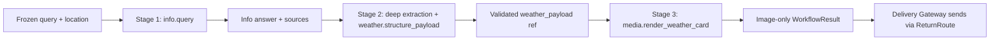

# Browser Weather Workflow Migration Plan

> Language: English | [简体中文](../zh-cn/docs/browser-weather-workflow-migration-plan.md)

Status: Implemented on 2026-07-17 after plan approval. This document records the shipped contract and validation boundary.

## 1. Goal

Move weather queries into the Browser capability branch as a dedicated capability beside internet search, then execute them through a fixed Workflow. The Workflow sends the normalized original question directly to Infinimesh Info, uses the deep model to extract evidence-backed weather fields into a structured payload, invokes a pure renderer, and sends the result through the existing Delivery Gateway. Remove the legacy TaskHint/ReAct weather path and the Open-Meteo lookup embedded in the renderer.

The intended capability tree is:

```text
root
└── browser
    ├── browser.internet_search
    ├── browser.weather
    └── browser.automation
```

This migration also preserves the model-lane policy already used by Workflow execution:

- Capability routing uses the `fast` model lane.
- Every model step after entering a Workflow uses the `deep` model lane.
- Existing context assembly and tool-result assembly remain unchanged.

## 2. Pre-Migration State

Weather is not currently a first-class capability or Workflow. It is handled by a transitional path:

1. The capability router tries the registered Browser and Document Workflows.
2. Some weather wording also matched the generic `browser.internet_search` recognizer.
3. If no Workflow matches, TaskHint heuristics recognize weather intent, select `weather_lookup`, expose `media.render_weather_card`, and enter the legacy ReAct loop.
4. `media.render_weather_card` currently owns Open-Meteo geocoding, weather lookup, field parsing, PNG rendering, and artifact persistence.
5. Existing grounding and channel adapters turn that result into a WebChat image or a Weixin image message.

Before this migration, Info served only as the generic `web.search` provider and there was no governed weather input. Although the `general_research` / `agent_context` response contains `summary`, `key_facts`, and `sources`, the implemented SparkClaw boundary intentionally consumes only `summary`. The former system therefore had both competing weather entry paths and no fixed chain from that summary through model extraction and a typed weather payload to the card.

## 3. Implemented Contract

### 3.1 Capability and Workflow IDs

Implemented canonical IDs:

| Contract | Implemented value |
| --- | --- |
| Capability | `browser.weather` |
| Workflow | `browser.weather` |
| Info semantic capability | `info.question.read` |
| Info tool | `info.query` |
| Structuring semantic capability | `weather.payload.structure` |
| Structuring tool | `weather.structure_payload` |
| Renderer semantic capability | `weather.card.render` |
| Renderer tool | `media.render_weather_card` |
| Info result resource | `info_answer` |
| Weather result resource | `weather_payload` |
| Info success signal | `info_answer_available` |
| Structuring success signal | `weather_payload_available` |
| Render success signal | `weather_card_available` |

`browser.weather` is preferred over `browser.weather_query` because other capability IDs describe the capability, not the user utterance form. The catalog revision must be incremented when the new leaf is added.

### 3.2 Route State

A matched weather route persists a typed, immutable location before Workflow execution:

```text
Status:       matched
Path:         browser -> browser.weather
Operation:    read
Query:        normalized request plus deterministic weather-card data requirements
TargetKind:   location
TargetRef:    normalized location derived from grounded user text
Format:       image by default
Facts:
  location_source: current_turn
```

Before route selection, normalization appends the weather-card retrieval requirements exactly once: current condition and temperature, optional same-day low/high values, and up to five available future hourly entries with specific date-time, condition, and temperature. It also asks Info to state unavailable data explicitly instead of inferring or substituting it. The resulting canonical request remains in `route.Slots.Query`, and the Info tool's only business argument binds to that exact query. The exact location remains a separate resource in `route.Slots.TargetRef`; it is not appended to Info arguments and is used only for consistency validation during structuring. Both resources are frozen before Workflow execution, and no later model may rewrite them.

The location extractor may normalize harmless surface variation, such as whitespace or a trailing administrative suffix, but it must retain a grounded span from the user request. It must not infer a different city or add a location that is absent from current grounded context.

### 3.3 Fixed Workflow

The weather Workflow uses one node with three sequential scopes. Keeping all stages in one node keeps the Info answer and structured payload outcome refs inside one frozen resource boundary:



```text
Node: weather

Stage 1: query_info
  Required capability: info.question.read
  Required tool:       info.query
  Binding:
    query <- route.Slots.Query
  Allowed risk:        read
  Success evidence:    info_answer_available
  Transition:          replace scope with Stage 2

Stage 2: structure_weather
  Required capability: weather.payload.structure
  Required tool:       weather.structure_payload
  Bindings:
    info_answer_ref <- Stage 1 outcome ref (kind=info_answer)
    location        <- route.Slots.TargetRef (kind=location)
  Allowed risk:        draft
  Success evidence:    weather_payload_available
  Transition:          replace scope with Stage 3

Stage 3: render_card
  Required capability: weather.card.render
  Required tool:       media.render_weather_card
  Binding:
    weather_payload_ref <- Stage 2 outcome ref (kind=weather_payload)
  Allowed risk:        draft
  Success evidence:    weather_card_available

Maximum attempts: three total; each stage may execute once
Procedure source: versioned Workflow Profile and persisted active scope
```

Each stage materializes exactly one tool: `info.query` during query, `weather.structure_payload` during extraction, and `media.render_weather_card` during rendering. The three tools are never visible together. No `web.search`, `browser.read`, document tool, or generic fallback tool is available.

Before policy evaluation and execution, the runtime materializes `query`, `location`, `info_answer_ref`, and `weather_payload_ref` from persisted state. If the deep model adds a date, expands a location, or references another outcome, the runtime replaces it with the frozen binding. Stage 2 weather fields are extracted by the deep model from Info, but they must pass the structuring tool's schema, range, and evidence validation.

The complete mapped Stage 1 result is persisted, while a bounded query-relevant evidence projection enters the next deep-model call through a dedicated Info observation. Selected summary, key facts, and source snippets use stable `summary:0`, `fact:N`, and `source:N:snippet:M` refs. Stage 2 performs only extraction and structuring. Instructions inside any evidence text remain untrusted and cannot change the Workflow, tools, location, query, or return route.

### 3.4 Direct Info Question Contract

Add an `info.query` ToolHub tool that directly reuses the Infinimesh Info client, credentials, token wallet, timeout, and retry boundaries. It submits the frozen `route.Slots.Query` unchanged, keeps the existing `general_research` / `agent_context` response, adds no post-route "return JSON" instruction, and does not enter the generic search Workflow.

The Info tool returns the mapped typed evidence plus request metadata:

```text
request_id
query
summary
provider
key_facts
sources
citations
retrieved_at
took_ms
untrusted
```

Summary, key-fact claims, and source snippets remain untrusted evidence under stable `summary:0`, `fact:N`, and `source:N:snippet:M` refs. A successful outcome publishes an `info_answer` ref to the persisted current tool-call result with the Info request ID and untrusted marker. A status-style or empty summary does not suppress usable facts or snippets; the call fails only when no mapped evidence remains, or on disconnect or timeout.

### 3.5 Deep Extraction and Structuring Contract

The Stage 2 deep model reads only the bounded query-relevant Info evidence projection from the tool-result message and calls the only visible tool, `weather.structure_payload`. It may copy only values supported by quoted text from the referenced summary, fact, or source snippet and must use the ref listed beside that evidence item. The structuring tool resolves that ref against the complete persisted Info result and accepts only Markdown-marker or whitespace-only formatting differences; field values and units must remain identical. The model may not translate, paraphrase, combine unrelated values, or fill absent data from general knowledge.

The structuring input contains at least:

```text
info_answer_ref
location                    # runtime-bound
current:
  condition?
  temperature_c?
  feels_like_c?
  humidity_pct?
  wind_kmh?
  precipitation_mm?
hourly[0..5]?
daily[]?
missing_fields[]            # current.condition/current.temperature_c/daily/hourly
evidence[]:
  field_path
  evidence_ref              # listed summary:0, fact:N, or source:N:snippet:M ref
  evidence_text             # quoted text from the referenced Info evidence item
```

`location` remains required. Current condition, current temperature, daily range, and hourly data must each contain supported values or appear in `missing_fields`; a category cannot do both. The hourly array contains zero to five available future entries, so any partial or empty Info answer remains renderable and unavailable hours are never invented. Every submitted non-derived weather field requires evidence. The tool verifies that the location equals the frozen location; the evidence ref belongs to the current `info_answer_ref`; evidence text is present after removing Markdown markers and collapsing whitespace only; values and units agree with the evidence; and numeric ranges are reasonable. An invalid optional daily or hourly section is removed and marked missing while independently validated current data remains usable; other validation failures produce no payload ref.

The tool may normalize units into the card schema but may not smooth, correct, or infer values. Clothing, umbrella, and similar suggestions come from deterministic local rules over validated fields rather than model-supplied common sense. On success, it persists a versioned payload and publishes only a `weather_payload` outcome ref.

### 3.6 Pure Weather-Card Renderer Contract

Keep the drawing, PNG writing, and ArtifactObject persistence portions of `media.render_weather_card`, but remove geocoding, Open-Meteo HTTP requests, and weather-field parsing. The renderer accepts only `weather_payload_ref`, resolves the validated payload through the governed prior tool call/outcome, and rejects model-authored locations, raw JSON, or individual weather fields.

The renderer declares semantic capability `weather.card.render`, risk `draft`, effect `workspace.write`, and output kind `image`. Its outcome adapter emits `weather_card_available` and an image path/artifact ref only when both the PNG and persisted artifact are valid.

Info errors, schema failures, location mismatches, invalid payload refs, rendering failures, and artifact persistence failures explicitly block or fail the Workflow. None may fall back to internet search, Open-Meteo, or TaskHint.

### 3.7 Result Delivery Boundary

"Send" is not a third channel-specific tool inside the weather Workflow. After rendering, the Workflow creates a channel-neutral `WorkflowResult` carrying the image ArtifactID/ResourceRef. The persisted `ReturnRoute` turns it into a `DeliveryRequest`, and the existing Delivery Gateway sends it to WebChat, Weixin, or another provider.

Successful ordinary weather results declare an `outputs_only` projection: send one weather card without a Markdown path, success notice, or duplicate text. Failed results carry concise text. This projection is declared by a typed Workflow/Profile policy, not by branching on Workflow ID in the generic runtime.

## 4. Routing Rules

The weather recognizer and generic internet-search recognizer must be disjoint. Registry resolution reports ambiguity when more than one Workflow matches, so relying only on profile order is insufficient.

Implemented precedence:

| User request | Route | Reason |
| --- | --- | --- |
| `今天杭州天气` | `browser.weather` | Direct weather lookup with explicit location |
| `查一下杭州天气` | `browser.weather` | Search wording does not override weather intent |
| `杭州未来三小时天气` | `browser.weather` | Forecast lookup |
| `北京会下雨吗` | `browser.weather` | Weather condition question |
| `weather in Hangzhou` | `browser.weather` | English direct lookup |
| `今天天气` | clarify | Location is missing |
| `杭州天气预警官方来源` | `browser.internet_search` | Requires authoritative sources/current notices |
| `杭州天气新闻` | `browser.internet_search` | News discovery rather than forecast lookup |
| `对比三个网站的杭州天气` | `browser.internet_search` | Explicit multi-source comparison |
| `打开 https://example.com/weather` | `browser.automation` | Explicit URL navigation |
| `杭州空气质量` | `browser.internet_search` in v1 | Current weather tool does not retrieve air-quality data |

The generic search profile must explicitly reject ordinary direct weather requests. The weather profile must explicitly reject news, official-warning-source, multi-source comparison, URL-navigation, and unsupported environmental-data requests.

### 4.1 Location Extraction

V1 deterministically extracts the location from the current normalized user message, supporting at least:

- `今天杭州天气`
- `杭州今天的天气`
- `查一下上海天气`
- `北京会下雨吗`
- `weather in Hangzhou`
- `Hangzhou forecast`

If a weather intent is clear but the location cannot be grounded, return a clarification route with a missing-location reason. Do not silently use the server location, account location, IP location, or a model-invented default.

Contextual follow-ups such as `那上海呢` remain deferred until the context snapshot exposes a typed, provenance-bearing location contract. V1 therefore fails closed.

## 5. Legacy Weather Path Removal

Remove weather behavior from the transitional TaskHint/ReAct chain after the new Workflow tests pass:

- Delete the weather-specific instruction from the TaskHint prompt.
- Delete weather overrides from TaskHint normalization.
- Delete the weather branch from TaskHint heuristics.
- Delete or relocate weather recognizer helpers that only serve TaskHint.
- Remove `media.render_weather_card` from TaskHint candidate-tool aliasing and fallback exposure.
- Replace old TaskHint weather tests with capability-route and Workflow tests.
- Delete the migrated `weather_lookup` Skill package so unmatched ReAct requests cannot activate it.

Keep the following components:

- The Go drawing and PNG artifact generation portions of `media.render_weather_card`.
- The Infinimesh Info client, credentials, token wallet, timeout, and retry boundary.
- Weather artifact persistence.
- Generic media grounding and image-link generation.
- WebChat media serving.
- Weixin image upload and dispatch.
- The versioned `browser.weather` Workflow Profile, fixed stage scopes, and governed argument bindings as the complete procedure source. The plan stores no Skill ID and Workflow prompts load no Skill text.

Also remove the renderer's Open-Meteo geocoding, lookup, parsing functions, and their dedicated tests. The migration preserves card visuals and delivery support while making Info the single weather-data source.

## 6. Completed Delivery Phases

### Phase A: Info Evidence and Weather-Payload Contracts

- Define the `info_answer` ref, stable evidence indexes, and result-size bounds.
- Define the `weather_payload` schema, minimum/optional fields, units, and ranges.
- Define the evidence mapping from every extracted field to quoted text under its listed `summary:0`, `fact:N`, or `source:N:snippet:M` ref, allowing only Markdown-marker and whitespace normalization.

### Phase B: Contract Tests

- Add catalog, route-contract, recognizer, location-extraction, and ambiguity tests.
- Add three-stage scope, two outcome-ref transfers, argument materialization, result projection, and failure tests.
- Add assertions proving ordinary weather no longer enters TaskHint.

### Phase C: Typed Capability and Tool Metadata

- Add constants for capability, Workflow, target kind, semantic tool capability, outcome adapter, and signal.
- Add `browser.weather` to the Browser catalog and bump its revision.
- Register `info.query` and `weather.structure_payload`, then convert `media.render_weather_card` into a pure renderer.

### Phase D: Weather Routing

- Normalize and extract a grounded location before route selection completes.
- Add the weather profile and make generic search explicitly exclude direct weather lookups.
- Return clarification for missing locations and ambiguity for genuinely conflicting evidence.

### Phase E: Fixed Workflow and Delivery Projection

- Register one weather node with three sequential scopes.
- Materialize `query`, `location`, `info_answer_ref`, and `weather_payload_ref`.
- Reuse the existing context and tool-result assembly.
- Verify that all Workflow model calls use the `deep` lane.
- Verify that the Stage 2 deep model can submit only fields grounded in Info and cannot fill absent data.
- Produce an image-only `WorkflowResult` and send it through the existing ReturnRoute and Delivery Gateway.

### Phase F: Old Chain Removal

- Remove TaskHint weather selection, aliases, heuristics, and activation keywords.
- Remove Open-Meteo lookup/parsing from the renderer while retaining drawing, grounding, and channel adapters.

### Phase G: Documentation, Evaluations, and Validation

- Update English and Chinese architecture/development documentation.
- Update affected eval fixtures and golden prompts.
- Run focused package tests, `go test ./services/gateway/...`, the WebChat build, `bash scripts/doctor.sh`, and `bash scripts/run-eval.sh`.
- Run the inline Python bilingual-doc check from `.github/workflows/ci.yml`; this repository currently has no standalone `scripts/i18n_docs_check.sh`.

## 7. Test Matrix

Minimum required coverage:

| Layer | Required assertions |
| --- | --- |
| Catalog | Browser has three sibling leaves; weather requires a location target |
| Normalization | Every user message is normalized once before routing; weather-card data requirements are appended once; route and Workflow see the same canonical request |
| Recognition | Chinese and English positives; warning/news/AQ/URL negatives; no overlap with internet search |
| Slots | Exact query and location are frozen; missing location clarifies |
| Model lanes | Fast for capability route; deep for every Workflow model step |
| Info request | Sends the frozen query unchanged to `info.query`; adds no formatting prompt and enters no generic search Workflow |
| Info result | Persists the complete mapped result and exposes only a bounded query-relevant summary, fact, source-snippet, and citation projection in Deep context under stable refs with the untrusted marker |
| Scope | The three stages expose only `info.query`, `weather.structure_payload`, and `media.render_weather_card`, respectively |
| Arguments | A model-added date, expanded location, or substituted answer/payload ref cannot change bound resources |
| Extraction | The deep model submits only supported values; current condition, current temperature, daily range, and hourly data each have values or an explicit `missing_fields` marker |
| Evidence validation | Every field's evidence ref/text belongs to the current Info answer and agrees on value and unit |
| Transition | `info_answer_available` enters structuring; `weather_payload_available` enters rendering |
| Rendering | Renderer performs no network request, consumes only the validated prior payload ref, filters past timestamps across midnight, never substitutes one weather value for another, and renders explicit missing data as unavailable |
| Tool outcome | Valid persisted media yields `weather_card_available`; malformed output fails closed |
| Legacy removal | TaskHint cannot select or expose the weather tool |
| WorkflowResult | Success contains exactly one governed image part; failure contains concise text |
| Channels | The same WorkflowResult displays in WebChat and sends through Weixin using ReturnRoute |
| Failure | Info timeout, disconnect, or schema failure does not retry through web search, Open-Meteo, or ReAct |

Info tests use a local HTTP fixture for tokens, unchanged frozen canonical queries, agent-context answers, timeouts, and disconnects. Extraction tests cover current-only answers, zero to five future hours, rejection of a sixth hour, optional-field omission, absent or mismatched evidence, invalid ranges, wrong locations, and prompt-injection text. A credential-gated live smoke may remain, but it must not be the only end-to-end coverage. Renderer tests prove that a fixture payload produces a card with network access disabled.

## 8. Observability and Rollback

Add or preserve structured fields for:

- Redacted normalized-query summary or digest; do not write raw Info queries to public logs.
- Selected capability and Workflow ID.
- Frozen location and its provenance.
- Model lane for route and execution calls.
- Current stage, materialized tool name, and argument-binding source.
- Info request ID, evidence-entry count, latency, and error category.
- Deep extraction model lane, payload schema version, and validation-failure reason.
- Weather payload ref and provenance, without logging the full external payload.
- Persisted artifact ID and media path.
- Workflow terminal status, outcome signal, and delivery receipt.

The implementation should be split so the new capability/profile can be disabled independently during rollout. Rollback must restore the prior release behavior as a code/config change, not by leaving both routing paths active indefinitely. Dual routing would recreate the ambiguity this migration is intended to remove.

## 9. Approved Decisions

The implementation follows these approved decisions:

1. **Canonical ID:** use `browser.weather` for both capability and Workflow.
2. **Missing location:** clarify; never infer a default city.
3. **Authoritative warnings/news/comparisons:** keep them on `browser.internet_search`.
4. **Air quality:** keep it on internet search until the weather provider/tool has an explicit AQ contract.
5. **Context follow-ups:** defer `那上海呢`-style resolution from prior turns until a typed, provenance-bearing context location is available.
6. **Info query:** use the existing `general_research` / `agent_context` direct question query; do not require a weather-specific Info schema.
7. **Extraction boundary:** use the deep model to extract weather structure; bind every submitted field to quoted text from its listed `summary:0`, `fact:N`, or `source:N:snippet:M` evidence item, allowing only Markdown-marker and whitespace normalization; record unavailable categories in `missing_fields`, and create the payload ref only after deterministic validation.
8. **Successful output:** v1 is image-only and automatically sends one card through the original ReturnRoute. Explicit plain-text weather requests stay outside this card Workflow until a separate `format=text` result projection is defined.
9. **Failure policy:** Info disconnects or evidence-validation failures fail explicitly without fallback to generic search, Open-Meteo, or legacy ReAct. A completed Info answer with unavailable weather fields produces an explicit missing-data card.

These decisions, the field-evidence rules, and the removal boundary in Section 5 were approved before implementation began.
