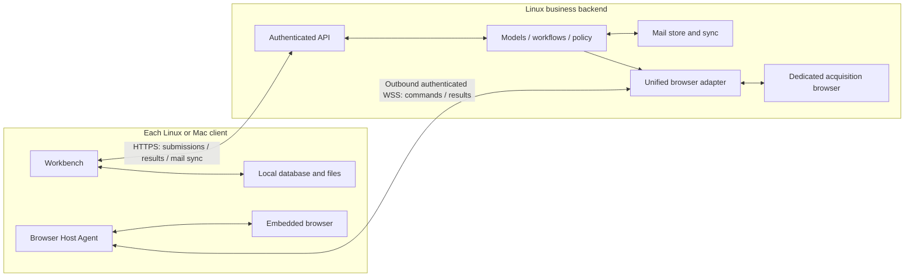

# Client and backend architecture R3

> Language: English | [简体中文](../zh-cn/docs/client-backend-architecture-design.md)

Date: 2026-09-30. Status: user-confirmed product boundary; implementation and migration pending. This is the target architecture for SparkClaw's own clients. [Architecture](architecture.md), [Store](store.md), and [WebChat](webchat.md) describe the current implementation where explicitly marked. This document does not claim a deployed data migration or change an accepted cross-project contract.

## 1. Confirmed boundary

The backend is the business processing core. Clients present results, accept user actions, store their own non-mail data, and provide constrained local execution facilities. They connect over the LAN. A client currently using a loopback address is colocated with the backend; this is a deployment choice, not a different product architecture.

**Mail is authoritative on the backend and can synchronize to clients. Conversations, messages, task history, generated files, and all other non-mail user data belong to each client locally.** The user's explicit clarification replaces R2.1/R2.2's shared conversation/database assumption. Two clients using the same Owner and backend do not automatically see or continue each other's conversations. Export/import, if later implemented, is an explicit copy, not database replication.

The backend still performs model inference, routing, workflows, policy checks, approval verification, scheduling of admitted work, and result production. Local storage and executing a validated browser command do not make a client a second business backend. Client-supplied history is input, never authorization or proof of an approved action.

## 2. Storage ownership

| Data | Durable authority | Backend processing / client copy |
|---|---|---|
| Mail accounts, messages, original bodies, attachments, mail-service summaries/topics, collection cursors | Backend mail store | Clients keep authorized, revisioned mail caches; server credentials do not synchronize |
| Conversations, messages, draft inputs, task history, displayed approvals and results | Originating client | Backend receives only the context needed for the current execution |
| Non-mail documents, generated files, downloads, screenshots, user memory and preferences | Client local database/files | Backend accesses explicitly supplied inputs and transient outputs, not a shared user workspace |
| Client browser cookies, profiles, login state and download directory | That client | No backend or cross-client profile replication |
| Backend dedicated-browser profile | Backend infrastructure | Used only for backend acquisition/operations; it is not a copy of a client profile |
| Service configuration, identity/device authorization, revocation, minimal execution fences | Backend control store | Operational metadata only; no conversation text, prompt, DOM, document body or output archive |

An email attachment remains part of backend mail storage. A user-saved attachment copy or a report generated in a conversation is a local client file. A mail reference in a local conversation does not move that conversation into the mail store. Only typed mail-service records qualify for backend mail retention; a general task cannot label arbitrary output as mail to retain it.

“Other data is local” describes durable user-data ownership. Bounded temporary processing is necessary for backend execution. Prefer memory; when a tool requires disk, use an isolated encrypted spool with a deadline and byte limit, excluded from backups, indexes and ordinary logs. Delete it after durable client acknowledgement or expiry. Content-bearing traces, model caches, tool logs and error reports follow the same rule. Payload-free diagnostics and minimal idempotency/fencing records are not a history database; define and audit their field allowlist.

Backend acquisition of non-mail data also uses ephemeral page/cache/download storage; a persistent infrastructure login profile does not authorize persistent browsing history or captured user content. Mail storage and client-local browser profiles retain their respective ownership rules.

The initial TTL, per-task/Owner capacity, and control-record retention must be frozen and tested before implementation qualification. Admission fails when these limits are unavailable or exhausted. There is no indefinite backend result mailbox, and this design cannot guarantee unlimited offline recovery without another durable copy.

## 3. Topology and connection

One configured, authenticated workbench origin serves business and mail APIs. LAN deployment uses HTTPS with verified server identity; host control uses authenticated outbound WSS. No public CDP/debugger port, database port, shared filesystem, or client inbound listener is required. The colocated Linux transport may optimize to loopback/IPC while preserving the same authorization, client identity and ownership rules.

The existing strict v1 loopback descriptor remains a current implementation constraint. Add a versioned connection loader for LAN origins, certificate trust, deployment identity and client credentials; do not broaden the old parser implicitly. Application login and permission to execute on a browser host are distinct grants. Revoke hosts independently, keep secrets in the platform credential store, and scope events/results to their originating client.

## 4. Client storage and backend task context

Introduce a ClientStore owned by the desktop main process: transactional local conversation/message/task records, schema migrations, an outbox, an event cursor and a file manifest. Use a client-local SQLite database and atomic file writes; the renderer accesses typed IPC rather than database paths or arbitrary filesystem operations. Local-store failure blocks submission or delivery acknowledgement instead of silently reverting to server persistence.

Separate UI dependencies into ClientStore, ExecutionClient and MailSyncClient. Model/routing policy stays in the backend. The backend context builder consumes a bounded invocation context from the client, plus authorized backend mail references; it must not read another client's conversation history from the legacy Store. Context selection remains subject to backend limits and validation. Do not upload the full local database.

Each installation has its own authenticated client_id. Bind executions to owner_id + client_id + local_conversation_id + local_task_id + request_id. Treat these as distinct from legacy global session IDs. Restore/import into a different installation creates a new client identity and preserves source IDs only as provenance; copied outboxes must not automatically replay accepted work.

The same shared React UI may also run in an ordinary browser, but it needs its own local-storage adapter (IndexedDB/file export), quota/eviction warnings and origin-migration policy. It cannot silently use backend history as a fallback. Desktop durability and embedded automation qualification do not prove browser-only durability or native-host capability. The current Web client keeps its implemented behavior until an explicit migration; it is not already R3 compliant.

## 5. Execution and reliable delivery

1. Commit the user input, bounded context snapshot and request_id to the local outbox before submission. The backend validates identity, scope, budgets and the request digest, then returns an execution handle.
2. The backend performs business work. Browser steps are bound to a specific role/host/page; file inputs use leased opaque handles or bounded uploads. Never interpret a client filesystem path as a backend path.
3. Return events/results with execution identity, monotonic sequence and content digest. Commit each locally and install verified output files atomically before sending the corresponding durable delivery acknowledgement. A transport ACK or “execution completed” does not prove local file delivery.
4. Lost acknowledgements cause bounded redelivery of the same event/result, deduplicated by the client. An uncertain submit or write uses lookup/reconciliation against the original request_id; reconnecting never creates a fresh write request automatically.
5. On disconnection, stop issuing new client-browser commands; its lease expires locally and fences queued work. Backend-only steps may finish within their admitted processing budget. Pause before exceeding temporary-storage limits. A disappeared client cannot receive an unlimited background task backlog.
6. After the retention window, erase transient content and report delivery_expired with minimal non-content execution status. Do not present an undelivered output as locally available or rerun a side effect to reconstruct it. Read-only regeneration requires a new explicit task; uncertain writes require reconciliation.

Backend restart recovery uses minimal persisted fences/digests and the client's local outbox/context, not a second conversation database. Loss of the client can mean loss of non-mail history and undelivered output. Backups are client-local/user-managed. Side-effect fencing survives transient payload cleanup and must not be erased to enable retries.

Non-mail schedule definitions and their history are also local. A connected client registers a bounded execution lease with the backend; the backend decides and runs admitted jobs, while client availability supplies context and a durable result destination. Do not promise arbitrary non-mail jobs continue forever after that client exits. The backend's resident mail collector is a separate mail-service responsibility and continues without a client.

## 6. Two browser roles, one adapter

| Role | Purpose and location | Presentation and storage |
|---|---|---|
| backend_acquisition | Backend data acquisition and authorized operations, including resident mail collection | Dedicated backend browser; not a remote client viewport; only mail and infrastructure state are durable there |
| client_embedded | Browser activity for a client's interactive task | Real embedded browser on that client; profiles, downloads and user-facing artifacts stay local |

A unified BrowserHostAdapter exposes capabilities, acquire/renew/release, dispatch/result/events, cancellation and reconciliation. Backend local transport and client remote transport implement the same validated operations. The executor remains on the backend; a client Host Agent translates granted commands to its actual embedded WebContents. Preserve existing Controller/Bridge boundaries, managed page assets and App-CLI's public interfaces.

Client browser automation **only runs inside the client's embedded browser**. Do not spawn standalone task browser windows, automate a personal/system browser, or silently substitute the backend dedicated browser. Backend service collection may explicitly use backend_acquisition; that is a different execution step and role, not a fallback page. Colocated Linux client and backend still have separate profiles, storage scopes and lifecycle ownership.

Bind commands and replies to client/conversation/task, host_id, runtime_generation, connection_epoch, lease_id, page_id, page_generation and authorization digest. Enforce fencing at the browser resource, not only at the server socket. Control ACK, cancellation and business completion remain distinct. Losing a response never proves a write did not happen. Reject stale replies after reconnect, page replacement or conversation switching.

Each local conversation has its own page mapping. Switching A/B selects the corresponding existing embedded page; late A results cannot overwrite B. A conversation without a page shows an empty state. Hiding the panel does not mean cancel; destruction/exit revokes its resources. Same-client windows may move/focus the actual page, but automation remains in an embedded view and cannot create a second controller for it.

## 7. What synchronizes

Mail synchronizes from the backend by Owner/mailbox, server revision, cursor and deletion tombstone. Clients apply each batch transactionally, then advance the cursor. Detect cursor gaps/epoch changes and obtain a bounded snapshot. Offline caches show their last-sync state; deleting a cache is distinct from requesting server mail deletion. Mail writes and conflicts are validated by the backend against the expected revision and original request key. Credentials, raw profiles and another client's local data are never included.

The embedded page stays in step with its own backend commands because it is the same page being operated on, not because screenshots are streamed. Task events and page binding metadata synchronize within that execution. There is **no automatic cross-client conversation, browser-session or pixel synchronization**. Opening the same URL on two devices produces independent pages. Any future explicit URL/navigation sharing is limited state transfer, not guaranteed arbitrary DOM, login or playback equivalence.

## 8. Existing implementation and migration

| Existing component | Required change |
|---|---|
| Gateway Store sessions/messages/runs/artifacts and server history-based context | Separate mail/control stores from transient execution; add client-supplied bounded context and local delivery protocol |
| React workbench reads shared server sessions | Add ClientStore/ExecutionClient/MailSyncClient; local conversation/task ownership and visible delivery state |
| Desktop main starts local services; descriptor accepts loopback only | Split client composition from backend service composition; add versioned LAN pairing and local persistence |
| Local UDS adapter/loopback relay and global page presentation | Add authenticated broker/remote transport, role grants and conversation/page bindings; retain local validation |
| Backend workspace and artifact URLs | Replace non-mail retention with client file manifests and leased temporary transfers; keep mail attachments in mail storage |

Migration is a separate, reviewable operation, not a documentation side effect. Inventory legacy non-mail records, files, logs, traces, caches and backups. Assign each existing conversation/data set to an explicit destination client; never fan out a server database to every client. Preserve references with an ID map, counts and hashes, and keep mail references resolvable.

Drain active tasks; fence old writers; export and verify local durable imports before cutover. Unassigned data blocks final legacy-store cleanup. Define a bounded rollback window and an explicit cleanup manifest; do not retain old server histories indefinitely under the name “backup,” or delete existing user data merely because R3 is documented. Rollback must preserve execution fences and cannot replay imported outboxes. Migrate one scoped client/data set at a time, with old/new paths unable to write the same history.

## 9. Cross-project boundaries and unresolved gates

The accepted App-CLI contract requires durable request bindings, journals and execution fencing; JingSi Runtime v1 requires durable lookup/result/event recovery. These contracts are not silently replaced by client-local history. Mail-specific journals fit the backend mail responsibility; non-mail payload retention and externally-owned tasks still need a field-by-field compatibility design.

Before modifying either external interface, retention guarantee or executor ledger, file a ProjectGroup-2 decision and obtain acceptance, then update contracts and qualification together. Existing integrations keep their current contract during this documentation phase; that is an implementation gap, not a permanent exception to R3's target. A connector without a durable client destination cannot be declared migrated. This document introduces no new cross-project wire schema.

Remaining implementation gates are concrete: freeze spool/lease/retention budgets and the control-record allowlist; inventory and assign legacy data; settle external integration retention through the accepted decision process; qualify the ordinary Web storage path; and validate Mac runtime, embedded-site compatibility and packaging on hardware. None changes the confirmed client/backend ownership decision.

## 10. Delivery order and acceptance

P0 freezes data classification, protocol/retention budgets, migration manifests and required cross-project decisions. P1 builds client-local storage and bounded context submission. P2 adds LAN identity, execution delivery/acknowledgement and mail sync. P3 adds the shared browser adapter with embedded-only client routing. P4 migrates files/history and qualifies failure recovery. P5 qualifies Mac packaging/hardware and scoped cutover. Testable prototypes may precede migration; no phase silently changes production.

| ID | Required evidence |
|---|---|
| A01 | Mac and Linux share backend mail, but have independent local conversations/messages/tasks/files, even under the same Owner |
| A02 | Colocated Linux uses the same logical API and ownership boundary; no implicit database or filesystem sharing |
| A03 | Backend completes a task using bounded client context; non-mail bodies do not remain in Store, logs, caches or backups after cleanup |
| A04 | Local database failure/disk full blocks submit or delivery ACK; no output is falsely reported saved |
| A05 | Lost submit/result/ACK and client/backend restart reconcile one execution without duplicate side effects |
| A06 | TTL/quota exhaustion pauses or expires delivery predictably; no unbounded backlog or automatic resend |
| A07 | Both Mac and Linux client browser tasks operate the actual embedded page; no standalone/system-browser or backend substitution |
| A08 | Same backend adapter controls authorized backend acquisition and client embedded roles with isolation and equivalent command semantics |
| A09 | Rapid A/B switching, host/page restart and late replies cannot cross-bind conversations or acquire duplicate controllers |
| A10 | Client disconnect/sleep/exit/revocation fences commands at the host; unknown writes stay unresolved until reconciled |
| A11 | Mail incremental sync, tombstones, cursor reset, offline cache and revision conflicts preserve backend authority |
| A12 | Resident backend mail collection continues after all clients exit; non-mail client schedules follow bounded availability semantics |
| A13 | Mail attachments remain backend mail records; saved copies and generated reports are verified client files |
| A14 | Migration verifies counts/hashes/ID mapping and unassigned data; rollback retains fences and does not replay outboxes |
| A15 | Invalid certificates, wrong deployment/client/Owner and expired host grants fail closed; no exposed raw CDP or copied profiles |
| A16 | Mac GUI/architecture/signing/upgrade and Web storage limitations are independently qualified; no inference from Linux tests |

All R3 cases are pending. Earlier shared-database and Electron qualification remains evidence for the older implementation only. Platform details: [Mac design](macos-lan-desktop-design.md) and [Mac connection guide](macos-connection-guide.md).
