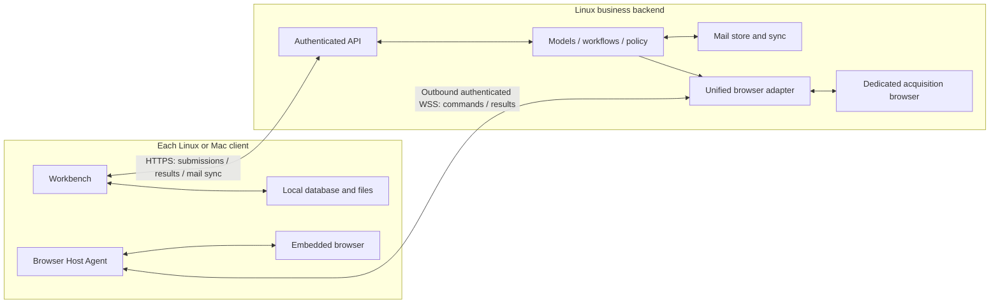

# Client and backend architecture R3

> Language: English | [简体中文](../zh-cn/docs/client-backend-architecture-design.md)

Date: 2026-10-03. Status: the user confirmed product ownership, no legacy test-data migration, offline task behavior, and section 2's backend temporary-processing/control-record boundary including the 24-hour maximum for undelivered results; P0–P5 Linux/shared source and applicable isolated checks are complete; Mac qualification and production cutover remain pending. See the [implementation and acceptance ledger](client-r3-implementation.md). This is the target architecture for SparkClaw's own clients. [Architecture](architecture.md), [Store](store.md), and [WebChat](webchat.md) describe the current implementation where explicitly marked. This document does not claim deployment, data deletion or changes to accepted cross-project contracts.

> Local Web exception (2026-10-06): [Local WebChat access](local-webchat-access-design.md) allows the existing browser UI on the controlled host-loopback entrance to use independent local Owner authority without manual credential entry. Independent desktop installations keep first-login unlock. Browser R3 installation and local storage remain a separate phase; local Owner authority alone grants no installation or executable host capability.

## 1. Confirmed boundary

The backend is the business processing core. Clients present results, accept user actions, store their own non-mail data, and provide constrained local execution facilities. They connect over the LAN. A client currently using a loopback address is colocated with the backend; this is a deployment choice, not a different product architecture.

**Mail is authoritative on the backend and can synchronize to clients. Conversations, messages, task history, generated files, and all other non-mail user data belong to each client locally.** The user's explicit clarification replaces R2.1/R2.2's shared conversation/database assumption. Two clients using the same Owner and backend do not automatically see or continue each other's conversations. Export/import, if later implemented, is an explicit copy, not database replication.

The backend still performs model inference, routing, workflows, policy checks, approval verification, scheduling of admitted work, and result production. Local storage and executing a validated browser command do not make a client a second business backend. Client-supplied history is input, never authorization or proof of an approved action.

## 2. Storage ownership

The user confirmed this boundary: non-mail business data is durably owned by clients; the backend may perform bounded temporary processing, retain results for limited delivery, and persist necessary service configuration and minimal deduplication records. This does not authorize durable backend archives of non-mail bodies, complete task history or generated files.

| Data | Durable authority | Backend processing / client copy |
|---|---|---|
| Mail accounts, messages, original bodies, attachments, mail-service summaries/topics, collection cursors | Backend mail store | Clients keep authorized, revisioned mail caches; server credentials do not synchronize |
| Conversations, messages, draft inputs, task history, displayed approvals and results | Originating client | Backend receives only the context needed for the current execution |
| Non-mail documents, generated files, downloads, screenshots, user memory and preferences | Client local database/files | Backend accesses explicitly supplied inputs and transient outputs, not a shared user workspace |
| Client browser cookies, profiles, login state and download directory | That client | No backend or cross-client profile replication |
| Backend dedicated-browser profile | Backend infrastructure | Used only for backend acquisition/operations; it is not a copy of a client profile |
| Service configuration, identity/device authorization, revocation, minimal execution fences | Backend control store | Operational metadata only; no conversation text, prompt, DOM, document body or output archive |

An email attachment remains part of backend mail storage. A user-saved attachment copy or a report generated in a conversation is a local client file. A mail reference in a local conversation does not move that conversation into the mail store. Only typed mail-service records qualify for backend mail retention; a general task cannot label arbitrary output as mail to retain it.

The confirmed backend storage scope has four concrete categories:

| Category | Contents and purpose | Confirmed retention |
|---|---|---|
| Active temporary inputs/intermediates | Current question, necessary context, supplied file and tool-read page excerpts used in this computation | Prefer memory; use a temporary directory only when required; clean when no longer needed, execution finishes/is canceled, or its deadline expires |
| Undelivered results | Model answer, generated file and result events not yet acknowledged as durably saved by the client | Delete immediately after durable client acknowledgement; at most 24 hours from generation for unacknowledged results, with capacity limits taking precedence |
| Service identity/configuration | Paired device IDs, credential-verification material, device grants/revocations, backend model connection configuration and required secrets | Retain as service configuration with rotation/revocation support; not client conversation history |
| Minimal execution deduplication records | Request/client IDs, request digest, admission/execution/terminal flags, authorization/lease generations | Persist for the deduplication/reconciliation window independently of temporary results; exclude task text, conversation titles, model answers, files and page content |

For example, Mac submits a PDF summarization task: the original stays on Mac; the backend receives a temporary processing copy. Once Mac durably saves and acknowledges the summary, the backend deletes its copy and summary. If Mac disconnects, the summary can wait briefly for delivery. A separate content-free request marker prevents reconnection from repeating the same write operation. Ordinary diagnostics retain necessary error codes, timings and counts, not input/output bodies.

“Other data is local” describes durable user-data ownership. Bounded temporary processing is necessary for backend execution. Prefer memory; when a tool requires disk, use an isolated encrypted spool with a deadline and byte limit, excluded from backups, indexes and ordinary logs. Delete it after durable client acknowledgement or expiry. Content-bearing traces, model caches, tool logs and error reports follow the same rule. Payload-free diagnostics and minimal idempotency/fencing records are not a history database; define and audit their field allowlist.

Backend acquisition of non-mail data also uses ephemeral page/cache/download storage; a persistent infrastructure login profile does not authorize persistent browsing history or captured user content. Mail storage and client-local browser profiles retain their respective ownership rules.

Undelivered results expire at their generation time plus 24 hours; reconnects, retries and service restarts do not extend this deadline. Acknowledgement triggers earlier cleanup; expiry stops delivery and triggers cleanup. Startup recovery checks deadlines before serving content. Inputs/intermediates follow task necessity and execution deadlines; service configuration and minimal deduplication records do not inherit the results' 24-hour cleanup rule.

Per-task/Owner capacity, lease duration and control-record retention are now frozen and tested in the [implementation ledger](client-r3-implementation.md#frozen-storage-identity-and-capacity). Admission fails when required limits are unavailable or exhausted. There is no indefinite backend result mailbox, and this design cannot guarantee unlimited offline recovery without another durable copy.

## 3. Topology and connection

One configured, authenticated workbench origin serves business and mail APIs. LAN deployment uses HTTPS with verified server identity; host control uses authenticated outbound WSS. No public CDP/debugger port, database port, shared filesystem, or client inbound listener is required. The colocated Linux transport may optimize to loopback/IPC while preserving the same authorization, client identity and ownership rules.

The existing strict v1 loopback descriptor remains a current implementation constraint. Add a versioned connection loader for LAN origins, certificate trust, deployment identity and client credentials; do not broaden the old parser implicitly. Application login and permission to execute on a browser host are distinct grants. Revoke hosts independently, keep secrets in the platform credential store, and scope events/results to their originating client.

### 3.1 First login and service unlock

The user requires each client installation to unlock service access using a SparkClaw service credential on first login. Reuse the product's existing service credential/Token concept, not a Mac account password, Git credential, mailbox password or model API key. This also applies to colocated Linux; LAN reachability or packaged configuration is not proof of login.

The first-use flow is: paste one backend-issued connection credential → main extracts and verifies the backend certificate/service identity before sending its device token → backend verification and installation identity establishment → unlock authorized services. Backend identity and token remain separate internally, but the user does not assemble them in two UI steps. Until success, expose only first-connection/login UI and necessary connectivity checks; do not submit tasks, synchronize mail or establish an executable host channel. The backend validates authentication and business requests; a frontend “unlocked” flag is never authorization.

Successful login binds backend-confirmed deployment_id, owner_id and this installation's client_id, registering a revocable client session/credential under the existing permission model. Raw input is used only for authentication, never logged or persisted in source, packages, ordinary configuration or desktop renderer localStorage. Desktop main keeps the device token in the platform credential store, using Keychain on Mac, and keeps only the public pinned identity in its controlled descriptor. The one-value enrollment bundle reuses the Token issued for this device, with retrieval specified below; no additional exchange endpoint is introduced.

Later launches may reconnect with valid local credentials, while the server still authenticates every access. Invalid/revoked credentials, explicit logout or a different backend identity require login again. Temporary disconnection reports service unavailability, neither granting new authority nor clearing valid credentials as if they were incorrect. Logout clears the corresponding credentials and stops protected channels without deleting client-local conversations/files.

Unlock grants this client only its authorized service access. It does not globally unlock the backend, disable authentication or approve tool writes. Browser execution still requires host grants and task authorization; backend mail/client-local non-mail ownership is unchanged. Existing WebChat Token entry and desktop preprovisioned credentials are reusable baselines. The first-login gate and secure desktop persistence now have Linux/shared implementations; server installation registration is implemented; Mac Keychain qualification remains pending. See the [phase ledger](client-r3-implementation.md).

### 3.2 Credential retrieval and device management

This section defines the required behavior. The host-only retrieval/recovery CLI, reachable settings and main-owned desktop unlock have been implemented; scoped checks and outstanding gates are in the [phase ledger](client-r3-implementation.md). Per-client credentials already exist: `GET /api/clients` lists devices, `POST /api/clients` issues a separate credential, `POST /api/clients/{id}/revoke` revokes a device, and `GET /api/workbench/identity` verifies login identity. Issuance requires authenticated management authority and an `Idempotency-Key`; an unauthenticated user cannot claim a credential directly. `PairedClientsSettings` is now connected through the settings sidebar, inspector and settings panel, with route-level tests.

The credential is a service-access Token reused by a device, not a new code for every connection. Issue one for each installation; after first entry, reuse a valid credential across launches, temporary disconnects and WSS reconnects. Connection generations may change without changing client_id or the valid credential. Reuse the issued Token in this phase rather than adding an exchange endpoint. Show plaintext only during retrieval; persist its verification hash and device-management metadata on the backend, with no plaintext lookup. Existing issuance temporarily retains plaintext in memory for same-key retries for at most 10 minutes; this is not a recoverable long-term credential store.

**Initial setup entry.** After backend deployment, show a clear local entry and instructions to retrieve the first client credential. `npm run credentials:initial -- --name "My Mac"` is implemented; private provisioning and the new Gateway local-management listener must be installed first. See [deployment prerequisites and recovery](deployment.md#initial-device-credential-and-recovery). The deployment user runs it in an interactive terminal on the backend host. The tool reads the controlled local deployment descriptor and management credential, validates directory/file ownership, permissions, non-symlink paths, deployment identity and trusted local origin, verifies identity with the backend, then uses existing issuance to create a separate client_id and Token for the target client. Implementation uses an independent private local-management credential over Unix socket; it has no authority on the network API. Do not copy the preprovisioned Desktop Token to Mac or count automatic login as R3 first-login acceptance.

The tool shows the new Token once in an explicitly interactive terminal, alongside the device name, deployment identity and login purpose. Ordinary deployment logs show retrieval instructions only. Never put the Token in Git, packages, ordinary configuration, command-line arguments, pipeline output or claim receipts. Receipts retain only necessary deployment/target-device IDs, request key, status and timestamps. Persist the request key before issuance; timeout or response loss retries the same key without automatically creating a second device. When a backend restart or expiration of the 10-minute retention makes plaintext unrecoverable, direct the user to revoke the unclaimed device and issue another credential, rather than claiming the old Token can be retrieved again. Repeating a completed initial retrieval points to device management without redisplaying the old credential.

**Settings entry.** Add a direct, searchable “Settings → Devices & credentials” item to the authenticated workbench, connected through the actual settings route to existing issuance/list/revocation APIs. Provide a device-name input, issue button, one-time credential display, copy action and “Saved, hide credential” action. List device name, device ID, current-device marker, creation time, last activity and revocation status. Last activity does not establish live online status. Never list old Tokens; revocation does not delete client-local conversations/files.

Keep a successful credential visible until the user hides it or leaves the page, without writing it to page persistence. Deliver the credential display before independently refreshing the list; a refresh failure must not discard a successful issuance. Include loading, issuing, successful copy/manual-copy fallback, empty list, load retry and revocation-error states. An unknown issuance outcome retries the original key and device name within the current page lifetime; an unrecoverable conflict directs the user to revoke the unclaimed entry and reissue. Do not promise recovery of unsaved plaintext after leaving the page.

**Revocation and loss recovery.** Revoke the selected device, reject its subsequent requests, and terminate its protected long-lived connections/host grants. Return that client to login and clear the corresponding secure-store entry. Writes already dispatched to websites still follow unknown-outcome reconciliation. Other devices and backend mail collection continue working. Revoking a user device must not prevent the backend from starting again; implementation must remove the startup coupling between preprovisioned Desktop Client registration and revocable user-device state. Warn before revoking the current device that it will end this login, then stop protected channels immediately on success.

If a credential is lost, another authenticated device revokes the lost device and issues a new credential. If all user devices are locked out, provide an explicit recovery operation restricted to the backend host's deployment user: revalidate local deployment/management authority, revoke the selected lost device and issue a new identity. Do not add an anonymous LAN claim endpoint, resurrect a revoked Token on restart, or redisplay an old Token as recovery. Deliver the actual initialization/recovery commands and permission conditions together with implementation.

| Implementation location | Required work |
|---|---|
| `scripts/provision-local-workbench.mjs`, local/remote deployment scripts | Preserve deployment-identity output and credential protection; add retrieval hints and separate interactive initialization/recovery tooling, with no secrets in ordinary deployment logs |
| Gateway Client issuance/revocation and identity validation | Reuse existing APIs, hash storage and same-key retries; complete revocation effects on long-lived connections/host grants and service restart, with server-enforced management authority |
| `settingsSidebar.tsx` → `inspector.tsx` → `SettingsPanel`/`PairedClientsSettings` | Connect real navigation and complete issuance, copying, status, revocation and recovery; verify the actual route rather than only an isolated component |
| Desktop main/restricted IPC/connection loader | Accept input, verify deployment/Owner/client identity, and securely persist and restore the Token; use Keychain on Mac without renderer persistence |

This section adds no App-CLI/JingSi protocol or external-ledger change. Initialization, device management and secure login persistence belong to P2; actual commands and permissions are now recorded in the deployment and Mac connection guides. Remaining P2 gates are tracked separately.

## 4. Client storage and backend task context

Introduce a ClientStore owned by the desktop main process: transactional local conversation/message/task records, schema migrations, an outbox, an event cursor and a file manifest. Use a client-local SQLite database and atomic file writes; the renderer accesses typed IPC rather than database paths or arbitrary filesystem operations. Local-store failure blocks submission or delivery acknowledgement instead of silently reverting to server persistence.

Separate UI dependencies into ClientStore, ExecutionClient and MailSyncClient. Model/routing policy stays in the backend. The backend context builder consumes a bounded invocation context from the client, plus authorized backend mail references; it must not read another client's conversation history from the legacy Store. Context selection remains subject to backend limits and validation. Do not upload the full local database.

Each installation has its own authenticated client_id. Bind executions to owner_id + client_id + local_conversation_id + local_task_id + request_id. Treat these as distinct from legacy global session IDs. Restore/import into a different installation creates a new client identity and preserves source IDs only as provenance; copied outboxes must not automatically replay accepted work.

The same shared React UI may also run in an ordinary browser, but it needs its own local-storage adapter (IndexedDB/file export), quota/eviction warnings and origin-migration policy. It cannot silently use backend history as a fallback. Desktop durability and embedded automation qualification do not prove browser-only durability or native-host capability. The current Web client keeps its implemented behavior until an explicit migration; it is not already R3 compliant.

## 5. Execution and reliable delivery

The user confirmed the offline policy: backend mail collection continues; client-embedded-browser tasks pause dispatch and become fenced when the lease expires; backend-only computation may continue within its admitted budget, retaining undelivered results for at most 24 hours from generation with section 2's cleanup rules. A write already sent to a website cannot necessarily be paused; preserve an unknown outcome and reconcile it.

1. Commit the user input, bounded context snapshot and request_id to the local outbox before submission. The backend validates identity, scope, budgets and the request digest, then returns an execution handle.
2. The backend performs business work. Browser steps are bound to a specific role/host/page; file inputs use leased opaque handles or bounded uploads. Never interpret a client filesystem path as a backend path.
3. Return events/results with execution identity, monotonic sequence and content digest. Commit each locally and install verified output files atomically before sending the corresponding durable delivery acknowledgement. A transport ACK or “execution completed” does not prove local file delivery.
4. Lost acknowledgements cause bounded redelivery of the same event/result, deduplicated by the client. An uncertain submit or write uses lookup/reconciliation against the original request_id; reconnecting never creates a fresh write request automatically.
5. On disconnection, stop issuing new client-browser commands; its lease expires locally and fences queued work. Backend-only steps may finish within their admitted processing budget. Pause before exceeding temporary-storage limits. A disappeared client cannot receive an unlimited background task backlog.
6. After the retention window, erase transient content and report delivery_expired with minimal non-content execution status. Do not present an undelivered output as locally available or rerun a side effect to reconstruct it. Read-only regeneration requires a new explicit task; uncertain writes require reconciliation.

Backend restart recovery uses minimal persisted fences/digests and the client's local outbox/context, not a second conversation database. Loss of the client can mean loss of non-mail history and undelivered output. Backups are client-local/user-managed. Side-effect fencing survives transient payload cleanup and must not be erased to enable retries.

Non-mail schedule definitions and their history are also local. A connected client registers a bounded execution lease with the backend; the backend decides and runs admitted jobs, while client availability supplies context and a durable result destination. Do not promise arbitrary non-mail jobs continue forever after that client exits. The backend's resident mail collector is a separate mail-service responsibility and continues without a client.

## 6. Two browser roles, one adapter

| Role | Purpose and location | Presentation and storage |
|---|---|---|
| backend_acquisition | Backend data acquisition and authorized operations, including resident mail collection | Dedicated backend browser; not a remote client viewport; only mail and infrastructure state are durable there |
| client_embedded | Browser activity for a client's interactive task | Real embedded browser on that client; profiles, downloads and user-facing artifacts stay local |

A unified BrowserHostAdapter exposes capabilities, acquire/renew/release, dispatch/result/events, cancellation and reconciliation. Backend local transport and client remote transport implement the same validated operations. The executor remains on the backend; a client Host Agent translates granted commands to its actual embedded WebContents. Preserve existing Controller/Bridge boundaries, managed page assets and App-CLI's public interfaces.

Client browser automation **only runs inside the client's embedded browser**. Do not spawn standalone task browser windows, automate a personal/system browser, or silently substitute the backend dedicated browser. Backend service collection may explicitly use backend_acquisition; that is a different execution step and role, not a fallback page. Colocated Linux client and backend still have separate profiles, storage scopes and lifecycle ownership.

Bind commands and replies to client/conversation/task, host_id, runtime_generation, connection_epoch, lease_id, page_id, page_generation and authorization digest. Enforce fencing at the browser resource, not only at the server socket. Control ACK, cancellation and business completion remain distinct. Losing a response never proves a write did not happen. Reject stale replies after reconnect, page replacement or conversation switching.

Each local conversation has its own page mapping. Switching A/B selects the corresponding existing embedded page; late A results cannot overwrite B. A conversation without a page shows an empty state. Hiding the panel does not mean cancel; destruction/exit revokes its resources. Same-client windows may move/focus the actual page, but automation remains in an embedded view and cannot create a second controller for it.

## 7. What synchronizes

Mail synchronizes from the backend by Owner/mailbox, server revision, cursor and deletion tombstone. Clients apply each batch transactionally, then advance the cursor. Detect cursor gaps/epoch changes and obtain a bounded snapshot. Offline caches show their last-sync state; deleting a cache is distinct from requesting server mail deletion. Mail writes and conflicts are validated by the backend against the expected revision and original request key. Credentials, raw profiles and another client's local data are never included.

The embedded page stays in step with its own backend commands because it is the same page being operated on, not because screenshots are streamed. Task events and page binding metadata synchronize within that execution. There is **no automatic cross-client conversation, browser-session or pixel synchronization**. Opening the same URL on two devices produces independent pages. Any future explicit URL/navigation sharing is limited state transfer, not guaranteed arbitrary DOM, login or playback equivalence.

## 8. Existing implementation and clean-start cutover

| Existing component | Required change |
|---|---|
| Gateway Store sessions/messages/runs/artifacts and server history-based context | Separate mail/control stores from transient execution; add client-supplied bounded context and local delivery protocol |
| React workbench reads shared server sessions | Add ClientStore/ExecutionClient/MailSyncClient; local conversation/task ownership and visible delivery state |
| Desktop main starts local services; descriptor accepts loopback only | Split client composition from backend service composition; add versioned LAN pairing and local persistence |
| Local UDS adapter/loopback relay and global page presentation | Add authenticated broker/remote transport, role grants and conversation/page bindings; retain local validation |
| Backend workspace and artifact URLs | Replace non-mail retention with client file manifests and leased temporary transfers; keep mail attachments in mail storage |

The user explicitly confirmed that existing product data is test data with no migration value. Do not build legacy export/import, destination-client assignment, history ID mapping or migration compatibility. R3 starts with new client-local data, without automatically loading/copying old backend conversations, task history or generated files. Legacy-data destinations no longer block implementation.

Cutover still drains/stops old executions, fences old writers and verifies fresh storage initialization and mail-service connectivity. Omitting test-data migration does not mean clearing mail-service directories, deployment secrets or the active App-CLI/JingSi deduplication ledger together; those resources follow their operational/contract rules. Reset/clean old test business data within an explicit scope at actual cutover; this staged implementation performs no deletion of existing backend data. Future client schema upgrades still need version management, separately from migrating today's legacy test data.

## 9. Cross-project boundaries and unresolved gates

The accepted App-CLI contract requires durable request bindings, journals and execution fencing; JingSi Runtime v1 requires durable lookup/result/event recovery. These contracts are not silently replaced by client-local history. Mail-specific journals fit the backend mail responsibility; non-mail payload retention and externally-owned tasks still need a field-by-field compatibility design.

Before modifying either external interface, retention guarantee or executor ledger, file a ProjectGroup-2 decision and obtain acceptance, then update contracts and qualification together. Existing integrations keep their current contract; this source delivery does not claim their production cutover. A connector without a durable client destination cannot be declared migrated. This document introduces no new cross-project wire schema.

Product boundaries and Linux/shared capacity/lease/control allowlists are implemented and qualified within the recorded scope. The user excludes InfiniCenter coordination and waiting for 0031 in this round. Ordinary Web storage, future external-interface changes and Mac runtime/site/packaging hardware qualification remain separate gates. Legacy test-data migration is out of scope.

## 10. Delivery order and acceptance

The build handoff is confirmed: this environment implements source and validates Linux/shared code, delivering through Git; the user synchronizes and compiles locally on Mac. Mac compilation/packaging/signing does not run here or require an SSH-operated build. Mac builds do not block Linux implementation or source delivery; A16/Mac-specific qualification depends on the user's exact-commit hardware evidence and remains pending until received.

P0 freezes data classification, protocol/retention budgets, fresh-storage initialization and required cross-project decisions. P1 builds client-local storage and bounded context submission. P2 adds credential retrieval/device management/secure login, LAN identity, execution delivery/acknowledgement and mail sync. P3 adds the shared browser adapter with embedded-only client routing. P4 completes file delivery and failure recovery. P5 delivers source/build preparation and Linux checks, then hands off Mac packaging/hardware and clean-start cutover qualification to the user. No legacy test-data migration is implemented, and no phase silently changes production.

| ID | Required evidence |
|---|---|
| A01 | Mac and Linux share backend mail, but have independent local conversations/messages/tasks/files, even under the same Owner |
| A02 | Colocated Linux uses the same logical API and ownership boundary; no implicit database or filesystem sharing |
| A03 | Backend completes a task using bounded client context; non-mail bodies do not remain in Store, logs, caches or backups after cleanup |
| A04 | Local database failure/disk full blocks submit or delivery ACK; no output is falsely reported saved |
| A05 | Lost submit/result/ACK and client/backend restart reconcile one execution without duplicate side effects |
| A06 | Durable ACK triggers immediate cleanup; undelivered results expire 24 hours after generation without reconnect/restart extension; capacity exhaustion pauses/rejects admission without automatic resend; deduplication records survive result cleanup |
| A07 | Both Mac and Linux client browser tasks operate the actual embedded page; no standalone/system-browser or backend substitution |
| A08 | Same backend adapter controls authorized backend acquisition and client embedded roles with isolation and equivalent command semantics |
| A09 | Rapid A/B switching, host/page restart and late replies cannot cross-bind conversations or acquire duplicate controllers |
| A10 | Client disconnect/sleep/exit/revocation fences commands at the host; unknown writes stay unresolved until reconciled |
| A11 | Mail incremental sync, tombstones, cursor reset, offline cache and revision conflicts preserve backend authority |
| A12 | Resident backend mail collection continues after all clients exit; non-mail client schedules follow bounded availability semantics |
| A13 | Mail attachments remain backend mail records; saved copies and generated reports are verified client files |
| A14 | New clients start with empty non-mail storage and no legacy test history; cutover fences old executions without accidentally clearing service identity/recovery ledgers or replaying old requests |
| A15 | Invalid certificates, wrong deployment/client/Owner and expired host grants fail closed; no exposed raw CDP or copied profiles |
| A16 | Mac GUI/architecture/signing/upgrade and Web storage limitations are independently qualified; no inference from Linux tests |
| A17 | Fresh Mac/Linux clients require SparkClaw credential verification to unlock; empty/invalid/revoked credentials cannot submit tasks, sync mail or execute browser commands; verify secure persistence, restart recovery, login on backend change and logout without local-data deletion |
| A18 | Backend initialization provides a clear retrieval entry issuing a separate target-device identity; interactive one-time display only, no Token in logs/ordinary configuration/Git, and no retrieval or copying of the preprovisioned Desktop Token |
| A19 | Actual “Settings → Devices & credentials” navigation supports issuance, copying/manual copying, hiding, list refresh and revocation; load failure is not an empty list, and refresh failure does not discard issued plaintext |
| A20 | Reconnect/restart reuses a valid credential while different devices have different identities; revocation rejects APIs and closes protected channels without affecting other devices, backend mail, backend restart or client-local history |
| A21 | Issuance timeout/lost response recovers with the same key without duplicate devices; retention expiry/backend restart directs revocation and reissuance; completed initialization never redisplays, and total user-device lockout requires controlled local recovery without resurrecting old credentials |

Linux/shared PASS, scoped PARTIAL evidence and NOT_RUN Mac/production gates are in the [implementation ledger](client-r3-implementation.md). Earlier shared-database and Electron qualification remains evidence for the older implementation only. Platform details: [Mac design](macos-lan-desktop-design.md) and [Mac connection guide](macos-connection-guide.md).
