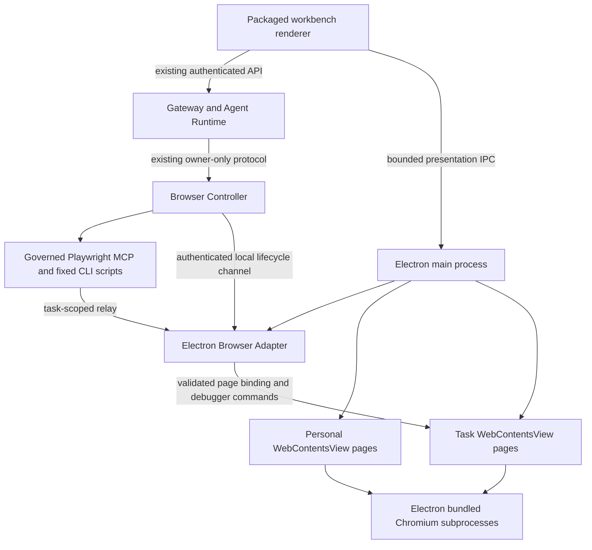

# Desktop Client And Embedded Browser Design

> Language: English | [简体中文](../zh-cn/docs/desktop-client-embedded-browser-design.md)

> Status: architecture accepted by the owner on 2026-09-21. All software-only
> implementation phases are complete and the ARM64 candidates are qualified;
> provider credentials, target hardware, and release/cutover remain owner gates.
> Electron's bundled Chromium is the sole target browser runtime. The current
> production runtime has not been switched.

Implementation resumption: read the [Electron implementation handoff](desktop-electron-implementation-handoff.md)
for the current code state, ordered work, qualification gates, and desktop test boundaries.

## Decision Summary

SparkClaw packages the existing React/Vite workbench in Electron and uses
Electron's bundled Chromium to render and execute personal and task pages.
`WebContentsView` is the in-window browser view. Electron/Chromium manages the
renderer, GPU, network, and other subprocesses; SparkClaw manages page identity,
ownership, layout, and lifecycle rather than manually spawning a process per tab.

The existing automation approach remains: Gateway admission, owner-scoped
Browser Controller, governed Playwright MCP, fixed Playwright CLI/provider
scripts, and the Browser Bridge's task-scoped command boundary. An Electron
Browser Adapter ports that boundary to Electron APIs. Preserving the control
approach does not mean the current Chrome extension can be loaded unchanged.

The sole target architecture excludes external Chromium window adoption,
`surface-host`, X11 reparenting, dedicated/nested X servers, Xephyr, Xpra,
remote-window streaming, CEF, and a custom Chromium fork. They are neither
implementation stages nor automatic fallbacks. The retired
[surface-host experiment](../tools/browser-surface-host/README.md) is historical
diagnostic source only, with no product-runtime or release role. Its isolated
Electron-anchor suite qualifies only the old native-window boundary and does not
qualify the Electron adapter or `WebContentsView` architecture.

## Current Baseline And Scope

The repository now has the React/Vite workbench with an optional typed desktop
panel, Browser Bridge `1.0.26`, Browser Controller, and a qualified Electron
`44.4.3` runtime using bundled Chromium `152.0.7977.130`. The separately deployed
standalone Chromium `148.0.7778.0` remains the unchanged production baseline until
an authorized cutover. The old native-window experiments do not provide evidence
for this design. Post-incident logs establish that the reported desktop
failure was a GNOME Shell/Mutter compositor `SIGSEGV` after active-display X11
window manipulation; they do not identify the exact internal Mutter defect.

This decision changes SparkClaw's internal browser implementation plan. Gateway
public APIs, model tools, authorization, approvals, audit, provider effect
semantics, JingSi Runtime v1, and other cross-project contracts remain unchanged.
A newly discovered cross-project change requires an accepted central decision
before implementation; it must not be hidden inside the adapter.

Implementation evidence and the remaining owner gates are recorded in the
[Electron handoff](desktop-electron-implementation-handoff.md) and the
[desktop release and cutover plan](desktop-release-plan.md).

The first delivery target remains Linux/ARM64 on the managed DGX Spark desktop.
Electron uses the host's supported display backend normally; the application
must not manipulate unrelated native windows or start a second display server.
Gateway, models, Store, and Browser Controller remain existing services.

## Product Layout

One SparkClaw window contains the task sidebar, conversation, and right-hand
browser workspace. Preserve the 1440 x 900 initial size and 1180 x 720 minimum.

| Region | Default | Behavior |
|---|---:|---|
| Task sidebar | 244 px | Existing collapse and navigation |
| Conversation | Flexible, minimum 520 px in split mode | Existing chat and approvals |
| Divider | 6 px | Keyboard and pointer resize; no task viewport mutation |
| Browser workspace | 640 px, 480-760 px in split mode | My browsing / Task observation |

The default split needs at least 1410 px before borders and padding. Below the
available-width threshold, browser focus mode occupies the main workspace while
navigation stays accessible. Collapsing the sidebar can make room for a wider
personal page. No panel opens itself merely because a task starts.

The panel contains a 44 px header, the selected browser view, and a status area.
SparkClaw supplies personal tab controls, address/navigation controls, download
and permission UI; `WebContentsView` does not supply Chrome's complete browser
chrome. These controls live in trusted client UI outside remote page content.
Task observation has an authorized page selector and task identity, without
editable address, close-tab, takeover, or resume controls.

### Personal Pages And Task Pages

- Personal and task pages are separate `WebContents` instances in separate
  ownership registries, not separate external Chromium windows.
- A personal tab is created only by a user action or a validated personal-login
  flow. Creating, switching, closing, or restoring it never grants Agent access.
- Task pages are created through Controller acquisition and retain existing
  lease, completion, cancellation, and cleanup rules. They never become personal
  tabs. A popup inherits its opener's role and task binding before navigation;
  unclassified windows are denied.
- Users may select any currently authorized task page to observe. Observation
  selection is independent of the Controller/provider's automation target.
- Selection, collapse, resize, and My browsing navigation do not acquire/release
  task sessions, move the automation target, or synthesize task-page input.
- A page reference binds owner, role, task/session, browser generation, and page
  generation. A renderer-supplied process ID or `webContents.id` is not authority.

### Sessions And Login

Use a dedicated persistent Electron browser Session shared by personal and task
pages to preserve the previously agreed shared-login behavior. Use a separate
Session for the privileged workbench. Separate renderer processes do not imply
separate cookies, accounts, or storage.

The Electron browser Session has its own storage directory and a single runtime
owner. Never point Electron at the existing standalone Chromium profile, open
that profile concurrently, or promise binary profile compatibility. Existing
cookies/passwords/passkeys are not exported or copied. Initial enrollment uses
normal sign-in in a personal Electron tab where the provider supports it; old profile data stays intact until
an explicit retirement policy is applied. This replaces the earlier promise of
keeping the old browser profile in place without a login transition.

**Qualification item: website login and Session persistence.** The current
SparkClaw flow is user sign-in to the provider website, with cookies retained
inside the browser Session and reused by task pages. It does not request Google
OAuth API tokens on SparkClaw's behalf. The OAuth embedded-user-agent policy
alone therefore does not establish that this flow is blocked; it applies if an
actual Google OAuth authorization flow is involved. Separately, Google's account
help documents possible rejection of sign-in from embedded browsers. That is a
browser-environment compatibility concern, not a prohibition on storing cookies
and not evidence that SparkClaw has already failed. The isolated fixture proves
persistent Cookie sharing and restart, but no real provider sign-in has been
performed. Establish a provider-supported path
to the actual website session before claiming feature parity; evaluate QQ,
Outlook, and the AI sites independently as well. An external OAuth callback or
API access token does not automatically establish the Gmail website session
needed by the existing page scripts. Neither a changed user-agent nor a one-off
successful login proves supported compatibility. If a required provider lacks
a supported path within the chosen architecture and control requirements,
block full cutover and resolve that product gap explicitly with the owner;
do not silently add another engine, import cookies, or replace page workflows
with API workflows. See [Google account browser guidance](https://support.google.com/accounts/answer/7675428)
and [Google OAuth browser policy](https://developers.google.com/identity/protocols/oauth2/policies#browsers).

Personal logout/account switching can affect task authentication. Providers
must revalidate the expected account at existing operation boundaries and block
mismatches. Login-required tasks direct users to an exact personal login page.
A subsequent login check follows normal admission and safe retry rules, never
replays an uncertain send or resumes a manually edited task page. Challenges
requiring human interaction in the exact task page remain unsupported in v1.

### Observation And Input

Task views are read-only to the user while automation uses the existing
approved command path. Enforce the boundary in the trusted Electron/native view
and input path, covering pointer, touch, keyboard, IME, shortcuts, paste/drop,
context menus, permission dialogs, popups, and DevTools. A DOM overlay or CSS
`pointer-events` is insufficient for a native child view. Workbench renderer
IPC cannot inject input, issue CDP, or grant task ownership.

The implementation must qualify native input exclusion without suppressing
approved automation input. Until that gate passes, show bounded task status
and existing evidence instead of exposing an editable task view; do not add a
streaming browser or external-window fallback. Observation can change which
view is presented but must not call handoff, bring a task into keyboard focus,
change its Controller page selection, or detach/rebind its debugger session.

Personal pages resize with their panel. A task's CSS viewport and scale are
established before automation and remain fixed for the active session. Begin
qualification at 640 CSS px width with an explicitly recorded height/DPI/zoom.
A panel too small for that view shows status and an expand action. Any necessary
viewport change occurs at a verified runtime boundary with fresh layout evidence.
Background rendering and timers must remain sufficient for providers when the
view is hidden, detached from presentation, or the workbench is minimized.

Display states remain `idle`, `agent_running`, `login_required`,
`checking_login`, `completed`, and `failed`. Browser/view availability is separate
from task state; renderer loss is not task completion. These are local display
states, not new Gateway or JingSi wire states.

## Architecture



This is a logical ownership/control diagram, not a promise that every view maps
to exactly one OS process. Chromium chooses renderer placement and may use
additional processes for frames and services. Multiple renderers still share
an Electron main process and some browser services; main-process failure can
interrupt all browser pages.

### Existing Control Chain And Electron Adapter

Retain the two existing lanes: governed generic browser operations through
Playwright MCP, and deterministic provider scripts through the fixed CLI path.
Preserve the Controller's public protocol, task leases, operation limits,
script revisions, account checks, artifact receipts, and side-effect fences.
The model receives no new arbitrary JavaScript, selector, CDP, or Electron tool.

| Existing responsibility | Electron implementation requirement |
|---|---|
| Bridge connection and runtime readiness | Authenticated owner-local adapter channel with explicit runtime kind/version |
| Task `tabId`, allowed tabs, attachment sets | Task-scoped logical IDs mapped to exact live `WebContents` and generations |
| `chrome.debugger.attach/detach/sendCommand` relay semantics | Adapter translates to `webContents.debugger`, retaining command restrictions |
| Debugger events and nested sessions | Translate events/IDs with the same task binding; verify descendant targets |
| Task creation/removal and popup ownership | Main-process page registry and lifecycle, never the last-focused page |
| Native messaging bootstrap | Private Controller-to-Electron channel, not a required Chrome extension API |
| Downloads, cancellation, receipts | Electron Session download events mapped to the existing bounded artifact path |
| Existing handoff/focus paths | Rejected for task pages in the new desktop runtime |

The existing relay command/event envelope is the compatibility target for the
pinned MCP/CLI clients. Names such as `chrome.debugger.sendCommand` may remain
protocol names even though Electron implements them. This is a port of Bridge
behavior, not an assertion that Electron implements every `chrome.*` API.

The current bootstrap validates a fixed extension ID/version and
`chrome-extension://` connection URLs. Introduce a versioned Electron handshake
instead of spoofing that extension identity or weakening the old checks.
Bind local peer/owner identity, runtime version, generation, task/session, and
single-use connection credentials. Keep tokens and raw command surfaces out of
remote pages and ordinary logs. The established ephemeral authenticated relay
may remain; do not open a browser-wide remote-debugging port or revive Host-CDP.

An Electron debugger attachment alone does not prove Playwright compatibility.
Qualify initialization, command responses, events, navigation, OOPIF/worker
sessions, popup targets, screenshots, downloads, and teardown. Every command
and event must resolve through the task registry. Discovery cannot enumerate
personal/workbench targets. Global cookie access, browser closure, foreign
sessions, stale IDs, and other existing blocked operations remain blocked.
DevTools-induced debugger detachment must revoke admission and report actual
state; it must not cause silent reattachment or repeat effects.

### Managed Scripts And Extension Capabilities

Electron supports only a subset of Chrome extension APIs. The old Browser
Bridge extension and Tampermonkey are not prerequisites or assumed-compatible
binaries in the new runtime. Preserve their required product functions by
porting the Bridge boundary and installing the pinned managed scripts through
an Electron script host. No second browser runtime is permitted to fill a gap.

Inventory and qualify every existing managed script, including QQ/Outlook/Gmail
network readers and the AI chat exporter. Reuse source modules and verified
bundles where possible. Preserve origin/frame matching, document-start timing,
required page-world network hooks, readiness/version checks, and unload/update
behavior. A late generic `executeJavaScript` call is not equivalent to the
existing readers. Maintain the three GM capabilities currently used by the
exporter (`GM_getValue`, `GM_setValue`, `GM_registerMenuCommand`) through a scoped
adapter; do not expose filesystem, process, or unrestricted IPC to page scripts.
The adapter must handle real persistence/menu semantics, not test no-op stubs.

If source behavior or injection changes, regenerate the appropriate script
revision/hashes and rerun provider gates. Do not bypass the existing script
registry or silently mark missing capabilities ready. The product's bounded
control surface stays the same even when internal extension plumbing changes.

### Electron And Renderer Boundaries

The main process owns the browser registry, Session selection, trusted browser
UI actions, adapter lifecycle, downloads/permissions, and view placement.
Remote pages use `nodeIntegration: false`, `contextIsolation: true`, and
sandboxing. They never receive the workbench's privileged preload bridge.
Script-host capabilities are minimal, origin-bound, and separate from browser
control. The workbench also uses a sandbox and a narrow sender-validated preload.

Presentation IPC returns opaque page references and bounded status. Main-process
validation covers sender origin, role, generation, allowed bounds, and revision
ordering so stale replies cannot replace newer state. `selectObservedPage`
changes presentation only; `openUserTab` creates a personal page only. Renderer
IPC accepts no executable source, raw native ID, raw CDP, or arbitrary process
command. Personal navigation/close/download actions resolve only personal refs.

Packaged WebChat needs explicit Gateway endpoint discovery, owner enrollment,
HTTP/SSE/download transport, and speech WebSocket origin/auth handling. Vite's
proxy is absent in production. Keep origin checks, web security, and credentials
outside the bundle; verify the actual installed package and microphone flow.
Ordinary browser-hosted WebChat continues without the optional desktop capability.

## Lifecycle And Recovery

| Event | Required behavior |
|---|---|
| Switch observed page or My browsing | Change presentation only; preserve page identities and task viewport |
| Collapse, minimize, or close the workbench window | Hide/preserve browser views and keep Electron runtime resident; do not call `app.quit` or destroy task contents |
| Reopen client | Connect to the existing single owner runtime; restore presentation without new leases |
| Workbench renderer crash | Recreate workbench UI without granting it browser control or destroying task pages |
| Task renderer crash or debugger detach | Invalidate affected page/session, report interruption, and preserve effect uncertainty |
| Electron main/runtime crash or explicit full quit | Browser pages may be lost; Controller stops admission, revokes generations, and reports actual affected task state |
| Runtime restart | Reconnect with fresh identities; persistent login may survive, in-flight execution is not automatically resumed |

Closing a window and quitting the application are distinct. A user-session
supervisor can keep/restart the single Electron runtime; its GUI environment
must be available and qualified on the target host. Do not run another runtime
against the same Session directory. Gateway schedules remain independent, but
browser-dependent work waits or fails honestly while the browser is unavailable.
An interrupted send/purchase with unknown outcome is never blindly replayed.
Recovery must be possible at the application/service level without requiring a
Linux logout. Do not claim that renderer isolation protects against every shared
GPU/driver or main-process failure.

## Source Layout And Packaging

Implemented layout:

```text
apps/desktop/
  src/main/          runtime, Session ownership, lifecycle, permissions
  src/browser/       page registry, Electron Browser Adapter, managed script host
  src/preload/       bounded workbench and script capabilities
  package.json       packaging config and WebChat extraResources mapping
  test/              adapter, isolation, lifecycle, provider qualification
apps/webchat/src/desktop/
                     optional browser-panel capability and trusted controls
tools/browser-controller/
                     existing control lanes and versioned adapter bootstrap
```

Ship Electron together with its bundled Chromium; do not download a standalone
Chromium as the new desktop browser. Pin Electron and its Chromium version
alongside Controller, MCP/CLI, adapter protocol, and managed-script revisions.
Do not assume the old standalone Chromium pin or qualification transfers.
ARM64 `.deb` and AppImage candidates, checksums, and the update policy are now
available. Clean target-host installation remains an owner acceptance gate. The sole user-facing launcher is SparkClaw;
`open:browser` and personal login links route to My browsing after cutover.

## Implementation And Cutover Gates

1. **Login and adapter proof:** first establish supported website-session login
   for required providers, then use minimal Electron views plus the actual pinned Controller,
   MCP/CLI and relay; prove identity, event/target translation, task-scoped
   actions, native user-input exclusion, and concurrent personal browsing.
2. **Function migration:** qualify all managed scripts, account checks, login,
   downloads, permissions, fixed viewport/background execution, and provider
   probes/effects using the existing approval and test-data rules.
3. **Product and lifecycle:** integrate packaged workbench, trusted tab/address
   UI, observation selection, persistent Session enrollment, background residency,
   renderer/main crash handling, and authenticated connectivity.
4. **Atomic cutover:** after the gates pass, migrate installers/services/launchers
   and current-state docs to Electron, then retire standalone Chromium/extension
   bootstrap dependencies. Keep no runtime selector or automatic old-engine
   fallback. A release rollback is an explicit whole-release operation.

There is no X11/Xephyr/Xpra prerequisite stage. Use disposable Electron user-data
and test pages for failure tests; do not manipulate the user's active desktop
windows or real tasks. This document does not authorize production deployment,
profile deletion, or real provider effects as part of recording the decision.

## Verification Matrix

| Area | Acceptance evidence |
|---|---|
| Single engine | All personal/task pages use Electron Chromium; no external browser or display-server fallback |
| Control compatibility | Real MCP/CLI and fixed scripts pass through the adapter with existing public contracts |
| Ownership | No personal/workbench/foreign/stale target access, including popup and nested-session cases |
| Observation | Switching tasks preserves operation targets, viewport, leases, and read-only behavior |
| Input | Native pointer/keyboard/IME/shortcuts/drop/transient paths blocked for users, approved automation still works |
| Scripts | All pinned readers/exporter functions pass with correct worlds, timing, readiness, and GM semantics |
| Authentication | Required providers support actual website-session enrollment/persistence in Electron; OAuth tokens alone are not evidence; shared-login account changes are detected |
| Lifecycle | Close keeps runtime alive; crashes revoke correctly; unknown effects are never replayed automatically |
| Workbench | Packaged HTTP/streams/files/speech and ordinary WebChat still work |
| Platform | ARM64 rendering, DPI, GPU, IME, permissions, downloads, dialogs, updates, and resource limits verified |

Architecture approval and software-only implementation evidence are complete.
Real provider/target-hardware acceptance and production cutover remain on this
single chosen route.

## References

- [Electron process model](https://www.electronjs.org/docs/latest/tutorial/process-model)
- [WebContentsView](https://www.electronjs.org/docs/latest/api/web-contents-view)
- [Debugger transport](https://www.electronjs.org/docs/latest/api/debugger)
- [Session](https://www.electronjs.org/docs/latest/api/session)
- [Chrome extension support](https://www.electronjs.org/docs/latest/api/extensions)
- [Current browser runtime before cutover](browser-runtime.md)
- [Existing Playwright control design](playwright-extension-browser-design.md)
