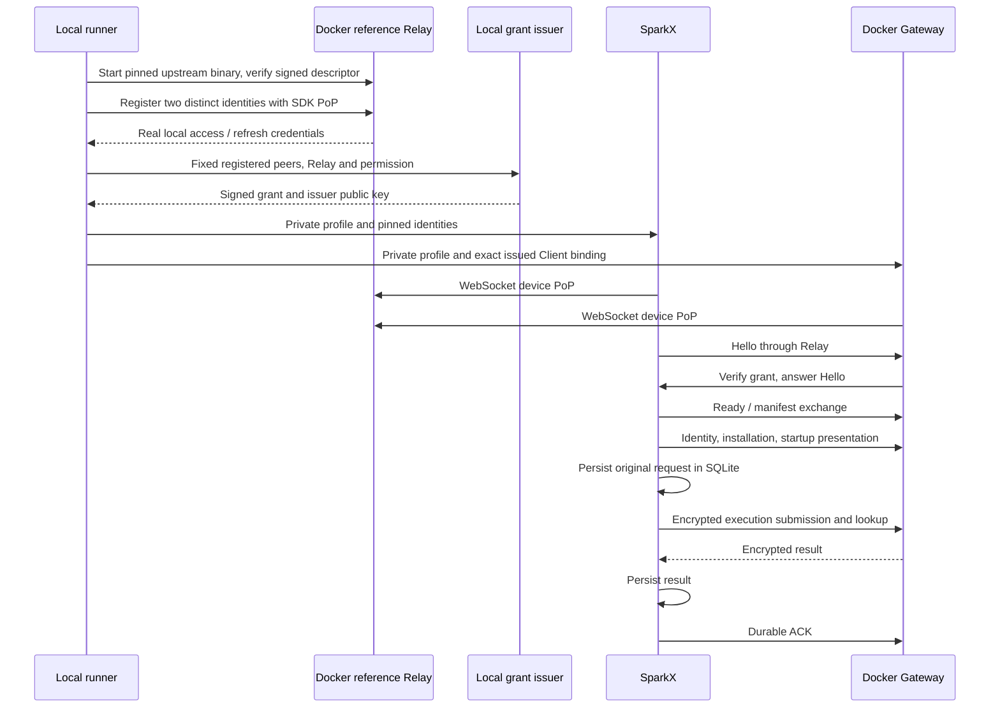

# Local ISCP integration design for SparkX and SparkClaw

> Language: English | [简体中文](../zh-cn/docs/desktop-iscp-connection-design.md)
>
> Date: 2026-10-08. Status: implementation pushed, local Docker reference Relay acceptance passed, and installed SparkX connected to the existing remote backend with a positive real-model reply and durable ACK.
> Scope: implement local SparkX/Gateway integration, without InfiniCenter.

## 1. Current objective

Connect real SparkX to a real SparkClaw Gateway through an independent local Docker instance of the upstream ISCP reference Relay: verify identity, register the installation, submit one text execution, persist its result in SparkX SQLite, acknowledge it, and verify recovery. The user changed the integration target to this local Relay. Hosted Relay endpoints, accounts, enrollment, and credentials are outside this lab.

No website pairing page, short code, or QR entry is required. The runner generates two distinct device identities, registers them with signed device PoP against reference Relay `bind-self`, and obtains real local access/refresh credentials. A separate local issuer signs the SparkX → SparkClaw session grant. Both peers pin the issuer public key, complete Hello/Ready and manifest exchange, and encrypt business messages end to end.

```text
Real SparkX window or separately labeled desktop smoke process
  → Electron main-process ISCP transport
  → bundled Go helper
  → local upstream reference Relay in Docker
  → real Gateway in a separate Docker container
  → existing identity / execution services
```

The Relay is compiled from the SDK module version locked in `services/gateway/go.mod`, without changing upstream source. A Bridge unit test or an injected Relay is isolated evidence; acceptance against this real Relay is recorded separately. The explicit mock model provides reproducible text output through the shared Gateway runtime.

The initial isolated lab below uses its own Gateway and mock model. Section 10 extends the same local Relay to the user's existing remote Gateway, real model and installed SparkX, preserving that deployment's public TLS ingress.

SparkX initiates every encrypted session; SparkClaw responds. The issuer supplies grants during preparation and does not forward business traffic. Both peers connect to Relay; Gateway business HTTP has no published port.

## 2. Upstream protocol verification

On 2026-10-08, GitHub API checks covered main, all remote branches, tags, PRs/issues, plus specifications, schemas, SDK, and reference-service source.

| Item | Finding |
|---|---|
| ISCP main | `47f1f6c231c56c92eff6b6c5d398e037ebcf9602` |
| Current SparkClaw dependency | `github.com/Infinimesh-ai/ISCP v0.2.0-rc.1`, tag `fa1d493c278f13e3588ad173c19695c9f5b9ec2d` |
| main versus that tag | Only `AGENTS.md` differs; no new protocol or SDK code |
| `v0.2-dev` | Three commits behind main, with no unique commits ahead |
| New SparkClaw/SparkX-specific protocol in upstream ISCP | None found in that repository; SparkClaw's own WS5 v0.2 integration is already merged, as detailed below |
| Existing v0.2 capabilities | Bootstrap/v3 invitation roles, PoP, session recovery/reopen/close, grant lifecycle and optional credential recovery; not newly introduced SparkX protocols |

Keep the current SDK pinned. Unpushed work and unavailable private implementations are outside this finding. Open issue status alone does not establish that a feature is absent; check actual specifications and code.

References:

- [Inspected ISCP source](https://github.com/Infinimesh-ai/ISCP/tree/47f1f6c231c56c92eff6b6c5d398e037ebcf9602) and [SDK-tag comparison](https://github.com/Infinimesh-ai/ISCP/compare/fa1d493c278f13e3588ad173c19695c9f5b9ec2d...47f1f6c231c56c92eff6b6c5d398e037ebcf9602).
- [Provisioning](https://github.com/Infinimesh-ai/ISCP/blob/47f1f6c231c56c92eff6b6c5d398e037ebcf9602/spec/provisioning.md), [Session](https://github.com/Infinimesh-ai/ISCP/blob/47f1f6c231c56c92eff6b6c5d398e037ebcf9602/spec/session.md), [Relay](https://github.com/Infinimesh-ai/ISCP/blob/47f1f6c231c56c92eff6b6c5d398e037ebcf9602/spec/relay.md).
- [JingSi ISCPPeer](https://github.com/Chiiz0/JingSi-iOS/blob/4c731d024ccaa3ebef4f497c4a9b6c82090491b5/JingSi/Services/ISCP/ISCPPeer.swift): signature verification, manifest gating, and reconnection reference; desktop roles follow section 3.1.
- SparkClaw's [existing Bridge](iscp-bridge.md) and [current workbench contract](workbench-release.md).

### 2.1 SparkClaw's WS5 integration is already on main

The full branch name is `ws5-iscp-v0.2-phase-a` in the **SparkClaw repository**. It implements the updated ISCP integration and merged into main on **2026-08-28 at 14:38 Asia/Shanghai**, through [`2507e775`](https://github.com/Infinimesh-ai/SparkClaw/commit/2507e775b36fc90dc4fc109cba3122fd17ceac08), titled `merge: integrate ISCP v0.2 bridge phase A`.

| Branch commit | Content |
|---|---|
| [`062338ca`](https://github.com/Infinimesh-ai/SparkClaw/commit/062338ca) | SDK v0.1.0 → v0.2.0-rc.1; v3 ticket enrollment, managed Hello/Ready, manifest gating, reopen |
| [`80fe3c47`](https://github.com/Infinimesh-ai/SparkClaw/commit/80fe3c47) | Automatic grant renewal and existing-device Relay credential recovery clients |
| [`388cdfdc`](https://github.com/Infinimesh-ai/SparkClaw/commit/388cdfdc466baa6badd08e405dda5dcda51bff35) | Phone-facing `agent.activity.list.v1` and `agent.snapshot.get.v1` projections |

Local Git ancestry and GitHub compare confirm that both branch tip `388cdfdc` and merge `2507e775` are ancestors of current main `a7ca5fbd`. The remaining branch reference does not imply unmerged work. Main subsequently added descriptor verification, rejection of widened renewal permissions, and idempotency-key reuse after unknown outcomes. Continue from main rather than switching back to the old branch.

The merge changed Bridge/CLI/schema/dependencies, not `apps/desktop`. It supplies **SparkClaw's JingSi-facing ISCP v0.2 foundation**, but does not implement the SparkX Electron transport or expose desktop `/api/v1/executions` over ISCP.

The implementation below reuses those SDK and Bridge foundations for the desktop initiator, backend responder, peer-to-Client mapping, and workbench operations. It keeps the existing phone-facing Bridge behavior.

## 3. Local Docker Relay, environment, and identities

The runner builds `services/relay-reference/cmd/relayd` from the pinned `github.com/Infinimesh-ai/ISCP v0.2.0-rc.1` module source, then copies only its Linux binary into `gcr.io/distroless/static-debian12:nonroot`. It records the module version/sum, binary SHA-256, and built image ID. The reference Relay source and the upstream SDK stay unchanged.

| Component | Configuration |
|---|---|
| SparkX | Mac Electron process; fresh private `SPARKCLAW_DESKTOP_USER_DATA_DIR`; real main/preload/SQLite |
| Reference Relay | Independent Docker container; `ISCP_PROFILE=local-lab`; generated Domain/Relay IDs; connected to both an ingress bridge and the internal business network |
| Host Relay access | Separate ordinary Docker ingress bridge with a random port published only on `127.0.0.1`; HTTP/WS allowed only by the explicit lab profile |
| Gateway Relay access | `http://iscp-relay:8080` and `ws://iscp-relay:8080/v2/relay/connect` on this lab's internal Docker network |
| Gateway | Current-source Linux binary; distinct FileStore/execution state, fixed deployment/Owner/issued Client; no business HTTP port published |
| Local grant issuer | Separate SDK-backed process, private signing key, loopback management API; never a Relay or renderer login endpoint |
| Model | Explicit mock model for this initial text-only run; real-model acceptance remains separate |
| Cleanup | `down` removes only containers and both networks labeled as belonging to this lab; private profiles, SQLite, and evidence remain |

Docker 29 ignores published ports for a container attached only to an internal network. The Relay therefore uses a separate ingress bridge for host loopback access and also joins the internal business network under alias `iscp-relay`. Gateway joins only the internal network. The Relay has an ordinary bridge route; this design does not claim to block its outbound Internet access. All business profile endpoints target the owned local Relay.

HTTP/WS is a deliberate local-lab allowance. Ordinary product configuration still requires its existing HTTPS/WSS rules. The desktop uses the host route and Gateway uses the Docker route to the same Relay; the private local profile explicitly binds this routing difference to the signed Relay identity. It does not accept an arbitrary replacement Relay or transfer credentials to a hosted endpoint.

Prepare the lab in this order:

1. Create a new private output directory outside the repository. Generate distinct desktop/backend device keys and one local Domain/Relay scope. No hosted credential import is needed.
2. Start the owned upstream reference Relay and wait for a real `/readyz` response and its signed Relay descriptor. `/relayd healthcheck` only returns successfully and does not establish HTTP readiness. Pin the live descriptor signing identity and validate descriptor signatures and expiry when connecting.
3. Register both devices using SDK-signed PoP through `/v2/relay/devices/bind-self`; retain the returned device-bound access/refresh credentials privately. Reference local-lab bootstrap needs no account authorization. This is a local reference-service behavior and does not establish production enrollment.
4. Have the local issuer sign a grant whose subject is SparkX, audience is SparkClaw, confirmation key is SparkX's registered key, and permission is exactly `sparkclaw.workbench.v1`, with the fixed Relay constraint and validity. Pin this separate issuer key in both profiles.
5. Provision an active issued Gateway Client and pin `(Domain, desktop device, key thumbprint, backend device)` to the exact `(deployment, Owner, Client, permission)` binding. A registered Relay device or a valid grant alone does not confer Owner access.
6. Write isolated peer profiles with fixed initiator/responder roles and explicit local-test switches. Keys and credentials remain in private files; the renderer receives only public identity and connection status.

The reference Relay publishes a signed Relay descriptor, but it has no Trust Root discovery endpoint. Its descriptor signer is separate from the local session-grant issuer. This lab verifies the live pinned Relay signer without requiring hosted Trust Root discovery or managed grant lifecycle APIs.

### 3.1 Desktop initiation and verification boundaries

| Layer | Behavior |
|---|---|
| Relay registration | Each peer uses its own SDK-signed device PoP for local `bind-self` |
| Relay receive connection | Both peers connect by WebSocket and answer the Relay's challenge with their device signatures |
| Relay envelope submission | SDK sends the device-bound access credential; local-lab reference Relay accepts bearer access without enforcing the production HTTP access-proof requirement |
| Encrypted session | SparkX sends the first Hello; SparkClaw verifies the pinned grant and answers; both finish Ready/manifest |
| Business call | Gateway rechecks the active Client, deployment, Owner, and installation before calling existing handlers |

Do not claim that this local profile proves production HTTP PoP rejection, actor-authorized enrollment, TLS, or cloud grant renewal. It does exercise actual registration PoP, WebSocket challenge verification, opaque-envelope routing, and peer-verified encrypted business calls. Isolated tests cover invalid signatures, grant/role binding, replay, expiry, revocation, and response loss.

Roles remain fixed during startup and reconnection. Reject role/grant/identity mismatches; SparkX sends a fresh Hello after session loss. The backend maintains its receive connection and waits for desktop initiation.

The pinned reference Relay is a queue-drain receiver: every WebSocket authenticates, emits `ready`, dequeues the currently queued envelopes, emits `drained`, and closes. The Go credential-only local-lab adapter polls again after one second. A normal `drained` frame completes a poll and preserves the encrypted session and its single logical receive-readiness callback. An actual socket/protocol/authentication failure still ends that lifetime and forces recovery. The interval leaves space under the reference service's shared 120 requests/IP/minute rate limit. Production streaming behavior is unchanged; this is a local reference-service adaptation, not a protocol change.

### 3.2 Local test issuer and Relay lifetime

Use the existing [SDK-backed issuer](../services/gateway/internal/iscplocalissuer/issuer.go) with `trust.SignGrant`/`trust.VerifyGrant`, a dedicated test signing key, a random loopback management credential, fixed peers/permission/Relay, and a default thirty-minute grant. Its audit journal retains grant IDs and fingerprints rather than full credentials or business content. Files are mode `0600` inside mode `0700` directories outside the repository and application package.

Relay access and session grants are separate: the reference Relay issues access for fifteen minutes and refresh for twenty-four hours; the peers validate the independently signed session grant. An expired access token may refresh while its enrollment and refresh remain valid. Local grants are not submitted to managed cloud lifecycle APIs. Stopping the issuer does not revoke an issued grant; Gateway binding revocation cancels sessions and delivery.

The unmodified reference Relay generates a new descriptor signer on each process startup and stores devices, credentials, and queued messages in memory when no database is configured. This lab uses that default. Keep the Relay process alive for client/Gateway reconnect tests; pause/unpause it or disconnect a peer for Relay-loss tests. Restarting or recreating Relay invalidates its old signer pins and credential state and requires a fresh `prepare` into a new directory. `down` intentionally ends that Relay lifetime. Gateway FileStore and desktop SQLite persist independently; their restart recovery must not be confused with Relay durability.

See the pinned [Relay source](https://github.com/Infinimesh-ai/ISCP/blob/fa1d493c278f13e3588ad173c19695c9f5b9ec2d/services/relay-reference/internal/relay/server.go), [relayd entry point](https://github.com/Infinimesh-ai/ISCP/blob/fa1d493c278f13e3588ad173c19695c9f5b9ec2d/services/relay-reference/cmd/relayd/main.go), and [Relay specification](https://github.com/Infinimesh-ai/ISCP/blob/fa1d493c278f13e3588ad173c19695c9f5b9ec2d/spec/relay.md).

## 4. Implemented product changes

| Area | Implementation |
|---|---|
| Desktop auth/profile | Explicit private ISCP profile, fixed initiator role, separate credential schema and public identity binding; first import exposes workbench scope only after identity/installation verification |
| Local test issuer | [SDK-backed issuer](../services/gateway/internal/iscplocalissuer/issuer.go) and [CLI](../services/gateway/cmd/iscp-local-issuer/main.go); fixed local enrolled peers, separate test root, loopback management API, short-lived grants and redacted issuance journal |
| Desktop transport | [Private helper pipes and fixed operation mapping](../apps/desktop/src/main/iscp-transport.mjs); deadlines, version/capability/identity validation, bounded calls, generation fencing, sleep/exit cleanup |
| Go helper | [Initiator executable](../services/gateway/cmd/iscp-workbench/main.go) and [encrypted endpoint](../services/gateway/internal/iscpworkbench/endpoint.go); fixed development/package path, SDK Hello/Ready, manifest, replay checks, liveness timeout and fresh-session reconnect |
| Gateway responder | [Authenticated operation adapter](../services/gateway/internal/gateway/workbench_iscp.go); pinned peer mapped to an active issued Client, deployment/Owner/installation checks, revocation cancellation, existing in-process service handlers |
| Text-only runtime/UI | Reject files/attachments before admission, remove external tools from the runtime, and gate mail/files/approvals/Browser Host/speech/settings requests in SparkX |
| Runner/package | [Private lab runner](../scripts/iscp-local-lab.mjs), [helper build](../scripts/build-iscp-helper.mjs), Mac/Linux package resource and executable/hash audit; current-source isolated Linux backend, dedicated SparkX SQLite, no published business HTTP port |

ISCP uses transport-specific validation; existing HTTPS/LAN descriptor and TLS pinning remain in force for HTTPS. Relay tokens and private paths stay in main/helper private configuration and never become Gateway bearer fields or renderer state.

Local test mode requires explicit switches on both peers. The runner starts the normal SparkX main/preload/renderer and `ClientStore`/`ExecutionClient`/`ScheduleClient`, without `--qualification`. The backend uses the shared runtime with a text-only execution scope; other transports keep their ordinary tool behavior. Desktop recovery uses one concurrent lookup, leaving three of the four RPC slots available for required startup presentation.

Conversation selection remains available in the text profile even though Browser Host operations are unavailable. The unavailable browser-state schema retains the empty journal collections required by the normal UI; first Send and conversation selection have regression coverage.

The old phone-facing `agent.message.send.v1` remains separate from desktop executions. Local conversations/context remain on SparkX; Gateway retains execution control/results under the existing durable contract.

## 5. Application protocol and first execution

The implemented application profile is `sparkclaw.workbench.transport.v1`, authorized by `sparkclaw.workbench.v1`. Its [operation registry](../services/gateway/internal/iscpworkbench/protocol.go) belongs to SparkClaw; it is not an upstream ISCP standard.

Use the fixed desktop-initiator/backend-responder handshake with official managed Hello/Ready envelopes, then encrypted capability manifests. Carry fixed operation IDs, request IDs, parameters/results, and errors in `task.invoke`/`task.result`. Unauthenticated owner/client fields never establish permission.

First-stage capabilities:

| Operation ID | Existing backend semantics |
|---|---|
| `workbench.identity` | `GET /api/workbench/identity` validates deployment/Owner/Client |
| `installation.bind` | `POST /api/v1/installations` |
| `presentation.config` | `GET /api/config` |
| `presentation.owner` | `GET /api/owner` |
| `presentation.ready` | `GET /readyz` |
| `execution.submit` | `POST /api/v1/executions`, preserving original request ID and input digest |
| `execution.lookup` | `GET /api/v1/executions/{request}` |
| `execution.cancel` / `execution.ack` | Existing explicit cancellation and durable-result acknowledgment |

SparkX waits for the three presentation operations before enabling Send. Unsupported startup APIs are not called or represented by fabricated successful responses. Fixed operations invoke existing Gateway handlers in process with a trusted principal; no arbitrary HTTP forwarding is involved.

Use a short text task with no attachments, browser actions, or external tools. Until implemented, mail, files, approvals, Browser Host, and realtime speech are explicitly unavailable through capability negotiation. Do not silently call direct HTTP or claim a complete workbench.



Connected requires Relay availability, backend Ready, compatible manifest, valid Client binding, and successful identity/installation verification. Relay WS alone is insufficient.

The test profile caps plaintext request/response frames at 64 KiB, request bodies at 63,488 bytes, concurrent calls at four, and request duration at thirty seconds. Oversize input is rejected before marking the durable request submitted or admitting it on Gateway; oversize responses return an explicit 413. The helper pipe carries the original body as base64 and the Go endpoint embeds its exact decoded bytes, preserving the durable input digest. These temporary transport caps do not change `configs/workbench-limits.json`; large context/results/files need later chunking/credit. The local reference Relay envelope limit is independent; acceptance must use this actual transport, not infer it from the plaintext cap.

## 6. Recovery and authorization boundaries

- SparkX owns bounded reconnect backoff. Disconnect/sleep/profile switch/exit advance generation and discard session keys. A fresh Hello/Ready/manifest is required before identity/installation verification and business readiness.
- Lost submit responses retain the original request ID and perform lookup only, even after 404. Durable ACK retries retain existing semantics; Relay receipts are not business ACKs.
- Test peer disconnection, Gateway restart, and owned Relay pause/unpause separately. None may falsely report connected. Preserve the Relay process for recovery tests because its default credentials and signer are not durable.
- Wrong Domain/audience/thumbprint/permission/expiry/binding cannot reach business handlers. Binding revocation closes sessions and delivery.
- Keep deployment/Owner/Client/installation data separate. Identity switching does not merge or delete prior SQLite data; offline schedules retain missed semantics.
- Browser/mail/file/approval/speech capabilities remain unavailable in this initial text profile.

## 7. Integration stages and acceptance

| Stage | Work | Exit condition |
|---|---|---|
| L0 Preparation | Build pinned upstream Relay; isolated network/storage; generate/register devices; sign local grant; provision Client | Live signed descriptor and actual PoP registration pass; both private helper profiles validate; ordinary configuration rejects lab mode |
| L1 Real transport | Actual reference Relay between desktop helper and Gateway responder | Fresh Hello/Ready/manifest and identity/installation complete; Gateway business HTTP has no published port |
| L2 Desktop text | Real SQLite submission/lookup/persist/ACK; separately test normal window | Result digest and durable ACK agree with FileStore; SQLite survives restart; normal window visibly shows retained result |
| L3 Failures | Peer restart, Gateway loss, Relay pause/unpause; isolated dropped-response/expiry/revocation tests | Fresh handshake recovers original request without duplicate admission or stale-generation leakage; exact evidence distinguishes each fault tested |
| L4 Expansion | Chunked files, approvals/events, mail, Browser Host; speech separately | Enable each capability after its permissions, journals, and resource limits are implemented |
| Later | Website pairing, production enrollment/issuer/TLS and managed lifecycle | Separate implementation and acceptance outside this lab |

Keep module/image/binary identity, redacted profile scope, live Relay connection metadata, unique Gateway admission, desktop SQLite result/ACK, and fault-state transitions. Screenshots substantiate normal-window acceptance separately. Do not retain tokens, keys, complete authorization bundles, or sensitive business content in published evidence.

Prove routing by keeping Gateway business HTTP inaccessible to SparkX, checking the owned Relay's actual device connections, and causing connection loss through only this lab's Relay or peer. A successful UI or an ISCP label alone is insufficient. Real local Relay acceptance does not establish public-network performance or production lifecycle behavior.

## 8. Completed implementation and validation

| Check | Result and boundary |
|---|---|
| Local issuer | Actual SDK signatures, fixed peers/permission/Relay/TTL, private files and audit/auth rejection pass in isolated tests |
| Encrypted transport | SDK Hello/Ready/manifest, encrypted RPC, signed discovery, PoP, replay/role/binding rejection, expiry, reconnect, concurrency/size/deadline and helper shutdown pass in isolated tests |
| Gateway execution | Encrypted endpoints reach real FileStore and shared runtime with a mock model; lost acceptance recovers the original request, admission is unique, result/ACK persist, and Client revocation closes delivery |
| SparkX | SQLite reopen, recovery/ACK retry, startup capacity, identity generation fencing, capability gates and no HTTP fallback pass in desktop/UI tests |
| Repository validation | Full Go suite on isolated Linux, focused race/vet including queued-session recovery, Go build, desktop tests, WebChat 220 tests/build, contract/managed-script and bilingual Markdown checks pass |
| Mac packaging | Mac arm64 `--dir` build and helper executable/package hash audit pass |
| Actual Docker reference Relay | Final `test:iscp-docker`: 3/3 pass, zero skipped, about 34.5 seconds; positive normal/reconnect answers, unique Gateway fence/digest agreement, durable ACK, HTTP business fallback zero, unsigned-PoP rejection and changed-signer rejection pass |
| Native window | Normal Electron with native OS secure storage: new-conversation Send receives a positive mock answer; desktop SQLite and Gateway control match the request/digests, delivered state and durable ACK |

Positive native-window acceptance on 2026-10-08 used the pinned upstream module checksum `h1:d2Epn12InLrGF6nOZ5aEGat5CFxryKRKYbOzEbIRg6A=` and the then-current local Relay `http://127.0.0.1:51206` (a dynamically allocated address). Both devices completed actual PoP `bind-self`. In the normal Electron window, sending `Hello.` in a new conversation displayed the 57-byte mock answer `I can answer this directly from the current conversation.`.

Desktop SQLite and Gateway execution control agree on request `2e891278-1c76-4e56-b670-9d23d98592a7`, input digest `ed0fece805be41170e1e5af71920dce5c1afbd762d59f9e0921f7ad1ccaa2324`, result digest `ec703604349a3ed72fd6a651869a045630994591edb9ecf544d3bfddfe40ab3c`, delivered state and durable ACK. The private receipt is `<lab>/evidence/native-ui.json`. SparkX quit with Cmd-Q afterward; that lab's Relay and Gateway remain available, and its in-memory Relay process was not restarted during the positive run.

Positive acceptance checks the answer outcome as well as durable delivery. Earlier `semantic_coverage_low` Blocked receipts establish transport delivery only and are excluded from positive answer evidence. Helper-close/restart smoke separately verifies fresh `transport_ready`, original-request recovery, one submission and no Gateway business HTTP calls.

The final automatic Docker run passed all three tests with zero skipped in about 34.5 seconds. Normal and reconnect each returned the 57-byte positive answer with `successful_mock_answer=true`, `submit_count=1`, `lookup_count=2`, `ack_count=1`, and `direct_gateway_http_calls=0`. Each original request has one delivered Gateway fence with the same input/result digests. After intentionally restarting its disposable reference Relay, the test inspected its new dynamic host port, rejected re-registration with `local Relay signer changed`, and confirmed that the original enrollment credentials remained intact. The local test log is `/tmp/sparkclaw-iscp-local-docker.log`.

The locked Node.js runtime is 26.2.0 and Go validation uses 1.25.12. Linux checks use current source and clear retired runtime-image browser variables. No store interface changes are required. The isolated Docker acceptance above uses the explicit mock model through the real shared text runtime. Section 10 separately records installed SparkX and real-model acceptance against the existing remote deployment.

## 9. Running the private local lab

From the repository root, use Node.js 26.2.0, Go, Docker and installed workspace dependencies. Build the UI/helper first:

```sh
npm run build:webchat
npm run build:iscp-helper
```

Copy [the input example](../configs/iscp-local-lab.input.example.json) to an absolute private file outside the repository, set mode `0600`, and select deployment/Client IDs. The initial lab Owner is fixed to `owner`. The schema is:

```json
{
  "schema_version": 1,
  "relay_profile": "local-lab",
  "deployment_id": "sparkclaw-iscp-local-test",
  "owner_id": "owner",
  "client_id": "sparkx-iscp-local-test"
}
```

The runner generates the Domain, Relay and device IDs and all keys/credentials. Do not supply hosted enrollment files or import hosted access tokens.

```sh
npm run iscp:lab -- prepare --input /absolute/private/input.json --directory /absolute/private/new-iscp-lab
npm run iscp:lab -- up --directory /absolute/private/new-iscp-lab
npm run iscp:lab -- smoke --directory /absolute/private/new-iscp-lab
npm run iscp:lab -- smoke --directory /absolute/private/new-iscp-lab --reconnect
npm run iscp:lab -- run --directory /absolute/private/new-iscp-lab
npm run iscp:lab -- down --directory /absolute/private/new-iscp-lab
```

`prepare` refuses an existing output directory. It builds the locked upstream Relay, starts the separate ingress/internal Docker networks and their Relay, verifies live discovery, registers both devices by PoP, signs the local session grant, and writes private peer profiles plus Gateway Client provisioning. Relay remains running after preparation.

`up` reissues the thirty-minute Grant under the same private issuer, builds the current Gateway for Docker's Linux architecture and replaces its isolated container without publishing business HTTP. The runtime image must be available; it supplies runtime dependencies rather than an older Gateway binary. Gateway remains running after this command. Image-derived obsolete browser variables are cleared and the model-capacity catalog is explicitly set to the mounted current source.

`smoke` and `run` first perform `up`. `smoke` uses the real desktop SQLite/ISCP transport against the live reference Relay and Gateway. `--reconnect` additionally verifies a fresh desktop transport session and retained original-request state.

Headless smoke and the normal window share the same business `ClientStore` at `<lab>/userdata/workbench`, including its SQLite, installation ID, original requests and receipts. The runner passes `--client-store-directory` explicitly. Headless uses its AES test vault under `<lab>/smoke-userdata`; normal SparkX uses its OS vault under `<lab>/userdata`.

`evidence/smoke.json` is the final structured summary, `smoke.ndjson` retains redacted events, and `smoke-normal.json`/`smoke-reconnect.json` retain the respective summaries. `run` starts normal SparkX with that private connection profile and shared business Store; no qualification mode or direct HTTP execution is involved.

A Gateway Client is bound to one installation. Run headless and normal-window sessions sequentially. The private `desktop-launcher.json` lease makes `up`, `smoke`, and `down` reject a live lab desktop until it quits, preserving exclusive Store and peer use.

An explicitly selected private profile can also survive normal Finder launches. Write `iscp-launch-profile.json` in SparkX's default user-data directory with mode `0600` and schema `{ "schema_version": 1, "test_mode": true, "profile_path": "/absolute/private/desktop-profile.json", "user_data_directory": "/absolute/private/userdata" }`. Its parent and dedicated user-data directory must be owned by the user, mode `0700`, and free of symbolic links. The file contains paths only; credentials remain in the private helper profile and vault. Explicit launcher environment variables override this selection. Qualification ignores it, and an invalid selection prevents startup. Removing the selection restores the previous default connection and data directory.

| Peer | Explicit private test switches |
|---|---|
| SparkX | `SPARKCLAW_DESKTOP_ISCP_LOCAL_TEST=1`, `SPARKCLAW_DESKTOP_ISCP_CONFIG=<lab>/desktop-profile.json`, `SPARKCLAW_DESKTOP_USER_DATA_DIR=<lab>/userdata` |
| Gateway | `SPARKCLAW_WORKBENCH_ISCP_LOCAL_TEST=1`, `SPARKCLAW_WORKBENCH_ISCP_CONFIG=/lab/gateway-container-helper.json`, matching deployment and issued Client provisioning |

Quit SparkX with Cmd-Q before `down`; closing a Mac window only hides it. `down` removes only this lab's containers and both networks and retains private state/evidence for inspection. It ends the in-memory Relay lifetime; a later test needs `prepare` in a new directory. Relay image and module downloads may require network during build; all running peer profile endpoints use the local Relay, with no hosted Relay dependency. Grants expire after thirty minutes and must be reissued under the same issuer with a fresh handshake rather than silently bypassing validity.

Run isolated checks independently of Docker acceptance:

```sh
npm run test:iscp-lab
npm run test:desktop
npm run test:webchat
npm run check:desktop-managed-scripts
go build ./services/gateway/...
go vet ./services/gateway/...
```

Run the opt-in actual Docker acceptance independently:

```sh
npm run test:iscp-docker
```

This creates and cleans up its own local Relay/Gateway/network, tests actual device registration and the observed HTTP 401 rejection of registration without signed PoP, then normal and reconnect positive business runs with unique Gateway admission and matching input/result digests. It finally restarts its disposable reference Relay and requires rejection of the changed descriptor signer without overwriting the old enrollment. It is distinct from isolated fixtures and uses the mock model.

Keep full Gateway execution checks on Linux as required by the existing workspace contract. Isolated fixtures never forward their synthetic credentials to a hosted service.

## 10. Installed SparkX and existing remote backend acceptance

On 2026-10-08, implementation commit `a0f48a3ec33df511ff2794a55ad61cfae1cfdcc2` was pushed to `main`; `/home/ubuntu/SparkClaw` on `210.16.177.239` synchronized by `git pull --ff-only`. The actual Gateway and matching WebChat were upgraded to images `sparkclaw-gateway:iscp-a0f48a3e` and `sparkclaw-webchat:iscp-a0f48a3e`. The existing deployment `431c00ce-b780-42e3-9d25-c25c87c8c011`, Owner, PostgreSQL state, model configuration, workspaces, TLS and existing Clients were retained. A new issued Client, `sparkx-iscp-remote-8143225e`, and two distinct Relay devices were added specifically for this evaluation.

The evaluation reuses the already running local reference Relay at `http://127.0.0.1:51206`; it does not deploy another Relay on the server or use a hosted Relay. The backend reaches the same pinned Relay through controlled TCP links:

```text
Installed SparkX → local Docker reference Relay
Remote Gateway → iscp-relay:28881 on its Docker bridge
  → remote loopback TCP port 43569 → SSH reverse forward
  → Mac loopback TCP port 53006 → Docker TCP forwarder → same reference Relay
```

The forwarders carry Relay TCP traffic without interpreting business requests or holding credentials. Separate source addresses leave room under the reference Relay's shared per-IP polling limit. SDK enrollment, the signed Relay pin, fixed peers, encrypted Hello/Ready and business permission remain enforced. The public HTTPS endpoint at `https://210.16.177.239:18790` remains healthy with its existing verified CA; it is not the desktop execution transport in this evaluation.

`/Applications/SparkX.app` was updated with the audited Mac arm64 package and bundled helper. Its persistent private launch selection activates ISCP on a normal launch, without environment flags or qualification mode. The dedicated user-data directory contains a new Client scope; the previous HTTPS data and installed app were backed up rather than imported into this scope. This does not establish migration of old R3 history or full workbench capability acceptance.

| Acceptance | Observed result |
|---|---|
| Actual model and state | Encrypted `presentation.ready` reports `model_mode=external`, `state_backend=postgres` |
| Lost submit response and reconnect | Real-model reply `Hello! How can I help you today?` (32 bytes); fresh helper session, original request recovery, one submit, three lookups, one ACK, zero direct Gateway HTTP calls |
| Installed native window | Chinese text task produced a positive 174-byte real-model answer; native OS secure storage and the persistent launch selection were used |
| Durable result | Both native SQLite and real Gateway control record request `ace0b350-665d-4156-8976-6442e4385a01` as delivered, with matching input/result digests and acknowledged delivery |
| Credential rotation and normal restart | Forced the SDK refresh path, verified rotated credentials persisted in a dedicated writable enrollment mount, then reopened installed SparkX through the persistent selection, restored its Chinese conversation and received `重启验证通过。` from a new real-model task |
| Recovery preparation | Original container/image configuration, PostgreSQL custom dump and memory/control archive retained before upgrade; dump catalog validation passed |

The native result digest is `a89abc0a64c1a03dd756664b083b36fb3b0baf82e161b481673ef7a9d2468340`. The private evaluation directory is `/Users/dev/.cache/sparkclaw-iscp/remote-switch-20261008-8143225e`; its `evidence/native-real-model.json`, `evidence/native-after-restart.json`, `evidence/real-model-reconnect.json` and NDJSON retain the separate receipts. Remote backup is `/home/ubuntu/sparkclaw-backups/20261008-before-iscp-8143225e`. Secrets and these machine-specific deployment scripts are outside Git and the application package. The upgrade applies PostgreSQL migration 18; reverting only the binary is insufficient because the prior binary rejects that migration ledger. Recovery to the prior version requires the corresponding database and state backup.

Enrollment storage must be writable for SDK credential rotation. The initial remote evaluation mounted all private configuration read-only, so its first refresh could rotate the server credential without persisting it locally. This was corrected by a separate private `gateway-credentials` mount at `/run/sparkclaw/iscp-credentials`; keys and profiles remain read-only. The same device was re-enrolled with signed PoP and the existing Relay pin, and an immediate forced refresh verified new access validity and changed refresh credentials on disk. `evidence/credential-refresh.json` records this check. The local isolated runner already mounts its private lab directory writable. The private `renew-grant.mjs` refreshes only the same grant scope on both peers; quit SparkX before running it and reopen afterward for a new handshake.

This remains the explicit text-only local-test profile. Mail, files, approvals, Browser Host and voice remain unavailable. It requires the current in-memory Relay, Docker TCP forwarder, SSH control connection and remote user-service TCP link to stay running. Restarting the Relay invalidates its signer pin and enrollment. The ordinary lab `up`/`down` commands manage the isolated mock Gateway, not this remote evaluation; do not use them to refresh or tear down the remote connection. A normal remote Compose reconciliation also needs the private ISCP evaluation configuration reapplied. Reissue the same thirty-minute grant and complete a fresh handshake when it expires; do not bypass expiry or extend permissions. These results establish real backend text execution and delivery, not production enrollment, managed grant renewal or a complete product release.
