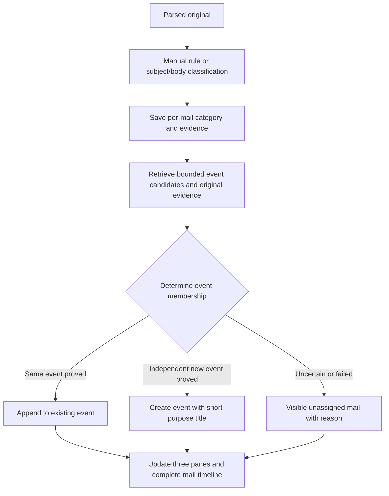

# Email Classification and Event Conversations: Convergence Findings and Design

> Language: English | [简体中文](../zh-cn/docs/email-management-classification-v3.md)

Status: updated 2026-09-10, **investigation and design only; not implemented or deployed**. Revised following the owner's discussion. This is the next design after [analysis and processing](email-management-analysis-v2.md); conflicting older proposals yield to this document for future implementation, not current runtime behavior. Premature implementation was reverted; deployed analysis-v2 remains outside that revert.

## 1. Product Goal and Confirmed Scope

Help users manage their own mail. This phase must both classify mail from its subject and body into notification/interaction and assign it correctly to an event conversation. **An event is the smallest conversation unit; each conversation concerns one event.** Separate different events from one sender; allow different participants in the same event.

The owner confirmed:

- Keep notification and interaction. Codes, ads and routine login information are notices; concrete requests to confirm, reply, decide, supply material or continue an exchange are interaction. Sender identity alone does not decide category.
- Generate neither message summaries nor conversation summaries. Event assignment remains essential; classification alone does not meet the goal.
- Name conversations for what the mail/event is about doing, such as “Confirm purchase quotation”, “Coordinate project launch date”, or “Recover account access”. This is a short event title, not a sender name, a verbatim subject by default, or a prose summary.
- Use three levels: left category navigation → middle event conversations → right complete conversation detail, referencing the local JingSi-mail UI hierarchy.

Preserve originals, attachment downloads, per-mail viewing, manual classification, future exact-sender rules, compose and reply. Do not assign responsibility or handle mail automatically. Do not analyze attachments. Capture speed, scripts and receiving cadence remain outside scope.

Budgets, event evidence, automatic historical migration and quality thresholds below are proposed implementation details requiring validation. The earlier suggestion to allow classification alone and suspend semantic assignment is superseded: disabling event assignment cannot substitute for convergence.

## 2. Findings and Evidence Limits

Read-only aggregate observations during this session, around 18:09–18:11 Asia/Shanghai on September 9, found 43 mail records, 17 parsed representations and 13 conversations. Historical jobs included roughly 60,000 successes, 219 queued, four retrying and three running. These are job counts, **not mail counts or actual model-call counts**: some jobs return after detecting changed dependencies without calling the model.

A two-minute window contained 17 context writes across 14 distinct mails. Relationship-check generations reached 2450–3753 per target; message-summary generations reached 3–439. This proves repeated rebuilding, not a single universal trigger. These are historical snapshots, not live counts. Obsolete presentation versions must not be counted as current pending mail.

Confirmed code mechanisms:

| Mechanism | Repository-relative location | Effect |
| --- | --- | --- |
| Classification input preparation retrieves related mail and publishes context | `services/gateway/internal/emailmanagement/analysis_input.go`, `buildAnalysis` / `updateContext` | A classification can change its own dependencies before inference |
| Context publication increments mail input version and propagates conversation changes; no transactional equivalent-content recheck | `services/gateway/internal/store/email_management_intake.go`, `emailContext`; `email_management_refresh.go`, `emailChangedMail` | Input versions can change without new source; concurrent equivalent publication can amplify changes |
| Classification depends on mail, reply, thread and related context mail | `services/gateway/internal/store/email_management_jobs.go`, `emailRequest` | Unrelated semantic activity can invalidate classification |
| Classification saves request summaries and assignment/relationship checks; message summaries update conversation versions | `services/gateway/internal/store/email_classification.go`, `emailSaveClassification`; `email_management_refresh.go`, `emailSummary` | Classification and conversation analysis are coupled |
| Presentation revision includes input version, context and complete classification JSON | `services/gateway/internal/store/email_presentation.go`, `emailPresentationRevision` | Semantically equivalent rewrites can invalidate displayed text |
| Most non-ready/non-failed presentation states look like generation | `apps/webchat/src/components/emailMessage.tsx`; `apps/webchat/src/hooks/useEmailPresentations.ts` | Queueing and missing data are not clearly distinguished; five-second presentation polling is separate from receiving |
| Shared complex output schema, long evidence and generic error mapping | `services/gateway/internal/emailmanagement/model.go`, `analysis_input.go`, `service.go` | Excess work for a weak model and poor visible diagnostics |

Model-call records, input/output artifacts and revision fences already exist. The missing element is a coherent current-mail → classification → stage → attempt → outcome view. Two default model workers rotate job kinds; fixed last-place summary starvation is not an established cause.

Candidate search text includes generated summaries. Changed summaries may change candidate membership, publish new context and feed back into analysis. Concurrent workers may also compare the same old context outside the Store and publish equivalent replacements. Both mechanisms are possible from code; their individual contribution to the deployed churn has not been isolated. Before implementation, reproduce with sealed synthetic sources in an isolated Store, independently varying summary search, concurrent context publication and candidate membership. Measure versions, generations and actual model calls; do not clear or rerun production data to substitute for reproduction.

## 3. Classification and Event Assignment



### 3.1 Per-Mail Classification

Precedence remains per-mail override > effective owner-scoped exact-sender rule > model > interaction fallback. Rules affect the edited mail and future matching mail, not historical batches. They express routing preference, not sender authentication or same-event membership.

Use subject and body. Subject-first completion is a proposed optimization only when evidence suffices; missing, ambiguous, conflicting or unclear subjects require one bounded body stage. Saving calls must not discard body evidence that changes category. Preserve negation and action context, strip only reliable quotes/signatures and mark truncation. Attachment-only or conflicting evidence falls back to interaction with a review reason.

Classification uses only this mail's original subject/body and minimal trusted structure. No related-mail retrieval, generated summaries or shared context publication. Proposed output: `category`, `notification_subtype`, `reason_code`, `evidence_quote`, `needs_body`. Unknown routes to interaction. Validate enums, combinations and locatable evidence. This step produces no event title, summary, assignee, expiry or plan; event identification names the event later. Treat mail as data rather than instructions.

Starting limits to calibrate: subject 512 characters, body 1200; 120 seconds per stage, initial request plus one technical retry, at most four calls. Uncertainty upgrades to body once; failures consume budget, manual retries create audited batches. Self-reported confidence is not the sole gate.

### 3.2 Event Membership

Both categories use event conversations; a single notice may constitute a complete event. Do not group all codes, ads or a sender's mail into a permanent conversation. Separate orders; confirmation and shipping updates for one order may share an event. Codes for separate login attempts are not one event merely because the service matches.

Proposed evidence sequence:

1. Owner confirmed: reply references and native threads locate preceding mail, but event identity decides membership. A distinct new matter in an old thread creates a new event while retaining its source-mail relation, rather than joining the old event.
2. Retrieve bounded candidates using original subject/body, participants and sourced order/ticket identifiers. Sender, subject similarity or an identifier alone is not a universal merge rule.
3. Provide necessary member source excerpts and IDs to compare events. Generated summaries and generated event titles are not assignment evidence. Insufficient candidate coverage calls for bounded source evidence or pending, not an automatic new-event decision.
4. Return `append / new / pending`, candidate event ID, stable reason and locatable evidence. Validate candidate membership versions on publication. Append only with same-event evidence, create only with independent-event evidence, otherwise remain pending.

Do not force merges or create a formal event for every uncertain mail to claim success. Pending is an exception state, not successful assignment. Mail covering multiple independent events remains marked for review in this phase; splitting or cross-event references require a separate design rather than silently breaking unique primary membership.

Proposed event budget: at most 10 candidates and 8000 total excerpt characters, 120 seconds per request, initial call plus one technical retry. Account separately from classification and avoid recursive relationship checks. Insufficient evidence yields pending. Calibrate with an independent synthetic set on the real model.

### 3.3 Index Mapping and Missing Preceding Mail

Owner clarification on 2026-09-10: one event may contain multiple exchanged messages. Existing mail indexes can map these to the UI event conversation. When preceding correspondence is known but absent from the conversation window, fill that gap rather than finish processing the current mail as an isolated message.

Indexes mean sourced identities and relations: provider mail/thread IDs scoped to owner and mailbox binding, plus parsed Message-ID, In-Reply-To and References. They are not list positions or matching subjects. They locate candidates; the event boundary above still applies when a reply references an old message but introduces a different matter.

Check the full local index before deciding to capture:

| Missing case | Resolution |
| --- | --- |
| Preceding mail is stored and assigned to the same event but absent in UI | Repair query/pagination/display omissions and load existing mail; no recapture or new event |
| Preceding mail is stored but unassigned | Read its existing original and assign it with the current mail when same-event evidence supports this |
| Preceding mail is not stored | Follow trusted thread membership or explicit reply references through [thread synchronization](email-management-stage-2-intake.md), capture/parse available history and update the event |
| Conflicting index, preceding mail in another existing event, or unavailable source | Record the specific gap/conflict and show pending backfill/review; do not automatically merge existing events or claim completeness |

History includes read incoming mail and the user's earlier Sent replies, independent of unread filters or loaded list pages. Quoted text in the current reply may provide attributed evidence but is not a captured independent historical message. Unproved excerpts cannot become formal mail members. Scope backfill to provable relations for this event: no whole-mailbox historical scan, invented model history or restored summaries.

Compute the difference by unique mail identity; durably retain missing references, observed members, cursors, attempts and results. Batch large threads; restart, repeat triggers and read-state changes neither duplicate members nor lose unfinished work. Respect owner/mailbox bindings, receiving switches and provider access. Show disabled-receiving/login prerequisites without silently enabling intake. This requires targeted history completion, not changing normal receiving cadence.

Owner confirmed that backfill must not block reading or replies: join an existing event immediately when proved, otherwise stay visibly unassigned. The right pane immediately shows acquired originals, with a separate “Loading preceding mail / History partially missing / History backfill failed” state and reason. Track classification, event membership and history completeness independently. Insert recovered mail by original time with stable identity tie-breaking; preserve viewing receipts and do not mark newly recovered history viewed merely because the event was previously opened. Known gaps prevent a complete label; completion covers the proved observation scope, not all provider history. New original evidence admits one bounded affected assignment update; repeated backfill checks cannot create classification/naming loops.

### 3.4 Event Titles

Use a concise action/purpose plus matter, optionally returned with a new-event decision: “Confirm purchase quotation”, “Track order delivery”, “Receive this login code”. Only sourced facts; do not infer assignees, completion, deadlines or actions, and never place code values in titles.

Persist source mail, evidence and policy version. Appending mail does not rename by default; bounded revision requires evidence that the old name was wrong or insufficiently distinctive. Titles do not enter classification fingerprints, candidate retrieval or event identity decisions. Equal titles do not imply equal events; renaming changes neither ID nor membership.

Separate naming failure from assignment failure. A reliably assigned event stays accessible using a labeled original-subject fallback or localized “Event awaiting name”. Do not present fallback text as an accepted event title. Proposed language policy: use UI language at creation when reliably available; otherwise original language for background creation. Persist it. UI language changes update local labels without automatic renaming or translation generation.

### 3.5 Manual Assignment Correction and Index Synchronization

The owner confirmed manual event reassignment with synchronized mail indexes to correct system understanding. Provide “Move to existing event”, “Create new event” and “Rename event”. Manual membership is durable authority that later models cannot revert; the user may explicitly correct it again. Membership correction and notification/interaction overrides are separate actions, without implicit cross-overwrites.

Index synchronization means the maintained mail identity → event ID mapping, membership and assignment retrieval indexes. Never rewrite original headers, Message-ID, In-Reply-To, References or provider thread IDs. One original thread may contain multiple events: preserve per-mail mapping and corrected boundaries rather than permanently redirect the entire thread.

Commands include owner, mail identity, source/target events and expected versions. Transactionally validate membership and update mappings, both membership revisions and durable follow-up intents. Synchronize derived candidate indexes, lists, timelines and unseen counts; asynchronous projection must recover and reject stale index versions as publication authority. Audit before/after, origin, time and revision. Create-event and member movement are idempotent together. Preserve originals, attachments, per-mail viewing and send associations.

Fence assignment publication with the manual revision so in-flight old model output cannot overwrite correction. Later replies resolve their target using the corrected per-mail mapping; subsequent event decisions may consume the correction and source evidence, while still allowing new events in old threads. This is not a cosmetic UI change, model training or a global sender membership rule.

Apply correction only to selected mail, not the whole historical thread by default. Proved related unassigned follow-ups may receive bounded reassessment; existing manual membership remains fixed. Proposed empty-event behavior: keep its auditable ID/history but hide it from ordinary lists. Automatic bulk historical correction still requires an explicit batch; individual manual correction does not.

## 4. Three-Level UI and Category Projection

Local reference: `/home/infinimesh/Documents/JingSi-mail/app/app/mail-workspace.tsx`, `MailWorkspace`, `ConversationRow` and `ConversationPane`. Its navigation/list/detail and narrow-screen transitions were inspected. Reuse the hierarchy, without adopting its reply/waiting categories, AI summaries or writing flow, or modifying JingSi-mail.

| Level | Contents | Interaction |
| --- | --- | --- |
| Left: main categories | Notification, interaction, unseen counts; compose/drafts as auxiliary actions | Select category to show its event conversations |
| Middle: event list | Event title, participants, latest-mail time, mail/unseen counts; optional labeled original excerpt | Select event for right detail; stable latest-mail ordering and pagination |
| Right: complete detail | Event title, chronological incoming/outgoing mail, individual original subjects, senders, times, bodies, attachments and reply controls | View/reply per mail and load history, with no summaries |

```text
Interaction  → Confirm purchase quotation → Inquiry → Quotation → Confirmation
             → Coordinate launch date    → Proposed date → Participant replies
Notification → Track order delivery      → Shipping notice → Delivery update
```

Confirmed on 2026-09-10: an event containing interaction stays in interaction even when its latest mail is a notice. Keep per-mail categories separate. Event projection: any effective interaction or unknown/fallback member places the event in interaction; otherwise notification. Show an event under one main category with its full timeline. Do not split events for categories or overwrite per-mail categories from the event projection. Interaction closure stays in its interaction event, without inferring a move from completion. This rule is confirmed and requires mixed-event acceptance examples.

Parsed unassigned mail remains in a separate unassigned section under its effective category; unknown/failed classification falls back to interaction. Missing/failed sources use an auxiliary exception entry, never a fake event. Proposed left badges count unique unseen mails in that event entry, including its unassigned section. Report event and unassigned-mail counts separately; these are not per-mail-category totals.

Mailbox filters, search and counts cover all admitted data. User search may use event titles and originals; it is distinct from model evidence retrieval. Opening an event does not mark all history viewed. Remember each category's selection, preserve selection across refresh/language switches, and reject stale detail responses after navigation. Wide screens show three panes; narrow screens navigate category/list/detail sequentially and restore list position on back.

## 5. Stop Summaries and Enforce One-Way Dependencies

Allow classification, event assignment and necessary short event naming to use models. Stop message/conversation summaries and their localized prose tasks. Replace legacy coupled assignment/relationship work with source-based event assignment; neither retain the old context feedback nor permanently disable assignment.

Dependencies flow from immutable source/parse → per-mail classification → source-evidenced event assignment/naming → list/detail projection. New source evidence may admit bounded reassessment, but assignment/naming cannot invalidate classification or trigger summaries and recursive conversation analysis.

Retain historical summaries with updates explicitly stopped; default to event title and original mail. New code extraction/expiry inference is outside this phase and proposed to stop with the old compound analysis. Preserve existing reliable values and masking; empty fields cannot erase them. Unproved expiry remains unknown.

Classification fingerprints contain owner, mail identity, consumed source/parse content, rules and classification policy/prompt. Assignment has its own fingerprint: current source, effective classification revision, sealed candidate IDs/evidence versions and assignment policy. Titles have independent revisions. Exclude job time, UI language switches and summaries; title changes do not update candidates.

Store transactions enforce one effective target/version execution and validate source, rules, candidate membership, policy and lease. Equivalent outcomes do not bump business revisions; attempts remain audited separately. Atomically check concurrent append; before concurrent creation, recheck current candidates within the admission scope for competing same-event creation. Unresolved identity stays pending; a title hash cannot guarantee uniqueness. Real sources/rules may admit bounded new generations; equivalent context, polling and refresh may not create work.

## 6. State, Migration and Recovery

Show classification, assignment and naming states separately. Classification success is not assignment success. Proposed states: `waiting_source / queued / running / retry_wait / ready / needs_review / failed / suspended / superseded`. Running identifies classification, event identification or naming. Failed is exhausted technical budget, needs_review is semantic uncertainty, suspended is policy-disabled; do not flatten these into “generating”.

Track current job, generation, stage, attempt, fingerprint, actual model version (unverified means unpinned), prompt/policy versions, timestamps, stable errors, model-call/artifact IDs, evidence and origin. Count unique mails, current classification/assignment jobs, historical jobs and actual calls separately. Ordinary logs omit originals, codes, addresses and credentials. Poll only active visible targets, stop at terminal/disabled states and distinguish fetch errors.

Worker skipping is insufficient: current paused tasks can be rearmed with reset attempts. Persist versioned policy and enforce it across admission, claim, retry, refresh, presentation ensure and publication.

Proposed migration:

1. Reproduce old feedback in isolation and validate new classification, assignment and policy gates. Do not clear or mass-rerun production.
2. Persist new policy, block legacy summary/prose and coupled assignment admission, suspend or supersede queued tasks as appropriate, cancel in-flight work and fence late output. Uncancellable calls may consume one request but cannot retry.
3. Admit new mail to classification and event assignment. Backfill missing/untrusted classifications and unassigned sources with bounded cursors and one execution per target/version. Retain artifacts/attempts, resume idempotently, never requeue everything on restart.
4. Preserve historical IDs/members by default, with explicit manual corrections from section 3.5; no automatic bulk split/merge this round. Mark naming separately when old titles are merely subjects or fail to express purpose. Bounded naming may cover trusted old events; mixed-event suspicions require review. Historical reassignment needs a separate explicit batch; preserving membership does not prove it correct.
5. Observe classification, assignment and naming generations/calls separately. Stop admission and retain evidence if they grow without changed sources/rules. Keep capture, originals, drafts and explicit compose/reply usable.

Summary restoration requires a future explicit policy upgrade, outside this delivery. Image rollback cannot unleash old queues: stop workers before running software without the policy fence and require compatible migration/startup checks. Exhausted work needs explicit retry or real new evidence; naming/display changes are not evidence.

## 7. Acceptance and Details to Validate

Manual-correction acceptance: moving to existing/new events and renaming maintain consistent mappings, retrieval, both event memberships, timelines, category entries and unseen counts. Old in-flight models/indexes, duplicate commands and restart cannot overwrite or lose corrections. Future replies resolve corrected events while new matters in old threads can still split. Preserve headers, attachments and viewing receipts; backfill does not block reading/reply.

Added history-backfill acceptance: latest reply arrives first, read history, Sent replies, stored-but-hidden/unassigned mail, partial thread pagination, conflicting event indexes, deleted/inaccessible originals, disabled intake, restart and repeated triggers. Verify no missing proved members, duplicate events/mails or invented history; visible gaps, correct ordering/viewing after completion, and zero new model calls from repeated fixed-input checks.

1. **Reproduction/convergence:** seal synthetic sources, isolate summary-driven candidate changes and concurrent equivalent context publication. After initial completion, run 100 planner/refresh passes and 30 minutes idle. Classification/assignment/naming generations and calls remain fixed on memory/file/PostgreSQL.
2. **Classification:** independent Chinese/English holdout covering codes, ads, routine login, official requests, personal notices, ambiguous/missing subjects, quotes, attachment-only and injection. Pin model/prompt and report subject completion, body escalation, interaction-to-notification errors, fallback and latency. No in-sample 100% claim. Proposed gate: no critical action example missed and at most 1% holdout misrouting, reporting sample size/confidence intervals.
3. **Assignment:** independently label event boundaries in synthetic sequences: one sender/multiple events, multiple participants/one event, changed subjects, unrelated equal subjects, notice events, mixed categories, topic-changing replies, out-of-order and duplicate capture. Report false merges/splits, duplicate events, pending rate and successful assignment coverage; pending is not success. Proposed gate: zero critical cross-event merges and at least 95% correct assignment on clear cases, subject to review and not a production guarantee.
4. **Naming:** titles express event purpose, not sender identity, paragraph summaries, invented facts or code values. Rename/equal names do not affect membership. Test readable naming failures, stable append and zero calls on language switches.
5. **Three panes:** both categories show events; selection reveals complete originals, correspondence and attachments. Test unique mixed-event entry, global search/paging/counts, visible pending, per-mail viewing, mobile back and stale-response isolation. Browsing, event reading and replies work without summaries.
6. **Failures/migration:** inject unavailable model, timeout, bad JSON/evidence, mid-flight rules, concurrent candidates, expired leases and crashes. All three analysis stages remain diagnosable; old jobs stay disabled, late publication fails and repeat migration does not duplicate events.
7. **Preserved abilities:** owner/mailbox isolation, manual rules, preserved history/review labels, drafts, explicit send/reply, originals, code masking and both UI languages.

Mixed-event interaction placement, new events within old threads, manual corrections with index synchronization and nonblocking backfill are confirmed. Still validate count implementation, subject-only decisions versus body evidence, candidate/call budgets, naming language/historical scope and multi-event pending UX before implementation. These details do not change the confirmed goal: correct classification, event grouping, no summaries and three UI levels.

This delivery contains bilingual design and status records only. No application code, production settings/data, product acceptance runs or deployment changed.
