# Email Management System Design

> Language: English | [简体中文](../zh-cn/docs/email-management-design.md)

Current follow-up design (not implemented): [Classification and event conversations](email-management-classification-v3.md). The owner confirmed event as the smallest conversation unit, purpose-based event titles, no message/conversation summaries, and category → event list → complete detail panes. It supersedes conflicting proposals below for future implementation; historical implementation and deployment records remain unchanged.

2026-09-09 design proposal: [Analysis and processing improvements](email-management-analysis-v2.md) specifies notification/interaction routing, verification expiry and settings-aligned UI/generated language. It is not implemented or deployed.

Owner-confirmed refinement: sender-address overrides persist for future mail; uncertain mail appears in interaction; all model work excludes attachments; preserve matter-based conversations and add compose/reply. Do not assign responsibility. See the increment for precedence, recovery and acceptance.

Status: implementation in the worktree, 2026-09-08; not deployed. See the
[implementation and validation report](email-management-implementation.md) for measured coverage. This document governs the
following stages. Existing scripts and qualification remain documented in
[email source data](email-read-design.md). This delivery is documentation only.

2026-09-09 amendment: automatic receiving now uses same-page collection batches
and a default 20-minute idle after each round. Per-mail queues serve local parsing
and model work. Page recovery, source reuse and read ordering follow the
[stage 2 update](email-management-stage-2-intake.md).

## Product And Scope

Provide one closable email management popup in SparkClaw, organized by counterpart
addresses, participants and subject matter. QQ, Gmail and Outlook are adapters,
not separate product entry points. Receiving addresses remain visible as source
information and filters. One address can have several conversations; one topic
can involve several addresses. Each conversation has a persistent
`email_conversation_id`, independent of address, subject or provider thread ID.

Background discovery durably queues individual captures. Asynchronous analysis
summarizes mail, determines conversation membership and updates timelines and
conversation summaries. Closing the popup does not stop intake. Model outages
leave received mail visible as awaiting analysis. Scope covers intake,
association, summaries, queries and local viewing state, not automatic sending,
draft composition, deletion, archiving or contact merging.

## JingSi-mail UI Evidence

Only the following frontend files in the local reference project were examined;
its receiving services and ingestion algorithms were not inspected.

| File relative to JingSi-mail/app | Observation | Application here |
|---|---|---|
| `lib/types.ts` | ConversationView has its own id, counterpart, messages and summary/insight; MessageView has an id, direction and original availability | Separate conversation and mail identities; extend to multiple participants and receiving addresses |
| ConversationRow/ConversationPane in `app/mail-workspace.tsx` | Counterpart/title/preview/time list; overview, message cards, older messages and originals in detail | Two-pane popup with summaries and individual mail |
| `lib/mail-workspace-state.ts` | ID-based refresh merging, ordering, pagination and selection | Backend assigns membership; frontend consumes versioned projections |

This proves presentation and refresh behavior, not automatic grouping logic in
the reference backend. Its receiving, encryption, delivery and backend stack are
not copied. Its single counterpart and delivery states do not replace our
multi-party, multi-account and asynchronous analysis model.

## Responsibilities

```mermaid
flowchart LR
  T[Background timer] --> D[Script discovery and thread inventory]
  D --> Q[Durable candidates and capture jobs]
  Q --> C[Individual original and attachment capture]
  C --> S[Verified publication and analysis intent]
  S --> P[Deterministic parsing and extraction]
  P --> M[Model summary and membership proposal]
  M --> R[Runtime validation and membership commit]
  R --> A[Asynchronous conversation summary]
  R --> U[Unified email popup]
  A --> U
```

Scripts execute deterministic selection, pagination, expansion, downloads and
read operations against the current page. Do not design future DOM prediction,
multi-version adaptation, model selector repair or automatic transport changes.
The maintainer updates scripts after page changes. Account/target checks,
download integrity and result verification establish correctness now.

Runtime/Store owns identity, deduplication, recovery, version checks and final
membership. Models interpret content and propose summaries and continuity; they
do not operate mailboxes or allocate authoritative IDs. Workflow can organize
model stages without being mandatory for intake.

## Distinct Objects

| Object | Meaning |
|---|---|
| Mailbox | Verified source account and address |
| Individual mail | Persistent source fact; copies in different accounts remain separate |
| Provider thread | Scoped navigation/synchronization grouping, possibly containing Sent items, drafts and gaps |
| Management conversation | Product topic with durable members, summaries and viewing state |

Check existing mail, reply and thread links before the new-address branch: a new
participant may join an existing topic. Conversely, the same address or subject
does not establish continuity.

## Confirmed Scope And Presentation Assumption

1. Unify conversations within an owner, retrieve by counterpart/content and retain
   receiving addresses as provenance. Cross-account assignment requires explicit
   association, not address equality. The owner confirmed cross-account conversations.
2. On encountering a thread, inventory and backfill its available inbound/Sent
   history in bounded background work, then synchronize additions. This does not
   require one script to download an exchange or scan the entire historical
   mailbox. The owner confirmed encountered-thread backfill followed by incremental
   synchronization. This documentation delivery does not execute historical capture.
3. Treat the popup as a large closable WebChat view, without requiring an OS
   window. Uncertain membership stays visibly pending rather than requiring
   per-mail approval; reanalysis can resolve it.
4. Owner review confirmed per-mail viewing receipts: acknowledge explicit mail IDs,
   including pending mail; arrival sequence is not a viewing watermark.
5. Owner review confirmed that first-release assigned members stay fixed. Later
   contradictory evidence may show suspected duplicate/pending correction on
   existing conversations. Reanalysis does not merge or move them; no unconditional
   promise of duplicate-free grouping under disorder or missing context remains.

Review amendments also require unread-independent discovery of inbound mail after
the last completed fetch, durable input invalidation and summary refresh, and one active account
per owner/provider with safe binding switches. Stages 1–4 define these contracts;
stage 5 sets explicit initial acceptance targets, not achieved qualification.

## Stages

| Stage | Document | Exit evidence |
|---|---|---|
| 1 | [Identity, storage and state](email-management-stage-1-data.md) | Durable entities, conditional commands and recovery boundaries |
| 2 | [Deterministic intake and synchronization](email-management-stage-2-intake.md) | Individual replies across current provider pages, no job loss from automatic read effects |
| 3 | [Analysis and membership](email-management-stage-3-analysis.md) | Versioned grouping, fresh summaries and visible concerns while existing memberships stay fixed |
| 4 | [Unified popup](email-management-stage-4-ui.md) | Summaries, timelines, attachments, sources and background state without regrouping on refresh |
| 5 | [System acceptance and enablement](email-management-stage-5-acceptance.md) | Integrated timer, providers, asynchronous models and popup lifecycle |

Discuss the whole system and stage 1 command contracts before implementation.
Stage 2 reconnaissance can precede that implementation; script files alone do
not complete storage or model stages. UI fixtures do not qualify real intake.

## Existing Problems In Context

Stage 2 owns singleton restrictions, Outlook individual export, current languages
and network read evidence. Stages 1/2 jointly prevent automatic-read job loss through
durable inventory before opening; recent inbound scans also find new threads read
before discovery. Stage 3 reuses membership and rejects stale proposals; it exposes
later semantic conflicts without repairing established memberships. Stages 2/3 express
history coverage so missing context is not mistaken for complete understanding.

Retain the source/normalized/analysis layers. Automatic conversation membership
is a separate traceable management record; it never rewrites RFC reply facts.
This design supersedes the earlier source document's deferred conversation and
cross-account product scope and manual-only refresh policy, without changing
historical qualification results. Per-mail viewing and stage 5 quality/recovery
gates apply across the full staged design.
