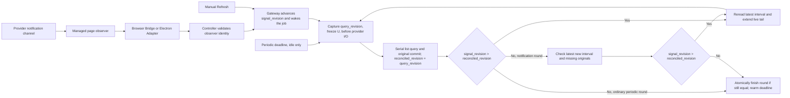

# Email notification wakeups and periodic verification

> Language: English | [简体中文](../zh-cn/docs/email-notification-wakeup-design.md)

Status: accepted on 2026-09-23. The Browser Bridge notification→Gateway→Reader path was deployed on 2026-09-24 (section 9.4); the five-minute quiet tier and Electron qualification remain pending. Continuous rounds remain, but notifications, native website synchronization and Reader queries have no proven fixed ordering. This revision treats notifications as reconciliation hints, rereads only the latest incremental interval and continues the live tail. The 2026-09-24 revision organizes notification hints, the periodic deadline and manual Refresh as three trigger sources of one serial executor with a single monotonic request revision (section 1.3), and folds manual Refresh settlement into that revision instead of a separately captured Refresh ID. The same revision makes the periodic check an adaptive fallback (section 1.4): 60 seconds remains the default, a qualified healthy observer lengthens it to five minutes, every finished round schedules one 60-second recheck, and any periodic-only discovery or observer degradation shortens it back immediately. Handling more than 50 mails is deferred; mutual test sends between the three signed-in dedicated-browser mailboxes are authorized. Earlier field observations below are historical; section 9.4 and the linked validation report record the current production evidence and receiving-switch boundaries.

## 1. Adopted behavior

An enabled mailbox keeps a Controller-owned observer. A qualified website notification wakes the existing discovery job and marks the mailbox for reconciliation; it does not establish that a mail is already queryable or create a separate job for each event. A notification round runs until accepted hints have received bounded reconciliation and the final interval check finishes. An ordinary periodic round with no hints keeps one qualified range query, which also rereads the latest successful new interval before extending the tail. List queries and original acquisition remain serial. Hints arriving during that work are coalesced at the safe boundary after the current list and originals commit. Time-range collection remains the periodic check, at the existing **60-second idle interval after a round finishes** by default and lengthened only under the adaptive rules of section 1.4. Both paths use the same Reader, job, checkpoint, original-download and commit pipeline, and both are driven by the single request revision described in section 1.3.

The notification is a hint that the mailbox may have changed. Only a qualified collection result can advance a watermark or prove a mail was acquired. A provider event timestamp, message ID, stream frame or browser inbox update cannot substitute for that result. Whether a query began before or after a hint cannot by itself prove that the corresponding mail was acquired.

This first stage improves normal arrival latency while retaining periodic verification. It does not promise a strict 60-second delivery bound: collection time, availability and retry backoff still apply. The verification interval is no longer a fixed constant but the adaptive parameter of section 1.4. Its default stays at 60 seconds, and it lengthens only for a mailbox whose provider wake adapter has passed the section 9 item 1 qualification and whose observer is healthy. The owner decided on 2026-09-24 that the tolerated delay after a missed notification on such a mailbox is five minutes.

This document extends the [timeline design](email-timeline-incremental-sync-design.md) and [page reuse design](email-cross-round-reuse.md). One reread of the latest successful new interval is an explicit, bounded revision to timeline v2's ordinary no-old-range rule. All other qualification, retry, suppression, overflow and manual Refresh rules remain the baseline, with their within-round interaction specified in sections 5–6. Scope is QQ Mail, Gmail and consumer Outlook with an already authorized receiving binding. Microsoft 365 remains unverified. Mailbox receiving switches are not enabled by installing the feature.

### 1.1 Notification recipient and online requirements

This design uses the mailbox website's native server-update channel: **mail server → online owned mailbox task page → page observer → Controller → Gateway synchronization job**. The observer stays registered and handles incoming network events; the task page can run in the background without the user watching it. The page's own scripts and connection management still run, so listening does not eliminate page CPU or network costs.

Receiving requires maintaining that page and its login state. Closing, freezing, disconnecting, device sleep or an expired login interrupts availability; recovery follows sections 7 and 8. Removing the fixed two-hour page age limit does not guarantee uninterrupted service. Direct server notifications to SparkClaw without a mailbox webpage would require separate Gmail/Outlook official notification API integration, authorization and receiving infrastructure; this design does not adopt that path.

### 1.2 Cost compared with the existing polling loop

The baseline is today's enabled mailbox with a reused page and a 60-second wait after each collection round finishes.

| Item | Existing continuous polling | Notification wakeups plus 60-second checks |
|---|---|---|
| Page memory | Retains a reusable page | Still needs a resident page, with bounded observer and event buffers; no substantial memory reduction is promised |
| CPU | Periodic queries, parsing and scheduling | A hint-free periodic round still queries once but handles repeated metadata from the latest interval; notification rounds add serial increments and a final check |
| Network | Periodic queries while the page maintains native connections | A hint-free periodic round normally makes one latest-interval-plus-tail request, splitting an over-limit combined result; a notification round usually makes N incremental requests plus one final check, downloading only missing originals |
| Synchronization delay | Waits for the next check | A qualified notification can advance the same job |

The first stage targets timeliness; no measured resource saving percentage is available. Idle checking frequency stays at the 60-second baseline until a provider's wake adapter qualifies; after that, section 1.4 lengthens the quiet-mailbox interval to five minutes, which reduces a silent mailbox from about 60 list requests per hour to about 12 plus one recheck per round. A continuous round that successfully finishes its final-interval check rearms the next ordinary check to avoid an immediate duplicate check, but busy mailboxes still make roughly today's number of queries because every finished round is followed by one 60-second recheck. Resident-page costs remain in every case.

Every qualified notification durably updates a pending-reconciliation revision; redelivery is deduplicated, and hints received during list and serial-original work are coalesced. At a safe boundary, unresolved hints prompt one next query from the **start of the latest successful incremental interval** through a new fixed upper bound. This rereads only the latest interval while extending the live tail, with stable-ID deduplication; it does not create one acquisition-plus-recheck cycle per hint. Query and notification timestamps do not prove acquisition.

Retain a two-second minimum incremental-start spacing as an initial internal rate limit, subject to duration, exclusivity and backoff; it is not a provider-visibility delay inferred from the 81 ms or 1.33 s observations. A notification round with N increments normally makes N+1 list requests if hints stop and none arrive during checking; a hint-free periodic round adds no second request but its sole request rereads the latest interval. Hints during a candidate final check keep the round open. There is no measured saving percentage, and spacing proves neither savings nor complete late-visibility recovery.

The owner adopted persistent state and resource budgeting. Before activation, measure request counts, CPU, memory, traffic, peak buffer use and wake latency under idle, successive-arrival and abnormal-notification workloads. Define buffer limits, per-acquisition/execution-slice time and byte budgets, backoff and degradation thresholds. Sustained notifications can extend one logical round. Exhausting an execution budget yields resources while durably preserving phase and pending work; it neither finalizes the round nor adds historical rescans. Resume the same round without unbounded memory queues or unlimited high-frequency loops.

### 1.3 Unified trigger model: three sources, one revision, one executor

Notification hints, the periodic deadline and manual Refresh are three trigger sources for one serial executor per mailbox. No trigger performs collection itself, and no trigger needs to know whether the others exist or whether a round is running. A qualified notification hint and an accepted manual Refresh each do exactly one durable thing inside the owner transaction: advance the mailbox's `signal_revision` and wake the job. The periodic deadline is the idle executor's wait bound rather than a request: it starts an ordinary round only when no round is active, and a finishing round rearms it, so a deadline that falls due during a round never produces an immediate duplicate query.

```
Trigger sources (any time, any concurrency)         Executor (at most one per mailbox)
┌──────────────────────┐
│ Qualified hint        │──┐                          loop:
├──────────────────────┤  │  signal_revision++         query_revision = signal_revision   ← before provider I/O
│ Manual Refresh        │──┼──────── wake ───────────▶  list [L, U) and acquire originals serially
└──────────────────────┘  │                            commit; reconciled_revision = query_revision
┌──────────────────────┐  │                            if signal_revision > reconciled_revision:
│ Periodic deadline     │──┘ (starts a round only        reread latest interval + new tail, loop
└──────────────────────┘     when idle; rearmed        else: final check (notification round) or finish;
                              by every finish)           finish only if still equal, in one transaction
```

The executor keeps three monotonic revisions per mailbox, all persisted in Store. They count for the lifetime of the mailbox record and are never reset, not even when the binding generation changes; the binding generation fences checkpoints and Refresh requests, not the counters:

| Revision | Written by | Meaning |
|---|---|---|
| `signal_revision` | any trigger source, atomically | The newest recorded intent to synchronize |
| `query_revision` | the executor when a list query starts, in the transaction that freezes `U`, before provider I/O | The intent this query promises to cover |
| `reconciled_revision` | the executor when that query and its serial originals commit | The intent proven covered by a qualified result |

Invariant: **`signal_revision > reconciled_revision` implies a query will start.** The comparison runs in the same Store transaction that commits an increment or finishes a round, so a trigger arriving at any moment—before the list, during serial originals, during final checking, or racing the finish transaction—is either covered by a query that captured a later `query_revision` or forces exactly one more query. Ten hints and two Refresh clicks during one query collapse into one follow-up because the comparison is on revisions, not counts. `query_revision` must be captured before the provider request is sent; capturing it afterwards would treat triggers that arrived mid-query as covered, which is the classic lost-wakeup fault. Because every query rereads from a persisted watermark and deduplicates stable IDs, a follow-up query caused by an already-covered hint costs one list request and never duplicates a download.

A manual Refresh is not a second track. Accepting it advances `signal_revision` and records the value obtained as that request's `refresh_revision`; the request is settled when a qualified commit raises `reconciled_revision` to at least `refresh_revision`. This replaces the separately captured pending Refresh ID: a Refresh accepted while a manual round is already running obtains a revision above that round's `query_revision`, so the running round cannot settle it and one follow-up query is guaranteed. The UI's `refresh_pending` projection is simply "some accepted `refresh_revision` exceeds `reconciled_revision`". Today's `emailPollRequest` returns early whenever `RefreshPending` is already set, which absorbs a request made during a running manual round into that round even if its provider list was already fetched; section 9 item 3 corrects this.

Hints are not debounced before acceptance. Coalescing already reduces any burst that arrives during one query to a single follow-up, and the two-second minimum incremental-start spacing bounds how quickly a burst arriving while idle can start a second query. A debounce buffer would only add a window in which an accepted hint is neither persisted nor acknowledged, which contradicts the section 4 rule that Gateway acknowledges only after the Store transaction has recorded the wakeup. Provider-level record splitting (one mail producing several transport records) is handled by classification in the observer, not by delaying acceptance.

Sections 5 and 6 apply this model to interval bounds, the latest-interval reread and final checking.

### 1.4 Adaptive verification interval: polling as a fallback

In the model above the periodic deadline is structurally already a fallback: it is the idle executor's wait bound and never a request. What remains to decide is its length, and that cannot be a single constant because periodic collection serves two duties, only one of which notifications can replace:

1. **Missed-notification insurance** — the hint never arrived, the observer disconnected, or the provider protocol changed. A qualified, healthy observer makes this rare, so the interval may lengthen.
2. **Late-visibility recovery** (section 6.1) — the hint arrived and a query ran, but the provider had not yet made the mail queryable. Recovery relies on the next query rereading the latest interval. Notifications cannot replace this, and what it needs is one query shortly after activity, not a query every N seconds.

Lengthening a single interval would therefore stretch late-visibility recovery from one minute to the new interval. The interval is split into tiers instead:

| Tier | Condition | Delay | Purpose |
|---|---|---|---|
| Notification-driven | Qualified hint | Immediate | Primary path |
| Post-activity recheck | Any round finishes (`completed`, ordinary or notification) | One shot, 60 seconds later | Late-visibility recovery; runs once, then hands over to the quiet tier |
| Quiet fallback | Observer `watching` **and** this provider's wake adapter passed section 9 item 1 **and** no periodic-only discovery within the recovery window | Five minutes initially; may widen after further qualification | Missed-notification insurance |
| Degraded fallback | Observer `degraded`, `login_required`, `stopped`, unknown, or adapter not qualified | 60 seconds (today's behavior) | Plain polling |

The post-activity recheck is what makes the long interval safe: the quiet tier applies only to a mailbox that has done nothing for a full minute after its last round. A silent mailbox drops from about 60 list requests per hour to about 12; a busy mailbox behaves as today because every notification round is followed by one recheck. The recheck is itself an ordinary round—it rereads the latest interval and extends the tail—so it needs no new phase or query shape. If it finds nothing and no trigger arrives, the next deadline is set from the quiet tier.

`watching` alone does not prove notifications are not being lost (section 7). The quiet tier therefore needs a corrective signal: **if a periodic-only round commits a qualified new source in its new tail, that mailbox's interval drops to 60 seconds immediately and recovers by doubling (60 → 120 → 240 → 300 seconds) after each consecutive periodic-only round whose new tail is empty.** Section 8 already records "last periodic-only discovery" as a diagnostic; this promotes it to a scheduling input. It does not need to prove the provider dropped a notification—for scheduling weight the conservative direction is enough.

Two definitions keep this signal from firing on expected behavior. A round is **periodic-only** when, in its finish transaction, `signal_revision` equals the `reconciled_revision` recorded at the previous finish: no trigger of any kind was accepted at any point during the round. Judging the whole round rather than the first query's `query_revision` excludes hints that arrive a second or two after the query started, as observed for Gmail. A **periodic-only discovery** counts only qualified new sources committed in the round's new tail `[P, U)`. Sources admitted from the reread segment `[L, P)` never count: their received time lies in an interval whose hint, if any, belonged to an earlier round, and the post-activity recheck exists precisely to admit them. Without this exclusion every late-visible mail recovered by the recheck would look like a missed notification and the quiet tier would be unreachable. The recovery counter resets only on another periodic-only discovery; a notification round that finds mail is evidence that the channel works and does not interrupt recovery.

Shortening always takes effect immediately, lengthening only at the next `emailPollFinish` rearm. This reuses the existing asymmetry in `emailPollRequest`, which already migrates `PollInterval` and only ever advances an idle deadline, never postpones one. Concretely, `plan()` in `emailmanagement/service.go` computes the tier interval per mailbox and passes it as `RepeatInterval` in place of today's constant `ScanInterval`; `emailPollRequest` stores it as `PollInterval` and, through its existing rule, pulls an idle deadline forward when the interval shrank and leaves it untouched when it grew. The state machine of sections 5 and 6 is unchanged; `PollInterval` becomes a per-mailbox value computed from observer state, adapter qualification and the recovery counter instead of a configuration constant. Manual Refresh, hints and the revision invariant are unaffected by which tier is active.

Qualification is per provider. QQ may enter the quiet tier once its `mail_148` classifier passes positive and negative fixtures; Gmail and consumer Outlook remain on the degraded tier until their classifiers qualify, even when their observers report `watching`.

## 2. Live evidence and its limits

All times below are Asia/Shanghai on 2026-09-23. Tests used temporary isolated task pages in the existing signed-in browser, instrumented network observers and background focus emulation. These are short compatibility observations; neither notification parsing nor production wakeup scheduling was installed. Temporary observers and artifacts were removed.

| Provider | Observation | What it establishes |
|---|---|---|
| QQ Mail | `wss://wx.mail.qq.com/socket` delivered `mail_148` with `emailId` at 16:54:38.345. Existing scheduled discovery recorded the mail at 16:54:38.264. | A mail-specific signal exists. Discovery preceded the event by 81 ms, so this test does not prove push-triggered acquisition. |
| Gmail | `/punctual/multi-watch/channel` on `signaler-pa.clients6.google.com` uses a long-lived XHR response. The later test mail had receipt time 17:38:06.885; native `/sync/u/...` requests started at 17:38:08.218, and unread count rose from 11 to 12. The channel response contained a larger record than its routine heartbeat records. | Arrival and native synchronization were about 1.33 seconds apart. The specific notification was not decoded to that mail ID, and its exact arrival time was not retained across channel renewal; causality is not fully proved. |
| Consumer Outlook | `/owa/notificationchannel` supplied SSE data. At 17:32:26.777–17:32:27.558 a burst of larger frames appeared; inbox conversations rose from 2 to 3 and unread count from 1 to 2. No additional main-page `service.svc` or search request was observed after that burst in the inspection window. | The notification stream and inbox change correlate strongly. This does not prove a complete original message was present in the stream, nor that every possible worker transport was observed. |

An earlier second test was not actually sent and is excluded. During the next attempt, Gmail's channel changed around 17:32 even though a recent-mail query returned no mail; the Gmail test was subsequently resent and confirmed at 17:38. **Frame size, any network activity, an open connection and heartbeat traffic are not qualified new-mail detectors.**

These observations also do not establish a universal order of notification, native website synchronization, Reader query and serial original acquisition. QQ's hint followed discovery; Gmail's exact hint arrival time is absent; Outlook lacks a precise query delta. The observed numbers cannot define a universal quiet-time wait, identify a later hint as a new mail, or make query start/completion a proof of visibility. A notification records a reconciliation intent; Reader qualification remains independent.

Before enabling each provider's wake adapter, identify its mail-change envelope and qualify positive and negative fixtures. QQ starts from the observed `mail_148` envelope. Gmail and Outlook still need that protocol-level qualification. Unsupported or changed envelopes leave periodic verification active and report the observer as degraded; they do not silently become verified new-mail events.

### 2.1 Successive notifications and observation granularity

The observed channel persists and is renewed by the website as necessary. Further updates can arrive while it remains online. Treat **connections, logical notifications and transport fragments** separately: a connection carries updates, a notification represents a change, and frames/response fragments transport data. Do not assume one notification per mail, one mail per notification, or one complete notification per fragment.

| Provider | Temporary observation in this test | Still unproved |
|---|---|---|
| QQ Mail | Observed inbound WebSocket messages and identified `mail_148` with a message ID | Whether successive mails produce individual or coalesced notifications, and whether delivery is complete |
| Gmail | Observed incremental changes in a long XHR response and correlated native sync requests and inbox changes | Mail-change envelope classification, notification-to-mail mapping and coalescing under successive arrivals |
| Consumer Outlook | Observed fetch-carried SSE; a burst of frames appeared near one test mail's arrival | Frame-to-logical-event boundaries, mail-event classification and coalescing under successive arrivals |

Support coalesced changes, duplicate hints, records split across fragments and multiple records within a fragment, using each provider's qualified format. A data callback proves only that data arrived; classification may then produce `mailbox_changed`. Heartbeats may inform channel diagnostics but cannot wake collection. These tests did not determine notification counts or frequency for successive arrivals in any of the three providers, or qualify production synchronization for that workload. Temporary monitoring has ended; it is not a currently running production listener.

## 3. Data flow and responsibilities



Every arrow into `G` is a trigger; every trigger does the same thing. The only decision points are the two revision comparisons, and both run inside the Store transaction that commits the preceding work.

The page observer decodes only the notification envelope needed to classify a mailbox-change hint. It does not replay private notification requests, replace the website's connection management, or publish provider payloads as mail sources. The existing Reader performs qualified range queries and original acquisition. An observed QQ ID may help correlate diagnostics inside the page; it does not authorize a new download path or bypass existing target checks.

The runtime adapter delivers bounded metadata events from the owned task document to Controller. A page signal is untrusted input. Controller supplies the mailbox/owner binding from its registration, validates tab ownership, origin, document generation, account, credential generation and managed-script version, and rejects stale or mismatched signals. The web page never receives Gateway credentials or a general callback URL.

Gateway owns persistent scheduling and rechecks receiving permission and binding generation when accepting a wakeup and when starting work. Controller owns observation and page lifecycle. Reading, sending, login and other exclusive operations continue to use the existing operation gate. Watching an idle page does not hold an active read reservation indefinitely.

### 3.1 Concurrent notification reception and mail requests

Notification reception and mail-list/original requests can run concurrently in the same owned page, supplying change hints and mail acquisition respectively. Continuous observation does not hold the collection mutex; collection for a mailbox stays serial. Production implementation must qualify the following interactions; successful temporary packet observation alone is insufficient.

| Interaction | Required handling |
|---|---|
| A hint arrives during a list query or serial original acquisition | Let current work finish and keep observing; coalesce hints at the safe boundary into one latest-interval-plus-tail query without starting another parallel round |
| Successive or duplicate hints | Update the pending-reconciliation revision; one next query may reconcile several hints, with event redelivery and originals deduplicated separately; never infer acquisition from hint timing |
| Queries, reads or marking mail read generate notifications | Classify known self-generated effects; degrade the observer if they cannot be distinguished safely, preventing a synchronization/notification feedback loop |
| A query navigates, replaces the page or recreates a native connection | Preserve pending intent, revalidate and reinstall the observer, and request catch-up; `resetRound` must preserve the observer |
| Exclusive login, send or validation | Preserve the existing gate and observer suspension/recreation rules, including page ownership and account verification |

Instrumentation must preserve the webpage's XHR/fetch/WebSocket calls and data behavior without taking over, locking or exhausting the response stream needed by the website. Handle stream cancellation, connection renewal, fragment assembly and bounded memory. Temporary cloned-stream probes provide observation evidence; they cannot go directly into production without long-run resource and compatibility qualification. Concurrent acceptance checks that the website still updates normally, the Reader still acquires qualified originals, and the notification path preserves genuine changes arriving during collection.

## 4. Internal event delivery

Add a versioned internal observer capability to the runtime adapter and Controller client. Gateway reconciles its enabled-mailbox intent to Controller and consumes one authenticated event stream per Controller connection over the existing owner-only local transport. Use a streaming HTTP response initiated with credentials in the request body/headers, never URL query parameters. Route names and DTOs must be fixed in the implementation contract tests; these operations do not exist in today's Controller API.

The browser side uses a persistent adapter event callback. Do not create repeated CLI `eval` calls, full network-log downloads or repeated mailbox HTTP queries just to detect events. Both the deployed Browser Bridge path and the target [Electron Adapter](desktop-client-embedded-browser-design.md) must implement the same bounded event semantics and receive separate qualification; live evidence from one is not inherited by the other.

Conceptual event fields are `schema_version`, `mailbox_id`, `binding_generation`, `watch_epoch`, `sequence`, `kind`, `observed_at` and an allowlisted `reason`. Kinds are `mailbox_changed`, `watch_state` and `resync_required`. Controller generates a new epoch after observer/document replacement and a monotonic sequence inside that epoch. Raw messages, subjects, addresses, cookies, session URLs, response bodies and provider identifiers are excluded from the event stream and durable diagnostic log.

Controller retains bounded unacknowledged events and deduplicates redelivery. Gateway may coalesce scheduling within a round while durably retaining the latest pending-reconciliation revision. A hint received after a query starts defaults to later reconciliation and cannot be marked as an acquired mail based on timing. Gateway acknowledges only after the Store transaction has recorded or deduplicated the wakeup. Reconnection carries the last accepted epoch/sequence. Unknown epochs, buffer loss and gaps cause one `resync_required` wakeup per affected mailbox; an in-memory event buffer is not a durable provider cursor. A stalled consumer cannot create an unbounded buffer.

The intent session has an independently renewed liveness lease. Gateway loss eventually releases orphaned observers; a live receiving intent renews the lease regardless of new-mail frequency. This lease checks local process/session liveness and does not query the provider mailbox. Event transport loss never disables the existing verification job.

## 5. One continuous round with serial increments

**A notification round** is one logical reconciliation task: start synchronization → query and acquire originals serially → coalesce hints received during that work → reread the latest interval and extend the tail when needed → check only the newest interval → finish. A hint-free ordinary periodic round keeps one query but also rereads the latest successful new interval; a qualified hint during it enters the notification-round reconciliation path. A mailbox has one active job, and observation does not hold a separate collection lock. **A hint revision is scheduling intent, not a mail-coverage watermark.** Hint and query timing alone cannot prove acquisition.

Store persists round identity, the three revisions of section 1.3 (`signal_revision`, `query_revision` captured when a list request starts, `reconciled_revision` advanced by qualified commits), each accepted manual Refresh request ID with its `refresh_revision`, phase, in-flight bounds and the latest successful new interval `last_interval_start`/`last_interval_end` across rounds, bound to its binding generation and scope version. Deduplicate events by epoch/sequence and persist before acknowledgment. A qualified query may advance `reconciled_revision` only to its captured `query_revision`; this means a bounded reconciliation ran, not that every mail implied by a hint was delivered. Hints and Refresh requests arriving during query or serial original work obtain revisions above the captured `query_revision` and therefore remain unresolved by that commit. Rereading a prior interval deduplicates committed stable IDs without downloading completed originals again. The concrete record layout and the four transactions that write these fields are specified in section 5.2.

| Current state | Notification/request-completion handling |
|---|---|
| Qualified hint or manual Refresh arrives while idle | Advance `signal_revision` and wake the mailbox job; begin at the saved latest successful new interval's lower bound, or at `poll_through` if none exists |
| Periodic deadline falls due while idle | Start an ordinary round at the current `signal_revision` without advancing it; the round is hint-free unless a trigger arrives during it |
| Periodic deadline falls due while a round is active | Nothing; the active round's finish transaction rearms the deadline, so the deadline never forces a duplicate query |
| Hint or Refresh arrives during a list query or serial original acquisition | Advance `signal_revision` above the captured `query_revision`; finish current work and coalesce at the safe boundary without parallel queries |
| Several hints or Refresh requests already waiting | Capture the latest revision when the next query starts; make one latest-interval-plus-tail query, not a cycle per event |
| Increment commits with `signal_revision > reconciled_revision` | Reread the latest successful new interval and extend to a new fixed upper bound; record only the new tail as the next latest interval |
| Increment commits with `signal_revision = reconciled_revision` | A notification round checks its newest interval; an ordinary periodic round that already reread the latest interval finishes directly |
| Hint or Refresh arrives during final checking | Retain the check's qualified result but revoke completion; reconcile the latest interval plus the new tail, then check the new latest interval |
| Manual Refresh accepted while a manual round is already running | Advance `signal_revision` again and record the new `refresh_revision`; the running round's `query_revision` is lower, so its commit cannot settle this request and one follow-up query is guaranteed |
| Backoff or execution-budget pause | Persist round, phase and revisions; yield resources and resume without pretending the round finished |
| Receiving disabled, binding changed or account mismatch | Reject new hints, fence the old observer and block old-generation automatic work while retaining originals and audit state |

“No hints remain unresolved” means the current increment and serial original work finished and an atomic read finds `signal_revision <= reconciled_revision`. It does not require a provider end-of-notifications event or treating heartbeat cessation/disconnection as the end. Existing observations cannot justify an invented quiet period. QQ's observed `emailId` remains diagnostic until one-to-one/coalescing/redelivery semantics are qualified; Gmail/Outlook frame size or unread count cannot skip a query either.

To finish a notification round, one Store transaction validates the checked newest interval, phase and binding generation and reads `signal_revision = reconciled_revision`. A hint or Refresh accepted after checking began raised `signal_revision` and prevents completion; one accepted after that transaction commits starts a new round. Both cases are the same comparison, so there is no gap between "check finished" and "marked idle" in which a request can be swallowed. Manual Refresh settles by the same rule: a qualified commit whose `query_revision` is at least the request's `refresh_revision`. Failure keeps Refresh pending under existing backoff even while the notification round continues; an earlier automatic query, whose `query_revision` is below `refresh_revision`, cannot falsely complete it. Today's rule that exhausting the retry budget releases the Refresh button with a recorded error is dropped: it existed because a Refresh was a single bit that had to be cleared before the user could ask again, whereas a `RefreshRequest` is settled only by a qualified commit and stays unsettled through any number of failed attempts. Clicking again while unsettled merely advances `signal_revision` and changes nothing, so there is nothing to release; the invariant already guarantees the backoff schedule keeps trying. The error itself remains visible through the job's `ErrorCode`, retry state and `NextAttemptAt`, which the UI shows alongside the pending state (section 5.2). A commit whose list is complete but whose originals partly failed does settle the request—the failures are exposed through `pending_failure_count` and `refresh_available` as today—so the button is released at the first complete list rather than at retry exhaustion.

Within one logical round, a first qualified original failure for an exact mail ID must not spend its second failure allowance automatically during later hints, overlap rereads or final checking. The remaining attempt belongs to the next periodic round or an explicitly accepted Refresh. Existing two-failure suppression, operational-failure classification and overflow confirmation remain in force.

Classifiers exclude heartbeats, reconnect acknowledgements, read-state-only changes and known self-generated read effects while observation stays active. Unsafe classification degrades to periodic checks. Single-mailbox exclusivity, two-second minimum incremental-start spacing, longer backoff and resource budgets constrain sustained work; yielding an execution slice does not change the logical round.

### 5.1 Scheduling example for successive arrivals

This is a design example, not new live evidence. A hint starts `[T0, T1)`. Another arrives after the list result but during serial original acquisition. It could concern an already captured mail, a mail not yet queryable, or one whose received time lies in `[T0, T1)`; hint timing cannot distinguish them. After committing current work, make one reconciliation query `[T0, T2)`, rereading the latest interval and extending the tail `[T1, T2)` with stable-ID deduplication. The latest new interval becomes `[T1, T2)`. A further hint during that query leads to `[T1, T3)`; when hints drain, check only the newest interval `[T2, T3)` rather than the entire `[T0, T3)` round.

If a hint arrives while checking `[T2, T3)`, retain acquired sources and reconcile `[T2, T4)` in the same round; when hints drain, check the new interval `[T3, T4)`. The prior check did not end the round. A hint-free ordinary periodic round makes one latest-interval-plus-tail query, without a separate final check.

If both the first notification-driven query and final check precede provider search visibility, the next 60-second periodic query still rereads that round's saved latest new interval. It can admit the source when the mail becomes queryable and its received time falls within that interval. Neither Gmail's 1.33 s nor QQ's 81 ms establishes a fixed wait; visibility beyond the latest-interval overlap remains the section 6.1 limitation.

### 5.2 Target data model and the four transactions

The cursor is three time fields and the revisions are four integers. Every one of them is written only inside one of four Store transactions; nothing is written outside them. Field names below are conceptual; the implementation contract fixes the wire names.

```go
// Mailbox record, one per mailbox. Cursor fields are re-anchored when
// BindingGeneration changes; revision fields count for the record's lifetime.
type Mailbox struct {
    BindingGeneration  int64
    // Cursor
    PollThrough        time.Time // P: upper bound proven completely covered
    InflightUntil      time.Time // U frozen for the current query; zero when no query is in flight
    LastIntervalStart  time.Time // [L, P): latest qualified new tail, used as the reread segment
    LastIntervalEnd    time.Time //   valid only while LastIntervalEnd == PollThrough
    // Revisions
    SignalRevision     int64     // newest recorded intent to synchronize
    ReconciledRevision int64     // intent proven covered by a qualified commit
    LastEventEpoch     string    // event dedup: last accepted (epoch, sequence)
    LastEventSequence  int64
}

// Checkpoint, one per list query, created by Begin.
type Checkpoint struct {
    CheckpointRevision int64
    Kind               string    // "increment" or "final_check"
    Lower, Upper       time.Time // [L, U); for final_check Upper == OverlapEnd
    OverlapEnd         time.Time // P; separates reread [L, P) from new tail [P, U)
    QueryRevision      int64     // increment: SignalRevision; final_check: ReconciledRevision
}

// Manual Refresh request, one per acceptance.
type RefreshRequest struct {
    ID              string // opaque handle returned to the UI
    RefreshRevision int64  // value returned by the SignalRevision++ that accepted it
    SettledAt       time.Time
}
```

`query_revision` lives on the checkpoint rather than the mailbox because it is the promise of one particular query. All times use the existing `postgresTime` precision (UTC, microseconds).

**Transaction 1 — accept a trigger.** Every trigger source enters here.

```
AcceptTrigger(mailbox_id, binding_generation, source):
  box = lock(mailbox)
  if box.BindingGeneration != binding_generation || !box.IntakeEnabled: reject
  if source is an event (epoch, seq):
      if (epoch, seq) already accepted: return          // idempotent, no advance
      if epoch unknown or seq has a gap: treat as resync_required, continue
      box.LastEventEpoch, box.LastEventSequence = epoch, seq
  box.SignalRevision++
  if source is a manual Refresh:
      insert RefreshRequest{ID: token, RefreshRevision: box.SignalRevision}
  if the job is idle: job.NextAttemptAt = now            // wake; a running job needs nothing
```

`SignalRevision++` here is the only place the request revision advances. Notification, Refresh and resync differ only in whether they touch the dedup fields or insert a request; for scheduling they are identical. The periodic deadline does not enter this transaction—it is merely the idle job's `NextAttemptAt` falling due.

Setting `NextAttemptAt = now` is a sufficient wake-up. The worker in `emailmanagement/service.go` retries `ClaimEmailJob` on a fixed one-second timer whenever its last pass found nothing, independently of `ScanInterval`, so a job made due by this transaction is claimed within about one second on every Gateway instance; the in-process `s.signal()` channel wakes only the planning loop and is not required for correctness. The quiet-tier interval is therefore realized entirely by `NextAttemptAt`, and no component sleeps until a deadline.

**Transaction 2 — begin a query, before provider I/O.**

```
BeginQuery(mailbox_id, kind):
  box = lock(mailbox)
  P = box.PollThrough
  L = box.LastIntervalStart if box.LastIntervalEnd == P and same generation, else P
  box.CheckpointRevision++
  if kind == increment:
      U = box.InflightUntil if set (retry after a lost response) else now
      box.InflightUntil = U
      return Checkpoint{Kind: increment, Lower: L, Upper: U, OverlapEnd: P,
                        QueryRevision: box.SignalRevision}
  else:  // final_check: reread the latest interval only, promise nothing new
      require L < P                                  // a latest interval exists
      return Checkpoint{Kind: final_check, Lower: L, Upper: P, OverlapEnd: P,
                        QueryRevision: box.ReconciledRevision}
```

The query range is derived from `P` and the saved latest interval; `L` is not stored separately. `InflightUntil` keeps `U` stable across retries, and `CheckpointRevision` fences stale checkpoints. `QueryRevision` and `U` are frozen in the same transaction, so "captured before provider I/O" is guaranteed by the transaction boundary rather than by call ordering.

The final-check work order differs from an increment in exactly three values, and each encodes one rule. `Upper = OverlapEnd = P` makes the new tail empty, so the whole range is the reread segment and the watermark cannot move. `QueryRevision = ReconciledRevision` rather than `SignalRevision` records that this query promises to cover nothing that arrived after the last commit—it does not read past `P`, so it has no standing to settle any trigger accepted since then. `InflightUntil` is left untouched because `Upper` is fixed and needs no protection against drift, and writing it would make the next increment's Begin reuse `U = P` and query an empty range.

Why the revision value matters: after an increment commits with `ReconciledRevision = 12` and Finish decides to enter `final_check`, a hint may arrive before the final check begins, raising `SignalRevision` to 13 for a mail received after `P`. If the final check copied 13 and its commit wrote `ReconciledRevision = 13`, Finish would see 13 = 13 and complete the round with that mail never queried—a lost wakeup relocated. Copying `ReconciledRevision` leaves 12 in place; Finish sees 13 > 12 and requeues an increment that covers the tail.

**Transaction 3 — commit a query result.**

```
CommitQuery(checkpoint, result):
  box = lock(mailbox)
  require box.PollThrough == checkpoint.OverlapEnd
       && box.InflightUntil == checkpoint.Upper
       && box.CheckpointRevision == checkpoint.CheckpointRevision
  if result is incomplete, overflowed or failed: keep InflightUntil, advance nothing, return
  new ProviderMessageIDs in the reread [L, P) → admit as sources without moving the watermark
  every identity in the new tail [P, U) → source, or explicit failure/purge/suppression
  box.PollThrough = U                                     // cursor advances
  if U > P: box.LastIntervalStart, box.LastIntervalEnd = P, U
  box.InflightUntil = zero
  box.ReconciledRevision = checkpoint.QueryRevision       // revision advances
  settle every RefreshRequest where RefreshRevision <= checkpoint.QueryRevision
```

Cursor and revision advance in one transaction, so there is no intermediate state in which the watermark moved but intent was not settled, or the reverse. Reread admissions use a dedicated path; `PollThrough` only ever moves forward.

Commit has no branch on `Kind`. Applied to a final-check work order, every rule above degenerates correctly on its own: the reread segment `[L, P)` is the entire range and receives the admission path, which is precisely what final checking does; the new tail `[P, P)` is empty; `PollThrough = U` writes `P` over `P`; `U > P` is false, so the latest interval is unchanged; `ReconciledRevision = QueryRevision` writes the value already there; the settlement predicate admits no request that was not already settled; `InflightUntil` was already zero. The semantics of final checking—no watermark move, no revision advance, no Refresh settlement, no tail coverage—follow from the three values Begin put on the work order, not from conditional code in Commit or Finish. A final check's `QueryRevision` retains diagnostic value only: at Finish, `SignalRevision > checkpoint.QueryRevision` distinguishes a hint that arrived during the check from one that arrived before it.

**Transaction 4 — finish a round.**

```
FinishRound(job):
  box = lock(mailbox)
  if box.SignalRevision > box.ReconciledRevision:
      job.NextAttemptAt = now; return                     // one more query, back to transaction 2
  if notification round and final_check not yet done: phase = final_check; return
  job.State = completed
  periodicOnly = (box.SignalRevision == ReconciledRevision recorded at the previous finish)  // no trigger during the whole round
  newTail      = (this round committed at least one new source in a new tail [P, U))
  if periodicOnly && newTail: recovery = 0                 // periodic-only discovery
  else if periodicOnly:       recovery++                   // empty quiet round
  tier = f(observer state, adapter qualification, recovery)   // 60 s doubling to the tier ceiling
  if newTail || !periodicOnly: job.NextAttemptAt = now + 60 s   // post-activity recheck
  else:                        job.NextAttemptAt = now + tier   // quiet
```

The last two lines are the whole of the post-activity recheck: a round that did something, or that somebody asked for, is followed by one 60-second round; a round that nobody asked for and that found nothing hands over to the quiet tier. No separate phase or flag marks "the recheck".

The comparison runs while holding the mailbox lock, and transaction 1 takes the same lock, so the two are strictly serialized: a trigger either raises `SignalRevision` before Finish reads it (Finish sees the gap and requeues) or after (the job is already completed and idle, and transaction 1 wakes it directly). There is no third case.

**Initial values and special situations.**

| Situation | Cursor | Revisions |
|---|---|---|
| Mailbox first enters timeline v2 | `PollThrough` = `Boundary` → `ActivatedAt` → `now`; no latest interval, so the first query uses `L = P` | All zero; `ReconciledRevision == SignalRevision` means no pending intent |
| Terminal gap skips an interval | `PollThrough` jumps past the gap, `LastIntervalEnd != PollThrough`, reread invalid, next query uses `L = P` | Unaffected |
| Binding generation changes | Re-anchored by existing rules | Revisions keep counting. Resetting them would let a client still holding an old `refresh_revision` observe a false settlement once the new counter passed it, and would force every comparison to carry the generation. Unsettled `RefreshRequest`s of the old generation are marked fenced and never settle; event dedup fields are cleared so every old epoch is unknown |
| Gateway restarts | All durable; a set `InflightUntil` means an uncommitted query exists and the retried transaction 2 reuses the same `U` | The checkpoint carries `QueryRevision`; a retried commit is idempotent |
| Controller restarts | Unaffected | A new epoch arrives → transaction 1 treats it as resync → `SignalRevision++` once |
| `U == P` (clock did not advance) | No new reread segment; the previous one is kept | Advances normally |

**What the UI sees.** Each entry of `refresh_requests[]` carries `refresh_request_id` (opaque) and `refresh_revision` (integer); mailbox status carries `reconciled_revision`. `refresh_pending` is computed server-side as "some request has `refresh_revision > reconciled_revision`". A `RefreshRequest` has only two states, unsettled and settled; there is no failed state and no release on retry exhaustion. While pending, the status also carries the discovery job's last `ErrorCode`, whether it is in retry wait, and its `NextAttemptAt`, so the UI can show "pending, last attempt failed with X, retrying at T" without any change to the request's state. The webchat `useEmailRefresh` guard no longer needs its own 60-second confirmation timeout: it compares the `refresh_revision` it received with the `reconciled_revision` of any later GET.

## 6. Incremental watermarks and the last-interval check

Retain periodic bounded-overlap-plus-tail collection with the idle interval chosen by section 1.4: 60 seconds by default, and after any finished round a single 60-second recheck before the quiet-tier interval applies. A hint-free ordinary round makes one range query and rearms the deadline; a hint received during it enters notification reconciliation. A notification round rearms the deadline only after its newest-interval check succeeds and it atomically finishes. The finish transaction also records whether the round was periodic-only (`signal_revision` at finish equalled the `reconciled_revision` recorded at the previous finish) and whether it committed new sources in a new tail, which is the input to the interval recovery rule. A hint, intermediate increment, heartbeat or reconnect cannot finalize that round. Due checks do not run concurrently with a continuously working mailbox; qualified increments still discover new mail and may satisfy due periodic intent. Existing retry/backoff remains effective.

Proposed phases are `incremental_fetch`, `final_check` and `completed`. Persistence rules:

1. Ordinary periodic and notification rounds both take committed `poll_through = P` and a new fixed upper bound `U`, then prefer **one** `[L, U)` query where `[L, P)` is the latest successful new interval saved across rounds. This interval must be complete, belong to the current binding/scope version and satisfy `last_interval_end = P`. If a terminal gap moved `poll_through`, the binding changed or no eligible interval exists, start at `P` and keep the old gap visible. An ordinary round with no hints finishes after that request. Existing provider-precision envelopes remain bounded, with exact local half-open filtering.
2. Before provider I/O, one Store transaction freezes upper bound `U` and captures `query_revision = signal_revision`. Handle the fresh provider list and missing originals serially; no query may reuse the prior Reader list cache. Represent every identity in a complete result as a source or explicit failure/purge/suppression state. Advance the watermark only for the new tail through `U`, set `reconciled_revision = query_revision` and settle every accepted Refresh request whose `refresh_revision <= query_revision` in the same transaction. Admit new identities in the overlap `[L, P)` with a special Store operation that does not roll back `poll_through`. Save `[P, U)` as the latest successful new interval; if `U = P`, retain the previous interval. Hints or Refresh requests received during this work hold revisions above `query_revision` and remain unresolved.
3. If Reader explicitly reports that combined `[L, U)` **overflows the 50-mail limit**, do not treat that as overflow of the new tail or advance the watermark. Qualify `[L, P)` and `[P, U)` separately, then apply existing overflow/frozen-interval rules to their real results. The split settles only the initially frozen `query_revision`; hints during the split remain unresolved. Account, identity, transport and other partial-result failures follow existing failure rules and cannot use splitting as a bypass. If the overlap itself is incomplete, record an explicit historical coverage problem rather than claiming the old watermark still proves it complete. Automatic pagination and arbitrary over-50 backlog recovery remain deferred.
4. If `signal_revision > reconciled_revision` after the increment and originals commit (which includes every Refresh accepted after that query began, since acceptance advanced `signal_revision`), repeat from step 1, rereading only the **latest new interval** and extending the tail. Otherwise, a notification round enters `final_check`: freeze the latest new interval, clear Reader request cache, query that interval anew and acquire eligible missing originals. An ordinary periodic round that already reread the latest interval skips `final_check`. Final checking cannot count a second qualified failure for an ID whose first failure occurred in this same round.
5. Qualified identities newly found during final checking may commit sources and failure state. Completed, intentionally purged or suppressed originals are not downloaded again. A list recheck alone is not an original-acquisition failure. Checking repairs only the newest interval, neither moving the watermark backward nor hiding earlier coverage gaps.
6. After qualified final checking, atomically test `signal_revision > reconciled_revision`; an unsettled Refresh is by construction included in that test. If true, retain the round and return to step 1; otherwise mark `completed`, record final-check completion and schedule the next ordinary deadline. Source availability, discovery progress, hint reconciliation, Refresh settlement, final-check completion and round completion remain separate facts.
7. Failed/partial queries and identity errors do not advance that increment; failed checking does not finish a notification round. Persist in-flight/latest bounds, phase and unresolved revision and recover with existing backoff. After restart, reconcile deterministic commit results before resuming; never lose the latest interval recorded with its watermark advancement.

Store must add within-round progress, the latest interval across rounds, overlap source commits, per-request `refresh_revision` settlement and atomic finalization. Today's `RefreshPending`/`RefreshRequestID`/`RefreshActiveID` triple in `email_management_poll.go` is a boolean projection of the same idea and maps onto it directly: `RefreshRequestID` ≈ `signal_revision`, `RefreshActiveID` ≈ `query_revision`, and `RefreshPending` ≈ `signal_revision > reconciled_revision`. An overlap cannot blindly reuse a forward-only command requiring its lower bound to equal the current watermark. Memory/File/PostgreSQL semantics must agree. Retain only the latest successful new interval for overlap, not one old lower bound per hint or a whole-round rescan; qualified new-tail increments advance the watermark before final checking.

### 6.1 Coverage boundary of the last-interval check

Every query rereads the latest successful new interval, recovering mail absent from its first list once it becomes queryable; final checking rereads only a notification round's newest interval. Mail in an older interval becoming queryable after its last overlap, or mail in the final interval becoming queryable after checking, can still escape coverage. A 60-second periodic round rereads **one latest interval**, not arbitrary history. This scope does not guarantee recovery from arbitrary visibility delay.

This stage adds no whole-round rescan, 5–10-minute rolling lookback, provider change cursor or new exact-ID transport. Fixtures and mutual-send tests separately qualify last-interval recovery, incremental boundaries, notifications during finalization and remaining late-visibility limits; successful arrival examples cannot replace those timing checks.

### 6.2 Deferred: more than 50 mails in one interval

The owner explicitly deferred intervals exceeding 50 mails. Pagination, interval splitting, backlog continuation and same-timestamp overflow remain future design work, outside this stage's added implementation or mutual-send test requirements. Normal range requests still use `listChanges(..., limit=50)` without silently increasing the limit or paging in a loop.

Retain existing overflow detection and coverage-gap reporting: freeze a genuinely overflowing individual interval for one confirmation, then record a terminal gap if it still overflows. A combined overlap-plus-tail result that overflows is split before applying those rules; the combined result alone cannot create a terminal gap. The final check is not a third overflow confirmation and cannot turn a partial list into a complete result. Later hints do not reopen terminal gaps. Acquisition of all over-limit backlog is not promised.

## 7. Observer and page lifecycle

The 2026-09-23 Controller change removed the fixed two-hour page age limit. Today's read pool still closes an unused read lease after 30 minutes. Introduce an independent watch registration lifetime: an enabled, live receiving intent pins its owned observer page even when no collection has occurred for 30 minutes. A watch pin is not an indefinitely held collection reservation.

Reuse the same owned page for watching and collection where the runtime permits it. There is one observer per supported provider/bound account under the existing provider slot limit; do not expand multi-account support implicitly. Preserve normal task-page ownership and read-only observation in the desktop UI. Creating or reconnecting a watcher must not select a personal tab, move windows or steal focus.

Reader `resetRound` clears query results, rows, pagination and original bytes without deleting the notification observer or its pending hints. Page/document replacement reinstalls the observer before provider subscriptions begin. Runtime instrumentation must forward original XHR/fetch/WebSocket behavior, bound buffering and clean up listeners/readers; the temporary stream-cloning probes are not a production implementation template.

Track `starting`, `watching`, `degraded`, `login_required` and `stopped`. `watching` means the adapter and current document passed readiness checks, not that no notification can be lost. Detect stream loss, page close/discard/freeze, runtime or Controller restart, credential rotation and account replacement. Rebuild only owned task resources with bounded backoff, reinstall the observer, and request one catch-up round. Collection still begins through the normal worker after restart; startup bookkeeping itself does not call the provider.

Exclusive login/send/validation can suspend and drain the observer according to existing ownership rules, then recreate it and request catch-up when receiving remains enabled. Turning receiving off or removing its binding stops the observer and clears its watch pin. A user closing the observed task page revokes that document; any replacement must be a newly owned task page with fresh identity checks.

## 8. Failure and recovery behavior

| Event | Required result |
|---|---|
| Mail notification lost, duplicated or delayed | The periodic check continues to reread the latest interval and extend the tail, within five minutes on the quiet tier or 60 seconds otherwise. Older late-visible mail remains an explicit coverage boundary; stable IDs prevent duplicate downloads. |
| A periodic-only round commits new mail in its new tail | Drop that mailbox to the 60-second interval immediately and record the periodic-only discovery; recover by doubling after each consecutive periodic-only round with an empty new tail. Mail admitted from the reread segment by the post-activity recheck is expected late visibility and does not trigger this. |
| Watch transport disconnects or loses its buffer | Report degraded state, drop to the 60-second interval at once, reconnect with backoff, and enqueue one bounded resync intent. Returning to `watching` does not by itself restore the quiet tier; the recovery rule does. |
| Browser page is frozen/discarded or the machine resumes | Revalidate/rebuild the observer and schedule catch-up from the retained checkpoint; do not use the current time as a new lower bound. |
| Gateway/Controller crashes after receiving a hint | Persisted intent survives Gateway restart; uncertain/unacknowledged events may replay and deduplicate. Watch epoch loss requests catch-up. |
| Provider protocol no longer matches the parser | Disable that wake adapter, expose its reason and continue the original collection schedule. |
| Provider login expires | Report login required; preserve checkpoints and existing backoff. Recovery requires a newly verified matching account. |
| Flood of notifications or collection-generated traffic | Bound buffers/admission, deduplicate and rate-limit while durably preserving the round’s pending revision and phase; retain periodic checks and genuine arrivals during collection. |

Safe diagnostics include watcher state/reason, last validated signal time, accepted/deduplicated/rejected counts, wake-to-job-start latency, collection completion time, last periodic-only discovery and the mailbox's current interval tier. Seeing a mail first during a check is useful evidence of fallback value and a valid input to the interval recovery rule; it is not proof that the provider dropped a notification unless the event correlation is established. No per-heartbeat Store writes or new noisy end-user alerts are required.

## 9. Implementation and acceptance

1. Qualify classifiers with positive new-mail and negative heartbeat, reconnect, unrelated-activity and read-state cases. Keep sanitized fixtures or synthesized shapes, not raw mailbox payloads. All three remain targets; retain existing evidence levels and complete Gmail/Outlook event classification.
2. Implement observer lifetime and bounded runtime-to-Controller-to-Gateway delivery, including account/document fences, acknowledgment, epoch loss, backpressure and cleanup.
3. Add continuous rounds, `signal_revision`/`query_revision`/`reconciled_revision`, per-request `refresh_revision`, the latest new interval across rounds and phase to the single-mailbox job. Verify that `query_revision` is captured in the transaction that freezes `U`, before provider I/O, and that hints or Refresh requests arriving during query or serial originals obtain higher revisions and survive that commit. Fix the existing gap in `emailPollRequest`: a manual Refresh accepted while the job is `running` must mint a new request revision instead of returning early on `RefreshPending`, and `emailPollFinish` must clear pending only when the active revision equals the latest requested one; a test must show that a Refresh accepted during a running manual round produces exactly one follow-up query. A post-acceptance qualified query must settle Manual Refresh even while the notification round continues; within-round overlap must not consume a first-failed ID's second automatic retry. The webchat `useEmailRefresh` guard then relaxes from "disabled whenever pending" to "disabled only while this client's own submission is unconfirmed", since a second request during a running round is now meaningful. Cover replay, backoff, receiving disable, commit/ack loss, execution-budget pauses and restart.
4. Verify wakeup, latest-interval reread plus new tail after hints arriving during serial originals, and zero redownloads of completed stable IDs. Once hints drain, check only the newest interval. With no failures or new hints during checking, N increments normally add one final check. A hint-free ordinary periodic round still makes one list request that includes the latest interval.
5. Qualify successive arrivals, bursts, hints during increments and final checking, duplicate/coalesced hints and fragmented records. Cover a hint before the list, after the list but before original commit, and after round completion; neither QQ's 81 ms nor Gmail's 1.33 s establishes a universal delay. Race hints immediately before/after the completion transaction: the former extend the round and the latter start another. Race a hint against `query_revision` capture: one arriving one tick before capture is covered by that query, one arriving one tick after forces a follow-up. Race a hint into the gap between an increment's commit and the final check's Begin, for a mail received after `P`: the round must not complete after the final check, and the follow-up increment must acquire that mail; a variant that has the final check copy `SignalRevision` must fail this test. Show that N hints plus M Refresh clicks during one query yield exactly one follow-up query. Reconcile test originals independently of frame/unread counts.
6. Use fixtures for latest-interval overlap, splitting an over-limit combined range, empty/nonempty final intervals temporarily omitting mail, and **both first query and final check preceding visibility followed by one 60-second periodic overlap that admits the original**. Also test older-interval late visibility, visibility only after the periodic overlap, failed checks and restart; report those residual boundaries. Live over-50 tests remain deferred.
7. Exercise disconnects, page replacement, sleep/resume or freeze/discard, and Gateway/Controller restart. Include more than 30 idle minutes and more than two hours of operation, reporting bounded resources, continued checks, no focus stealing and gaps.
8. Qualify native webpage behavior and concurrent observation/acquisition. Measure hint-free periodic rounds, latest-interval rereads, split combined ranges, N increments plus final checking, and extra requests from hints during checking. Define budgets, buffers, backoff and degradation; sustained work may yield resources without fabricating completion or losing progress.
9. Verify the adaptive interval of section 1.4 with fixtures and mutual sends: a finished round is followed by exactly one 60-second recheck and then the quiet-tier deadline; a mail whose hint is suppressed in the fixture is discovered by the quiet-tier round within five minutes and drops the mailbox to 60 seconds in the same finish transaction; a late-visible mail admitted from the reread segment by the recheck does not drop the tier; a hint that arrives two seconds after a periodic query started makes that round non-periodic-only; consecutive periodic-only rounds with an empty new tail double the interval back to the tier ceiling, and a notification round that finds mail in between does not reset the recovery counter; observer degradation shortens the deadline at once while a return to `watching` alone does not lengthen it; an unqualified adapter never leaves the 60-second tier even when `watching`; and a hint or Refresh during a quiet-tier wait wakes the job immediately regardless of the remaining deadline. Confirm that lengthening never postpones an already armed idle deadline.
10. Enable qualified adapters separately while retaining receiving settings; the 60-second tier remains the default for every mailbox until its provider's adapter qualifies. Disabling an adapter stops new admission, returns its mailboxes to the 60-second tier, and retains or safely hands off the persisted round, pending notifications and last interval; originals and checkpoints survive.

### 9.1 Authorized mutual sends in the dedicated browser

The owner explicitly authorized sending test messages between the signed-in QQ, Gmail and consumer Outlook accounts in the dedicated browser, without asking the owner to send each message or reconfirm permission. Verify the three identities from page account evidence. Use unique test markers and short nonsensitive bodies, sending only to those verified accounts. An initial matrix may send one mail from each account to each of the other two, six total, followed as needed by successive-arrival and during-collection cases within scope.

Start observers before sending. Record send confirmation, received events, incremental/last-interval-check outcomes and source commits. An uncertain send must be reconciled by its test marker before another send click. Report protocol observations separately from the installed Gateway's full pipeline; a temporary observer or successful inbox update alone cannot qualify a production round. Use an isolated workspace/owned task pages without automatically changing receiving settings. Logs exclude accounts, bodies and credentials; do not delete existing mail.

### 9.2 First authorized live qualification (2026-09-24)

Two uniquely marked Gmail → QQ messages were sent through the signed-in dedicated browser after both page identities were verified. Both sends were confirmed; the QQ owned page displayed each marker and the QQ Reader's bounded native time-range query found and verified each original. The first 45-second observation ended before the send and receipt had both completed, so its sole WebSocket frame cannot be treated as a change hint. In the second 120-second observation, the page received a `cmd=0` connection frame followed by a `cmd=1` frame while the unique message became visible, and its original was verified after observation. Sanitized shape only: `cmd=0` had structured connection metadata; `cmd=1` had an opaque string `content`, string `encoding`/`scene`, and an HTTP status envelope. No addresses, message IDs or payload text were retained as evidence. This is a correlated positive QQ observation, not a proven one-to-one frame-to-mail mapping or a qualified production classifier. Read-state, unrelated-activity, heartbeat and reconnection controls, plus Gmail and Outlook positive/negative controls, remain necessary.

A separate 45-second QQ baseline with no test send and no Reader request yielded only the `cmd=0` connection frame. This distinguishes that frame from the observed `cmd=1` arrival in these two short runs; it does not exclude other causes of `cmd=1`.

The test also exposed a QQ Reader failure: discovery's time-range search found a stable ID, while a later pinned capture's native folder-list response failed qualification. The Reader now tries the same bounded native time-range search only after that specific folder-list failure and accepts it only when the exact pinned stable ID is present. The second message's original was verified through that path on an isolated Controller; the installed Controller has not been restarted with this code.

The authorized matrix then confirmed QQ → Gmail, Outlook → Gmail, Gmail → the Outlook sender address, Outlook → QQ, and QQ → the Outlook sender address by unique-marker receipt and Reader original hash. The Outlook → Gmail message first landed in Gmail Spam; only that test message was moved to Inbox after confirming its sender. Gmail → Outlook and QQ → Outlook were visible in Outlook's Focused Inbox. Two earlier sends to an address shown as the Outlook account's sign-in name did not arrive; QQ later delivered an explicit nondelivery report saying that recipient did not exist. The verified Outlook compose sender address was therefore used for the successful tests. The Gmail → Outlook original exposed a Reader mismatch: native search yields an immutable message ID while a folder list uses a movable ItemId. The capture target now carries the qualified receipt time, and a bounded native search around that time must match the same immutable ID before original acquisition. This passed on the isolated Controller. These sends establish provider delivery and Reader behavior; they do not qualify Gmail or Outlook notification frames. An initial QQ dry-probe failure was traced to a missing test-only readiness-directory environment variable after restarting the isolated Controller. With it restored, a 15-second no-send baseline passed and showed only the `cmd=0` connection frame; no new change-frame claim is based on those later sends.

The initial Gmail and Outlook dry probes lost their Browser Bridge task pages. Isolation showed that a Gmail page without Playwright event listeners survived 15 seconds, while adding a Playwright `response` listener reproduced the failure. The test-only observer now instruments native XHR/fetch before navigation, without those Playwright listeners or repeated CLI reads for Gmail and Outlook. Both providers completed 15-second dry probes on the isolated Controller; this establishes a stable short observation path, not a production watch lifetime.

Gmail's long XHR returned length-prefixed JSON frames. The 15-second idle sample had three channel opens and four decoded frames, including a small `[1,2,7]` frame; frame count or this shape is not a new-mail classifier. A QQ → Gmail send through the signed-in page was confirmed, the unique mail appeared in Gmail and Reader verified its original. The concurrent 120-second observer produced ten bounded, redacted frame shapes. A previous managed send had returned an uncertain outcome, yielded no receiver candidate in eight checks, yet also produced extra frame shapes. This prevents attributing a larger frame solely to new mail. That uncertain send was not repeated; the page send used a different marker.

Outlook's page-level fetch probe survived 120 seconds while another QQ → Outlook test mail was sent and its Reader original verified, but recorded no notification data frame. A later 15-second dry probe measured four notification-channel opens, four successful responses, three empty completed streams and zero decoded records. The channel's request existence therefore cannot serve as an arrival hint. The observer still needs to identify where Outlook delivers a usable change record and qualify it against negative controls. No Gmail/Outlook classifier, production event stream or five-minute polling tier is activated from these observations.

QQ's observer was also moved from a Playwright WebSocket listener to a navigation-time, page-local WebSocket probe. Its 15-second no-send baseline survived and retained the `cmd=0` connection envelope. In two no-send trials, however, a simultaneous Reader range query against the same QQ account returned `email_provider_unavailable` before the negative control could complete. The second trial used the page-local probe and no periodic CLI reads. The same five-minute Reader query succeeded with zero candidates when run without an observer. A third trial ran both scripts through the same isolated Controller and exposed the underlying `browser_busy` code: the long-running observer `runScript` holds the provider reservation and excludes Reader work. The two-Controller result also failed, but does not separately identify a Browser Bridge defect. A production watcher must register without holding that reservation and coordinate with the owned read page; a long-lived ordinary `runScript` cannot be the watch implementation. These trials provide no `cmd=1` read-state negative result.

This revision replaces notification-time acquisition assumptions with pending hints, coalescing after serial originals, and latest-interval reread plus live-tail extension, and organizes all three trigger sources around one request revision so that no trigger can be lost regardless of when it arrives relative to a running round. Each accepted manual Refresh now has an independently persisted request and settlement record in the working tree; the mailbox and job still project the newest request. The Store and planner now include dormant adaptive scheduling state and 60 → 120 → 240 → 300 second recovery fixtures. Its qualification gate is closed for every provider, so production checks remain at 60 seconds. Test authorization remains effective. No production wakeup pipeline was installed. Remaining work is classifier qualification, persistent observer/event transport, activation of the five-minute tier, long-run concurrency/recovery and resource budgets. Automatic pagination beyond 50 remains deferred.

Until these gates pass, the design remains accepted but pending implementation/deployment. It introduces no provider OAuth or public email event API; planned work stays inside SparkClaw without cross-project contract or peer release changes.

### 9.3 Resident observer and three-provider rules (2026-09-24)

The independent Controller `observe` capability returns its reservation after registration, receives bounded page events without repeated CLI polling, and rebuilds a lost owned page with bounded recovery. Three-provider idle and same-Controller Reader controls produced zero hints. Real Gmail→QQ, QQ→Gmail and QQ→Outlook positives each produced one classified hint and a verified original; the final Outlook positive arrived after forced-page recovery. Outlook read-state-only changes produced no additional hint. See [implementation, evidence and qualification limits](email-resident-observer.md). This completes the resident capability/rule-validation slice; durable Gateway admission/replay and production activation remain pending, and the 60-second tier is unchanged.

### 9.4 Gateway integration and production deployment (2026-09-24)

This supersedes the pending Gateway/deployment status in the earlier field notes. The Browser Bridge path now renews local intake intent, transports bounded metadata over authenticated Controller long polls, and commits the event cursor plus the existing discover job in one owner transaction before ACK. Replay, overflow catch-up, retired epochs, credential/binding changes, disabled intake and in-flight Reader revisions are fenced. The 90-second intent lease releases orphan observations. Reader remains independent, with the 60-second verification tier enabled.

Gateway and the host Controller have been deployed using the existing production configuration. All three intake switches are enabled and their production watchers are healthy. QQ→Gmail and QQ→Outlook also passed real production notification admission and original SHA-256 verification after the owner explicitly authorized enabling those receiving switches. A genuine Gmail→QQ marker was admitted by the production notification path and captured by the production Reader; the smoke only read Store and local originals after sending. Registration/cursor state survived the deployment/restart checks. A cleanup-error path which left the Controller listener alive was repaired; the subsequent host service restart completed in 0.22 seconds.

The five-minute quiet tier, Electron qualification, and the extended resource/sleep/folder-coverage matrix remain outside this deployment. See [the implementation and evidence](email-resident-observer.md).

On 2026-09-28 the production Gateway separated local browser contention from provider failure: wait up to two seconds for a reservation, then persist a two-second scheduling yield if still busy. This preserves the frozen query and notification/final-check intent without charging a failed attempt or recording a provider error. Genuine provider failures retain their error backoff. Pending signal revisions also restore the final-check requirement when a round resumes from a yield or earlier retry.

## 10. References

- [Timeline synchronization and coverage limits](email-timeline-incremental-sync-design.md)
- [Owned mailbox page reuse](email-cross-round-reuse.md)
- [Gmail API push guidance](https://developers.google.com/workspace/gmail/api/guides/push) describes possible delayed/dropped notifications and periodic history checks. That documented API is distinct from the private webpage channel observed here; its guarantees do not transfer to that channel.
- [Outlook change notifications](https://learn.microsoft.com/en-us/graph/outlook-change-notifications-overview) describes subscription lifecycle and recovery from missed notifications. Microsoft Graph is not the current browser Reader transport.
- [Chrome Page Lifecycle API](https://developer.chrome.com/docs/web-platform/page-lifecycle-api) documents freezing/discarding and the suspension of page callbacks, motivating observer recovery.
