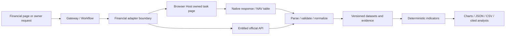

# Financial Analysis: Browser Market Data and Normalization Design

> Language: English | [简体中文](../zh-cn/docs/finance-market-data-design.md)
>
> Status: feasibility proposal; not implemented. Research date: 2026-09-29 (Asia/Shanghai).
> This work delivers design documentation and public-page observations, not a financial Workflow, production script, API, or deployment.

## 1. Conclusion and Initial Scope

**Conditionally feasible.** SparkClaw already has a persistent browser, isolated task pages, and fixed-script execution. These provide a foundation for using a site's authenticated session inside the same browser profile. Site adapters should collect structured observations; deterministic code should normalize units, time, and price adjustment, calculate indicators, and produce JSON/CSV and an analysis page. Sharing authentication, collecting complete histories from all three sites, and operating reliably over time are separate acceptance requirements.

The proposed first release covers daily OHLCV for Shanghai/Shenzhen equities and exchange-traded ETFs, plus disclosed daily NAV for ordinary off-exchange funds. Indicators include MA, EMA, MACD, RSI, KDJ, BOLL, and volume averages. Eastmoney is the first equity/ETF candidate, Tiantian the NAV candidate, and Tonghuashun an independent supplementary source. Start with a small owner-selected universe; make no promise of whole-market ingestion, tick data, Level-2, unlimited minute history, or a real-time SLA.

Classify funds before collection: an off-exchange fund's NAV is not traded OHLCV. ETF market price, NAV, and IOPV remain distinct series. Money-market funds need separate measures such as income per 10,000 units and seven-day annualized yield; do not force them into the ordinary NAV model. Trading, subscriptions/redemptions, and private account balances or holdings are outside this request.

There is enough evidence to justify a bounded proof of concept, but not to declare all three providers production-ready.

## 2. Research Method and Confirmed Observations

Research examined browser runtime documentation, Controller registration, and the email network Reader in this checkout at `main@4588f41`, then the three sites' public pages and Tonghuashun's official API documentation. Browser observations used the **Codex in-app browser**. Its available-browser inventory did not expose SparkClaw's persistent profile, so these observations do not establish reuse of the owner's financial-site authentication. No site login, account access, cookie extraction, or data-service subscription occurred.

| ID | Entry point and observed result | Established | Not established |
|---|---|---|---|
| E01 | [Tiantian entry](https://www.tiantianfunds.com/) and [fund 000001](https://fund.eastmoney.com/000001.html) expose fund information, unit/accumulated NAV, and a history link | The supplied entry leads to fund-detail domains | Shared authentication across domains or coverage of every fund |
| E02 | The browser rendered [historical NAV](https://fundf10.eastmoney.com/jjjz_000001.html) dates, unit/accumulated NAV, daily changes, and pagination, including 2026-09-28 and a 301-page label | A public NAV table is readable and is a useful initial candidate | Pagination was not exhausted; complete history and response schema remain unqualified |
| E03 | [Eastmoney 600519](https://quote.eastmoney.com/sh600519.html) rendered current price, daily open/high/low, volume/value, turnover, daily/weekly/monthly/minute chart controls, and RSI/KDJ/MACD menus | Public dynamic quotes and indicator entry points loaded | No complete bar or indicator payload was captured; an intraday last price is not a final close |
| E04 | [Tonghuashun 600519](https://stockpage.10jqka.com.cn/600519/) displayed period controls and login, but the chart remained loading with index placeholders when observation ended | Current page structure and a loading limitation were observed | This does not establish that login or anti-automation controls caused the issue, nor that historical data is readable |
| E05 | [Tonghuashun's API manual](https://quantapi.10jqka.com.cn/gwstatic/static/ds_web/quantapi-web/help-center/manual.html) documents historical, high-frequency, and current quotes with HTTP examples | A separate official structured-data route exists | No entitled credential, quota, price, or successful authenticated response was verified |
| E06 | Static extraction returned many Eastmoney placeholders and initially timed out on the fund-detail page; the browser later loaded relevant content | Static HTTP/search extraction alone cannot qualify dynamic data | A transient failure is not permanent, and browser rendering is not production-script qualification |

These are single, bounded, public-page observations. No raw network payload, complete date-range collection, performance run, or authentication-reuse test was performed. Keep page data time separate from access time; search-cache dates are not data dates.

The three sites are display/service sources, not automatically the original authority for every field. Tiantian's fund page directs readers to manager disclosures for specific fund information. Reconcile important NAV/distribution facts against the manager, and trading data against entitled sources and exchange definitions. Tiantian and Eastmoney share a corporate/data-service relationship and must not automatically count as two independent confirmations. [Fund page](https://fund.eastmoney.com/000001.html)

## 3. Provider Strategies

| Source | First targets | Proposed collection | Required qualification |
|---|---|---|---|
| Tiantian | Ordinary off-exchange fund NAV, accumulated NAV, metadata; distributions as separate facts | Follow the history page; prefer native structured responses, then a qualified DOM table with headers and pagination evidence | Date bounds, termination, fund/share class, missing values, distributions; estimates cannot replace official NAV |
| Eastmoney | Equity/ETF daily bars, volume/value; valuation snapshots later | Select instrument/period/adjustment in an owned page and capture its chart data; calculate most technical indicators locally | Symbol mapping, column order, volume units, adjustment anchor, history depth, provisional-bar updates |
| Tonghuashun website | Matching daily bars and supplementary observations | Diagnose E04, then qualify native requests/chart data in the task page; text must not stand in for absent history | Loading dependencies, login needs, entitlements/rate limits, units, adjustment differences |
| Tonghuashun iFinD | Historical/high-frequency data with formal entitlement | Separate official API adapter and explicitly authorized API credentials | Usage rights, quotas, fields, adjustment options; a website login does not confer API rights |

The official manual documents `THS_HQ` and `POST https://quantapi.51ifind.com/api/v1/cmd_history_quotation`. Its HTTP example uses `access_token` and accepts instruments, fields, dates, and output options. Do not obtain this authority by copying website cookies. Verify limits against the account's actual entitlements and the official data categories. [API manual](https://quantapi.10jqka.com.cn/gwstatic/static/ds_web/quantapi-web/help-center/manual.html), [FAQ](https://quantapi.10jqka.com.cn/gwstatic/static/ds_web/quantapi-web/help-center/faq.html)

Eastmoney/Tiantian internal endpoint URLs, parameters, and column positions were not verified in this investigation. Online endpoint recipes are therefore not a confirmed contract. A PoC should retain sanitized request shapes actually emitted by the page and response fixtures before freezing mappings. Undocumented website endpoints remain implementation details whose versions can stop working.

## 4. Authentication Reuse and Browser Boundaries

The existing [Browser Runtime](browser-runtime.md) uses the owner's persistent SparkClaw Chromium profile. Gateway calls Playwright CLI/Bridge through a private Controller socket and controls owned task pages. See [provider-scripts.mjs](../tools/browser-controller/src/provider-scripts.mjs) and [network-reader.mjs](../scripts/email/lib/network-reader.mjs). Current deterministic scripts primarily serve email. Financial registrations, Readers, schemas, and parsers still need implementation; generic browser availability does not mean financial collection exists.

Proposed flow: normal login in SparkClaw Browser → new financial task page in that profile → site/authentication/entitlement checks → fixed-script reading → sanitized business output → page release. Ordinary Chrome, the Codex in-app browser, and SparkClaw's profile are distinct. If the owner is signed in only elsewhere, they must first sign in within SparkClaw Browser. Electron is the accepted future browser-host target; financial adapters depend on the host boundary rather than adding another persistent browser or restoring retired global CDP access.

Cookies/localStorage follow browser scopes. Sharing a profile does not sign one site's account into another, and a new tab may not inherit authentication held only in sessionStorage. Qualify SSO redirects and login origins per site. Do not export cookies, storageState, passwords, or the profile. Missing authentication returns `login_required`; human verification, second factors, and expired sessions are handled by the owner in the normal site flow without bypasses.

Subdomains may still be different origins. A page's ability to read a `fetch` response depends on server CORS, cookie domain/SameSite rules, and normal authentication flows; `credentials: include` does not remove them. Parse approved JSONP/script payload shapes without evaluating downloaded code. An opaque `no-cors` response is not usable structured data. [MDN Fetch](https://developer.mozilla.org/en-US/docs/Web/API/Fetch_API/Using_Fetch)

Official API credentials use a separate existing credential-management boundary, never command arguments, logs, or model prompts. Playwright's documentation warns that saved authentication state can contain information enabling account impersonation; this design keeps website state in the existing browser. [Playwright Authentication](https://playwright.dev/docs/auth)

## 5. Pipeline and Engineering Ownership



1. Accept instrument, asset class, period, date range, adjustment, and indicator parameters. Resolve a canonical instrument ID; do not accept model-supplied arbitrary URLs, scripts, or selectors.
2. Check adapter capabilities: markets, intervals, history limits, authentication mode, and entitlement. Report unsupported requests instead of silently changing period, adjustment, or source.
3. Reuse qualified cache entries or acquire a task-page lease. Install an audited, bounded Reader before navigation and trigger the site's normal query. Prefer structured responses; a qualified DOM table is a fallback. Screenshots/OCR are not bulk OHLCV sources.
4. Observe only approved origins, paths, methods, symbols, and periods with byte/count limits. Exclude advertisements, accounts, transaction endpoints, and unrelated responses. Website content is evidence, not tool instructions.
5. Complete pagination, validation, deduplication, coverage checks, and atomic publication. Retain sanitized market payloads/request shapes locally with SHA-256, adapter/parser revisions, and capture time. Do not store authentication headers, signed URLs, or whole-site HAR files.
6. Calculate indicators from one frozen dataset. Models explain verified values only. Completion, timeout, and cancellation revoke resources while retaining traceable results and failures.

Previous email-observer work exposed compatibility issues between Playwright network listeners and task-page lifecycle. Qualify response collection through the actual Bridge path; ordinary Playwright Library examples are insufficient evidence. Reuse pre-navigation managed-Reader lifecycle concepts, not email business schemas. Any new managed page asset must update component manifests, source hashes, builds, and installation checks together.

InfiniCenter decision **0030** remains proposed. Its R3 direction places application capabilities behind App-CLI's public Registry while SparkClaw retains the generic Browser Host. This design respects that ownership: application parameters/parsing belong to adapters, pages/profiles to the host, and datasets/indicators/analysis to SparkClaw. Do not create a permanent parallel Node public entry bypassing Registry. App-CLI Runtime v2/BrowserHostPort remain drafts, not deployed dependencies. If implementation involves App-CLI, extend and accept the cross-repository decision/contract first. This document changes no Infinimesh-Info, JingSi, or IMMS contract.

The following describes **proposed internal semantics**, not an existing command or runnable SDK:

```typescript
type MarketQuery = {
  instrument_id: string;
  kind: "ohlcv" | "fund_nav";
  interval: "1d";
  from: string; to: string; // Exchange-local dates, inclusive
  adjustment: "none" | "forward" | "backward";
  provider: "eastmoney" | "tiantian" | "ths_web" | "ths_ifind";
};
// All interfaces below are proposed; the host executes registered adapters only.
async function collect(q: MarketQuery, host: BrowserHost) {
  const adapter = registry.requireCapability(q);
  const task = await host.acquire(adapter.binding);
  try {
    const source = await adapter.readBounded(task, q);
    const dataset = normalizeAndValidate(source, q);
    return publishAtomically(dataset); // Partial coverage is not complete success
  } finally {
    await host.release(task); // Record/isolate cleanup failures; preserve primary errors
  }
}
```

## 6. Unified Format: Draft `finance.dataset.v1`

Unify instrument, time, provenance, and quality envelopes while keeping typed records. One mostly-null candlestick table cannot represent every financial observation. These fields/enums require machine schemas and golden fixtures during implementation.

| Layer | Required fields and rules |
|---|---|
| Envelope | `schema_version`, `dataset_id`, `revision`, `record_type`, `instrument`, `series`, `coverage`, `provenance`, `quality`, `records` |
| Instrument | Canonical ID, original code, exchange/market, asset type, currency, name, share class, provider-symbol mapping and mapping version; `000001` alone is ambiguous |
| Series | Interval, IANA timezone, calendar version, price-adjustment mode/anchor/factor version, volume units and adjustment; never mix incompatible bases |
| Coverage | Requested/actual bounds, row count, expected eligible dates if known, gaps/reasons, `complete/partial/empty/unknown`, truncation; an empty result requires an established no-data reason |
| Provenance | Provider, data product/source family, public detail URL, capture/source-update times, capture method, adapter/parser revisions, raw reference/hash; absent publication times remain null |
| Quality | Validation, delay/staleness/estimate flags, conflict references, missing reasons; cache hits do not rewrite original capture times |

Record types:

- `ohlcv`: `trading_date`, optional `bar_start/bar_end`, `open/high/low/close`, `volume`, `amount`, optional `turnover_rate`, `is_final`. Daily identity is an exchange trading date, not invented midnight UTC. Future minute support must define timezone-aware intervals and start/end labeling.
- `fund_nav`: `nav_date`, `unit_nav`, `accumulated_nav`, `daily_return`, `published_at`, `is_estimate`, share class. No volume or OHLC. Distributions, splits, and confirmed publication times are separate events.
- `metric`: `metric_id`, value, unit, `as_of`, `published_at`, `report_period`, basis, and `origin=provider/local`. Distinguish trailing/static/forward PE; OHLCV cannot supply ROE, proprietary money flow, or volume ratio by itself.
- `indicator`: name, parameters, algorithm version, input dataset ID/revision/hash, input fields/adjustment, output time, values, and warm-up status. Keep site-provided indicators separate from locally calculated ones.

Use decimal strings for prices, amounts, NAV, fractional indicators, and volume with explicit units. Use ISO 8601 times and explicit timezones. Normalize percentages to ratios (`0.0234` means 2.34%); RSI/KDJ values on a 0–100 scale use oscillator units rather than ratios. Null business values/publication times require reasons such as `not_applicable/not_published/unsupported/parse_error/insufficient_history`; zero or forward-filled values must not disguise missing observations. NAV queries accept only `adjustment=none`; adjusted fund returns need a separately defined return series. Coverage binds requested fields as well as dates: missing requested volume cannot yield complete success merely because dates are contiguous.

This is a **compact synthetic example, not site data**. It omits instrument metadata such as name/mapping version and a real raw-evidence hash. Production records must supply the required fields above; `demo:` references are not production evidence:

```json
{
  "schema_version": "finance.dataset.v1",
  "dataset_id": "demo:ohlcv:1",
  "revision": 1,
  "record_type": "ohlcv",
  "instrument": {
    "instrument_id": "CN:EQUITY:XSHG:600519",
    "code": "600519", "exchange": "XSHG", "asset_type": "equity",
    "currency": "CNY", "share_class": null
  },
  "series": {
    "interval": "1d", "timezone": "Asia/Shanghai",
    "calendar_version": "demo-calendar-v1",
    "adjustment": {"mode": "none", "anchor_date": null, "factor_version": null},
    "volume_unit": "share", "volume_adjustment": "none", "amount_unit": "CNY"
  },
  "coverage": {
    "requested_from": "2026-09-28", "requested_to": "2026-09-28",
    "actual_from": "2026-09-28", "actual_to": "2026-09-28",
    "row_count": 1, "expected_count": 1, "state": "complete", "gaps": [], "truncated": false
  },
  "provenance": {
    "provider": "synthetic", "source_family": "demo",
    "source_url": null, "fetched_at": "2026-09-29T15:10:00+08:00",
    "source_updated_at": null, "capture_method": "fixture",
    "adapter_revision": "demo-v1", "parser_revision": "demo-v1", "raw_ref": "demo:raw:1"
  },
  "quality": {"validation": "synthetic_only", "freshness": "not_applicable", "warnings": []},
  "records": [{
    "trading_date": "2026-09-28", "open": "100.00", "high": "103.00",
    "low": "99.00", "close": "102.00", "volume": "123400",
    "amount": "12550000.00", "turnover_rate": null,
    "missing_reasons": {"turnover_rate": "not_published"}, "is_final": true
  }]
}
```

An off-exchange fund ID could be `CN:FUND:OTC:000001`, with record shape `{"nav_date":"2026-09-28","unit_nav":"1.2345","accumulated_nav":"3.4567","daily_return":null,"published_at":null,"is_estimate":false,"missing_reasons":{"daily_return":"not_published","published_at":"not_published"}}`, also synthetic. Different share classes are different instruments even when names resemble each other. Link ETF trading/NAV series through instrument metadata while preserving their separate record types and times.

JSON is canonical. Export separate CSV files per record type, accompanied by `manifest.json` containing versions, provenance, units, adjustment, coverage, and file hashes. Preserve leading zeros in codes and export times as text. Prevent spreadsheet formula interpretation of source strings at the export/presentation boundary without changing canonical raw values. Indicator exports include input versions and parameters.

## 7. Validation and Indicator Conventions

**Validation/history:** Require `low <= min(open,close) <= max(open,close) <= high`, nonnegative volume/value, finite numeric values, and stable field mappings. Deduplicate by source, instrument, record type, interval, adjustment basis, and time; conflicting duplicates become revisions/conflicts. Lots, shares, fund units, and contracts are distinct. Convert only with verified asset/provider lot sizes, retaining original values/units and conversion evidence. Index aggregate volume needs a separate definition.

**Calendar/adjustment:** Distinguish non-trading dates, suspensions, pre-listing dates, unpublished observations, and source gaps using a trading calendar. Do not classify unknown gaps as holidays. Weekly/monthly aggregation needs complete eligible daily sets: first open, last close, extreme high/low, summed volume/value, with unfinished periods flagged. Price adjustment never implicitly adjusts volume/value. Corporate actions can revise forward-adjusted history: retain raw series, factor/anchor/capture revisions, and invalidate dependent indicators. When factors are unavailable, label a provider-adjusted snapshot rather than claiming independent reproducibility.

**Technical indicators:** Start with final daily bars and an explicitly chosen price basis; the UI may suggest forward adjustment. Volume averages use raw volume. Do not silently bridge missing trading bars: segment/restart warm-up or return insufficient history. These are proposed SparkClaw conventions, not a claim of exact equality with identically named website indicators:

| Indicator | Proposed definition and edge cases |
|---|---|
| MA / VOL_MA | Simple mean of n valid closes/volumes; MA defaults 5/10/20/60, VOL_MA 5/10; fewer than n observations yields null |
| EMA | `alpha=2/(n+1)`, seeded with the first n-point SMA at point n, then recursive; record the seed policy |
| MACD(12,26,9) | DIF=EMA12−EMA26, DEA=EMA9 of DIF, histogram=`2*(DIF−DEA)`; these seeds require at least 34 closes for full output |
| RSI(14) | Seed with means of the first 14 adjacent gains/losses, then Wilder smoothing; at least 15 closes; zero loss with gain gives 100, flat gives 50, zero gain with loss gives 0 |
| KDJ(9,3,3) | RSV from nine highs/lows/closes; zero range gives 50; prior K/D=50, K=`2/3*Kprev+1/3*RSV`, D smooths K similarly, J=`3*K−2*D` |
| BOLL(20,2) | SMA20 center with ±2 population standard deviations (ddof=0); fewer than 20 points gives null |

Version formulas and input treatment. Fetch extra EMA warm-up according to a frozen configuration instead of silently changing values when a query start moves. Record the actual seed start, input coverage, and insufficient-history status. A full-history seed requires actual full history. Use a fixed-precision decimal implementation, provisionally 34 significant digits with an explicit rounding mode; round for display only, never feed rounded chart values back into calculations.

PE/PB/ROE, turnover, volume ratio, and money-flow classifications require additional inputs/provider adapters. Return unsupported where definitions are absent. Accumulated-NAV ratios are not automatically dividend-reinvested fund returns. Later drawdown/volatility support must first fix the return series, reinvestment assumptions, and annualization. Historical studies need point-in-time publication and revision handling to avoid injecting later financial statements or NAV corrections into the past.

## 8. Reliability, Storage, and Product Presentation

Proposed PoC budgets: one active collection per provider, two globally, at least two seconds between active data queries, at most 20 data requests and 120 seconds per task, at most ten instruments and 2,000 records per instrument. Stop at the first limit and report truncation. These are conservative local proposals, **not provider-published limits**. Observe page-originated polling and bound its lifetime; active-query pacing alone is not a total traffic cap. Official quotas or stricter site limits take precedence.

Classify 401/expired sessions, 403/challenges, entitlement failures, 429, and schema drift separately. Respect Retry-After and end the current round on 429; do not retry through rapid page cycling. Allow at most one transient-network retry within the original deadline. Do not automatically replay provider refusals or parsing mismatches. Suggested errors: `login_required/challenge_required/entitlement_required/rate_limited/source_unavailable/schema_changed/incomplete_range/unsupported_interval/unsupported_adjustment/unit_unknown`. Transport failure and partial dataset coverage are separate states.

Cache keys include provider/product, owner or entitlement scope, instrument, record type, interval, adjustment/anchor, date range, and adapter revision. Coalesce identical requests. Do not share entitled results across access scopes. Separate provisional intraday from final daily bars; continuous intraday polling is not the default. Refresh funds according to publication cadence: late QDII disclosures cannot be judged by a simple equity calendar. Preserve revised datasets instead of silently replacing versions referenced by reports. Keep conflicting sources and make source selection explicit; do not average away disagreements.

The PoC can use existing artifact storage for sanitized source fragments, normalized data, indicators, and manifests. Design a production repository/index later. Store extensions must cover memory/file/postgres, not PostgreSQL alone. Raw retention depends on source terms and local policy; retain referenced dataset versions until report deletion/expiry, defining cascading deletion, export, and log redaction together.

The proposed Financial Analysis page contains instrument/source selection, period/adjustment, candlestick or NAV charts, volume/indicators, detail tables, and export. Show source, data-as-of time, adjustment, units, completeness, delay, and estimate status. Off-exchange funds get NAV charts without invented volume. Present verified observations before dataset-cited model interpretation. Failure views retain the last successful time instead of labeling old cache entries current. Follow WebChat interaction/localization conventions during implementation; this work does not implement UI.

Website accessibility alone does not establish permission for automated collection, retention, or redistribution; login rights are not API rights. Verify product-specific usage conditions for the intended deployment, preferring formally entitled interfaces for uses requiring authorization. This research makes no legal conclusion that website collection is permitted or prohibited.

## 9. Acceptance Matrix and Implementation Sequence

Every case below is **NOT_RUN**. Section 2 public-page observations do not satisfy these acceptance tests.

| ID | Case | Acceptance |
|---|---|---|
| T01 | Actual profile/session reuse at all three sites | Owned new pages confirm needed identity/entitlement without exporting secrets or controlling owner tabs; logout/expiry recognized |
| T02 | Complete Tiantian interval | At least 60 disclosed NAV observations across pagination; proven bounds/termination, visible-table sampling, estimate isolation |
| T03 | Eastmoney daily bars | One Shanghai equity, Shenzhen equity, and ETF, each with at least 120 final daily bars; verify OHLCV/value mapping, symbols, units, and visible samples |
| T04 | Two Tonghuashun routes | Resolve website loading and collect bounded history; separately qualify official API after entitlement; one route cannot qualify the other |
| T05 | Adjustments/distributions | Corporate-action samples validate all three price modes with raw volume preserved; factor/anchor changes create new versions/recalculation |
| T06 | Time/gaps | Lunch break, close boundaries, holidays, suspensions, new listings, unfinished periods, and late fund disclosure never create invented bars/NAV |
| T07 | Indicator golden vectors | Independent fixed-input checks for flat/trending/zero-volume/extreme/gapped/warm-up series; algorithm-defined unrounded tolerance, provisionally absolute/relative 1e-8 |
| T08 | Reconciliation | Compare matching symbol/time/interval/adjustment/unit; tolerances reflect tick size and source rounding, retain conflicts, reject unknown units |
| T09 | Failure/recovery | Inject 401/403/429, HTTP-200 login HTML, repeated/missing pages, column drift, timeout; no false complete result or unlimited retries |
| T10 | Lifecycle/isolation | Cancellation, page closure, Controller/browser restart, account change; no secret leakage, stale control, invalid reuse, or interference with mail watchers |
| T11 | Data/export | Schema, decimal/time/missing-value validation, JSON/CSV round trip, leading zeros, hashes/revisions, formula handling, default file backend |
| T12 | Stability/rights | At least five trading days of bounded runs measuring success, latency, gaps, and source drift; verify actual usage rights, never describe targets as measurements |

Recommended sequence:

1. **Data qualification PoC:** freeze a small instrument/field set and sanitized fixtures, prioritize T01–T03, investigate Tonghuashun loading/entitlements, and publish a per-source capability matrix. Failure closes the affected capability; an honest outcome can be “Eastmoney daily bars available; Tonghuashun unqualified.”
2. **Contracts and engine:** machine schemas, adapter fixtures, normalization, indicator golden tests, cache/artifacts, and T05–T11. Complete cross-project decisions before App-CLI integration; do not build a SparkClaw bypass.
3. **Financial page and release:** governed Workflow, charts, export, cited interpretation, then T12 and deployment regression before per-provider activation. Minute data, additional markets, automatic refresh, and paid metrics are later extensions.

The PoC must settle actual payload shape/history depth, authentication/entitlement requirements, per-asset units/adjustment, and sustained availability. **A PoC is justified; a complete release still depends on this evidence.**

## 10. Deliverables and Validation for This Investigation

This work adds bilingual design documents and index entries, public-page research, repository architecture checks, and scope records in InfiniCenter decision 0030's review section and SparkClaw status. It adds no business implementation, dependency installation, scheduled collection, account changes, or production-service changes.

Documentation validation uses the bilingual/local-link check from `.github/workflows/ci.yml`, JSON example parsing, bilingual section/case parity, and `git diff --check`. Runtime qualification remains NOT_RUN. Documentation-only work does not use unexecuted Go/frontend tests to claim a working financial feature.
