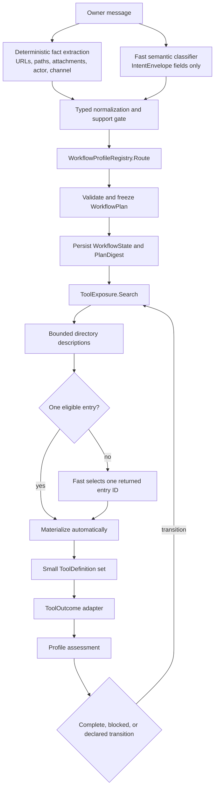

# Intent Routing and Workflow Tool Exposure Refactor Plan

> Language: English | [简体中文](../zh-cn/docs/intent-routing-workflow-refactor-plan.md)

Status as of 2026-07-16: the shared runtime foundation is implemented. Public
Web research, explicit URL reading, workspace file search, and explicit-path
workspace reads are authoritative Workflow Profiles. Other domains still use
the legacy TaskHint path until they are migrated as complete vertical slices.

## Decision

SparkClaw keeps Fast intent classification, but limits its output to stable
semantics. It cannot name tools, Skills, workflow IDs, model lanes, risk levels,
approval decisions, or execution steps.

Execution has four ownership boundaries:

1. `IntentRouter` combines deterministic facts with Fast semantic output and
   produces a normalized `IntentEnvelope`.
2. `WorkflowProfileRegistry` uniquely matches that envelope and resolves a
   frozen, versioned `WorkflowPlan`.
3. `ToolExposure.Search/Materialize` is the only authority that turns an active
   capability scope into model-visible ToolDefinitions.
4. Typed `ToolOutcome` and profile-specific assessment may advance or expand
   only transitions already present in the frozen plan.

Skills provide procedure only. Policy and exact-argument authorization remain
authoritative at execution time. ReAct chooses an action from the currently
materialized definitions; it does not determine reachability.

This is an incremental replacement, not a permanent dual-routing design. A
migrated intent never falls back to TaskHint because a capability is missing,
a directory view is stale, or execution is blocked. It records the blocker.

## Why The Previous Design Kept Regressing

The old path placed semantic and realization decisions in the same `TaskHint`:

- Fast classification emitted candidate Skills, tools, risk, and model lane;
- heuristic fallback repeated those choices;
- Skill keyword matching and allow/deny lists changed them again;
- evidence fallback and browser expansion unioned more tools later;
- outcome-specific helpers appended exceptional follow-up actions.

There was no stable intermediate contract and no single owner for visibility.
A fix to one layer changed another layer's input, so Web, browser, document,
email, and workspace routes repeatedly repaired each other's regressions.

The refactor separates three questions:

- Intent: what does the owner want?
- Workflow: which capability closure may satisfy it?
- Exposure: which registered implementation may the model see now?

## Runtime Shape



Core runtime code must not switch on workflow IDs or concrete tool names to
choose scopes, resources, assessments, or next steps. Domain behavior belongs
to registered profiles and ToolHub outcome adapters.

## Stable Intent Contract

The model-facing envelope contains semantics only:

```go
type IntentEnvelope struct {
    Version      int               `json:"version"`
    SourceTurnID string            `json:"source_turn_id"`
    Objectives   []Objective       `json:"objectives"`
    Constraints  IntentConstraints `json:"constraints"`
    Resolution   IntentResolution  `json:"resolution"`
}

type Objective struct {
    ID        string          `json:"id"`
    Domain    IntentDomain    `json:"domain"`
    Operation IntentOperation `json:"operation"`
    Target    TargetRef       `json:"target"`
    Output    OutputKind      `json:"output"`
    Explicit  bool            `json:"explicit"`
}
```

Fast returns the stable envelope and may normalize evidence depth and
clarification state. For the current narrow migrated slices, the deterministic
support gate also fixes domain and operation; a later broader classifier may
choose them only among fact-compatible registered profiles. Normalization owns
these non-negotiable rules:

- explicit URLs, workspace paths, attachment refs, actor, and source turn come
  from deterministic facts and cannot be invented or changed by the model;
- authorization provenance and `Explicit` cannot be created from retrieved or
  quoted text;
- unsupported enums, target combinations, and unresolved profiles fail closed;
- the final envelope is routed again through the registry after Fast output;
- audit stores a redacted semantic projection, not raw URL/path content.

A deterministic fallback exists for model failure and a bounded support gate,
not as a second tool router. It must produce the same stable contract and pass
the same registry and plan validation.

## Workflow Profile Contract

Profiles are code-defined and registered by stable ID and revision:

```go
type WorkflowProfile interface {
    ID() WorkflowID
    Revision() int
    Recognize(sourceTurnID, content string) (IntentEnvelope, bool)
    Match(IntentEnvelope) bool
    Resolve(IntentEnvelope) (WorkflowPlan, error)
    Assess(*WorkflowState, ToolOutcome) NodeAssessment
    Hint(*WorkflowState) workflowExecutionHint
    TransitionInstruction(ToolOutcome, NodeAssessment) string
}
```

`Recognize` is the deterministic support/fallback gate. `Match` is the actual
typed routing predicate applied after Fast normalization. New work should keep
these decisions aligned through a shared decision corpus; neither method may
return tools. `workflowExecutionHint` contains only model/evidence mode and
workflow/node/scope binding fields; the type has no candidate-tool or Skill
fields.

`WorkflowProfileRegistry.Resolve` validates before persistence:

- profile ID and revision match the registered implementation;
- intent is resolved and every objective ID is unique;
- node, transition, and dependency IDs are valid and acyclic;
- initial nodes have no dependencies and later nodes have declared ones;
- every node has a goal, capability scope, risk set, and attempt bound;
- argument bindings refer only to capabilities reachable in frozen scopes;
- transition predicates and add/replace scopes are complete and bounded.

Non-initial nodes start `pending`. Completing a node activates only nodes whose
declared dependencies succeeded. The workflow succeeds only when every node
succeeds; it cannot complete merely because the current active list became
empty.

## Frozen Scope And Resource Boundaries

The plan contains capability requirements, not tool sequences. A scope
transition may add or replace requirements only when its typed predicate and
activation bound match. The plan is hashed and persisted before exposure.

Resource arguments are also part of the plan:

```go
type ArgumentBinding struct {
    Capability   string
    Argument     string
    ResourceKind string
    Source       ArgumentBindingSource // intent_target or outcome_ref
    TargetKinds  []TargetKind
}
```

Before execution, Runtime requires the argument to equal either a deterministic
intent target or a governed typed reference persisted from a prior outcome.
This prevents an otherwise eligible page reader or file reader from accessing
an unrelated URL or path.

## Single Tool Exposure Authority

The authoritative contract is documented in
[Tool Exposure Contract](intent-routing-tool-exposure-contract.md).

`Search` loads the persisted run and active node. It computes eligibility from:

- frozen capability requirements and denied effects;
- enabled ToolHub registrations and their capability descriptors;
- node allowed risks;
- `Policy.MayExpose` with actor, workflow, and node context.

It then ranks only the eligible set using trusted registration descriptions.
The first view contains entry IDs, capability, summary, usage boundaries,
effects, and risk, but no concrete schema or hidden tool name.

One entry is materialized automatically. With multiple entries, Fast sees only
that bounded directory view and must return one listed entry ID. Unknown,
out-of-view, stale, actor-mismatched, workflow-mismatched, or scope-mismatched
selection fails. `Materialize` is the sole path to model-visible definitions.

Visibility never authorizes execution. ToolHub and Policy re-evaluate the
concrete definition, exact arguments, actor, and resources before a call runs
or enters approval.

## Outcome-Driven Adaptation

ToolHub registration owns the outcome adapter. Adapters emit typed signals and
governed refs; they do not decide whether the user goal is complete. The active
profile assesses the outcome against the frozen node goal.

The only valid results are:

- `complete`: mark the node succeeded and activate ready dependents;
- `blocked`: persist the reason and stop the workflow;
- `needs_more_evidence`: activate one matching declared scope transition.

Outcome IDs and transition activation counts are persisted. Duplicate outcomes
are no-ops. An unknown signal, exhausted transition, missing ref, or digest
mismatch blocks instead of widening exposure.

## Current Authoritative Profiles

| Profile | Initial capability | Bounded behavior |
|---|---|---|
| `web.public_research` r1 | `web.discovery` | May replace with `web.page.read` once for requested source evidence; URL must come from discovery outcome. |
| `web.explicit_url_read` r1 | `web.page.read` | URL must equal the deterministic intent target. |
| `workspace.file_search` r1 | `workspace.file.search` | Search-only, read risk, no mutation or image specialization. |
| `workspace.file_read` r1 | `workspace.file.read` | Path must equal the deterministic workspace target. |

These profiles bypass TaskHint candidate tools and Skill allow/deny lists. Their
procedural Skills are selected exactly by the frozen plan. Workspace document
mutation, image inspection, code, browser interaction, reminder, memory, and
command requests remain on the legacy path
until their own full profile slice lands.

Email, calendar, and workspace knowledge/RAG are not migration targets in this
plan; see [Deferred Capabilities](deferred-email-calendar-knowledge.md).

## Web Search Example

For “search SparkClaw and read the official source”:

1. Fact extraction finds no explicit URL. Fast emits `web/search`, public data,
   source evidence depth; normalization cannot add a target or tool.
2. Registry matches `web.public_research` and freezes a node whose initial
   scope is `web.discovery`; a declared transition can replace it with
   `web.page.read` once.
3. Exposure finds the registered `web.search` implementation and materializes
   only its schema.
4. Search returns `results_available`, `source_page_available`, and governed
   URL refs. The profile assesses `needs_more_evidence` because source depth was
   requested.
5. Runtime applies the frozen transition, increments scope revision, clears the
   old directory selection, and searches again.
6. Exposure materializes `browser.read`. Runtime accepts only a URL in the
   persisted search outcome refs.
7. `content_available` completes the node. Missing URL, failed exposure, auth,
   stale state, or unrelated URL blocks; none falls back to a broader route.

An explicit URL request starts directly at step 6 with the deterministic URL.
It does not expose discovery or live browser interaction.

## Migration Procedure

Migrate one semantic domain slice end to end:

1. Add stable enums only when existing vocabulary cannot express the intent.
2. Add deterministic facts and a redacted classification corpus.
3. Implement one unique `Match`, fallback support gate, plan resolver,
   assessor, and completion behavior.
4. Register semantic capabilities, trusted directory metadata, effects, and an
   outcome adapter with each implementing ToolDefinition.
5. Add frozen argument bindings for URLs, paths, records, recipients, or other
   governed resources.
6. Remove the migrated intent's TaskHint candidate logic and Skill tool lists.
7. Test recognition uniqueness, invalid plan rejection, exposure bounds,
   argument escape attempts, outcome idempotency, transitions, persistence,
   and end-to-end behavior.
8. Update this plan, the profile catalog, exposure contract, architecture, and
   Chinese mirrors in the same change.

The preferred order is:

1. Browser open/read/interaction and human login handoff.
2. Document mutation with output verification.
3. Memory candidate/sensitive write.
4. Reminder CRUD and connector delivery.
5. Code patch, tests, command execution, and remaining compositions.
6. Delete TaskHint tool ownership, Skill allow/deny visibility, and legacy
   expansion after the final domain migrates.

## Non-Negotiable Invariants

- Fast output contains no realization choices.
- Profile matching is unique or fails closed.
- A frozen plan is validated, versioned, hashed, and persisted.
- Core exposure and runtime contain no workflow-ID routing switch.
- Search ranks only eligible registered entries and cannot widen scope.
- Materialize accepts only the latest bounded view.
- Every call is bound to workflow, node, scope revision, capability, and exact
  governed resource where required.
- Skills cannot grant, deny, union, or subtract tools.
- Outcomes activate only declared transitions and never inject tools.
- Read-only intent cannot reach mutation or external effects.
- Approval and exact-argument Policy remain authoritative.
- Migrated intent failure never re-enters the legacy route.
- Resume uses the persisted plan and profile revision, never reclassifies.

## Validation And Exit Gates

Each migrated slice requires:

- a positive and negative semantic decision corpus;
- ambiguity and profile identity tests;
- one-entry and multi-entry directory selection tests;
- stale/out-of-view materialization tests;
- exact resource binding tests;
- ToolOutcome adapter, assessment, transition, retry, and idempotency tests;
- file and PostgreSQL persistence coverage when state shape changes;
- an end-to-end API or Runtime test proving TaskHint was not used;
- external-model smoke before calling a domain production-ready.

Repository handoff runs:

```bash
cd services/gateway
go build ./...
go vet ./...
go test ./...
cd ../..
npm --workspace @sparkclaw/webchat run build
bash scripts/doctor.sh
bash scripts/run-eval.sh
git diff --check
```

## Recovery And Rollback

An active workflow resumes its persisted intent, profile revision, plan, node
state, and outcome history. If the implementation no longer supports that
schema or revision, it fails explicitly. Runtime does not silently re-resolve
or route through TaskHint.

Operational rollback means deploying a source version that supports active
plans or explicitly terminating incompatible runs. A permanent feature flag,
shadow router, or dual exposure authority is not a rollback strategy.
