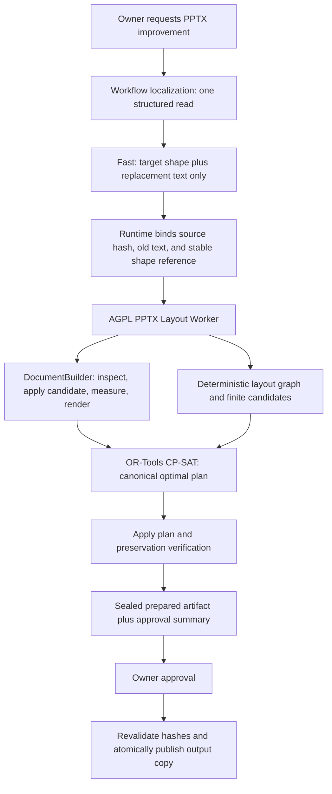

# Deterministic PPTX Layout Runtime Design

> Language: English | [简体中文](../zh-cn/docs/pptx-deterministic-layout-runtime-design.md)

| Field | Value |
|---|---|
| Status | Rejected; Phase 0 returned No-Go on 2026-08-11 |
| Decision date | 2026-08-11 |
| Scope | Coordinated layout for `pptx.update_slide` and `pptx.update_deck` |
| Candidate engine | ONLYOFFICE DocumentBuilder 9.4.0, free AGPL v3 edition |
| Constraint solver | Google OR-Tools CP-SAT 9.15.6755, Apache 2.0 |
| Decision owner | SparkClaw document runtime |

> Qualification result: **No-Go**. Direct official SDK and CLI probes, without
> any SparkClaw integration, showed that DocumentBuilder 9.4.0 does not expose
> the required actual text bounds or effective overflow result. The free AGPL
> artifact also adds an `Unregistered Version` watermark and rewrites package
> identities and parts on save. This is a product/edition suitability failure,
> not a SparkClaw adapter failure. Per the fail-fast decision, this design must
> not be implemented. See the [Phase 0 qualification report](../benchmarks/pptx-documentbuilder-phase0-qualification.md).

## Executive Decision

SparkClaw will evaluate a deterministic PPTX layout runtime built from the free
AGPL edition of ONLYOFFICE DocumentBuilder and Google OR-Tools. DocumentBuilder
is the candidate presentation engine for reading, measuring, mutating, and
rendering layout. OR-Tools chooses one finite, already measured layout candidate
for each affected shape. The model remains responsible only for selecting
evidence-bound text shapes and producing replacement text.

This is a strict Go/No-Go proposal. Phase 0 must prove every mandatory
DocumentBuilder capability on the target Linux ARM64 environment and the
SparkClaw compatibility corpus. If any mandatory test fails, this proposal is
rejected in full: SparkClaw keeps the current PPTX implementation, does not add
the worker or OR-Tools production path, and does not substitute LibreOffice,
Aspose, another renderer, or a heuristic measurement patch under this design.
The failed qualification produces a report only.

The migration must not add layout instructions, layout repair prompts, or a
second Fast call. A layout failure is a deterministic runtime failure. It never
causes the model to shorten, rewrite, or retry content.

## Problem

The current coordinated updater in the
`services/gateway/internal/toolhub/scripts/pptx_slide/` package (layout logic
in `layout.py`) estimates text width
from character classes and estimates height from a fixed line-height factor.
It then recognizes a small set of geometric patterns and adjusts text boxes,
backgrounds, rows, and cards. This is useful as a bounded safety layer, but it
is not a presentation renderer and cannot reliably answer whether mixed fonts,
CJK text, bullets, explicit line breaks, inherited theme properties, AutoFit,
or PowerPoint-specific layout behavior will overflow.

The current preflight also routes a layout-fit conflict into semantic repair,
asking Fast to shorten the replacement. That combines two different concerns:

- content quality, which is semantic and may use a model;
- layout feasibility, which is geometric and must be owned by the runtime.

Shortening text until an estimated box accepts it does not coordinate the whole
slide. It can lose useful content, depends on another model call, repeats
context, and still does not prove that the final presentation is balanced.

## Goals

- Detect text overflow using a qualified presentation engine, not character
  capacity estimates.
- Coordinate font size, text-box size, position, companion backgrounds, peer
  spacing, and protected surrounding elements as one layout problem.
- Preserve the exact replacement text returned by Fast. The layout runtime may
  change formatting and geometry but never content.
- Produce the same layout plan for identical source bytes, request bytes,
  engine versions, installed fonts, and policy version.
- Keep source-hash binding, bounded Workflow scope, Policy, approval, output
  copies, audit, timeout, and preservation verification intact.
- Complete layout preflight once and reuse its sealed artifact after approval,
  avoiding a second model call and a second layout solve.
- Remain useful when local models improve: better models improve wording while
  the deterministic engine continues to guarantee layout constraints.

## Non-Goals

- Generating or improving presentation content inside DocumentBuilder or
  OR-Tools.
- Asking a model to choose font sizes, coordinates, box sizes, break modes,
  layout policy, or retry actions.
- Redesigning arbitrary artistic slides, SmartArt, charts, animations, masters,
  or grouped internal shapes.
- Replacing `pptx.replace_text`, `pptx.add_slide`,
  `pptx.duplicate_slide`, or `pptx.delete_slide` during this migration.
- Claiming pixel identity between Microsoft PowerPoint, ONLYOFFICE, and
  LibreOffice. Viewer compatibility is tested explicitly.
- Adding another document engine if DocumentBuilder qualification fails.

## Existing Contracts That Remain

| Contract | Required behavior |
|---|---|
| Tool surface | Keep `pptx.update_slide` and `pptx.update_deck`; do not add a model-selected layout tool. |
| Evidence | Bind every update to the current `files.read` result, source SHA-256, slide, and shape. |
| Scope | Keep the single-slide and bounded whole-deck limits, currently at 12 slides, 64 updated shapes, and 32 KiB of replacement text. |
| Policy | Continue to classify the edit as reversible and approval-gated. |
| Files | Never mutate the source; create a new governed output copy only after approval. |
| Atomicity | A deck update either produces one fully verified output or no output. |
| Preservation | Reject undeclared changes to relationships, media, charts, masters, notes, animations, or non-target text. |
| Audit | Record engine versions, policy version, plan digest, checks, timings, and stable error code without recording full document text. |
| Timeout | One end-to-end deadline owns worker launch, measurement, solve, render, verification, and cleanup. |

## AGPL Edition And Distribution Decision

### Selected artifacts

The initial qualification candidate is the upstream
[DocumentBuilder v9.4.0 Linux ARM64 release](https://github.com/ONLYOFFICE/DocumentBuilder/releases/tag/v9.4.0):

```text
onlyoffice-documentbuilder-linux-aarch64.tar.xz
sha256:8756b0b57a4ab4b27608a6b1fbeb13f67670bde0245da166907277821afbeb8e
```

The version and digest are immutable inputs to qualification. Production must
use an explicit dependency lock and must never download `latest`. Upgrading
DocumentBuilder, OR-Tools, the font bundle, or the layout policy requires the
same determinism, preservation, and rendering corpus to pass again.

DocumentBuilder 9.4.0 is licensed under AGPL v3 with upstream Section 7
additional terms. Those terms include retention of notices and attribution,
prominent dated notices for modified versions, appropriate legal notices in
interactive user interfaces, no trademark license, and CC BY-SA 4.0 treatment
for specified non-code content. The exact license file from the pinned tag is
the authority. This document is an engineering compliance plan, not legal
advice.

OR-Tools remains under Apache 2.0. Its license does not remove or weaken the
DocumentBuilder obligations.

### Component boundary

The proposed `SparkClaw PPTX Layout Worker` is a separately launched process
with a versioned JSON stdin/stdout protocol. It uses the DocumentBuilder Python
or native SDK and OR-Tools internally. The worker and all code linked with
DocumentBuilder are distributed under AGPL-3.0-only, with the upstream
additional terms retained. The Gateway remains Apache-2.0 and communicates
with the worker only through the documented process protocol.

This process boundary narrows coupling, but it is not treated as an automatic
license exemption. Before a formal distribution, the project must complete a
license review. If the distribution is considered one combined work, the
release process must satisfy the applicable AGPL obligations for that combined
work. SparkClaw being public source reduces the disclosure cost; it does not
remove notice, source parity, build-material, attribution, or network-source
offer obligations.

Generated PPTX files remain user content unless they themselves incorporate
covered ONLYOFFICE assets. The release must not copy upstream icons,
illustrations, documentation, or branding unless their separate licenses and
the trademark policy are satisfied.

### Mandatory compliance controls

- Ship the exact AGPL v3 license, the upstream additional terms, the OR-Tools
  Apache 2.0 license, and a `THIRD_PARTY_NOTICES` inventory.
- Publish the Corresponding Source for the deployed worker, upstream source at
  the pinned tag, local patches, build scripts, dependency locks, font manifest,
  and installation information needed to reproduce the deployed binary.
- Make a clearly visible `Source and licenses` entry available to every user
  who can invoke PPTX layout over WebChat or another network channel.
- Identify ONLYOFFICE as the original developer, identify modified versions and
  modification dates, and link the applicable license and source package.
- Keep the public source commit, container digest, worker version, dependency
  digests, and the actual deployed build in parity.
- Do not use ONLYOFFICE names or logos as SparkClaw branding.
- Re-run license review whenever the pinned upstream license changes.

A release that cannot provide the exact source offer or required notices must
ship with the deterministic PPTX engine disabled. No commercial-license fallback
is implied by this design.

## Target Architecture



### Ownership

| Component | Owns | Must not own |
|---|---|---|
| Fast | Semantic shape selection and exact replacement text | Geometry, font size, wrapping, fit estimates, layout retry |
| Workflow Runtime | Scope, evidence binding, policy version, approval, artifact lifecycle, error mapping | Presentation measurement |
| Layout Worker | Shape identity, layout graph, candidate generation, measurement orchestration, solve, render, diagnostics | Content rewriting or external communication |
| DocumentBuilder | Qualified PPTX DOM access, layout measurement, mutation, and rendering | Choosing content or optimization policy |
| OR-Tools | Selecting a feasible optimal candidate combination | Inventing candidates or reading PPTX files |
| Preservation verifier | Package and semantic allowlist enforcement | Repairing failed output |

The first production scope is coordinated layout only. Existing code continues
to apply exact text replacement and structural slide operations until a
separate migration is designed and qualified.

## Phase 0: Mandatory Backend Qualification

DocumentBuilder's public presentation API exposes shapes and geometry mutation,
but the required API for actual post-layout paragraph or text-fragment bounds
has not been proven. Marketing claims about high-fidelity rendering are not a
measurement contract. Qualification must use executable tests, not API-name
inference.

All rows below are mandatory. One failure means No-Go for this entire proposal.

| Capability | Test | Pass condition |
|---|---|---|
| Stable identity | Open, inspect, mutate, save, reopen, and map shapes by slide part plus non-visual shape ID | Every supported target and companion maps uniquely; list index alone is not used as identity |
| Real text bounds | Measure Latin, CJK, mixed script, bullets, runs, explicit breaks, inherited fonts, AutoFit, and missing-font substitution | Returns stable used bounds or an effective overflow result after actual layout; no character-count proxy and no false-negative overflow in the corpus |
| Geometry mutation | Change font size, text-box dimensions, coordinates, wrapping, and companion shape dimensions | Reopened values and rendered result match the requested integer EMU plan within documented rounding tolerance |
| Rich-text preservation | Replace text across multiple paragraphs and runs | Untargeted run and paragraph formatting, fields, hyperlinks, bullets, and language metadata remain unchanged |
| Package preservation | Process charts, images, groups, notes, masters, themes, hyperlinks, animations, and relationships | Only the declared target text and geometry allowlist changes; all other canonical package fingerprints remain equal |
| Rendering | Render the affected slide before and after mutation | Nonblank image, correct slide dimensions, installed fonts used, and deterministic pixel digest under the pinned environment |
| Viewer compatibility | Open outputs in current Microsoft PowerPoint and the project's reference viewers | No repair prompt, missing object, changed chart, lost animation, or new overflow on supported fixtures |
| Linux ARM64 | Install and run the pinned aarch64 artifact on the DGX Spark deployment image | No emulation; all qualification tests pass with the production font manifest |
| Cancellation | Kill a deliberately hung or oversized job | Deadline terminates the full process group within two seconds, removes temporary files, and leaves no output or orphan process |
| Repeatability | Run every supported fixture 100 times | Identical normalized measurement, plan, package fingerprints, and rendered pixel digest |

The corpus must include real owner decks after irreversible private content is
replaced with structurally equivalent text, plus synthetic edge cases. It must
cover at least the supported 16:9 and 4:3 page sizes, English, Simplified
Chinese, mixed text, custom fonts, tables, grouped shapes, charts, media,
speaker notes, masters, transitions, and animations.

Qualification produces a signed report containing the artifact digests, font
manifest, host image, failures, timings, and canonical diffs. It produces no
production dependency or feature flag when the decision is No-Go.

## Versioned Worker Protocol

The Gateway invokes one worker job with one JSON request on stdin and receives
one JSON result on stdout. Human-readable logs go to stderr. Unknown fields are
rejected in v1, inputs are size bounded, and stdout has a fixed byte limit.
Document text is never written to logs.

### Request

```json
{
  "schema_version": "sparkclaw.pptx_layout.request.v1",
  "request_id": "opaque-id",
  "operation": "prepare_update",
  "source": {
    "input_path": "/job/input.pptx",
    "sha256": "hex"
  },
  "updates": [
    {
      "slide_ref": "ppt/slides/slide3.xml",
      "shape_ref": "cNvPr:17",
      "expected_text_sha256": "hex",
      "replacement_text": "Exact Fast output"
    }
  ],
  "policy": {
    "id": "sparkclaw.pptx_layout_policy.v1",
    "page_margin_emu": 114300,
    "max_candidates_per_shape": 12
  },
  "limits": {
    "max_slides": 12,
    "max_shapes": 64,
    "deadline_ms": 30000
  },
  "diagnostics": {
    "render_raw_candidate": true,
    "render_final": true
  }
}
```

`slide_ref` and `shape_ref` are runtime bindings. Fast continues to use the
compact 1-based `shape_index`; the Gateway resolves that index against current
evidence and never trusts a model-generated package identifier.

No request field permits content shortening, model retry, arbitrary scripts,
external URLs, or paths outside the per-job directory.

### Result

```json
{
  "schema_version": "sparkclaw.pptx_layout.result.v1",
  "request_id": "opaque-id",
  "status": "prepared",
  "source_sha256": "hex",
  "output_sha256": "hex",
  "plan_digest": "hex",
  "policy_id": "sparkclaw.pptx_layout_policy.v1",
  "engine": {
    "document_builder": "9.4.0",
    "ortools": "9.15.6755",
    "font_manifest_sha256": "hex"
  },
  "slides": [
    {
      "slide_ref": "ppt/slides/slide3.xml",
      "updated_shapes": 2,
      "layout_changes": [],
      "checks": {
        "overflow": false,
        "new_overlap": false,
        "inside_page": true,
        "preservation": true
      }
    }
  ],
  "artifacts": {
    "output_path": "/job/prepared.pptx",
    "raw_render_path": "/job/raw-slide-3.png",
    "final_render_path": "/job/final-slide-3.png"
  },
  "timings_ms": {}
}
```

Every path in the result is validated beneath the job directory. The Gateway
hashes the files itself and does not trust worker-reported digests without
verification.

## Layout Graph

The worker builds a deterministic graph from qualified package identities and
measured geometry.

### Nodes

- editable text shapes targeted by the request;
- related editable text shapes that participate in the same row, card, or
  vertical flow;
- companion backgrounds and dividers whose size or position must track text;
- protected shapes such as charts, images, logos, page markers, groups,
  unknown objects, and all unsupported features;
- slide safe area and master-derived reserved regions.

### Edges

- containment: text must remain inside its companion background;
- alignment: peers share a left, right, top, bottom, or center line;
- order: visual reading order cannot invert;
- spacing: adjacent peers preserve a bounded gap;
- flow: later blocks move when an earlier block grows;
- exclusion: mutable bounds cannot intersect protected bounds;
- equality: repeated cards keep equal widths or heights where the source deck
  already establishes that relationship.

Relationships are inferred only from stable IDs, OOXML relationships, and
versioned integer geometry rules. An uncertain relation is protected rather
than guessed. The model never labels layout groups.

## Candidate Generation And Measurement

Candidates are finite and sorted by stable shape reference and candidate ID.
The initial policy generates only combinations of:

- unchanged geometry and current font size;
- font reductions in 0.5 pt steps down to the larger of a role floor and a
  configured fraction of the original size;
- width or height expansion along an allowed axis within the safe region;
- vertical translation of later peers while preserving order and minimum gaps;
- coordinated resizing or translation of a confidently identified companion
  background;
- bounded combinations of the preceding changes.

The default role floors proposed for qualification are 18 pt for titles, 12 pt
for body text, and 9 pt for captions, with no reduction below 75 percent of the
source size. These values are policy data and must be validated against the
owner corpus before production. Unsupported vertical text, text on paths,
SmartArt internals, grouped child edits, or ambiguous companions are not given
mutable candidates.

For each candidate, DocumentBuilder must perform actual layout and return the
effective text bounds, overflow state, line result, and effective font state.
Candidates with overflow, clipping, invalid font substitution, or page-bound
violations are discarded before OR-Tools. Measurement results are cached only
within the job by the complete tuple of source hash, shape reference, exact
text bytes, dimensions, font settings, font manifest, and engine version.

The raw diagnostic render applies the replacement text without coordinated
layout. It exists only when explicitly requested by the Runtime, is marked
invalid, is never promoted as the edited PPTX, and lets tests or the owner
inspect the original overflow condition beside the solved result.

## OR-Tools Formulation

The model is a finite CP-SAT selection problem. All coordinates and sizes use
integer English Metric Units (EMU); font sizes use integer half-points. No
floating-point geometry enters the solver.

For each mutable shape or coordinated group `i` and candidate `c`, Boolean
variable `choose[i,c]` means that candidate is selected.

### Hard constraints

- Exactly one candidate is selected for each mutable shape or atomic group.
- Every selected candidate has passed real text measurement.
- Bounds remain inside the slide safe area.
- Mutable shapes do not overlap protected shapes.
- Pairwise incompatible candidates cannot be selected together.
- Containment, visual order, minimum gap, alignment tolerance, and companion
  relationships remain satisfied.
- Untargeted protected shapes keep their original geometry.
- Font size never falls below the policy floor.

Non-overlap and relation constraints use precomputed candidate-compatibility
tables. This keeps the solver linear in selected Boolean variables instead of
asking it to approximate presentation rendering.

### Lexicographic objective

The worker solves and freezes each objective level before moving to the next:

1. minimize the number of moved or resized shapes;
2. minimize total font reduction;
3. minimize total geometry delta;
4. minimize deviation from existing alignment and gaps;
5. minimize the number of companion shapes changed.

After those optima are fixed, the worker canonicalizes the solution in stable
shape order by selecting the lowest-ranked candidate that still permits a
feasible completion. This explicit final tie-break produces one canonical plan
without relying on solver discovery order.

CP-SAT uses a fixed random seed, one worker, randomized search disabled, a
pinned OR-Tools version, sorted variables and constraints, and no wall-clock
acceptance of a merely feasible result. Only `OPTIMAL` is accepted. `FEASIBLE`,
`UNKNOWN`, timeout, or version mismatch fails closed.

## Worker Lifecycle And Isolation

- Launch one process group per job using the existing cancellable adapter
  ownership pattern; do not run arbitrary generated JavaScript.
- Mount only the per-job input/output directory, the read-only engine, and the
  pinned font directory. Disable network access.
- Apply file-size, memory, CPU, process-count, stdout, and stderr limits.
- Process one document on one DocumentBuilder thread. Gateway concurrency is
  bounded separately and defaults to one job until load tests justify more.
- Use a random private temporary directory beneath the governed workspace.
- On cancellation or timeout, terminate the process group, wait for exit,
  remove the directory, and verify that no child remains.
- Treat stdout as an untrusted protocol message. Reject malformed JSON,
  duplicate keys, unknown schema versions, traversal paths, and oversized
  results.
- Record only counts, hashes, versions, stable IDs, checks, and timings in
  audit. Do not record replacement or document text in worker logs.

## Preflight, Approval, And Time Cost

The expensive layout work runs once before approval and produces a sealed,
non-user-visible prepared artifact. The artifact record binds:

- source SHA-256 and current governed document ID;
- normalized semantic update digest;
- layout plan digest and output SHA-256;
- DocumentBuilder, OR-Tools, policy, worker, and font-manifest versions;
- preservation result and before/raw/after render digests;
- requested output path, owner, run, approval, and an expiry time.

Approval does not rerun Fast or the layout worker. It rehashes the source,
checks every binding, verifies the prepared artifact bytes, and atomically
promotes the artifact to the approved output path. A changed source, expired
artifact, changed engine, or digest mismatch fails stale and deletes the
prepared artifact. Denial and expiry also delete it.

The expected cost, to be replaced by measured Phase 0 data, is:

| Stage | Target budget | Model/context cost |
|---|---:|---|
| Existing Fast semantic update | Existing profile budget | One existing bounded call |
| Graph and candidate generation | 50-150 ms per slide | None |
| DocumentBuilder measurement | 2-8 s for a warm single slide; 8-25 s for a bounded deck | None |
| OR-Tools solve and canonicalization | P95 at or below 500 ms for 64 shapes | None |
| Apply, render, and preserve | 1-3 s single slide; 2-5 s bounded deck | None |
| Approval promotion | At or below 1 s when bindings remain current | None |

End-to-end acceptance is at or below 10 seconds for a warm supported
single-slide operation and at or below 30 seconds for a supported 12-slide
operation on the reference DGX Spark deployment. A cold engine start is
reported separately. These are release gates, not claims about unmeasured
performance.

## Model Contract

Fast receives the bounded business projection for the frozen target:

- for `update_slide`, all relevant editable text on the target slide, with
  stable model-facing shape indexes and enough neighboring text to preserve
  semantic coherence;
- for `update_deck`, the corresponding projection for every targeted slide up
  to the 12-slide bound;
- the owner request and existing Workflow evidence needed to decide what text
  should change.

Fast does not receive the unbounded raw PPTX package, candidate list, character
capacity, fit estimate, coordinates, font-size alternatives, solver output, or
rendered layout diagnostics. It returns only:

```json
{
  "updates": [
    {"shape_index": 17, "text": "Replacement text"}
  ]
}
```

The Runtime supplies `path`, `output_path`, `source_document_sha256`,
`old_text`, stable package references, and layout policy. Model-visible
`layout_policy`, `break_mode`, geometry, and fit controls are removed.

The migration removes `pptx_layout_fit_conflict` from the semantic-repair
path. Existing generic validation for malformed, empty, stale, or unchanged
semantic output may remain, but it cannot see layout data and cannot be invoked
because layout failed. Layout failure ends the operation with a stable runtime
error and no output.

## Preservation And Final Verification

Verification runs on the prepared output before approval and is rechecked by
digest before promotion.

1. Recompute the source SHA-256 and reject stale input.
2. Reopen the output with the independent SparkClaw reader.
3. Verify exact target replacement text and declared geometry changes.
4. Compare canonical OOXML package fingerprints with an operation-specific
   allowlist. ZIP ordering, timestamps, and serialization-only differences are
   normalized; semantic XML and relationship differences are not ignored.
5. Require unchanged masters, layouts, themes, notes, media bytes, embedded
   objects, charts, animation/transition trees, hyperlinks, and relationships
   unless a future operation explicitly owns them.
6. Re-measure final text and rerun all layout constraints.
7. Render affected slides and require nonblank, correctly sized, deterministic
   images with no new edge clipping.
8. Confirm the source file is byte-identical and the output is confined to the
   requested governed path after approval.

Any undeclared difference rejects the entire artifact. The verifier reports;
it never repairs.

## Stable Error Taxonomy

| Code | Meaning | Retry behavior |
|---|---|---|
| `pptx_layout_backend_unavailable` | Qualified worker or pinned engine is unavailable | No model retry; operator action |
| `pptx_layout_identity_mismatch` | Current slide or shape no longer matches evidence | Reread through a new owner run |
| `pptx_layout_measurement_unavailable` | Engine cannot return qualified bounds or overflow state | No-Go in Phase 0; fail closed in production |
| `pptx_layout_unsupported_feature` | Requested target intersects a protected or unsupported feature | No model retry |
| `pptx_layout_no_feasible_solution` | No candidate combination satisfies all constraints | No model retry; no output |
| `pptx_layout_solver_timeout` | Canonical `OPTIMAL` solution was not proven in time | No model retry; no output |
| `pptx_layout_render_mismatch` | Final render is blank, unstable, clipped, or inconsistent | No model retry; no output |
| `pptx_layout_preservation_violation` | Undeclared package or semantic change was detected | No model retry; no output |
| `pptx_layout_source_stale` | Source changed before preparation or approval | New read and approval required |
| `pptx_layout_worker_timeout` | Worker exceeded the end-to-end deadline | Kill process group; no output |
| `pptx_layout_protocol_error` | Worker returned invalid or incompatible data | No model retry; operator action |

Errors shown to the owner identify the affected slide and state that the source
was unchanged. They do not suggest that the model should silently shorten the
content.

## Migration Phases

| Phase | Work | Exit condition |
|---|---|---|
| 0. Qualification | Run the complete mandatory corpus against pinned DocumentBuilder on Linux ARM64 | Every gate passes. Any failure ends this proposal with No-Go and no production integration. |
| 1. Protocol skeleton | Add the separately licensed worker package, JSON protocol, process ownership, dependency locks, source offer, and license inventory | Protocol, cancellation, packaging, and compliance tests pass; engine remains disabled. |
| 2. Shadow evaluation | Build graphs, measure, solve, render, and verify beside the current updater without changing user output | At least 100 representative operations meet determinism, preservation, and time targets. |
| 3. Single-slide canary | Enable deterministic layout for allowlisted slide patterns and owners | Zero overflow, new overlap, undeclared package diff, orphan, or second layout model call. |
| 4. Bounded deck | Enable atomic `update_deck` through the same worker and prepared-artifact flow | Supported 12-slide corpus meets the 30-second target and atomicity gates. |
| 5. Legacy retirement | Remove character estimation, coordinated heuristic layout, and layout-specific semantic repair | Canary window completes and rollback evidence is retained. Exact replacement and structural operations remain on their existing path. |

There is no automatic per-request fallback from the deterministic engine to the
legacy layout engine. During rollout, an operator may roll the deployment back
to the prior version or switch the global rollout mode back to legacy before a
new request. Silent fallback would make results non-reproducible and hide
qualification defects.

## Test Strategy And Acceptance

### Test layers

- Protocol contract tests for strict schemas, bounds, path confinement, and
  version mismatch.
- Layout graph unit tests for identity, grouping, protection, order, and
  candidate enumeration.
- Property tests proving every selected candidate satisfies bounds,
  non-overlap, containment, font floor, and text invariance.
- OR-Tools golden tests for objective levels, canonical tie-breaking, timeout,
  and infeasibility.
- Real PPTX golden corpus with English, Chinese, mixed fonts, bullets, cards,
  columns, charts, images, groups, notes, masters, animation, and damaged input.
- Package-diff tests and existing rich-text, source-hash, atomicity, timeout,
  approval, and reread regressions.
- Process tests that kill the Gateway and worker at each lifecycle point and
  verify cleanup.
- Viewer tests in Microsoft PowerPoint plus the pinned DocumentBuilder renderer.
- Workflow tests asserting exactly one semantic Fast call and zero layout
  repair calls.

### Release gates

- Zero text overflow and zero newly introduced overlap on every supported
  fixture.
- Exact replacement text preserved byte-for-byte after newline normalization;
  the solver performs no content change.
- One hundred identical runs produce the same measurement digest, layout plan,
  output canonical package fingerprint, and render digest.
- No undeclared OOXML or relationship differences.
- Solver P95 at or below 500 ms for bounded 64-shape inputs.
- Warm single-slide end-to-end time at or below 10 seconds.
- Supported 12-slide end-to-end time at or below 30 seconds.
- Backend failure, cancellation, denial, and expiry leave no user output,
  temporary document, or orphan process.
- Approval promotion does not invoke Fast, remeasure, or resolve the layout
  again when every binding remains valid.
- AGPL source, notices, modification history, build materials, and deployed
  artifacts pass release-source parity checks.

Unsupported fixtures must fail with the correct stable code. They are not
counted as successful because the source remained unchanged.

## Rollback

Rollout mode is deployment-owned: `legacy`, `shadow`, or `deterministic`. It is
not present in the model schema and cannot change inside a run. Each prepared
artifact records the mode and full engine identity.

Rollback changes the deployment mode for future runs and deletes unapproved
prepared artifacts from the retired engine version. In-flight approved
artifacts may be promoted only when their exact engine and policy remain
available and all bindings validate; otherwise they fail stale. Database and
audit schemas remain backward-readable. Source documents are never rollback
targets because they were never mutated.

If Phase 0 is No-Go, there is nothing to roll back: no production code,
dependency, schema, or feature flag from this proposal is added.

## Implementation Cost

Assuming Phase 0 passes without an upstream patch, one experienced engineer is
estimated at:

| Work item | Estimate |
|---|---:|
| Phase 0 corpus, qualification harness, and report | 3-5 engineer-days |
| Separately licensed worker, protocol, packaging, and process isolation | 4-6 engineer-days |
| Layout graph, candidate measurement, CP-SAT model, and canonicalization | 8-12 engineer-days |
| Workflow integration, prepared artifacts, approval promotion, and audit | 5-8 engineer-days |
| Preservation, viewer corpus, canary, documentation, and compliance release checks | 6-10 engineer-days |
| Total | 26-41 engineer-days |

That is approximately six to nine calendar weeks for one engineer after review,
fixture collection, and canary time. Phase 0 is intentionally small enough to
stop after 3-5 days if the central measurement or preservation assumption is
false. A failed qualification does not authorize extra integration work or a
replacement backend.

Operational cost includes a larger native dependency and font image, extra CPU
and memory during preflight, source-distribution maintenance, and a compatibility
corpus for every engine upgrade. Model token cost does not increase for layout;
removing the layout repair call reduces worst-case model context and latency.

## Long-Term Value

The separation remains valuable after local model upgrades. A stronger Fast
model can select better text and produce better wording, but renderer behavior,
font metrics, geometric constraints, preservation, and reproducibility remain
non-semantic responsibilities. The model and layout engine can improve
independently behind the same contract.

The separation also makes failures attributable: semantic failures belong to
the Fast output contract; geometric infeasibility belongs to the layout policy;
rendering and package changes belong to DocumentBuilder; optimization failure
belongs to the solver. No prompt patch is required to mask a lower-layer defect.

## Open Decisions Before Phase 1

- Which Microsoft PowerPoint versions and operating systems define the external
  viewer compatibility matrix?
- Which production fonts, fallback order, and font licenses are allowed in the
  immutable font manifest?
- Are the proposed 18/12/9 pt floors and 75 percent relative floor acceptable
  for the owner's real templates?
- What public URL and retention policy will serve the exact deployed
  Corresponding Source?
- Does project counsel approve the separate-process license boundary and the
  proposed AGPL scope for formal distribution?
- What TTL and storage quota apply to sealed prepared PPTX artifacts and
  diagnostic renders?

These decisions may refine policy after Phase 0 passes. They cannot waive a
mandatory qualification or compliance gate.

## References

- [ONLYOFFICE DocumentBuilder overview](https://api.onlyoffice.com/docs/document-builder/get-started/overview/)
- [ONLYOFFICE DocumentBuilder v9.4.0 release](https://github.com/ONLYOFFICE/DocumentBuilder/releases/tag/v9.4.0)
- [ONLYOFFICE DocumentBuilder v9.4.0 license](https://github.com/ONLYOFFICE/DocumentBuilder/blob/v9.4.0/LICENSE)
- [ONLYOFFICE Presentation API](https://api.onlyoffice.com/docs/office-api/usage-api/presentation-api/ApiPresentation/)
- [ONLYOFFICE Shape API](https://api.onlyoffice.com/docs/office-api/usage-api/presentation-api/ApiShape/)
- [Google OR-Tools](https://github.com/google/or-tools)
- [SparkClaw architecture](architecture.md)
- [SparkClaw document workflows](document-workflows.md)
