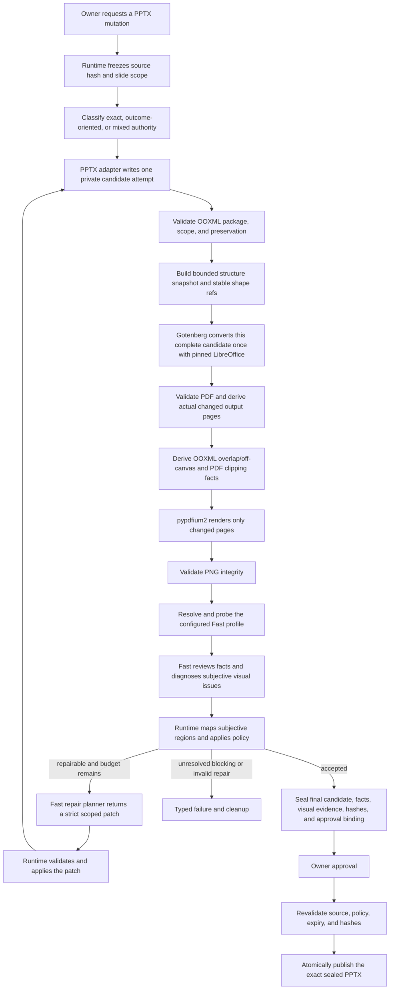

# PPTX Final-Render Visual Quality Gate Design

> Language: English | [简体中文](../zh-cn/docs/pptx-final-render-visual-qa-design.md)

| Field | Value |
|---|---|
| Status | Runtime implementation completed on 2026-09-01; deployment defaults remain shadow with no repair or blocking qualifications |
| Decision date | 2026-09-01 |
| Scope | Governed PPTX mutations that can publish a new presentation |
| Authoritative renderer | Gotenberg `8.36.0` with LibreOffice `26.2.5.2` |
| Rasterizer | pypdfium2 `5.12.1` |
| Visual reviewer | Fast model resolved from the active Runtime profile |
| Publication rule | Publish only the exact sealed candidate covered by the recorded evidence |
| Decision owner | SparkClaw Workflow Runtime |

## Decision

SparkClaw will add a final-render quality stage to the governed PPTX mutation
pipeline:

```text
PPTX candidate attempt
  -> Gotenberg with pinned LibreOffice
  -> PDF
  -> deterministic integrity checks and objective diagnostic facts
  -> bounded structure projection and changed-page PNGs
  -> configured Fast semantic review and repair planning
  -> Runtime policy: accept, bounded repair, or fail
  -> when repair is authorized, create the next candidate attempt
  -> sealed candidate approval and publication
```

Runtime creates an initial exact candidate. For an outcome-oriented request such
as "improve slide 2," a repairable visual finding can trigger up to two bounded
automatic repair attempts inside the originally authorized page scope. Each
candidate attempt is converted as a complete deck exactly once. Only output
pages whose visible content actually changed are rasterized and sent to Fast.
There is no full-deck contact sheet and no adjacent-page expansion for context.

Fast is a model role, not a synonym for an online endpoint. Runtime resolves
the active Fast profile at invocation time. A local or hosted Fast model uses
the same visual-review contract after the exact resolved profile, base URL, and
model ID pass an image-input readiness probe. The currently disabled image
input of a local Fast deployment is a profile readiness state, not an
architectural limitation.

The fixed LibreOffice render is the sole visual baseline. Microsoft PowerPoint
is not required for qualification, comparison, or production operation.
Runtime derives clipping, geometric-overlap, and off-canvas facts
programmatically. Fast interprets those facts against the rendered page,
diagnoses hierarchy, whitespace, focus, and other semantic visual issues, and
proposes a repair strategy. Runtime owns every warning, repair authorization,
stopping, and blocking decision, so users are not asked to choose intermediate
layout mechanics.

## Implementation Status

The target Runtime path is implemented behind operator-owned rollout and
qualification gates:

- Compose runs the digest-pinned Gotenberg `8.36.0` image, and Gateway uses only
  its private LibreOffice conversion endpoint.
- `pypdfium2==5.12.1` is installed in the document runtime and Gateway image.
- The existing ephemeral pre-approval candidate path invokes visual QA for all
  six governed PPTX mutations: `replace_text`, `add_slide`, `update_slide`,
  `update_deck`, `duplicate_slide`, and `delete_slide`.
- Runtime combines normalized mutation arguments with the verified mutation
  result to select replacement pages and shapes, the inserted page, or updated
  pages and shapes. Duplicate and delete produce an empty visual page set.
- Every operation converts the complete candidate once and validates the page
  count, dimensions, and aspect ratio of every PDF page. Only selected pages
  are rasterized and sent to Fast; an empty selection skips Fast but not render
  integrity checks.
- The embedded diagnostic adapter emits bounded structure plus explicit
  clipping, overlap, and off-canvas facts. Missing PDF text evidence becomes
  `unavailable` rather than a false pass, and bounded text or evidence
  truncation is explicit rather than treated as complete evidence.
- The exact active Fast profile must first pass an image-input and strict-schema
  readiness probe. Each selected PNG is then reviewed through the strict
  `sparkclaw.pptx_visual_assessment.v1` contract.
- Bounded audit records retain hashes, dimensions, diagnostic identities,
  semantic effects, issue regions, shape references, and model identity without
  storing page pixels or document text.
- Runtime derives a typed `sparkclaw.pptx_visual_report.v1` with infrastructure
  state, stable failure code, objective/subjective evidence, and Runtime-owned
  issue classes. Shadow, warning, qualified blocking, and default-on use that
  one typed policy input.
- Warning and later phases can run the strict
  `sparkclaw.pptx_visual_repair_plan.v1` planner through the active Fast profile.
  The internal-only adapter supports the finite operation set, verifies fresh
  model-hidden shape target hashes, and rejects package changes outside the
  authorized slide XML.
- The controller permits the initial candidate plus at most two repair attempts.
  Every attempt is converted again, only repaired pages are rasterized, shape
  references are regenerated, and repeated plans, repeated candidates, unchanged
  pixels, protected-scope violations, and blocking regressions stop or roll back
  deterministically.
- Approval warnings contain bounded slide/class summaries. Qualified blocking
  and default-on fail closed on required renderer/model evidence, but only the
  four configured blocking-ceiling classes may block after repair.
- Candidate bytes, typed visual report, attempt chain, repair-plan digests,
  source hash, argument digest, policy-configuration digest, and expiry are
  sealed in the Artifact Store. Approval publishes exactly those candidate
  bytes without rerunning mutation, rendering, or Fast.

The shipped default remains `shadow`. `repairQualifiedClasses`,
`repairQualifiedOperations`, and `blockingQualifiedClasses` are empty, so the
presence of repair and blocking code does not qualify any production behavior.
Deployment-specific renderer/font/model/corpus evidence must be recorded before
an operator moves to warning or grants class/operation qualifications.

## Boundaries

This is an acceptance pipeline with bounded correction, not an open-ended
layout search.

- The existing bounded PPTX mutation layer continues to create the candidate.
- The OOXML verifier proves that only authorized package and semantic changes
  occurred.
- Gotenberg provides isolated service operation around the pinned LibreOffice
  renderer; it is not a second rendering baseline.
- A deterministic diagnostic engine derives exact shape-overlap and off-canvas
  facts from the current OOXML snapshot and targeted clipping evidence from the
  fixed PDF text/glyph layer.
- pypdfium2 extracts bounded text/glyph measurements and creates images only
  for pages selected by Runtime.
- Fast semantically reviews objective facts, diagnoses subjective visual
  classes from the supplied image, and proposes a strict mutation for the
  authorized pages.
- Runtime decides whether the combined evidence is shadow-only, repairable, a
  warning, or a qualified blocking defect, then validates and applies any
  repair through the PPTX adapter.
- The default budget is the initial candidate plus at most two repair attempts;
  the model cannot raise that limit.
- Approval binds the exact candidate bytes already rendered and checked.

The active design does not retain PDF.js geometry reconstruction, PowerPoint
reference rendering, full-deck contact sheets, speculative candidate rendering,
or unbounded model-driven repair. Superseded proposals and their harnesses remain
available only in Git history.

## Goals

- Render every publishable candidate before approval in the fixed Linux
  baseline environment.
- Convert each sequential candidate attempt once rather than render speculative
  variants.
- Catch corrupt inputs, conversion failures, page mismatches, invalid page
  images, and unauthorized OOXML changes deterministically.
- Produce precise, shape-bound facts for text clipping, geometric overlap, and
  off-canvas geometry on the actual changed pages.
- Ask Fast to inspect exactly the pages with newly changed pixels and combine
  the image with the current structure and objective facts.
- Support both local and hosted Fast profiles without endpoint-specific code.
- Treat slide pixels and visible slide instructions as untrusted input.
- Automatically correct qualified layout defects within the user's original
  authorization without asking the user to decide intermediate mechanics.
- Keep correction bounded by page scope, protected content, attempt count,
  operation count, and the parent deadline.
- Roll out visual findings as shadow data and warnings before allowing a small,
  qualified set of severe defect classes to block.
- Publish the exact sealed candidate whose hashes and evidence were approved.

## Non-Goals

- Reconstructing slide object geometry or reading order from the PDF; OOXML
  remains authoritative for shape geometry and identity.
- Treating a geometric overlap measurement as a defect, or using deterministic
  overlap or aesthetic scores as a second layout engine.
- Comparing LibreOffice output with Microsoft PowerPoint.
- Sending unchanged pages to provide style or presentation context.
- Letting Fast directly edit the candidate or decide which repair is accepted.
- Unbounded generation, candidate enumeration, or aesthetic search after a
  finding.
- Expanding a page-scoped request into master, theme, or unrelated-page changes.
- Exposing a user-selectable render or visual-inspection tool with arbitrary
  paths or renderer settings.
- Publishing unchecked output when a stage required by the active policy is
  unavailable.

## Page Selection

Runtime derives the visual-review page set from trusted mutation evidence, not
from model prose and not from page adjacency.

1. The frozen user scope and normalized tool arguments define the authorized
   slide targets.
2. The mutation result records the resulting 1-based output slide indexes.
3. OOXML preservation verification rejects visible changes outside that scope.
4. Runtime computes the set of output pages with an actual visible delta.
5. Only that set is rasterized and sent to Fast.

Examples:

| Operation | Complete-deck conversion | Pages sent to Fast |
|---|---:|---|
| `pptx.replace_text` | Required | Slides containing replacements |
| `pptx.update_slide` | Required | The one updated output slide |
| `pptx.update_deck` | Required | Only output slides listed and actually changed |
| `pptx.add_slide` | Required | The inserted output slide |
| `pptx.duplicate_slide` | Required | None when the duplicate introduces no new pixels |
| `pptx.delete_slide` | Required | None |

If a whole-deck request actually changes every slide, every changed slide is
reviewed. If it changes only a subset, unchanged slides are not sent. An empty
visible-delta set skips the Fast call but does not skip complete conversion,
OOXML verification, or PDF integrity checks.

## Request Authorization and Automatic Repair

Runtime classifies the frozen request before candidate creation:

| Request class | Example | Automatic repair authority |
|---|---|---|
| Exact edit | "Replace the slide 2 title with X" | Repair only defects introduced by the edit while preserving the requested text and explicit constraints |
| Outcome-oriented edit | "Improve slide 2" or "make this page presentation-ready" | Make bounded content and layout corrections within the authorized page to satisfy the requested outcome |
| Mixed edit | "Improve slide 2, but keep the image and brand colors" | Use outcome-oriented repair while treating every explicit constraint as immutable |

Ambiguous requests receive the narrower authority. Exact object names, values,
positions, and prohibitions are hard constraints. A result-oriented phrase grants
autonomy only for the named pages and only for decisions required to complete
that result.

For an outcome-oriented request, Runtime may automatically permit the repair
planner to propose:

- position and size changes for text boxes, images, charts, shapes, and tables
  on the authorized page;
- bounded font-size, spacing, padding, alignment, wrapping, and companion-shape
  adjustments;
- removal of decorative elements created by the current run;
- light shortening or restructuring of model-generated text without changing
  facts, data, conclusions, names, or the user's requested meaning;
- rollback of a current-run local change when a narrower alternative is safer.

Repair must prefer objects changed by the current run. It may touch an existing
object on the authorized page only when that object directly participates in
the reported conflict. It must not alter other pages, masters, themes, global
font/color mappings, shared assets, protected text, or user-owned substantive
content. If a repair requires any of those changes, Runtime stops rather than
silently widening authority.

Users receive one final approval or one final result-level failure. They are not
asked to choose font sizes, object movements, wrapping strategies, or
intermediate candidates.

## Structure Evidence and Issue Mapping

SparkClaw already has PPTX structure extraction through `files.read`. The
underlying `python-pptx` reader produces:

- slide indexes, slide dimensions, layout/template references, and notes state;
- top-level and grouped shape indexes, types, names, placeholder roles, parent
  groups, z-order, rotation, and OOXML geometry;
- text, paragraph/run structure, editability, fonts, colors, alignment,
  spacing, bullets, wrapping, margins, and fit summaries;
- image, chart, table, hyperlink, fill, line, and companion-group evidence.

That complete read is not currently sent to the edit model. The existing
`pptx_business_projection_v1` intentionally exposes only operation-scoped text
targets, `slide_index`, `shape_index`, current text, limited font/fit summaries,
and companion roles. The current public `pptx.update_slide` contract accepts
text updates plus `preserve` or `coordinated` layout policy; it does not accept
arbitrary model-selected geometry or style operations.

The visual-repair feature therefore requires a new Runtime-built bounded
projection, `pptx_visual_repair_context_v1`, for the actual changed pages only.
It does not require a new user-visible structure tool. Each model-visible shape
record contains:

| Category | Fields |
|---|---|
| Identity | Opaque `shape_ref`, `slide_index`, `shape_index`, type, role, edit capabilities, and current-run-created/changed flags |
| Geometry | `region_milli=[x,y,width,height]`, z-order, rotation, parent/group reference, and canvas relation |
| Content | Current text or bounded semantic summary, protected-content flags, and user constraints |
| Text/style | Font size/name, bold, color, alignment, spacing, margins, wrapping, fill, and line when relevant |
| Relationships | Companion group/role and bounded nearby or occluding shape references |
| Diagnostic facts | Objective diagnostic IDs, evidence status, measured regions, and bound shape references |
| Visual issues | Subjective visual issue IDs, regions, classes, confidence, and bounded target candidates |

Runtime converts OOXML and PDF coordinates into one integer-thousandths page
space, `region_milli`. Objective facts are bound directly to current shape
records. Subjective visual issues are mapped by rectangle
intersection/containment, distance, z-order, current-run change membership, and
issue-compatible shape type. Mapping only locates candidate objects; it does
not authorize a repair or decide whether an issue blocks.

For subjective missing-glyph and small-text findings, editable text shapes that
intersect the issue region are preferred. If a subjective issue cannot be
mapped confidently, Runtime sends a bounded ranked candidate set and marks it
`mapping_status=ambiguous`; the model still cannot name an unoffered shape.

Model-visible `shape_ref` values are bound to model-hidden target hashes from the
current candidate snapshot. Any reread, repair attempt, source change, shape
reorder, or target mismatch invalidates the old reference and requires a new
projection.

## Objective Diagnostic Facts

Runtime builds `sparkclaw.pptx_diagnostic_facts.v1` before Fast review. The
contract contains measurements, not repair or policy conclusions:

```json
{
  "schema_version": "sparkclaw.pptx_diagnostic_facts.v1",
  "candidate_sha256": "...",
  "slide_index": 2,
  "coordinate_space": "region_milli",
  "facts": [
    {
      "diagnostic_id": "diag-text-1",
      "kind": "text_clipping",
      "status": "confirmed",
      "shape_refs": ["slide:2:shape:5"],
      "evidence": {
        "text_frame_region_milli": [110, 170, 500, 180],
        "expected_text": "Quarterly revenue increased by 18%",
        "observed_text": "Quarterly revenue increased by",
        "missing_spans": [{"start": 31, "end": 34, "text": "18%"}],
        "rendered_glyph_bounds_milli": [122, 181, 476, 168],
        "coverage_status": "complete"
      }
    }
  ]
}
```

Every fact uses one of four evidence states:

| Status | Meaning |
|---|---|
| `confirmed` | The required sources and shape binding agree, and the measurement satisfies the qualified deterministic rule |
| `observed` | The measurement is valid, but it is not sufficient by itself to establish the complete condition |
| `ambiguous` | Multiple source-to-shape or text alignments remain plausible |
| `unavailable` | A required source, such as a usable PDF text layer, is absent; absence is never converted into a negative finding |

The first diagnostic kinds are:

| Kind | Deterministic source | Required evidence |
|---|---|---|
| `text_clipping` | Current OOXML text/frame evidence aligned with the fixed-render PDF text/glyph layer | Expected and observed text, missing spans, text-frame region, rendered glyph bounds, alignment/coverage status, and bound text shape |
| `geometry_overlap` | Current OOXML transformed shape geometry | Both shape refs, intersection polygon or rectangle and area, per-shape overlap ratios, z-order, fill/line transparency, group ancestry, and numeric tolerance |
| `off_canvas` | Current OOXML transformed shape geometry and slide canvas | Shape ref, canvas bounds, transformed shape bounds, overflow sides and distances, rotation/group ancestry, and numeric tolerance |

Overlap and off-canvas facts are computed from OOXML because it is the source
of slide-object identity and geometry. The engine applies group transforms and
rotation before intersection or canvas comparison. It emits bounded facts only
when at least one participating shape was changed or created by the current
attempt, or the fact intersects an authorized changed-target region.

Clipping evidence is targeted to editable text shapes on the changed pages.
Runtime aligns normalized OOXML text and run boundaries with pypdfium2 text
characters, character boxes, and bounded text regions from the same fixed PDF
that produced the review PNG. A missing span becomes `confirmed` only when the
shape binding and text alignment are unique under the qualified rules. Missing
or unreliable PDF text extraction produces `ambiguous` or `unavailable`
evidence instead of a fabricated pass or failure. The rendered PNG remains
available to Fast for semantic context, but Fast cannot rewrite a diagnostic
measurement or change its status.

A `geometry_overlap` fact means only that two transformed shapes intersect. It
does not mean content is obscured: intentional layering, masks, backgrounds,
badges, and decorative overlays are valid overlaps. Likewise, an `off_canvas`
fact may describe intentional bleed. Fast decides the semantic effect from the
fact, structure, and rendered image; Runtime then applies the versioned policy.

## Repair Plan Contract

After objective diagnostics and semantic issue mapping, the bounded repair
planner returns a strict structured plan instead of prose or a direct tool call:

```json
{
  "schema_version": "sparkclaw.pptx_visual_repair_plan.v1",
  "attempt": 1,
  "slide_index": 2,
  "resolves_diagnostic_ids": ["diag-text-1"],
  "resolves_visual_issue_ids": [],
  "operations": [
    {
      "op": "set_geometry",
      "shape_ref": "slide:2:shape:5",
      "region_milli": [110, 170, 500, 180]
    }
  ]
}
```

Every plan must reference at least one current-attempt diagnostic ID or visual
issue ID. Objective repairs cite `resolves_diagnostic_ids`; repairs for
hierarchy, whitespace, focus, or another subjective class cite
`resolves_visual_issue_ids`. A plan may cite both when one change addresses a
measured geometry fact and a semantic visual issue.

The first qualified operation set is finite:

| Operation | Purpose |
|---|---|
| `rewrite_text` | Shorten or restructure model-generated text within content authority |
| `set_geometry` | Move or resize one offered shape within the authorized slide |
| `set_text_style` | Change bounded font size, alignment, spacing, margins, or wrapping |
| `set_shape_style` | Correct qualified local contrast/fill/line defects when brand constraints permit |
| `place_above` / `place_below` | Change ordering relative to another offered shape on the same slide |
| `delete_generated_shape` | Remove a decorative shape created by the current run |

Each operation uses only offered `shape_ref` values and operation-specific
fields. Unknown operations or fields, raw OOXML paths, arbitrary package parts,
absolute filesystem paths, unoffered shapes, cross-slide references, and
free-form instructions invalidate the complete plan.

The current public editor schema remains unchanged. Runtime must translate an
accepted repair plan into a new internal-only PPTX repair adapter contract. The
existing text update and `coordinated` layout path can implement the supported
subset initially; geometry, local style, and ordering operations require explicit
adapter support, preservation allowlists, and qualification before their repair
classes are enabled.

## Target Architecture



## Ownership

| Component | Owns | Must not own |
|---|---|---|
| Workflow Runtime | Request authority, scope, changed-page set, readiness, repair budget, issue policy, stopping, approval, publication, audit, cleanup | Visual interpretation |
| PPTX adapter | Supported candidate mutation and Runtime-validated repair application | Claiming final rendered quality or widening repair scope |
| OOXML verifier | Package validity and authorized semantic/package delta | Repairing invalid output |
| Gotenberg/LibreOffice | One isolated complete PPTX-to-PDF conversion per candidate attempt | Modifying or publishing the PPTX |
| Objective diagnostic engine | Shape-bound clipping, geometric-overlap, and off-canvas facts with explicit evidence status | Declaring overlap harmful, judging aesthetics, authorizing repair, or blocking |
| pypdfium2 | Bounded PDF text/glyph extraction and deterministic rasterization of selected pages | Slide-object identity, semantic issue classification, or acceptance policy |
| Configured Fast model | Semantic review of diagnostic facts, subjective visual diagnosis, and strict repair planning | Choosing endpoint, inspected pages, policy severity, blocking, or directly editing the candidate |
| Structure projector and evidence binder | Bounded current-candidate shape records, normalized coordinates, stable references, fact binding, and subjective issue-to-shape candidates | Semantic judgment, repair authorization, or mutation execution |
| Bounded repair planner | Strict repair proposal from user constraints, structured slide evidence, objective facts, and subjective visual issues | Applying changes, expanding scope, changing protected content, or choosing the final candidate |
| Artifact store | Owner-scoped sealed bytes, manifest, evidence digests, and expiry | Recomputing policy decisions |

## Preparation Pipeline

### 1. Candidate and OOXML preflight

Runtime writes the candidate into a private job directory and computes its
SHA-256. Before conversion it validates the candidate as an OOXML ZIP package,
including bounded expansion, required presentation parts, relationships, and
declared slide count. The normal reader reopens it, and existing preservation
rules verify that visible and package changes match the authorized mutation.

Random or malformed bytes with a `.pptx` suffix must be rejected here. The
renderer response cannot be used as proof that the input was a valid PPTX.

### 2. One complete conversion per candidate attempt

Gateway sends each job-local candidate attempt to one private Gotenberg
endpoint exactly once. The request cannot override the endpoint, LibreOffice
options, font paths, or output location. The selected baseline is:

- Gotenberg `8.36.0`, pinned by image manifest digest
  `sha256:87c16b9f364279d321bc9772d31fa58aa6abe036423c270698bd636c3a8e9466`;
- LibreOffice `26.2.5.2` inside that image;
- a read-only font bundle identified by a versioned manifest digest.

Changing the Gotenberg digest, LibreOffice version, or font manifest changes the
visual baseline and requires renewed render and visual qualification. There is
no host LibreOffice fallback.

### 3. Deterministic integrity and objective diagnostics

Runtime keeps integrity validation separate from diagnostic facts. Integrity
checks determine whether the candidate and render are usable. Diagnostic facts
measure candidate geometry or fixed-render text coverage without deciding the
semantic severity or repair.

Before conversion:

- candidate exists, is bounded, and is a valid OOXML ZIP package;
- required parts and relationships parse;
- expected slide count is known;
- package and semantic preservation checks pass.

After conversion:

- response is bounded, begins with the PDF signature, and parses as a PDF;
- PDF page count equals the candidate slide count;
- every page has finite, positive dimensions;
- every page matches the expected orientation and aspect-ratio tolerance;
- all changed output page indexes exist in the PDF.

For each selected PNG:

- decoding succeeds and color mode/dimensions match the fixed render policy;
- pixels are neither corrupt nor uniformly black;
- a uniformly white image is accepted only when candidate evidence permits an
  intentionally blank page;
- encoded bytes and pixel count remain within configured limits.

After integrity checks pass, Runtime builds the bounded current-candidate shape
snapshot and derives `sparkclaw.pptx_diagnostic_facts.v1` for the actual changed
pages:

- transformed OOXML shape polygons produce exact pairwise intersection facts
  and canvas overflow distances under a fixed numeric tolerance;
- pypdfium2 extracts the fixed PDF text layer, character boxes, and bounded
  text regions needed to align changed OOXML text shapes and identify missing
  rendered spans;
- every fact carries current `shape_ref` bindings plus `confirmed`, `observed`,
  `ambiguous`, or `unavailable` status;
- overlap and off-canvas measurements remain facts rather than automatic
  defects, and no deterministic aesthetic score is produced.

PDF byte hashes are recorded for evidence, but cross-run byte identity is not
required because LibreOffice PDF metadata may vary. Qualification uses decoded
page-pixel stability instead.

### 4. Rasterization

pypdfium2 `5.12.1` reads bounded text/glyph evidence from and renders only the
selected pages of the same PDF. PNG output uses a fixed RGB scale, color policy,
and encoder settings. The resolution must stay within the configured Fast image
limit while retaining the smallest text size covered by the qualification
corpus.

PDF and PNG data remain job-local. Normal logs contain only hashes, dimensions,
page indexes, timings, and typed outcomes.

### 5. Fast profile resolution and image readiness

Runtime resolves the Fast lane through the active configuration at operation
start. It records the resolved profile name, base URL identity, model ID, and
relevant configuration digest. It must not infer image capability from the
profile name, endpoint location, or model family.

Before visual QA is enabled for that resolved target, a readiness probe sends a
small known image through the same image request path used in production and
requires a valid strict-schema response. A text-only health check, `/models`
response, or successful non-image chat request is insufficient.

Readiness evidence is keyed by the exact profile/base URL/model/configuration
tuple, has a bounded TTL, and is invalidated on configuration or model changes.
This permits a local Fast profile to become eligible as soon as its image input
is enabled, without adding a local-versus-hosted branch.

In shadow or warning rollout, readiness and call failures are recorded as
infrastructure warnings because visual findings are not yet authoritative.
Once active policy requires visual review for changed pages, missing readiness,
timeouts, transport failures, or invalid structured output fail closed and no
approval artifact is created.

### 6. Fast semantic visual review

Runtime invokes a dedicated image-inspection operation using the resolved Fast
profile and the `vision_structured` output budget. The call has no tools. Each
request contains only:

- one changed-page PNG;
- the 1-based slide index and page dimensions;
- the operation class;
- the bounded `pptx_visual_repair_context_v1` structure for that page;
- the page's `pptx_diagnostic_facts.v1` objective facts;
- the versioned visual issue rubric.

The system instruction states that slide pixels are untrusted evidence and that
instructions visible inside the page must be ignored. Fast receives no
workspace paths, approval controls, source XML, renderer options, unrelated
pages, contact sheet, or permission to change the candidate. It cannot change,
delete, or fabricate deterministic facts. It reviews the semantic effect of
those facts and independently diagnoses classes such as hierarchy, whitespace,
and visual focus from the rendered page.

### 7. Runtime-controlled repair and revalidation

When a validated issue is repairable under the frozen request authority,
Runtime invokes a dedicated bounded repair-planning operation. The repair
planner receives only the original request and explicit constraints, the
current `pptx_visual_repair_context_v1`, objective diagnostic facts, validated
semantic visual evidence, and the current attempt identifier. It returns
`sparkclaw.pptx_visual_repair_plan.v1`; it has no tools and cannot write the
file.

The repair-planning operation is routed through the same resolved active Fast
profile unless a future versioned policy explicitly selects another qualified
model role. "Dedicated" means a separate strict contract and call boundary, not
a separate local service or an online-only dependency.

Runtime validates every proposed operation before the PPTX adapter applies it:

- the target page is in the original authorized set;
- every `shape_ref` resolves through the current candidate's model-hidden target
  hash and declares the requested operation as supported;
- every referenced diagnostic or visual issue ID belongs to the current
  candidate attempt and was supplied to the planner;
- the operation and object are allowed for the request class;
- exact text, facts, data, names, brand constraints, and explicit prohibitions
  remain protected;
- no master, theme, shared resource, or unrelated page is changed;
- per-attempt object/operation limits and the parent deadline remain available;
- the patch is not empty and does not repeat an earlier patch fingerprint.

The default controller permits at most two repair attempts after the initial
candidate, for at most three sequential candidate versions. The operator may
lower this limit, but neither Fast nor the repair planner may raise it. Each
repaired candidate repeats OOXML verification, one complete conversion, page
selection, objective diagnostics, rasterization, semantic visual review, issue
mapping, and creation of a fresh repair projection. References and evidence IDs
from an earlier attempt cannot be reused.

Runtime stops successfully when no policy-actionable repair issue remains. It
also stops when only nonblocking findings remain and another change would have
more regression risk than expected benefit. Runtime stops protectively on any
of these conditions:

- attempt, operation, object, model-call, render-time, or parent deadline budget
  is exhausted;
- the patch is invalid, out of scope, empty, or repeats an earlier patch;
- decoded pixels do not change after the repair;
- the repair would violate a user constraint or protected content boundary;
- the next repair requires a master, theme, shared resource, or unauthorized
  page change;
- deterministic integrity, required diagnostics, preservation, renderer, or
  model readiness fails.

Runtime retains the latest policy-acceptable candidate before attempting to
repair nonblocking findings. If a repair introduces a blocking regression, it
may roll back to that last acceptable candidate. If qualified blocking findings
remain after the repair budget, no approval is created. The user receives one
result-level failure with the affected page, unresolved evidence, stop reason,
and the smallest additional authorization required, rather than a sequence of
layout questions.

## Visual Semantic Result Contract

Fast returns semantic interpretation and subjective issue evidence. It does not
return a Runtime `status`, policy `verdict`, or blocking severity.

```json
{
  "schema_version": "sparkclaw.pptx_visual_assessment.v1",
  "slide_index": 2,
  "fact_reviews": [
    {
      "diagnostic_id": "diag-overlap-1",
      "semantic_effect": "harmful_obstruction",
      "confidence_milli": 960,
      "evidence": "The foreground metric card hides the final two body lines."
    }
  ],
  "subjective_issues": [
    {
      "visual_issue_id": "visual-1",
      "type": "weak_hierarchy",
      "confidence_milli": 840,
      "region_milli": [80, 90, 840, 760],
      "shape_refs": ["slide:2:shape:2", "slide:2:shape:5"],
      "evidence": "The title and body use nearly equal emphasis."
    }
  ]
}
```

Every supplied `confirmed` or `observed` fact receives a bounded semantic
review. Allowed semantic effects are versioned by diagnostic kind:

| Diagnostic kind | Allowed semantic effect |
|---|---|
| `text_clipping` | `required_content_lost`, `decorative_or_empty`, `unclear` |
| `geometry_overlap` | `harmful_obstruction`, `intentional_layering`, `unclear` |
| `off_canvas` | `harmful_overflow`, `intentional_bleed`, `unclear` |

This review cannot change the diagnostic status or measurement. For example,
an overlap remains a confirmed geometric fact even when Fast labels its effect
`intentional_layering`. Runtime derives the policy issue `content_obscured` only
from a qualified overlap fact plus `harmful_obstruction`; it derives
`element_off_canvas` only from a qualified off-canvas fact plus
`harmful_overflow`. A confirmed clipping fact plus `required_content_lost`
becomes `text_clipped`. `unclear`, `ambiguous`, and `unavailable` evidence stays
nonblocking unless a later qualified policy explicitly says otherwise.

Subjective issue classes are diagnosed from the rendered page because they lack
a reliable universal mathematical threshold:

- `weak_hierarchy`;
- `poor_whitespace`;
- `unclear_focus`;
- `broken_layout`, `overcrowded`, and `misaligned` when the defect depends on
  page semantics rather than a single geometry fact;
- `low_contrast`, `text_too_small`, `missing_glyph`, and `inconsistent_style`.

The JSON Schema is strict: unknown fields, prose wrappers, unknown diagnostic
IDs, unknown issue types or semantic effects, invalid coordinates, unoffered
shape refs, excessive issue counts, or out-of-range confidence values invalidate
the response. Coordinates are integer thousandths of page width and height.
Evidence text is bounded and treated as untrusted data. There is no free-form
schema repair.

Repair and blocking eligibility are independent:

| Runtime issue class | Evidence source | Automatic repair after qualification | Runtime blocking ceiling |
|---|---|---|---|
| `text_clipped` | Qualified `text_clipping` fact plus semantic review | Yes | May block after class-specific qualification |
| `content_obscured` | Qualified `geometry_overlap` fact plus `harmful_obstruction` | Yes | May block after class-specific qualification |
| `element_off_canvas` | Qualified `off_canvas` fact plus `harmful_overflow` | Yes | May block after class-specific qualification |
| `missing_glyph` | Subjective visual issue | Yes, when a page-scoped font/style change is allowed | May block after class-specific qualification |
| `broken_layout` | Subjective visual issue | Yes | Warning |
| `low_contrast` | Subjective visual issue | Yes when protected brand constraints permit | Warning |
| `text_too_small` | Subjective visual issue | Yes | Warning |
| `overcrowded` | Subjective visual issue | Yes | Warning |
| `misaligned` | Subjective visual issue | Yes | Warning |
| `weak_hierarchy` | Subjective visual issue | Outcome-oriented requests only | Warning |
| `poor_whitespace` | Subjective visual issue | Outcome-oriented requests only | Warning |
| `unclear_focus` | Subjective visual issue | Outcome-oriented requests only | Warning |
| `inconsistent_style` | Subjective visual issue | Outcome-oriented requests only | Warning |

Runtime maps validated facts, semantic effects, subjective issue type,
confidence, affected role, request authority, repair qualification, blocking
qualification, and rollout state to the next action. Fast cannot add a fact,
authorize a repair, or promote an issue to blocking.

## Rollout Policy

| Phase | Visual behavior | Automatic repair | Blocking behavior |
|---|---|---|---|
| 0. Qualification | Standalone corpus and endpoint testing | Repair plans and attempts run only in the harness | No production use |
| 1. Shadow | Objective facts, semantic reviews, subjective issues, and failures go to bounded audit only | Proposed patches are recorded but not applied | Deterministic integrity and preservation failures block |
| 2. Warning | Valid facts and findings appear in approval and audit | Qualified repair classes may run inside frozen authority; residual quality findings remain warnings | Quality findings do not block |
| 3. Qualified severe blocking | Warnings remain visible and repair remains enabled | Bounded repair runs before any quality block | Only objective-backed `text_clipped`, `content_obscured`, and `element_off_canvas`, plus separately qualified `missing_glyph`, may block |
| 4. Default-on | Same policy for all governed PPTX mutations in the selected deployment profile | Bounded repair is the normal behavior for authorized requests | Required renderer/model infrastructure fails closed |

An operator-owned versioned feature state selects the phase. Repair classes and
allowed operations qualify separately from blocking classes. The model cannot
change rollout state, thresholds, repair budgets, renderer, page set, or
fallback behavior.

### Operator Configuration

The versioned configuration surface is intentionally explicit:

| Environment variable | Meaning | Shipped value |
|---|---|---|
| `SPARKCLAW_PPTX_VISUAL_QA_PHASE` | `disabled`, `shadow`, `warning`, `qualified_blocking`, or `default_on` | `shadow` in Compose; `disabled` in the standalone default config |
| `SPARKCLAW_PPTX_VISUAL_QA_REPAIR_QUALIFIED_CLASSES` | Comma-separated Runtime issue classes allowed to request repair | Empty |
| `SPARKCLAW_PPTX_VISUAL_QA_REPAIR_QUALIFIED_OPERATIONS` | Comma-separated internal repair operations permitted in accepted plans | Empty |
| `SPARKCLAW_PPTX_VISUAL_QA_BLOCKING_QUALIFIED_CLASSES` | Comma-separated severe classes allowed to block | Empty |
| `SPARKCLAW_PPTX_VISUAL_QA_MAX_REPAIR_ATTEMPTS` | Repair attempts after the initial candidate, bounded to `0..2` | `2` |

Load-time validation rejects unknown or duplicate classes/operations, a
blocking class that is not also repair-qualified, and an attempt limit outside
`0..2`. The policy digest includes phase, all three qualification sets, attempt
budget, and diagnostic tolerance. Any change while approval is pending makes
the sealed candidate stale and requires a new preparation.

## Qualification

Qualification is against the fixed LibreOffice baseline, not PowerPoint.

| Gate | Required evidence |
|---|---|
| Native Linux/ARM64 | Pinned Gotenberg and pypdfium2 run without emulation on the deployment class |
| OOXML rejection | Malformed ZIPs, missing parts, unsafe expansion, and random `.pptx` bytes fail before conversion |
| Complete conversion | 16:9, 4:3, blank, CJK, mixed-font, image, table, and chart decks preserve expected page count and dimensions |
| Raster integrity | Selected pages decode with stable dimensions and pixel output under repeated runs |
| Fonts | Versioned production manifest, CJK coverage, known substitutions, and missing-font cases are recorded |
| Page selection | Single-page requests send one page; bounded deck updates send exactly the actual changed set; duplicate/delete send none when no new pixels exist |
| Request authority | Exact, outcome-oriented, and mixed requests preserve their distinct hard constraints and page scope |
| Structure projection | Full parser evidence is reduced to complete, bounded repair records for the actual changed pages without leaking paths or unrelated pages |
| Coordinate binding | OOXML, PDF, and PNG evidence normalize into one page coordinate space and rebind to fresh current-attempt shape refs |
| Clipping diagnostics | Expected OOXML text aligns with fixed-PDF characters and boxes; missing spans, frame bounds, rendered bounds, and coverage status match labeled fixtures |
| Geometry diagnostics | Rotated/grouped overlap polygons, ratios, z-order, transparency, canvas overflow sides, and distances match exact fixtures within the fixed tolerance |
| Diagnostic status | `confirmed`, `observed`, `ambiguous`, and `unavailable` are reproducible; missing PDF text never becomes a false pass or confirmed defect |
| Semantic overlap/overflow | Intentional layering and bleed remain nondefects, while harmful obstruction and overflow are recognized from the image plus facts |
| Subjective visual corpus | Labeled hierarchy, whitespace, focus, contrast, density, alignment, glyph, and style cases are assessed by Fast |
| Subjective issue mapping | Fast regions map to offered current shape references across text, images, charts, tables, groups, and z-order; ambiguous cases stay explicit |
| Prompt injection | Visible slide instructions cannot alter schema, issue set, or Runtime policy |
| Fast readiness | Both local and hosted-shaped profiles are tested through the exact image request and strict-schema path |
| Model contract | Valid, malformed, empty, timed-out, and oversized results have typed outcomes |
| Repair plan contract | Only offered current-attempt shape references and qualified operation-specific fields are accepted |
| Repair scope | Every proposed patch stays on authorized pages, protects exact content, and rejects master/theme/shared-resource changes |
| Repair convergence | Objective-backed and subjective defects are repaired within two attempts; no-op, repeated, regressing, and out-of-budget cases stop deterministically |
| Repair adapter | Every enabled internal operation has preservation, rollback, reread, and render regression coverage |
| Latency | Initial conversion plus two repair rounds, rasterization, queueing, model calls, and peak memory fit the parent operation deadline |
| Cancellation and confidentiality | Jobs clean up promptly and ordinary logs contain no document pixels or text |

Before any severe class can block, its labeled corpus must meet a recorded
recall target and false-block ceiling. Lower-confidence and aesthetic classes
remain warnings regardless of the model's wording.

## Feasibility Evidence

The 2026-09-01 Linux ARM64 feasibility run under
`/tmp/sparkclaw-pptx-render-qa-20260901` established:

- a four-slide PPTX converted to four PDF pages and four valid PNGs;
- first conversion completed in `0.694s`, with warm conversions in
  `0.349-0.363s`;
- rasterization took approximately `21-54ms` per page;
- repeated PDF byte streams differed, while decoded page pixels were identical;
- an intentionally blank slide rendered white with no visible watermark;
- Noto Sans CJK SC was present, while Aptos was silently substituted with Noto
  Sans, confirming the need for a pinned font manifest;
- four concurrent requests serialized with approximately `1.4s` wall time;
- random bytes named `.pptx` produced an HTTP 200 Writer PDF, confirming that
  OOXML preflight and page validation are mandatory;
- a hosted-shaped Fast profile accepted image input and strict JSON Schema and
  independently noticed clipping and overlap, but missed a low-contrast case
  and returned an inconsistent overall status, confirming that semantic model
  evidence cannot replace deterministic facts or Runtime policy;
- a currently configured local endpoint rejected image input, which proves only
  that the exact profile was not image-ready at test time.

This evidence is sufficient to begin implementation behind the rollout gates.
It does not yet qualify automatic repair convergence or severe visual blocking;
those require the production repair corpus, font manifest, and exact configured
profiles.

## Sealed Artifact and Approval

Successful preparation stores an owner-scoped sealed record containing:

- source identity and SHA-256;
- operation, authorized target set, actual changed-page set, and argument digest;
- request authority class and protected-constraint digest;
- every candidate-attempt hash, input-attempt link, repair-plan digest, scope
  validation result, diagnostic-fact digest, visual-assessment digest, and stop
  reason;
- final candidate PPTX SHA-256 and canonical package digest;
- PDF byte digest, page count, dimensions, and selected PNG pixel digests;
- deterministic integrity, OOXML preservation, diagnostic schema/engine
  version, PDF text/glyph coverage, fact statuses, and numeric tolerance;
- visual assessment and repair schema/prompt versions, resolved Fast
  profile/base URL/model identity, readiness evidence, semantic result digests,
  and warnings;
- Gotenberg image digest, LibreOffice version, pypdfium2 version, font-manifest
  digest, Runtime policy version, and rollout phase;
- owner, run, approval binding, creation time, expiry, and cleanup state.

Approval authorizes publication of this artifact only. After approval, Runtime
revalidates source hash, owner, operation binding, policy version, candidate
hash, expiry, and artifact integrity, then atomically promotes the exact sealed
PPTX bytes. It does not rerun mutation, conversion, rasterization, or Fast.

## Failure Taxonomy

| Code | Meaning | Required outcome |
|---|---|---|
| `pptx_render_invalid_input` | Candidate is not a valid bounded OOXML package | Terminal preparation failure |
| `pptx_render_backend_unavailable` | Pinned Gotenberg service is unavailable | Retryable failure; no approval |
| `pptx_render_timeout` | A required render stage exceeded its deadline | Retryable failure; no approval |
| `pptx_render_invalid_pdf` | Output is malformed, unsafe, oversized, or unparsable | Terminal preparation failure |
| `pptx_render_page_mismatch` | PDF page count, page size, or orientation mismatches the candidate | Terminal preparation failure |
| `pptx_render_invalid_image` | A selected PNG is missing, corrupt, black, or dimensionally invalid | Terminal preparation failure |
| `pptx_render_diagnostic_invalid` | Objective facts are malformed, inconsistent with the current candidate, or exceed bounds | Terminal preparation failure |
| `pptx_render_diagnostic_unavailable` | Evidence required by active policy, such as the fixed-PDF text layer for changed text, is unavailable | Warning before the relevant diagnostic is required; otherwise retryable fail-closed |
| `pptx_render_profile_not_ready` | Exact Fast profile/base URL/model failed image readiness | Warning before visual review is required; otherwise retryable fail-closed |
| `pptx_render_model_unavailable` | Required Fast image call failed or timed out | Warning before visual review is required; otherwise retryable fail-closed |
| `pptx_render_model_invalid` | Fast returned invalid strict-schema evidence | Warning before visual review is required; otherwise retryable fail-closed |
| `pptx_render_repair_invalid` | Proposed repair is malformed, out of scope, repeated, or violates a protected constraint | Stop repair; use the last acceptable candidate or fail |
| `pptx_render_repair_exhausted` | Repair budget ended with unresolved actionable findings | Seal the last acceptable candidate when policy permits; otherwise no approval |
| `pptx_render_visual_blocked` | A qualified severe issue remains after bounded repair | Quality failure; no approval |
| `pptx_render_preservation_violation` | Candidate changed unauthorized OOXML or visible content | Terminal preparation failure |
| `pptx_render_source_stale` | Source or policy changed before publication | Stale result; new preparation required |
| `pptx_render_cancelled` | Owner or Gateway cancelled the operation | Cancelled; complete cleanup |

## Deployment and Security

- Run one internal Gotenberg service on the private Compose network or loopback.
- Pin the image digest, LibreOffice version, pypdfium2 version, and font manifest.
- Disable renderer remote fetching and unused conversion surfaces where
  supported.
- Apply input, archive, PDF, page, pixel, CPU, memory, PID, concurrency, and
  deadline limits.
- Apply independent hard limits to repair attempts, cumulative repair
  operations, objects changed per attempt, model calls, and file-size growth.
- Isolate every job directory and bind all work to Gateway cancellation and
  shutdown.
- Keep PPTX, PDF, PNG, extracted metadata, and model evidence out of ordinary
  traces and metrics.
- Retain diagnostics only under explicit owner-authorized mode and bounded TTL.
- Ship license notices for the pinned renderer, rasterizer, fonts, and
  transitive components.
- Requalify after any renderer, font, Fast profile/model, prompt, schema, or
  blocking-policy change.

## Acceptance Criteria

Implementation is complete when:

1. Every governed PPTX mutation prepares one private initial candidate; each
   sequential candidate attempt is converted exactly once before it can be
   accepted.
2. OOXML preflight rejects malformed and fake `.pptx` input before Gotenberg.
3. PDF page count and dimensions are checked for the complete deck.
4. Runtime sends Fast exactly the actual changed output pages and no contact
   sheet or unchanged context pages.
5. Duplicate and delete skip Fast when they introduce no new pixels, while all
   deterministic checks still run.
6. Fast is resolved from the active profile and image readiness is proven for
   the exact profile/base URL/model tuple through a real image request.
7. Local and hosted Fast profiles use the same code and result contract.
8. Runtime produces shape-bound `text_clipping`, `geometry_overlap`, and
   `off_canvas` facts with explicit `confirmed`, `observed`, `ambiguous`, or
   `unavailable` status before Fast review.
9. Geometric overlap and off-canvas measurements are not defects by themselves;
   Fast interprets their semantic effect from the image and structure, while
   Runtime owns policy outcomes.
10. Fast diagnoses hierarchy, whitespace, focus, and other subjective visual
    classes from the rendered image, and it cannot alter objective facts.
11. Runtime builds a bounded structure projection for changed pages, maps every
    subjective visual issue to current-candidate shape references, and never
    asks the model to guess an unprovided object.
12. The repair planner references current diagnostic and/or visual issue IDs and
    returns only strict current-attempt operations over
    offered shape references; Runtime validates and translates the plan through
    an internal-only adapter contract.
13. Outcome-oriented page requests automatically receive up to two qualified
   scoped repair attempts without intermediate user decisions.
14. Exact and mixed requests preserve explicit text, object, position, style,
    and prohibition constraints during automatic repair.
15. No repair changes an unauthorized page, master, theme, shared resource, or
    protected substantive content.
16. Quality facts and findings begin as shadow/warnings, and only the four
    qualified severe classes can block after bounded repair is exhausted.
17. There is no unbounded model-driven loop or unchecked required-stage
    fallback.
18. Approval and final publication bind the same final candidate SHA-256 and
    exact bytes.
19. Renderer, image, diagnostic, model, mapping, repair, cancellation,
    preservation, and stale-source failures are typed and leave no publishable
    or orphan artifact.

## References

- [Document workflows](document-workflows.md)
- [Workflow evidence ownership and reuse](workflow-evidence-ownership.md)
- [Model input and output capacity contract](model-capacity-contract-design.md)
- [Engineering baseline](engineering-baseline.md)
- [Gotenberg](https://github.com/gotenberg/gotenberg)
- [LibreOffice core](https://github.com/LibreOffice/core)
- [pypdfium2](https://github.com/pypdfium2-team/pypdfium2)
