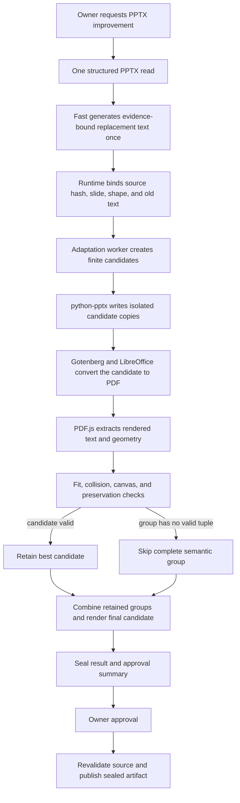

# Resilient PPTX Overlength Adaptation Design

> Language: English | [简体中文](../zh-cn/docs/pptx-overlength-resilience-design.md)

| Field | Value |
|---|---|
| Status | Phase 0 **NO-GO**; qualification harness implemented, production path not implemented |
| Decision date | 2026-08-13 |
| Qualification date | 2026-08-14 |
| Immediate scope | Prevent overlength model text from failing a PPTX improvement operation |
| Affected operations | `pptx.update_slide` and `pptx.update_deck` |
| Candidate render stack | Gotenberg, LibreOffice, and PDF.js text geometry extraction |
| Content policy | One Fast generation; no layout prompt, shortening retry, or model-selected geometry |
| Failure policy | Apply verified semantic groups, return a safe no-change completion, or surface a typed retryable infrastructure failure |
| Decision owner | SparkClaw document runtime |

## Executive Decision

SparkClaw will evaluate a bounded, deterministic adaptation and render-check
stage for generated PPTX replacement text. The first release has one product
objective: text that is too long for the source layout must not terminate the
whole PPTX improvement workflow.

Fast continues to select evidence-bound text shapes and generate replacement
text once. Runtime then tries a finite sequence of layout candidates without
asking Fast to shorten or regenerate content. A candidate is accepted only if
structural checks, a qualified LibreOffice render, rendered-text checks, and
OOXML preservation checks pass. Replacements are accepted and skipped through
explicit semantic atomic groups, so a layout fallback cannot leave a slide with
half of one coherent content change. If no semantic group can be applied safely,
the operation returns the unchanged source document as a successful
`no_safe_change` result rather than reporting a fit-related workflow failure.
Renderer, worker, cancellation, and deadline failures remain typed
infrastructure failures; they are never disguised as successful no-change.

This proposal does not revive the rejected ONLYOFFICE DocumentBuilder and
OR-Tools design. The [DocumentBuilder Phase 0 report](../benchmarks/pptx-documentbuilder-phase0-qualification.md)
remains authoritative for that No-Go decision. The candidate stack in this
document has its own mandatory qualification gate and is used only as a render
oracle. It does not become SparkClaw's PPTX writer.

The [Phase 0 qualification report](../benchmarks/pptx-overlength-phase0-qualification.md)
records a current No-Go. Synthetic visibility, determinism, preservation, and
failure gates passed, but the unreduced 1,024-candidate plan exceeds the
90-second preparation budget even at the fastest measured median. No owner
private-text corpus or Microsoft PowerPoint reference-viewer evidence was
available. Qualification-only code and pinned benchmark dependencies now exist;
no Gateway, ToolHub, configuration, prompt, deployment, or runtime behavior was
changed.

## Problem

The current coordinated updater in the
`services/gateway/internal/toolhub/scripts/pptx_slide/` package (layout logic
in `layout.py`) estimates text width
from character classes and height from a fixed line-height factor. When it
cannot fit a replacement, it raises `PPTXLayoutFitError`. Preflight maps that
condition to `pptx_layout_fit_conflict`, and Workflow gives Fast one semantic
repair attempt with an instruction to shorten or omit the replacement. A
second conflict rejects the workflow before approval.

This behavior has four defects relative to the immediate product requirement:

1. Text capacity is estimated rather than checked through an actual renderer.
2. Layout feasibility is incorrectly routed back to the content model.
3. One infeasible replacement can invalidate every otherwise useful update in
   a slide or bounded deck operation.
4. An inability to improve a document is represented as execution failure even
   though the unchanged source remains a valid, usable PPTX.

Prompt instructions cannot eliminate this failure mode. A model may still
produce longer Chinese wording, add line breaks, choose different punctuation,
or expand a term after a model or sampling change. The runtime must therefore
own fit adaptation and degraded completion.

## Product Invariants

The implementation proposed by this design must preserve all of these
invariants:

- Fast is called once for PPTX semantic generation. Layout conflict never
  creates a second model call.
- Runtime never truncates, summarizes, paraphrases, or deletes part of a
  replacement string. A replacement is applied in full or skipped in full.
- Semantically dependent replacements are applied or skipped as one atomic
  group. Runtime never maximizes update count across a group boundary.
- An overlength replacement alone never causes `pptx.update_slide` or
  `pptx.update_deck` to fail.
- Existing request bounds still apply. Inputs beyond 12 slides, 64 shapes, or 32
  KiB of replacement text fail deterministic validation before adaptation and
  are not classified as fit failures.
- The source PPTX is immutable. Every candidate is produced in an isolated job
  directory.
- An edited artifact is published only after render and preservation checks.
- A renderer outage, timeout, nondeterministic result, or unsupported shape
  cannot cause an unchecked candidate to be published.
- The same source bytes, replacement bytes, policy, fonts, and engine versions
  produce the same accepted subset and layout plan.
- Wall-clock progress never selects a partial result. A hard deadline aborts
  preparation with a retryable infrastructure outcome; deterministic search
  limits are expressed as policy-owned operation and candidate counts.
- Approval describes the exact prepared artifact, applied updates, skipped
  updates, and layout changes. Approval never authorizes a later model retry.
- Existing source identity, evidence binding, scope limits, Policy, audit,
  artifact lineage, and post-edit verification remain in force.

## Goals

- Complete PPTX improvement without workflow failure when generated text is too
  long for one or more source text boxes.
- Use actual rendering in the qualification and acceptance path instead of
  treating character-count heuristics as proof of fit.
- Preserve as many independently safe semantic groups as possible.
- Keep content generation cost at one Fast call and add no layout context to
  that call.
- Apply only bounded, deterministic formatting and geometry changes.
- Return stable typed outcomes that distinguish full success, partial success,
  safe no-change, and genuine infrastructure or source failure.
- Establish a small first release that can later support richer layout families
  without changing the model/runtime ownership boundary.

## Non-Goals

- General redesign or aesthetic optimization of arbitrary presentations.
- Changing templates, generating new visual structures, or splitting content
  across slides in the first release.
- Asking a vision or language model to grade layout.
- Automatically editing SmartArt, chart-internal text, animation, masters,
  grouped descendants, vertical text, text on paths, or unsupported fields.
- Pixel identity with Microsoft PowerPoint.
- Replacing `python-pptx` as the bounded PPTX mutation layer.
- Providing an embedded human review or online presentation editor.
- Reusing DocumentBuilder, OR-Tools, or the rejected AGPL worker design.

## Supported First-Release Scope

The first release is limited to ordinary editable text shapes in presentations
generated by SparkClaw or admitted by an explicit compatibility fingerprint.

| Category | Initial behavior |
|---|---|
| Ordinary title, body, and caption text boxes | Candidate adaptation and render verification |
| Supported card or band patterns with high-confidence companions | Bounded companion resizing using versioned rules |
| English, Simplified Chinese, and mixed English/Chinese text | Required qualification corpus |
| Tables | Protected; the containing semantic group is skipped |
| Grouped text | Protected; the containing semantic group is skipped |
| SmartArt and chart-internal text | Protected; the containing semantic group is skipped |
| Vertical, rotated, path, or field-bearing text | Protected; the containing semantic group is skipped |
| Animations, transitions, notes, masters, media, and relationships | Preserved and fingerprint-checked; never implicit mutation targets |
| Unknown or ambiguous companion relationships | Protected; no geometry movement |

The scope is capability based, not file-name based. A slide is supported only
when Runtime can prove that every mutable target and its allowed companions
match a qualified pattern. An unsupported target makes its complete semantic
group ineligible but does not disable independently supported groups.

## Target Architecture



### Component Ownership

| Component | Owns | Must not own |
|---|---|---|
| Fast | Semantic target selection, semantic group membership, and exact replacement text | Fit retry, font size, coordinates, box dimensions, or skip policy |
| Workflow Runtime | Evidence binding, typed outcomes, Policy, approval, source freshness, artifact promotion, and audit | Text measurement or presentation rendering |
| Adaptation worker | Candidate generation, deterministic ordering, per-group rollback, render orchestration, validation, and diagnostics | Content rewriting, external network access, or approval |
| `python-pptx` mutation layer | Bounded text/style and allowed geometry writes to isolated copies | Declaring rendered fit or viewer compatibility |
| Gotenberg/LibreOffice | Conversion of isolated PPTX candidates to PDF using the pinned font environment | Saving the promoted PPTX or selecting candidates |
| PDF.js checker | Extracting normalized rendered text items and their transform geometry from PDF | Editing PPTX, OCR-based invention, or semantic layout judgment |
| Preservation verifier | OOXML package and normalized semantic allowlists | Repairing an invalid candidate |

Gotenberg is an internal process/API wrapper around the pinned LibreOffice
runtime. It is bound to a private address and receives only job-local files.
The worker does not accept a model-provided renderer URL, arbitrary conversion
option, or path outside its job directory.

## One-Generation Content Contract

The model-visible PPTX projection remains limited to the evidence needed to
select current shapes and produce replacement text. It does not receive:

- candidate dimensions, font steps, renderer output, or layout scores;
- raw PPTX XML, PDF bytes, images, or font metrics;
- instructions to target a character count or retry after fit failure;
- fields that choose adaptation policy or mark an update as mandatory.

The semantic output schema may attach an opaque `atomic_group_id` to updates.
For `update_slide`, a group is naturally slide-local. For `update_deck`, one
group may span multiple slides when terminology, values, or conclusions must
remain coherent across the deck. The identifier carries no layout priority,
geometry, or fallback instruction. Runtime validates group membership against
the complete frozen operation scope. Missing, invalid, out-of-scope, or
ambiguous grouping degrades conservatively to one group containing every update
in the operation. Runtime does not infer semantic independence from slide or
geometric distance.

Runtime removes `pptx_layout_fit_conflict` from semantic repair eligibility.
Semantic repair may remain for malformed output such as empty replacement text
or an invalid schema, but render or geometry failure cannot trigger it.

The replacement string is immutable after the semantic stage. Adaptation may
change wrapping, paragraph spacing, line spacing, text-box dimensions,
confident companion geometry, and font formatting within policy bounds. It may
not change any code point in the replacement text.

## Candidate Adaptation Policy

### Candidate order

For each supported target, the worker generates a finite, canonical candidate
list in this order:

1. Preserve source geometry and effective font formatting; enable wrapping only
   where the source semantics permit it.
2. Expand the text box along qualified axes into proven free space while
   retaining source alignment anchors.
3. Resize a high-confidence companion background and move only versioned flow
   peers required to preserve containment and spacing.
4. Reduce paragraph-before, paragraph-after, and line spacing within policy
   floors while preserving paragraph and bullet structure.
5. Scale font sizes downward in 0.5 pt steps, preserving relative run-size
   hierarchy, down to the greater of the role floor and the configured source
   ratio floor.
6. Apply bounded combinations of steps 2 through 5 in canonical order.

These are candidate families, not yet an executable policy. Before Phase 1,
Phase 0 must publish a versioned policy artifact that fixes:

- the exact integer EMU growth and movement steps for each qualified role and
  axis;
- the exact paragraph and line-spacing values, font-size steps, absolute and
  relative floors, and rounding mode;
- the permitted companion-pattern identifiers and their complete mutation
  allowlists;
- canonical Cartesian-product enumeration, dominance pruning, candidate IDs,
  objective tuple, and stable tie-breaking;
- a deterministic maximum evaluation count for each shape and conflict
  component.

`max_candidates_per_shape` is a validation limit, not an instruction to keep
whichever candidates happen to finish first. Candidate truncation, if required,
is defined entirely by the versioned enumeration order before rendering begins.

The initial qualification values are proposals, not production defaults:

| Role | Proposed absolute floor | Proposed relative floor |
|---|---:|---:|
| Title | 18 pt | 80% of source effective size |
| Body | 12 pt | 75% of source effective size |
| Caption | 9 pt | 75% of source effective size |

Owner-corpus qualification may raise these floors. It must not lower them
silently. A policy revision is required for any change.

### Font handling

Font scaling is allowed only when the effective sizes can be resolved without
flattening formatting. For a text shape with multiple explicit run sizes, one
ratio is applied to every size and the relative hierarchy is preserved. If the
effective font is inherited, mixed in an unsupported way, substituted by the
renderer, or below the readable floor, font-scaling candidates are omitted.

Candidate generation never depends on a model estimate, wall-clock race, map
iteration order, or renderer-dependent auto-correction saved back into the
PPTX.

### Geometry handling

All coordinates use integer EMU values and versioned rounding. A mutable region
must stay within the slide safe area and must not cross protected shapes.
Companion movement is allowed only for patterns whose containment, alignment,
order, and spacing relationships passed the compatibility corpus. Unknown
objects are obstacles, not layout opportunities.

The first release does not move content to another slide and does not create a
new slide. Those behaviors require a later design because they change narrative
structure and approval scope.

## Render And Acceptance Contract

Rendering is an admission check, not a mutation source. LibreOffice never saves
the promoted PPTX. The candidate PPTX written by SparkClaw is rendered to PDF,
and PDF.js reads the resulting page text content and geometry.

A candidate is valid only when all applicable checks pass:

1. The candidate reopens through the normal PPTX reader.
2. The exact normalized replacement text is present in rendered text order with
   no missing prefix, suffix, or internal segment.
3. Every matched rendered text item is inside the candidate's allowed text
   region within a qualified tolerance.
4. Rendered bounds stay inside the slide canvas.
5. Changed text and mutable companion geometry introduce no protected-shape
   intersection under the versioned collision rules.
6. The effective rendered font is available from the pinned font manifest; an
   unqualified substitution invalidates the candidate.
7. The PDF page is nonblank, has the expected dimensions, and produces stable
   normalized text and geometry across repeat renders.
8. The output PPTX contains the exact requested text and expected geometry.
9. Package and semantic preservation allowlists report no unrelated mutation.

### Rendered-text attribution and visibility

PDF text extraction alone is insufficient. The qualified checker must establish
all of the following for every changed target:

1. **Unique attribution:** candidate text items map uniquely to the expected
   slide and projected shape region. Repeated identical text elsewhere on the
   page, ambiguous extraction order, or a many-to-one match invalidates the
   candidate.
2. **Baseline delta:** a render of the unchanged source under the same engine is
   compared with the candidate. The accepted text and geometry delta must be
   confined to declared targets and companions.
3. **Clip visibility:** every glyph quad required for the replacement intersects
   the effective PDF clip region completely within the qualified tolerance.
4. **Occlusion visibility:** protected later-painted content, masks, transparency,
   or same-color concealment cannot hide required glyphs under the admitted
   pattern rules.
5. **Normalization identity:** line breaks, soft breaks, bullets, ligatures,
   Unicode normalization, CJK glyph runs, and whitespace use one versioned
   comparison algorithm shared by Runtime and the qualification corpus.

Phase 0 may use PDF.js text content, operator-list/graphics-state evidence, and
deterministic raster evidence only as one qualified checker. If the pinned stack
cannot expose enough information to prove these properties with zero overflow
false negatives on the admitted corpus, the design is No-Go. Presence of the
replacement string in a PDF content stream is never sufficient.

Phase 0 must explicitly test clipping, crop, glyph transform, bullet,
soft-break, CJK, duplicate-string attribution, occlusion, transparency, and
font-substitution cases. OCR is not an acceptance fallback.

LibreOffice and Microsoft PowerPoint can render the same PPTX differently. The
runtime guarantee is therefore limited to the qualified LibreOffice/font
environment and the compatibility corpus. Phase 0 also compares samples in the
current PowerPoint reference viewer; unsupported or divergent patterns are
excluded rather than advertised as safe.

## Partial-Application Algorithm

Candidate generation and combined render checks are organized per slide inside
one deck job, but eligibility and selection occur over operation-wide semantic
atomic groups rather than individual updates:

1. Validate every requested update against frozen source evidence.
2. Normalize and validate scope-bound semantic groups. One unsupported or
   infeasible member makes the complete group ineligible.
3. Classify ineligible groups with per-member diagnostics before mutation.
4. Generate and render candidates for each remaining update in isolation.
5. Build the lowest-change valid candidate tuple for every complete group.
6. Combine eligible groups for a slide and render the combined result.
7. If the combination fails, build conflict components from shared companions,
   changed geometry, and failed collision checks.
8. For a conflict component of at most eight groups, enumerate group subsets and
   maximize applied update count, then applied group count, then minimize font
   reduction, geometry movement, spacing change, and finally stable group and
   shape references.
9. For a larger component, use the same objective with a policy-bounded,
   deterministic elimination order. Record that path in diagnostics.
10. Re-render the final selected group subset for the slide.
11. Assemble all accepted slides, then run one final whole-output render,
    reread, and preservation check.

This algorithm does not require OR-Tools. Candidate and conflict operation
bounds are small and versioned. Exhausting a deterministic search bound makes
the complete affected group ineligible with `search_budget_exhausted`. A
wall-clock deadline, worker crash, renderer outage, or cancellation aborts the
entire preparation as a typed infrastructure failure; SparkClaw never publishes
a subset selected from whichever work happened to finish first.

An exact-span replacement remains atomic even if it crosses runs. A semantic
group remains atomic across its shapes. A deck update is no longer all-or-nothing
for fit conflicts across independent groups, but it remains atomic at file
publication: SparkClaw publishes one verified PPTX or no edited PPTX.

## Typed Outcomes And Failure Semantics

The operation result must separate business degradation from execution failure.

| Status | Meaning | User-visible artifact |
|---|---|---|
| `completed` | Every requested semantic group passed | Verified edited PPTX |
| `completed_with_skips` | At least one semantic group passed and at least one was skipped | Verified edited PPTX plus group-aware skip summary |
| `no_safe_change` | No semantic group could be applied safely after a complete, healthy evaluation | Original PPTX reference; no misleading edited copy |
| `source_invalid` | Source is unreadable, stale, corrupt, or violates format policy | Terminal source failure; no new artifact |
| `runtime_unavailable` | Required qualified renderer/worker is unavailable or unhealthy | Retryable infrastructure failure; no new artifact |
| `adaptation_timeout` | The wall-clock deadline expired before final verification completed | Retryable infrastructure failure; no new artifact |
| `cancelled` | The owner or Gateway lifecycle cancelled preparation | Cancelled Workflow; no new artifact |

Only `completed`, `completed_with_skips`, and `no_safe_change` are successful
Workflow completions. `runtime_unavailable` and `adaptation_timeout` are
retryable infrastructure failures, and `source_invalid` is a source failure.
None of these outcomes trigger semantic generation retry or map to
`semantic_output_invalid` or a generic model failure.

Each skipped update has one stable reason code:

| Reason code | Meaning |
|---|---|
| `unsupported_target` | Shape or companion pattern is outside qualified scope |
| `no_fitting_candidate` | Every bounded candidate overflowed or violated readability |
| `combined_layout_conflict` | The group fit alone but not with higher-ranked compatible groups |
| `font_unavailable` | Required effective font was absent or substituted |
| `render_unverifiable` | Rendered text/geometry could not be proven complete |
| `search_budget_exhausted` | A deterministic candidate/conflict operation bound was exhausted |
| `semantic_group_ineligible` | Another member of the same atomic group could not be applied safely |

Human-readable copy is derived from these typed fields. Runtime and tests never
branch on localized display strings.

`render_unverifiable` describes a deterministic target-level inability to prove
visibility under a healthy renderer, such as ambiguous duplicate-text
attribution. Transport failure, renderer crash, queue timeout, or inconsistent
repeat render is `runtime_unavailable` or `adaptation_timeout`, not a skippable
content reason.

## Requested Plan, Effective Plan, And Pipeline Contract

The current Document Pipeline requires at least one applied change and verifies
every update in the submitted `EditRequest`. Partial adaptation therefore cannot
reuse the requested edit as though all requested updates were applied.

Runtime introduces two immutable plans:

- the **requested plan** records every evidence-bound model update and semantic
  group before adaptation;
- the **effective plan** contains only complete accepted groups, their selected
  candidate IDs, and declared formatting/geometry changes.

For `completed` and `completed_with_skips`, approval, execution, reread, expected
after-value validation, package preservation, and artifact lineage bind the
effective plan. A new complementary check proves that every skipped source shape
and its undeclared companions remain unchanged. The requested plan and complete
skip diagnostics remain attached to approval and audit so narrowing is visible
rather than silently rewriting model intent.

For `no_safe_change`, Runtime does not invoke the existing apply path, fabricate
an `ApplyResult{Changed: 0}`, or create an edited copy. It emits a typed no-edit
Workflow outcome with the unchanged source reference and creates no approval.
Infrastructure and source failures likewise bypass artifact-success projection.

The implementation must add typed prepared-edit and Workflow outcome contracts;
it must not overload the current `pptx_version_written` success status or map a
zero-change completion to `parse_failed`.

## Prepared Artifact And Approval

Candidate work can be more expensive than the existing heuristic preflight.
The accepted result must therefore be prepared once before approval and stored
as a sealed temporary artifact containing:

- source SHA-256 and normalized source identity;
- exact applied and skipped update references and text hashes;
- policy, worker, LibreOffice, Gotenberg, PDF.js, and font-manifest versions;
- requested-plan digest, effective-plan digest, candidate-plan digest, final
  PPTX SHA-256, and canonical OOXML package digest;
- normalized render-check digest and preservation result;
- expiry, job owner, and approval binding.

Approval shows counts and layout changes without exposing full document text in
logs. After approval, Runtime revalidates the source hash, prepared artifact
hash, policy version, owner, and expiry, then atomically promotes the sealed
artifact. It does not call Fast, rerun adaptation, or ask LibreOffice to save
the file.

If the source changes or the sealed artifact expires, Runtime reports a stale
prepared result and requires a new owner operation. It never silently reuses a
layout decision against changed content.

The final PPTX SHA-256 binds the exact prepared bytes for approval and promotion.
Cross-run determinism is evaluated with a canonical package digest that sorts
parts and excludes ZIP timestamps and other explicitly qualified container
metadata. Raw file SHA-256 is required to repeat only if the writer later adopts
a deterministic ZIP serialization. Render digests similarly exclude qualified
volatile PDF metadata while retaining all text, geometry, clip, visibility, and
page evidence.

## Worker Protocol Sketch

The protocol below is illustrative and must be finalized as typed Go and JSON
contracts before implementation.

### Request

```json
{
  "schema_version": "sparkclaw.pptx_adaptation.request.v1",
  "request_id": "opaque-id",
  "source": {
    "input_path": "/job/input.pptx",
    "sha256": "hex"
  },
  "updates": [
    {
      "slide_ref": "ppt/slides/slide3.xml",
      "shape_ref": "cNvPr:17",
      "expected_text_sha256": "hex",
      "replacement_text": "Exact Fast output",
      "atomic_group_id": "slide-3-group-1"
    }
  ],
  "policy_id": "sparkclaw.pptx_adaptation.v1",
  "limits": {
    "max_slides": 12,
    "max_shapes": 64,
    "max_candidates_per_shape": 16,
    "deadline_ms": 90000
  }
}
```

The Gateway supplies job paths and runtime bindings. Model output never supplies
package references, hashes, policy identifiers, limits, or renderer settings.

### Result

```json
{
  "schema_version": "sparkclaw.pptx_adaptation.result.v1",
  "request_id": "opaque-id",
  "status": "completed_with_skips",
  "source_sha256": "hex",
  "output_sha256": "hex",
  "canonical_package_digest": "hex",
  "requested_plan_digest": "hex",
  "effective_plan_digest": "hex",
  "plan_digest": "hex",
  "applied": [
    {
      "slide_ref": "ppt/slides/slide3.xml",
      "shape_ref": "cNvPr:17",
      "atomic_group_id": "slide-3-group-1",
      "candidate_id": "font-0.5",
      "layout_changes": []
    }
  ],
  "skipped": [
    {
      "slide_ref": "ppt/slides/slide3.xml",
      "shape_ref": "cNvPr:22",
      "atomic_group_id": "slide-3-group-2",
      "reason": "no_fitting_candidate"
    }
  ],
  "checks": {
    "rendered_text_complete": true,
    "inside_canvas": true,
    "new_protected_overlap": false,
    "preservation": true
  },
  "artifacts": {
    "prepared_output_path": "/job/prepared.pptx"
  },
  "engine": {
    "policy": "sparkclaw.pptx_adaptation.v1",
    "font_manifest_sha256": "hex"
  }
}
```

Unknown fields are rejected in v1. Stdout has a fixed byte limit, human logs go
to stderr, full replacement text is excluded from logs, and every returned path
must resolve beneath the job directory. The Gateway independently computes all
artifact hashes.

`prepared_output_path`, `output_sha256`, and package/render success checks are
required only for `completed` and `completed_with_skips`. `no_safe_change`
returns no output path or output hash. Infrastructure, timeout, cancellation,
and source failures use a separate error envelope and cannot return an artifact
eligible for approval.

## Phase 0: Mandatory Qualification

No production dependency or code path is added until the candidate renderer and
checker pass Phase 0 on the target Linux ARM64 deployment environment.

| Capability | Qualification test | Pass condition |
|---|---|---|
| Native deployment | Run pinned Gotenberg, LibreOffice, and PDF.js artifacts on DGX Spark | Native ARM64 execution, declared dependencies, and successful health checks |
| Text completeness | Render deliberately fitting and clipped Latin, CJK, and mixed strings | Every clipped, hidden, cropped, or missing segment is rejected; zero false negatives in corpus |
| Attribution and visibility | Exercise duplicate strings, overlapping shapes, clip paths, masks, transparency, and same-color concealment | Every accepted glyph is uniquely attributed and visibly complete; ambiguous or concealed targets are rejected |
| Geometry | Compare PDF.js transforms with known text boxes, rotations, margins, and line breaks | Stable normalized bounds within documented tolerance for supported patterns |
| Font determinism | Exercise production fonts plus missing-font cases | Exact font manifest is recorded; substitution is detected and rejected |
| Render repeatability | Render each fixture 100 times | Identical normalized text/geometry digest and stable raster digest under documented normalization |
| PowerPoint compatibility | Compare accepted outputs in current Microsoft PowerPoint | No visible clipping, repair prompt, missing text, or unsupported divergence in admitted corpus |
| Writer preservation | Apply candidates through the existing mutation layer | Only target text and declared formatting/geometry parts change |
| Partial application | Mix fitting, overlength, unsupported, and conflicting updates | Valid subset is deterministic; no single fit conflict fails the operation |
| Semantic atomicity | Mix dependent title/body/value/terminology updates within and across slides with independent groups | No accepted output contains a partial semantic group; the whole operation becomes one group when metadata is invalid |
| No-safe-change | Make every update unsupported or infeasible | Returns original source with `no_safe_change`, no edited artifact, and no model retry |
| Pipeline outcomes | Exercise full, partial, no-change, source failure, and infrastructure failure paths | Effective-plan validation checks applied groups, skipped shapes remain unchanged, and zero-change never enters the current apply-success path |
| Renderer outage | Stop or hang conversion during a job | Typed retryable infrastructure failure, no unchecked or partial output, and full process cleanup |
| Cancellation | Cancel an oversized job | Whole process tree stops within two seconds and job files are removed |
| Conversion cost | Measure the actual conversion scope and worst-case fixed candidate plan | A documented bound fits the product latency/memory envelope; selective-slide rendering is claimed only if preservation-safe extraction is qualified |
| Digest determinism | Repeat package writes and renders with volatile metadata present | Canonical package and normalized render digests are identical; raw SHA requirements match the chosen ZIP policy |
| Confidentiality | Inspect logs, traces, and request failures | No full document text, PDF bytes, or arbitrary host paths leak |

The qualification corpus must contain owner decks with irreversible private-text
replacement and synthetic boundary fixtures. It must cover 16:9 and 4:3,
English, Simplified Chinese, mixed text, bullets, multiple paragraphs, soft
breaks, explicit run formatting, custom and missing fonts, AutoFit settings,
ordinary cards/bands, nearby images, tables, groups, charts, notes, masters,
animations, and intentionally corrupt inputs.

Any failure in native deployment, text completeness, deterministic rendering,
PowerPoint compatibility for the admitted patterns, preservation, or safe
outage behavior makes the proposal No-Go. A failed gate produces a bilingual
qualification report only. It does not permit a character heuristic, OCR, model
review, or prompt retry to substitute for the failed capability.

## Rollout Plan

| Phase | Work | Exit gate |
|---|---|---|
| 0. Renderer qualification | Build fixtures and test the pinned render/check stack without SparkClaw integration | Every mandatory qualification row passes |
| 1. Single-shape worker | Implement immutable text, bounded candidates, render checks, preservation, and typed skips for one supported shape | No overlength case fails Workflow; deterministic 100-run corpus |
| 2. Single-slide groups | Add semantic atomic groups, isolated candidates, combination checks, conflict components, and sealed prepared artifacts | Mixed valid/invalid groups return the maximal deterministic safe group subset without partial semantics |
| 3. Bounded deck | Extend the same behavior to current deck limits and final whole-output verification | Partial success and no-safe-change E2E paths pass under approval and file backends |
| 4. Canary | Enable only for allowlisted owners and qualified presentation fingerprints | Zero unchecked output, source mutation, model layout retry, or unexplained render drift |
| 5. Legacy retirement | Remove layout-specific semantic repair and stop treating character estimates as fit authority | Canary evidence retained and rollback tested |

Each phase is independently revertible. The legacy path stays available behind
one operator-owned mode switch during canary, but the model cannot select the
mode. Rollback restores the old implementation; it does not merge outputs from
two engines.

## Time And Resource Budget

The design trades local compute for removal of a second model call and removal
of fit-related workflow failure. Phase 0 must measure actual numbers before
production limits are fixed.

The intended runtime controls are:

- prefer rendering only affected slides during candidate search, but claim this
  optimization only if Phase 0 qualifies a preservation-safe selective-render
  mechanism; otherwise measure and bound full-deck conversion;
- keep one warm, bounded conversion service instead of spawning LibreOffice for
  every candidate;
- cache render measurements only inside one job using source, candidate, font,
  and engine digests;
- cap candidates per shape, conflict component size, PDF bytes, page count,
  deterministic search operations, worker concurrency, and total deadline;
- perform one final candidate conversion after subset selection and inspect
  every affected page;
- perform zero additional model calls and add zero layout tokens.

The theoretical request maximum of 64 shapes times 16 candidates is 1,024
candidate evaluations before combination renders. Phase 0 must not assume that
this fits a 90-second budget. It must establish a smaller executable policy,
prove safe deterministic dominance pruning, or reduce the admitted request
scope. Deterministic structural prechecks may eliminate only candidates proven
unsafe or dominated under the versioned policy. Approximate heuristics may order
evaluation, but they can never accept a candidate or turn incomplete work into a
successful subset.

The phase report must record median, p95, and worst-case time for single-shape,
single-slide, and bounded-deck cases; peak memory; conversion queue time; number
of renders; and skip rate. Latency limits are product decisions made from this
evidence, not guessed in the implementation.

## Security, Licensing, And Operations

- Pin every container, binary, Node package, Python package, and font by version
  and digest. Do not download `latest` at runtime.
- Review and ship the exact upstream licenses and notices for Gotenberg,
  LibreOffice, PDF.js, fonts, and transitive packages before distribution.
- Keep the conversion service private, authenticated at the process/network
  boundary, and unable to fetch arbitrary URLs.
- Apply input, output, page, memory, CPU, concurrency, and wall-clock limits.
- Root worker and conversion processes in cancellable Gateway ownership and
  expose shutdown cleanup. No orphaned LibreOffice process is permitted.
- Mount job input read-only where possible and give the renderer a fresh
  temporary profile per bounded worker slot.
- Exclude document text and rendered pages from ordinary logs. Diagnostic
  renders are opt-in qualification artifacts with owner-scoped retention.
- Extend setup, doctor, deployment, and Compose validation only after Phase 0
  returns Go.

This document does not make a legal conclusion about combining or distributing
the candidate components. The pinned artifacts and actual deployment topology
must receive a license review before implementation ships.

## Observability

For every adaptation job, audit records include:

- request, source, policy, plan, output, font-manifest, and engine digests;
- requested/effective plan and canonical-package digests;
- counts of requested, supported, applied, skipped, and rendered candidates and
  semantic groups;
- per-reason skip counts without replacement text;
- conversion attempts, cache hits, and timing by stage;
- final typed outcome and approval/prepared-artifact identity;
- timeout, cancellation, renderer-health, and cleanup results.

Metrics must distinguish model output invalidity, source invalidity, unsupported
layout, no fitting candidate, render uncertainty, preservation failure, and
infrastructure outage. A generic `PPT modification failed` counter is not
sufficient to operate this feature.

## Acceptance Criteria

The first production release is accepted only when:

1. Generated strings within the existing 32 KiB aggregate request bound cannot
   produce a fit-related Workflow failure or crash. Over-bound input is rejected
   deterministically before adaptation.
2. Fit conflict causes zero additional Fast calls and zero layout-specific
   prompt tokens.
3. Every published edited PPTX passes exact-text, render, canvas, collision,
   reread, and preservation checks.
4. An infeasible semantic group is skipped atomically without truncating text or
   applying another member of the same group.
5. Other independently safe semantic groups remain applied.
6. When all groups are skipped after a healthy complete evaluation, the owner retains the unchanged source and
   receives a typed `no_safe_change` result.
7. Unsupported content is never moved or rewritten implicitly.
8. The admitted corpus has zero overflow false negatives and zero undeclared
   package changes.
9. One hundred identical runs produce the same status, accepted group subset,
   effective-plan digest, canonical package digest, and normalized render
   digest. Raw output SHA-256 repeats only when deterministic ZIP serialization
   is an explicit writer guarantee.
10. Renderer outage, wall-clock timeout, and cancellation return typed
    non-success outcomes, leave no output, temporary file, or orphan process,
    and complete within the documented bound.

## Deferred Evolution

After this narrow reliability objective is proven, later designs may consider
template switching, slide splitting, broader companion graphs, aesthetic
scoring, new-slide generation, PowerPoint-native validation, or an embedded
review UI. Those capabilities must not be added implicitly to this rollout.

The durable boundary is expected to remain: models own content and intent;
Runtime owns deterministic feasibility, rendering evidence, degradation,
approval, and artifact publication.

## References

- [Document workflows](document-workflows.md)
- [Rejected deterministic PPTX layout runtime design](pptx-deterministic-layout-runtime-design.md)
- [DocumentBuilder Phase 0 qualification](../benchmarks/pptx-documentbuilder-phase0-qualification.md)
- [PPTX overlength Phase 0 qualification](../benchmarks/pptx-overlength-phase0-qualification.md)
- [Gotenberg](https://github.com/gotenberg/gotenberg)
- [LibreOffice core](https://github.com/LibreOffice/core)
- [PDF.js](https://github.com/mozilla/pdf.js)
