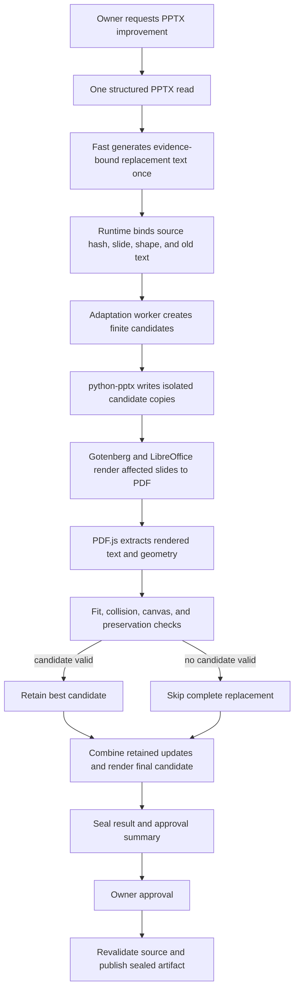

# Resilient PPTX Overlength Adaptation Design

> Language: English | [简体中文](../zh-cn/docs/pptx-overlength-resilience-design.md)

| Field | Value |
|---|---|
| Status | Proposed; design only, not implemented |
| Decision date | 2026-08-13 |
| Immediate scope | Prevent overlength model text from failing a PPTX improvement operation |
| Affected operations | `pptx.update_slide` and `pptx.update_deck` |
| Candidate render stack | Gotenberg, LibreOffice, and PDF.js text geometry extraction |
| Content policy | One Fast generation; no layout prompt, shortening retry, or model-selected geometry |
| Failure policy | Apply a verified subset, or return the unchanged source as a successful no-change result |
| Decision owner | SparkClaw document runtime |

## Executive Decision

SparkClaw will evaluate a bounded, deterministic adaptation and render-check
stage for generated PPTX replacement text. The first release has one product
objective: text that is too long for the source layout must not terminate the
whole PPTX improvement workflow.

Fast continues to select evidence-bound text shapes and generate replacement
text once. Runtime then tries a finite sequence of layout candidates without
asking Fast to shorten or regenerate content. A candidate is accepted only if
structural checks, a qualified LibreOffice render, rendered-text checks, and
OOXML preservation checks pass. If one replacement has no safe candidate, that
replacement is skipped and the other replacements continue. If no replacement
can be applied safely, the operation returns the unchanged source document as a
successful `no_safe_change` result rather than reporting a workflow failure.

This proposal does not revive the rejected ONLYOFFICE DocumentBuilder and
OR-Tools design. The [DocumentBuilder Phase 0 report](../benchmarks/pptx-documentbuilder-phase0-qualification.md)
remains authoritative for that No-Go decision. The candidate stack in this
document has its own mandatory qualification gate and is used only as a render
oracle. It does not become SparkClaw's PPTX writer.

No code, dependency, configuration, prompt, or runtime behavior changes are
authorized by this document alone.

## Problem

The current coordinated updater in
`services/gateway/internal/toolhub/scripts/pptx_slide.py` estimates text width
from character classes and height from a fixed line-height factor. When it
cannot fit a replacement, it raises `PPTXLayoutFitError`. Preflight maps that
condition to `pptx_layout_fit_conflict`, and Workflow gives Fast one semantic
repair attempt with an instruction to shorten or omit the replacement. A
second conflict rejects the workflow before approval.

This behavior has four defects relative to the immediate product requirement:

1. Text capacity is estimated rather than checked through an actual renderer.
2. Layout feasibility is incorrectly routed back to the content model.
3. One infeasible replacement can invalidate every otherwise useful update in
   a slide or bounded deck operation.
4. An inability to improve a document is represented as execution failure even
   though the unchanged source remains a valid, usable PPTX.

Prompt instructions cannot eliminate this failure mode. A model may still
produce longer Chinese wording, add line breaks, choose different punctuation,
or expand a term after a model or sampling change. The runtime must therefore
own fit adaptation and degraded completion.

## Product Invariants

The implementation proposed by this design must preserve all of these
invariants:

- Fast is called once for PPTX semantic generation. Layout conflict never
  creates a second model call.
- Runtime never truncates, summarizes, paraphrases, or deletes part of a
  replacement string. A replacement is applied in full or skipped in full.
- An overlength replacement alone never causes `pptx.update_slide` or
  `pptx.update_deck` to fail.
- The source PPTX is immutable. Every candidate is produced in an isolated job
  directory.
- An edited artifact is published only after render and preservation checks.
- A renderer outage, timeout, nondeterministic result, or unsupported shape
  cannot cause an unchecked candidate to be published.
- The same source bytes, replacement bytes, policy, fonts, and engine versions
  produce the same accepted subset and layout plan.
- Approval describes the exact prepared artifact, applied updates, skipped
  updates, and layout changes. Approval never authorizes a later model retry.
- Existing source identity, evidence binding, scope limits, Policy, audit,
  artifact lineage, and post-edit verification remain in force.

## Goals

- Complete PPTX improvement without workflow failure when generated text is too
  long for one or more source text boxes.
- Use actual rendering in the qualification and acceptance path instead of
  treating character-count heuristics as proof of fit.
- Preserve as many independently safe model updates as possible.
- Keep content generation cost at one Fast call and add no layout context to
  that call.
- Apply only bounded, deterministic formatting and geometry changes.
- Return stable typed outcomes that distinguish full success, partial success,
  safe no-change, and genuine infrastructure or source failure.
- Establish a small first release that can later support richer layout families
  without changing the model/runtime ownership boundary.

## Non-Goals

- General redesign or aesthetic optimization of arbitrary presentations.
- Changing templates, generating new visual structures, or splitting content
  across slides in the first release.
- Asking a vision or language model to grade layout.
- Automatically editing SmartArt, chart-internal text, animation, masters,
  grouped descendants, vertical text, text on paths, or unsupported fields.
- Pixel identity with Microsoft PowerPoint.
- Replacing `python-pptx` as the bounded PPTX mutation layer.
- Providing an embedded human review or online presentation editor.
- Reusing DocumentBuilder, OR-Tools, or the rejected AGPL worker design.

## Supported First-Release Scope

The first release is limited to ordinary editable text shapes in presentations
generated by SparkClaw or admitted by an explicit compatibility fingerprint.

| Category | Initial behavior |
|---|---|
| Ordinary title, body, and caption text boxes | Candidate adaptation and render verification |
| Supported card or band patterns with high-confidence companions | Bounded companion resizing using versioned rules |
| English, Simplified Chinese, and mixed English/Chinese text | Required qualification corpus |
| Tables | Protected; target update is skipped |
| Grouped text | Protected; target update is skipped |
| SmartArt and chart-internal text | Protected; target update is skipped |
| Vertical, rotated, path, or field-bearing text | Protected; target update is skipped |
| Animations, transitions, notes, masters, media, and relationships | Preserved and fingerprint-checked; never implicit mutation targets |
| Unknown or ambiguous companion relationships | Protected; no geometry movement |

The scope is capability based, not file-name based. A slide is supported only
when Runtime can prove that every mutable target and its allowed companions
match a qualified pattern. Unsupported targets degrade to skipped updates and
do not disable independently supported targets.

## Target Architecture



### Component Ownership

| Component | Owns | Must not own |
|---|---|---|
| Fast | Semantic target selection and exact replacement text | Fit retry, font size, coordinates, box dimensions, or skip policy |
| Workflow Runtime | Evidence binding, typed outcomes, Policy, approval, source freshness, artifact promotion, and audit | Text measurement or presentation rendering |
| Adaptation worker | Candidate generation, deterministic ordering, per-update rollback, render orchestration, validation, and diagnostics | Content rewriting, external network access, or approval |
| `python-pptx` mutation layer | Bounded text/style and allowed geometry writes to isolated copies | Declaring rendered fit or viewer compatibility |
| Gotenberg/LibreOffice | Conversion of isolated PPTX candidates to PDF using the pinned font environment | Saving the promoted PPTX or selecting candidates |
| PDF.js checker | Extracting normalized rendered text items and their transform geometry from PDF | Editing PPTX, OCR-based invention, or semantic layout judgment |
| Preservation verifier | OOXML package and normalized semantic allowlists | Repairing an invalid candidate |

Gotenberg is an internal process/API wrapper around the pinned LibreOffice
runtime. It is bound to a private address and receives only job-local files.
The worker does not accept a model-provided renderer URL, arbitrary conversion
option, or path outside its job directory.

## One-Generation Content Contract

The model-visible PPTX projection remains limited to the evidence needed to
select current shapes and produce replacement text. It does not receive:

- candidate dimensions, font steps, renderer output, or layout scores;
- raw PPTX XML, PDF bytes, images, or font metrics;
- instructions to target a character count or retry after fit failure;
- fields that choose adaptation policy or mark an update as mandatory.

Runtime removes `pptx_layout_fit_conflict` from semantic repair eligibility.
Semantic repair may remain for malformed output such as empty replacement text
or an invalid schema, but render or geometry failure cannot trigger it.

The replacement string is immutable after the semantic stage. Adaptation may
change wrapping, paragraph spacing, line spacing, text-box dimensions,
confident companion geometry, and font formatting within policy bounds. It may
not change any code point in the replacement text.

## Candidate Adaptation Policy

### Candidate order

For each supported target, the worker generates a finite, canonical candidate
list in this order:

1. Preserve source geometry and effective font formatting; enable wrapping only
   where the source semantics permit it.
2. Expand the text box along qualified axes into proven free space while
   retaining source alignment anchors.
3. Resize a high-confidence companion background and move only versioned flow
   peers required to preserve containment and spacing.
4. Reduce paragraph-before, paragraph-after, and line spacing within policy
   floors while preserving paragraph and bullet structure.
5. Scale font sizes downward in 0.5 pt steps, preserving relative run-size
   hierarchy, down to the greater of the role floor and the configured source
   ratio floor.
6. Apply bounded combinations of steps 2 through 5 in canonical order.

The initial qualification values are proposals, not production defaults:

| Role | Proposed absolute floor | Proposed relative floor |
|---|---:|---:|
| Title | 18 pt | 80% of source effective size |
| Body | 12 pt | 75% of source effective size |
| Caption | 9 pt | 75% of source effective size |

Owner-corpus qualification may raise these floors. It must not lower them
silently. A policy revision is required for any change.

### Font handling

Font scaling is allowed only when the effective sizes can be resolved without
flattening formatting. For a text shape with multiple explicit run sizes, one
ratio is applied to every size and the relative hierarchy is preserved. If the
effective font is inherited, mixed in an unsupported way, substituted by the
renderer, or below the readable floor, font-scaling candidates are omitted.

Candidate generation never depends on a model estimate, wall-clock race, map
iteration order, or renderer-dependent auto-correction saved back into the
PPTX.

### Geometry handling

All coordinates use integer EMU values and versioned rounding. A mutable region
must stay within the slide safe area and must not cross protected shapes.
Companion movement is allowed only for patterns whose containment, alignment,
order, and spacing relationships passed the compatibility corpus. Unknown
objects are obstacles, not layout opportunities.

The first release does not move content to another slide and does not create a
new slide. Those behaviors require a later design because they change narrative
structure and approval scope.

## Render And Acceptance Contract

Rendering is an admission check, not a mutation source. LibreOffice never saves
the promoted PPTX. The candidate PPTX written by SparkClaw is rendered to PDF,
and PDF.js reads the resulting page text content and geometry.

A candidate is valid only when all applicable checks pass:

1. The candidate reopens through the normal PPTX reader.
2. The exact normalized replacement text is present in rendered text order with
   no missing prefix, suffix, or internal segment.
3. Every matched rendered text item is inside the candidate's allowed text
   region within a qualified tolerance.
4. Rendered bounds stay inside the slide canvas.
5. Changed text and mutable companion geometry introduce no protected-shape
   intersection under the versioned collision rules.
6. The effective rendered font is available from the pinned font manifest; an
   unqualified substitution invalidates the candidate.
7. The PDF page is nonblank, has the expected dimensions, and produces stable
   normalized text and geometry across repeat renders.
8. The output PPTX contains the exact requested text and expected geometry.
9. Package and semantic preservation allowlists report no unrelated mutation.

PDF text extraction is not assumed to prove clipping merely because text exists
in the PDF content stream. Phase 0 must explicitly test clipping, crop, glyph
transform, bullet, soft-break, CJK, and font-substitution cases. If the stack
cannot distinguish a visible complete string from clipped or hidden text with
zero false negatives on the admitted corpus, the proposal is No-Go. OCR is not
an acceptance fallback.

LibreOffice and Microsoft PowerPoint can render the same PPTX differently. The
runtime guarantee is therefore limited to the qualified LibreOffice/font
environment and the compatibility corpus. Phase 0 also compares samples in the
current PowerPoint reference viewer; unsupported or divergent patterns are
excluded rather than advertised as safe.

## Partial-Application Algorithm

Each slide is processed independently inside one deck job:

1. Validate every requested update against frozen source evidence.
2. Classify unsupported targets as `unsupported_target` skips before mutation.
3. Generate and render candidates for each remaining update in isolation.
4. Select the lowest-change valid candidate for each update.
5. Combine selected candidates for a slide and render the combined result.
6. If the combination fails, build conflict components from shared companions,
   changed geometry, and failed collision checks.
7. For a conflict component of at most eight updates, enumerate subsets and
   maximize applied update count, then minimize font reduction, geometry
   movement, spacing change, and finally stable shape reference.
8. For a larger component, use the same objective with a bounded deterministic
   elimination order. Record that bounded path in diagnostics.
9. Re-render the final selected subset for the slide.
10. Assemble all accepted slides, then run one final whole-output reread and
    preservation check.

This algorithm does not require OR-Tools. The candidate and conflict bounds are
small, versioned, and covered by a hard job deadline. A timeout skips the
affected unresolved component; it does not publish an unchecked candidate and
does not fail independently verified updates.

An exact-span replacement remains atomic even if it crosses runs. A deck update
is no longer all-or-nothing for fit conflicts, but it remains atomic at file
publication: SparkClaw publishes one verified PPTX or no edited PPTX.

## Typed Outcomes And Failure Semantics

The operation result must separate business degradation from execution failure.

| Status | Meaning | User-visible artifact |
|---|---|---|
| `completed` | Every requested update passed | Verified edited PPTX |
| `completed_with_skips` | At least one update passed and at least one was skipped | Verified edited PPTX plus skip summary |
| `no_safe_change` | No update could be applied safely | Original PPTX reference; no misleading edited copy |
| `source_invalid` | Source is unreadable, stale, corrupt, or violates format policy | No new artifact; explicit source error |
| `runtime_unavailable` | Required qualified renderer/worker is unavailable before any safe result can be established | Original PPTX reference plus explicit temporary capability status |

`completed_with_skips`, `no_safe_change`, and `runtime_unavailable` are terminal
Workflow completions, not semantic-generation retries. They must not be mapped
to `semantic_output_invalid` or generic model failure.

Each skipped update has one stable reason code:

| Reason code | Meaning |
|---|---|
| `unsupported_target` | Shape or companion pattern is outside qualified scope |
| `no_fitting_candidate` | Every bounded candidate overflowed or violated readability |
| `combined_layout_conflict` | The update fit alone but not with higher-ranked compatible updates |
| `font_unavailable` | Required effective font was absent or substituted |
| `render_unverifiable` | Rendered text/geometry could not be proven complete |
| `component_timeout` | The bounded candidate/conflict search reached its deadline |

Human-readable copy is derived from these typed fields. Runtime and tests never
branch on localized display strings.

## Prepared Artifact And Approval

Candidate work can be more expensive than the existing heuristic preflight.
The accepted result must therefore be prepared once before approval and stored
as a sealed temporary artifact containing:

- source SHA-256 and normalized source identity;
- exact applied and skipped update references and text hashes;
- policy, worker, LibreOffice, Gotenberg, PDF.js, and font-manifest versions;
- candidate-plan digest and final PPTX SHA-256;
- normalized render-check digest and preservation result;
- expiry, job owner, and approval binding.

Approval shows counts and layout changes without exposing full document text in
logs. After approval, Runtime revalidates the source hash, prepared artifact
hash, policy version, owner, and expiry, then atomically promotes the sealed
artifact. It does not call Fast, rerun adaptation, or ask LibreOffice to save
the file.

If the source changes or the sealed artifact expires, Runtime reports a stale
prepared result and requires a new owner operation. It never silently reuses a
layout decision against changed content.

## Worker Protocol Sketch

The protocol below is illustrative and must be finalized as typed Go and JSON
contracts before implementation.

### Request

```json
{
  "schema_version": "sparkclaw.pptx_adaptation.request.v1",
  "request_id": "opaque-id",
  "source": {
    "input_path": "/job/input.pptx",
    "sha256": "hex"
  },
  "updates": [
    {
      "slide_ref": "ppt/slides/slide3.xml",
      "shape_ref": "cNvPr:17",
      "expected_text_sha256": "hex",
      "replacement_text": "Exact Fast output"
    }
  ],
  "policy_id": "sparkclaw.pptx_adaptation.v1",
  "limits": {
    "max_slides": 12,
    "max_shapes": 64,
    "max_candidates_per_shape": 16,
    "deadline_ms": 90000
  }
}
```

The Gateway supplies job paths and runtime bindings. Model output never supplies
package references, hashes, policy identifiers, limits, or renderer settings.

### Result

```json
{
  "schema_version": "sparkclaw.pptx_adaptation.result.v1",
  "request_id": "opaque-id",
  "status": "completed_with_skips",
  "source_sha256": "hex",
  "output_sha256": "hex",
  "plan_digest": "hex",
  "applied": [
    {
      "slide_ref": "ppt/slides/slide3.xml",
      "shape_ref": "cNvPr:17",
      "candidate_id": "font-0.5",
      "layout_changes": []
    }
  ],
  "skipped": [
    {
      "slide_ref": "ppt/slides/slide3.xml",
      "shape_ref": "cNvPr:22",
      "reason": "no_fitting_candidate"
    }
  ],
  "checks": {
    "rendered_text_complete": true,
    "inside_canvas": true,
    "new_protected_overlap": false,
    "preservation": true
  },
  "artifacts": {
    "prepared_output_path": "/job/prepared.pptx"
  },
  "engine": {
    "policy": "sparkclaw.pptx_adaptation.v1",
    "font_manifest_sha256": "hex"
  }
}
```

Unknown fields are rejected in v1. Stdout has a fixed byte limit, human logs go
to stderr, full replacement text is excluded from logs, and every returned path
must resolve beneath the job directory. The Gateway independently computes all
artifact hashes.

## Phase 0: Mandatory Qualification

No production dependency or code path is added until the candidate renderer and
checker pass Phase 0 on the target Linux ARM64 deployment environment.

| Capability | Qualification test | Pass condition |
|---|---|---|
| Native deployment | Run pinned Gotenberg, LibreOffice, and PDF.js artifacts on DGX Spark | Native ARM64 execution, declared dependencies, and successful health checks |
| Text completeness | Render deliberately fitting and clipped Latin, CJK, and mixed strings | Every clipped, hidden, cropped, or missing segment is rejected; zero false negatives in corpus |
| Geometry | Compare PDF.js transforms with known text boxes, rotations, margins, and line breaks | Stable normalized bounds within documented tolerance for supported patterns |
| Font determinism | Exercise production fonts plus missing-font cases | Exact font manifest is recorded; substitution is detected and rejected |
| Render repeatability | Render each fixture 100 times | Identical normalized text/geometry digest and stable raster digest under documented normalization |
| PowerPoint compatibility | Compare accepted outputs in current Microsoft PowerPoint | No visible clipping, repair prompt, missing text, or unsupported divergence in admitted corpus |
| Writer preservation | Apply candidates through the existing mutation layer | Only target text and declared formatting/geometry parts change |
| Partial application | Mix fitting, overlength, unsupported, and conflicting updates | Valid subset is deterministic; no single fit conflict fails the operation |
| No-safe-change | Make every update unsupported or infeasible | Returns original source with `no_safe_change`, no edited artifact, and no model retry |
| Renderer outage | Stop or hang conversion during a job | No unchecked output; bounded terminal degradation and full process cleanup |
| Cancellation | Cancel an oversized job | Whole process tree stops within two seconds and job files are removed |
| Confidentiality | Inspect logs, traces, and request failures | No full document text, PDF bytes, or arbitrary host paths leak |

The qualification corpus must contain owner decks with irreversible private-text
replacement and synthetic boundary fixtures. It must cover 16:9 and 4:3,
English, Simplified Chinese, mixed text, bullets, multiple paragraphs, soft
breaks, explicit run formatting, custom and missing fonts, AutoFit settings,
ordinary cards/bands, nearby images, tables, groups, charts, notes, masters,
animations, and intentionally corrupt inputs.

Any failure in native deployment, text completeness, deterministic rendering,
PowerPoint compatibility for the admitted patterns, preservation, or safe
outage behavior makes the proposal No-Go. A failed gate produces a bilingual
qualification report only. It does not permit a character heuristic, OCR, model
review, or prompt retry to substitute for the failed capability.

## Rollout Plan

| Phase | Work | Exit gate |
|---|---|---|
| 0. Renderer qualification | Build fixtures and test the pinned render/check stack without SparkClaw integration | Every mandatory qualification row passes |
| 1. Single-shape worker | Implement immutable text, bounded candidates, render checks, preservation, and typed skips for one supported shape | No overlength case fails Workflow; deterministic 100-run corpus |
| 2. Single-slide subset | Add isolated candidates, combination checks, conflict components, and sealed prepared artifacts | Mixed valid/invalid updates return the maximal deterministic safe subset |
| 3. Bounded deck | Extend the same behavior to current deck limits and final whole-output verification | Partial success and no-safe-change E2E paths pass under approval and file backends |
| 4. Canary | Enable only for allowlisted owners and qualified presentation fingerprints | Zero unchecked output, source mutation, model layout retry, or unexplained render drift |
| 5. Legacy retirement | Remove layout-specific semantic repair and stop treating character estimates as fit authority | Canary evidence retained and rollback tested |

Each phase is independently revertible. The legacy path stays available behind
one operator-owned mode switch during canary, but the model cannot select the
mode. Rollback restores the old implementation; it does not merge outputs from
two engines.

## Time And Resource Budget

The design trades local compute for removal of a second model call and removal
of fit-related workflow failure. Phase 0 must measure actual numbers before
production limits are fixed.

The intended runtime controls are:

- render only affected slides, not the full deck, during candidate search;
- keep one warm, bounded conversion service instead of spawning LibreOffice for
  every candidate;
- cache render measurements only inside one job using source, candidate, font,
  and engine digests;
- cap candidates per shape, conflict component size, PDF bytes, page count,
  worker concurrency, and total deadline;
- perform one final render per affected slide after subset selection;
- perform zero additional model calls and add zero layout tokens.

The phase report must record median, p95, and worst-case time for single-shape,
single-slide, and bounded-deck cases; peak memory; conversion queue time; number
of renders; and skip rate. Latency limits are product decisions made from this
evidence, not guessed in the implementation.

## Security, Licensing, And Operations

- Pin every container, binary, Node package, Python package, and font by version
  and digest. Do not download `latest` at runtime.
- Review and ship the exact upstream licenses and notices for Gotenberg,
  LibreOffice, PDF.js, fonts, and transitive packages before distribution.
- Keep the conversion service private, authenticated at the process/network
  boundary, and unable to fetch arbitrary URLs.
- Apply input, output, page, memory, CPU, concurrency, and wall-clock limits.
- Root worker and conversion processes in cancellable Gateway ownership and
  expose shutdown cleanup. No orphaned LibreOffice process is permitted.
- Mount job input read-only where possible and give the renderer a fresh
  temporary profile per bounded worker slot.
- Exclude document text and rendered pages from ordinary logs. Diagnostic
  renders are opt-in qualification artifacts with owner-scoped retention.
- Extend setup, doctor, deployment, and Compose validation only after Phase 0
  returns Go.

This document does not make a legal conclusion about combining or distributing
the candidate components. The pinned artifacts and actual deployment topology
must receive a license review before implementation ships.

## Observability

For every adaptation job, audit records include:

- request, source, policy, plan, output, font-manifest, and engine digests;
- counts of requested, supported, applied, skipped, and rendered candidates;
- per-reason skip counts without replacement text;
- conversion attempts, cache hits, and timing by stage;
- final typed outcome and approval/prepared-artifact identity;
- timeout, cancellation, renderer-health, and cleanup results.

Metrics must distinguish model output invalidity, source invalidity, unsupported
layout, no fitting candidate, render uncertainty, preservation failure, and
infrastructure outage. A generic `PPT modification failed` counter is not
sufficient to operate this feature.

## Acceptance Criteria

The first production release is accepted only when:

1. Arbitrarily long generated strings cannot produce a fit-related Workflow
   failure or crash.
2. Fit conflict causes zero additional Fast calls and zero layout-specific
   prompt tokens.
3. Every published edited PPTX passes exact-text, render, canvas, collision,
   reread, and preservation checks.
4. An infeasible update is skipped atomically without truncating its text.
5. Other independently safe updates remain applied.
6. When all updates are skipped, the owner retains the unchanged source and
   receives a typed `no_safe_change` result.
7. Unsupported content is never moved or rewritten implicitly.
8. The admitted corpus has zero overflow false negatives and zero undeclared
   package changes.
9. One hundred identical runs produce the same status, accepted subset, plan
   digest, normalized render digest, and output digest.
10. Renderer outage and cancellation leave no output, temporary file, or orphan
    process and complete within the documented bound.

## Deferred Evolution

After this narrow reliability objective is proven, later designs may consider
template switching, slide splitting, broader companion graphs, aesthetic
scoring, new-slide generation, PowerPoint-native validation, or an embedded
review UI. Those capabilities must not be added implicitly to this rollout.

The durable boundary is expected to remain: models own content and intent;
Runtime owns deterministic feasibility, rendering evidence, degradation,
approval, and artifact publication.

## References

- [Document workflows](document-workflows.md)
- [Rejected deterministic PPTX layout runtime design](pptx-deterministic-layout-runtime-design.md)
- [DocumentBuilder Phase 0 qualification](../benchmarks/pptx-documentbuilder-phase0-qualification.md)
- [Gotenberg](https://github.com/gotenberg/gotenberg)
- [LibreOffice core](https://github.com/LibreOffice/core)
- [PDF.js](https://github.com/mozilla/pdf.js)
