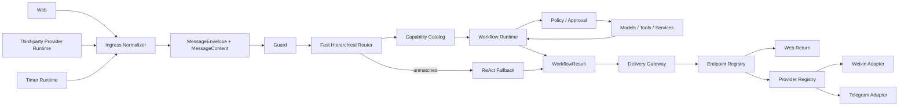

# SparkClaw Overall Agent Architecture

> Language: English | [简体中文](../zh-cn/docs/router-first-agent-workflow-architecture.md)

Status: accepted architecture baseline, implementation started 2026-07-16.
This document defines the complete system abstraction and ownership boundaries.
It intentionally does not define how an individual Workflow arranges steps,
retries, branches, or tools. Those details belong in later Workflow-specific
designs.

## Implementation Status

Phase 1 established the contracts that later migrations depend on:

- channel-neutral `MessageEnvelope`, multimodal `MessageContent`,
  `RouteDecision`, `WorkflowResult`, and delivery contracts live in
  `internal/app`;
- `internal/messageplane` normalizes current Web and provider-backed sessions
  into that message contract before Guard or intent handling;
- `internal/capability` owns the versioned default capability tree and rejects
  stale, invented, or invalid Fast routing paths edge by edge;
- the Agent entry point consumes the normalized routing projection and audits
  the envelope schema and capability catalog revision.

Phase 2 completes the first production vertical slice:

- Catalog revision 2 exposes exactly `browser.search`,
  `browser.automation`, `document.information`, and `document.processing`;
- every message is classified by the Fast router against that tree before
  execution, with a strict tool-neutral response schema;
- the Workflow Registry resolves an exact versioned contract, the Dispatcher
  persists the route and return context, and Tool Exposure materializes only
  the selected Workflow's registered tools;
- browser and document approval/login resumes reuse the persisted route and
  Workflow identity rather than classifying the message again;
- only `unmatched` enters the transitional ReAct path. A known route that is
  stale, invalid, blocked, or fails execution returns an explicit
  `WorkflowResult` and never falls back.

Reminder scheduling, Endpoint/Provider abstraction, and result delivery are
separate parallel migrations. They remain outside this vertical slice and do
not require changes to the Store interface or connector implementations here.

## Architecture Decision

SparkClaw is a message-driven system with one primary path:

```text
Message Source
  -> Ingress Normalization
  -> MessageEnvelope
  -> Guard
  -> Fast Hierarchical Router
  -> Capability Leaf
  -> Workflow
  -> WorkflowResult
  -> Delivery Gateway
  -> Return Endpoint
```

The Agent is a traffic controller. The Fast model recognizes intent against a
registered capability tree and selects a path. It does not select tools or
design execution steps.

A matched capability starts its registered Workflow. ReAct is the final
fallback only when no capability matches. A failed matched Workflow never
falls back to ReAct.

Web, third-party devices, and timers are peer message sources. Text, image,
audio/voice, and file are message content kinds, not business capabilities.
Explicit sends and ordinary Workflow results use the same delivery path.

## System Model

```text
SparkClaw
  Interface Plane
    Web Runtime
    Third-party Provider Runtime
    Timer Runtime

  Message Plane
    Ingress Normalizer
    MessageEnvelope
    Multimodal MessageContent

  Message Control Plane
    Endpoint Registry
    Schedule Registry
    Return Route Resolver

  Agent Control Plane
    Guard
    Fast Hierarchical Router
    Capability Catalog
    Workflow Registry
    Workflow Dispatcher
    ReAct Fallback

  Execution Plane
    Workflow Runtime
    Model Runtime
    Tool and Service Registry
    Policy and Approval

  Result Plane
    WorkflowResult
    Result Presenter
    Delivery Gateway

  Foundation Plane
    State Store
    Event and Work Queue
    Artifact Store
    Credential Vault
    Audit, Trace, Metrics
```

## End-To-End Topology



## Layer Responsibilities

| Layer | Owns | Must not own |
|---|---|---|
| Interface | Web input, provider connections, timer firing | intent or business execution |
| Message | normalized source, multimodal content, return context | provider-native payloads or tools |
| Message Control | Endpoints, schedules, return routes | provider protocol implementation |
| Agent Control | guard, hierarchical routing, capability and Workflow selection | Workflow internals or tool execution |
| Execution | Workflow runs, models, tools, services, Policy, approval | message transport or provider branching |
| Result | channel-neutral result, rendering, delivery routing | business goal reinterpretation |
| Foundation | durable state, queueing, artifacts, secrets, observability | product routing decisions |

## Interface Plane

The Interface Plane has three peer source kinds:

```text
message_source
  web
  third_party_device
  timer
```

### Web Runtime

Web Runtime accepts owner messages and exposes run, approval, and result state.
It creates a Web Endpoint for return routing. Web-specific streaming and UI
rendering remain outside the Agent Control Plane.

### Third-Party Provider Runtime

Third-party devices are represented by provider-neutral Endpoints. Weixin,
Telegram, and future systems are adapters below one Provider Registry.

Provider Runtime owns protocol connection, binding, credentials, polling or
webhooks, inbound acknowledgement, content download/upload, retry, health, and
shutdown. Core layers see only normalized messages, Endpoint references, and
provider receipts. They never branch on provider names.

### Timer Runtime

Timer Runtime is a message producer, not a reminder engine. At the scheduled
time it publishes a stored message into the same work queue as Web and
third-party input. It never runs domain logic in its polling loop.

## Message Plane

All sources produce one `MessageEnvelope` abstraction:

```text
MessageEnvelope
  identity and idempotency
  source context
  owner and acting principal
  MessageContent
  ReturnRoute
  authorization context
  optional Schedule reference
```

`MessageContent` is an ordered list of canonical Parts:

```text
MessageContent
  text
  image
  audio
  file
```

Voice is an audio Part with a `voice_note` disposition. Speech transcription
is an ingress derivation that adds a text Part linked to its source audio. It is
not an Agent capability.

Ingress adapters validate and normalize content. Text remains bounded text;
binary content becomes governed Artifact references. Raw bytes, provider
attachment objects, credentials, and unrestricted provider metadata never
enter routing or Workflow state.

The same `MessageContent` contract is used for input, explicit sends,
Workflow results, and returned messages. Unsupported output Parts must fail
explicitly or use a declared safe transformation; they are never silently
dropped.

## Message Control Plane

The Message Control Plane manages addressability and future message creation.
Its peer resources are:

```text
message_control
  Endpoint Registry
    Web Endpoint
    Third-party Device Endpoint

  Schedule Registry
    One-time Schedule
    Recurring Schedule

  Return Route Resolver
```

An Endpoint contains stable identity, owner, kind, provider/binding references,
supported content and delivery capabilities, status, and credential reference.
Credentials remain in the Credential Vault.

A Schedule contains trigger rules, a versioned message payload, a return
Endpoint, expected capability family, and authorization context. It does not
contain browser, file, or other domain implementation details.

The Return Route Resolver decides whether a result returns to the source Web
Endpoint, the source third-party Endpoint, an explicitly selected Endpoint, or
nowhere.

## Agent Control Plane

### Capability Catalog

The catalog is a versioned tree of user-visible product capabilities:

```text
capability
  browser
    search
    automation

  document
    information
    processing
```

Text, image, audio, and file do not appear as modality branches. They are
message parts. For example, an audio request can route to browser search
through its transcript, while a file reference can be a typed slot for a
document Workflow.

Each internal node defines only its children and routing description. Each
leaf identifies a Workflow contract. The catalog does not define tools.

### Fast Hierarchical Router

Fast routes through registered parent-child relationships. It may return a
multi-level path in one call, but the path is validated edge by edge.

Router output is limited to:

```text
route status: matched | clarify | unmatched | blocked
capability path
typed slots
confidence
deterministic facts
```

The Router cannot return tool names, Workflow steps, approval decisions, or
new capability IDs. Ambiguity or missing required information produces a
clarification result.

### Workflow Registry And Dispatcher

The Workflow Registry maps a capability leaf to a versioned Workflow contract.
The Dispatcher persists a new run and invokes that Workflow. It does not
reinterpret the message.

The current revision uses an exact one-to-one mapping:

| Capability leaf | Workflow | Fixed tool boundary |
|---|---|---|
| `browser.search` | `browser.search@1` | `web.search`, `browser.read` |
| `browser.automation` | `browser.automation@1` | registered browser status, tab, navigation, inspection, screenshot, wait, and interaction tools |
| `document.information` | `document.information@1` | `files.search`, `files.read`, `pdf.extract_text` |
| `document.processing` | `document.processing@1` | registered document information, write, Office/PDF transform, and governed delete tools |

Tool names are ToolHub registration metadata, not router output. The
Dispatcher does not search for a “close enough” Workflow, and legacy Workflow
IDs fail closed instead of being reinterpreted as one of these leaves.

At the overall architecture level, a Workflow is only this boundary:

```text
normalized MessageEnvelope + validated RouteDecision
  -> Workflow
  -> WorkflowResult or resumable waiting state
```

Workflow graph shape, step types, internal model calls, argument binding,
parallelism, retry, compensation, and completion rules are deliberately
deferred to Workflow-level designs. They may evolve without changing the
overall architecture as long as the boundary remains stable.

### ReAct Fallback

ReAct receives only messages whose routing status is `unmatched`. It has a
separate fixed capability and Policy boundary. It cannot recover a failed known
Workflow, schedule arbitrary actions, or widen itself from observations.

## Execution Plane

Workflow Runtime consumes abstract execution ports:

- Model Runtime for bounded model calls;
- Tool and Service Registry for registered capabilities;
- Policy for exact authorization;
- Approval for visible human confirmation;
- Artifact Store for governed binary and large outputs;
- State Store for run persistence and resume.

The overall architecture requires tool access to remain bounded by the selected
Workflow and rechecked by Policy. It does not prescribe how a Workflow orders
those calls.

## Result And Delivery Plane

Every Workflow produces one channel-neutral `WorkflowResult` containing:

```text
status
capability path and Workflow identity
structured result data
MessageContent
citations and references
ReturnRoute
resume or error state
```

The Result Presenter may format content but cannot change execution status or
call tools. User-visible text, images, voice/audio, and files must be present as
Message Parts.

In the target architecture, explicit sends and normal Workflow result returns
both create a `DeliveryRequest` and enter the Delivery Gateway.

The Delivery Gateway resolves the target Endpoint and chooses only between:

- Web delivery through persistence and Web events/streaming;
- third-party delivery through the Endpoint's registered Provider adapter.

Only Provider Runtime distinguishes Weixin from Telegram. Execution success and
delivery success are separate states.

## Primary Flows

### Direct Message

```text
Web or third-party input
  -> normalize MessageEnvelope and MessageContent
  -> Guard
  -> Fast route to capability leaf
  -> run registered Workflow
  -> produce WorkflowResult
  -> resolve ReturnRoute
  -> return to Web or third-party Endpoint
```

### Scheduled Message

```text
User message
  -> create a Schedule through the Message Control Plane
  -> store Schedule(message payload, trigger, ReturnRoute, authorization)

Timer fires
  -> publish timer-sourced MessageEnvelope
  -> same Guard and Fast routing path
  -> Workflow
  -> WorkflowResult
  -> Schedule ReturnRoute
  -> Web or third-party Endpoint
```

Scheduled payloads have two modes:

- `literal`: send the stored multimodal content unchanged;
- `request`: route the stored content as a new Agent request.

This makes scheduling reusable for browser, document, future capabilities,
and direct text/image/audio/file delivery without adding timer-specific logic
to a domain Workflow.

## Foundation Plane

The Foundation Plane provides implementation-neutral infrastructure:

- State Store for messages, Endpoints, schedules, runs, approvals, and
  delivery attempts;
- Event and Work Queue for decoupled ingress, timer firing, execution, and
  delivery;
- Artifact Store for binary content and large observations;
- Credential Vault for Provider and external-service secrets;
- Audit, Trace, and Metrics for every boundary transition.

All slow Workflow execution runs in bounded workers, never in provider polling
or scheduler loops. Idempotency covers inbound messages, schedule occurrences,
Workflow runs, and deliveries.

## Dependency Direction

```text
Provider Adapters -> Interface and Message contracts
Web Runtime       -> Interface and Message contracts
Timer Runtime     -> Message Control and Message contracts
Router            -> Capability Catalog and Message contracts
Dispatcher        -> Workflow Registry and State ports
Workflows         -> Execution ports and Result contracts
Delivery Gateway  -> Endpoint Registry and Provider ports
Infrastructure    -> implements storage, queue, artifact, secret, and telemetry ports
```

Core contracts never import a concrete Provider, Workflow, tool, or storage
backend. Adding one implementation must not require switches in unrelated
layers.

## Cross-Cutting Governance

- Guard runs before routing and execution.
- External, file, browser, and provider content remains untrusted data.
- Policy and approval remain authoritative for direct and scheduled work.
- Scheduled execution rechecks current authorization at every occurrence.
- Provider credentials and raw payloads stay inside Provider Runtime and the
  Credential Vault.
- A matched capability failure is explicit and never becomes `unmatched`.
- Result delivery never changes the business result.
- Resume uses persisted route and Workflow identity rather than reinterpreting
  the original message.

## Extension Model

| Extension | Required architecture work |
|---|---|
| New business capability | add a catalog leaf and registered Workflow contract |
| New third-party platform | add one Provider adapter and Endpoint capability declaration |
| New message content kind | extend MessageContent plus ingress, Web rendering, Provider conformance, and delivery negotiation |
| New scheduled behavior | extend Schedule control contracts, not domain Workflows |
| New tool or service | register an execution port implementation and Policy metadata |
| New state backend | implement Foundation storage ports |

## Deferred Detailed Designs

The following are intentionally not fixed by this document:

- Workflow DSL, DAG/state-machine shape, node types, branching, retries,
  parallelism, compensation, and result assessment;
- exact Fast prompts, model thresholds, and decision-corpus format;
- detailed MessagePart schemas, size limits, retention, and transformations;
- individual Weixin, Telegram, Web, speech, browser, file, and tool adapters;
- database tables, HTTP APIs, deployment topology, and migration sequence.

Each can receive a focused design later without changing the system layers or
their dependency direction.

## Architecture Acceptance

The overall architecture is valid when:

- every source creates the same normalized message contract;
- the capability tree is the only Fast routing vocabulary;
- every matched leaf resolves one Workflow contract;
- Workflow internals cannot widen their declared execution boundary;
- ReAct is reached only by unmatched messages;
- explicit sends and Workflow results share one delivery path;
- Web and third-party returns are selected by Endpoint kind;
- Timer produces messages instead of running domain logic;
- multimodal content is orthogonal to business capabilities;
- concrete Providers and infrastructure backends remain replaceable behind
  their ports.
