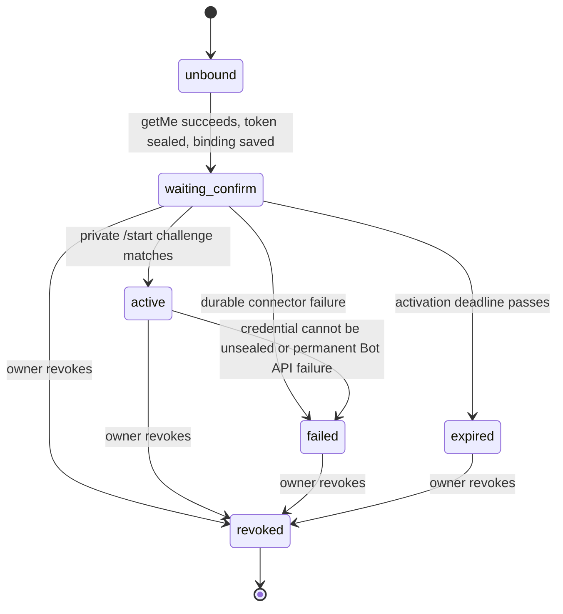

# Telegram Bot Integration Design

> Language: English | [简体中文](../zh-cn/docs/telegram-integration-design.md)

> Status: normative hardening contract. The repository baseline before this work has Weixin notification bindings but no production Telegram connector. Code from `codex/wip-snapshot-20260714` must be restored selectively and is not evidence of completion. Platform constraints were rechecked against the official Telegram Bot API and Bot FAQ on 2026-07-14.

## 1. Scope And Product Boundary

Telegram is a transport adapter for the existing SparkClaw Agent Runtime. It does not create another runtime, policy engine, approval system, workspace, or speech service.

The first supported scope is:

- one private Telegram chat owned by one SparkClaw owner per active binding;
- an owner-created bot token entered in WebChat and verified with `getMe`;
- inbound text, photos, supported documents, audio attachments, and voice notes;
- outbound text, workspace-confined files and images, typing state, reminders, and approval prompts;
- long polling, durable inbox processing, bounded global concurrency, and per-chat ordering;
- local voice transcription through a connector-neutral interface;
- no group, supergroup, channel, Business, inline, payment, public multi-tenant, webhook, TTS, or real speech sidecar work in this branch.

After authorization and normalization, inbound content enters the same `agent.Runtime.HandleMessageWithAttachments` path as WebChat and Weixin. Weixin behavior must remain unchanged.

## 2. Current Baseline And Selective Recovery

The current branch starts from these facts:

- `NotificationBinding` and the binding API are implemented for Weixin.
- `CredentialSecret.Value` is currently stored by memory, file snapshot, and PostgreSQL without a connector-specific encryption boundary.
- WebChat reads notification channel configuration, but it has no authoritative connector capability model.
- The WIP snapshot mixes Telegram with a WebChat voice feature and a concrete speech package. Only Telegram-relevant code may be recovered.

The implementation must therefore land in separate topics:

1. this bilingual design and acceptance contract;
2. connector capability and binding API semantics;
3. encrypted credential vault;
4. channel-neutral store records and durable inbox parity;
5. Telegram client, binding, polling, workers, media, approvals, reminders, and recovery;
6. WebChat interaction and narrow-screen behavior;
7. Docker FFmpeg declaration and verification.

No concrete speech implementation, WebChat microphone capture, speech API route, or speech sidecar belongs in this work line.

## 3. Official Telegram Constraints

The implementation treats Telegram limits as an outer boundary and may configure stricter SparkClaw limits.

| Area | Telegram behavior | SparkClaw contract |
|---|---|---|
| Authentication | Bot methods use a token-bearing Bot API URL. | A dedicated client constructs the URL internally. URLs, errors, logs, traces, and metrics must never contain the token. |
| Updates | `getUpdates` and webhooks are mutually exclusive. Updates are retained for at most 24 hours. | Use one long poller per active credential and no webhook in this phase. |
| Offset | An update is confirmed when a later `getUpdates` uses an offset greater than its `update_id`. | Persist every update or confirm it already exists before persisting `next_offset=max(update_id)+1`. |
| Batch | `getUpdates` accepts 1-100 updates and should use a positive timeout for long polling. | Default to 100 updates, 30-second poll timeout, and an HTTP deadline longer than the poll timeout. |
| Download | Cloud `getFile` downloads are limited to 20 MB and returned file paths are temporary. | Reject declared oversize input and enforce a streaming byte cap no greater than 20 MB. |
| Upload | Photos are at most 10 MB; general files, audio, and voice are currently at most 50 MB. | Validate before opening the request body; use `sendDocument` when an image is valid but not photo-compatible. |
| Text | `sendMessage` accepts at most 4096 characters after entity parsing. | Send plain text and split below 4096 runes with stable ordering. |
| Flood control | API errors can include `retry_after`. | Honor `retry_after`; otherwise use bounded exponential backoff only for transient failures. |
| Callback query | Telegram clients wait until `answerCallbackQuery` is called. | Authenticate and acknowledge promptly, then resolve the approval idempotently. |

Official references: [Bot API](https://core.telegram.org/bots/api) and [Bot FAQ](https://core.telegram.org/bots/faq).

## 4. Connector Capability Semantics

Gateway, not WebChat, decides whether Telegram can be configured. The public config response exposes a connector summary that contains no secret:

```json
{
  "channel": "telegram",
  "provider": "telegram-bot-api",
  "available": true,
  "operator_enabled": true,
  "binding_status": "unbound",
  "startable": true,
  "disabled_reason": ""
}
```

The fields have distinct meanings:

| Field | Meaning |
|---|---|
| `available` | This Gateway binary recognizes the provider and has constructed the connector dependencies. It is not a configuration switch. |
| `operator_enabled` | The single operator kill switch from `tools.notifications.channels.telegram.enabled`. It blocks new binding, polling, inbound processing, and outbound delivery when false. |
| `binding_status` | Aggregate state of the owner's current Telegram binding: `unbound`, `waiting_confirm`, `active`, `failed`, `expired`, or `revoked`. It never reports connector availability. |
| `startable` | Server-computed permission to call the start endpoint now. The POST endpoint recomputes the same decision. |
| `disabled_reason` | Stable machine code explaining `startable=false`, empty otherwise. The UI maps codes to localized copy. |

Disabled reason precedence is `connector_unavailable`, `operator_disabled`, `credential_key_unavailable`, `binding_in_progress`, then `binding_active`. The default distribution keeps Telegram off so the minimal runtime has no connector side effects or credential requirement. Operators enable it with the one kill switch; without a binding, an enabled connector performs no Telegram request.

An operator-disabled connector does not make `/readyz` fail. A configured active binding whose credential cannot be decrypted is visible as degraded connector state and does not start a poller.

## 5. Binding State Machine

The virtual `unbound` state is not persisted. Persisted binding statuses are `waiting_confirm`, `active`, `failed`, `expired`, and `revoked`. Token verification is request-local and is not a durable `verifying` state.



Start flow:

1. WebChat sends the token only in `POST /api/notification-bindings/telegram/start`.
2. Gateway checks connector `startable` and validates request size and token syntax without echoing the token.
3. Gateway calls `getMe` with a bounded client. A failed or invalid `getMe` creates no binding and stores no secret.
4. Gateway generates a high-entropy one-time activation challenge and stores only its hash and expiry.
5. Gateway seals the verified token in the credential vault and receives a random `credential_ref` that contains no token fragment or bot identity.
6. Gateway saves a `waiting_confirm` binding containing only `credential_ref`, verified bot ID/username, challenge hash, base URL, and expiry. If binding persistence fails, it deletes the newly stored credential.
7. Gateway returns a `t.me/<bot>?start=<challenge>` activation URL. The challenge is returned only on this start response and is not later listed.
8. Only a private `/start <challenge>` update can activate the binding. A random user who messages the public bot cannot claim it.
9. Activation atomically records Telegram user ID, chat ID, optional thread ID, and clears the challenge hash.

Revocation is idempotent: stop polling and delivery, mark the binding `revoked`, delete its credential, cancel pending inbox work, and retain only redacted audit history. Restart reconstructs pollers only for eligible `waiting_confirm` and `active` bindings.

## 6. Encrypted Credential Boundary

`NotificationBinding` stores only `credential_ref`. A bot token must never be written in plaintext to the default file snapshot, PostgreSQL, logs, errors, traces, audit payloads, metrics, API responses, fixtures, or dedupe keys.

The connector uses a `CredentialVault` above the Store interface:

```go
type CredentialVault interface {
    Ready() error
    Seal(ctx context.Context, kind string, plaintext []byte) (ref string, err error)
    Open(ctx context.Context, ref string) ([]byte, error)
    Delete(ctx context.Context, ref string) error
}
```

The vault uses AES-256-GCM with a fresh random nonce and stores a versioned ciphertext envelope in the existing credential store. The Store and its file/PostgreSQL implementations only observe ciphertext and metadata. Memory uses the same envelope so tests exercise the same boundary.

Key rules:

- load a 32-byte master key from an explicit environment value or a configured key file;
- an explicitly Telegram-enabled local deployment may create the configured key file once with cryptographically random bytes and mode `0600` before accepting a binding;
- never store the master key in the state snapshot or PostgreSQL;
- never expose whether a submitted token partially matched an existing value;
- zero temporary token buffers where practical and clear the WebChat input after every response;
- key missing/unreadable is `credential_key_unavailable`; malformed ciphertext or wrong key is `credential_unseal_failed`; seal/write failure is `credential_seal_failed`;
- these errors contain the credential ref at most, never ciphertext, plaintext, or a token-bearing URL.

The HTTP client must sanitize transport errors because Go errors can otherwise include the request URL. Canary-token tests scan API bodies, logs, audit events, snapshots, and PostgreSQL values.

## 7. Long Polling, Inbox, And Worker Boundary

The poll loop performs only Bot API fetch, durable insertion, and offset persistence:

1. load and decrypt one eligible binding credential;
2. call `getUpdates` with `allowed_updates=["message","callback_query"]`;
3. insert every update into `ChannelInboxUpdate`, unique by `(binding_id, update_id)`;
4. only after all inserts succeed or are duplicates, persist `next_offset` on the binding;
5. signal workers and immediately continue polling.

It must not download files, convert audio, call the Agent Runtime, send replies, or resolve approvals.

Inbox states are `pending`, `processing`, `retry_wait`, `completed`, `failed`, and `canceled`. A processing lease makes work recoverable after restart. Completed records retain dedupe metadata but remove the raw payload after the retention window. File and memory backends preserve the ordering rule with write-through operations; PostgreSQL uses a transaction and row locking.

Workers obey both limits:

- a global semaphore bounds all Telegram processing;
- a keyed queue serializes `(binding_id, chat_id, thread_id)` while different chats may run concurrently.

The queue is bounded. Saturation produces `queue_full`, metrics, and a user-visible busy reply when the sender is already authorized. It never creates unbounded goroutines.

Idempotency keys:

- transport: `(binding_id, update_id)`;
- inbound message: `(binding_id, chat_id, message_id)`;
- approval callback: opaque callback token plus action;
- outbound chunk: `(binding_id, source_type, source_id, chunk_index)`.

A completed inbound message never creates a second Agent run. A transient retry reuses the stored message and linked run state.

## 8. Authorization And Unknown-User Isolation

Authorization happens before download, workspace creation, FFmpeg, transcription, Agent calls, or tool calls.

- `waiting_confirm` accepts only the matching private activation challenge.
- `active` accepts only the stored bot credential, Telegram user ID, chat ID, and thread ID policy.
- all other senders receive at most a generic unauthorized response with rate limiting; no identity detail is disclosed.
- exact external IDs may be stored where required for delivery, but public API values are redacted and logs/metrics use keyed hashes.
- group and forwarded-channel messages are rejected in this phase.

Telegram text, captions, filenames, documents, images, and transcripts remain untrusted external observations after authorization.

## 9. Attachments And Voice Adapter

Declared file size, MIME type, filename, and extension are hints only. Downloads use `getFile`, a bounded HTTP client, streaming limits, filename cleaning, exclusive creation, content sniffing, workspace confinement, and cleanup on every failure.

Supported first-phase documents are `.pdf`, `.docx`, `.xlsx`, `.pptx`, `.txt`, `.md`, `.csv`, and `.tsv`. Photos use the largest acceptable Telegram size. At most five attachments enter one Agent message. Unsupported or excess items produce explicit partial-acceptance or rejection messages.

Telegram defines a minimal neutral adaptation point and a disabled stub:

```go
type VoiceTranscriber interface {
    Available(ctx context.Context) error
    Transcribe(ctx context.Context, request VoiceTranscriptionRequest) (string, error)
}
```

This package must not import a concrete `speech` package. Telegram voice handling may normalize OGG/Opus through a cancellable FFmpeg subprocess to bounded 16 kHz mono PCM16 WAV, then call the interface. Stub tests cover unavailable, success, timeout, malformed output, cleanup, and cancellation. The integration branch owns real speech wiring.

## 10. Outbound, Approvals, Reminders, And Recovery

- send plain text in ordered chunks below the Telegram limit;
- serialize outbound work per chat and honor `retry_after` exactly;
- resolve only registered artifacts or linked-workspace `media/` and `outputs/` paths;
- never send an arbitrary absolute path or resend an upload because model text mentioned it;
- use opaque approval callback tokens, verify binding/user/chat, call `answerCallbackQuery`, and resolve Confirm/Cancel idempotently;
- Telegram reminders store binding ID and `credential_ref`, then use the same renderer and retry rules;
- revoked or operator-disabled bindings fail delivery as non-retryable `binding_unavailable`;
- on restart, rebuild pollers, reclaim expired inbox leases, preserve offsets, resume retryable deliveries, and never repeat completed sends.

## 11. Failure Semantics

Errors returned to API/UI use stable codes and sanitized messages.

| Code | Retry | Result |
|---|---|---|
| `connector_unavailable` | no | Provider is not compiled/registered. |
| `operator_disabled` | no | Kill switch blocks start, polling, and delivery. |
| `credential_key_unavailable` | after operator repair | No binding start; existing binding remains visible but stopped. |
| `invalid_bot_token` | no | `getMe` rejected the token; nothing persisted. |
| `telegram_unreachable` | yes, bounded | Start request fails without persisting token; polling retries. |
| `credential_seal_failed` | after repair | No binding persists. |
| `credential_unseal_failed` | after repair | Poller/delivery stops and binding is degraded/failed without exposing the token. |
| `activation_invalid` | no | Unknown sender is isolated; binding remains pending. |
| `attachment_too_large` / `attachment_unsupported` | no | No download or Agent run beyond the allowed boundary. |
| `voice_unavailable` | no until adapter repair | Ask the owner to send text; no cloud fallback. |
| `queue_full` | yes | Authorized sender gets a busy response; update remains retryable. |
| `retry_exhausted` | operator action | Inbox/delivery remains inspectable as failed. |
| `binding_unavailable` | no | Binding is revoked, expired, failed, or disabled. |

`429` with `retry_after`, timeouts, connection resets, and selected `5xx` responses are transient. Authentication failures, malformed successful payloads, unsupported media, authorization failures, and path violations are permanent.

## 12. WebChat Interaction Contract

WebChat renders the server connector summary and never derives capability from the mere presence of a config object.

- token input and Bind button are enabled only when `startable=true` and no request is in flight;
- an enabled but unbound local configuration is startable, while the default disabled configuration reports `operator_disabled`;
- when disabled, the localized `disabled_reason` is shown next to the control;
- password input is never prefilled, persisted, logged, or restored after navigation;
- submit clears the token on both success and failure;
- `waiting_confirm` shows the verified bot handle, activation link, expiry, and refresh/revoke actions;
- `active`, `failed`, `expired`, and `revoked` use the binding status from Gateway, not local inference;
- narrow layouts stack the input and actions, preserve readable error wrapping, and keep icon buttons at stable dimensions.

## 13. Store And Backend Parity

Any shared Store interface change lands atomically in:

- `memory.go`;
- `file.go` and `Snapshot` compatibility decoding;
- `postgres.go` schema, queries, scanning, and transaction behavior.

The default file snapshot must contain only encrypted credential envelopes. PostgreSQL must contain only encrypted credential envelopes. Legacy plaintext Telegram credentials are not imported; startup reports a migration/security error and requires rebinding. Existing Weixin snapshot fields remain compatible and Weixin regression tests stay green.

## 14. Acceptance Matrix

| Area | Required evidence |
|---|---|
| Capability/UI | `available`, kill switch, binding state, `startable`, and each `disabled_reason` are API-tested; desktop and narrow WebChat controls are interactive in the default unbound state. |
| Token validation | `getMe` runs before any secret/binding write; invalid/unreachable responses persist nothing. |
| Secret safety | Canary token absent from file snapshot, PostgreSQL plaintext queries, public API, errors, logs, trace, audit, and fixtures; binding contains only `credential_ref`. |
| Binding auth | Only the private one-time challenge activates; replay, wrong user, wrong chat, group chat, expired challenge, and revoked binding are rejected before side effects. |
| Polling | Durable insert precedes offset; duplicates are suppressed; restart reclaims work without duplicate Agent runs. |
| Workers | Same chat stays ordered, different chats run concurrently, global and pending limits hold under saturation. |
| Media | Size/MIME/path/partial download/timeout/cleanup limits pass; unknown users cannot trigger downloads. |
| Voice | Neutral stub success/unavailable/timeout/cancel/cleanup tests pass; no concrete speech package or WebChat voice files are introduced. |
| Approval/reminder | Callback authentication, duplicate callback, Confirm/Cancel, reminder delivery, retry, revoke, and restart recovery pass. |
| Stores | Memory, default file, encrypted reload, legacy snapshot compatibility, and PostgreSQL integration all pass. |
| Regression | Weixin chat/media/reminder/binding tests, full Gateway build/vet/tests, WebChat build, doctor, Compose config, and bilingual docs check pass. |

Completion requires a clean worktree, per-topic local commits, no push, and a final report covering root cause, design basis, commit list, validation matrix, credential proof, and residual risks.
