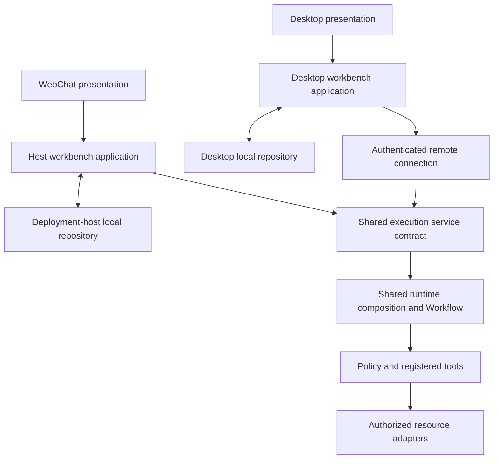

# Workbench and execution service convergence design

> Language: English | [简体中文](../zh-cn/docs/workbench-runtime-convergence-design.md)

Date: 2026-10-06. Status: merged into local `main` on 2026-10-08 from `codex/workbench-runtime-convergence`; source verification and release limits are recorded in the [implementation ledger](workbench-convergence-implementation.md). Production cutover is not performed. Source baseline: local `main` at `9b92968d`. A source revision does not establish the version of a running service or installed application.

SparkClaw keeps both WebChat and desktop workbenches. Both own local persistence and use the same business execution model. WebChat's local data resides on its deployment host, alongside the execution service; desktop data resides on the desktop host. Physical placement and connection methods do not define separate business architectures.

This plan brings the merged R3 implementation into the normal main-branch architecture: clarify ownership, converge runtime composition and workbench behavior, and switch code, APIs and storage names to the target design together. It supersedes the WebChat-versus-R3 framing of earlier designs. It does not declare that the two current paths already have identical capabilities.

The user confirmed that the project is still in development: old devices and existing data impose no compatibility or migration requirement. Use a coordinated clean-start cutover, with no old-client support, route aliases, dual reads/writes, history import or data-preserving upgrade machinery.

## 1. Confirmed product model

1. WebChat and desktop are supported workbench deployments. Neither is a legacy or exceptional product path.
2. Workbench conversations, messages, drafts, task history and user files are locally persisted. For WebChat, “local” means its deployment host, not the device displaying a browser tab; browser IndexedDB storage is not required.
3. Business processing has one source of truth for context rules, routing, Workflow execution, active credentials, tool registration, policy, approval verification and result semantics.
4. Mail remains authoritative in the mail service. Workbench caches and explicitly saved attachment copies retain their separate ownership.
5. Deliver one matched workbench/service version and fresh storage. Development devices may be re-enrolled; old installation identities, credentials, histories and delivery records need not carry forward.
6. Each workbench schedules its own tasks. If it is offline when an occurrence becomes due, that occurrence is skipped permanently: no execution, catch-up or automatic recovery after reconnection/restart. The execution service does not host future workbench schedules.

| Deployment | Workbench persistence | Connection to execution service | Business model |
|---|---|---|---|
| WebChat | Deployment-host database and files, colocated with the service | Browser HTTP/SSE reaches the host; host components may call the shared service in-process | Shared |
| Desktop | Desktop database and files | Renderer IPC to main, then authenticated HTTPS/WSS | Shared |

Separate browser tabs accessing the same authorized WebChat workspace continue to see that workspace. This plan does not turn each tab/device into a new isolated database. Separate desktop installations keep their own workbench data. A common Owner or execution service does not introduce automatic desktop-to-desktop or WebChat-to-desktop conversation replication.

Co-location does not authorize the execution core to read arbitrary workbench history or files. The workbench supplies the admitted context and resources through explicit boundaries, whether the transfer is local or remote. Shared semantics do not require the same database engine, wire transport, process or operating-system facilities.

## 2. Starting implementation and gaps

The following preserves the `9b92968d` source inventory before this refactor. Old paths and limits in this table are baseline evidence, not current usage instructions. See the [release guide](workbench-release.md) for current paths and initialization.

| Area | Current source | Refactoring gap |
|---|---|---|
| Web conversation entry | `gateway/sessions_endpoints.go`, `apps/webchat/src/App.tsx` and session hooks | Host repository access and execution orchestration are coupled in the entry path |
| Desktop workbench | `apps/desktop/src/main/client-store.mjs`, `execution-client.mjs`, `apps/webchat/src/desktop/LocalWorkbench.tsx` | SQLite schema 4, local files and delivery receipts work, but workbench orchestration remains separate |
| Execution composition | `gateway/r3_workflow.go`, `agent/transient.go`, `internal/r3execution` | Both paths use Agent Runtime; the installed-client path additionally constructs temporary repositories, ToolHub, policy and artifacts with its own restrictions |
| Credentials | `agent/transient.go` and the active integration runtime | The latest Info fix demonstrates why entry-specific construction must not recreate providers solely from startup configuration |
| Browser host | `internal/r3browser`, desktop `browser/host-agent.mjs`, Gateway bootstrap | Host roles, transport and resource authority need stable responsibility-based names |
| Mail and scheduling | `internal/r3mail`, `gateway/r3_schedules.go`, `gateway/schedules.go` | Mail synchronization is distinct from authoritative mail processing; online leased tasks and resident schedules currently have different capabilities |
| Published interfaces | `/api/r3/*`, `X-R3-Digest`, desktop request allowlists | Replace branch terminology at all callers and receivers in the same cutover |
| Documentation | `architecture.md`, `store.md`, `webchat.md`, `index.md`, `macos-connection-guide.md` | Some current guides still describe implemented desktop facilities as pending or tell users to switch to the old branch |

Current desktop execution has real constraints: bounded submitted context, temporary repositories, memory-backed tool workspace, restricted tools, result save/ACK and online single-run schedules. WebChat uses host repositories and existing message/schedule services. These are explicit convergence work items; changing names alone does not remove them.

Historical source delivery, main merge, deployment and hardware qualification are different facts. Preserve dated evidence in the [implementation ledger](client-r3-implementation.md) and [Mac/Linux acceptance record](macos-r3-dual-host-acceptance.md), including incomplete acceptance cases.

## 3. Target responsibilities

The following responsibilities are implemented through the existing packages and adapters; see the implementation ledger for concrete source entry points and capability boundaries. Prefer existing packages and narrow interfaces over a new general-purpose framework.

| Responsibility | Owns | Boundary |
|---|---|---|
| Workbench application layer | Conversation/task operations, local scheduling, context selection requests, presentation state and result persistence coordination | Uses repositories and an execution connection; does not select tools or grant approval authority |
| Workbench repository | Scoped conversations, messages, files, task history and receipts | Host Store adapter for WebChat; existing SQLite/files adapter for desktop |
| Execution service | Admission, request binding, execution state, cancellation, approval continuation and result delivery | One semantic contract, independent of HTTP, IPC or in-process entry |
| Runtime composition | Shared routing graph, model/provider runtime, policy construction and registered tools | Injects execution-scoped repositories, artifacts and resources without reconstructing independent business rules |
| Connection and resource adapters | Authentication transport, serialization, event projection, file transfer, browser host commands | Preserve identity, deadlines and resource ownership; cannot elevate authority |
| Authoritative services | Mail, service configuration, identity/revocation and necessary control records | Retain their existing typed domains and cross-project obligations |

The host workbench and execution service may continue to run inside the same Gateway binary and use the same database instance. Separate them through ownership, scoped repositories and call boundaries; a new daemon, database or loopback HTTP hop is not required. Desktop main remains responsible for secrets and trusted local operations. The browser renderer does not gain database, filesystem, credential or host-grant access.

Pure contract types remain in `internal/app`; lower-level packages must not import Gateway or frontend concerns. Keep current Memory/File/PostgreSQL repository implementations complete when changing their interfaces. Shared frontend behavior should use a small repository/connection port with host and desktop adapters; retain useful shared components rather than creating another workbench tree.

## 4. Common request and result semantics

1. The originating workbench records the user's submission intent and a stable request identity. Saving a draft or upgrading the application does not submit it.
2. A scoped repository adapter obtains the selected conversation context and resource manifests. Common selection and budget rules determine the admitted snapshot; the execution core does not opportunistically inspect neighboring databases or directories.
3. Authentication maps the request to a verified principal and data scope. Admission freezes the request identity, context/resource digest, applicable limits and authorized execution facilities. Transport fields cannot supply trust.
4. Shared runtime composition selects the same Workflow and policy for equivalent inputs and capabilities. Active Settings credentials, provider generations and cancellation behavior apply to both entries.
5. Approval remains an explicit decision about the original immutable operation. A cached approval display or client-supplied assistant message cannot authorize execution.
6. Results are validated and durably committed to the originating workbench before delivery is acknowledged. A host-local repository transaction can provide the same semantic receipt as a remote client's save/ACK without an artificial download/upload loop.
7. Recovery queries the original request. Lost responses, reconnects, application upgrades or transport changes cannot automatically replay an uncertain external effect.

Keep domain execution state distinct from transport and persistence state: execution completion does not establish that a result was saved; a disconnected presentation does not establish execution failure. Local atomic writes and remote file manifests implement the same integrity requirement, with file size/hash verification where bytes cross a resource boundary.

The current desktop budgets and 24-hour undelivered-result expiry remain the baseline until changed through a separate, tested behavior change. Inventory both paths before selecting common limits; the desktop envelope's 16 KiB input and 96 KiB context limits are not automatically the common product policy. Record and test the chosen limits. Streaming and polling may present the same execution state differently, but must agree on completion, approval, cancellation and durable delivery.

## 5. Persistence ownership and lifecycle

| Data | Logical authority | Placement and lifecycle |
|---|---|---|
| Conversations, messages, drafts, task history, saved files and displayed results | Originating workbench | Host-local for WebChat, desktop-local for desktop; scoped access and explicit retention |
| Schedule definitions and occurrence records | Originating workbench | Local scheduler submits only occurrences due while online; missed occurrences remain skipped without catch-up |
| Temporary inputs, tool workspace and intermediate execution content | Execution scope | Bounded lifetime; cleanup on completion/cancel/expiry; no extra unbounded content archive |
| Undelivered result bundle | Delivery service | Current absolute expiry and earlier cleanup after durable receipt; retries do not extend retention |
| Mail originals, attachments, collection state and service summaries | Mail service | Backend authority; local caches are replaceable, explicit attachment copies are workbench files |
| Device credentials, deployment identity, revocation and minimal execution fences | Service control domain | Persistent operational state; independent of workbench-history and temporary-content cleanup |
| Browser profiles and command journals | Their authorized host/resource domain | Preserve host identity, page generations, uncertain-write fences and existing retention obligations |

WebChat conversation bodies on the deployment host count as workbench-local persistence. Their physical proximity to the service does not make them an execution-service archive or subject them to temporary-result cleanup. Conversely, desktop conversation ownership does not move back to a central shared history merely because the runtime becomes common.

Classify repositories, tables and directories by their target ownership, then initialize fresh development storage. Do not build history import, old-ID mapping, schema upgrades from old development data, dual reads/writes or compatibility path lookup. Database engines and useful repository implementations can be reused without carrying their old contents forward.

Rename physical paths with the code: replace `userData/client-r3` with a neutral workbench location such as `userData/workbench`, and replace the `.r3` execution root with an explicitly owned execution location. Final paths belong in the deployment configuration and docs. Do not retain `.r3` aliases or silently open an old root when initialization fails. Create fresh device/installation identities, credentials, delivery state and browser journals for the new development deployment as needed.

At cutover, stop old admission and stop or drain owned workers before activating the matched new services and workbenches. Old queued tasks, delivery ACKs and browser commands are not imported or replayed. Keep deployment identity and credential scope explicit so an old process cannot submit into the fresh execution state. Scope initialization to SparkClaw development resources; external services and contract-governed ledgers follow section 11.

Fresh initialization is a release decision, not normal startup behavior. Data created after cutover must survive ordinary restarts; runtime deduplication, durable receipts, expiry and uncertain-write handling remain required. This document change performs no data deletion or device reset.

## 6. Converging actual behavior

| Area | Shared rule | Existing difference to resolve explicitly |
|---|---|---|
| Context | One selection/budget policy and immutable admitted input | WebChat history reads versus desktop-supplied bounded messages; preserve semantics while extracting the common rule |
| Runtime and credentials | One composition path for active providers, policy and tools | Remove duplicated provider construction; retain execution-scoped state and resource cleanup |
| Tool availability | Derived from verified authority and available resources | Current desktop restrictions must not be removed by taking the union of tools; unsupported capabilities remain explicit until qualified |
| Scheduling | Workbench-local definitions and triggering; offline-at-due occurrences are permanently skipped | Replace backend future leases for workbench tasks with local scheduler submission. WebChat's scheduler runs in the host workbench service; desktop's runs in main. Both use the rules below |
| Browser control | Same tool semantics and explicit host/resource authority | Desktop conversation-owned embedded pages and backend acquisition remain distinct roles; no silent host substitution |
| Mail | Same authoritative service and revision semantics | Host access and desktop cache sync use different delivery adapters, without duplicate collectors |
| UI and events | Shared domain states and workbench behavior | Preserve WebChat streaming and desktop reconciliation while converging hooks and projections |

Resource availability and authority are trusted composition inputs, not a user-selectable “Web versus desktop business mode.” Do not add `isR3`/`isDesktop` branches throughout routing, policy or Workflow code. Native UI/platform code may still identify its platform. Do not create an unrestricted configurable execution profile to mask unresolved product rules.

The target is equivalent business behavior for equivalent input, authority and resources. Where an operating-system feature or online resource differs, report the actual capability and keep its lifecycle explicit. Existing capabilities must not disappear simply to make both entries share a smaller implementation.

### 6.1 Workbench scheduling and missed occurrences

This scheduling rule is confirmed by the user. Definitions, next due times and occurrence records belong to the originating workbench repository. The workbench scheduler decides when to submit a normal execution request; the common runtime still owns business interpretation and execution. Schedule create/update/cancel operations use the workbench repository boundary. No future context or task is delegated to an execution-service timer for later autonomous submission.

“Online” means that the owning workbench scheduler is running and can submit through its authenticated execution connection. For WebChat this is the deployment-host workbench service, not an open browser tab. For desktop it is the main process and its usable connection; a hidden window can stay online, while process exit, suspension or connection loss can make it offline.

| Condition at the occurrence's due time | Required behavior |
|---|---|
| Workbench online and execution submission available | Atomically claim that occurrence, record one request ID and submit through the normal execution path |
| Workbench offline, suspended, stopped or unable to submit | Do not execute; record `missed` when the local repository is next available, without putting the occurrence back in a runnable queue |
| Reconnect/restart finds an overdue occurrence that was never submitted | Mark it missed; never reschedule it to now, replay it or ask the backend to catch it up |
| The due-time submission response was lost | Reconcile the recorded request ID; do not treat uncertainty as permission to submit another execution or retry a missed occurrence |
| A future occurrence has not become due | Keep its definition; it may execute at its own future due time if the workbench is online then |

For recurring schedules, apply the rule per occurrence: missed occurrences stay skipped, and only future occurrences remain eligible. Do not accumulate a backlog or cancel all future occurrences solely because one was missed. An explicit later user action is a new execution request, not automatic recovery of the skipped occurrence.

Normal timer dispatch jitter while a scheduler remains continuously online is not an offline recovery window. The scheduler must distinguish live due-time dispatch from startup/reconnect scans, sleep/wake and availability gaps; do not execute all rows with `due_at <= now`. Use a durable occurrence identity and exclusive claim to prevent duplicate submissions from multiple WebChat tabs, worker ticks or process restarts. If an execution was already admitted, its ordinary cancellation/result-reconciliation rules apply; this decision adds neither continued-offline execution guarantees nor automatic resubmission.

Remove `/api/r3/schedules/*` lease registration/renewal/cancel handling for workbench scheduling, the corresponding desktop lease loop, and backend timers that submit these future workbench tasks. Host-side schedule CRUD may remain an adapter to the WebChat workbench repository; due tasks use the common execution API. Mail collection and contract-bound external schedules are separate service responsibilities and are not moved or deleted by this workbench rule.

## 7. Code names and API convergence

Use business responsibilities in new names. The following records the completed mapping from the source baseline.

| Baseline name | Implemented direction |
|---|---|
| `internal/r3execution` | `internal/execution`, owning admitted work and result delivery |
| `internal/r3browser` | `internal/browserhost`, owning host broker/transport/authority |
| `internal/r3mail` | `internal/mailsync`, separate from `emailmanagement` |
| `gateway/r3_*.go`, `WithR3*`, `registerR3*` | Responsibility-based handler files, options and registration functions |
| `authorizedR3Fetch`, R3 error prose | Execution/mail transport helpers and domain error messages |
| `qualify:desktop-r3` | A qualification name describing its actual native-host coverage; do not merge it blindly with the distinct existing desktop qualification suite |
| R3 workbench comments and product copy | Workbench, execution service, host and connection terminology |

Keep real version identifiers: Workflow/profile `r3` revisions, schema versions, `sparkclaw-connect-v1`, historical acceptance IDs and frozen external protocols are not branch-name cleanup targets. Rename branch-derived persistent paths as part of this cutover. Maintain a reviewed list of genuine revision/historical/external references instead of requiring zero `r3` matches.

Current canonical routes use `/api/v1` with responsibility-based resources, rather than an R3 or desktop namespace:

| Retired route family | Current canonical family |
|---|---|
| `/api/r3/installations` | `/api/v1/installations` |
| `/api/r3/inputs/...` | `/api/v1/inputs/...` |
| `/api/r3/executions/...` | `/api/v1/executions/...` |
| `/api/r3/mail/...` | `/api/v1/mail/...` |
| `/api/r3/hosts/...` | `/api/v1/browser/hosts/...` |
| `/api/r3/schedules/...` | Remove the future-lease API; workbench-local scheduling submits due work through `/api/v1/executions` |
| `X-R3-Digest` | `X-SparkClaw-Digest` |

The canonical product routes are implemented together with their callers; retired routes are unavailable. This changes no accepted external contract. Workbench schedule CRUD belongs to its host API or desktop IPC adapter; it does not require a new backend future-lease API. Existing `/api/sessions/*` workbench CRUD and message projections are not automatically aliases for execution submission. Inventory all consumers before deciding their long-term resource layout; unrelated `/api/*` surfaces need no simultaneous version migration.

Use one coordinated development cutover:

1. Replace route registrations, digest headers, clients, trusted-main allowlists, renderer restrictions, WSS/proxy configuration, fixtures and docs together. Implement only the target protocol; remove old `/api/r3/*` handlers and `X-R3-Digest` support without aliases, redirects or fallback transports.
2. Build and deploy the service, WebChat and desktop from the matched target revision, then initialize their target storage and enroll development devices. No old/new version matrix or staged installed-client rollout is required.
3. Verify the new HTTP/WSS contracts end to end. Retired routes and headers must not execute work; unsupported versions fail explicitly instead of invoking compatibility logic or retrying a write on another route.
4. Remove obsolete serializers, parsers, scripts and tests whose only purpose is the retired transport. Retain semantic execution tests against the new contract, including digest validation and no replay of ambiguous writes.

Authentication converges through verified principal/scope mapping. The target keeps installation binding for enrolled desktop devices, authenticated WebChat workspace access, revocation, TLS/pinning and browser grants; old device identities and credentials need not be preserved. Co-location creates no credential exemption; do not restore the reverted credential-free WebChat design or manufacture one installation identity per browser tab.

## 8. Documentation ownership

| Document | Required final responsibility |
|---|---|
| README and `docs/index.md` | Current capabilities and normal deployment entry points; introduce the unified model without requiring R3 history |
| `docs/architecture.md` | Workbench/execution/service boundaries, two persistence placements and actual convergence status |
| `docs/store.md` | Logical ownership, repository implementations, cleanup and backup boundaries; distinguish workbench data from temporary execution state |
| `docs/webchat.md` and desktop guides | Same business model, with concrete storage and connection adapters |
| `docs/development.md` | Stable code entry points, extension rules and validation matrix |
| `docs/deployment.md` and Mac connection guide | Main-branch commands, supported artifacts, connection requirements and exact deployment evidence |
| R3 designs and acceptance records | Dated rationale and evidence with links to current guides; retain unresolved qualification and historical hashes |

Maintain English/Chinese mirrors in the same change. Correct obsolete “not implemented” claims using current source evidence; do not replace them with an unqualified “fully accepted.” Distinguish implemented, deployed on a recorded version, and hardware-qualified. Current instructions must not require checkout of `codex/sparkclaw-r3`.

## 9. Implementation phases and exit criteria

Mechanical moves, behavior changes and protocol/storage cutover are separate commits, delivered together as one matched development release. Establish the affected baseline before implementation; record existing failures rather than attributing them to the refactor.

| Phase | Work | Exit criterion |
|---|---|---|
| 0 Inventory | Map both request paths, consumers, identities, repositories, retention, limits, schedules and resource permissions; check central contracts | Every difference is classified as transport/storage implementation, preserved capability, or an explicit behavior change; target names and clean-start scope defined |
| 1 Current documentation | Reconcile main-branch architecture, storage ownership, entry guides and deployment instructions | Readers can understand the current product without historical R3 documents; pending implementation/acceptance remains explicit |
| 2 Shared composition | Extract common runtime/credential/policy/tool assembly and narrow workbench persistence/context/result ports | Equivalent requests use common business rules; existing resource, retention and cancellation boundaries pass regression tests |
| 3 Workbench convergence | Move shared conversation/task/approval/result behavior behind host and desktop adapters; implement local scheduling with permanent skip of offline due occurrences; reconcile other phase-0 differences in separate behavior commits | Both storage placements pass the common behavioral suite; offline scheduling follows section 6.1, with other WebChat capabilities and desktop data ownership retained |
| 4 Neutral names and direct cutover | Rename symbols, suites and storage paths; replace APIs/headers and update every caller | Matched workbench/service version passes; no old routes, aliases, migration code or ambiguous-write replay |
| 5 Release and closeout | Validate packaged desktop, host deployment and fresh initialization; publish current guides and remove retired implementation | Exact revisions/artifact hashes, verification results and release recovery procedure recorded; only reviewed revision/historical/external R3 references remain |

Use neutral storage paths and fresh initialization in this refactor; data migration and old-device support are outside scope. Each phase ends with an updated implementation/validation record, not an assertion based only on this design.

## 10. Acceptance and release recovery

Run common behavior scenarios through both persistence adapters. Compare domain effects and state transitions rather than model-generated wording or byte-identical transport envelopes.

| Scenario | Required evidence |
|---|---|
| Fresh storage and access | Both workbenches initialize at target paths; newly created histories/files survive ordinary restart; WebChat tabs share the authorized workspace, without cross-workbench history replication |
| Equivalent conversation | Equivalent scoped history/input/resources select the same workflow and policy; selected context follows the common budget policy |
| Active credentials | Settings changes are effective in both entries; in-flight generation changes cancel consistently; no startup-only credential reconstruction |
| Approval | Original tool/arguments/digest and scope preserved; reject/cancel prevents execution; restored snapshots cannot grant authority |
| Delivery | File corruption, full disk, failed transaction and lost ACK never produce false durable success; retry queries/reuses the original request and receipt |
| Recovery | Disconnect/restart/revoke do not replay uncertain writes; post-cutover request fences survive normal service restarts; old tasks are never imported into fresh state |
| Resource lifecycle | Desktop embedded page ownership and backend acquisition role remain distinct; stale generations, resource loss and unknown browser writes stay fenced |
| Scheduling | Online occurrences submit once; closing a WebChat tab does not stop its host scheduler; offline-at-due, sleep/wake and restart/reconnect never catch up missed occurrences; future recurring occurrences remain eligible; no backend workbench lease timer remains |
| Direct cutover | Matched new workbench/service HTTP/WSS paths work; retired routes/headers cannot execute; no old-path fallback or history migration occurs |
| Retention | Temporary cleanup cannot delete either workbench's local history; result expiry is absolute; mail and required external ledgers keep their contracts |
| Documentation | Bilingual mirrors and local links pass; current guides match source, deployment evidence and remaining acceptance limits |

During code implementation run affected Go/desktop/WebChat tests per phase. Completion requires the engineering baseline's Go build/vet/full tests, applicable race checks, desktop/WebChat tests and builds, relevant native qualifications, new API/clean-start checks and bilingual documentation checks. Set up declared document-tool dependencies before interpreting ToolHub failures. Default file-backed behavior must be covered alongside affected Memory/PostgreSQL paths. Source validation results are recorded in the implementation ledger; no production deployment is part of this change.

If a development release fails, stop it and restore one matched workbench/service build with a fresh, version-appropriate development dataset, or fix forward. Do not build cross-version schema recovery or old-device compatibility. Stop or cancel owned work before replacing the environment; uncertain external effects remain uncertain, and old tasks must not be replayed after reset. Normal runtime recovery within the selected release still uses its durable request/receipt records.

## 11. Cross-project boundary and coordination

This plan proposes SparkClaw-internal convergence. It changes no accepted JingSi Runtime, App-CLI BrowserHost/Registry, IMMS evidence or external MCP contract, including required payload retention, identity and deduplication obligations. Those consumers are not automatically migrated to the workbench delivery model. Mail, connector and external-task lifetimes must be inventoried separately from workbench-local history.

Before a change affects another project or an external contract, follow the root AGENTS protocol: inspect InfiniCenter contracts and outstanding reviews, file the decision, obtain accepted status, then update contract and qualification together. Record externally visible progress in `clusters/ProjectGroup-2/status/sparkclaw.md`.

Phase 0 coordination (2026-10-06): InfiniCenter is accessible through the known Linux host at `/home/infinimesh/InfiniCenter`. The cluster registry, empty SparkClaw inbox, central C0001 and accepted JingSi/App-CLI/IMMS contracts were checked. A SparkClaw review was appended to 0031, which remains proposed. This implementation changes only internal workbench behavior and does not alter external schemas, result/event retention, journals or evidence obligations. No counterpart code changes are required for that scope.
