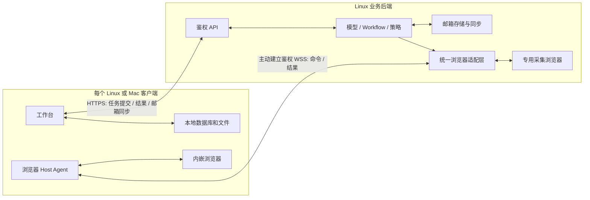

# 客户端与后端架构 R3

> 语言：简体中文 | [English](../../docs/client-backend-architecture-design.md)

日期：2026-09-30。状态：用户已确认产品边界，实施与迁移待完成。本文是 SparkClaw 自有客户端的目标架构；[架构](architecture.md)、[Store](store.md) 和 [WebChat](webchat.md) 中标明的内容仍描述现行实现。本文不表示已经部署、迁移数据或修改已接受的跨项目契约。

## 1. 已确认的边界

后端是业务处理核心。客户端呈现结果、接收用户操作、保存自己的非邮箱数据，并提供受限的本地执行设施。两端通过局域网连接。当前客户端使用本地回环地址，只是因为它与后端同机部署，并不代表另一套产品架构。

**邮箱数据以后端为权威，可同步到客户端；对话、消息、任务历史、生成文件及其他非邮箱用户数据，由各客户端本地保存。** 用户的明确补充取代 R2.1／R2.2 的共享对话／数据库假设。两个客户端即使连接同一后端、使用同一 Owner，也不会自动看到或接续彼此的对话。以后若提供导出／导入，应是显式复制，不是数据库复制。

模型推理、路由、Workflow、策略判断、审批验证、已接纳工作的调度及结果生成仍由后端负责。本地存储和执行经验证的浏览器命令不意味着客户端拥有第二套业务后端。客户端提交的历史只是输入，不能作为授权或操作已获批准的证明。

## 2. 数据保存归属

| 数据 | 持久权威位置 | 后端处理／客户端副本 |
|---|---|---|
| 邮箱账户、邮件、原始正文、附件、邮件服务摘要／事项、采集游标 | 后端邮箱存储 | 客户端保存经授权且带版本的邮箱缓存；服务端凭据不同步 |
| 对话、消息、输入草稿、任务历史、展示的审批与结果 | 发起客户端 | 后端仅接收本次执行所需的上下文 |
| 非邮箱文档、生成文件、下载、截图、用户记忆及偏好 | 客户端本地数据库／文件 | 后端按需处理明确提供的输入和临时输出，不维护共享用户 workspace |
| 客户端浏览器 Cookie、Profile、登录态、下载目录 | 对应客户端 | 不向后端或其他客户端复制 Profile |
| 后端专用浏览器 Profile | 后端基础设施 | 仅供后端获取数据和操作，不是客户端 Profile 的副本 |
| 服务配置、身份／设备授权、吊销、最小执行围栏 | 后端控制存储 | 仅运维控制元数据；不含对话正文、Prompt、DOM、文档正文或输出归档 |

邮件附件仍属于后端邮箱数据。用户另存的附件副本、在对话中生成的报告属于客户端本地文件。本地对话引用邮件，不会使整段对话成为邮箱数据。只有类型明确的邮件服务记录可以按邮箱规则留存，普通任务不能把任意输出标为邮件来保存在后端。

“其他数据本地保存”约束用户数据的持久归属。后端执行需要有界临时处理：优先使用内存；工具必须落盘时，使用隔离、加密、带期限和容量上限的临时目录，不进入备份、索引和普通日志。客户端确认持久保存或期限到达后删除。含内容的 trace、模型缓存、工具日志及错误报告遵守同一规则。不含业务内容的诊断和最小防重／围栏记录不是历史数据库，必须定义并审计字段白名单。

后端获取非邮箱数据时，页面／缓存／下载也使用临时存储；持久的基础设施登录 Profile 不意味着可以长期保存浏览历史或采集的用户内容。邮箱存储及客户端本地浏览器 Profile 仍遵循各自归属规则。

临时数据 TTL、每任务／Owner 容量和控制记录保留期，需要在实施验收前冻结并验证；未配置或容量耗尽时拒绝接纳。后端不提供无限期结果收件箱；没有其他持久副本时，也不能承诺无限离线恢复。

## 3. 拓扑与连接

通过一个经配置和认证的工作台 origin 提供业务及邮箱 API。局域网部署使用验证服务器身份的 HTTPS，宿主控制使用客户端主动建立的鉴权 WSS。无需公开 CDP／调试端口、数据库端口、共享文件系统或客户端入站监听。同机 Linux 可以优化为回环／IPC 传输，但身份、授权和数据归属规则相同。

现有严格 v1 回环连接描述符仍是当前实现限制。应新增支持 LAN origin、证书信任、部署身份和客户端凭据的版本化连接加载器，不能直接放宽旧解析器。工作台登录与浏览器宿主执行权分开授予；宿主可单独吊销，密钥进入平台凭据存储，事件和结果限定于发起客户端。

## 4. 客户端存储与后端任务上下文

新增由桌面主进程持有的 ClientStore：事务化对话／消息／任务记录、Schema 迁移、发送队列、事件游标和文件清单。采用客户端本地 SQLite 与文件原子写入，Renderer 通过类型化 IPC 访问，不能直接接触数据库路径或任意文件系统操作。本地存储失败应阻止提交或交付确认，不能悄悄退回服务端保存。

UI 的依赖拆为 ClientStore、ExecutionClient 和 MailSyncClient；模型／路由策略仍在后端。后端上下文构建器消费客户端提供的有界调用上下文及授权邮箱引用，不得从旧 Store 读取其他客户端对话历史。上下文选择仍受后端限制及验证，不上传整个本地数据库。

每个安装实例拥有独立且经认证的 client_id。执行绑定 owner_id + client_id + local_conversation_id + local_task_id + request_id，与旧全局 session ID 区分。恢复／导入到其他安装实例时生成新客户端身份，原 ID 仅保留来源含义；复制的发送队列不得自动重放已接纳任务。

同一 React UI 也可运行于普通浏览器，但需自己的本地存储适配器（IndexedDB／文件导出）、配额／驱逐提醒及 origin 迁移策略，不能以服务端历史作为隐式后备。桌面端持久化与内嵌自动化验收，不证明纯 Web 的持久化能力或原生宿主能力。现有 Web 客户端在显式迁移前保留现行实现，不能标为已经符合 R3。

## 5. 执行与可靠交付

1. 提交前，将用户输入、有界上下文快照及 request_id 提交到本地发送队列。后端验证身份、权限、预算和请求摘要，再返回执行句柄。
2. 后端执行业务。浏览器步骤绑定明确的角色／宿主／页面；文件输入通过带租约的不透明句柄或有界上传交付。不能把客户端文件路径当成后端路径。
3. 事件／结果携带执行身份、单调序号及内容摘要。客户端提交本地事务、验证并原子保存输出文件后，才发送对应的持久交付确认。传输 ACK 或“执行完成”不证明文件已经本地保存。
4. 确认丢失时，在期限内重交同一事件／结果，由客户端去重。提交或写操作结果不明时，按原 request_id 查询／对账；重连不得自动创建新的写请求。
5. 断线后不再下发新的客户端浏览器命令，宿主本地租约到期并隔离排队动作。纯后端步骤可在已接纳预算内完成；将超过临时存储上限时暂停。客户端消失后，不能无限积压后台任务结果。
6. 保留窗口到期后删除临时内容，仅保留不含内容的最小执行状态并报告 delivery_expired。不能把未交付输出展示为本地可用，也不能重做副作用来恢复结果。重新生成只读结果需显式新任务，未知写操作必须先对账。

后端重启依靠最小持久围栏／摘要及客户端本地发送队列／上下文恢复，而不是第二套对话数据库。客户端丢失可能导致非邮箱历史和未交付输出丢失；备份由客户端本地／用户管理。副作用围栏必须独立于临时内容清理保留，不能通过删除围栏允许重试。

非邮箱定时任务的定义和历史也保存在客户端。在线客户端向后端注册有界执行租约，后端判断并执行已接纳工作，客户端提供上下文及持久结果接收位置；不承诺客户端退出后，任意非邮箱任务仍无限运行。后端常驻邮件采集属于独立的邮箱服务职责，不依赖客户端在线。

## 6. 两类浏览器与统一适配层

| 角色 | 用途与位置 | 呈现与保存 |
|---|---|---|
| backend_acquisition | 后端数据获取及经授权操作，包括常驻邮件采集 | 后端专用浏览器，不是远程客户端视口；仅持久保存邮箱及基础设施状态 |
| client_embedded | 客户端交互任务中的浏览器活动 | 该客户端真实内嵌浏览器；Profile、下载和面向用户的产物保存在本地 |

统一 BrowserHostAdapter 提供能力查询、获取／续期／释放、命令／结果／事件、取消和对账。后端本地 transport 与客户端远程 transport 实现相同的经验证操作；执行器留在后端，客户端 Host Agent 将授权命令转换为对真实内嵌 WebContents 的操作。保留现有 Controller／Bridge 边界、受管页面资产及 App-CLI 公共接口。

客户端浏览器自动化**只在客户端内嵌浏览器中进行**。不弹出独立任务浏览器窗口，不接管个人／系统浏览器，也不静默换成后端专用浏览器。后端服务采集可以显式使用 backend_acquisition，但这是不同角色的执行步骤，不是备用页面。同机 Linux 客户端与后端仍分别持有 Profile、存储范围和生命周期。

命令与回包绑定客户端／对话／任务、host_id、runtime_generation、connection_epoch、lease_id、page_id、page_generation 及授权摘要。围栏在浏览器资源端执行，不能只检查服务端 Socket。控制 ACK、取消和业务完成保持不同语义；丢失响应不能证明没有写入。重连、页面替换或对话切换后拒绝旧回包覆盖当前状态。

每个本地对话拥有自己的页面映射。切换 A／B 时选择各自已存在的内嵌页；A 的迟到结果不能覆盖 B。无页面的对话显示空态。隐藏面板不等于取消，销毁／退出则撤销对应资源。同一客户端多个工作台窗口可移动／聚焦真实页面，但自动化仍在内嵌视图进行，且不能产生第二个控制者。

## 7. 同步的范围

邮箱按 Owner／mailbox、服务端 revision、cursor 和删除 tombstone 从后端同步。客户端事务化应用批次后才推进游标；游标缺口／epoch 变化触发有界快照。离线缓存显示最后同步状态，删除缓存与请求服务端删除邮件是不同操作。邮件写操作及冲突由后端根据期望版本和原请求 key 验证，不同步凭据、原始 Profile 或其他客户端本地数据。

内嵌页面与自己的后端命令保持一致，是因为被操作的就是这张真实页面，而非传递截图；同步的是该执行的任务事件和页面绑定元数据。**不自动跨客户端同步对话、浏览器会话或像素。** 两端打开同一 URL 是独立页面；以后若显式提供 URL／导航共享，也只是有限状态传递，不能保证任意 DOM、登录态或播放进度一致。

## 8. 现有实现与迁移

| 现有组件 | 所需调整 |
|---|---|
| Gateway Store 的 session／message／run／artifact 与服务端历史上下文 | 将邮箱／控制存储与临时执行分离；增加客户端有界上下文及本地交付协议 |
| React 工作台读取共享服务端会话 | 增加 ClientStore／ExecutionClient／MailSyncClient，明确本地对话／任务归属及交付状态 |
| 桌面 main 启动本机服务，连接描述符仅接受回环 | 分离客户端与后端服务装配，增加版本化 LAN 配对和本地持久化 |
| 本地 UDS adapter／回环 relay 与全局页面呈现 | 增加鉴权 Broker／远程 transport、角色授权、对话页面绑定，保留本地验证 |
| 后端 workspace 与 artifact URL | 非邮箱改为客户端文件清单及带租约的临时传输，邮件附件仍在邮箱存储 |

迁移是独立、可评审的操作，不是修改文档的副作用。先清点旧非邮箱记录、文件、日志、trace、缓存和备份，为每份既有对话／数据集明确目标客户端，不能把后端数据库广播给所有客户端。使用 ID 映射、数量与哈希保留引用，邮件引用仍能解析。

排空活动任务、隔离旧写入，完成导出及本地持久导入验证后再切换。未分配数据阻止最终旧存储清理。定义有界回退窗口与显式清理清单，不能把旧服务端历史换名为“备份”无限保留，也不能因 R3 已写入文档就删除现有用户数据。回退保留执行围栏，不重放导入发送队列。按客户端／数据集分批迁移，旧新路径不能同时写同一份历史。

## 9. 跨项目边界与待完成门槛

已接受的 App-CLI 契约要求持久请求绑定、journal 和执行围栏；JingSi Runtime v1 要求持久 lookup／结果／事件恢复。本地客户端历史不能静默替换这些承诺。邮件专属 journal 可归入后端邮箱职责；非邮箱 payload 留存及外部项目发起的任务，仍需逐字段兼容设计。

修改外部接口、保留保证或执行账本前，必须在 ProjectGroup-2 立案并达成 accepted，再同步更新契约与验收。本轮文档阶段现有集成继续遵循现行契约，这是实施缺口，不是 R3 目标的永久例外。没有持久客户端接收位置的连接器，不能声明已完成迁移。本文不引入新的跨项目 wire Schema。

剩余实施门槛明确为：冻结临时目录／租约／保留预算及控制字段白名单；清点并分配旧数据；通过 accepted 决策解决外部集成留存；验证普通 Web 本地存储路径；实机验证 Mac runtime、内嵌站点兼容性与打包。这些事项不改变已确认的客户端／后端数据归属。

## 10. 实施顺序与验收

P0 冻结数据分类、协议／保留预算、迁移清单及必要跨项目决策；P1 实现客户端本地存储及有界上下文提交；P2 实现 LAN 身份、执行交付／确认和邮箱同步；P3 实现统一浏览器适配层与客户端仅内嵌路由；P4 迁移文件／历史并验证故障恢复；P5 验证 Mac 打包／硬件和分范围切换。可先做可测试原型，但任何阶段都不隐式修改生产。

| 编号 | 必需证据 |
|---|---|
| A01 | 同一 Owner 的 Mac 与 Linux 共享后端邮箱，但对话／消息／任务／文件各自本地独立保存 |
| A02 | 同机 Linux 仍遵循同一逻辑 API 和归属边界，无隐式数据库／文件系统共享 |
| A03 | 后端用客户端有界上下文完成任务，清理后 Store、日志、缓存和备份不残留非邮箱正文 |
| A04 | 本地数据库失败／磁盘满会阻止提交或交付 ACK，不虚报输出已保存 |
| A05 | 提交／结果／ACK 丢失及客户端／后端重启，对账到同一执行且不重复副作用 |
| A06 | TTL／容量耗尽可预测地暂停或使交付过期，不产生无限积压或自动重发 |
| A07 | Mac 和 Linux 客户端任务均操作真实内嵌页面，无独立／系统浏览器或后端替代页面 |
| A08 | 同一后端适配层可控制经授权的后端采集及客户端内嵌角色，具备隔离及一致命令语义 |
| A09 | A／B 快速切换、宿主／页面重启及迟到回包不能串对话或产生重复控制者 |
| A10 | 断线／休眠／退出／吊销在宿主端隔离命令，未知写操作保持未决直至对账 |
| A11 | 邮箱增量同步、删除、游标重置、离线缓存及版本冲突保持后端权威 |
| A12 | 所有客户端退出后后端常驻收信继续，非邮箱客户端定时任务遵循有界在线语义 |
| A13 | 邮件附件仍是后端邮箱记录，另存副本及生成报告为经验证的客户端文件 |
| A14 | 迁移验证数量／哈希／ID 映射及未分配数据，回退保留围栏且不重放发送队列 |
| A15 | 错误证书、部署／客户端／Owner 不匹配及过期宿主授权均被拒绝，无裸 CDP 或 Profile 复制 |
| A16 | Mac GUI／架构／签名／升级及 Web 存储限制分别验收，不从 Linux 测试推定通过 |

全部 R3 用例均待完成。以往共享数据库与 Electron 验收只证明旧实现。平台细节见 [Mac 设计](macos-lan-desktop-design.md) 和 [Mac 连接指南](macos-connection-guide.md)。
