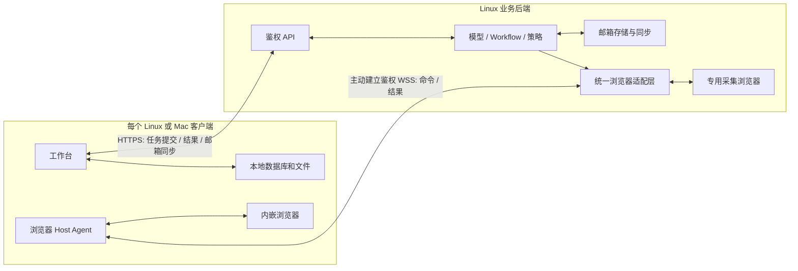

# 客户端与后端架构 R3

> 语言：简体中文 | [English](../../docs/client-backend-architecture-design.md)

日期：2026-10-03。P0–P5 Linux／共享源码与适用隔离检查完成，具体交付范围及剩余阶段门见[实施与验收记录](client-r3-implementation.md)。状态：用户已确认产品边界、不迁移旧测试数据、离线任务策略，以及第 2 节后端临时处理／控制记录边界和未交付结果最长 24 小时的保留规则；Mac 验收与生产架构切换待完成。本文是 SparkClaw 自有客户端的目标架构；[架构](architecture.md)、[Store](store.md) 和 [WebChat](webchat.md) 中标明的内容仍描述现行实现。本文不表示已经部署、清除数据或修改已接受的跨项目契约。

## 1. 已确认的边界

后端是业务处理核心。客户端呈现结果、接收用户操作、保存自己的非邮箱数据，并提供受限的本地执行设施。两端通过局域网连接。当前客户端使用本地回环地址，只是因为它与后端同机部署，并不代表另一套产品架构。

**邮箱数据以后端为权威，可同步到客户端；对话、消息、任务历史、生成文件及其他非邮箱用户数据，由各客户端本地保存。** 用户的明确补充取代 R2.1／R2.2 的共享对话／数据库假设。两个客户端即使连接同一后端、使用同一 Owner，也不会自动看到或接续彼此的对话。以后若提供导出／导入，应是显式复制，不是数据库复制。

模型推理、路由、Workflow、策略判断、审批验证、已接纳工作的调度及结果生成仍由后端负责。本地存储和执行经验证的浏览器命令不意味着客户端拥有第二套业务后端。客户端提交的历史只是输入，不能作为授权或操作已获批准的证明。

## 2. 数据保存归属

用户已确认本节边界：非邮箱业务数据长期保存在客户端；后端允许有界临时处理、限时结果交付、持续保存必要服务配置及最小防重记录。该授权不包括在后端长期保存非邮箱正文、完整任务历史或生成文件。

| 数据 | 持久权威位置 | 后端处理／客户端副本 |
|---|---|---|
| 邮箱账户、邮件、原始正文、附件、邮件服务摘要／事项、采集游标 | 后端邮箱存储 | 客户端保存经授权且带版本的邮箱缓存；服务端凭据不同步 |
| 对话、消息、输入草稿、任务历史、展示的审批与结果 | 发起客户端 | 后端仅接收本次执行所需的上下文 |
| 非邮箱文档、生成文件、下载、截图、用户记忆及偏好 | 客户端本地数据库／文件 | 后端按需处理明确提供的输入和临时输出，不维护共享用户 workspace |
| 客户端浏览器 Cookie、Profile、登录态、下载目录 | 对应客户端 | 不向后端或其他客户端复制 Profile |
| 后端专用浏览器 Profile | 后端基础设施 | 仅供后端获取数据和操作，不是客户端 Profile 的副本 |
| 服务配置、身份／设备授权、吊销、最小执行围栏 | 后端控制存储 | 仅运维控制元数据；不含对话正文、Prompt、DOM、文档正文或输出归档 |

邮件附件仍属于后端邮箱数据。用户另存的附件副本、在对话中生成的报告属于客户端本地文件。本地对话引用邮件，不会使整段对话成为邮箱数据。只有类型明确的邮件服务记录可以按邮箱规则留存，普通任务不能把任意输出标为邮件来保存在后端。

已确认的后端保存范围分为四类：

| 类别 | 具体内容与用途 | 已确认保留规则 |
|---|---|---|
| 执行中的临时输入／中间数据 | 本次问题、必要上下文、待处理文件、工具读取的页面片段，用于本次计算 | 优先内存，必须落盘才用临时目录；不再需要、执行结束／取消或执行期限到达后清理 |
| 待交付结果 | 模型回答、生成文件、尚未被客户端确认保存的结果事件 | 客户端持久保存并确认后立即清理；未确认结果最多保留到生成后 24 小时，容量上限优先生效 |
| 服务身份与配置 | 配对设备 ID、凭据校验材料、设备权限／吊销信息、后端模型连接配置及必要密钥 | 按服务配置长期保存，支持轮换／吊销；不属于客户端对话历史 |
| 最小执行防重记录 | 请求 ID、客户端 ID、请求摘要、是否接纳／执行及终态标志、授权／租约代次 | 在防重和对账所需窗口内持久保存，与临时结果分开清理；不保存任务正文、对话标题、模型回答、文件或页面内容 |

例如 Mac 提交 PDF 摘要任务：PDF 原件仍在 Mac，后端只临时接收处理所需副本；摘要回到 Mac 并确认保存后，后端删除副本和摘要。若 Mac 断线，摘要可以短暂等待交付；后端另保留不含正文的请求标志，避免重连导致同一写操作再执行。普通诊断日志仅保留错误码、耗时和计数等必要元数据，不记录输入／输出正文。

“其他数据本地保存”约束用户数据的持久归属。后端执行需要有界临时处理：优先使用内存；工具必须落盘时，使用隔离、加密、带期限和容量上限的临时目录，不进入备份、索引和普通日志。客户端确认持久保存或期限到达后删除。含内容的 trace、模型缓存、工具日志及错误报告遵守同一规则。不含业务内容的诊断和最小防重／围栏记录不是历史数据库，必须定义并审计字段白名单。

后端获取非邮箱数据时，页面／缓存／下载也使用临时存储；持久的基础设施登录 Profile 不意味着可以长期保存浏览历史或采集的用户内容。邮箱存储及客户端本地浏览器 Profile 仍遵循各自归属规则。

未交付结果的绝对到期时间为生成时间加 24 小时，重连、重试和服务重启不延长；客户端确认后提前清理，到期后停止交付并清理。启动恢复须先检查期限，不能重新提供已过期内容。输入／中间数据按任务需要及执行期限清理，服务配置与最小防重记录不套用结果的 24 小时清理规则。

每任务／Owner 容量、租约时长和控制记录保留期已冻结并验证，见[实施记录](client-r3-implementation.md#冻结的存储身份与容量)；必要参数未配置或容量耗尽时拒绝接纳。后端不提供无限期结果收件箱；没有其他持久副本时，也不能承诺无限离线恢复。

## 3. 拓扑与连接

通过一个经配置和认证的工作台 origin 提供业务及邮箱 API。局域网部署使用验证服务器身份的 HTTPS，宿主控制使用客户端主动建立的鉴权 WSS。无需公开 CDP／调试端口、数据库端口、共享文件系统或客户端入站监听。同机 Linux 可以优化为回环／IPC 传输，但身份、授权和数据归属规则相同。

现有严格 v1 回环连接描述符仍是当前实现限制。应新增支持 LAN origin、证书信任、部署身份和客户端凭据的版本化连接加载器，不能直接放宽旧解析器。工作台登录与浏览器宿主执行权分开授予；宿主可单独吊销，密钥进入平台凭据存储，事件和结果限定于发起客户端。

### 3.1 首次登录与服务解锁

用户明确：每个客户端安装实例首次登录，必须使用 SparkClaw 服务访问凭据解锁服务。沿用产品现有的服务凭据／Token 概念，不把 Mac 系统密码、Git 凭据、邮箱密码或模型 API Key 当成该登录凭据。同机 Linux 也遵守此规则，LAN 可达或安装包中有配置不等于已经登录。

首次使用流程固定为：粘贴一份后端签发的连接凭据 → 主进程提取并验证后端证书／服务身份，验证通过后才发送其中的设备 Token → 后端验证并建立当前安装实例的登录身份 → 解锁获授权服务。后端身份与 Token 在内部仍分开处理，但用户不再通过两个界面步骤组装。成功前只开放首次连接／登录界面及必要连接检查，不提交任务、不同步邮箱、不建立可执行命令的宿主通道。认证和业务接口均由后端校验，前端“已解锁”标志不能作为授权依据。

成功登录绑定经后端确认的 deployment_id、owner_id 与本安装的 client_id；按现有权限模型登记可撤销的客户端会话／凭据。原始输入仅用于本次认证，不进入日志、源码、安装包、普通配置或桌面 Renderer 的 localStorage。桌面主进程把设备 Token 保存到系统凭据存储（Mac 使用 Keychain），受控描述文件只保存公开的固定后端身份；单值注册 bundle 复用为本设备签发的 Token，凭据来源和领取方式见下节，不引入额外换发端点。

后续启动可以使用有效本机凭据恢复连接，但每次访问仍由服务端鉴权。凭据失效／吊销、主动退出或切换到不同后端身份时重新登录；临时断网显示服务不可用，不能当作已获得新授权，也不必把有效凭据当作错误而清空。退出登录清除对应登录凭据并停止受保护通道，不删除客户端本地对话／文件。

解锁只赋予当前客户端访问范围内的服务权限，不是全局打开后端、关闭鉴权或自动同意工具写操作。浏览器执行仍需独立宿主授权和任务权限；邮箱长期留在后端、非邮箱各端本地保存的规则不变。现有 WebChat 输入 Token 和桌面预配置凭据仅是可复用基线，R3 首次登录门和主进程安全保存已有 Linux／共享实现；服务端安装身份注册已实现，Mac Keychain 实机验收仍待完成，见[阶段记录](client-r3-implementation.md)。

### 3.2 凭据领取与设备管理

本节定义所需行为。后端主机领取／恢复 CLI、设置入口及桌面主进程登录解锁已实现；适用检查与剩余阶段门见[实施记录](client-r3-implementation.md)。当前代码已有逐客户端凭据体系：`GET /api/clients` 查看设备、`POST /api/clients` 签发独立凭据、`POST /api/clients/{id}/revoke` 撤销设备、`GET /api/workbench/identity` 验证登录身份。签发必须带已认证的管理身份及 `Idempotency-Key`；未登录用户不能直接领取。`PairedClientsSettings` 已接入设置侧栏、Inspector 和 SettingsPanel，并有真实路由链测试。

凭据是设备长期使用的服务访问 Token，不是每次连接重新生成的验证码。每个安装实例单独签发；首次输入后，后续启动、短暂断网和 WSS 重连复用有效凭据。连接代次可以改变，client_id 和有效凭据不随之改变。此阶段复用已签发 Token，不引入额外换发端点。明文只在领取时展示；后端持久保存校验哈希及设备管理元数据，不提供明文回查。现有签发接口为同键重试在内存中暂存明文最多 10 分钟；这不是可恢复的长期凭据库。

**首次初始化入口。** 后端部署完成后，明确展示“领取首个客户端凭据”的本机入口和操作说明。`npm run credentials:initial -- --name "我的 Mac"` 已实现，需先安装本提交的私有 provision 和 Gateway 本机管理监听（见[部署条件及恢复命令](deployment.md#首个设备凭据与恢复)），由部署用户在后端主机的交互终端运行。初始化工具读取受控的本机部署描述符及管理凭据，检查目录／文件所有者、权限、非符号链接、部署身份和受信本机 origin，经身份接口验证后调用现有签发接口，为目标客户端创建独立 client_id 与 Token。实现使用独立本机管理凭据和私有 Unix socket，管理凭据不能鉴权网络 API。不能把预置 Desktop Token 复制给 Mac，也不能把自动登录当作 R3 首次登录验收通过。

领取工具只在显式交互终端展示新 Token 一次，旁边显示设备名称、部署身份和登录用途；正常部署日志仅显示领取方法，不能打印 Token。禁止把 Token 写入 Git、安装包、普通配置、命令行参数、流水线输出或领取记录。领取记录只保留部署／目标设备 ID、请求 key、状态和时间等必要元数据。先持久化签发请求 key，再请求签发；超时或响应丢失沿用同一 key，不能自动创建第二台设备。后端重启或 10 分钟暂存到期导致明文不可恢复时，提示撤销该未领取设备并重新签发，不能声称可再次读取旧 Token。重复运行已完成的初始化入口只提示后续管理入口，不再次显示旧凭据。

**设置入口。** 在已登录工作台的“设置 → 设备与凭据”提供直接、可搜索的导航项，接入真实设置路由和现有签发／列表／撤销接口。包含设备名称输入、签发按钮、一次性凭据展示、复制及“已保存，收起”按钮；展示列表中的设备名称、设备 ID、当前设备标记、创建时间、最后活跃时间和撤销状态。最后活跃时间不等于实时在线状态。列表不显示旧 Token；撤销不删除客户端本地对话／文件。

签发成功后保留明文直到用户收起或离开页面，禁止写入页面持久存储。必须先交付凭据展示，再独立刷新列表；刷新失败不能吞掉成功签发结果。提供加载、签发中、复制成功／手动复制提示、空列表、加载失败重试和撤销失败反馈。未知签发结果在本次页面生命周期内沿用原 key 和设备名称重试；发生不可恢复冲突时引导撤销未领取项后重新签发。退出页面后不承诺恢复未保存的明文。

**撤销与丢失恢复。** 撤销针对指定设备；后端拒绝该凭据的后续请求，并终止其受保护长连接／宿主授权，客户端返回登录界面并清除对应安全存储项。已经发往网站的操作仍遵循未知结果对账规则。另一设备继续可用，后台邮箱服务继续运行；撤销用户设备不得使后端下次启动失败，实现时应解除预置 Desktop Client 登记与用户设备可撤销状态之间的启动耦合。撤销当前设备前提示会退出当前登录，成功后立即结束其受保护通道。

凭据遗失时，由另一已认证设备撤销遗失设备并签发新凭据。如果所有用户设备均无法登录，提供仅限后端主机部署用户的显式恢复操作，重新验证本机部署与管理权限，撤销指定遗失设备并签发新身份；不能增设匿名 LAN 领取接口、通过重启恢复已吊销 Token，或把“重新显示旧 Token”作为恢复方法。后续应在同一次交付中给出实际初始化／恢复命令及权限条件。

| 实施落点 | 具体工作 |
|---|---|
| `scripts/provision-local-workbench.mjs`、本地／远端部署脚本 | 保持现有部署身份输出和凭据保护；增加领取提示及独立交互式初始化／恢复工具，不在正常部署日志输出密钥 |
| Gateway 的 Client 签发／撤销及身份校验 | 复用现有 API、哈希存储与同键重试；补齐撤销对长连接／宿主授权及服务重启的影响，管理权限始终由服务端验证 |
| `settingsSidebar.tsx` → `inspector.tsx` → `SettingsPanel`／`PairedClientsSettings` | 接通真实导航，完善签发、复制、状态、撤销和失败恢复；用真实路由链验证入口，而非只测孤立组件 |
| 桌面 main／受限 IPC／连接加载器 | 接收用户输入，验证部署／Owner／客户端身份，安全保存并恢复 Token；Mac 使用 Keychain，Renderer 不持久保存密钥 |

本节不新增 App-CLI／JingSi 协议或改变外部账本。初始化、设备管理、登录安全存储均列入 P2；实际命令和权限条件已补入部署及 Mac 指南，剩余 P2 阶段门单独记录。

## 4. 客户端存储与后端任务上下文

新增由桌面主进程持有的 ClientStore：事务化对话／消息／任务记录、Schema 迁移、发送队列、事件游标和文件清单。采用客户端本地 SQLite 与文件原子写入，Renderer 通过类型化 IPC 访问，不能直接接触数据库路径或任意文件系统操作。本地存储失败应阻止提交或交付确认，不能悄悄退回服务端保存。

UI 的依赖拆为 ClientStore、ExecutionClient 和 MailSyncClient；模型／路由策略仍在后端。后端上下文构建器消费客户端提供的有界调用上下文及授权邮箱引用，不得从旧 Store 读取其他客户端对话历史。上下文选择仍受后端限制及验证，不上传整个本地数据库。

每个安装实例拥有独立且经认证的 client_id。执行绑定 owner_id + client_id + local_conversation_id + local_task_id + request_id，与旧全局 session ID 区分。恢复／导入到其他安装实例时生成新客户端身份，原 ID 仅保留来源含义；复制的发送队列不得自动重放已接纳任务。

同一 React UI 也可运行于普通浏览器，但需自己的本地存储适配器（IndexedDB／文件导出）、配额／驱逐提醒及 origin 迁移策略，不能以服务端历史作为隐式后备。桌面端持久化与内嵌自动化验收，不证明纯 Web 的持久化能力或原生宿主能力。现有 Web 客户端在显式迁移前保留现行实现，不能标为已经符合 R3。

## 5. 执行与可靠交付

用户已确认离线策略：后端邮箱采集继续；依赖客户端内嵌浏览器的任务暂停派发并在租约到期后隔离；纯后端计算可在已接纳预算内继续，未交付结果最多暂存至生成后 24 小时，按第 2 节清理。已经发往网站的写请求不能保证被暂停，应保留未知状态并对账。

1. 提交前，将用户输入、有界上下文快照及 request_id 提交到本地发送队列。后端验证身份、权限、预算和请求摘要，再返回执行句柄。
2. 后端执行业务。浏览器步骤绑定明确的角色／宿主／页面；文件输入通过带租约的不透明句柄或有界上传交付。不能把客户端文件路径当成后端路径。
3. 事件／结果携带执行身份、单调序号及内容摘要。客户端提交本地事务、验证并原子保存输出文件后，才发送对应的持久交付确认。传输 ACK 或“执行完成”不证明文件已经本地保存。
4. 确认丢失时，在期限内重交同一事件／结果，由客户端去重。提交或写操作结果不明时，按原 request_id 查询／对账；重连不得自动创建新的写请求。
5. 断线后不再下发新的客户端浏览器命令，宿主本地租约到期并隔离排队动作。纯后端步骤可在已接纳预算内完成；将超过临时存储上限时暂停。客户端消失后，不能无限积压后台任务结果。
6. 保留窗口到期后删除临时内容，仅保留不含内容的最小执行状态并报告 delivery_expired。不能把未交付输出展示为本地可用，也不能重做副作用来恢复结果。重新生成只读结果需显式新任务，未知写操作必须先对账。

后端重启依靠最小持久围栏／摘要及客户端本地发送队列／上下文恢复，而不是第二套对话数据库。客户端丢失可能导致非邮箱历史和未交付输出丢失；备份由客户端本地／用户管理。副作用围栏必须独立于临时内容清理保留，不能通过删除围栏允许重试。

非邮箱定时任务的定义和历史也保存在客户端。在线客户端向后端注册有界执行租约，后端判断并执行已接纳工作，客户端提供上下文及持久结果接收位置；不承诺客户端退出后，任意非邮箱任务仍无限运行。后端常驻邮件采集属于独立的邮箱服务职责，不依赖客户端在线。

## 6. 两类浏览器与统一适配层

| 角色 | 用途与位置 | 呈现与保存 |
|---|---|---|
| backend_acquisition | 后端数据获取及经授权操作，包括常驻邮件采集 | 后端专用浏览器，不是远程客户端视口；仅持久保存邮箱及基础设施状态 |
| client_embedded | 客户端交互任务中的浏览器活动 | 该客户端真实内嵌浏览器；Profile、下载和面向用户的产物保存在本地 |

统一 BrowserHostAdapter 提供能力查询、获取／续期／释放、命令／结果／事件、取消和对账。后端本地 transport 与客户端远程 transport 实现相同的经验证操作；执行器留在后端，客户端 Host Agent 将授权命令转换为对真实内嵌 WebContents 的操作。保留现有 Controller／Bridge 边界、受管页面资产及 App-CLI 公共接口。

客户端浏览器自动化**只在客户端内嵌浏览器中进行**。不弹出独立任务浏览器窗口，不接管个人／系统浏览器，也不静默换成后端专用浏览器。后端服务采集可以显式使用 backend_acquisition，但这是不同角色的执行步骤，不是备用页面。同机 Linux 客户端与后端仍分别持有 Profile、存储范围和生命周期。

命令与回包绑定客户端／对话／任务、host_id、runtime_generation、connection_epoch、lease_id、page_id、page_generation 及授权摘要。围栏在浏览器资源端执行，不能只检查服务端 Socket。控制 ACK、取消和业务完成保持不同语义；丢失响应不能证明没有写入。重连、页面替换或对话切换后拒绝旧回包覆盖当前状态。

每个本地对话拥有自己的页面映射。切换 A／B 时选择各自已存在的内嵌页；A 的迟到结果不能覆盖 B。无页面的对话显示空态。隐藏面板不等于取消，销毁／退出则撤销对应资源。同一客户端多个工作台窗口可移动／聚焦真实页面，但自动化仍在内嵌视图进行，且不能产生第二个控制者。

## 7. 同步的范围

邮箱按 Owner／mailbox、服务端 revision、cursor 和删除 tombstone 从后端同步。客户端事务化应用批次后才推进游标；游标缺口／epoch 变化触发有界快照。离线缓存显示最后同步状态，删除缓存与请求服务端删除邮件是不同操作。邮件写操作及冲突由后端根据期望版本和原请求 key 验证，不同步凭据、原始 Profile 或其他客户端本地数据。

内嵌页面与自己的后端命令保持一致，是因为被操作的就是这张真实页面，而非传递截图；同步的是该执行的任务事件和页面绑定元数据。**不自动跨客户端同步对话、浏览器会话或像素。** 两端打开同一 URL 是独立页面；以后若显式提供 URL／导航共享，也只是有限状态传递，不能保证任意 DOM、登录态或播放进度一致。

## 8. 现有实现与无旧数据迁移的切换

| 现有组件 | 所需调整 |
|---|---|
| Gateway Store 的 session／message／run／artifact 与服务端历史上下文 | 将邮箱／控制存储与临时执行分离；增加客户端有界上下文及本地交付协议 |
| React 工作台读取共享服务端会话 | 增加 ClientStore／ExecutionClient／MailSyncClient，明确本地对话／任务归属及交付状态 |
| 桌面 main 启动本机服务，连接描述符仅接受回环 | 分离客户端与后端服务装配，增加版本化 LAN 配对和本地持久化 |
| 本地 UDS adapter／回环 relay 与全局页面呈现 | 增加鉴权 Broker／远程 transport、角色授权、对话页面绑定，保留本地验证 |
| 后端 workspace 与 artifact URL | 非邮箱改为客户端文件清单及带租约的临时传输，邮件附件仍在邮箱存储 |

用户明确当前产品数据均为测试数据、无迁移价值，因此本次不建设旧数据导出／导入、目标客户端分配、历史 ID 映射或迁移兼容流程。R3 从新的客户端本地数据开始，不自动加载或复制旧后端对话、任务历史和生成文件；旧数据去向不再是实施门槛。

切换仍需排空或停止旧执行、隔离旧写入，验证新存储初始化和邮箱服务连接。不迁移测试数据不等于把邮箱服务目录、部署密钥、现行 App-CLI／JingSi 防重账本一起清空；这些资源分别遵循运行与契约规则。旧测试业务数据在实际切换时按明确范围重置／清理，本次交付源码，不执行既有数据删除。未来客户端 Schema 升级仍需版本管理，这与迁移当前旧测试数据是两件事。

## 9. 跨项目边界与待完成门槛

已接受的 App-CLI 契约要求持久请求绑定、journal 和执行围栏；JingSi Runtime v1 要求持久 lookup／结果／事件恢复。本地客户端历史不能静默替换这些承诺。邮件专属 journal 可归入后端邮箱职责；非邮箱 payload 留存及外部项目发起的任务，仍需逐字段兼容设计。

修改外部接口、保留保证或执行账本前，必须在 ProjectGroup-2 立案并达成 accepted，再同步更新契约与验收。现有集成继续遵循现行契约，本次源码交付不宣称其生产切换。没有持久客户端接收位置的连接器，不能声明已完成迁移。本文不引入新的跨项目 wire Schema。

产品边界及 Linux／共享容量／租约／控制白名单已实施并在记录范围内验收。用户本轮排除 InfiniCenter 协调和等待 0031；普通 Web 存储、未来外部接口变化及 Mac runtime／站点／打包实机验收仍为独立门禁。旧测试数据迁移已移出范围。

## 10. 实施顺序与验收

构建交付分工已确认：本环境负责源码与 Linux／共享代码验证，通过 Git 推送交付；用户在 Mac 同步代码并本机编译。Mac 编译／打包／签名不在当前环境执行，也不要求 SSH 代编译。Mac 构建不阻塞 Linux 实施或源码交付，A16／Mac 专项验收以用户提供的准确提交及实机结果为准，反馈前保持待验收。

P0 冻结数据分类、协议／保留预算、全新存储初始化方案及必要跨项目决策；P1 实现客户端本地存储及有界上下文提交；P2 实现凭据领取／设备管理／安全登录、LAN 身份、执行交付／确认和邮箱同步；P3 实现统一浏览器适配层与客户端仅内嵌路由；P4 完成文件交付及故障恢复；P5 交付源码／构建准备和 Linux 检查，再由用户验收 Mac 打包／硬件及全新数据切换。不实施旧测试数据迁移，任何阶段都不隐式修改生产。

| 编号 | 必需证据 |
|---|---|
| A01 | 同一 Owner 的 Mac 与 Linux 共享后端邮箱，但对话／消息／任务／文件各自本地独立保存 |
| A02 | 同机 Linux 仍遵循同一逻辑 API 和归属边界，无隐式数据库／文件系统共享 |
| A03 | 后端用客户端有界上下文完成任务，清理后 Store、日志、缓存和备份不残留非邮箱正文 |
| A04 | 本地数据库失败／磁盘满会阻止提交或交付 ACK，不虚报输出已保存 |
| A05 | 提交／结果／ACK 丢失及客户端／后端重启，对账到同一执行且不重复副作用 |
| A06 | 持久 ACK 后立即清理、生成后 24 小时未交付结果过期；重连／重启不延长期限；容量耗尽暂停／拒绝接纳且不自动重发；防重记录不随结果清理 |
| A07 | Mac 和 Linux 客户端任务均操作真实内嵌页面，无独立／系统浏览器或后端替代页面 |
| A08 | 同一后端适配层可控制经授权的后端采集及客户端内嵌角色，具备隔离及一致命令语义 |
| A09 | A／B 快速切换、宿主／页面重启及迟到回包不能串对话或产生重复控制者 |
| A10 | 断线／休眠／退出／吊销在宿主端隔离命令，未知写操作保持未决直至对账 |
| A11 | 邮箱增量同步、删除、游标重置、离线缓存及版本冲突保持后端权威 |
| A12 | 所有客户端退出后后端常驻收信继续，非邮箱客户端定时任务遵循有界在线语义 |
| A13 | 邮件附件仍是后端邮箱记录，另存副本及生成报告为经验证的客户端文件 |
| A14 | 新客户端从空的非邮箱存储启动，不导入旧测试历史；切换隔离旧执行、不误清服务身份／恢复账本或重放旧请求 |
| A15 | 错误证书、部署／客户端／Owner 不匹配及过期宿主授权均被拒绝，无裸 CDP 或 Profile 复制 |
| A16 | Mac GUI／架构／签名／升级及 Web 存储限制分别验收，不从 Linux 测试推定通过 |
| A17 | 全新 Mac／Linux 客户端必须经 SparkClaw 凭据认证解锁；空／错误／吊销凭据不能发任务、同步邮箱或执行浏览器命令；验证安全保存、重启恢复、换后端重新登录及退出不删本地数据 |
| A18 | 后端初始化提供明确领取入口，为目标设备签发独立身份；仅交互终端显示一次，无 Token 日志／普通配置／Git 留存，不能领取或复制预置 Desktop Token |
| A19 | 经实际“设置 → 设备与凭据”导航完成签发、复制／手动复制、收起、列表刷新和撤销；加载失败不误报空列表，刷新失败不丢失已签发明文 |
| A20 | 同一设备重连／重启复用有效凭据，不同设备身份不同；撤销拒绝 API 并关闭受保护通道，不影响其他设备、后台邮箱或后端重启，也不删除客户端本地历史 |
| A21 | 签发超时／丢响应以同 key 恢复且不重复创建设备；暂存过期或后端重启后明确引导撤销重发；重复初始化不重显，全部用户设备失联时仅经受控本机恢复，不复活旧凭据 |

Linux／共享 PASS、适用 PARTIAL 证据及 NOT_RUN Mac／生产阶段门见[实施记录](client-r3-implementation.md)。以往共享数据库与 Electron 验收只证明旧实现。平台细节见 [Mac 设计](macos-lan-desktop-design.md) 和 [Mac 连接指南](macos-connection-guide.md)。
