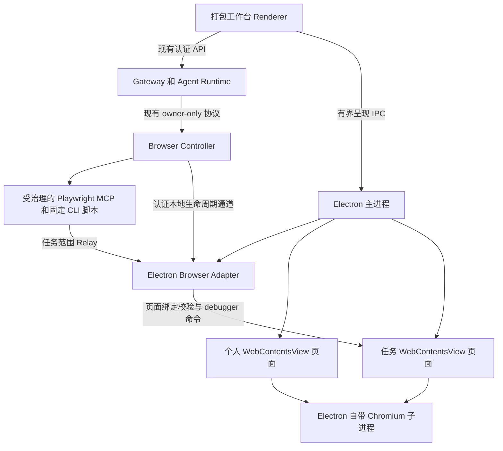

# 桌面客户端与内置浏览器设计

> 语言：简体中文 | [English](../../docs/desktop-client-embedded-browser-design.md)

> 历史设计：当前工作台行为与全新初始化路径以[架构](architecture.md)、[实施记录](workbench-convergence-implementation.md)和[发布指南](workbench-release.md)为准。下文保留原有日期下的设计理由与验收证据。

> 状态：用户于 2026-09-21 确立架构。纯软件实施阶段已完成，ARM64 候选版本已通过
> 资格验证；Provider 凭据、目标硬件和发布／切换仍由用户最终验收。Electron 自带
> Chromium 是唯一目标浏览器运行时；当前生产浏览器尚未切换。

> R3 目标更新（2026-09-30）：保留 Electron 内嵌执行核心，数据与进程职责以
> [客户端／后端 R3](client-backend-architecture-design.md) 为准。客户端自动化只使用内嵌视图，
> 后端专用浏览器仅是采集／操作资源。各客户端本地保存非邮箱数据，通过 LAN（或同机回环）连接；
> 既有 Linux 验收不证明新增本地存储、远程适配器或 Mac 安装包已通过。

继续实施前请读 [Electron 实施交接](desktop-electron-implementation-handoff.md)，其中记录
当前代码状态、待办顺序、验收门槛及桌面测试边界。

## 决策摘要

SparkClaw 使用 Electron 打包现有 React/Vite 工作台，以 Electron 自带 Chromium
渲染并运行个人页面和任务页面，通过 `WebContentsView` 在客户端内部展示。
Electron/Chromium 管理渲染、GPU、网络等子进程；SparkClaw 管理页面身份、归属、
布局和生命周期，不手动按标签页启动独立进程。

继续采用现有控制方式：Gateway 准入、Owner-scoped Browser Controller、受治理的
Playwright MCP、固定 Playwright CLI/provider 脚本，以及 Browser Bridge 的任务范围
命令边界。新增 Electron Browser Adapter，将该边界适配到 Electron API。
保留控制方式不等于假定当前 Chrome 扩展可以原样加载。

唯一目标方案排除外部 Chromium 窗口接管、`surface-host`、X11 reparent、专用或嵌套
X Server、Xephyr、Xpra、远程窗口串流、CEF 和自定义 Chromium 分支。
它们既不是实施阶段，也不是自动回退路径。已退役的
[surface-host 实验](../tools/browser-surface-host/README.md)仅保留历史诊断源码，
不承担产品运行或发布职责。其隔离 Electron 锚点套件只验证旧原生窗口边界，
不能验收 Electron Adapter 或 `WebContentsView` 架构。

## 当前基线与范围

仓库现在已有带可选类型化桌面面板的 React/Vite 工作台、Browser Bridge `1.0.26`、
Browser Controller，以及已验证的 Electron `44.4.3`／自带 Chromium
`152.0.7977.130` 运行时。另行部署的固定独立 Chromium `148.0.7778.0` 在取得切换授权前
继续作为未变更的生产基线。旧原生窗口实验不能作为本方案证据，
事后日志确认此前桌面故障是活动 Display 的 X11 窗口操作后 GNOME Shell／Mutter
合成器发生 `SIGSEGV`；日志没有定位 Mutter 内部具体缺陷。

本决策修改 SparkClaw 内部浏览器实施路线。Gateway 公共 API、模型工具、授权、审批、
审计、provider 副作用语义、JingSi Runtime v1 及其他跨项目契约保持原有约束。
若实施中发现跨项目变更，必须先取得中枢 accepted 决策，不能藏在适配层中实施。

实施证据及剩余用户门槛见 [Electron 实施交接](desktop-electron-implementation-handoff.md)
和[桌面发布与切换方案](desktop-release-plan.md)。

首个交付目标仍为受管 DGX Spark 桌面的 Linux/ARM64。Electron 正常使用宿主支持的
显示后端，不操纵其他应用的原生窗口，不启动第二个显示服务器。
Gateway、模型、Store 和 Browser Controller 继续作为现有服务运行。

## 产品布局

一个 SparkClaw 窗口包含任务侧栏、会话和右侧浏览器工作区。
初始尺寸保留 1440 x 900，最小尺寸为 1180 x 720。

| 区域 | 默认 | 行为 |
|---|---:|---|
| 任务侧栏 | 244 px | 保留现有收起与导航 |
| 会话区 | 弹性，分栏时至少 520 px | 保留聊天和审批 |
| 分隔条 | 6 px | 键盘／鼠标调整，不改变任务 viewport |
| 浏览器区 | 640 px，分栏范围 480-760 px | 工具入口，再进入统一浏览器标签栏 |

默认分栏在边框和 padding 之外至少需要 1410 px。可用宽度不足时，浏览器聚焦模式
占用主工作区并保留导航入口；个人页面需要更宽时可以收起侧栏。
任务开始不会自行打开面板。

打开面板时只显示“浏览器”入口，不保留不可用的终端占位，也不立即呈现远端网页；
选择“浏览器”后进入接近原生浏览器的双层结构，第一层为标签页，第二层为导航和
地址栏，不再把个人浏览和任务观察显示为两个 UI 模式。SparkClaw 自行提供个人标签
创建、地址／搜索与导航、下载和权限 UI，因为 `WebContentsView` 不附带完整 Chrome
浏览器工具栏；不是网址的输入会转为 Google 搜索。这些控件属于可信客户端界面，
不放入远端页面。任务标签仍明确标记为只读，用户不能关闭、接管或恢复；选中任务页
时输入地址或搜索内容会新建个人页面。

### 个人页面与任务页面

- 个人页和任务页使用独立的 `WebContents` 实例和归属注册表，不再要求外部 Chromium
  的两个原生窗口。
- 个人页只能由用户操作或经校验的个人登录流程创建。创建、切换、关闭、恢复个人页
  都不会给 Agent 授权。
- 任务页通过 Controller acquisition 创建，保留现有 lease、完成、取消和清理规则，
  不转为个人标签页。弹窗必须在导航前继承 opener 的角色与任务绑定；无法分类则拒绝。
- 用户可以选择当前已授权的任意任务页进行观察；观察选择与 Controller/provider
  自动化目标独立。
- 切换、收起、调整面板和个人浏览，不 acquire/release 任务会话，不修改操作目标，
  不合成任务页输入。
- 页面引用绑定 owner、role、task/session、browser generation 和 page generation。
  Renderer 提供的进程 ID 或 `webContents.id` 本身不是授权依据。

### Session 与登录

个人页和任务页共用一个专门的持久 Electron 浏览器 Session，保留此前确定的共享登录
行为；有权限的工作台使用独立 Session。独立渲染进程不意味着 Cookie、账号或存储独立。

Electron 浏览器 Session 使用独立存储目录，由单个 runtime 持有。不得让 Electron
指向现有独立 Chromium profile、并发打开该 profile，或承诺二进制格式兼容。
不导出／复制旧 Cookie、密码或 passkey。首次迁入在服务商支持时通过 Electron 个人页正常登录；
旧 profile 保持完整，直到另行执行明确的退役策略。
这取代旧提案“原 profile 原地沿用且无需登录迁移”的承诺。

**验证事项：网站登录与 Session 持久化。**SparkClaw 当前采用用户登录服务商网站、
Cookie 保存在浏览器 Session 内并由任务页复用的方式，不是代表 SparkClaw 获取 Google
OAuth API token。不能仅凭 OAuth 的 embedded-user-agent 政策就认定这条路径被阻断；
只有涉及实际 Google OAuth 授权流程时才适用该条政策。另一个独立事实是，Google
账号帮助文档说明可能拒绝嵌入式浏览器登录，这是浏览环境兼容性问题，不是禁止保存
Cookie，也不代表 SparkClaw 已经出现登录失败。隔离夹具已证明持久 Cookie 可共享并跨
重启保留，但尚未进行真实 Provider 登录实测。
在承诺功能等价前，必须确认服务商支持的实际网站 Session 建立方式；QQ、Outlook 和
各 AI 网站也须分别评估。外部 OAuth 回调或 API access token 不会自动建立现有页面脚本
需要的 Gmail 网站登录态。修改 user-agent 或偶然登录成功不等于具备受支持的兼容性。
若必需 provider 在当前架构与控制要求下没有受支持的路径，阻止完整切换，并明确向用户
提出该产品能力缺口；不暗中增加第二引擎、导入 Cookie，或将页面工作流改成 API 工作流。
依据：[Google 账号浏览器说明](https://support.google.com/accounts/answer/7675428)
及 [Google OAuth 浏览器政策](https://developers.google.com/identity/protocols/oauth2/policies#browsers)。

个人退出登录／切换账号可能影响任务认证。Provider 必须在现有操作边界重新核验预期
账号，不匹配即阻断。需要登录的任务指向精确个人登录页；后续检查遵守正常准入和安全
重试规则，不重放结果未知的发送，也不恢复被人工编辑的任务页。
必须在原任务页人工操作的验证挑战仍不属于 v1。

### 观察与输入

任务视图对用户只读，自动化继续使用现有获准命令通道。可信 Electron／原生视图输入
路径必须阻断用户鼠标、触摸、键盘、输入法、快捷键、粘贴／拖放、菜单、权限弹窗、
新窗口和 DevTools 等入口。DOM 遮罩或 CSS `pointer-events` 不能证明原生视图只读。
工作台 Renderer IPC 不能注入输入、发送 CDP 或授予任务归属。

实施必须证明用户原生输入被阻断，同时获准自动化输入仍然有效。在此门槛通过前，
只显示有界任务状态和已有证据，不暴露可编辑任务视图；不引入串流浏览器或外部窗口回退。
观察可以更换呈现的 view，但不能调用 handoff、将键盘焦点交给任务、修改 Controller
选页，或 detach/rebind 调试会话。

个人页随面板改变尺寸。任务 CSS viewport 和 scale 在自动化前确定，活动会话期间固定。
从 640 CSS px 宽度开始验证，并明确记录高度、DPI 和 zoom。面板装不下时显示状态与展开
入口；必须改变 viewport 时，在经验证的运行边界重新取得布局证据。
隐藏、移出呈现层或最小化时，后台渲染和定时器仍须满足 provider 执行需要。

显示状态保留 `idle`、`agent_running`、`login_required`、`checking_login`、
`completed`、`failed`。浏览器／视图可用性与任务状态独立；renderer 丢失不是任务完成。
这些是本地显示状态，不新增 Gateway 或 JingSi wire 状态。

## 架构



该图表达逻辑归属和控制关系，不承诺一个 view 恰好对应一个 OS 进程。Chromium 决定
渲染进程分配，frame 和服务可能使用额外进程。多个 renderer 仍共享 Electron 主进程和
部分浏览器服务；主进程故障可能中断全部浏览页面。

### 现有控制链路与 Electron 适配

保留现有两条控制链：Playwright MCP 承接受治理通用浏览，固定 CLI 路径承接确定性
provider 脚本。保留 Controller 公共协议、任务 lease、操作限制、脚本 revision、
账号检查、制品回执及副作用栅栏。不给模型新增任意 JavaScript、selector、CDP 或
Electron 工具。

| 现有职责 | Electron 实施要求 |
|---|---|
| Bridge 连接与 readiness | 认证 owner-local 适配通道，显式声明 runtime kind/version |
| 任务 `tabId`、allowed tabs、attachment 集合 | 任务范围逻辑 ID 映射到精确活动 `WebContents` 与 generation |
| `chrome.debugger.attach/detach/sendCommand` relay 语义 | 适配到 `webContents.debugger`，保留命令限制 |
| Debugger 事件和嵌套 session | 按同一任务绑定转换事件／ID，校验后代 target |
| 任务创建／移除、弹窗归属 | 主进程页面注册表与生命周期，绝不依赖最后聚焦页 |
| Native messaging 引导 | 私有 Controller→Electron 通道，不依赖 Chrome 扩展 API |
| 下载、取消、回执 | Electron Session 下载事件映射到现有有界制品路径 |
| 既有 handoff／focus 路径 | 新桌面 runtime 对任务页拒绝执行 |

现有 relay 命令／事件 envelope 是固定 MCP/CLI 客户端的兼容目标。
`chrome.debugger.sendCommand` 等名称可以保留为协议名，由 Electron 实现。
这是移植 Bridge 行为，不代表 Electron 实现了全部 `chrome.*` API。

现有 bootstrap 校验固定扩展 ID／版本和 `chrome-extension://` 连接 URL。
新方案引入版本化 Electron 握手，不伪装旧扩展身份，也不放松旧检查。
绑定本地 peer／owner、runtime 版本、generation、task/session 和一次性连接凭据。
Token 和原始命令入口不进入远端页面或普通日志。可以沿用现有临时认证 relay；
不开放全浏览器 remote-debugging 端口，不恢复 Host-CDP。

仅能 attach Electron debugger 不等于 Playwright 已兼容。必须验证初始化、命令响应、
事件、导航、OOPIF／worker session、弹窗 target、截图、下载和 teardown。
每个命令与事件都经任务注册表解析，发现操作不能枚举个人／工作台目标。
全局 Cookie 访问、关闭浏览器、外来 session、过期 ID 及现有其他禁止操作继续被拒绝。
DevTools 导致 debugger detach 时撤销准入并报告实况，不静默重新附着或重做副作用。

### 受管脚本与扩展能力

Electron 只支持部分 Chrome 扩展 API。旧 Browser Bridge 扩展和 Tampermonkey 不再是
新 runtime 的前置条件，也不假定其二进制可直接兼容。通过移植 Bridge 边界和 Electron
受管脚本宿主保留必需产品功能，不用第二套浏览器填补能力缺口。

逐项登记并验证全部现有受管脚本，包括 QQ／Outlook／Gmail Network Reader 和 AI
聊天导出器。优先复用源码模块和已验证 bundle，保留 origin/frame 匹配、document-start
时机、需要的 page-world 网络 hook、readiness／版本校验以及卸载／升级行为。
导航后随意调用 `executeJavaScript` 不等价于当前 Reader。导出器当前使用的三个 GM
能力（`GM_getValue`、`GM_setValue`、`GM_registerMenuCommand`）由有界适配器提供；
不向页面脚本开放文件系统、进程或无限制 IPC。必须实现真实持久化和菜单语义，
不能用测试中的空 stub 代替。

源码行为或注入方式变化时，重新生成相应 revision/hash 并运行 provider 门槛。
不得绕过现有脚本注册表，也不得把缺失能力标为 ready。内部扩展实现可以变化，
产品受限控制边界保持。

### Electron 与 Renderer 边界

主进程持有浏览器注册表、Session 选择、可信浏览控件动作、适配器生命周期、下载／
权限和视图布局。远端页面使用 `nodeIntegration: false`、`contextIsolation: true`
与 sandbox，不获得工作台特权 preload。脚本宿主能力最小化、绑定 origin，并与浏览器
控制分开；工作台本身也采用 sandbox 和严格校验 sender 的窄 preload。

呈现 IPC 只返回 opaque page reference 和有界状态。主进程校验 sender origin、角色、
generation、合法 bounds 和 revision 次序，避免过期响应覆盖新状态。
`selectObservedPage` 只改显示；`openUserTab` 只建个人页。Renderer IPC 不接受源码、
原生 ID、原始 CDP 或任意进程命令。个人导航／关闭／下载动作只解析个人引用。

打包 WebChat 必须明确 Gateway 地址发现、Owner 注册、HTTP/SSE/下载传输，以及语音
WebSocket origin/auth；生产没有 Vite proxy。保留 origin 检查和 web security，凭据
不写入 bundle；通过实际安装包验证连接和麦克风流程。
普通浏览器中的 WebChat 不依赖可选 desktop capability。

## 生命周期与恢复

| 事件 | 必须实现的行为 |
|---|---|
| 切换观察页或我的浏览 | 只改呈现，保留页面身份和任务 viewport |
| 收起、最小化或关闭工作台窗口 | 隐藏／保留浏览视图，Electron runtime 继续常驻；不调用 `app.quit`，不销毁任务内容 |
| 重新打开客户端 | 接入现有单 Owner runtime，恢复呈现而不创建新 lease |
| 工作台 Renderer 崩溃 | 重建工作台 UI，不授予浏览控制、不销毁任务页 |
| 任务 Renderer 崩溃或 debugger detach | 撤销对应 page/session，报告中断，保留副作用不确定性 |
| Electron 主进程／runtime 崩溃或显式完全退出 | 页面可能丢失；Controller 停止准入、撤销 generation 并报告受影响任务实况 |
| Runtime 重启 | 使用新身份重连；持久登录可能保留，在途执行不自动恢复 |

关闭窗口与退出应用分开。用户会话 supervisor 可维持／重启单个 Electron runtime，
但必须在目标主机验证 GUI 环境可用；不允许另一个 runtime 同时打开 Session 目录。
Gateway 调度仍独立，浏览器不可用时，依赖浏览器的工作如实等待或失败。
结果未知的发送／购买不能盲目重放。恢复应在应用／服务层完成，不要求注销 Linux。
不承诺 renderer 隔离能够抵御所有共享 GPU／驱动或主进程故障。

## 源码布局与打包

已实现布局：

```text
apps/desktop/
  src/main/          runtime、Session 所有权、生命周期、权限
  src/browser/       页面注册表、Electron Browser Adapter、受管脚本宿主
  src/preload/       有界工作台和脚本能力
  package.json       打包配置与 WebChat extraResources 映射
  test/              适配、隔离、生命周期、provider 验证
apps/webchat/src/desktop/
                     可选浏览器面板 capability 与可信控件
tools/browser-controller/
                     现有控制链与版本化适配器 bootstrap
```

随 Electron 一起交付其自带 Chromium，不再另行下载独立 Chromium 作为新桌面浏览器。
固定 Electron／Chromium 版本及 Controller、MCP/CLI、适配协议、受管脚本 revision；
不能沿用旧 Chromium 版本号或把旧验收结论直接迁入。ARM64 `.deb`、AppImage、
校验和与更新策略已经就绪；目标干净主机安装仍需用户验收。唯一用户 Launcher 为 SparkClaw；切换后
`open:browser` 和个人登录链接进入“我的浏览”。

## 实施与切换门槛

1. **登录与适配验证：**先确认必需 provider 受支持的网站 Session 登录路径，再以最小
   Electron 视图接入实际固定 Controller、MCP/CLI 和 relay，验证
   身份、事件／target 映射、任务范围操作、用户原生输入阻断和个人并行浏览。
2. **功能迁移：**在现有审批和测试数据规则下验证全部受管脚本、账号、登录、下载、
   权限、固定 viewport／后台执行及 provider probe/effect。
3. **产品与生命周期：**接入打包工作台、可信标签／地址 UI、观察选择、Session 持久
   登录、后台常驻、renderer／main 故障处理和认证连接。
4. **原子切换：**全部门槛通过后迁移安装器、服务、Launcher 和当前态文档，再退役独立
   Chromium／扩展 bootstrap 依赖。不保留运行时选择器或自动旧引擎回退；版本回滚是
   显式的整版操作。

不再设置 X11／Xephyr／Xpra 前置阶段。故障测试使用一次性 Electron user-data 和
测试页面，不操纵用户活动桌面窗口或真实任务。记录本决策不代表授权生产部署、
删除 profile，或为验证而执行真实 provider 副作用。

## 验证矩阵

| 范围 | 验收证据 |
|---|---|
| 单一引擎 | 所有个人／任务页使用 Electron Chromium，无外部浏览器或显示服务器回退 |
| 控制兼容 | 实际 MCP/CLI 和固定脚本经适配器通过，公共契约不变 |
| 归属 | 不能访问个人／工作台／外来／过期目标，包括弹窗和嵌套 session |
| 观察 | 切换任务不改变操作目标、viewport、lease 和只读边界 |
| 输入 | 用户原生鼠标／键盘／输入法／快捷键／拖放／临时窗口入口阻断，获准自动化仍可操作 |
| 脚本 | 所有固定 Reader／导出器通过，world、时机、readiness 和 GM 语义正确 |
| 认证 | 必需 provider 支持 Electron 中真实网站 Session 登录与持久化，OAuth token 本身不算证据，共享登录的换号可检测 |
| 生命周期 | 关闭窗口常驻，崩溃正确撤销，未知副作用不自动重放 |
| 工作台 | 打包 HTTP／stream／文件／语音与普通 WebChat 均正常 |
| 平台 | ARM64 渲染、DPI、GPU、输入法、权限、下载、对话框、更新与资源限制验证 |

架构决策与纯软件实施证据已经完成；真实 Provider／目标硬件验收和生产切换仍沿这条唯一路线继续。

## 参考

- [Electron 进程模型](https://www.electronjs.org/docs/latest/tutorial/process-model)
- [WebContentsView](https://www.electronjs.org/docs/latest/api/web-contents-view)
- [Debugger 传输](https://www.electronjs.org/docs/latest/api/debugger)
- [Session](https://www.electronjs.org/docs/latest/api/session)
- [Chrome 扩展支持](https://www.electronjs.org/docs/latest/api/extensions)
- [切换前的当前浏览器 Runtime](browser-runtime.md)
- [现有 Playwright 控制设计](playwright-extension-browser-design.md)
