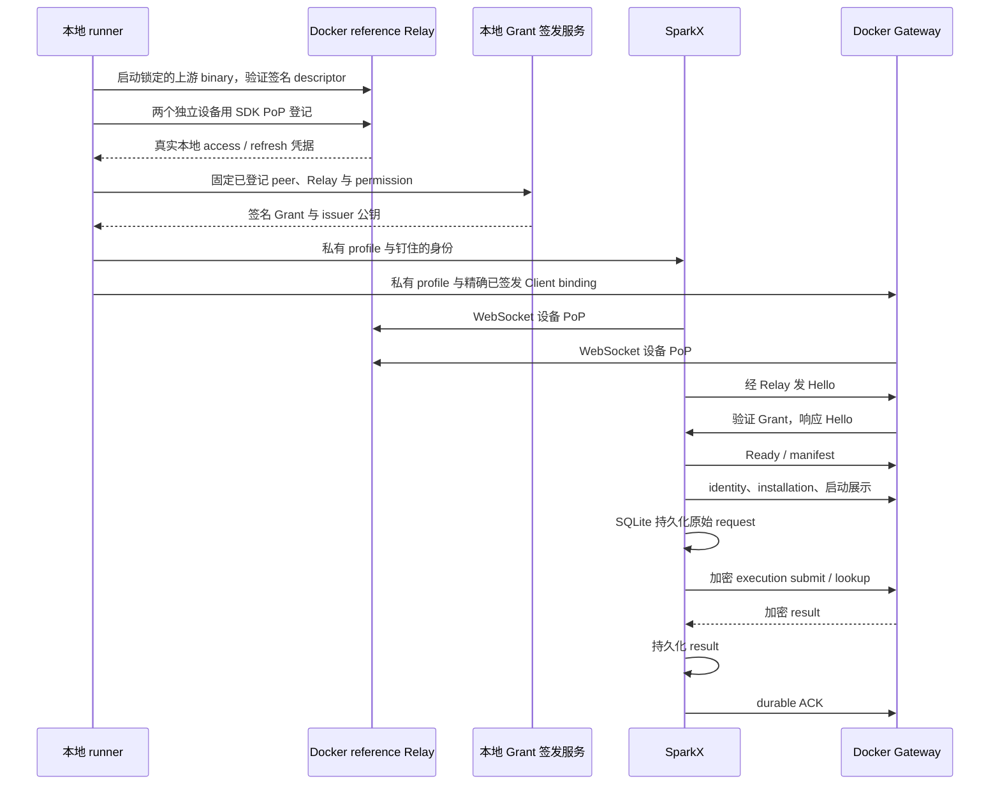

# SparkX 与 SparkClaw 本地 ISCP 联调设计

> 语言：简体中文 | [English](../../docs/desktop-iscp-connection-design.md)
>
> 日期：2026-10-08。状态：基线实现已推送，本地 Docker reference Relay 与已安装 SparkX 的真实后端文本验收通过。自动 Grant 续签已实现；隔离验证、seed Grant 到期后的真实自动恢复、已安装原生窗口交付／重开及 headless 原 request 重连均通过。
> 范围：实现 SparkX／Gateway 本地联调，不使用 InfiniCenter。

初始隔离实验使用独立 Gateway 与 mock 模型；第 10 节将同一本地 Relay 接入用户既有远端 Gateway、真实模型和已安装 SparkX，保留该部署的公网 TLS ingress。

## 1. 当前目标

让真实 SparkX 经独立的本地 Docker 上游 ISCP reference Relay 连接真实 SparkClaw Gateway：校验身份、登记 installation、提交文本 execution、把结果持久化到 SparkX SQLite、发送 ACK，再验证恢复。用户已将联调目标改为此本地 Relay；本实验无需托管 Relay 地址、账号、登记流程或凭据。

不开发官网配对页、短码或二维码入口。runner 生成两个独立设备身份，以签名设备 PoP 调用 reference Relay 的 `bind-self`，取得真实本地 access／refresh 凭据。独立的本地签发服务签发 SparkX → SparkClaw 会话 Grant；两端钉住签发公钥，完成 Hello/Ready、manifest 与端到端业务加密。

```text
真实 SparkX 窗口，或单独标注的桌面 smoke 进程
  → Electron 主进程 ISCP transport
  → 随包 Go helper
  → Docker 内本地上游 reference Relay
  → 独立 Docker 容器内真实 Gateway
  → 现有身份 / execution 服务
```

Relay 从 `services/gateway/go.mod` 锁定的 SDK module 编译，不修改上游源码。Bridge 单测或注入式 Relay 属于隔离证据，真实 Relay 验收分别记录。显式 mock 模型经共享 Gateway runtime 提供可重复的文本结果。

所有加密会话均由 SparkX 发起、SparkClaw 响应。独立签发服务提供初始 Grant，并在显式授权期限内自动续签，不转发业务。两端连接 Relay；Gateway 业务 HTTP 不发布端口。

## 2. ISCP 最新协议核查

2026-10-08 通过 GitHub API 检查了 main、全部远端分支、tag、PR／Issue，并检索规范、schema、SDK 和参考服务源码：

| 项目 | 核查结果 |
|---|---|
| ISCP main | `47f1f6c231c56c92eff6b6c5d398e037ebcf9602` |
| 当前 SparkClaw 的 SDK | `github.com/Infinimesh-ai/ISCP v0.2.0-rc.1`，tag 指向 `fa1d493c278f13e3588ad173c19695c9f5b9ec2d` |
| main 相对该 tag | 仅 `AGENTS.md` 有变化，没有新增协议或 SDK 代码 |
| `v0.2-dev` | 比 main 落后 3 个提交，没有独立领先的改动 |
| ISCP 上游的 SparkClaw／SparkX 专用新协议 | 未发现；此结论仅针对上游仓库。SparkClaw 自身的 WS5 v0.2 接入更新已经合并，见下节 |
| 既有 v0.2 能力 | bootstrap 与 v3 invitation 的角色约束、PoP、会话恢复／reopen／close、grant 生命周期与可选 credential recovery；不是这次新出现的 SparkX 协议 |

因此本地方案继续锁定当前 SDK，不为“可能有新协议”升级依赖。未推送的本地开发或未提供的私有实现不在此次核查范围内。部分 Issue 仍为 open，不能仅凭其状态推断 v0.2 未实现对应内容，应以实际规范及代码为准。

可复查的来源：

- [ISCP 当前源码](https://github.com/Infinimesh-ai/ISCP/tree/47f1f6c231c56c92eff6b6c5d398e037ebcf9602)与[当前 SDK tag 到 main 的比较](https://github.com/Infinimesh-ai/ISCP/compare/fa1d493c278f13e3588ad173c19695c9f5b9ec2d...47f1f6c231c56c92eff6b6c5d398e037ebcf9602)。
- [Provisioning](https://github.com/Infinimesh-ai/ISCP/blob/47f1f6c231c56c92eff6b6c5d398e037ebcf9602/spec/provisioning.md)、[Session](https://github.com/Infinimesh-ai/ISCP/blob/47f1f6c231c56c92eff6b6c5d398e037ebcf9602/spec/session.md)、[Relay](https://github.com/Infinimesh-ai/ISCP/blob/47f1f6c231c56c92eff6b6c5d398e037ebcf9602/spec/relay.md)。
- [JingSi ISCPPeer](https://github.com/Chiiz0/JingSi-iOS/blob/4c731d024ccaa3ebef4f497c4a9b6c82090491b5/JingSi/Services/ISCP/ISCPPeer.swift)：参考签名校验、manifest 门禁和重连处理；桌面角色以第 3.1 节为准。
- SparkClaw 的[现有 Bridge](iscp-bridge.md)及[工作台当前契约](workbench-release.md)。

### 2.1 SparkClaw 的 WS5 更新已进入 main

用户提到的完整分支名为 `ws5-iscp-v0.2-phase-a`，位于 **SparkClaw 仓库**。它确实是接入更新版 ISCP 的实现，已于 **2026-08-28 14:38（北京时间）**通过 [`2507e775`](https://github.com/Infinimesh-ai/SparkClaw/commit/2507e775b36fc90dc4fc109cba3122fd17ceac08)（`merge: integrate ISCP v0.2 bridge phase A`）合入 main。

| 分支提交 | 实际内容 |
|---|---|
| [`062338ca`](https://github.com/Infinimesh-ai/SparkClaw/commit/062338ca) | SDK 从 v0.1.0 升到 v0.2.0-rc.1；加入 v3 ticket enrollment、managed Hello/Ready、manifest 门禁及 reopen |
| [`80fe3c47`](https://github.com/Infinimesh-ai/SparkClaw/commit/80fe3c47) | Grant 自动续期与已有设备 Relay 凭据恢复客户端 |
| [`388cdfdc`](https://github.com/Infinimesh-ai/SparkClaw/commit/388cdfdc466baa6badd08e405dda5dcda51bff35) | 手机端 `agent.activity.list.v1` 与 `agent.snapshot.get.v1` 投影 |

本地 Git 祖先检查与 GitHub compare 均确认：分支 tip `388cdfdc` 和合并提交 `2507e775` 都被当前 main `a7ca5fbd` 包含。分支引用仍存在不代表未合并。合并后的 main 还增加了 descriptor 验证、禁止续期扩大权限和未知结果复用幂等键等修复，因此后续以 main 为基线，不切回旧分支。

这次合并涉及 Bridge／CLI／schema／依赖，没有修改 `apps/desktop`。它已提供 **SparkClaw 侧面向 JingSi 的 ISCP v0.2 基础**，但没有完成 SparkX 的 Electron transport，也没有让桌面的 `/api/v1/executions` 自动可经 ISCP 调用。

本地设计应复用上述握手、验证、恢复和加密组件，补齐桌面 initiator、后端 responder、peer 到 Client 的映射，以及当前工作台 operation 接入。将这些基础能力写成需要从零实现是不准确的。

## 3. 本地 Docker Relay、环境与身份

runner 从锁定的 `github.com/Infinimesh-ai/ISCP v0.2.0-rc.1` module 源码编译 `services/relay-reference/cmd/relayd`，仅将 Linux binary 复制到 `gcr.io/distroless/static-debian12:nonroot`。记录 module version／sum、binary SHA-256 和构建后 image ID，不修改 reference Relay 或 SDK 源码。

| 组件 | 配置 |
|---|---|
| SparkX | Mac Electron；独立私有 `SPARKCLAW_DESKTOP_USER_DATA_DIR`；真实 main／preload／SQLite |
| Reference Relay | 独立 Docker 容器；`ISCP_PROFILE=local-lab`；生成 Domain／Relay ID；同时连接 ingress bridge 和 internal 业务网络 |
| 宿主 Relay 接入 | 独立普通 Docker ingress bridge，仅 `127.0.0.1` 发布随机端口；显式 lab profile 才允许 HTTP／WS |
| Gateway Relay 接入 | 本实验 internal Docker network 内的 `http://iscp-relay:8080` 与 `ws://iscp-relay:8080/v2/relay/connect` |
| Gateway | 当前源码 Linux binary；独立 FileStore／execution 状态、固定 deployment／Owner／已签发 Client；不发布业务 HTTP |
| 本地 Grant 签发服务 | 本 lab 管理的长期 Docker 服务，使用私有签名密钥；宿主只发布 loopback 端口，内部 alias 为 `iscp-local-issuer`；管理凭据留在服务端 |
| 模型 | 首轮文本验证显式使用 mock 模型；真实模型验收另行标注 |
| 清理 | `down` 仅删除带本 lab 标签的容器和两个网络；保留私有 profile、SQLite 和证据 |

Docker 29 会忽略只连接 internal network 的容器所发布的端口。因此 Relay 用独立 ingress bridge 提供宿主 loopback 接入，再以 alias `iscp-relay` 连接 internal 业务网络；Gateway 仅连接 internal 网络。Relay 存在普通 bridge 路由，本设计不宣称阻断其出站公网访问。所有业务 profile endpoint 均指向本 lab 的本地 Relay。

HTTP／WS 是明确的 local-lab 例外，普通产品配置仍执行既有 HTTPS／WSS 规则。桌面使用宿主路由，Gateway 使用 Docker 路由，两者访问同一 Relay；私有 lab profile 将这项路由差异显式绑定到经过签名验证的 Relay 身份，不允许任意替换 Relay 或把凭据发送给托管端点。

准备顺序：

1. 在仓库外创建新的私有输出目录，生成两个独立设备密钥及一个本地 Domain／Relay 范围，不导入托管凭据。
2. 启动本 lab 的上游 reference Relay，等待真实 `/readyz` 响应与签名 Relay descriptor。`/relayd healthcheck` 仅正常返回，不能证明 HTTP 已就绪。钉住当前 descriptor signer，连接时验证签名和有效期。
3. 两设备分别通过 `/v2/relay/devices/bind-self` 提交 SDK 签名 PoP，私有保存实际返回的设备绑定 access／refresh。reference local-lab bootstrap 不需要账号授权；这不代表生产登记行为。
4. 本地签发服务签发 subject=SparkX、audience=SparkClaw、confirmation=SparkX 已登记公钥的 Grant；permission 精确为 `sparkclaw.workbench.v1`，包含固定 Relay 约束和有效期。两端钉住这枚独立签发公钥。显式授权该固定 pair 自动续签二十四小时，再启动本 lab 的 issuer 容器并校验其 SDK 签名续签能力描述。
5. 预置活跃的已签发 Gateway Client，将 `(Domain, 桌面 device, key thumbprint, 后端 device)` 精确映射到 `(deployment, Owner, Client, permission)`。Relay 登记或有效 Grant 本身不授予 Owner 权限。
6. 写入独立的 initiator／responder 私有 profile 并显式启用 local-test。密钥和凭据留在私有文件，renderer 只获得公开身份及连接状态。

reference Relay 提供签名 Relay descriptor，但没有 Trust Root discovery 或 Grant 续签服务。其 descriptor signer 与本地会话 Grant 签发者独立。本实验校验当前 Relay signer，从独立本地 issuer 获取签名续签能力，不依赖托管 discovery 或 lifecycle 服务。

### 3.1 桌面发起与验证边界

| 层次 | 行为 |
|---|---|
| Relay 登记 | 两端各自使用 SDK 签名设备 PoP 调用本地 `bind-self` |
| Relay 接收连接 | 两端建立 WebSocket，以设备签名响应 Relay challenge |
| Relay envelope 提交 | SDK 提供设备绑定 access；reference local-lab 接受 bearer，未执行 production HTTP access-proof 强制校验 |
| 加密会话 | SparkX 发第一份 Hello；SparkClaw 校验钉住的 Grant 并响应；双方完成 Ready／manifest |
| 业务调用 | Gateway 逐次重新校验活跃 Client、deployment、Owner 和 installation 后调用既有 handler |

不能把这个 local profile 视为生产 HTTP PoP 拒绝、actor 授权登记、TLS 或云端 Grant renewal 验收。它实际覆盖登记 PoP、WebSocket challenge、透明 envelope 路由和双方验证的加密业务；隔离测试另行覆盖错误签名、Grant／角色绑定、重放、到期、撤销和响应丢失。

初次连接与重连角色均固定，拒绝角色／Grant／身份不匹配。会话丢失后 SparkX 发新 Hello；后端保持接收连接，等待桌面发起。

锁定的 reference Relay 使用队列 drain 接收方式：每次 WebSocket 鉴权后发 `ready`、取出当前已排队 envelope、发 `drained`，随后关闭。Go 的 credential-only local-lab adapter 一秒后再次轮询。正常 `drained` 只结束本轮，保留加密 session 与唯一的逻辑 receive-ready callback；真正的 socket／协议／鉴权失败仍结束该生命周期并触发恢复。间隔为 reference 服务共享的每 IP 每分钟 120 请求限额留出空间。production streaming 行为不变；这是本地 reference 服务适配，不修改协议。

### 3.2 本地签发服务与 Relay 生命周期

使用既有 [SDK 签发服务](../../services/gateway/internal/iscplocalissuer/issuer.go) 的 `trust.SignGrant`／`trust.VerifyGrant`，独立测试签名密钥、随机 loopback 管理凭据、固定设备／permission／Relay，默认 Grant 三十分钟。审计日志只保留 Grant ID 和指纹，不记录完整凭据或业务内容。仓库及应用包外的目录为 `0700`，文件为 `0600`。

Relay access 与会话 Grant 独立：reference Relay 签发十五分钟 access 和二十四小时 refresh，双方另行验证本地签名的会话 Grant。enrollment 和 refresh 有效时，过期 access 可刷新。本地 Grant 通过独立钉住的本地 issuer 续签，不请求托管服务。停止 issuer 或撤销续签授权会阻止后续签发，已有有效 Grant 仍到自己的有效期才失效；Gateway Client binding 撤销则另行取消会话和交付。

未经修改的 reference Relay 每次启动都会生成新的 descriptor signer；未配置数据库时，设备、凭据与队列只在内存中，本实验使用此默认值。客户端／Gateway 重连时应保持 Relay 进程，Relay 故障测试用 pause／unpause 或断开 peer。重启或重建 Relay 会使旧 signer pin 与凭据失效，需要在新目录重新 `prepare`；`down` 明确结束该 Relay 生命周期。Gateway FileStore 和桌面 SQLite 独立持久化，其重启恢复与 Relay 队列持久性须分别判断。

参考锁定版本的 [Relay 源码](https://github.com/Infinimesh-ai/ISCP/blob/fa1d493c278f13e3588ad173c19695c9f5b9ec2d/services/relay-reference/internal/relay/server.go)、[relayd 入口](https://github.com/Infinimesh-ai/ISCP/blob/fa1d493c278f13e3588ad173c19695c9f5b9ec2d/services/relay-reference/cmd/relayd/main.go)和[Relay 规范](https://github.com/Infinimesh-ai/ISCP/blob/fa1d493c278f13e3588ad173c19695c9f5b9ec2d/spec/relay.md)。

### 3.3 自动 Grant 续签

[Grant lifecycle client](../../services/gateway/internal/iscpbridge/grant_lifecycle_client.go)、[本地 issuer lifecycle](../../services/gateway/internal/iscplocalissuer/renewal.go)和 [Endpoint worker](../../services/gateway/internal/iscpworkbench/grant_lifecycle.go)实现设备自行续签。Grant subject SparkX 使用 SDK device PoP 与 `Idempotency-Key`，向钉住的 issuer 调用标准 `POST /v2/relay/devices/auto-renew-grant`。请求携带设备 identity 与 `identity_proof`，不使用 Relay access token 或 issuer 管理 token；只有固定 subject 可续签。Responder 同样用设备 PoP 和幂等键调用 `POST /v1/grants/current` 获取该 pair 的当前签名 Grant。Current 是本地 issuer 补充接口，不是 reference Relay 已有接口，也不签发新 Grant。

调用前，`GET /v1/renewal-capability` 必须返回真实 SDK `SignedDescriptor`（`iscp.signed_descriptor.v2`），内部是 `TrustRootDescriptor`（`iscp.trust_root.descriptor.v2`）。客户端使用钉住的 issuer 公钥验证签名、最长五分钟的 descriptor 有效期，以及固定 Domain、issuer／key、Relay、subject／audience pair 和 `sparkclaw.workbench.v1` permission。独立的 Grant 连续性检查固定 confirmation key、禁止 revocation epoch 回退，并拒绝扩大 TTL。签名 metadata 明确续签 purpose、`grant_renewal=true` 和绝对 `authorization_expires_at`；自定义 capability 对象或扩大的范围会被拒绝。

初始 Grant 为三十分钟，进入最后 TTL/5 窗口后可续签，默认即到期前六分钟；worker 通常每十秒检查。显式授权的二十四小时截止是绝对时间，续签不延长授权，不扩大权限、设备、Relay 约束或原 TTL。临近授权截止时，issuer 可签发更短的最后一枚 Grant，其 expiry 不超过授权截止。撤销续签只阻止后续签发，当前有效 Grant 仍仅能使用到自身 expiry。续签失败进行有界重试；没有有效 Grant 时正常到期并关闭连接。

未知续签结果始终对应同一个逻辑请求。客户端在发送前私有持久化原始请求字节、设备 proof 和幂等键；响应丢失、进程重启与 HTTP 429 都重试原请求，并遵循 `Retry-After`。Endpoint 验证返回的 Grant，原子保存后才调用 `CommitRenewal` 清除 pending。保存与 Commit 之间崩溃，会重放原续签，不创建新请求。若成功缓存响应在长期断网期间已到期，仍须验证其签名与固定授权范围，才能结束该已完成请求并发起新的续签；过期结果不授权业务，被篡改响应不能清除 pending。独立 worker 更新 Grant，保留当前加密 session、原 execution request ID、持久化 fence 与 ACK 状态；之后新 Hello 才使用新 Grant ID。过期的磁盘 seed 只能在获取并验证当前有效 Grant 后恢复，不能单独授权业务。

私有 helper 可选配置为：

```json
{
  "grant_renewal": {
    "url": "http://127.0.0.1:19091",
    "pending_file": "/absolute/private/grants/renewal.pending.json",
    "poll_interval_seconds": 10
  }
}
```

`url` 为 issuer 的 base origin，不含 API path。隔离 lab 的桌面使用宿主发布的 loopback origin，Gateway Docker profile 使用 `http://iscp-local-issuer:8080`；两端各有独立 pending 文件。Grant 与 enrollment 存储需要独立私有可写目录，分别支持 Grant 原子替换和 SDK 凭据轮换；密钥与 profile 可继续只读。文件权限为 `0600`，目录为 `0700`。续签路径、proof、管理凭据与私钥不进入 renderer 状态；正常持久启动选择无需新增环境变量。

## 4. 已实现的产品改造

| 位置 | 实现 |
|---|---|
| 桌面认证与 profile | 显式私有 ISCP 配置、固定 initiator、独立凭据 schema 和公开身份绑定；首次导入仅在 identity／installation 验证通过后公开工作台 scope |
| 本地测试签发服务 | [SDK 签发器](../../services/gateway/internal/iscplocalissuer/issuer.go)和 [CLI](../../services/gateway/cmd/iscp-local-issuer/main.go)；固定 pair、签名续签 capability、PoP／幂等 lifecycle、绝对授权截止及脱敏签发 journal |
| 桌面 transport | [私有 helper 管道与固定操作映射](../../apps/desktop/src/main/iscp-transport.mjs)；期限、版本／能力／身份校验、有界调用、generation 隔离、休眠／退出清理 |
| Go helper | [Initiator 入口](../../services/gateway/cmd/iscp-workbench/main.go)和[加密 endpoint](../../services/gateway/internal/iscpworkbench/endpoint.go)；固定开发／安装包路径、SDK Hello／Ready、manifest、重放校验、存活超时与新会话重连 |
| Gateway responder | [认证操作适配器](../../services/gateway/internal/gateway/workbench_iscp.go)；固定 peer 映射到有效已签发 Client，校验 deployment／Owner／installation，撤销时取消会话，调用现有进程内业务 handler |
| 文本运行时与 UI | admission 前拒绝文件／附件，运行时移除外部工具，SparkX 禁用邮件／文件／审批／Browser Host／语音／设置请求 |
| runner 与安装包 | [私有实验 runner](../../scripts/iscp-local-lab.mjs)、[helper 构建](../../scripts/build-iscp-helper.mjs)、Mac／Linux 包资源及可执行文件／hash 审计；当前源码的隔离 Linux 后端、独立 SparkX SQLite，不发布业务 HTTP 端口 |

ISCP 按 transport 校验；HTTPS 仍使用原有 LAN descriptor 和 TLS pinning。Relay token 与私有路径留在主进程／helper 配置中，不写入 Gateway bearer 字段或 renderer 状态。

本地测试模式要求两端显式开关。runner 使用正常 SparkX 主进程／preload／renderer 和 `ClientStore`／`ExecutionClient`／`ScheduleClient`，不使用 `--qualification`。后端复用共享 runtime 并限制为纯文本 execution scope；其他 transport 保持原有工具行为。桌面恢复只并发一个查询，给必需的启动展示请求保留四个 RPC 槽中的三个。

旧手机 `agent.message.send.v1` 与桌面 execution 分开。会话／context 留在 SparkX 本地；Gateway 按现有持久化合同保存执行控制和结果。

文本 profile 保留会话选择，Browser Host 操作仍不可用。UI 能处理不可用的 browser state，不假定它包含 journal 数组；首次 Send 与会话选择已有回归覆盖。

## 5. 业务协议与第一条链路

已实现的应用 profile 为 `sparkclaw.workbench.transport.v1`，授权权限为 `sparkclaw.workbench.v1`。[操作 registry](../../services/gateway/internal/iscpworkbench/protocol.go)属于 SparkClaw，不是上游 ISCP 标准。

握手固定为桌面发起、后端响应，通过官方 managed handshake envelope 交换 Hello／Ready，随后交换加密 capability manifest。通过 `task.invoke`／`task.result` 承载固定 operation ID、request ID、参数／结果和错误；不能将未认证的 owner/client 字段当作权限来源。

第一阶段只承诺以下能力：

| operation ID | 复用的后端业务 |
|---|---|
| `workbench.identity` | `GET /api/workbench/identity` 校验 deployment／Owner／Client |
| `installation.bind` | `POST /api/v1/installations` |
| `presentation.config` | `GET /api/config` |
| `presentation.owner` | `GET /api/owner` |
| `presentation.ready` | `GET /readyz` |
| `execution.submit` | `POST /api/v1/executions`，保留原 request ID 与输入 digest |
| `execution.lookup` | `GET /api/v1/executions/{request}` |
| `execution.cancel` / `execution.ack` | 现有显式取消与持久化结果确认 |

SparkX 等待三项 presentation 完成再启用发送。未支持的启动 API 不发请求，也不伪造成功空响应。固定操作携带可信 principal，在进程内调用已有 Gateway handler，不转发任意 HTTP 请求。

第一轮以无附件、短文本、无需浏览器与外部工具的任务验证闭环。未接入的邮件、文件、审批、Browser Host、实时语音通过 capability 明确标记不可用，不偷偷走 HTTP 直连，也不宣称完整工作台已支持。



“connected”要求 Relay 可用、后端 session Ready、manifest 匹配、Client binding 有效、identity 和 installation 都成功。仅 Relay WS 在线不能显示后端已连接。

测试 profile 限制明文请求／响应帧为 64 KiB、请求 body 为 63,488 字节、并发为四个、请求期限为 30 秒。超限输入在持久化请求标记 submitted 和 Gateway admission 前拒绝；超限响应显式返回 413。helper 管道以 base64 传递原 body，Go endpoint 按原始解码字节嵌入，保持持久化输入 digest。临时传输限额不改变 `configs/workbench-limits.json`；大 context／结果／文件需要后续分块／credit。本地 reference Relay 的 envelope 限额独立存在，需用实际 transport 验证，不能从明文上限推断。

## 6. 断线与认证边界

- SparkX 负责有界重连退避。断线／休眠／profile 切换／退出推进 generation 并丢弃 session key；须重新完成 Hello／Ready／manifest 和身份／installation 后才恢复业务就绪。
- submit 响应丢失保留原 request ID，仅做 lookup，即使返回 404 也不重新生成或提交。durable ACK 重试保持既有语义；Relay receipt 不等于业务 ACK。
- 分别测试 peer 断开、Gateway 重启和本 lab Relay pause／unpause，均不能错误显示已连接。Relay 默认 signer 和凭据不持久化，恢复测试须保留进程。
- 错误 Domain／audience／thumbprint／permission／有效期／binding 不能进入业务 handler；binding 撤销关闭会话和交付。
- 自动续签成功只更新授权，不重置当前 session 或 execution。续签撤销与绝对授权截止阻止后续签发，已有有效 Grant 正常到期；续签失败不能偷偷延长有效期。
- deployment／Owner／Client／installation 数据相互隔离。切换身份不合并或删除既有 SQLite；离线 schedule 保持 missed 语义。
- 初始文本 profile 不提供 Browser／mail／file／approval／speech 能力。

## 7. 联调步骤与验收门槛

| 阶段 | 工作 | 退出条件 |
|---|---|---|
| L0 准备 | 构建锁定上游 Relay，隔离网络／存储，生成登记设备，签本地 Grant，预置 Client | 当前签名 descriptor 和实际 PoP 登记通过；两个私有 helper profile 有效；普通配置拒绝 lab mode |
| L1 真实 transport | 实际 reference Relay 连接 desktop helper 与 Gateway responder | 新 Hello／Ready／manifest 及身份／installation 完成；Gateway 业务 HTTP 无发布端口 |
| L2 桌面文本 | 真实 SQLite submit／lookup／persist／ACK；另验普通窗口 | result digest 与 FileStore durable ACK 一致；SQLite 重启保留；正常窗口可见持久化结果 |
| L3 故障 | peer 重启、Gateway 丢失、Relay pause／unpause；隔离响应丢失／到期／撤销 | 新握手恢复原 request，无重复 admission 或过时 generation 泄漏；准确区分每项已测故障 |
| L4 扩展 | 分块文件、审批／事件、mail、Browser Host；speech 独立 | 权限、journal 和资源限制完成后才逐项启用 |
| 后续 | 官网配对、生产登记／issuer／TLS 与 managed lifecycle | 本实验之外单独实现和验收 |

保留 module／image／binary 身份、脱敏 profile scope、真实 Relay 连接 metadata、Gateway 唯一 admission、桌面 SQLite result／ACK 与故障转换。截图单独证明普通窗口验收。公开证据不得保留 token、密钥、完整授权包或敏感业务内容。

通过不向 SparkX 发布 Gateway 业务 HTTP、检查本 lab Relay 实际设备连接，并只中断本 lab Relay 或 peer 来证明路由。界面成功或日志出现 ISCP 字样均不足。真实本地 Relay 不等于公网性能或生产生命周期验收。

## 8. 已完成的实现与验证

| 检查 | 结果与边界 |
|---|---|
| 本地签发服务 | SDK 实际签名、固定 peer／permission／Relay／TTL、私有文件与审计／管理鉴权拒绝隔离测试通过 |
| 加密 transport | SDK Hello／Ready／manifest、加密 RPC、签名 discovery、PoP、重放／角色／binding 拒绝、过期／重连、并发／大小／deadline 和 helper 退出隔离测试通过 |
| Gateway execution | 加密 Endpoint 到真实 FileStore／共享 runtime，使用 mock 模型；丢失 acceptance 依原 request 恢复、admission 唯一、result／ACK 持久化，Client 撤销关闭交付 |
| SparkX | SQLite reopen、恢复／ACK retry、启动容量、身份 generation fence、capability gate 和无 HTTP fallback 的桌面／UI 测试通过 |
| 仓库验证 | 隔离 Linux 全 Go、含旧队列会话恢复的 focused race／vet、Go build、desktop tests、WebChat 220 tests／build、契约／managed script 与双语 Markdown 检查通过 |
| Mac 打包 | Mac arm64 `--dir` 构建及 helper executable／package hash 审计通过 |
| 实际 Docker reference Relay | 基线 `test:iscp-docker` 3/3 通过、零跳过、约 34.5 秒；正常／重连正向回复、Gateway 唯一 fence／digest 对照、durable ACK、零业务 HTTP fallback、缺签 PoP 与 signer 变更拒绝通过 |
| 原生窗口 | 正常 Electron／原生 OS 安全存储：新会话 Send 获得正向 mock 回复；桌面 SQLite 与 Gateway control 的 request／digest、delivered 和 durable ACK 一致 |
| 自动续签隔离验证 | 真实本地 HTTP issuer 加加密 test bus，使用十秒 Grant：跨原 expiry 后业务继续，新握手使用续签 Grant；撤销续签阻止后续签发，随后 Grant 正常到期；未知请求原字节重放和保存后 Commit 验证通过 |
| 续签 runner／安装包 | 更新后的实际 Docker suite 6/6 通过、零跳过、约 36 秒，含长期 issuer 与正常／重连正向回复；未等待默认三十分钟到期。Desktop 148/148 及首版续签 Mac arm64 helper／源码／私有文件包审计通过 |
| 真实续签部署 | 过期 seed 自动恢复，仅新增一次签发；已安装原生任务／ACK 与重开通过。独立 headless 原 request 恢复通过，仅一次 submit、零业务 HTTP fallback；见第 10.1 节 |

2026-10-08 的原生窗口正向验收使用锁定上游 module checksum `h1:d2Epn12InLrGF6nOZ5aEGat5CFxryKRKYbOzEbIRg6A=`，当次本地 Relay 为 `http://127.0.0.1:51206`（动态分配地址）。两设备完成实际 PoP `bind-self`。在正常 Electron 窗口新建会话，Send `Hello.` 后看到 57 字节 mock 回复 `I can answer this directly from the current conversation.`。

桌面 SQLite 与 Gateway execution control 对照一致：request `2e891278-1c76-4e56-b670-9d23d98592a7`，input digest `ed0fece805be41170e1e5af71920dce5c1afbd762d59f9e0921f7ad1ccaa2324`，result digest `ec703604349a3ed72fd6a651869a045630994591edb9ecf544d3bfddfe40ab3c`，状态 delivered，durable ACK 成功。私有回执为 `<lab>/evidence/native-ui.json`。随后 SparkX 已 Cmd-Q 退出，lab 的 Relay／Gateway 保留运行；正向验收全程未重启内存 Relay。

正向验收同时检查 answer outcome 和持久化交付。早期 `semantic_coverage_low` Blocked 回执只证明 transport delivery，不计入正向回复证据。helper 关闭／重启 smoke 独立验证新的 `transport_ready`、原 request 恢复、一次 submit 和零 Gateway 业务 HTTP。

基线自动 Docker 轮次三项全过、零跳过，用时约 34.5 秒。正常与重连均获得 57 字节正向回复，`successful_mock_answer=true`、`submit_count=1`、`lookup_count=2`、`ack_count=1`、`direct_gateway_http_calls=0`。每个原 request 只有一个 delivered Gateway fence，input／result digest 一致。故意重启其一次性 reference Relay 后，测试重新 inspect 动态宿主端口，重登记明确拒绝 `local Relay signer changed`，并确认原 enrollment 凭据未被改写。本机测试日志为 `/tmp/sparkclaw-iscp-local-docker.log`。

Node.js 锁定 26.2.0，Go 验证使用 1.25.12。Linux 检查使用当前源码并清除退休的 runtime image browser 变量。未改变 store interface。上述隔离 Docker 验收使用显式 mock 模型，经真实共享文本 runtime；第 10 节单独记录已安装 SparkX 与既有远端部署的真实模型验收。

## 9. 运行私有本地实验

在仓库根使用 Node.js 26.2.0、Go、Docker 及已安装 workspace 依赖，先构建 UI／helper：

```sh
npm run build:webchat
npm run build:iscp-helper
```

将[输入示例](../../configs/iscp-local-lab.input.example.json)复制到仓库外的绝对路径私有文件，权限设为 `0600`，选择 deployment／Client ID。初始 lab Owner 固定为 `owner`。schema 如下：

```json
{
  "schema_version": 1,
  "relay_profile": "local-lab",
  "deployment_id": "sparkclaw-iscp-local-test",
  "owner_id": "owner",
  "client_id": "sparkx-iscp-local-test"
}
```

runner 自动生成 Domain／Relay／device ID 及全部密钥／凭据。无需托管 enrollment 文件，不导入托管 access token。

```sh
npm run iscp:lab -- prepare --input /absolute/private/input.json --directory /absolute/private/new-iscp-lab
npm run iscp:lab -- up --directory /absolute/private/new-iscp-lab
npm run iscp:lab -- smoke --directory /absolute/private/new-iscp-lab
npm run iscp:lab -- smoke --directory /absolute/private/new-iscp-lab --reconnect
npm run iscp:lab -- run --directory /absolute/private/new-iscp-lab
npm run iscp:lab -- down --directory /absolute/private/new-iscp-lab
```

`prepare` 拒绝已有输出目录，构建锁定上游 Relay，启动独立的 ingress／internal Docker network 与 Relay，验证当前 discovery，以 PoP 登记两个设备，签初始会话 Grant，显式授权固定 pair 二十四小时，并启动本 lab 的长期 issuer 容器。Issuer 复用钉住的 distroless runtime image，仅发布随机回环宿主端口，并以 `iscp-local-issuer` 加入内部网络。私有 profile 包含对应 issuer 路由与独立 pending 文件。准备后 Relay 与 issuer 保持运行；管理 token 不复制到 helper profile。

`up` 验证既有 Relay／issuer 生命周期、签名续签 capability 与私有 profile，为 Docker 的 Linux 架构构建当前 Gateway，并替换独立 Gateway 容器，不发布业务 HTTP。它不延长授权、不清除撤销状态，也不手工重签 Grant。缺少受管 issuer 元数据的旧 lab 须重新 `prepare`；issuer 变更或停止不会被静默替换。runtime image 必须可用；它提供运行依赖，而不是使用旧 Gateway binary。命令结束后 Gateway 保持运行。显式清空 image 派生的退休 browser 变量，将 model capacity catalog 设为挂载的当前源码。

`smoke` 和 `run` 先执行 `up`。`smoke` 使用实际桌面 SQLite／ISCP transport 连接正在运行的 reference Relay 和 Gateway；`--reconnect` 还验证新的桌面 transport session 与原 request 持久化状态。

headless smoke 与正常窗口共享 `<lab>/userdata/workbench` 中同一个业务 `ClientStore`，包括 SQLite、installation ID、原始 request 和 receipt；runner 显式传入 `--client-store-directory`。headless 的 AES 测试 vault 位于 `<lab>/smoke-userdata`，普通 SparkX 的 OS vault 位于 `<lab>/userdata`。

`evidence/smoke.json` 保存最终结构化摘要，`smoke.ndjson` 保存脱敏事件，`smoke-normal.json`／`smoke-reconnect.json` 分别保留对应摘要。`run` 用该私有连接 profile 和共享业务 Store 启动普通 SparkX，不使用 qualification mode 或直接 HTTP 执行。

一个 Gateway Client 绑定一个 installation，headless 与正常窗口必须顺序运行。私有 `desktop-launcher.json` lease 使 `up`、`smoke` 和 `down` 在本 lab 桌面仍活跃时要求先退出，保持 Store 和 peer 的独占使用。

明确选择的私有 profile 也可在正常 Finder 启动后保留。在 SparkX 默认 user-data 目录写入权限为 `0600` 的 `iscp-launch-profile.json`，schema 为 `{ "schema_version": 1, "test_mode": true, "profile_path": "/absolute/private/desktop-profile.json", "user_data_directory": "/absolute/private/userdata" }`。文件父目录与专属 user-data 目录必须由当前用户持有，权限为 `0700`，且不得包含符号链接。选择文件仅含路径；凭据仍保存在私有 helper profile 与 vault 中。显式 launcher 环境变量优先于持久选择。Qualification 忽略该文件；无效选择会阻止启动。删除选择文件即可恢复原默认连接和数据目录。

| Peer | 显式私有测试开关 |
|---|---|
| SparkX | `SPARKCLAW_DESKTOP_ISCP_LOCAL_TEST=1`、`SPARKCLAW_DESKTOP_ISCP_CONFIG=<lab>/desktop-profile.json`、`SPARKCLAW_DESKTOP_USER_DATA_DIR=<lab>/userdata` |
| Gateway | `SPARKCLAW_WORKBENCH_ISCP_LOCAL_TEST=1`、`SPARKCLAW_WORKBENCH_ISCP_CONFIG=/lab/gateway-container-helper.json`，匹配 deployment 与已签发 Client provisioning |

先用 Cmd-Q 退出 SparkX，再执行 `down`；关闭 Mac 窗口只会隐藏。`down` 清理本 lab 的 Gateway／issuer／Relay 容器和两个网络，保留私有状态与证据，结束内存 Relay 生命周期；下一轮在新目录 `prepare`。构建期间 image／module 下载可能需要网络，运行中 peer 与续签 profile 均指向本 lab 服务，不依赖托管 Relay。自动续签仅在原先显式的二十四小时授权内运行；到期或撤销不会使 `up` 延长授权。

隔离检查与 Docker 验收独立执行：

```sh
npm run test:iscp-lab
npm run test:desktop
npm run test:webchat
npm run check:desktop-managed-scripts
go build ./services/gateway/...
go vet ./services/gateway/...
```

实际 Docker 验收需显式单独执行：

```sh
npm run test:iscp-docker
```

它建立并清理自己的本地 Relay／issuer／Gateway／network，验证 issuer 仅发布回环端口、固定 pair 的 capability 与 `up` 前后不变的授权，并测试实际设备登记及缺少签名 PoP 时 HTTP 401 拒绝。正常与重连业务须获得正向 mock 回复、Gateway 唯一 admission 及一致的 input／result digest。最后重启其一次性 reference Relay，要求拒绝变更的 descriptor signer 且不覆盖 enrollment。此项约三十六秒的 suite 未等待默认三十分钟 Grant 到期；十秒真实 issuer／加密 bus 测试提供独立的跨到期证据。

完整 Gateway execution 测试按既有 workspace 契约在 Linux 执行；隔离 fixture 的合成凭据不发送给托管服务。

## 10. 已安装 SparkX 与既有远端后端验收

2026-10-08，实现提交 `a0f48a3ec33df511ff2794a55ad61cfae1cfdcc2` 已推送到 `main`；`210.16.177.239` 的 `/home/ubuntu/SparkClaw` 通过 `git pull --ff-only` 同步。实际 Gateway 与匹配的 WebChat 已升级为 `sparkclaw-gateway:iscp-a0f48a3e`、`sparkclaw-webchat:iscp-a0f48a3e`。保留原 deployment `431c00ce-b780-42e3-9d25-c25c87c8c011`、Owner、PostgreSQL 状态、模型配置、workspace、TLS 和既有 Client；为本轮评测新增已签发 Client `sparkx-iscp-remote-8143225e` 与两个独立 Relay 设备。

评测复用已运行的本地 reference Relay `http://127.0.0.1:51206`，没有在服务器另起 Relay，也不使用托管 Relay。后端通过受控 TCP 链路连接同一个钉住身份的 Relay：

```text
已安装 SparkX → 本地 Docker reference Relay
远端 Gateway → 其 Docker bridge 上的 iscp-relay:28881
  → 远端 loopback TCP 43569 → SSH reverse forward
  → Mac loopback TCP 53006 → Docker TCP forwarder → 同一 reference Relay
```

forwarder 只转发 Relay TCP 流量，不解释业务请求或持有凭据。独立源地址为 reference Relay 共享的每 IP 轮询限额留出空间；SDK 登记、签名 Relay pin、固定 peer、加密 Hello／Ready 与业务权限校验仍生效。公网 `https://210.16.177.239:18790` 继续使用既有 CA 验证，健康检查正常；本轮桌面 execution 不经该 HTTPS transport。

`/Applications/SparkX.app` 已更新为通过审计的 Mac arm64 包，内含 helper。持久私有启动选择使正常启动直接使用 ISCP，无需环境变量或 qualification mode。专属 user-data 是新的 Client scope；旧 HTTPS 数据与原安装应用已备份，没有导入新 scope。本轮不代表旧 R3 历史迁移或完整工作台能力验收。

| 验收 | 实际结果 |
|---|---|
| 真实模型与状态 | 加密 `presentation.ready` 返回 `model_mode=external`、`state_backend=postgres` |
| submit 响应丢失后重连 | 真实模型回复 `Hello! How can I help you today?`（32 字节）；新 helper session 恢复原 request，一次 submit、三次 lookup、一次 ACK、零 Gateway 业务 HTTP 直连 |
| 已安装原生窗口 | 中文文本任务获得 174 字节正向真实模型回复，使用原生 OS 安全存储与持久启动选择 |
| 持久结果 | 原生 SQLite 与真实 Gateway control 的 request `ace0b350-665d-4156-8976-6442e4385a01` 均为 delivered，输入／结果 digest 一致，交付已 ACK |
| 凭据轮换与正常重启 | 强制经过 SDK refresh，确认轮换凭据写入独立可写 enrollment mount，再通过持久选择重开已安装 SparkX，恢复原中文会话，新真实模型任务返回 `重启验证通过。` |
| 恢复准备 | 升级前保存原容器／image 配置、PostgreSQL custom dump 和 memory／control archive；dump catalog 验证通过 |

原生结果 digest 为 `a89abc0a64c1a03dd756664b083b36fb3b0baf82e161b481673ef7a9d2468340`。私有评测目录是 `/Users/dev/.cache/sparkclaw-iscp/remote-switch-20261008-8143225e`，其 `evidence/native-real-model.json`、`evidence/native-after-restart.json`、`evidence/real-model-reconnect.json` 与 NDJSON 分别保留回执。远端备份是 `/home/ubuntu/sparkclaw-backups/20261008-before-iscp-8143225e`。秘密及机器专属部署脚本均不进入 Git 或应用包。升级执行 PostgreSQL migration 18，旧 binary 会拒绝该 migration ledger，不能仅替换 binary 回滚；恢复旧版本需配套数据库与状态备份。

enrollment 存储必须可写，供 SDK 轮换凭据。最初远端评测把全部私有配置只读挂载，首次 refresh 会轮换服务端凭据却无法写回本地。现已用独立私有 `gateway-credentials` 目录可写挂载到 `/run/sparkclaw/iscp-credentials`，密钥和 profile 仍只读。同一设备通过签名 PoP、沿用原 Relay pin 重新登记后，立即强制 refresh，确认磁盘上 access 有效期更新且 refresh 凭据改变；`evidence/credential-refresh.json` 保存检查。隔离本地 runner 原本已可写挂载私有 lab 目录。私有 `renew-grant.mjs` 是基线阶段临时采用的手工续签流程，现以 `renew-grant.obsolete.mjs` 保留；不是第 3.3 节已实现的自动 lifecycle，也不是持续要求退出重启的机制。

当前仍是显式的纯文本 local-test profile，邮件、文件、审批、Browser Host 和语音不可用。需保持当前内存 Relay、Docker TCP forwarder、SSH control connection 与远端 user-service TCP link 运行；重启 Relay 会使 signer pin 与 enrollment 失效。普通 lab `up`／`down` 管理的是隔离 mock Gateway，不管理本轮远端评测，不能用它们刷新或关闭远端链路。常规远端 Compose 重建也需要重新应用私有 ISCP 评测配置。上述基线结果证明真实后端文本执行与交付，不代表生产登记、自动续签部署验收或完整产品发布。

### 10.1 自动续签部署验收

当前部署使用 Mac LaunchAgent 管理的 issuer，地址为 `http://127.0.0.1:59365`。Gateway 经 Docker proxy `iscp-local-issuer:28882` 与远端回环 SSH reverse 端口 `43259` 访问同一 issuer；此链路独立于上面的 Relay TCP 路由。Issuer 保留私有签名密钥、管理凭据、固定 pair 授权和撤销状态。两端 helper 使用 device PoP 与私有可写 Grant／pending 存储。远端 `gateway-grants` 挂载到 `/run/sparkclaw/iscp-grants`，独立于可写的 `gateway-credentials` enrollment 目录。二十四小时授权显式且绝对，自动续签或进程重启均不延长它。

首版续签 helper 安装包已通过 Mac arm64 源码／helper／hash／私有文件审计，隔离测试覆盖十秒 Grant 轮换、新握手重连、未知响应原请求重放及续签撤销。长期 Docker issuer suite 6/6 通过，Desktop 148/148 通过；短时 Docker suite 未等待三十分钟 Grant 到期。成功缓存响应已过期时的恢复修正与最终安装版本已在 10.2 节验收；下述首版包 hash 保留为历史验收证据。

远端源码已同步为 `7b8774d4`，Gateway runtime image 为 `sparkclaw-gateway:iscp-renewal-7b8774d4`，没有新增数据库迁移。旧 seed Grant 于 `2026-10-08T10:22:25Z`（北京时间 18:22:25）到期后，正常启动新版已安装 SparkX 自动恢复出 Grant `local-grant-kiqZsxDL9bOJ-LbnevjgSQ`，到期时间为 `2026-10-08T11:14:30.768466Z`（19:14:30），TTL 仍为 1800 秒。两端磁盘 Grant 的签名与 ID 相同，issuer issuance 从 2 增至 3，仅新增一次，pending 已清除。全程未手工签发、未传入新 Grant、未重启 Relay。原绝对授权截止仍为 `2026-10-09T10:38:40.850816Z`（次日 18:38:40）。

原生请求 `f1624451-2dba-4936-bb09-2e526303661c` 返回 27 字节真实模型回复 `续签链路验证通过。`；installation `f0671ef3-354b-4ec4-b5a4-f581c7604359` 沿用。桌面 SQLite 与远端 control 均为 delivered，input／result digest 一致，ACK 为 true。私有回执为评测目录内的 `evidence/automatic-renewal.json` 和 `evidence/native-auto-renewal.json`。该次首版 `7b8774d4` 续签验收安装的 helper SHA-256 为 `c829ca585fbfb609535f876451c666209e7782a04be25cb4eb6f60c092420506`，与对应包审计一致。Cmd-Q 后正常重开，已安装 SparkX connected 并恢复该对话，仍使用同一 Grant，issuer issuance 保持为 3；automatic-renewal 回执已包含重启检查。

另一次 headless 验证使用源码 `DesktopAuth`／`ExecutionClient` 和同一个正常业务 Store，vault 为显式 AES 测试适配器，不是原生 OS 安全存储。submit 响应丢失后启动新 helper，恢复原 request `020f3531-8f02-48ab-9e43-b2ad116a5b9f`，获得 30 字节真实模型回复 `重连与续签验证通过。`，`helper_generations=2`、一次 submit、四次 lookup、一次 ACK、零 Gateway 业务 HTTP 直连。持久化 input／result digest 一致，交付已 ACK；helper hash 与上面安装包一致。独立私有回执为 `evidence/renewal-real-model-reconnect.jsonl` 和 `evidence/renewal-real-model-reconnect-durable.json`。这些真实结果补充短 TTL 隔离跨到期测试，并保留原生窗口与 headless 的证据类别区分。

### 10.2 长期断网恢复修正与最终安装版本

修正 `231cb875` 避免未知响应恢复时反复获取已经过期的成功缓存。历史有效、经过严格验签的续签成功结果可以结束原请求，返回空 Grant，不授权业务，并允许下一次尝试重新续签。重启测试覆盖原字节重放、持久化结束与新 key／body；伪造签名、改变 pair／scope／confirmation、epoch 回退、TTL 增大或 expiry 未延长时，pending 字节保持不变。磁盘上更新的授权基线也不会回退。修正后三个包 ISCP bridge、workbench 与 helper 的完整 race 测试及 vet 均通过。

最终 Mac 包为 `/Users/dev/.cache/sparkclaw-iscp/packages/grant-renewal-recovery-20261008/mac-arm64/SparkX.app`，已安装到 `/Applications/SparkX.app`。helper SHA-256 为 `9ae57b96cc0acf7d518bcb877aeb7faa827b980c60006e5c15829c135b5d69bc`；ASAR 仍为 `9edb6ac886013297d1d237a80671f860e0df4d29b54727de36f6fe7824ae18f4`。审计确认 41 个客户端源码／helper 文件匹配当前源码，69 个 ASAR entry 与五个 UI 文件符合包 allowlist，包内没有私有配置或密钥。私有打包回执区分了编译时 VCS 元数据（`7b8774d4`，已包含稳定恢复修正的 modified 状态）与审计对应的已提交源码 `231cb875`。

远端 Git 源码已同步 `231cb875`；健康的 Gateway image `sparkclaw-gateway:iscp-renewal-231cb875` 内二进制 SHA-256 已验证为 `692acf7f9b21552306697dcc501305e9826fb2cb06309ffe8a37adeb5f0c723f`。更新保留私有 Grant／enrollment 挂载、issuer 授权、部署数据与运行中的 Relay。最终已安装原生应用的请求 `32bf4f62-5c0c-4686-a33e-a68ab4765839` 收到真实模型回复 `续签最终版本验证通过。`，桌面 SQLite 与远端 execution control 均为 delivered，digest 一致且持久 ACK 已确认。私有评测目录中的回执为 `evidence/renewal-recovery-deployment.json` 与 `evidence/native-renewal-final.json`。本次没有新增数据库迁移，仍保持既有 text-only local-test 范围与服务运行生命周期要求。
