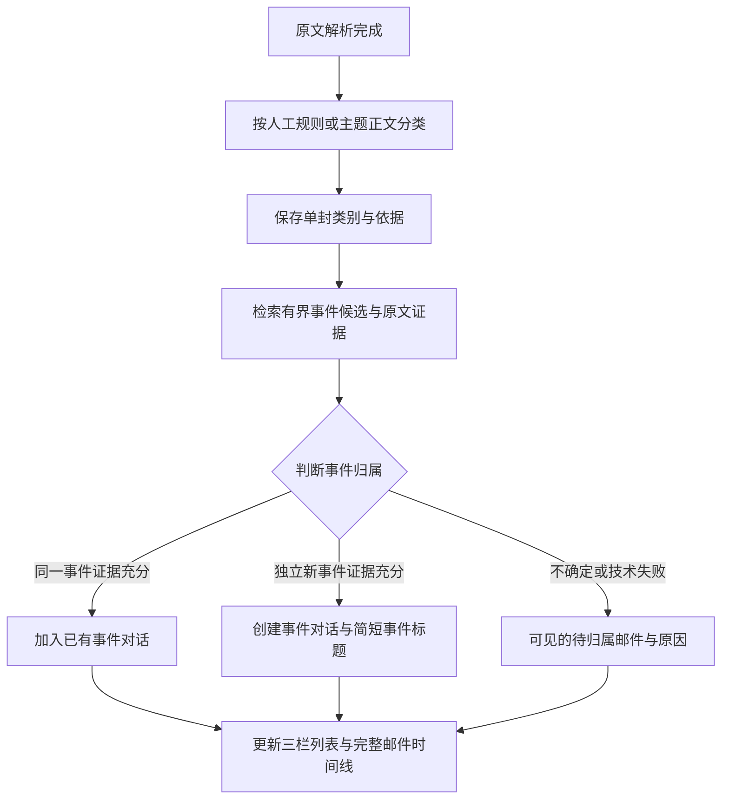

# 邮件分类与事件对话：收敛方案与原因调查

> 语言：简体中文 | [English](../../docs/email-management-classification-v3.md)

状态：2026-09-10 更新，**已实施，并按用户要求完成 remote 部署**。第 8 节记录实现证据，第 9 节记录部署检查；设计中的验收目标不代表已达到生产质量指标。

> 2026-09-10 后续要求：[邮件全链路优化](email-pipeline-optimization-design.md)替代后续“不生成摘要／正文默认完整展示”的要求，并纳入网络获取脚本和增量同步。该优化尚未实施；下文历史实现与部署证据保留。

## 1. 产品定位与确认范围

邮箱用于帮助用户管理自己的邮件。现阶段必须同时完成两件事：根据邮件主题和正文正确区分“通知类／交互类”，并把邮件正确归入对应事件的对话。**事件是最小对话单位，一个对话围绕一个事件。** 同一发件人的不同事件应分开；不同发件人参与同一事件可以归入同一对话。

用户已确认：

- 保留通知类和交互类。验证码、广告、普通登录告知等属于通知；要求确认、回复、决定、补充材料或继续交流的具体事项属于交互。身份不能单独决定类别。
- 不生成单封邮件摘要或对话摘要。分类和事件归属仍是当前必须具备的能力，不能只完成分类就宣称目标达成。
- 对话名称表达“这个邮件／事件是做什么的”，例如“确认采购报价”“协调项目上线时间”“申请账号恢复”。它是简短的事件标题，不是发件人名称，也不是直接照搬邮件主题或生成一段摘要。
- 邮件管理窗口采用三层：左侧大分类 → 中间按事件归档的对话 → 右侧完整对话详情；参考本地 JingSi-mail 的 UI 层级。

保留原文、附件下载、逐封已查看、人工分类、后续同地址规则、写信和回复；不设计责任人或自动处理动作。附件不交给模型识别。邮箱采集时效、采集脚本和轮询周期不属于本轮范围。

下文关于调用预算、事件证据、历史自动迁移及质量门槛是为落实上述目标提出的设计细则，仍需实施前验证。原提案“仅分类使用模型、暂停自动语义归属”的建议被本次讨论替代；不能通过关闭事件归属来规避收敛问题。

## 2. 调查结论与证据等级

### 已观察到的运行现象

本次会话在 2026-09-09 约 18:09–18:11（上海时间）对部署库做过只读聚合查询：43 条邮件记录中 17 条有解析表示，13 个对话；任务累计成功约 6 万条，仍有 219 条排队、4 条等待重试、3 条运行。这是历史任务数量，**不是邮件数，也不等于真实模型调用数**：部分任务发现输入版本过期便返回，不调用模型。

在一个两分钟窗口中，14 封不同邮件写入了 17 个上下文版本。单个关系复核目标的代次达到 2450–3753，单封摘要目标达到 3–439。该快照证明存在持续重建，不能证明每个目标的触发原因相同，也不能作为当前实时数量。旧版本展示记录与当前展示记录也不能混算。

### 代码已确认的原因

| 原因 | 代码位置（仓库相对路径） | 后果 |
| --- | --- | --- |
| 准备分类输入时也检索相关邮件、发布上下文 | `services/gateway/internal/emailmanagement/analysis_input.go` 的 `buildAnalysis` / `updateContext` | 分类执行前就可能改变自己依赖的输入 |
| 发布上下文必增邮件输入版本，并传播对话变化；Store 缺少等价内容的原子复核 | `services/gateway/internal/store/email_management_intake.go` 的 `emailContext`；`email_management_refresh.go` 的 `emailChangedMail` | 即使没有新原文，分析版本也可能变化；并发重复发布可放大变化 |
| 分类绑定邮件、回复、线程及上下文相关邮件依赖 | `services/gateway/internal/store/email_management_jobs.go` 的 `emailRequest` | 别的邮件或上下文变化会使当前分类过期 |
| 分类落盘自动请求单封摘要及归属/关系复核；单封摘要又改变对话版本 | `services/gateway/internal/store/email_classification.go` 的 `emailSaveClassification`；`email_management_refresh.go` 的 `emailSummary` | 分类、摘要、对话分析未形成单向依赖 |
| 展示版本包含输入版本、上下文、完整分类 JSON 等 | `services/gateway/internal/store/email_presentation.go` 的 `emailPresentationRevision` | 语义相同的重写也能使当前语言展示重新等待 |
| 界面将非 ready / failed 的展示统一显示为生成中 | `apps/webchat/src/components/emailMessage.tsx`；`apps/webchat/src/hooks/useEmailPresentations.ts` | 排队、尚无数据等状态无法准确区分；展示查询每 5 秒轮询与邮箱采集轮询无关 |
| 多种分析共用较复杂输出结构及较长正文输入；常见错误统一为 `email_processing_failed` | `services/gateway/internal/emailmanagement/model.go`、`analysis_input.go`、`service.go` | 弱模型负担偏大，单看用户界面难以判断失败阶段 |

当前已有模型调用记录、输入输出产物及版本栅栏，不是完全没有追踪能力；缺的是贯穿“当前邮件—当前分类任务—阶段—尝试—结果”的统一视图。默认两个模型工作线程轮转处理任务类型，不能将问题断言为“摘要固定最后执行导致饿死”。

### 尚待复现实验确认的触发因素

候选检索使用的 `search_text` 包含生成摘要；摘要变化可能改变相关邮件集合，再发布上下文，构成反馈回路。并发任务在 Store 外比较旧上下文，也可能各自发布等价的新版本。这两条机制在代码上成立，但还未用封存的合成数据分别量化对线上异常的贡献，不能断言其中任一项是所有重建的唯一原因。

后续实施前用隔离 Store 复现：固定原始邮件，分别控制摘要搜索、并发上下文发布、候选集合变化，记录输入版本、代次及真实模型调用的增量。不得用线上清库或批量重跑代替复现。

## 3. 分类与事件归属流程



### 3.1 单封分类

规则优先级沿用：本封手动修改 > 本 owner 下精确发件地址的生效规则 > 模型分类 > 交互兜底。规则作用于本封与后续同地址邮件，不自动追溯改动历史；规则表示分类偏好，不证明发件身份，也不意味着同地址邮件属于同一事件。

分类依据是主题和正文。建议主题优先，仅在主题证据充分时直接完成；无主题、含糊、存在冲突或不能确定用途时读取一次有限正文。主题优先是待验证的调用优化，不能为了减少调用忽略会改变类别的正文。正文保留否定词和动作上下文，只剔除可可靠识别的引用／签名，标记截断。附件-only、文字不足或证据冲突时进入交互入口并标明待判断。

分类输入只含本封原始主题、正文及最少可信结构字段，不检索相关邮件、不读生成摘要、不发布共享上下文。输出建议为 `category`、`notification_subtype`、`reason_code`、`evidence_quote`、`needs_body`。`unknown` 的有效入口是 interaction；枚举、字段组合和原文证据必须校验。分类步骤不生成事件标题、摘要、负责人、期限或执行计划；事件标题由后续事件识别步骤负责。邮件文字只作为数据，不能覆盖指令。

建议初始预算：主题最多 512 字符、正文补充最多 1200 字符；每阶段 120 秒，初次加一次技术性重试，最多四次请求。信息不足只升级正文一次，失败也计入预算；人工重试创建新审计批次。以上参数需由独立测试校准，不以模型自报置信度作为唯一门槛。

### 3.2 按事件归入对话

通知和交互都采用事件对话，单封通知也可以是一个完整事件。不得把所有验证码、广告或同地址来信合成一个永久对话。例如不同订单分别建事件，同一订单的确认与物流通知可属于同一事件；不同登录尝试的验证码不能只因服务名称相同就归为同一事件。

事件归属建议按以下证据顺序判断：

1. 用户已确认：解析出的回复引用、提供商原生线程关系用于定位上文，但事件是最终归属边界。旧线程中明确另起新事项时建立新事件，保留与原邮件的来源关联，不强行合入旧事件。
2. 使用邮件原始主题、正文、参与者和有来源的订单／工单等事项标识检索有界候选。相同发件人、相似主题或相同事项标识均不是独立的万能合并规则。
3. 对候选提供必要的成员原文片段和来源 ID，判断当前邮件与已有事件是否一致；不输入生成摘要或生成事件标题作为归属证据。候选没有覆盖充分证据时应补足有界原文或待判断，不能把“未搜到”直接当成“新事件已证明”。
4. 输出 `append / new / pending`、候选事件 ID、稳定原因码和可定位原文证据；发布时校验候选归属与成员版本。明确同一事件才追加，明确独立事件才新建，无法判断或失败保留待归属。

不确定时不强行合并，也不把每封邮件都建成正式事件来伪造归属成功。待归属是异常状态，不能算“正确放入对话”。一封邮件同时涉及多个独立事件时，本阶段先标为待判断，保留原文；多事件拆分或跨事件引用另行设计，不能悄悄打破单封唯一主归属。

建议事件识别初始最多 10 个候选、总原文片段 8000 字符，单次 120 秒、最多初次加一次技术性重试。与分类分开记账，不启动递归关系复核；候选证据不足走 pending。预算需以真实模型的独立合成集测试校准。

### 3.3 索引对应与缺失上文补齐

用户于 2026-09-10 补充确认：同一事件可以包含多封往来邮件；已有邮件索引可用于对应窗口中的事件对话。如果发现有前序往来却未在窗口对话中出现，必须补齐当前邮件的上文，不能将其当作孤立邮件直接结束处理。

这里的索引是有来源的邮件身份与关系：带 owner／邮箱绑定范围的提供商邮件／线程 ID，以及解析出的 Message-ID、In-Reply-To、References 等；不是列表位置或相同主题。索引定位候选，事件判断仍遵守上一节的同一事件边界，引用了旧邮件但另起新事项时不强行合并。

先核对本地完整索引，再决定是否采集：

| 缺失情况 | 补齐方式 |
| --- | --- |
| 上文已入库、已在同一事件，但窗口未展示 | 修复查询／分页／展示遗漏，加载已有邮件，不重复采集或新建事件 |
| 上文已入库但尚未归属 | 读取已有原文并完成事件归属，将当前邮件与有证据的上文组织到同一事件 |
| 上文尚未入库 | 沿可信线程成员或明确回复引用，复用[线程同步](email-management-stage-2-intake.md)定位、采集和解析可取得的历史，再更新事件对话 |
| 索引冲突、上文关联另一个既有事件或无法取得 | 记录具体缺口／冲突并显示待补齐或待判断，不自动合并既有事件，不伪造完整性 |

上文包括已读来信及用户此前的已发送回复，不受当前未读筛选或列表已加载页限制。只有当前回复中的引用片段时，可作为带来源的证据，但不能伪造为已采集的独立历史邮件；无法证明身份的片段不能获得正式邮件成员身份。补齐以当前事件的可证明关系为范围，不全量扫描历史邮箱，不依靠模型编写缺失上文，也不恢复摘要生成。

补齐按邮件唯一身份做差集，持久保存缺失引用、已发现成员、继续位置、尝试与结果；大线程分批推进，重启、重复触发或邮件变为已读均不重复建成员、不丢失未完成工作。遵守当前 owner／邮箱绑定、接收开关及服务商访问边界，关闭接收或需登录时明确等待条件，不暗中开启接收。此次补充要求落实定向历史补齐，不改变常规收件轮询周期。

用户已确认补齐不阻塞阅读和回复：能够证明归属时先进入已有事件，证据不足时保持可见的待归属状态。右侧先展示已经取得的真实邮件，同时独立显示“正在补齐上文／上文部分缺失／上文补齐失败”及原因；分类、事件归属与历史完整性分别记录。补齐后按原始邮件时间和稳定身份排序，保留逐封查看记录，新到达的历史邮件不因对话曾被打开而自动算已查看。已知缺口未解决不得标记对话完整；完成只代表本次已证明的关系范围已取得，不承诺服务商全部历史已覆盖。新增原文证据只触发受影响目标的一次有界归属更新，重复补齐检查不得引发分类／命名循环。

### 3.4 事件标题

标题以简短的“动作／用途 + 事项”表达事件，可在新事件识别时一并输出，例如“确认采购报价”“查询订单配送”“接收本次登录验证码”。仅使用原文支持的事实，不推断负责人、完成状态、截止时间或自动行动，不把验证码值写入标题。

新事件标题需保存来源邮件、证据片段及策略版本。追加邮件不默认重写标题；只有原文证明原名称有误或不足以区分事件时，才进行有来源的有限修订。标题不参与分类指纹、候选检索或事件同一性判断；标题相同不代表事件相同，改名不改变事件 ID 和成员。

命名失败与归属失败分开：归属已可靠完成时仍可打开对话，临时显示明确标注的原始主题；无主题显示本地化“事件待命名”，不得伪装为正式事件名称。标题使用当前事件命名策略规定的语言；建议创建时采用界面设置语言并保存，后台创建未取得可靠设置时采用原文语言。切换界面语言只切本地文案，不自动重新命名或生成翻译。

### 3.5 人工纠正归属与索引同步

用户已确认允许修改事件归属，并同步邮件索引以修正系统理解。提供“移入已有事件”“建立新事件”和“修改事件名称”。人工归属是持久的权威结果，后续模型不能自动改回；用户可再次显式修正。人工归属与人工通知／交互分类是不同操作，不隐式互相覆盖。

“同步索引”指系统维护的邮件身份 → 事件 ID 映射、事件成员及用于归属的检索索引，不改写原始邮件头、Message-ID、In-Reply-To、References 或提供商线程 ID。原始线程可以对应多个事件，因此索引应保留逐封归属与纠正边界，不能把整个线程永久重定向到一个事件。

修正命令带 owner、邮件身份、原／目标事件及预期版本，事务内校验归属并更新映射、双方成员版本与可靠的后续更新意图。派生候选索引、列表、时间线及未查看计数同步更新；异步更新必须可恢复，并用版本检查拒绝陈旧索引作为发布依据。保存修改前后、操作来源、时间及修订号；若新事件需创建，与迁移成员保持幂等。原始邮件、附件、逐封查看记录和发信关联保留，不因移动丢失。

人工修订版本进入事件归属发布栅栏，修正前已运行的模型结果不得覆盖新归属。后续来信定位回复对象时使用修正后的逐封映射；识别同一事件时可读取该修正及原文证据，继续遵守“旧线程可另起事件”。这不是仅改界面，也不等于训练模型或生成发件人全局归属规则。

修正仅作用于用户选定邮件；不默认搬动整条历史线程。已证明有关联的后续未归属邮件可以有界重新判断，已有人工归属保持不动。旧事件移空时保留可追溯 ID 与历史，常规列表隐藏空事件；这项呈现细则作为实施建议。自动批量修正历史仍需单独明确批次，逐封人工纠正不受此限制。

## 4. 三层窗口与类别归档

本地参考：`/home/infinimesh/Documents/JingSi-mail/app/app/mail-workspace.tsx` 的 `MailWorkspace`、`ConversationRow` 与 `ConversationPane`。已查阅其左侧导航／中间会话／右侧详情及窄屏切换实现；参考布局和交互层级，不引入其“需要回复／等待对方”分类、AI 摘要或自动写作流程，不修改 JingSi-mail。

| 层级 | 内容 | 交互 |
| --- | --- | --- |
| 最左：大分类 | 通知类、交互类及对应未查看计数；写信、草稿等作为辅助操作 | 点击分类，在中间展示该类事件对话 |
| 中间：事件对话列表 | 事件标题、参与者、最新邮件时间、邮件数与未查看数；可选明确标注的原文预览 | 点击事件，在右侧加载其详情；按最新邮件时间稳定排序和分页 |
| 最右：完整对话详情 | 事件标题、按时间排列的完整往来邮件；逐封原始主题、发件人、时间、正文、附件和回复入口 | 按封查看和回复；加载更多历史邮件，不生成摘要 |

```text
交互类  →  确认采购报价      →  询价邮件 → 报价回复 → 确认邮件
        →  协调项目上线时间  →  时间提议 → 各方回复
通知类  →  查询订单配送      →  发货通知 → 配送更新
```

用户于 2026-09-10 确认：同一事件包含交互邮件时，整个事件保留在交互类，不能因最新一封是通知就移动。单封类别单独保存，事件主入口按成员的有效类别投影：存在交互或 unknown 兜底成员则进入交互类，否则进入通知类。同一事件只在一个主分类展示，右侧保留完整时间线；不会为了分类而拆散事件，也不会将事件类别回写覆盖单封类别。历史交互收尾仍留在交互事件，不依据“已完成”推断转入通知。此规则已确认，实施时须通过混合事件样例验收。

已解析但待归属的邮件在有效分类下的独立“待归属”区可见；分类未知／失败归交互兜底。缺原文或解析失败通过辅助异常入口访问，不伪造正式事件。左侧徽标建议按该事件入口下的唯一未查看邮件计数，包含该入口的待归属邮件；中间分别标示事件数和待归属邮件数，避免与单封类别计数混算。

邮箱筛选、搜索和未查看计数作用于完整数据范围，搜索事件标题和邮件原文；这里的用户搜索不作为模型候选证据。保留逐封已查看语义，打开对话不一次性标记所有历史邮件。切分类记住各自选中的事件，刷新和语言切换保留选择；事件切换引起的迟到响应不能覆盖当前详情。宽屏并列三栏，窄屏依次进入分类／列表／详情，返回时恢复列表位置。

## 5. 停止摘要与单向依赖

本阶段允许分类、事件归属及必要的简短事件命名使用模型；停止单封摘要、对话摘要及其语言生成任务。旧模型归属／关系复核链路必须被不依赖摘要的新事件归属流程替代，不能原样保留其上下文写入反馈，也不能永久停掉归属能力。

依赖应单向为：不可变原文／解析 → 单封分类 → 基于原文证据的事件归属与命名 → 列表／详情投影。原文新证据可准入有限归属复核，但归属或命名发布不能反过来失效单封分类，也不能自动触发摘要与递归对话分析。

保留历史摘要作为历史产物，明确自动更新停止；默认展示事件标题与完整邮件原文。新的验证码提取／有效期推断不属于本轮目标，建议随旧复合分析停止；已有可靠值与遮挡保持，不能被空字段抹除。未证明有效期仍显示未知。

分类指纹只包含 owner、邮件身份、实际使用的原文／解析内容、规则及分类策略／提示词版本。事件归属另有指纹，包含当前邮件原文版本、有效分类版本、封存候选 ID 与证据版本、归属策略版本；标题记录独立版本。不包含任务时间、界面语言切换或生成摘要，标题变更不触发候选更新。

Store 事务内保证目标／版本唯一有效执行，发布校验源、规则、候选成员、策略及租约。等价结果不增长业务版本，执行审计独立。事件内原子校验并发追加；并发新建需重新核对最新候选和准入范围，以发现同事件竞争。无法可靠消歧时保留待判断，不能只用标题哈希保证事件唯一。新源或明确规则变化可产生有限新代次，等价上下文发布、轮询和页面刷新不能制造新工作。

## 6. 状态、迁移与恢复

分类、归属和命名分别展示状态，分类成功不等于归属成功。状态建议沿用 `waiting_source / queued / running / retry_wait / ready / needs_review / failed / suspended / superseded`；running 必须说明分类、事件识别或命名阶段。failed 表示技术预算耗尽，needs_review 表示语义不明确，suspended 表示策略停止，均不能笼统显示“生成中”。

每个目标关联当前 job ID、generation、stage、attempt、输入指纹、实际模型版本（无法证明则标记未固定）、策略／提示词版本、时间、稳定错误码、model-call/artifact ID、证据与结果来源。唯一邮件、当前分类任务、当前归属任务、历史任务和真实模型调用分别统计。普通日志不写原文、验证码、地址或凭据。只在可见目标存在活动任务时轮询；终态或停止后结束自动状态查询，加载失败单独显示。

不能仅在 worker 中跳过旧任务：当前 paused 可被 Rearm 唤醒且尝试次数重置。需要持久化版本化分析策略，同时约束准入、claim、重试、refresh、展示 ensure 和发布。

建议迁移顺序：

1. 隔离复现旧反馈机制，验证新的分类、事件归属与策略门禁，不在线上清库或批量重跑。
2. 写入新策略，阻止旧摘要／语言生成及旧耦合归属任务准入；旧排队任务按类别 suspended 或 superseded，取消在途旧任务并拒绝迟到发布。不可取消的模型请求可能仍消耗一次调用，但不能继续重试。
3. 新邮件进入新的分类及事件流程；缺失／不可信分类、未归属邮件按来源和游标有界补算，每个目标／版本只准入一次。保留产物与尝试历史，迁移可恢复、幂等，重启不全量重排。
4. 默认保留既有对话 ID 和成员，但支持第 3.5 节的显式人工修正；本轮不自动批量拆分／合并历史。旧标题若仅为原始主题或不表达事件用途，按独立命名状态显示；可信旧事件可有界补名，疑似混合事件标为待复核。历史重归属需单独确认批次，不能将保留旧关系宣称为已经正确归档。
5. 灰度分别观察分类、归属及命名代次和模型调用；无源／规则变化仍增长时停止新分析准入并留证。采集、原文访问、草稿和显式发信回复保持可用。

恢复摘要是未来显式策略升级，不属于当前交付。不能通过回退旧镜像自动释放旧队列；不理解策略 fence 的版本须先停分析 worker，并经兼容迁移／启动检查。预算耗尽后只有显式重试或真正的新证据才能再次准入，标题或展示变化不是新证据。

## 7. 验收与待验证细则

人工纠正验收：移入已有／新事件及改名后，邮件映射、候选检索、两侧事件成员、时间线、入口与未查看计数一致；并发旧模型、旧索引、重复命令、重启均不能覆盖或丢失修正。后续回复定位修正后的事件，旧线程另起事件仍可分开；原始邮件头、附件和查看记录不变。补齐期间阅读与回复不被阻塞。

新增上文补齐验收：覆盖最新回复先到、上文已读、已发送回复、已入库未展示／未归属、部分线程分页、跨事件索引冲突、原信删除或无法访问、关闭接收、重启续补与重复触发。验证无漏失的已证明成员、无重复事件／邮件、不伪造历史；缺口明确可见，补齐后顺序与逐封查看正确，固定输入反复检查零新增模型调用。

1. **根因复现与收敛**：封存合成原文，分别复现摘要候选变化、并发等价上下文发布；固定输入完成后跑 100 次 planner／refresh 和 30 分钟空闲观察，分类、归属、命名代次与模型调用均不再增长。memory/file/PostgreSQL 都要通过。
2. **分类能力**：独立中英保留集覆盖验证码、广告、普通登录、官方确认请求、个人通知、含糊／无主题、引用干扰、附件-only 和指令注入。固定模型与提示词，报告主题完成率、正文升级率、交互误分通知率、兜底率和延迟；不得用同集调优后的 100% 冒充盲测。建议关键需操作样例零误分通知，保留集误分率不超过 1%，报告样本量和置信区间。
3. **事件归属能力**：独立标注真实事件边界的合成邮件序列，覆盖同人多事件、多人同事件、改主题续谈、同主题无关事件、通知事件、通知／交互混合、回复另起事项、乱序和重复采集。报告错误合并、错误拆分、重复建事件、待归属比例及成功归属覆盖率；pending 不计成功。建议关键不同事件零错误合并，明确样例正确归属率至少 95%；这些门槛需评审且不代表生产保证。
4. **事件命名**：名称回答“该事件做什么”，不使用发件人名代替事件、不生成段落摘要、不包含无证据事实或验证码；改名／同名不改变归属。覆盖命名失败可读、追加不反复改名、语言切换零模型调用。
5. **三栏 UI**：两个主分类都展示事件列表；点击事件呈现完整往来、原文和附件。验证混合事件唯一入口、全范围搜索分页与计数、待归属可见、逐封已查看、移动端返回和迟到请求隔离。无需任何摘要也能完成分类浏览、事件阅读和回复。
6. **故障与迁移**：注入模型不可用、超时、坏 JSON、证据错误、规则中途变化、候选并发新增、租约过期和崩溃；三种分析状态可定位，旧任务不复活、迟到结果不发布、重复迁移不重复建事件。
7. **保留能力**：owner／邮箱隔离、人工规则、固定历史关系及待复核标记、草稿、显式发送／回复、原件下载、验证码遮挡、中英文 UI 回归通过。

已确认混合事件留在交互类、旧线程可按新事件拆开、人工纠正同步索引、上文补齐不阻塞阅读。实施前仍需验证：计数实现、主题直判能否可靠利用正文、候选与调用预算、命名语言及历史补名范围、多事件邮件的待判断体验。它们是设计细则，不改变用户已确认的“正确分类、按事件归档、不生成摘要、三层窗口”目标。

本次仅交付双语设计与状态记录，未修改应用代码、线上配置或数据，未运行上述产品验收或部署。

## 8. 实现与验证记录 — 2026-09-10

工作区已实现 `email-management-v4-source-events` 策略。持久策略启用与可恢复迁移停止单封／对话摘要、关系复核和展示生成，并拦截旧队列、旧租约结果。原件和历史制品保留。迁移补建缺失分类与未归属事件任务，不会自动重分全部历史邮件或重命名已有事件。

分类只消费当前邮件原始主题／正文；主题判断最多升级一次正文，疑似通知一律查看正文以免遗漏具体请求。事件归属检索有界原文与明确的来源、成员关系引用，不使用摘要或事件标题作为推断依据。等价上下文写入、刷新、改名不会使分类失效。每个模型阶段限时 120 秒，每个任务代次最多尝试两次。证据预算按 UTF-8 **字节**计算，并非前文建议的字符数：当前正文 1,200、关联／成员正文 500，最多十个候选、每候选抽取两封成员，原文证据总计 8,000 字节；截断与缺失上下文显式标记，模型请求序列化另有 48,000 字节上限。

窗口已改为大分类 → 事件列表 → 原始邮件时间线，混合事件保留在交互类，通知事件同样可包含多封邮件。用途标题与归属独立；命名缺失不丢弃已证明的事件归属，暂用原始主题时明确标注。支持改名、移动至已有事件或新事件；实体版本校验和幂等命令原子更新成员关系、候选索引与新旧事件统计，同时保留提供方 ID、RFC 头和查看记录。迟到模型结果不能覆盖人工纠正。标题／原文检索与分类计数采用相同事件范围。

上文状态只读、不阻塞阅读回复，区分待补齐、部分、暂停和失败。持久任务分页处理已知线程、对账已采集原件，并对已读／已发送邮件去重；每次历史任务最多处理四页后续跑。手动同步可以重试已耗尽的已知历史任务，周期轮询不会复活终态失败。Gmail 已有“当前列表中没有该线程时按已知原生线程路由读取”的测试；QQ／Outlook 尚无独立于已加载列表的等价查找证明，Gmail 页面已呈现成员也不代表提供方完整历史。缺失来源继续显示未完整，不伪报补齐成功。

验证包括全量 Go 测试／构建／vet，连接独立真实 PostgreSQL 的针对性 race 测试，三后端成员纠正、旧结果拦截、重启恢复及 100 次刷新收敛测试，WebChat 125 项测试／生产构建／669 个国际化键，Controller 235 项测试，以及双语文档检查。这些是隔离验证，不替代 30 分钟真实空闲观察、生产容量验收或真实邮箱端到端验收。本次未部署、未更改收信开关、未发送真实邮件。

合成模型证据保留在[验收元数据](../../docs/evaluation/email-source-events-v4/qualification-metadata.json)、[失败基线](../../docs/evaluation/email-source-events-v4/baseline.json)、[首轮新留出集](../../docs/evaluation/email-source-events-v4/fresh-holdout.json)和[最终新留出集](../../docs/evaluation/email-source-events-v4/final-fresh-holdout.json)。修正通用提示与单次事件身份约束后，新冻结的最终十二例得到分类 6/6、事件判断 6/6 符合预期，其中四例自动归属、两例按预期待确认。保留此前失败，中间复测属于调参样本内结果。模型别名未固定到不可变检查点，样本很小，**不能证明**前述生产准确率／误差阈值。最终六例分类全部升级正文，尚未证明主题优先的效率收益。验证类邮件追加事件要求双方有相同且明确的非秘密单次事件标识，否则保持待确认，以降低无依据合并、接受自动覆盖率下降。

## 9. Remote 部署 — 2026-09-10

按用户要求执行 `npm run start:remote`，已部署 Gateway `41bcf429e80e`、WebChat `845d1ae206ac`。首次构建遇到 Go 依赖 TLS 传输失败，在替换服务前停止；未降低 TLS 校验或改依赖，重试成功。五个应用服务均运行，Gateway 就绪状态为 external/PostgreSQL，WebChat 返回 HTTP 200。已重启主机 Browser Controller 加载新的原生脚本，smoke 通过；浏览器 PID 1862115 保持不变，Bridge 为 1.0.22。Fast、Embedding、Guard、OCR 模型目录均返回 200，目录可达不替代推理验收。

两条 owner 策略记录均已启用邮件 v4；一条历史迁移仍在 job 阶段，另一条已完成，迁移期间旧分析结果已受策略栅栏拦截。收信状态保持一启用、两暂停，未显式发送邮件。Gateway 日志另有微信上下文同步会话超时；本次邮件部署不解决该独立会话问题。第 8 节的模型语义与提供方历史完整性限制继续有效。
