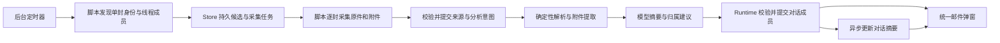

# 邮件管理系统整体设计

> Language: [English](../../docs/email-management-design.md) | 简体中文

当前后续设计（未实施）：[邮件分类与事件对话](email-management-classification-v3.md)。用户已确认事件是最小对话单位、按事件用途命名、不生成单封／对话摘要，以及大分类 → 事件列表 → 完整详情三层窗口。后续实施中与下文冲突的提案以新版为准，历史实现与部署记录保持原意。

2026-09-09 后续设计稿：[邮件分析与处理层改进](email-management-analysis-v2.md)规定信息通知／需确认与交互分流、验证码时效及界面与生成内容跟随设置语言；尚未实现或部署。

用户确认补充：人工修改记住发件地址并作用于后续来信；无法区分进入交互；模型不分析附件；不分配责任人，完善事项对话及写信／回复。优先级、恢复与验收见增量设计。

状态：2026-09-08 已进入工作区实现，未部署。实测覆盖见[实施与验证报告](email-management-implementation.md)。本文统领后续各阶段；现有脚本和实测状态仍见
[邮件来源设计](email-read-design.md)。本轮只设计，不实施功能。

2026-09-09 修订：自动接收改为同页批次采集，整轮结束后默认等待 20 分钟；逐封队列用于
本地解析与模型处理。按页恢复、来源复用与已读顺序以[阶段 2 更新](email-management-stage-2-intake.md)为准。

## 产品目标与范围

在 SparkClaw 中提供统一的邮件管理弹窗，以对方地址、参与者和事项内容组织持久对话。
QQ、Gmail、Outlook 是采集适配器，不是三个产品入口。本地收件地址作为来源和筛选条件展示。
一个地址可以对应多个对话，一个多人事项可以包含多个地址；对话拥有独立且稳定的
`email_conversation_id`，不使用地址、主题或服务商线程 ID 充当主键。

后台定时发现邮件，持久入队，逐封采集，异步生成摘要并判断归属，更新对话时间线和整体摘要。
弹窗关闭后后台继续工作；模型暂时不可用时邮件仍可接收并显示“待分析”。
当前设计交付接收、关联、摘要、查询与本地已查看状态；不扩展自动发送、草稿编写、删除、
归档、联系人合并等操作。JingSi-mail 中这些按钮不是本项目本轮的功能承诺。

## 从 JingSi-mail UI 得到的依据

仅阅读本地参考项目的以下前端文件，没有查看邮件接收服务或收件算法：

| 文件（相对 JingSi-mail/app） | 观察 | 本设计采用方式 |
|---|---|---|
| `lib/types.ts` | ConversationView 有独立 id、counterpart、messages、summary/insight；MessageView 有独立 id、方向和原件可用性 | 独立对话对象、逐封时间线、摘要与事实分离；扩展为多参与者和多来源地址 |
| `app/mail-workspace.tsx` 的 ConversationRow/ConversationPane | 列表显示对方、主题、预览和时间；详情显示摘要、往来卡片、更早消息与原件入口 | 弹窗左右分栏，摘要与逐封邮件都可查看 |
| `lib/mail-workspace-state.ts` | 前端按 ID 合并会话和消息，排序并维护分页、刷新及当前选择 | 后台决定归属，前端消费有版本的投影，不按主题重新分组 |

UI 能证明这些呈现与刷新方式，不能据此断言参考项目怎样自动划分会话。
不复制其收件、加密、投递及后端技术栈。其单一 counterpart 和投递状态也不能直接替代我们的多人、
异步分析和多邮箱状态模型。

## 整体分工

脚本执行当前页面结构下可确定的选择、翻页、展开、下载、读取状态和标已读。
不设计页面改版预测、多版本 DOM 自适应、模型修复选择器或自动切换采集技术；页面改版后由维护者更新。
保留账户与目标对应、下载完整性和操作结果检查，是为了本次操作正确，不是为未来页面变化设计。

Runtime/Store 负责持久身份、去重、任务恢复、版本校验与最终归属提交。
模型负责内容理解、事项延续判断、摘要和证据说明；不操作邮箱，不生成权威主键。
Workflow 可封装模型步骤，不作为后台收件的必经入口。

## 需要区分的四种对象

| 对象 | 作用 |
|---|---|
| 邮箱账户 mailbox | 实际接收/发送地址与来源绑定；服务商差异停留在适配层 |
| 单封邮件 mail | 稳定事实与原件；相同内容的不同邮箱副本仍各自保存 |
| 服务商线程 provider thread | 有范围的网页分组和同步线索，可能包括收件、已发送、草稿及加载缺口 |
| 管理对话 email conversation | 按地址与事项组织的产品对象；成员、摘要、查看状态持久保存 |

“新地址”不能无条件优先于已有回复关联：多人讨论加入新成员时，邮件可能仍属于原事项。
先找已有邮件、回复和线程关系，再判断地址是否陌生及内容是否延续。
反过来，同一地址或同一主题也不保证属于同一对话。

## 已确认范围与呈现假设

1. 在同一 owner 内统一对话；以对方地址及内容检索候选，本地收件地址保留来源。
   跨收件邮箱归属需明确关联，不能仅因地址相同就合并。用户已确认跨收件邮箱统一对话。
2. 首次遇到线程时有界登记成员并后台补齐可取得的来信/已发送历史，以后增量同步。
   不要求一次脚本下载整段往来，也不扫描整个历史邮箱。用户已确认补齐遇到的线程后增量同步。
   本轮是设计交付，不执行历史抓取。
3. 暂将“弹窗”按 WebChat 内的大型可关闭管理视图设计，不预设操作系统新窗口。
   不确定归属时显示待归类邮件，不要求用户逐封审批；允许后续重新分析。
4. 用户评审确认逐封记录已查看：只确认明确 mail_id，支持待归类邮件；到达序号不作为查看水位。
5. 用户评审确认首版已归属成员保持不动。后续证据冲突时，可在既有对话显示“疑似重复／待修正”；
   重分析不合并、不搬移，取消任意乱序或资料不足时均不重复建对话的无条件承诺。

评审修订还要求：上次完整获取之后的来信通过不依赖未读的增量扫描发现；输入失效与摘要刷新持久调度；
每个 owner、每家服务商仅一个活跃账号，并明确切换绑定规则。阶段 1—4 定义具体契约，
阶段 5 给出首版明确验收目标，不代表已有实测通过。

## 阶段、产物与验收顺序

| 阶段 | 设计文档 | 完成后能证明什么 |
|---|---|---|
| 1 | [身份、存储与状态](email-management-stage-1-data.md) | 邮件、线程、对话和任务边界可持久保存，提交和恢复语义明确 |
| 2 | [确定性接收与同步](email-management-stage-2-intake.md) | 三家当前页面可逐封接收回复，发现与采集分离且不会因自动已读丢任务 |
| 3 | [模型分析与对话归属](email-management-stage-3-analysis.md) | 有版本的归属、摘要刷新与疑点展示，既有成员保持不动 |
| 4 | [统一管理弹窗](email-management-stage-4-ui.md) | 用户查看摘要、往来、附件、来源与后台状态，刷新不重建对话 |
| 5 | [系统验收与启用](email-management-stage-5-acceptance.md) | 多邮箱、后台定时、异步模型和弹窗关闭重启共同形成完整闭环 |

先讨论整体与阶段 1 的记录/提交契约，再实现。阶段 2 的页面证据可以提前验证，
但脚本能够返回文件不代表阶段 1 或阶段 3 完成。阶段 4 可用固定投影验证 UI，不冒充真实收件闭环。

## 对现有问题的统一安排

单邮件会话限制、Outlook 单封网络导出和中英文网络响应证据归阶段 2；
自动已读导致任务丢失由阶段 1 的持久接纳和阶段 2 的先登记后打开共同解决；
发现前已读的新线程由近期来信扫描补足；阶段 3 复用归属并拒绝过时建议，
后续语义冲突显式展示，不修复既有成员归属；
历史不足导致摘要误判由阶段 2 的覆盖记录和阶段 3 的上下文缺口共同表达。
因此不再围绕“读取第一封”局部补丁决定整个系统。

来源三层结构继续保留。新的自动对话归属是独立的可追溯管理记录，不改写 RFC 回复事实。
本文覆盖旧来源设计中“暂不设计对话”“不做跨邮箱管理”及仅显式重跑分析的后续产品限制；
既有实测结论保持原样。逐封查看和阶段 5 的质量/恢复门槛适用于全部阶段。
