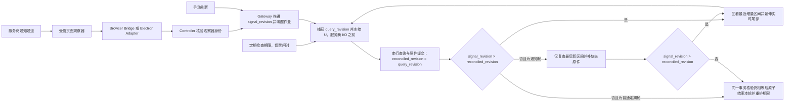

# 邮件通知唤醒同步与定期检查

> 语言：[English](../../docs/email-notification-wakeup-design.md) | 简体中文

状态：用户于 2026-09-23 采纳通知唤醒与定期检查方向；Browser Bridge 通知→Gateway→Reader 链路于 2026-09-24 部署（第 9.4 节），五分钟静默档与 Electron 资格仍待验收。连续轮次保留，但通知与网页原生同步／Reader 查询没有可证明的固定先后关系；本版把通知改为待核对提示，轮内串行采集仅回看最近一次增量区间并继续实时尾部。2026-09-24 修订把通知提示、定期检查期限和手动刷新组织为同一个串行执行者的三个触发源，共用一个单调请求修订号（第 1.3 节），并把手动刷新结算并入该修订号，不再单独捕获刷新 ID。同一修订号使定期检查成为自适应兜底（第 1.4 节）：默认仍为 60 秒，已验收且健康的观察器放宽到五分钟，每轮结束后安排一次 60 秒复查，任何仅由定期检查发现邮件或观察器降级都立即缩回。超过 50 封处理待定，三家专用浏览器已登录邮箱互发测试已获授权。下方早期现场观察保留为历史记录；当前生产证据及收信开关边界以第 9.4 节和链接的验收报告为准。

## 1. 已采纳行为

对已开启收件的邮箱，Controller 持续维护自有观察页。合格网页通知唤醒既有邮箱发现作业，并把邮箱标为待核对；通知不指定邮件已经可查询，也不为每条通知建立独立采集任务。通知轮从开始同步持续到已受理提示完成有界核对、最后区间检查完成；无提示的普通定期轮保持一次合格范围查询，该查询同样回看最近成功新区间并延伸新尾部。Reader 的列表查询与原件获取保持串行；执行期间的新提示合并到当前轮次，在当前列表及原件提交后的安全边界决定下一次查询。原有时间范围采集继续作为定期检查手段，默认保留**每轮采集完成后空闲 60 秒**的现有节奏，仅按第 1.4 节的自适应规则放宽。通知唤醒和定期检查使用同一套 Reader、作业、检查点、原件下载与提交流程，并且都由第 1.3 节的同一个请求修订号驱动。

通知表示邮箱可能发生了变化。只有合格的采集结果可以推进水位或证明邮件已获取。服务商事件时间、邮件 ID、流中的数据帧或网页收件箱更新，都不能替代这个结果；查询在通知之前或之后开始，也不能单凭时间顺序证明提示对应的邮件已被获取。

首阶段改善正常到信延迟，同时保留定期检查；不承诺严格的 60 秒送达上限，采集耗时、可用性与重试退避仍然生效。检查间隔不再是固定常量，而是第 1.4 节的自适应参数：默认仍为 60 秒，只对服务商唤醒适配器已通过第 9 节第 1 项验收且观察器健康的邮箱放宽。用户于 2026-09-24 决定，此类邮箱漏通知时可接受的延迟为五分钟。

本文扩展[时间线设计](email-timeline-incremental-sync-design.md)与[页面复用设计](email-cross-round-reuse.md)。最近成功新区间的单次回看是对时间线 v2“普通轮询不重读旧区间”的明确受限修订；仅回看一个区间，其他既有采集资格、重试、抑制、溢出与手动刷新规则继续作为基础，第 5–6 节明确轮内重试和手动刷新的衔接。范围是已授权收件绑定的 QQ 邮箱、Gmail 和个人版 Outlook；Microsoft 365 仍未验证。安装此功能不会自动开启邮箱收件开关。

### 1.1 通知接收端与在线要求

本方案使用邮箱网页版原生的服务端更新通道：**邮箱服务器 → 在线的自有邮箱任务页 → 页面观察器 → Controller → Gateway 同步作业**。观察器持续注册，在网络数据到达时处理事件；任务页可以在后台运行，无需用户一直查看。页面原有脚本与连接管理仍会运行，因此保持监听不等于页面没有 CPU 或网络开销。

收件开启期间需要维护该页面及登录状态。关闭、冻结、断线、设备休眠或登录过期会中断可用性，恢复按第 7、8 节执行；取消固定两小时年龄上限不构成永不中断的保证。若以后要让邮箱服务器直接通知 SparkClaw、完全不依赖邮箱网页，需要另行接入 Gmail／Outlook 官方通知 API、授权及通知接收设施；本方案没有采用该路径。

### 1.2 与原有持续轮询的成本比较

比较基线是已经开启收件、复用邮箱页面、每轮采集完成后等待 60 秒的现有实现。

| 项目 | 原有持续轮询 | 通知唤醒加 60 秒检查 |
|---|---|---|
| 页面内存 | 保留可复用页面 | 仍需常驻页面，另有有界观察器及事件缓冲；不能承诺明显降低内存 |
| CPU | 定期执行查询、解析与调度 | 无提示的普通定期轮仍只查询一次，但处理最近区间的重复元数据；通知轮含串行增量及最终区间检查 |
| 网络 | 定期查询，页面同时维护原生连接 | 无提示的普通定期轮正常仍为一次列表请求，范围为最近区间加新尾部；合并结果超限时需拆分。通知轮通常为 N 次增量获取加 1 次最终检查，仅下载缺失原件 |
| 同步延迟 | 等待下一轮检查 | 合格通知可提前启动同一作业 |

首阶段以改善及时性为目标，尚无资源成本的实测百分比。在某服务商唤醒适配器验收通过前，空闲检查频率保持 60 秒基线；通过后第 1.4 节把安静邮箱的间隔放宽到五分钟，静默邮箱从每小时约 60 次列表请求降到约 12 次加每轮一次复查。连续增量任务成功完成最后区间检查后重排下一检查期限，避免紧接着重复检查；繁忙邮箱因每轮结束后都跟一次 60 秒复查，查询次数与现状相近。页面常驻成本在任何情况下都存在。

每条合格通知都持久更新待核对修订号；同一事件重放去重，多条提示在列表查询和串行原件获取期间合并。在安全边界只针对尚未核对的提示安排下一次增量；该次请求从**最近一次增量区间的下界**回看并延伸到新的固定上界，以兼顾通知晚于上次列表而邮件时间仍落在上次区间的情况。回看只限最近区间，本地稳定 ID 去重；不对每条提示分别建立“获取加复查”周期。查询开始时间和通知到达时间不作为已获取证明。

两秒最小增量启动间隔保留为初始内部限速参数，实际还受任务耗时、互斥和退避约束；它不是从 81 毫秒或 1.33 秒观测推导的服务商可见性等待阈值。通知轮连续执行 N 次增量获取，提示停止且检查过程无新提示时，正常列表请求数为 N+1；无提示的普通定期轮不增加第二个请求，但其唯一请求回看最近区间。若最终检查期间又有提示，该检查不结束本轮。没有实测成本比例，也不把限速当作节省成本或必然补漏的证明。

用户已采纳持久状态和资源预算建议。上线前测量空闲、连续来信及异常通知场景的请求次数、CPU、内存、流量、缓冲峰值和唤醒延迟，确定缓冲上限、每次获取／执行片的时间和字节预算、退避及异常降级阈值。持续通知可以延长同一逻辑轮次；预算用尽时让出执行资源并持久保留阶段和待续状态，不把暂停当作收尾、不额外复查完整历史。恢复后继续该轮，无无限内存队列或无限高频循环。

### 1.3 统一触发模型：三个触发源、一个修订号、一个执行者

通知提示、定期检查期限和手动刷新是同一邮箱唯一串行执行者的三个触发源。触发源本身不做采集，也不需要知道其他触发源是否存在、当前是否有轮次在跑。合格通知提示与受理的手动刷新在 owner 事务里只做同一件事：推进该邮箱的 `signal_revision` 并唤醒作业。定期检查期限不是请求，而是空闲执行者的等待边界：仅在没有活动轮次时启动普通轮，且每次收尾都会重排它，因此轮次进行中到期的定期检查不会产生紧接着的重复查询。

```
触发源（任意时刻、任意并发）                    执行者（每个邮箱同一时刻最多一个）
┌──────────────────┐
│ 合格通知提示       │──┐                          loop:
├──────────────────┤  │  signal_revision++          query_revision = signal_revision   ← 服务商 I/O 之前
│ 手动刷新           │──┼──────── 唤醒 ───────────▶  查询 [L, U) 并串行获取原件
└──────────────────┘  │                             提交；reconciled_revision = query_revision
┌──────────────────┐  │                             若 signal_revision > reconciled_revision：
│ 定期检查期限       │──┘（仅空闲时启动轮次；           回看最近区间 + 新尾部，继续循环
└──────────────────┘   每次收尾重排）                否则：最终检查（通知轮）或收尾；
                                                    收尾时在同一事务内再次核验仍相等
```

执行者为每个邮箱维护三个单调修订号，全部持久化在 Store。它们在邮箱记录的整个生命周期内持续计数、永不归零，绑定代次变化时也不归零；绑定代次隔离的是检查点和刷新请求，不是计数器：

| 修订号 | 写入者 | 含义 |
|---|---|---|
| `signal_revision` | 任何触发源，原子写入 | 最新一次被记录的"想要同步"意图 |
| `query_revision` | 执行者在列表查询开始时，与冻结 `U` 同一事务，服务商 I/O 之前 | 本次查询承诺覆盖到的意图 |
| `reconciled_revision` | 执行者在该查询及其串行原件提交时 | 已被合格结果证明覆盖的意图 |

不变量：**`signal_revision > reconciled_revision` 蕴含一定会启动一次查询。** 这个比较在提交增量或结束轮次的同一个 Store 事务里执行，因此无论触发在什么时刻到达——列表之前、串行原件期间、最终检查期间、还是与收尾事务竞争——它要么已被某个捕获了更高 `query_revision` 的查询覆盖，要么恰好再逼出一次查询。一次查询期间的 10 条提示加 2 次刷新点击合并成一次补查，因为比较的是修订号而不是计数。`query_revision` 必须在向服务商发出请求之前捕获；若在请求之后才捕获，查询进行中到达的触发会被误认为已覆盖，这就是经典的丢唤醒缺陷。由于每次查询都从持久化水位回看并按稳定 ID 去重，一次由已覆盖提示逼出的补查只多花一次列表请求，不会重复下载。

手动刷新不是第二条轨道。受理刷新即推进 `signal_revision`，并把得到的值记为该请求的 `refresh_revision`；当某次合格提交把 `reconciled_revision` 推进到不低于 `refresh_revision` 时，该请求结算。这取代了原来单独捕获的待完成刷新 ID：在手动轮已经运行时受理的刷新，得到的修订号高于该轮的 `query_revision`，因此运行中的轮次无法结算它，一次补查得到保证。界面上的 `refresh_pending` 投影就是"存在某个受理的 `refresh_revision` 大于 `reconciled_revision`"。当前 `emailPollRequest` 在 `RefreshPending` 已置位时直接返回，这会把运行中手动轮期间的再次请求吞进该轮，即便该轮的服务商列表已经取完；第 9 节第 3 项修正此缺口。

提示在受理前不做去抖。合并机制已经把一次查询期间到达的任何突发压缩为一次补查，两秒最小增量启动间隔也限制了空闲时到达的突发多快能启动第二次查询。去抖缓冲只会多出一个窗口，在其中已受理的提示既未持久化也未确认，这与第 4 节"Gateway 仅在 Store 事务记录唤醒后才确认"的规则相悖。服务商层面的记录拆分（一封邮件产生多条传输记录）由观察器的分类处理，而不是靠推迟受理。

第 5、6 节把该模型落到区间边界、最近区间回看和最终检查上。

### 1.4 自适应检查间隔：轮询作为兜底

在上述模型里，定期检查期限在结构上已经是兜底：它是空闲执行者的等待边界，从来不是请求。剩下要决定的只是它的长度，而这不能是单一常量，因为定期采集承担两个职责，其中只有一个能被通知替代：

1. **漏通知保险**——提示没有到达、观察器断开或服务商协议变化。已验收且健康的观察器让这种情况变得罕见，间隔可以拉长。
2. **晚可见补漏**（第 6.1 节）——提示到了、查询也发了，但服务商尚未把邮件放入可查询结果。补漏依赖下一次查询回看最近区间。通知替代不了这一点，而且它需要的是"活动之后不久查一次"，不是"每 N 秒查一次"。

因此单纯拉长一个间隔，会把晚可见补漏的延迟从一分钟拉到新间隔。改为分层：

| 层 | 条件 | 延迟 | 作用 |
|---|---|---|---|
| 通知驱动 | 合格提示 | 立即 | 主路径 |
| 活动后复查 | 任一轮次结束（`completed`，普通轮或通知轮） | 一次性，60 秒后 | 晚可见补漏；只跑一次，随后交给安静层 |
| 安静兜底 | 观察器 `watching` **且**该服务商唤醒适配器通过第 9 节第 1 项**且**恢复窗口内没有仅由定期检查发现的邮件 | 初始五分钟；后续验收后可再放宽 | 漏通知保险 |
| 降级兜底 | 观察器 `degraded`、`login_required`、`stopped`、未知，或适配器未验收 | 60 秒（现状） | 纯轮询 |

活动后复查是长间隔安全的前提：安静层只作用于上一轮结束后整整一分钟内什么都没发生的邮箱。静默邮箱从每小时约 60 次列表请求降到约 12 次；繁忙邮箱与现状一致，因为每个通知轮后都跟一次复查。复查本身就是一次普通轮——回看最近区间并延伸尾部——不需要新阶段或新查询形态。若它一无所获且没有触发到达，下一期限按安静层设定。

仅凭 `watching` 不能证明通知没有丢失（第 7 节）。因此安静层需要一个纠错信号：**若一次纯定期轮在其新尾部提交了合格新来源，该邮箱的间隔立即降到 60 秒，之后每经过一次连续的、新尾部为空的纯定期轮就翻倍（60 → 120 → 240 → 300 秒），逐步恢复。** 第 8 节已把"最近一次仅由定期检查发现邮件"列为诊断项；这里把它提升为调度输入。它不需要证明服务商丢了通知——对调度权重而言，方向保守即可。

两个定义防止这个信号在预期行为上误触发。**纯定期轮**指在其收尾事务里，`signal_revision` 等于上一次收尾时记录的 `reconciled_revision`：整轮期间没有受理过任何类型的触发。按整轮而不是按首个查询的 `query_revision` 判定，可以排除 Gmail 那种在查询启动一两秒后才到达的提示。**纯定期发现**只计入本轮新尾部 `[P, U)` 内提交的合格新来源。回看段 `[L, P)` 补交的来源一律不算：它们的接收时间落在更早的区间，其提示（若有）属于更早的轮次，而活动后复查存在的目的正是补交它们。没有这条排除，复查补到的每封晚可见邮件都会被当作漏通知，安静层永远进不去。恢复计数器只在再次出现纯定期发现时归零；通知轮找到邮件是通道正常的证据，不打断恢复。

缩短总是立即生效，拉长只在下一次 `emailPollFinish` 重排时生效。这沿用了 `emailPollRequest` 里现有的不对称：它已经在迁移 `PollInterval`，并且只会提前空闲期限、绝不推后。具体做法是 `emailmanagement/service.go` 的 `plan()` 按邮箱计算层间隔，替代今天的常量 `ScanInterval` 作为 `RepeatInterval` 传入；`emailPollRequest` 把它存为 `PollInterval`，并通过现有规则在间隔缩短时把空闲期限提前、在间隔变长时不做改动。第 5、6 节的状态机不变；`PollInterval` 从配置常量变成按邮箱由观察器状态、适配器验收状态和恢复计数计算出的值。手动刷新、提示和修订号不变量都不受当前处于哪一层影响。

验收按服务商逐家进行。QQ 的 `mail_148` 分类器通过正反例夹具后即可进入安静层；Gmail 与个人版 Outlook 在分类器验收前即使观察器报告 `watching`，也停留在降级层。

## 2. 实机证据及边界

以下均为 2026-09-23 的 Asia/Shanghai 时间。测试使用现有登录浏览器内的临时独立任务页、网络观察脚本和后台焦点模拟。这些是短时兼容性观察；通知解析器及生产唤醒调度均未安装。临时观察器与制品已清理。

| 提供商 | 观察结果 | 能说明什么 |
|---|---|---|
| QQ 邮箱 | `wss://wx.mail.qq.com/socket` 于 16:54:38.345 发来带 `emailId` 的 `mail_148`；原有定时发现于 16:54:38.264 已记录该邮件。 | 存在邮件专属信号。原定时发现早了 81 毫秒，本次不能证明邮件由推送触发获取。 |
| Gmail | `signaler-pa.clients6.google.com` 上的 `/punctual/multi-watch/channel` 使用长时间保持的 XHR 响应。后续测试邮件接收时间为 17:38:06.885，原生 `/sync/u/...` 请求于 17:38:08.218 开始，未读数从 11 增至 12；通知响应中出现大于常规心跳记录的数据。 | 邮件到达与原生同步相隔约 1.33 秒。未将具体通知解码到该邮件 ID，通道续接后也未保留该记录的精确到达时间，因果关系尚未完全证明。 |
| 个人版 Outlook | `/owa/notificationchannel` 返回 SSE 数据；17:32:26.777–17:32:27.558 出现一组较大帧，收件箱会话数从 2 增至 3、未读数从 1 增至 2；检查窗口内，在这组帧之后未观察到额外的主页面 `service.svc` 或搜索请求。 | 通知流与收件箱变化有较强时间关联。不证明流中包含完整邮件原件，也不证明观察覆盖了全部可能的 Worker 传输。 |

此前第二轮测试邮件实际未发出，排除在证据之外。下一次尝试中，Gmail 通道在约 17:32 有变化，但近期邮件查询为 0；随后补发 Gmail 邮件并于 17:38 确认到达。因此，**帧大小、任意网络活动、连接存在和心跳流量，都不能作为合格的新邮件判据。**

这三条观察也不能确定“通知先到、Reader 后查、原件随后串行下载”的统一顺序。QQ 的通知已落后一次发现；Gmail 缺少通知精确到达时刻；Outlook 缺少准确请求时差。不能用这些数字设统一静默等待、把较晚通知直接当成新邮件，或把一次查询的启动／完成时间当成通知对应邮件的可见性证明。通知仅增加一次待核对意图，结果资格仍由 Reader 独立判定。

每个提供商启用唤醒适配器前，必须识别邮件变化信封并通过正反例验证。QQ 从已观察到的 `mail_148` 信封开始；Gmail 和 Outlook 仍需补齐协议级判定。格式不支持或变化时，保留定期检查并将观察器标为降级，不能将未知记录静默当作已验证的新邮件事件。

### 2.1 连续通知与监测粒度

观察对象是持续存在、必要时由网站续接的通知通道。连接保持在线期间，后续更新可以继续到达。设计必须分别处理**连接、逻辑通知和传输片段**：连接承载更新，通知表达变化，数据帧／响应片段负责传输。不能假设一封邮件必有一条通知、一条通知只涉及一封邮件，或者一个响应片段就是一条完整通知。

| 提供商 | 本轮临时监测方式 | 尚未证明的内容 |
|---|---|---|
| QQ 邮箱 | 观察 WebSocket 入站消息，识别到含邮件 ID 的 `mail_148` | 连续多封邮件是否逐封通知、是否合并及是否完整送达 |
| Gmail | 观察长 XHR 响应的增量变化，并关联原生同步请求与收件箱变化 | 邮件变化信封分类、通知与邮件的对应关系及连续来信合并规则 |
| 个人版 Outlook | 观察 fetch 承载的 SSE 流；一封测试邮件到达附近出现一组数据帧 | 帧与逻辑事件的边界、邮件事件分类及连续来信合并规则 |

实现必须允许多封邮件合并提示、同一变化重复提示，以及记录跨片段或一个片段内多条记录；具体解析按各提供商已验收的格式处理。数据回调只说明收到数据，分类后才可能产生 `mailbox_changed`。心跳可用于通道诊断，不能唤醒邮件采集。当前测试没有确定三家连续来信的通知条数或频率，也没有完成连续来信的生产同步验收；临时监测已结束，不代表当前有常驻生产监听器。

## 3. 数据流与职责



进入 `G` 的每条边都是一个触发源，每个触发源做的事完全相同。唯一的决策点是两处修订号比较，并且都在提交前序工作的同一个 Store 事务里执行。

页面观察器只解码分类邮箱变化提示所需的通知信封，不重放私有通知请求、不接管网站的连接管理，也不把服务商通知载荷发布为邮件来源。既有 Reader 负责合格的范围查询和原件获取。QQ 的事件 ID 可在页面内辅助关联诊断，但不授权新的下载通道，也不能绕过既有目标校验。

运行时适配器将自有任务文档中的有界元数据事件送至 Controller。页面信号属于不可信输入；Controller 根据自身登记补充邮箱／用户绑定，并核验标签归属、来源、文档代次、账号、凭据代次和受管脚本版本，拒绝陈旧或不匹配信号。网页不获得 Gateway 凭据或通用回调地址。

Gateway 负责持久调度，在受理唤醒与启动采集时分别核对收件授权和绑定代次；Controller 负责观察与页面生命周期。读取、发信、登录和其他独占操作继续经过既有操作门禁。空闲观察页面不会永久占用活动读取预约。

### 3.1 通知接收与接口获取并行

通知接收和邮件列表／原件请求可以在同一自有页面内并行，分别负责变化提示和邮件获取。持续监听不持有采集互斥锁；同一邮箱的采集仍然串行。生产实现必须验证以下交互，不能仅凭临时抓包成功认定并行安全。

| 交互 | 处理要求 |
|---|---|
| 列表查询或串行原件获取期间收到新通知 | 当前请求正常完成，观察器持续工作；提示合并到安全边界，由一次最近区间加新尾部的查询核对，不并行启动另一轮 |
| 连续或重复通知 | 更新待核对修订号，已等待的提示共同触发下一次查询；重复投递及原件分别去重，不根据通知时间推断邮件是否已经获取 |
| 查询、读取或标记已读产生通知 | 识别并过滤已知自身副作用；无法安全区分时降级观察器，防止同步与通知循环触发 |
| 查询导航、页面替换或原生连接重建 | 保留待处理意图、重新核验并安装观察器，安排补查；`resetRound` 不删除观察器 |
| 登录、发信或验证等独占操作 | 沿用既有门禁及观察器暂停／重建规则，不绕过页面归属与账号核验 |

插桩完整转发原网页的 XHR／fetch／WebSocket 调用和数据行为，不能抢占、锁住或耗尽供网页自身读取的响应流。必须处理流取消、连接续接、片段重组和有界内存；临时测试中的响应流克隆只提供观察证据，未经长期资源及兼容性验证不能直接投入生产。并行验收同时检查网页自身仍正常更新、Reader 仍能合格获取原件，以及通知路径没有丢失同期新变化。

## 4. 内部事件传递

为运行时适配器与 Controller Client 增加版本化的内部观察能力。Gateway 将已启用邮箱的观察意图协调给 Controller，并通过现有仅用户可访问的本地传输，为每个 Controller 连接消费一条经过认证的事件流。采用流式 HTTP 响应，认证信息置于请求体／请求头，不能写进 URL 参数。路由名称与 DTO 在实现契约测试中固定；当前 Controller API 尚无这些操作。

浏览器侧使用持久适配器事件回调。不能为了判断是否有事件而反复执行 CLI `eval`、下载整份网络日志或请求邮箱接口。当前部署的 Browser Bridge 与目标 [Electron Adapter](desktop-client-embedded-browser-design.md) 必须承接相同的有界事件语义，并分别验证；一个运行时的实机证据不能继承给另一个。

概念事件字段为 `schema_version`、`mailbox_id`、`binding_generation`、`watch_epoch`、`sequence`、`kind`、`observed_at` 和白名单 `reason`。事件类型为 `mailbox_changed`、`watch_state`、`resync_required`。观察器／文档替换后由 Controller 生成新 epoch，并在该 epoch 内递增序号。事件流与持久诊断日志不携带原始邮件、主题、地址、Cookie、Session URL、响应正文或服务商标识符。

Controller 有界保留未确认事件，去重同一事件重放。Gateway 可合并本轮的待续调度，但必须持久保留最新待核对修订号；当前查询开始之后的提示默认留给后续核对，不能凭查询与通知的时间顺序标为邮件已获取。Gateway 仅在 Store 事务记录或去重唤醒后确认事件；重连携带最后受理的 epoch／序号。未知 epoch、缓冲丢失或序号缺口，为相关邮箱产生一个 `resync_required` 唤醒。内存事件缓冲不是服务商持久变更游标；消费端停顿不能导致缓冲无限增长。

观察意图会话有独立续期的存活租约。Gateway 消失后，孤立观察器最终被释放；有效的收件意图会续期，不依赖新邮件频率。这只检查本地进程／会话存活，不查询服务商邮箱。事件传输故障不能禁用原有检查作业。

## 5. 一轮连续任务与串行增量

**通知轮**是一个持续核对邮箱变化的逻辑任务：开始同步 → 串行列表与原件获取 → 合并期间提示 → 必要时回看最近区间并继续尾部 → 最后仅检查最新区间 → 结束。无提示的普通定期轮保持一次查询，但也回看最近成功新区间；若执行中收到合格提示，再进入通知轮的核对路径。一个邮箱始终只有一个活动作业，持续监听不占住另一把采集锁。**提示修订号是调度意图，不是邮件覆盖水位**；不能以通知时间、请求启动时间或回调顺序推断某封邮件已获取。

Store 保存轮次身份、第 1.3 节的三个修订号（`signal_revision`、查询开始时捕获的 `query_revision`、由合格提交推进的 `reconciled_revision`）、每个已受理手动刷新请求 ID 及其 `refresh_revision`、阶段、在途区间，以及连同绑定代次／范围版本跨轮保留的最近成功新区间 `last_interval_start`／`last_interval_end`。同一事件按 epoch／序号去重，先登记再确认。查询合格提交后只能把 `reconciled_revision` 推进到该次启动前捕获的 `query_revision`；这表示执行了一次有界核对，不证明通知对应的所有邮件已到达。查询／串行原件获取期间新增的提示与刷新得到高于已捕获 `query_revision` 的修订号，因此不会被该次提交结算。前一区间内已提交的稳定 ID 在回看时只用于去重，不重复下载成功原件。写入这些字段的具体记录布局和四个事务见第 5.2 节。

| 当前状态 | 收到通知或完成请求后的行为 |
|---|---|
| 空闲时收到合格提示或手动刷新 | 推进 `signal_revision` 并唤醒同一邮箱作业；首次查询从跨轮保存的最近成功新区间下界回看，若无该区间则从 `poll_through` 开始 |
| 空闲时定期检查到期 | 以当前 `signal_revision` 启动普通轮，不推进修订号；除非执行中收到触发，否则该轮无提示 |
| 活动轮进行中定期检查到期 | 不做任何事；活动轮的收尾事务会重排期限，因此到期不会逼出重复查询 |
| 列表或串行原件获取时收到提示或刷新 | 把 `signal_revision` 推进到已捕获 `query_revision` 之上；当前工作先完成，随后在安全边界合并，不并行启动查询 |
| 多个提示或刷新已经等待 | 下一次查询开始时捕获最新修订号；只安排一次最近区间加新尾部的查询，不逐条建立独立周期 |
| 增量提交后 `signal_revision > reconciled_revision` | 从最近成功新区间下界回看并延伸到新的固定上界；合格后只把新尾部记为新的最近区间 |
| 增量提交后 `signal_revision = reconciled_revision` | 通知轮进入最新区间最终检查；已回看最近区间的普通定期轮直接结束 |
| 最终检查期间又有提示或刷新 | 保留检查结果，取消结束判定；在安全边界执行最近区间加新尾部的核对，随后检查新的最新区间 |
| 手动轮已在运行时再次受理手动刷新 | 再次推进 `signal_revision` 并记录新的 `refresh_revision`；运行中轮次的 `query_revision` 更低，其提交无法结算该请求，一次补查得到保证 |
| 重试退避或预算暂停 | 保留轮次、阶段和三个修订号，释放可让出的执行资源后续跑；不假装本轮已结束 |
| 收件关闭、绑定变化或账号不匹配 | 拒绝新提示，隔离旧观察器并阻止旧代次自动工作，保留原件与审计 |

“待核对提示清空”采用本地可执行判定：当前增量及串行原件处理已经完成，且原子读取的 `signal_revision` 没有超出 `reconciled_revision`。服务商无需提供“通知结束”事件，也不以心跳停止或连接关闭作为结束信号。无需根据现有实测虚构静默时间；若之后又有提示，按检查期间／轮次完成后的状态继续处理。QQ `emailId` 目前只有诊断价值，未经一对一、合并与重放语义验收，不用它跳过查询；Gmail／Outlook 也不以帧大小或未读数跳过。

真正结束通知轮时，Store 在同一事务中核验检查对应的最新区间、阶段、绑定代次，并读取 `signal_revision = reconciled_revision`。检查开始后新增的提示或刷新已推高 `signal_revision`，使结束条件失败，转回增量阶段；结束事务提交后才受理的请求则启动新一轮。两种情况是同一个比较，因此“检查完成→标为空闲”之间不存在能吞掉请求的间隙。手动刷新按同一规则结算：某次合格提交的 `query_revision` 不低于该请求的 `refresh_revision`。若失败则保留 pending 与退避，即使通知轮尚在继续，更早的自动查询因其 `query_revision` 低于 `refresh_revision`，也不会被误报为刷新完成。现有"重试额度耗尽后释放刷新按钮并记录错误"的规则取消：它存在的前提是刷新是一个必须先清掉用户才能再点的布尔位，而 `RefreshRequest` 只由合格提交结算，任意多次失败都保持未结算。未结算期间再点一次只是推进 `signal_revision`，不改变任何事，因此没有什么需要释放；不变量已经保证退避调度会持续尝试。错误本身仍通过作业的 `ErrorCode`、重试状态和 `NextAttemptAt` 可见，界面与 pending 状态一并显示（第 5.2 节）。列表完整但部分原件失败的提交仍然结算该请求——失败照旧通过 `pending_failure_count` 和 `refresh_available` 暴露——因此按钮在第一次完整列表时释放，而不是在重试耗尽时。

一次逻辑轮内，同一精确邮件 ID 的首次合格原件失败不能因后续提示、区间回看或最终检查自动消耗第二次失败额度；剩余一次机会留给下一定期轮或受理后的显式刷新。既有两次失败抑制、运维失败不计数及溢出确认规则不变。

分类器排除心跳、重连确认、仅已读变化和已知自身读取副作用；采集期间持续监听，无法安全区分自身副作用时降级到定期检查。单邮箱互斥、两秒最小增量启动间隔、更长退避和资源预算共同约束持续任务，执行片让出不会改变逻辑轮次。

### 5.1 连续来信的调度示例

这是设计示例，不是新增实测证据。通知启动第一次增量 `[T0, T1)`。列表已结束但仍在串行下载原件时又收到提示；该提示可能对应已获取邮件，也可能对应当时尚不可见或时间落在 `[T0, T1)` 的邮件，不能按提示时间作选择。提交当前结果后，只发一次核对请求 `[T0, T2)`：回看最近区间并覆盖新尾部 `[T1, T2)`，稳定 ID 去重；合格提交后最近新区间改为 `[T1, T2)`。若核对期间又有提示，下一次请求为 `[T1, T3)`。提示清空后，仅复查最新新区间 `[T2, T3)` 并补合格缺失原件，不重查整轮 `[T0, T3)`。

若复查 `[T2, T3)` 期间又有提示，保留已获取原件并继续同一轮的 `[T2, T4)` 核对；再次没有待核对提示时，检查新的新区间 `[T3, T4)`。前一次检查不构成已经结束的一轮，也不阻止新尾部继续。无提示的普通定期轮只查询一次，但同样回看最近区间，不额外发第二次复查。

若通知轮的首查与最终检查都早于服务商把邮件放入可查询结果，下一次 60 秒定期查询仍回看该轮保存的最近新区间，可以在邮件届时可见且收件时间属于该区间时补交原件。这里没有从 Gmail 的 1.33 秒或 QQ 的 81 毫秒推断固定等待；超过最近区间回看范围才可见的邮件仍属于第 6.1 节的限制。

### 5.2 目标数据模型与四个事务

游标是三个时间字段，序号是四个整数。每一个字段都只在四个 Store 事务之一里写入，事务之外没有任何写操作。下面的字段名是概念名，线上名称由实现契约固定。

```go
// 邮箱记录，每邮箱一行。游标字段在 BindingGeneration 变化时重新锚定；
// 修订号字段在记录整个生命周期内持续计数。
type Mailbox struct {
    BindingGeneration  int64
    // 游标
    PollThrough        time.Time // P：已证明完整覆盖到的上界
    InflightUntil      time.Time // 当前查询冻结的 U；无在途查询时为零值
    LastIntervalStart  time.Time // [L, P)：最近一次合格新尾部，作为回看段
    LastIntervalEnd    time.Time //   仅当 LastIntervalEnd == PollThrough 时有效
    // 序号
    SignalRevision     int64     // 最新被记录的"想要同步"意图
    ReconciledRevision int64     // 已被合格提交证明覆盖的意图
    LastEventEpoch     string    // 事件去重：最后受理的 (epoch, sequence)
    LastEventSequence  int64
}

// 检查点，每次列表查询一份，由 Begin 创建。
type Checkpoint struct {
    CheckpointRevision int64
    Kind               string    // "increment" 或 "final_check"
    Lower, Upper       time.Time // [L, U)；final_check 时 Upper == OverlapEnd
    OverlapEnd         time.Time // P；区分回看段 [L, P) 与新尾部 [P, U)
    QueryRevision      int64     // increment 抄 SignalRevision；final_check 抄 ReconciledRevision
}

// 手动刷新请求，每次受理一份。
type RefreshRequest struct {
    ID              string // 返回给界面的 opaque 句柄
    RefreshRevision int64  // 受理它的那次 SignalRevision++ 的返回值
    SettledAt       time.Time
}
```

`query_revision` 放在检查点而不是邮箱上，因为它是某一次查询的承诺。所有时间沿用现有 `postgresTime` 精度（UTC，微秒）。

**事务 1——受理触发。** 所有触发源都从这里进入。

```
AcceptTrigger(mailbox_id, binding_generation, source):
  box = lock(mailbox)
  if box.BindingGeneration != binding_generation || !box.IntakeEnabled: reject
  if source 是事件 (epoch, seq):
      if (epoch, seq) 已受理: return                 // 幂等，不推进
      if epoch 未知 或 seq 有缺口: 视为 resync_required，继续
      box.LastEventEpoch, box.LastEventSequence = epoch, seq
  box.SignalRevision++
  if source 是手动刷新:
      insert RefreshRequest{ID: token, RefreshRevision: box.SignalRevision}
  if 作业空闲: job.NextAttemptAt = now                // 唤醒；运行中的作业无需处理
```

这里的 `SignalRevision++` 是请求修订号唯一的推进点。通知、刷新、resync 的差别只在是否写去重字段、是否插入请求；对调度而言完全等价。定期期限不进入这个事务——它只是空闲作业的 `NextAttemptAt` 到期。

把 `NextAttemptAt` 设为 `now` 就足以唤醒。`emailmanagement/service.go` 的 worker 在上一轮没领到作业时按固定一秒定时器重试 `ClaimEmailJob`，与 `ScanInterval` 无关，因此本事务使之到期的作业在任一 Gateway 实例上约一秒内被领取；进程内的 `s.signal()` 通道只唤醒规划循环，正确性不依赖它。安静层间隔完全由 `NextAttemptAt` 实现，没有任何组件会 sleep 到某个期限。

**事务 2——开始查询，服务商 I/O 之前。**

```
BeginQuery(mailbox_id, kind):
  box = lock(mailbox)
  P = box.PollThrough
  L = box.LastIntervalStart 若 box.LastIntervalEnd == P 且同代次，否则 P
  box.CheckpointRevision++
  if kind == increment:
      U = box.InflightUntil 若已设置（丢失响应后的重试）否则 now
      box.InflightUntil = U
      return Checkpoint{Kind: increment, Lower: L, Upper: U, OverlapEnd: P,
                        QueryRevision: box.SignalRevision}
  else:  // final_check：只回看最近区间，不承诺任何新东西
      require L < P                                  // 存在最近区间
      return Checkpoint{Kind: final_check, Lower: L, Upper: P, OverlapEnd: P,
                        QueryRevision: box.ReconciledRevision}
```

查询范围由 `P` 和保存的最近区间推出，`L` 不单独存储。`InflightUntil` 让 `U` 在重试间保持稳定，`CheckpointRevision` 隔离过期检查点。`QueryRevision` 和 `U` 在同一事务里冻结，所以"在服务商 I/O 之前捕获"由事务边界保证，而不依赖调用顺序。

最终检查的工单与增量工单恰好只差三个值，每个值编码一条规则。`Upper = OverlapEnd = P` 使新尾部为空，整个范围都是回看段，水位不可能移动。`QueryRevision` 抄 `ReconciledRevision` 而不是 `SignalRevision`，记录的是"本次查询不承诺覆盖上次提交之后到达的任何东西"——它不读 `P` 之后的内容，因此没有资格结算此后受理的任何触发。`InflightUntil` 不写，因为 `Upper` 是固定值不需要防漂移，而且写了会让下一次增量的 Begin 复用 `U = P`、查出一个空区间。

为什么修订号取值至关重要：增量提交 `ReconciledRevision = 12`、Finish 决定进入 `final_check` 之后，最终检查真正 Begin 之前可能有提示到达，`SignalRevision` 变为 13，对应一封接收时间在 `P` 之后的邮件。若最终检查抄了 13、提交时写 `ReconciledRevision = 13`，Finish 看到 13 = 13 就会结束本轮，而那封邮件从未被查询过——丢唤醒换了个位置出现。抄 `ReconciledRevision` 则 12 保持不变，Finish 看到 13 > 12，重排一次覆盖新尾部的增量。

**事务 3——提交查询结果。**

```
CommitQuery(checkpoint, result):
  box = lock(mailbox)
  require box.PollThrough == checkpoint.OverlapEnd
       && box.InflightUntil == checkpoint.Upper
       && box.CheckpointRevision == checkpoint.CheckpointRevision
  if result 不完整、溢出或失败: 保留 InflightUntil，不推进任何字段，return
  回看段 [L, P) 内新的 ProviderMessageID → 补交为来源，不动水位
  新尾部 [P, U) 内每个身份 → 来源，或显式失败／清理／抑制
  box.PollThrough = U                                     // 游标推进
  if U > P: box.LastIntervalStart, box.LastIntervalEnd = P, U
  box.InflightUntil = 零值
  box.ReconciledRevision = checkpoint.QueryRevision       // 序号推进
  结算所有 RefreshRevision <= checkpoint.QueryRevision 的 RefreshRequest
```

游标和序号在同一事务里一起推进，不存在"水位推了但意图没结算"或反过来的中间态。回看段补交走专用路径；`PollThrough` 只会向前。

Commit 不按 `Kind` 分支。把上面每条规则套到最终检查工单上，各自都自然退化为正确行为：回看段 `[L, P)` 就是整个范围，走补交路径，这正是最终检查要做的事；新尾部 `[P, P)` 为空；`PollThrough = U` 是把 `P` 写成 `P`；`U > P` 不成立，最近区间保持不变；`ReconciledRevision = QueryRevision` 写回的是原值；结算谓词不会放进任何尚未结算的请求；`InflightUntil` 本来就是零值。最终检查的全部语义——不推水位、不推序号、不结算刷新、不覆盖新尾部——都由 Begin 写在工单上的三个值推导出来，而不是靠 Commit 或 Finish 里的条件代码。最终检查的 `QueryRevision` 只剩诊断价值：Finish 时 `SignalRevision > checkpoint.QueryRevision` 可以区分提示是在检查期间还是检查之前到达的。

**事务 4——结束轮次。**

```
FinishRound(job):
  box = lock(mailbox)
  if box.SignalRevision > box.ReconciledRevision:
      job.NextAttemptAt = now; return                     // 再查一轮，回到事务 2
  if 通知轮 且尚未 final_check: phase = final_check; return
  job.State = completed
  periodicOnly = (box.SignalRevision == 上次收尾时记录的 ReconciledRevision)   // 整轮没有任何触发
  newTail      = (本轮在新尾部 [P, U) 至少提交了一个新来源)
  if periodicOnly && newTail: recovery = 0                 // 纯定期发现
  else if periodicOnly:       recovery++                   // 空的安静轮
  tier = f(观察器状态, 适配器验收, recovery)                 // 从 60 秒翻倍到层上限
  if newTail || !periodicOnly: job.NextAttemptAt = now + 60 秒   // 活动后复查
  else:                        job.NextAttemptAt = now + tier    // 安静
```

最后两行就是活动后复查的全部：做了事、或者有人要求过的轮次，后面跟一次 60 秒的轮次；没人要求、也一无所获的轮次，交给安静层。不需要单独的阶段或标记来表示"这是复查"。

比较在持有邮箱锁的情况下进行，事务 1 也取同一把锁，因此两者严格串行：触发要么在 Finish 读取之前推高 `SignalRevision`（Finish 看到差值并重排），要么在之后（作业已 completed 且空闲，事务 1 直接唤醒）。没有第三种情况。

**初始值与特殊情形。**

| 情形 | 游标 | 序号 |
|---|---|---|
| 邮箱首次进入 timeline v2 | `PollThrough` = `Boundary` → `ActivatedAt` → `now`；无最近区间，首查 `L = P` | 全部为零；`ReconciledRevision == SignalRevision` 表示无待处理意图 |
| 终态缺口跳过一段区间 | `PollThrough` 跳到缺口之后，`LastIntervalEnd != PollThrough`，回看失效，下次 `L = P` | 不受影响 |
| 绑定代次变化 | 按现有规则重新锚定 | 修订号继续计数。若归零，仍持有旧 `refresh_revision` 的客户端会在新计数器超过它时看到虚假结算，且所有比较都得带上代次。旧代次未结算的 `RefreshRequest` 标记为被隔离、永不结算；事件去重字段清空，旧 epoch 一律视为未知 |
| Gateway 重启 | 全部持久化；`InflightUntil` 已设置表示存在未提交查询，重试的事务 2 复用同一个 `U` | 检查点携带 `QueryRevision`，重试提交幂等 |
| Controller 重启 | 不受影响 | 新 epoch 到达 → 事务 1 视为 resync → `SignalRevision++` 一次 |
| `U == P`（时钟未前进） | 不产生新回看段，保留原有 | 正常推进 |

**界面看到什么。** `refresh_requests[]` 每项携带 `refresh_request_id`（opaque）和 `refresh_revision`（整数）；邮箱状态携带 `reconciled_revision`。`refresh_pending` 由服务端计算为"存在某个请求的 `refresh_revision > reconciled_revision`"。`RefreshRequest` 只有未结算和已结算两态；没有 failed 态，也没有重试耗尽释放。pending 期间状态还携带发现作业的最近 `ErrorCode`、是否处于重试等待及其 `NextAttemptAt`，界面可以显示"进行中，上次尝试失败于 X，将于 T 重试"，而请求状态本身不变。webchat 的 `useEmailRefresh` 守卫不再需要自己的 60 秒确认超时：它把收到的 `refresh_revision` 与之后任一次 GET 的 `reconciled_revision` 比较即可。

## 6. 增量水位与最后区间检查

原有定期采集继续作为有界回看加尾部检查手段，空闲节奏由第 1.4 节决定：默认 60 秒，任一轮次结束后先安排一次 60 秒复查，随后才应用安静层间隔。无提示的普通定期轮保持一次范围查询并在完成后重排期限；若执行中收到提示，则转入通知轮核对路径。通知轮次成功完成最后区间检查并原子结束后重排下一普通期限。收尾事务同时记录本轮是否为纯定期轮（收尾时的 `signal_revision` 等于上次收尾记录的 `reconciled_revision`）以及是否在新尾部提交了新来源，作为间隔恢复规则的输入。单纯收到提示、完成某个轮内增量、收到心跳或重连不能把通知轮标为结束。正在持续工作的同一邮箱不并行执行到期检查；其合格增量仍提供正常发现作用，原定期意图可在同一工作中被满足，失败仍遵守原退避。

拟新增阶段为 `incremental_fetch`、`final_check`、`completed`。持久化规则如下：

1. 普通定期轮与通知轮均从已提交 `poll_through = P` 到新固定上界 `U`，优先以跨轮保存的最近成功新区间 `[L, P)` 为回看段，发起**一次** `[L, U)` 查询。该区间必须属于当前绑定／范围版本、完整合格且 `last_interval_end = P`；终态缺口使 `poll_through` 跳过该区间、绑定变化或没有合格最近区间时，从 `P` 开始，原缺口仍显式保留。普通定期轮若无提示，完成这一请求后直接结束。服务商秒精度包络仍只作原有有限重叠，本地对请求的精确半开区间校验。
2. Store 在服务商 I/O 前同一事务冻结上界 `U` 并捕获 `query_revision = signal_revision`；列表及缺失原件串行处理，任何一次查询都必须向服务商重新请求，不能命中上一轮 Reader 列表缓存。完整列表中的每个身份先持久表示为来源或明确失败／清理／抑制状态，按既有资格仅把新尾部水位推进到 `U`；同一事务置 `reconciled_revision = query_revision`，并结算所有 `refresh_revision <= query_revision` 的已受理刷新请求。回看段 `[L, P)` 的新身份用专用 Store 语义补交，不回退 `poll_through`；最近成功新区间更新为 `[P, U)`，若 `U = P` 则保持原区间。查询期间的后续提示或刷新持有高于 `query_revision` 的修订号，不会被该次提交清除。
3. 若 Reader 明确报告合并区间 `[L, U)` **因 50 封上限溢出**，不能把它误判为单个新尾部溢出，也不能推进水位；先按 `[L, P)` 回看段和 `[P, U)` 新尾部分别进行合格查询，再对各自真实结果沿用既有溢出／冻结规则。拆分仍只结算最初冻结的 `query_revision`，拆分期间新增提示保持待核对。账号、身份、传输或其他部分结果错误直接按原规则失败，不以拆分绕过。若回看段自身不完整，记录明确的历史覆盖问题，不把旧水位误报为仍被证明完整。超过 50 封的自动分页与任意积压恢复仍未设计。
4. 若完成增量与原件提交后仍有 `signal_revision > reconciled_revision`（此次查询开始后才受理的刷新已包含在内，因为受理即推进了 `signal_revision`），回到步骤 1，仅回看**最近新区间**并延伸新的尾部。若无待核对提示／刷新，通知轮进入 `final_check`：冻结最近新区间，清理 Reader 当次查询缓存，重新向服务商请求该区间并按原重试资格补缺失原件。已回看最近区间的普通无提示定期轮不进入 `final_check`；不能因最终检查而对同一轮首次失败 ID 再计一次合格失败。
5. 最终检查中新发现的身份经合格验证后可提交来源和失败状态；已完成、主动清理和抑制的身份不重复下载。列表复查本身不计为邮件原件失败。检查只修补最近新区间，不让水位后退、不据此掩盖早先覆盖缺口。
6. 最终检查合格完成后原子核验 `signal_revision > reconciled_revision`，未结算的刷新按构造必然包含在该判定内：为真则保持本轮活动并回到步骤 1；否则标记 `completed`，保存收尾检查完成状态并安排下一普通期限。原件可用、发现进度、提示已核对、刷新结算、最后检查完成和本轮结束分别表达。
7. 查询失败、部分结果或身份错误不推进该次增量；检查失败不标记通知轮结束。持久保留在途／最近区间、阶段和待核对修订号，按原退避恢复。重启先对账确定提交结果，再从保留阶段续跑，不能丢掉水位推进前已持久化的最近区间。

Store 需要增加轮内进度、跨轮最近区间、回看段来源补交、按请求 `refresh_revision` 结算和原子收尾状态。当前 `email_management_poll.go` 里的 `RefreshPending`／`RefreshRequestID`／`RefreshActiveID` 三元组是同一思路的布尔投影，可直接映射：`RefreshRequestID` ≈ `signal_revision`，`RefreshActiveID` ≈ `query_revision`，`RefreshPending` ≈ `signal_revision > reconciled_revision`；回看段不能直接套用“下界必须等于当前水位”的普通向前推进命令。Memory／File／PostgreSQL 语义保持一致。回看只保留最近成功新区间，不为每条通知保留旧下界，不重扫整轮，不把所有水位等到最终检查后才推进。

### 6.1 最后区间复查的覆盖边界

每次查询回看最近成功新区间，能补取该段首次列表未返回、下次核对时已可见的邮件；收尾检查仅复查通知轮的最终新区间。更早区间在后续回看结束后才可查询，或最终区间在收尾检查之后才可查询，仍可能超出覆盖。60 秒定期轮只回看**一个最近区间**，不扫描任意旧历史；不能宣称任意延迟可见的邮件都已解决。

当前不添加整轮重扫、5～10 分钟持续回看、提供商变更游标或新精确 ID 通道。夹具和互发测试分别验证最后区间补漏、连续增量边界、收尾新通知和剩余晚可见限制；不能用成功收信样例替代这些时序条件的证明。

### 6.2 待定：单区间超过 50 封

用户明确暂不考虑单区间超过 50 封，分页、拆分区间、积压续取及同一时间戳超过上限的处理留作后续设计，不作为本轮新增实现／互发测试要求。正常范围请求仍使用 `listChanges(..., limit=50)`，不静默提高上限或循环翻页。

现有溢出检测和覆盖缺口表达保留：真实单个区间首次冻结并按既有规则确认一次，再次溢出则记录终态覆盖缺口。合并回看加新尾部的响应溢出先拆回两个区间核验，不能仅因合并请求超限就制造终态缺口；最终区间检查不构成第三次溢出确认，也不能把部分列表包装成完整结果。后续通知不自动重新打开终态缺口。不承诺超过上限的积压已经全部获取。

## 7. 观察器与页面生命周期

2026-09-23 的 Controller 变更已取消固定两小时页面年龄上限；当前读取池仍会在 30 分钟未使用后关闭读取会话。新增独立的观察登记生命周期：只要收件意图开启且存活，即使 30 分钟没有采集，也继续保留自有观察页。观察保活不等于无限占有一次采集预约。

运行时允许时，在同一个自有页面上观察和采集。在现有提供商槽位限制内，每个支持的提供商／绑定账号保留一个观察器，不隐式扩展多账号支持。页面保持正常任务归属和桌面只读观察语义；创建或重连观察器不能选中个人标签、移动窗口或抢焦点。

Reader `resetRound` 清理查询结果、邮件行、翻页状态和原件字节，不删除通知观察器及其待处理提示。页面／文档替换时，在服务商建立订阅前重新安装观察器。运行时插桩须完整转发原有 XHR／fetch／WebSocket 行为、有界缓冲并清理监听器／流读取器；临时测试中的流克隆方案不是生产实现模板。

维护 `starting`、`watching`、`degraded`、`login_required`、`stopped` 状态。`watching` 表示当前适配器与文档通过就绪检查，不表示通知绝不会丢失。检测流断开、页面关闭／丢弃／冻结、运行时或 Controller 重启、凭据更新和账号替换；仅重建自有任务资源，使用有界退避，重装观察器并请求一个补查轮。重启后的采集仍由正常工作器启动，启动状态整理本身不请求服务商。

独占登录／发信／验证可按既有归属规则暂停并清理观察器；独占操作结束且收件仍开启时重建并请求补查。关闭收件或移除绑定即停止观察并清除保活引用。用户关闭观察中的任务页，会撤销该文档；若恢复观察，必须创建有新身份核验的自有任务页。

## 8. 故障与恢复行为

| 情况 | 要求 |
|---|---|
| 通知丢失、重复或延迟 | 定期检查继续回看最近区间并延伸尾部，安静层五分钟内、其他情况 60 秒内完成；更早的晚可见邮件仍是明确覆盖边界，稳定 ID 防止重复下载。 |
| 纯定期轮在新尾部提交了新邮件 | 该邮箱立即降到 60 秒间隔并记录纯定期发现事件；之后每次连续的、新尾部为空的纯定期轮翻倍恢复。活动后复查从回看段补交的邮件属于预期的晚可见，不触发此项。 |
| 观察传输断开或缓冲丢失 | 标记降级、立即降到 60 秒间隔、退避重连、排入一个有界补查意图。恢复到 `watching` 本身不恢复安静层，由恢复规则决定。 |
| 浏览器页面冻结／丢弃或设备恢复 | 重新核验／重建观察器，从保留的检查点安排补查，不把当前时间设为新下界。 |
| Gateway／Controller 收到提示后崩溃 | 持久意图在 Gateway 重启后保留；结果不确定／未确认事件允许重放并去重。观察 epoch 丢失触发补查。 |
| 服务商协议不再匹配解析器 | 停用该唤醒适配器，暴露原因，继续原有采集节奏。 |
| 服务商登录过期 | 报告需要登录，保留检查点与既有退避；只有重新核验通过的匹配账号才能恢复。 |
| 通知洪峰或采集诱发流量 | 限制缓冲和准入、去重及限速，持久保留本轮待处理修订号与阶段；保留定期检查和采集中真实的新到达事件。 |

安全诊断包括观察状态／原因、最近合格信号时间、受理／去重／拒绝次数、唤醒到作业开始的延迟、采集完成时间、最近一次仅由定期检查发现邮件的时间，以及该邮箱当前所处的间隔层。检查先发现邮件可说明兜底价值，也是间隔恢复规则的合法输入，但未建立事件关联时，不能据此断言提供商丢了通知。不需要每个心跳写 Store，也不新增嘈杂的终端用户提醒。

## 9. 实现与验收

1. 用新邮件正例及心跳、重连、无关活动、已读变化反例验证提供商分类器。仅保留脱敏夹具或合成协议结构，不提交邮箱原始载荷。三家均为目标路径，保留既有证据等级并完成 Gmail／Outlook 事件分类。
2. 实现观察生命周期及运行时→Controller→Gateway 有界事件传递，覆盖账号／文档隔离、确认、epoch 丢失、背压和清理。
3. 在单邮箱作业内增加连续轮次、`signal_revision`／`query_revision`／`reconciled_revision`、按请求的 `refresh_revision`、跨轮最近新区间和阶段；验证 `query_revision` 在冻结 `U` 的同一事务、服务商 I/O 之前捕获，查询或串行原件处理期间到达的提示与刷新得到更高修订号且不被该次提交清除。修正 `emailPollRequest` 的现有缺口：作业处于 `running` 时受理的手动刷新必须生成新的请求修订号，而不是因 `RefreshPending` 已置位而直接返回；`emailPollFinish` 只有在活动修订号等于最新请求修订号时才清除 pending；用测试证明手动轮运行期间受理的刷新恰好产生一次补查。手动刷新受理后即使通知轮持续，也须由后续合格查询结算；同轮回看不消耗首次失败 ID 的第二次自动重试额度。webchat 的 `useEmailRefresh` 守卫相应从“pending 即禁用”放宽为“仅本客户端自己的提交未确认时禁用”，因为运行中的第二次请求现在是有意义的。覆盖重复投递、退避、关闭收件、提交／确认丢失、执行预算暂停与重启恢复。
4. 实测通知提前启动采集；提示在先前列表之后、原件串行处理期间到达时，只回看最近新区间并延伸尾部，已完成稳定 ID 不重复下载。提示清空后只检查最新新区间；无失败且检查期间无新提示时，N 次增量通常只增加一次最后检查。无提示的普通定期轮仍只发一次列表请求，但该请求含最近区间回看。
5. 验证连续来信、短突发、增量过程中及最后检查期间到信、重复／合并通知和分片记录；分别覆盖通知早于列表、晚于列表但早于原件提交、晚于整轮完成，不能从 QQ 81 毫秒或 Gmail 1.33 秒推定固定延迟。增加提示恰好在结束事务前／后到达的竞争测试，证明前者继续本轮、后者开启新一轮且无提示丢失。增加提示与 `query_revision` 捕获的竞争测试：捕获前一刻到达的由该次查询覆盖，捕获后一刻到达的逼出一次补查。增加提示落在增量提交与最终检查 Begin 之间、且邮件接收时间在 `P` 之后的竞争测试：最终检查后本轮不得结束，随后的增量必须获取该邮件；让最终检查抄 `SignalRevision` 的变体必须通不过此测试。证明一次查询期间的 N 条提示加 M 次刷新点击恰好产生一次补查。核对测试邮件原件，帧数和未读数不代替结果。
6. 用夹具验证最近区间回看、合并区间超限后拆分、最终区间空／非空但暂缺邮件，以及**首查和最终检查都早于邮件可见、下一次 60 秒定期轮通过一次回看补到原件**的场景。另测更早区间延迟可见、定期回看后才可见、检查失败及重启；这些剩余边界不得宣称完全解决。超过 50 封仍待定，不发起该规模实机测试。
7. 验证断流、页面替换、休眠恢复或冻结／丢弃、Gateway／Controller 重启。包含超过 30 分钟无邮件与超过两小时运行，报告资源有界、检查持续、不抢焦点和证据缺口。
8. 验证网页原行为与观察／获取并行，分别测量无提示定期轮、最近区间回看、合并请求超限拆分、N 次增量加最后检查及检查中又来提示的请求成本。确定预算、缓冲上限、退避和降级阈值；持续通知下可释放执行资源，但不伪造本轮结束或丢失进度。
9. 用夹具和互发测试验证第 1.4 节的自适应间隔：轮次结束后恰好跟一次 60 秒复查，随后才是安静层期限；夹具中被压制提示的邮件由安静层轮次在五分钟内发现，并在同一收尾事务里把邮箱降到 60 秒；复查从回看段补交的晚可见邮件不降层；定期查询启动两秒后到达的提示使该轮不再是纯定期轮；连续的、新尾部为空的纯定期轮把间隔翻倍恢复到层上限，其间找到邮件的通知轮不重置恢复计数；观察器降级立即缩短期限，而单纯恢复 `watching` 不拉长；未验收适配器即使 `watching` 也不离开 60 秒层；安静层等待期间的提示或刷新无论剩余期限多长都立即唤醒作业。确认拉长从不推后已经武装的空闲期限。
10. 逐家启用已合格适配器。保留既有收件开关；每个邮箱在其服务商适配器验收前都停留在 60 秒层。关闭故障适配器时停止新通知准入，将其邮箱退回 60 秒层，保留或安全交接已持久化轮次、待处理通知和最后区间状态，原件与检查点不丢失。

### 9.1 专用浏览器互发测试授权

用户已明确授权直接使用专用浏览器中已登录的 QQ、Gmail、个人版 Outlook 邮箱互相发送测试邮件，不需要再请求用户逐封发送或重复确认。按页面账号证据核对三家身份；使用唯一测试标记和无敏感信息的短正文，仅发送到这三个已核验账号。可以先让每家向另外两家各发一封，共六封，再在范围内按需要测试连续来信与采集中来信。

先启动观察器，再发送；记录发信确认、接收事件、各次增量／最后区间检查结果和原件提交。若发送结果未知，先查询测试标记对账，不能盲目重复点击发送。协议观察与安装后的 Gateway 全链路测试分别报告；仅临时观察器或网页收信成功不能作为生产轮次通过。测试使用隔离工作区／自有任务页，现有收件开关不因测试自动改变，日志不记录账号、正文或凭据；不删除现有邮件。

### 9.2 首次获授权现场验收（2026-09-24）

先从专用浏览器页面验证 Gmail 与 QQ 的登录身份，再发送两封带不同唯一标记的 Gmail → QQ 测试邮件。两次发送均获确认；QQ 托管页面显示相应标记，QQ Reader 的有界原生时间范围查询找到并验证了两封原文。首次 45 秒观察在发送和收件流程都完成前结束，唯一的 WebSocket 帧不能视为新邮件提示。第二次 120 秒观察期间，页面先收到 `cmd=0` 连接帧，随后收到 `cmd=1` 帧，唯一标记也在页面可见，观察结束后原文校验成功。只保留脱敏形状：`cmd=0` 含连接元数据；`cmd=1` 含不透明的字符串 `content`、字符串 `encoding`／`scene` 及 HTTP 状态包络。证据中没有保留地址、邮件 ID 或正文。这是 QQ 收信与通知帧的时间关联，并未证明一帧对应一封邮件，也不足以验收生产分类器；仍需读状态、无关活动、心跳及重连反例，以及 Gmail／Outlook 的正反例。

另一次无发送、无 Reader 请求的 QQ 45 秒基线观察只出现 `cmd=0` 连接帧。这在两次短时观察中区分了连接帧与收信时的 `cmd=1`，但尚不能排除 `cmd=1` 的其他成因。

现场测试同时发现 QQ Reader 的缺陷：发现阶段的时间范围搜索能找到稳定 ID，随后固定目标采集所用的文件夹列表响应却不合格。现仅在该文件夹列表失败时尝试同一有界原生时间范围搜索，且必须精确命中原固定稳定 ID 才接收结果。第二封测试邮件的原文已通过隔离 Controller 的新代码校验；现有已安装 Controller 尚未重启加载该代码。

随后获授权的互发矩阵中，QQ → Gmail、Outlook → Gmail、Gmail → Outlook 实际发信地址、Outlook → QQ、QQ → Outlook 实际发信地址均经唯一标记收件和 Reader 原文哈希核验。Outlook → Gmail 邮件起初落入 Gmail 垃圾邮件；核对发件人后仅将这封测试邮件移回收件箱。Gmail → Outlook 与 QQ → Outlook 均出现在 Outlook 的重点收件箱。此前发往 Outlook 页面显示的登录名地址的两封邮件没有到达；QQ 后来收到明确退信，说明该收件地址不存在，因此成功的测试改用 Outlook 写信界面确认的发信地址。Gmail → Outlook 原文抓取暴露另一缺陷：原生搜索提供不可变邮件 ID，而普通文件夹列表使用可变的 ItemId。现在抓取目标携带已验证的接收时间，以该时间附近的有界原生搜索再次精确匹配同一个不可变 ID 后才获取原文；隔离 Controller 上已通过。这些互发证明了投递与 Reader 路径，不能证明 Gmail 或 Outlook 的通知帧已经合格。隔离 Controller 重启后的 QQ 空跑曾因漏传测试专用就绪目录环境变量而在就绪前失败；补齐后，15 秒无发送基线通过且只见 `cmd=0` 连接帧。后续互发不据此新增 QQ 变化帧结论。

先前 Gmail 与 Outlook 空跑曾丢失 Browser Bridge 任务页。隔离验证表明 Gmail 页面在没有 Playwright 事件监听器时可稳定保持 15 秒，而加入 Playwright `response` 监听器会重现失败。测试专用观察器现改为导航前在页面内拦截原生 XHR／fetch；Gmail 与 Outlook 不注册上述 Playwright 监听器，也不反复执行 CLI 读取。两家均在隔离 Controller 完成 15 秒空跑。这只证明短时观察路径稳定，尚非生产观察器生命周期验收。

Gmail 长 XHR 返回长度前缀 JSON 帧。15 秒空闲样本有三次通道打开、四个已解码帧，其中包括小型 `[1,2,7]` 帧；帧数或该形状均不能充当新邮件分类器。专用浏览器页面发送的 QQ → Gmail 邮件获确认，Gmail 出现唯一标记，Reader 原文通过验证；同期 120 秒观察得到十个有界、脱敏的帧形状。此前另一次受管发送结果不确定，收件侧八次检查都未找到候选，但观察器也出现了额外帧形状。因此不能只凭较大帧归因新邮件。该不确定发送没有重复；页面发送使用另一个标记。

Outlook 页面内 fetch 探针在另一封 QQ → Outlook 测试邮件发送且 Reader 原文验证期间稳定运行 120 秒，但没有收到通知数据帧。后续 15 秒空跑记录四次通知通道打开、四次成功响应、三条无数据即结束的流、零条已解码记录。因此仅有通道请求不能作为到信提示；仍须找出 Outlook 可用变化记录的实际传递路径，并以反例验证。上述观察均未启用 Gmail／Outlook 分类器、生产事件流或五分钟检查档。

QQ 探针也从 Playwright WebSocket 监听器改为导航前安装在页面内的 WebSocket 探针；15 秒无发送基线保持稳定，仍只见 `cmd=0` 连接包络。但两次无发送并行试验中，同一 QQ 账户的 Reader 范围查询在反例完成前返回 `email_provider_unavailable`。第二次已采用页面内探针，且没有周期性 CLI 读取；同样的五分钟 Reader 查询在没有观察器时通过并返回零候选。第三次改由同一个隔离 Controller 执行观察与 Reader，暴露底层 `browser_busy`：长时间运行的观察 `runScript` 占住提供商预留，排斥 Reader 查询。双 Controller 也失败，但其结果不能另行证明 Browser Bridge 本身有缺陷。生产观察必须在注册后释放采集预留并与自有 Reader 页面协调，不能把普通 `runScript` 无限延长当作观察器。这些试验均不能作为 `cmd=1` 读状态反例。

本次依据现有时间关系证据，把“通知时间决定后续请求是否覆盖邮件”改为“提示待核对、串行原件后合并、最近区间回看加实时尾部”，并把三个触发源统一组织到一个请求修订号上，使触发无论相对运行中轮次何时到达都不会丢失。工作区代码已为每次受理的手动 Refresh 分别持久记录请求与结算结果，邮箱和作业仍投影最新请求。Store 与计划器已加入尚未启用的自适应调度状态及 60 → 120 → 240 → 300 秒恢复夹具。所有提供商的资格门当前均关闭，因此生产检查仍为 60 秒。测试授权保持有效。生产唤醒链路尚未安装。剩余工作是通知分类器、持久观察器／事件传输、五分钟档启用、长期并行／恢复及资源预算验收；超过 50 封的自动分页方案仍待定。

上述门槛通过前仍为已采纳设计、待实现／部署。本文不引入提供商 OAuth 或公共邮件事件 API，计划工作仅在 SparkClaw 内部，无跨项目契约或对端发布变化。

### 9.3 常驻观察与三家识别规则（2026-09-24）

Controller 独立 `observe` 能力已在注册后释放提供商预留，经页面 binding 推送有界事件，不反复执行 CLI 轮询，并可在自有页面丢失后有界重建。三家空闲及同 Controller Reader 对照均为零提示；Gmail→QQ、QQ→Gmail、QQ→Outlook 各有一次识别提示及已核验原文，最后一个 Outlook 正样本来自主动断页恢复之后。Outlook 仅改变已读状态没有额外提示。见[实现、证据与验收边界](email-resident-observer.md)。本次完成常驻能力／规则验证切片；Gateway 持久事件接纳及重放、正式启用仍未完成，60 秒检查保持。

### 9.4 Gateway 接入与生产部署（2026-09-24）

本节更新前述现场记录中 Gateway／部署尚未完成的状态。Browser Bridge 路径现已协调本地收信意图，通过鉴权 Controller 长轮询传输有界元数据，并在同一个 Owner 事务内提交事件游标与原 discover 任务后才 ACK。重投、溢出补查、旧 epoch、凭据／绑定变更、关闭收信及 Reader 运行中到达的新信号均有隔离；90 秒意图租约回收孤立观察。Reader 保持独立，60 秒核验档继续启用。

Gateway 与 Host Controller 已沿用现有生产配置部署。三家现均开启收信，生产观察健康；按用户明确授权开启 Gmail／Outlook 后，QQ→Gmail 和 QQ→Outlook 也通过了真实生产通知入库及原文 SHA-256 验证。真实 Gmail→QQ 唯一标记已经生产通知链路接纳、生产 Reader 采集原文；发送后验收只读取 Store／本地原件。部署与重启检查验证了持久登记和游标恢复。另修复清理报错后 Controller listener 未关闭的问题，随后 Host 服务重启耗时 0.22 秒。

本次不启用五分钟静默档；Electron 及长时资源／休眠／文件夹覆盖矩阵仍需独立验收。见[实现与证据](email-resident-observer.md)。

2026-09-28 生产 Gateway 已区分浏览器本地资源占用与提供商故障：先等待资源最多 2 秒，仍忙则持久安排 2 秒调度避让。冻结查询区间、通知和末检意图保留，不计失败次数、不记录提供商错误；真正的提供商故障继续保留错误退避。避让或此前重试后恢复时，待对账修订号也会恢复末轮复查要求。

## 10. 参考

- [时间线同步与覆盖限制](email-timeline-incremental-sync-design.md)
- [自有邮箱页面复用](email-cross-round-reuse.md)
- [Gmail API 推送说明](https://developers.google.com/workspace/gmail/api/guides/push)说明通知可能延迟／丢失，并建议定期查询历史。该正式 API 与本次观察的网页私有通道不同，不能向网页通道继承其保证。
- [Outlook 变更通知](https://learn.microsoft.com/en-us/graph/outlook-change-notifications-overview)说明订阅生命周期和漏通知恢复。当前浏览器 Reader 不使用 Microsoft Graph 传输。
- [Chrome Page Lifecycle API](https://developer.chrome.com/docs/web-platform/page-lifecycle-api)说明页面冻结／丢弃以及回调暂停，是观察器恢复设计的依据。
