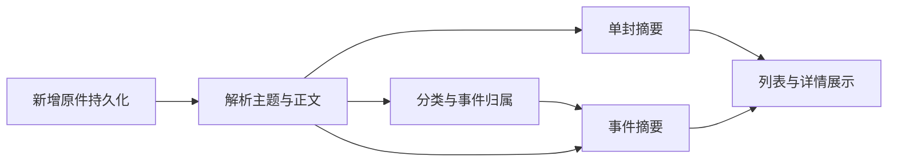

# 邮件全链路优化：网络采集、增量同步与摘要阅读

> 语言：简体中文 | [English](../../docs/email-pipeline-optimization-design.md)

状态：2026-09-10，在 `codex/email-pipeline-optimization` 分支实施。部署／首次启用时间边界、取消自动未读扫描、登录恢复红点、仅依赖原文的摘要、正文折叠与本地按需加载已编码并通过测试。**三家托管 Reader 已编码并安装到专用浏览器，完整提供方验收仍在进行；Gateway／WebChat 改动尚未部署。** 下文描述目标行为，不代表全部验收完成。

## 1. 目标与设计优先级

本任务覆盖获取脚本 → 油猴运行 → 原件入库 → 增量调度 → 分类与事件归属 → 摘要 → 邮件窗口，而不只优化窗口。

用户要求：

1. 以本地已经存在的 QQ 邮箱网络接口获取脚本为参照，补齐 Outlook、Gmail 获取脚本；三家脚本实际导入油猴使用。
2. 首次只获取用户部署时间之后收到的邮件，已读／未读均纳入；此后沿上次已完成的获取时间线同步尚未获取的邮件，不重复全量获取与分析。
3. 登录失效时在邮件窗口打开按钮显示红点，提示重新登录；恢复原账号后自动补齐中断期间未获取的邮件。
4. 恢复摘要，改善分类后的可读性。默认阅读摘要，正文由用户按需点击查看。首次整理允许承担较大工作量，日常仅处理新增及实际受影响的内容。

本设计替代[分类与事件对话 v3](email-management-classification-v3.md)中“不生成邮件／对话摘要”“正文默认完整展示”“采集脚本不在范围”的后续产品要求；该文档记录的历史实现和部署事实仍然保留。同时替代[接收设计](email-management-stage-2-intake.md)中以激活时间、历史未读和跨下界线程回溯确定后续自动采集范围的要求。继续采用通知／交互分类和以事件为最小对话单位，不因恢复摘要改变事件归属规则。

## 2. 现有实现与缺口

| 环节 | 已核对的现状 | 本次需要完善 |
|---|---|---|
| QQ 网络读取 | `scripts/email/userscripts/qq-internal-reader.user.js` 0.2.0 使用当前登录会话的 `/list/maillist` 和 `/read/readmail?func=5`，是第一页普通邮件原件读取与测速脚本 | 产品化分页、账号绑定、检查点、连续同步；补充置顶／聚合行覆盖 |
| QQ 真实证据 | 已验证小样本 EML 和定向往来链搜索；见 [QQ 试验记录](qq-internal-api-trial.md) | 不把试验当作完整邮箱覆盖；油猴实际安装执行尚未验证 |
| Gmail／Outlook | 已有浏览器邮件采集链路，不能等同于已具备 QQ 同类网络直读 userscript | 分别观察当前网页实际请求，实现独立适配器并验证完整原件获取 |
| 油猴安装 | `configs/browser-components.json` 与 `scripts/browser_components.py` 管理固定版本油猴、两个 AI 导出脚本；支持稳定 UUID、哈希、原生 `jsonImport` 和就绪检查 | 纳入三个邮件脚本；现有安装器按 `tools/browser-userscripts/` 读取源文件，需确定邮件脚本的唯一发行位置 |
| 增量采集 | [接收设计](email-management-stage-2-intake.md)已有近期／未读双通道、时间区间、重叠窗口、分页确认与恢复；默认空闲间隔 20 分钟、每页至多 50 封 | 复用可靠进度语义，取消未读发现通道；仅按部署下界、接收／变更时间和入库状态确定采集范围 |
| 阅读 | `apps/webchat/src/components/emailPopup.tsx` 提供分类 → 事件 → 详情；`emailMessage.tsx` 正文 `
` 默认展开且未展示邮件摘要 | 邮件摘要、事件概览和列表预览；正文默认折叠、按需载入 |
| 分析 | API／Store 保留部分摘要结构，当前事件策略约束旧摘要任务；旧设计记录过派生数据互相触发的问题 | 新建单向、按原件版本触发的摘要调度，不能直接解除旧任务禁用后全量重跑 |

QQ 样本的提速数据只证明当时少量邮件网络读取的可行性；Outlook、Gmail 的具体接口、速度、限制及账号类型覆盖均须独立验证。

## 3. 三家网络获取脚本与油猴接入

### 3.1 统一能力、分别适配

建议三个受管入口：`qq-mail-reader.user.js`、`gmail-mail-reader.user.js`、`outlook-mail-reader.user.js`，共享结果结构和同步语义，各自维护站点请求解析。实现前决定将 QQ 试验脚本保留为试验，产品源码统一放入 `tools/browser-userscripts/`；不要维护两份可独立变更的生产源码。

每个适配器提供：检查登录与实际账号、枚举时间区间及后续页、展开原生线程的单封成员、按稳定提供方 ID 读取原件、取消操作、返回覆盖与错误。具体命令字段是 SparkClaw 内部设计，不是已注册接口。

| 提供方 | 实现基线 | 必须补齐的验证 |
|---|---|---|
| QQ | 复用已观察到的列表与原件请求；定向搜索试验可作为分页研究依据 | 多页、置顶、聚合行、收件／已发送、旧时间邮件新出现、账号切换 |
| Gmail | 观察已登录页面实际使用的列表／线程／原始邮件请求；现有浏览器导出用于原件对照 | 标签重复不重复入库、线程成员逐封枚举、多账号页绑定、分页与接收时间语义 |
| Outlook | 观察当前 Outlook 网页实际请求；个人邮箱与 Microsoft 365 分别记录支持状态 | 文件夹移动与标识变化、线程成员、MIME／原件完整性、分页及账号类型差异 |

不将 Gmail History API、Microsoft Graph delta 等需要另行 OAuth 授权的能力假定为网页登录可用。实际观察到且验证过的变更游标可以采用；否则使用有界时间区间与去重。未验证的提供方能力明确显示“不支持／覆盖不完整”，不能猜接口或拼接 HTML 冒充原始 EML。

### 3.2 凭据、传输与持久化

脚本在匹配的已登录邮箱页面运行，复用页面会话；Cookie、SID、临时令牌不写入结果、日志或同步检查点。绑定实际账号及当前任务，切换账号或登录失效立即暂停。请求范围按已观察的站点 origin／操作白名单限定，超时、响应大小和取消继续有界。

原件沿现有 Browser Controller 下载回执 → Gateway 校验 → Store 发布流程进入 owner 对应的邮件来源存储。网络得到真实原件字节后，可通过受控下载交付；必须校验任务、账号、稳定邮件 ID、字节数、哈希与 MIME，再生成持久化确认。脚本只负责读取与交付，不自行向任意本地 HTTP 地址上传，也不独立维护权威同步时间。

复用现有原件下载和附件提取；模型只读取主题与正文，不分析附件。保持发送、回复审批和远端已读操作的既有边界；网络读取的已读副作用应实测记录，不把本地查看摘要等同于远端已读。

### 3.3 真正完成“导入油猴使用”

通过受管组件清单为三个邮件脚本增加稳定 UUID、版本和源码 SHA-256，使用现有原生 `jsonImport`。部署就绪检查应从固定“两份导出脚本”扩展为按清单逐项校验，覆盖 Local／Remote 安装、升级、重复部署和浏览器重启。

完成标准必须同时具备：油猴中已导入且启用、源码和版本匹配、正确邮箱页面实际执行、完成原件入库并返回确认。仅在 CLI 注入同一源码执行，或仅看到脚本源码文件，不算导入验收。浏览器关闭／未登录时显示等待浏览器／登录，恢复后继续原检查点。

## 4. 首次整理与增量同步

### 4.1 首次整理范围

首次范围为**用户部署时间之后收到的邮件**。部署成功时持久化该用户部署实例的 `deployment_started_at`，使用 UTC 保存、按用户时区展示，作为固定采集下界；重启、升级、重复部署、启用邮箱、首次登录或重新登录都不得将其重置为当前时间。同一实例后续绑定的邮箱也从该部署下界开始建立各自检查点。

已读与未读一视同仁，不再保留未读发现通道，也不根据未读状态决定获取优先级。部署前邮件即使未读，也不自动获取；部署后在手机或其他客户端读过的邮件仍需获取。迁移已有部署时优先采用可核验的原部署记录；如果缺失，按用户明确确认的规则采用首次成功启用邮件接收的时间，并按用户持久化一次、供后续邮箱复用，不能默认为升级时间或伪造完整覆盖。

默认覆盖已验证的普通收件文件夹／标签；已遇到事件的已发送成员仅在部署下界之后按既有线程范围补齐，不因线程引用自动下载部署前原件。部署前的关联内容标记为范围外，不据此臆造完整往来。草稿不作为正式邮件，垃圾／已删除及未验证范围明确排除。已有本地原件不删除；部署前历史导入若将来需要，应作为另行明确的范围扩展，不是此次默认行为。

首次部署后积压整理低于新邮件同步优先级，采集与分析进度分开显示。原件可分批入库，摘要可渐进出现；不必等历史全部分析完成才使用邮箱。

### 4.2 “上一次获取时间”精确定义

它指**上次连续完整枚举且原件已持久化的覆盖边界**，不是上次点击按钮的时间、任务启动时间、最新一封的发件时间或摘要完成时间。

建议按 `owner + provider + mailbox + folder/lane + scope_version` 持久化：

| 状态 | 含义 |
|---|---|
| `deployment_started_at` | 固定部署下界；未首次完成时从此起点获取 |
| `completed_through` | 已完整处理的连续接收／变更时间边界 |
| `scan_upper_bound`、`continuation` | 本轮固定终点和未完成分页位置；中断原位续跑 |
| 原件身份与版本 | 稳定提供方 ID、源版本／哈希及持久化回执，用于去重与修复 |
| 待重试项／覆盖缺口 | 失败 ID、区间、原因和下次可重试时间 |
| 首次整理范围／进度 | 与日常增量独立，避免暂停历史整理阻塞新增 |

每轮流程：

1. 验证当前登录账号，取得同邮箱唯一采集租约，固定扫描上界。
2. 优先续跑未完成区间；新一轮从 `completed_through` 向前保留一个重叠窗口查询到固定上界。沿用现有 24 小时重叠作为初始值，按提供方实测调整，下界始终为 `max(deployment_started_at, completed_through - overlap)`；尚无完成边界时从部署时间开始。使用提供方接收／变更次序发现候选，再按实际接收时间确认部署范围，不能用可回填的 RFC Date；部署前邮件仅因部署后移动／变更被再次发现，不应自动纳入。
3. 对稳定 ID 做入库检查。已获取且源版本未变化的邮件只作轻量元数据核对，跳过原件下载、解析、分类和摘要；多标签／多页重复同样跳过。
4. 仅下载未获取邮件，以及已知缺失／损坏或原件确实更新的必要修复项。逐封落库、逐页确认；失败原件保留待重试状态。
5. 当前区间完整枚举且原件全部持久化后，原子推进边界。空区间也可在明确枚举完整后推进；部分页、限流、错误响应不得推进至扫描终点。分析失败不阻塞采集边界。
6. 新原件触发局部分析。无新增、无原件变更时，不触发模型调用。

例如：完成到 10:00，下一轮扫描至 10:20；10:12 的原件下载失败时，不得将完整覆盖声明为 10:20。10:15 已成功入库的邮件在重试时跳过下载；10:12 补齐且区间完整后才提交新边界。

时间相同的邮件必须翻完所有页或使用经验证的稳定次序，不能简单筛选 `time > lastTime`。移动文件夹造成 ID 变化时保留来源映射；RFC Message-ID 本身不作为跨账号强制合并键。游标失效从最后完成边界有界重扫，不从当前时间重置。

停机数日后，从保留边界补到现在，不只取最近 24 小时。活动区间固定终点不能遮住新到邮件，沿用独立近期观察。提供方支持可靠变更游标时优先捕获延迟出现的旧时间邮件；仅时间扫描无法证明任意延迟邮件完整覆盖，需记录限制并提供定向补采，而非每轮全量重扫。

默认继续使用现有 20 分钟空闲间隔，手动同步复用同一队列、检查点与去重。油猴不另启一套后台定时器，重复点击合并为同邮箱一个任务。提速先来自网络直读和消除重复工作，本轮不擅自改变同步频率。

### 4.3 登录失效、入口红点与自动补齐

由后台同步／账号检查确认登录失效后，将对应邮箱持久化为“需要重新登录”，保留最后完成边界、未完成分页和待重试项；暂停该账号需要登录的请求，其他正常邮箱继续同步。网络超时、限流或浏览器未启动不能直接判为登录失效。

邮件窗口打开按钮（`EmailPopupEntry` 的邮件图标）显示红点：只要当前用户有任一启用同步的邮箱需要重新登录，红点就显示。窗口关闭时也要通过页面级状态订阅或轻量轮询获取该状态，不能依赖打开窗口才加载的 hook。提示文字／无障碍名称包含“邮箱登录已失效，请重新登录”；红点与未查看邮件数量分别表达，不使用同一标志混淆。

打开邮件窗口后，列出失效的提供方／账号，提供“重新登录”入口，并说明“登录后将自动补齐未获取的邮件”。仅打开窗口、查看提示、点击登录或刷新页面都不能清除红点。重新登录后必须验证实际账号与原绑定一致；登录了其他账号不得推进原账号检查点或将其视为恢复。

原账号验证成功后，自动从最后完整边界（尚未同步过则从部署下界）补到当前时间，包括失效期间已在其他设备读过的邮件。不得以重新登录时间替换边界，也不只补最近 24 小时。复用分页确认、去重和中断恢复；显示“正在补齐”、覆盖进度以及剩余失败项，不能登录成功即显示全部同步完成。

红点专门表示需要用户重新登录：确认恢复的邮箱移除该状态；若仍有其他邮箱失效，红点保留。全部恢复后红点清除，补齐仍在进行时由窗口内进度提示；补齐失败明确显示未完成区间并可重试，不误用登录红点。关闭窗口不停止后台补齐，刷新／重启后提醒状态和补齐进度均可恢复。

示例：9 月 10 日 09:00 部署，10:00 完成同步，10:05 登录失效；9 月 12 日 11:00 重新登录。保留 09:00 部署下界，从 10:00 的完成边界续跑至恢复后的当前时间；10:00 后的已读／未读新收件都补齐，部署前旧未读不获取。

## 5. 摘要与按需阅读

### 5.1 展示内容

| 位置 | 默认内容 | 正文入口 |
|---|---|---|
| 事件列表 | 简短事件名、最近活动、未查看数、1–2 句事件摘要预览 | 点击事件进入详情 |
| 事件详情顶部 | 事件概览：发生什么、最新进展、邮件明确提出的待确认事项；可定位来源邮件 | 点击来源打开对应邮件 |
| 单封邮件卡片 | 收发方、时间、2–4 句摘要，保留关键金额、期限、结论、明确请求 | “查看正文”，默认折叠 |
| 待归类／未归属邮件 | 可先生成本邮件摘要，显示尚未完成的归类状态 | 同样可看正文和原件 |

摘要为默认生成能力，不要求用户先点击才开始分析。建议单封摘要通常 80–200 汉字、事件概览 120–300 汉字，简单通知可以更短；这是初始长度目标，不为了凑字数增加内容。保留“邮件称／要求”的事实语气，不替用户决定责任人或执行动作。

摘要注明生成状态和语言，跟随当前语言设置；待生成、生成中、失败、更新中分别展示。摘要缺失时展示主题／发件人和状态，可直接查看正文；不用截取正文伪装成已生成摘要。事件变更期间可保留旧摘要，但标明更新中。引用邮件不存在或已失去访问权限时，不保留可误导用户的过期来源内容。

正文从本地已入库原件／解析结果读取；展开不会重新获取远端邮件或调用模型。列表与时间线的默认投影不携带完整正文，点击后通过 owner 隔离的单封读取加载并缓存。纯文本保真；如后续支持 HTML，应清理活动内容并默认不加载远端资源。附件和原始 EML 仍可独立下载。

保持现有本地已查看口径：实际进入活动详情视口的邮件卡片（含摘要）可记录已查看；仅加载事件列表、预取或生成摘要不记录。正文是否展开不改变该口径，也不写远端已读。

### 5.2 分析必须单向收敛

推荐依赖关系：

分类、事件判定和命名继续使用原始证据；生成摘要不能反向进入候选检索、归类输入版本或事件归属证据。事件摘要使用确定成员集合及可定位的原文片段；长事件分段提炼仍保留原文引用，不能仅以旧摘要递归生成新事实。

- 单封摘要的缓存键由原件内容版本、摘要策略版本及语言确定；查看、分页、已读、同步心跳不改变键。
- 事件摘要的缓存键由成员 ID／原件版本集合、摘要策略版本及语言确定；新增／移除成员或源内容改变才更新。人工改分类但成员不变时，不重算单封摘要。
- 同一批事件成员陆续入库时合并摘要任务，避免每封触发全事件重算。用户正在查看的事件优先，首次历史摘要低优先级。
- 同一目标同一输入只有一个有效任务。建议首次请求加至多一次技术重试，失败可见且允许显式重试；输入改变后取消或隔离旧输出，禁止过期结果覆盖新版本。
- 模型超长输入按容量做有界分段，保留日期、数字、否定和请求上下文，标明缺失范围；不静默截断后声称总结完整。邮件正文始终按数据处理。
- 已有历史原件只需一次有检查点的摘要补建，不重新采集、不强制重新归类。旧的耦合任务保持隔离，使用新的独立策略版本；统计实际模型请求，不能把队列循环数当作调用次数。

恢复摘要允许首次整理投入更多计算，但不能恢复历史中“摘要变化 → 候选变化 → 归类变化 → 摘要变化”的循环。

## 6. 实施顺序与范围

| 阶段 | 交付 | 退出标准 |
|---|---|---|
| 1. 网络适配与受管导入 | QQ 产品化、Gmail／Outlook 适配器、组件清单及就绪检查 | 三家各自完成真实页面的油猴执行和原件入库；未支持范围明确 |
| 2. 增量接入 | 复用 Store／Controller 检查点、去重、续跑与错误状态 | 首次、零新增、多页新增、失败恢复、停机恢复均符合边界语义 |
| 3. 摘要与阅读 | 独立摘要任务、历史补建、列表预览、正文按需加载 | 来源可追溯、无派生循环、无新增时零模型调用、正文可直接查看 |

预计涉及 `scripts/email/userscripts/`、`tools/browser-userscripts/`、`configs/browser-components.json`、`scripts/browser_components.py`、邮件 Controller 接入、`services/gateway/internal/emailmanagement/`、`store/`、`gateway/`、WebChat 邮件 API／hooks／组件／样式／i18n 及相应测试。具体文件以实施检查为准。

本任务只在邮件 worktree 完成。另一个 worktree 负责 AI 对话导出，不改其导出算法、第三方脚本或固定版本；受管清单、安装器和就绪检查可能双方都会涉及，集成时逐项合并并保留全部脚本，不用整文件覆盖。原始任务统一整合，本任务不自行合并主工作区。

本设计不改变 JingSi 运行时或 IMMS 证据服务契约，其他项目无需跟进。若实施引入跨项目接口变化，则先按 InfiniCenter 决策流程立案。产品行为落地时更新簇状态，并交付提交、验证结果、提供方覆盖限制和集成注意事项。

## 7. 验收矩阵

| 场景 | 必须观察到的结果 |
|---|---|
| 三家首次获取 | 分别记录账号类型、文件夹范围、实际油猴版本与执行证据；真实原件可解析、附件存在时可提取，字节／语义差异有记录 |
| 零新增连续同步 | 可做轻量列表请求；原件重复下载 0、新邮件记录 0、模型调用 0 |
| 多页和同时间邮件 | 超过 50 封、时间相同、标签重复、置顶／聚合行均不漏项；未支持场景显示缺口 |
| 部署时间下界 | 部署前未读不获取、部署后已读照常获取；重启／升级／晚绑定邮箱不重置下界；线程和重叠扫描不越界补原件 |
| 登录失效红点 | 窗口关闭仍显示入口红点；打开／刷新不消除；多个账号逐一恢复，最后一个恢复才清除；普通网络故障不误报失效 |
| 重新登录补齐 | 原账号核验后自动续跑全部中断区间，包含其他设备已读邮件；错误账号不清除原失效状态、不推进边界；补齐与摘要进度独立 |
| 新邮件已在手机读过 | 仍按时间／变更发现，未读状态不影响是否获取 |
| 重启／中途失败／限流 | 从原确认边界恢复，成功原件不重复下载，失败区间不误报完整 |
| 账号切换与多标签页 | 检查点不串账号；同邮箱不会并行重复提交；恢复原账号继续旧进度 |
| 日期与迟到 | 发件日期较旧但接收／变更时间新的邮件可获取；超出已验证能力的延迟可见邮件有明确限制 |
| 既有往来新增回复 | 入站与已发送成员按既有线程范围补齐，仅更新相关事件摘要，不重算无关邮件 |
| 摘要质量 | 独立合成集覆盖通知、交互、多封事件、否定、金额、期限、请求、长文本；关键事实与引用可回到原件，不把不同事件混写 |
| 模型成本与稳定性 | 首次与日常分别报告邮件数、原件请求数、实际模型调用／token、重试数、耗时；100 次刷新和 30 分钟无新增期间任务版本不增长 |
| 正文与错误体验 | 默认摘要、正文折叠；展开仅本地加载；摘要失败时仍可看原文；键盘、窄屏、语言切换及逐封查看状态正确 |
| 受管部署与整合 | 重复部署／重启后无重复脚本且版本一致；AI 导出脚本保持工作；Local／Remote 分别核验 |

工程检查覆盖适配器请求与错误解析、增量状态机、memory／file／PostgreSQL 恢复、摘要依赖与缓存、WebChat 交互和构建。真实提供方测试与合成离线测试分别报告，未完成的提供方验证不能由单元测试代替。

此前仅设计阶段已被下述实现取代。真实提供方验证使用隔离采集工作区，不启动生产邮箱分析。

## 本轮实现与验证记录（2026-09-10）

- 用户已明确：使用 SparkClaw 专用浏览器；无可核验部署记录时，从首次启用邮件接收功能开始，按用户持久化一次，之后新增邮箱复用该下界。不得用升级时间覆盖。
- Go 邮件管理、自动化、Store、Gateway 测试通过；WebChat 40 个测试文件／128 项测试及生产构建通过；浏览器采集、读取、分页、Reader 与契约 96 项测试通过；下载链路另有 8 项回归通过。整合端独立完整 Go build/vet/test、前端测试与构建以及较大范围 Controller 回归通过。
- 已用配置中的真实模型处理合成邮件，单封与事件摘要均保留 240→260 的金额变更、尚未批准及禁止下单；这只是格式与内容冒烟验证，不代表完整语料质量验收。
- QQ／Gmail／Outlook Reader 0.1.0 已生成并固定于产品清单；实际 profile 快照核对过 enabled/system、evilness=0 及源码哈希。安装验证不替代采集验收。
- Gmail 原生下一页及终页状态与 HTTP 观察一致；网络重放同时使用上一页返回的不透明游标和页码，按逐封收件时间筛选，保留已读邮件以及另类 ID 已发送回复旁的入站成员。终页确认前重查已扫描页面指纹，指纹不包含会变化的已读标记。真实完整区间按两页返回 58／11 封入站邮件，仅第二页复核前页后推进边界。真实空时间段返回零候选且允许推进终点；已观察到的 null 列表封装必须同时具备匹配的原生搜索 URL 和可见空结果提示。
- Outlook 消费者邮箱通过早期 Worker 观察桥及原生文件夹元数据初始化获取 ItemRows／ItemExport 模板；扩展覆盖要求完整 FindFolders 清单、普通文件夹祖先关系、隐藏标记及不按重点筛选的 None 视图。仅收件箱或未知层级证据不能推进整个时间区间。真实全文件夹扫描返回收件箱两封、存档零封，只有最后一页及前缀复核后允许推进边界。
- Gmail 和 Outlook 均已采集两封真实原件，完成原生学习→网络下载，回执重放不重复下载。Gmail 同一封原生／网络 EML 逐字节一致；其真实重定向终点为 mail-attachment.googleusercontent.com，受控 Blob 链接使用真实浏览器点击，避免慢检查后失去下载激活。此前同目标原生回退也已验证。Outlook 同封原件也逐字节一致；两家已观察覆盖范围的完整区间终页均通过。Microsoft 365 Worker 路径尚未验收，保留原生回退。QQ 最新标准登录探测为 email_login_required，真实 QQ 续采等待重新登录；QQ Reader 保留列表观察及原件获取、沿用现有原生网络观察回退，通用重放分页与置顶／分组覆盖尚未认证。
- 摘要依赖仅含原文与事件成员，100 次刷新回归确认不重复生成、不反向触发分类。当前摘要采用原文语言，按界面语言缓存仍未实现。
- 分页采集与会话补采均检查单封收件时间；旧成员排除，缺少时间的成员标为采集缺口。Outlook 会话的 LastDeliveryTime 不可套用到每封成员。
- 可核验部署时间记录在工作区根目录 `.sparkclaw-deployment.json`；旧实例无记录时，Store 固定首次启用下界。重新登录不重置该下界或已有采集进度。
- 部署生命周期修正：仓库自带 `.gitkeep` 目录不作为既有部署证据。服务启动前依据实际 Compose 资源或 Gateway 状态建立 fresh/legacy 尝试标记；仅成功完成时记录下界，失败后重试保留 fresh 身份。7 项生命周期测试与 5 项隔离 Remote 入口测试通过。
- 整合审查将邮件分支 `045b2e1` 与 AI 导出整合 `c276d49` 组合：保留 RevivalStack 派生版本和油猴 r8，共四个启用的受管脚本，旧导出器仍按精确 system UUID 淘汰。合并后 Go build/vet/全量测试、WebChat 128 项测试及构建、Controller 263 项测试（另有 1 项既有跳过）、25 项部署／组件检查（含 1 项可选跳过）、20 项 AI 导出／浏览器／原生 Bridge 测试通过。另在全新隔离原生安装中，三个最终邮件 Reader 均实际执行，所有受管脚本的源码哈希及 enabled/system/evilness 状态正确。这些检查不扩大上述真实账号认证范围，也未部署 Gateway/WebChat。
