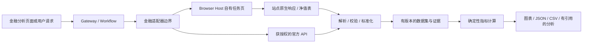

# 金融分析：浏览器行情采集与统一数据设计

> 语言：简体中文 | [English](../../docs/finance-market-data-design.md)
>
> 状态：可行性设计，待实施。研究日期：2026-09-29（Asia/Shanghai）。
> 本轮交付为设计文档与公开页面只读调查；没有新增金融 Workflow、生产脚本、接口或部署。

## 1. 结论与首期范围

**有条件可实现。** SparkClaw 已有持久浏览器、任务页隔离和固定脚本执行基础，可在同一浏览器 Profile 中复用站点登录态。建议通过站点适配脚本取得结构化原始行情，由确定性程序统一单位、时间与复权口径，再计算指标，最终提供 JSON／CSV 和分析页面。浏览器身份共享、三站完整历史数据采集、长期稳定运行是三个不同的验收事项。

首期建议支持沪深股票、场内 ETF 的日线 OHLCV，以及场外普通基金的已披露日净值；支持 MA、EMA、MACD、RSI、KDJ、BOLL 与成交量均线。东方财富作为股票／ETF 首选候选，天天基金作为基金净值候选，同花顺作为独立补充来源。先覆盖少量用户指定标的，不承诺全市场、逐笔、Level-2、无限分钟历史或实时 SLA。

基金必须分型：场外基金的单位净值不能伪装成交易 OHLCV；场内 ETF 的交易价格、基金净值和 IOPV 也不能互换。货币基金需要每万份收益／七日年化等独立指标，首期不强行套入普通基金净值模型。交易、申赎、账户资产／持仓采集不在本需求范围。

本设计建议可以进入有限 PoC，尚不具备宣布三站生产可用的证据。

## 2. 研究方法与已确认事实

本轮先阅读本仓库 `main@4588f41` 的浏览器运行时、Controller 注册及邮件网络 Reader，再访问三站公开页面和同花顺官方接口文档。公开浏览器探查使用 **Codex 内置浏览器**；可用浏览器清单没有暴露 SparkClaw 的持久 Profile，因此它不能证明用户现有金融登录态已经复用。未登录三站、读取账户、提取 Cookie 或订购数据服务。

| 编号 | 入口与本轮结果 | 能证明什么 | 不能证明什么 |
|---|---|---|---|
| E01 | [天天基金入口](https://www.tiantianfunds.com/)及[000001 基金页](https://fund.eastmoney.com/000001.html)可见基金资料、单位／累计净值和历史净值入口 | 用户给定入口需要继续到实际基金详情域名 | 各域名共享登录，或全部基金均可采集 |
| E02 | [历史净值页](https://fundf10.eastmoney.com/jjjz_000001.html)在浏览器显示日期、单位／累计净值、日增长率及分页；出现 2026-09-28 等日期和 301 页标识 | 公开历史净值表可读，是首期有效候选 | 没有翻完分页，未验收全部历史、完整性或接口响应格式 |
| E03 | [东方财富 600519](https://quote.eastmoney.com/sh600519.html)浏览器显示当日价格、开高低、成交量／额、换手率、日周月 K 线与分钟选项，以及 RSI/KDJ/MACD 等菜单 | 动态页面可加载公开行情和指标入口 | 菜单存在不等于指标序列／完整 K 线响应已采集；盘中现价不是最终收盘价 |
| E04 | [同花顺 600519](https://stockpage.10jqka.com.cn/600519/)显示日／周／月／分钟按钮和登录入口，但探查结束时图表仍在加载、指数为占位符 | 发现当前页面结构与加载限制 | 不能把结果归因为“必须登录”或“反爬”，也不能据此宣称历史行情可读 |
| E05 | [同花顺数据接口手册](https://quantapi.10jqka.com.cn/gwstatic/static/ds_web/quantapi-web/help-center/manual.html)描述历史、高频和实时行情，并给出 HTTP 请求示例 | 官方接口是一条独立的结构化获取路线 | 没有用户接口凭据，未验证账户权益、配额、价格或成功响应 |
| E06 | 静态网页提取在东方财富返回大量占位符，天天基金详情首次抓取超时；浏览器随后能加载相关内容 | 单次静态 HTTP／搜索摘要不足以验证动态数据可用性 | 不能推断失败永久存在，也不能把浏览器成功扩大为生产脚本成功 |

以上均为单次、有界、公开页面观察，未采集原始网络 payload，未执行性能、完整区间或登录复用测试。网页显示时间与访问时间要分开记录，检索缓存日期不能充当数据日期。

三个站点是数据展示／服务来源，不能仅因知名就称为每条数据的原始权威。天天基金页面说明基金具体信息以管理人公告为准；关键净值／分红用基金管理人披露核对，交易信息以获授权的数据源及交易所口径核对。天天基金与东方财富具有同一集团／数据服务关系，不能默认算两个独立交叉验证来源。[基金页面](https://fund.eastmoney.com/000001.html)

## 3. 三站适配策略

| 来源 | 优先目标 | 拟议采集方式 | 必须先验证的事项 |
|---|---|---|---|
| 天天基金 | 普通场外基金净值、累计净值、基金元数据；分红单独建事实 | 详情页进入历史净值页；优先站点原生结构化响应，其次有表头与分页证据的 DOM 表格 | 日期边界、分页终止、基金类别／份额、缺失原因、分红口径；估算值不得覆盖正式净值 |
| 东方财富 | 沪深股票／ETF 日线、成交量／额；估值快照可后续接入 | 在任务页选择标的／周期／复权，捕获对应图表原生数据；指标主要本地计算 | 标的映射、字段排列、量的单位、复权锚点、历史长度和盘中 bar 更新 |
| 同花顺网页 | 同标的日线和补充数据 | 先排查 E04，再验证任务页内的原生请求／图表数据；不以页面文本替代缺失历史 | 加载依赖、是否需登录、权限与频限、数据单位和复权差异 |
| 同花顺 iFinD | 具有正式权限时的历史／高频行情 | 独立官方 API 适配器，使用用户授权的接口凭据 | 官方授权范围、调用限额、字段及复权参数；网页登录态不等于 API 权益 |

官方手册提供 `THS_HQ` 与 `POST https://quantapi.51ifind.com/api/v1/cmd_history_quotation`，HTTP 示例使用 `access_token`，支持指定证券、字段、起止日期和输出设置。该路线不应通过复制网页 Cookie 获得权限。配额按官方数据类别及账户实际权益核实。[接口手册](https://quantapi.10jqka.com.cn/gwstatic/static/ds_web/quantapi-web/help-center/manual.html)、[常见问题](https://quantapi.10jqka.com.cn/gwstatic/static/ds_web/quantapi-web/help-center/faq.html)

本轮没有验证东方财富／天天基金内部 API 的 URL、参数和字段顺序，因此不把网络流传的接口模板写成已确认契约。PoC 应保存实际页面发出的、脱敏后的请求形状及响应样本，之后再冻结映射；没有正式 API 文档的网页接口按内部实现看待，须允许版本失效。

## 4. 登录态复用与浏览器边界

现有 [Browser Runtime](browser-runtime.md) 使用 owner 的持久 SparkClaw Chromium Profile，Gateway 通过私有 Controller socket 调用 Playwright CLI／Bridge，只控制自有任务页。App-CLI 抽离后，应用准入由 [app-cli-client.mjs](../../tools/browser-controller/src/app-cli-client.mjs) 承接，[host-driver.mjs](../../tools/browser-controller/src/host-driver.mjs) 保留通用任务页控制；邮件脚本和 Reader 来自[成套 App-CLI 发行](../../configs/app-cli-release.json)。金融注册、Reader、Schema 与解析器仍需要新增，不能将通用浏览器存在等同于金融采集已实现。

拟议流程：在 SparkClaw Browser 正常登录 → 同 Profile 创建金融任务页 → 验证站点、登录／权益状态 → 固定脚本读取 → 输出脱敏业务数据 → 释放页面。普通 Chrome、Codex 内置浏览器与 SparkClaw Profile 互不等价；用户若只在其他浏览器登录，需要先在 SparkClaw Browser 登录。Electron 是现有已接受的宿主目标，金融适配器依赖宿主接口，不另建常驻浏览器或恢复已退役的全局 CDP 路线。

Cookie／localStorage 等受浏览器作用域控制；同 Profile 不会把三家网站的账户互相登录，也不能保证新标签继承仅存在于 sessionStorage 的身份。SSO 重定向与登录域名须逐站确认。脚本不得导出 Cookie、storageState、密码或完整 Profile。新页不具备身份时返回 `login_required`，验证码、二次验证与过期登录交给用户在正常站点完成，不自动绕过。

同一站点的不同子域也可能跨 origin。页面内 `fetch` 是否能读取响应取决于服务端 CORS、Cookie 的 SameSite／域属性及站点正常认证流程，`credentials: include` 不会取消这些约束。公开 JSONP／脚本数据只解析经审核的载荷形状，不能对下载内容使用 `eval`，也不能把 `no-cors` 的不透明响应当作数据。[MDN Fetch](https://developer.mozilla.org/en-US/docs/Web/API/Fetch_API/Using_Fetch)

网页登录态与官方 API 凭据走不同路径；后者进入既有凭据管理边界，不写在命令参数、日志或模型提示中。Playwright 官方文档也明确认证状态文件可能包含可用于冒充账户的信息；本设计选择留在现有浏览器内使用。[Playwright Authentication](https://playwright.dev/docs/auth)

## 5. 采集流水线与工程归属



1. 接收标的、资产类别、周期、日期范围、复权和指标参数；解析为规范标的 ID，不接受模型提供的任意 URL／脚本／选择器。
2. 检查适配器 capability：支持的市场、周期、历史上限、认证模式与当前数据权限。不能满足时明确返回，不偷偷切周期、复权或来源。
3. 命中合格缓存则复用，否则取得任务页租约；在导航前安装经审核的有界 Reader，再触发站点本来的查询。优先结构化响应，DOM 表格仅作已验证的后备；截图／OCR 不作为 OHLCV 批量数据源。
4. 只观察允许的 origin、路径、方法、标的及周期。过滤广告、账户、交易接口和无关响应；限制长度与数量。网页内容是数据，不能指挥工具执行。
5. 完成分页、校验、去重、覆盖检查和原子发布。原始行情载荷与请求形状脱敏后存本地证据；记录 SHA-256、解析器／适配器修订和采集时间，不保存认证头、签名 URL 或全站 HAR。
6. 指标从同一冻结数据集计算；模型仅解释已验证值。结束／超时／取消均撤销任务资源，保留可追溯的结果与失败状态。

既有邮件观察器曾暴露 Playwright 网络监听与页面生命周期的兼容问题，因此金融 PoC 必须验证实际 Bridge 路径的响应读取；不能只凭普通 Playwright Library 示例宣称可用。导航前受管 Reader 可以复用生命周期思路，但不复用邮件业务 Schema。新增受管页面脚本时应同步组件清单、源码哈希、构建和安装检查。

InfiniCenter 决策 **0030** 已接受 App-CLI 抽离，其 R3 方向是应用能力经 App-CLI 公共 Registry，通用 Browser Host 留在 SparkClaw。本设计遵守该权责方向：业务参数／解析属于适配层，任务页面及 Profile 属于宿主，数据集／指标／分析属于 SparkClaw；不另设绕过 Registry 的永久 Node 公共入口。App-CLI Runtime v2／BrowserHostPort 已在合并发行中实现，[生产验收仍待完成](app-cli-implementation-validation.md)。金融适配器不属于已完成的邮件范围：若实施涉及 App-CLI，先补充并接受跨仓决策与契约；本轮不修改其他项目接口，也不改变 Infinimesh-Info、JingSi 或 IMMS 契约。

下面是**拟议内部调用语义**，不是已存在命令或可运行 SDK：

```typescript
type MarketQuery = {
  instrument_id: string;
  kind: "ohlcv" | "fund_nav";
  interval: "1d";
  from: string; to: string; // 交易所本地日期，闭区间
  adjustment: "none" | "forward" | "backward";
  provider: "eastmoney" | "tiantian" | "ths_web" | "ths_ifind";
};
// 宿主只执行预注册适配器；以下函数均为拟议接口。
async function collect(q: MarketQuery, host: BrowserHost) {
  const adapter = registry.requireCapability(q);
  const task = await host.acquire(adapter.binding);
  try {
    const source = await adapter.readBounded(task, q);
    const dataset = normalizeAndValidate(source, q);
    return publishAtomically(dataset); // coverage 可为 partial，不等于完整成功
  } finally {
    await host.release(task); // 清理失败须记录并隔离，不掩盖主错误
  }
}
```

## 6. 统一数据格式：`finance.dataset.v1` 草案

统一的是标的、时间、来源和质量信封；内部使用有类型的记录，不能用一张全为可空字段的 K 线表装下所有金融数据。下列字段和枚举均为设计草案，实施时需机器 Schema 与 golden fixtures。

| 层次 | 必要字段／规则 |
|---|---|
| 信封 | `schema_version`、`dataset_id`、`revision`、`record_type`、`instrument`、`series`、`coverage`、`provenance`、`quality`、`records` |
| 标的 | `instrument_id`、原始代码、交易所／市场、资产类型、币种、名称、份额类别、provider symbol mapping 及映射版本；`000001` 不能单独定身份 |
| 序列 | 周期、IANA 时区、交易日历版本、价格复权类型／基准日／因子版本、量的单位与是否调整；不能混入不同口径的数据 |
| 覆盖 | 请求起止、实际首尾、行数、预期有效交易日数（可未知）、缺口及原因、`complete/partial/empty/unknown`、截断标记；`empty` 必须说明合法无数据原因 |
| 来源 | provider、数据产品／来源族、公开详情 URL、采集／来源更新时间、捕获方式、适配器／解析器修订、原始证据引用与哈希；响应无发布时间时保持 null |
| 质量 | 校验状态、是否延迟／过期／估算、冲突引用、缺失原因；缓存命中不能改写原始采集时间 |

记录按 `record_type` 区分：

- `ohlcv`：`trading_date`、可选 `bar_start/bar_end`、`open/high/low/close`、`volume`、`amount`、可选 `turnover_rate`、`is_final`。日线以交易日期为主键，不伪造午夜 UTC；分钟线后续须记录带时区的区间及标签是开端还是结束。
- `fund_nav`：`nav_date`、`unit_nav`、`accumulated_nav`、`daily_return`、`published_at`、`is_estimate`、份额类别。没有成交量和 OHLC；基金分红、拆分及确认发布时间另存事件。
- `metric`：`metric_id`、`value`、`unit`、`as_of`、`published_at`、`report_period`、`basis`、`origin=provider/local`。PE 必须区分 TTM／静态／动态；ROE、资金流与量比不能由 OHLCV 凭空产生。
- `indicator`：名称、参数、算法版本、输入 dataset ID／revision／hash、输入字段及复权、输出时间、数值与 warm-up 状态。网页展示指标和本地计算值分开保留。

价格、金额、净值和小数指标用十进制字符串；时间用 ISO 8601，时区明确；量用带单位的十进制字符串，百分比统一为比例（`0.0234` 表示 2.34%），RSI/KDJ 的 0–100 数值标为 oscillator 而非比例。业务数值／发布时间的 `null` 必须配 `not_applicable/not_published/unsupported/parse_error/insufficient_history` 等原因，不能填 0 或上一值掩盖缺失。基金净值请求只接受 `adjustment=none`；净值回报复权属于另外定义的收益序列。覆盖检查绑定请求字段与时间范围，缺少用户要求的成交量时不能仅凭日期齐全返回完整成功。

以下为**精简合成示例，数值不是网站行情**；省略名称／映射版本等标的元数据与真实原始证据哈希。生产数据必须补齐上述必要字段，`demo:` 证据引用不能作为生产证据：

```json
{
  "schema_version": "finance.dataset.v1",
  "dataset_id": "demo:ohlcv:1",
  "revision": 1,
  "record_type": "ohlcv",
  "instrument": {
    "instrument_id": "CN:EQUITY:XSHG:600519",
    "code": "600519", "exchange": "XSHG", "asset_type": "equity",
    "currency": "CNY", "share_class": null
  },
  "series": {
    "interval": "1d", "timezone": "Asia/Shanghai",
    "calendar_version": "demo-calendar-v1",
    "adjustment": {"mode": "none", "anchor_date": null, "factor_version": null},
    "volume_unit": "share", "volume_adjustment": "none", "amount_unit": "CNY"
  },
  "coverage": {
    "requested_from": "2026-09-28", "requested_to": "2026-09-28",
    "actual_from": "2026-09-28", "actual_to": "2026-09-28",
    "row_count": 1, "expected_count": 1, "state": "complete", "gaps": [], "truncated": false
  },
  "provenance": {
    "provider": "synthetic", "source_family": "demo",
    "source_url": null, "fetched_at": "2026-09-29T15:10:00+08:00",
    "source_updated_at": null, "capture_method": "fixture",
    "adapter_revision": "demo-v1", "parser_revision": "demo-v1", "raw_ref": "demo:raw:1"
  },
  "quality": {"validation": "synthetic_only", "freshness": "not_applicable", "warnings": []},
  "records": [{
    "trading_date": "2026-09-28", "open": "100.00", "high": "103.00",
    "low": "99.00", "close": "102.00", "volume": "123400",
    "amount": "12550000.00", "turnover_rate": null,
    "missing_reasons": {"turnover_rate": "not_published"}, "is_final": true
  }]
}
```

对应场外基金 ID 如 `CN:FUND:OTC:000001`，记录形状为 `{"nav_date":"2026-09-28","unit_nav":"1.2345","accumulated_nav":"3.4567","daily_return":null,"published_at":null,"is_estimate":false,"missing_reasons":{"daily_return":"not_published","published_at":"not_published"}}`，也是合成示例。基金名称相同但份额不同必须是不同标的；ETF 交易序列与净值序列通过标的关联，各自保留记录类型与时间。

JSON 为规范格式。CSV 按记录类型导出独立文件，附 `manifest.json` 保存版本、来源、单位、复权、覆盖及文件哈希；代码保留前导零，时间按文本导出。展示／导出层防止来自站点的字符串被表格软件解释为公式，不改变规范原始值。指标导出含输入数据集版本与参数。

## 7. 数据清洗与指标计算约定

**校验与历史一致性：** OHLC 应满足 `low <= min(open,close) <= max(open,close) <= high`，量／额非负；拒绝 NaN、非有限值及列漂移。按自然主键（来源、标的、记录类型、周期、复权基准、时间）去重，重复但值不一致进入版本／冲突记录。`手`、`股`、基金份额、合约不能混用：只有经该资产／源映射证实的 lot size 才转换，同时保留原值、单位及换算依据；指数的汇总量单位须独立定义。

**交易日与复权：** 使用交易日历并识别停牌、上市前、非交易日、未披露、源缺失；未知缺口不能自动归为休市。周／月线由完整交易日集合生成，开／收取首末、高／低取极值、量／额求和，当前未完成周期显式标记。价格复权不能隐含调整成交量／金额。除权后前复权历史可能变化：保留原始不复权系列、因子／锚点、抓取版本，并使受影响指标失效重算；供应商不暴露因子时只能标记 provider-adjusted snapshot，不能声称可独立复刻。

**技术指标：** 首期以已完成日线计算，默认价格输入为用户明确选择的复权口径（UI 建议前复权）；成交量均线使用原始量。缺失交易 bar 后不跨缺口伪造连续计算，分段并重新 warm-up，或返回不足历史。以下是 SparkClaw 拟议算法口径，不保证与网站同名指标逐位一致：

| 指标 | 拟议定义与边界 |
|---|---|
| MA / VOL_MA | n 个有效收盘／成交量的简单平均；MA 默认 5/10/20/60，VOL_MA 默认 5/10；不足 n 点为 null |
| EMA | `alpha=2/(n+1)`，第 n 个点以前 n 点 SMA 作种子，后续递推；必须记录种子策略 |
| MACD(12,26,9) | DIF=EMA12−EMA26，DEA=对 DIF 的 EMA9，柱值采用 `2*(DIF−DEA)`；按上述种子完整输出最早需 34 个收盘 |
| RSI(14) | 首 14 个相邻涨跌的平均 gain/loss 作种子，后续 Wilder 平滑；至少 15 个收盘；零 loss 且有 gain 为 100，全平为 50，零 gain 且有 loss 为 0 |
| KDJ(9,3,3) | RSV 来自近 9 个高低／收盘，零振幅取 50；前置 K/D=50，K=`2/3*Kprev+1/3*RSV`，D 同式平滑 K，J=`3*K−2*D` |
| BOLL(20,2) | 中轨 SMA20，上下轨 ±2 倍总体标准差（ddof=0）；不足 20 点为 null |

所有公式与输入处理版本化；EMA 类多取预热数据，额外预热长度随算法配置封存，不能每次切查询起点就悄悄改变相同日期的指标。输出记录实际 seed 起点、输入覆盖及不足状态；如需全历史种子则必须取得全历史。内部使用固定精度十进制实现（建议 34 位有效数字、明确舍入），末端再按展示精度舍入，禁止用已四舍五入的图表值继续计算。

PE/PB/ROE、换手率、量比、资金流分类属于额外指标适配，不承诺仅凭 K 线计算；口径缺失时返回不支持。普通基金收益不能简单用累计净值比值冒充含分红再投资收益；最大回撤／波动率等后续指标须先固定回报序列、分红再投资假设与年化规则。历史回测使用当时可知的发布时间和版本，避免把后来的净值修订／财报带入过去。

## 8. 可靠性、存储与产品呈现

建议 PoC 预算：每来源最多一个活跃采集任务、全局最多两个；主动数据查询之间至少 2 秒、单任务最多 20 次数据请求、120 秒 deadline、10 个标的且每标的最多 2,000 行，任何上限先到就截断并报告。以上为待测的本地保守预算，**不是网站公布的限额**。导航引发的站点轮询也要观测和限制生命周期；不能控制时，不把主动请求限速称为总流量限速。正式额度／更严格站点限制优先。

401／登录失效、403／验证码、权益不足、429 和 Schema 漂移分型处理；429 尊重 Retry-After 并结束当前轮，不高频换页重试。暂时网络错误在原期限内最多重试一次；服务拒绝或解析不匹配不自动重放。错误建议为 `login_required/challenge_required/entitlement_required/rate_limited/source_unavailable/schema_changed/incomplete_range/unsupported_interval/unsupported_adjustment/unit_unknown`，同时区分传输失败与数据集部分完成。

缓存键含 provider／数据产品、owner 或授权范围、标的、类型、周期、复权与锚点、日期段及适配器版本；相同请求进行 single-flight。公开源与授权源不跨权益共享。日终 bar 与盘中 provisional bar 分开，默认不拉盘中流；基金按净值披露节奏更新，QDII 等晚披露不能按股票交易日简单判过期。保留修订数据集，不静默覆盖旧报告引用的数据。质量冲突保留两源版本，按明确选择发布；不用跨源平均消除差异。

PoC 先复用现有 artifact 存储，保存脱敏源片段、规范数据、指标和 manifest。生产持久化再设计 repository／索引；如扩展 Store 必须同时覆盖 memory/file/postgres，不能只在 PostgreSQL 可用。原始证据保存期限受来源许可与本地策略限制，报告引用的数据版本至少保留至报告删除／到期；级联删除、导出与日志脱敏一并定义。

“金融分析”页面建议包含：标的选择与来源状态、周期／复权、K 线或净值图、成交量与指标、明细及导出。每张图能看到来源、数据截至时间、复权、单位、是否完整／延迟／估算；场外基金显示净值图，不出现虚假成交量。默认先展示已验证事实，再展示带数据集引用的模型解读；失败页保留最后成功时间，不把缓存旧值伪装成最新值。实现前需遵循现有 WebChat 的交互与双语规范，本轮不实现 UI。

网站可访问不自动证明自动采集、长期存储或再分发已获许可；登录权益也不等于数据接口授权。上线前按实际用途核实各数据产品的使用条件，需授权的批量／商业用途优先正式接口。本轮未得出法律合规结论，也未证明网页采集被允许或被禁止。

## 9. 验证矩阵与实施顺序

下表是**后续验收计划，全部 NOT_RUN**；第 2 节公开页面观察不能替代这些用例。

| 编号 | 用例 | 通过条件 |
|---|---|---|
| T01 | 三站真实 Profile 登录共享 | 新建自有任务页能确认所需身份／权益；不导出凭据、不操作 owner 页；登出／过期可靠识别 |
| T02 | 天天基金完整区间 | 普通基金跨页取得至少 60 个已披露点，首尾／分页完整；可见表格抽样一致，估算与正式值隔离 |
| T03 | 东方财富日线 | 沪／深股票和 ETF 各一例，至少 120 根完整日线；逐列验证 O/H/L/C/V/额、代码映射、单位及网页抽样 |
| T04 | 同花顺两条路线 | 网页先解决加载并获得有界历史；官方接口仅在持有权益后单独测试，两者不互相充当成功证据 |
| T05 | 复权／分红 | 包含除权或分红样本，验证三种价格口径及原始量不变；因子／锚点更新产生新版本与指标重算 |
| T06 | 时间和缺口 | 午休、收盘边界、节假日、停牌、新上市、未完成周期、基金晚披露；均不伪造 bar 或净值 |
| T07 | 指标 golden vectors | 固定输入独立核对公式，覆盖常数、单边、零量、极值、缺口和 warm-up；未舍入结果按算法规定误差比较（建议绝对／相对各 1e-8） |
| T08 | 来源对账 | 同证券／时间／周期／复权／单位下比较；差异绑定 tick size 与源舍入规则，保留冲突，未知单位不通过 |
| T09 | 失败与恢复 | 注入 401/403/429、200 登录 HTML、分页重复／漏页、列漂移、超时；不误报 complete、不无限重试 |
| T10 | 生命周期与隔离 | 取消、页面关闭、Controller／浏览器重启、owner 切账户；无泄露、残留控制或错误页复用，不干扰邮件监听 |
| T11 | 数据与导出 | Schema／十进制／时间／缺失原因校验，JSON/CSV 往返、代码前导零、版本哈希、公式注入处理及默认 file backend |
| T12 | 稳定性与权益 | 至少 5 个交易日的有界重复采集记录成功率、延迟、缺口、源版本变化；按实际许可核对用途，不将目标写成测量结果 |

建议三步推进：

1. **数据资格 PoC**：冻结少量标的／字段和脱敏样本，优先 T01–T03，探明同花顺加载及权限；形成逐来源能力表。任一失败只关闭对应能力，允许报告“东方财富日线可用、同花顺待验证”。
2. **数据契约与引擎**：机器 Schema、适配器 fixtures、规范化、指标 golden tests、缓存／artifact 和 T05–T11。涉及 App-CLI 时先完成跨仓决策，不在 SparkClaw 建旁路。
3. **金融页面与发布**：接入受管 Workflow、图表、导出、带引用的分析，完成 T12 与真实部署回归后逐来源启用。分钟线、更多市场、自动刷新与付费指标另行扩展。

待 PoC 决定的核心问题是每站可读的真实数据格式与历史深度、登录／权益是否必要、每种资产的单位和复权口径，以及持续采集的稳定性。**进入 PoC 可行；完整产品上线仍依赖上述证据。**

## 10. 本轮交付与验证

新增本设计的中英文镜像和文档索引，完成公开页面调查与仓库架构核对，并在 InfiniCenter 0030 评审意见及 SparkClaw 状态中记录边界。未新增业务实现、安装依赖、启用定时采集、修改账户或生产服务。

文档验收使用 `.github/workflows/ci.yml` 的双语／本地链接检查、JSON 示例解析、双语章节／用例编号对齐及 `git diff --check`。运行时资格全部保持 NOT_RUN；本轮仅文档改动，不以未运行的 Go／前端测试宣称金融能力通过。
