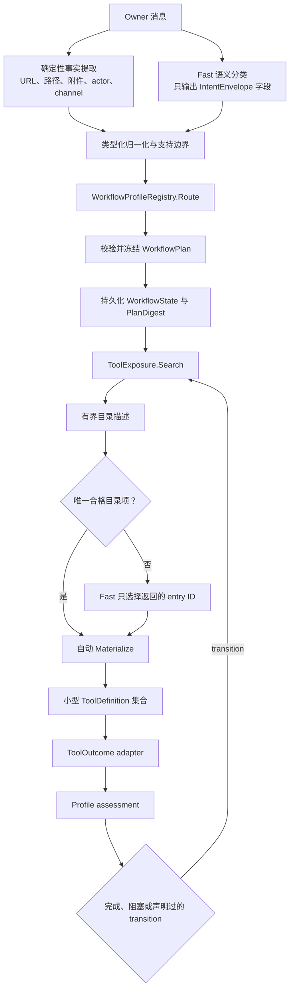

# 意图路由与工作流工具暴露重构方案

> 语言：[English](../../docs/intent-routing-workflow-refactor-plan.md) | 简体中文

截至 2026-07-16：共享 Runtime 基础已经实现。公共 Web 调研、明确 URL 读取、Workspace 文件搜索和明确路径文件读取已经成为权威 Workflow Profile。其他领域在完成各自纵向迁移前，暂时继续使用旧 TaskHint 路径。

## 结论

SparkClaw 保留 Fast 意图分类，但把它严格限制为输出稳定语义。Fast 不能输出工具、Skill、Workflow ID、模型 lane、风险等级、审批决策或执行步骤。

执行链路有四个明确 owner：

1. `IntentRouter` 合并确定性事实与 Fast 语义输出，产生归一化 `IntentEnvelope`。
2. `WorkflowProfileRegistry` 对意图做唯一匹配，并解析出冻结、版本化的 `WorkflowPlan`。
3. `ToolExposure.Search/Materialize` 是把活动 capability scope 转为模型可见 ToolDefinition 的唯一权威位置。
4. 类型化 `ToolOutcome` 和 Profile assessment 只能推进或扩展冻结 Plan 中已经声明的 transition。

Skill 只提供流程指导。Policy 与精确参数授权在执行时继续保持权威。ReAct 从当前物化的定义中选择动作，但不决定 capability 是否可达。

这是渐进替换，不是永久双路由。已迁移意图遇到 capability 缺失、目录过期或执行阻塞时必须记录 blocker，不能回退 TaskHint。

## 旧设计反复返工的原因

旧链路把语义与实现决策都塞进 `TaskHint`：

- Fast 同时输出 Skill、候选工具、风险和模型 lane；
- heuristic fallback 重复一套决定；
- Skill 关键词与 allow/deny 清单再次修改；
- evidence fallback 和 browser expansion 后续又做工具并集；
- outcome helper 在 ReAct 后追加特殊步骤。

系统既没有稳定中间合同，也没有工具可见性的唯一 owner。修复一层会改变另一层的输入，因此 Web、browser、document、email 和 workspace 路由会不断互相引入回归。

重构后分别回答三个问题：

- Intent：owner 想完成什么？
- Workflow：哪些 capability 闭包可以满足它？
- Exposure：当前状态下模型可以看到哪个注册实现？

## Runtime 结构



Core Runtime 不能通过 Workflow ID 或具体工具名 switch 来选择 scope、资源、assessment 或下一步。领域行为属于注册 Profile 和 ToolHub outcome adapter。

## 稳定意图合同

模型可见 envelope 只包含语义：

```go
type IntentEnvelope struct {
    Version      int               `json:"version"`
    SourceTurnID string            `json:"source_turn_id"`
    Objectives   []Objective       `json:"objectives"`
    Constraints  IntentConstraints `json:"constraints"`
    Resolution   IntentResolution  `json:"resolution"`
}

type Objective struct {
    ID        string          `json:"id"`
    Domain    IntentDomain    `json:"domain"`
    Operation IntentOperation `json:"operation"`
    Target    TargetRef       `json:"target"`
    Output    OutputKind      `json:"output"`
    Explicit  bool            `json:"explicit"`
}
```

Fast 返回稳定 envelope，并可归一化证据深度和澄清状态。当前已迁移窄切片中，确定性 support gate 也会冻结 domain 与 operation；后续更宽 classifier 只能在与确定性 fact 兼容的已注册 Profile 之间选择。Normalizer 强制以下规则：

- 明确 URL、Workspace 路径、附件 ref、actor 和 source turn 来自确定性事实，模型不能发明或修改；
- authorization provenance 与 `Explicit` 不能由检索结果或引用文本产生；
- 不支持的 enum、target 组合和无法解析的 Profile 必须 fail closed；
- Fast 输出归一化后必须再次经过 Registry 路由；
- audit 只保存脱敏语义投影，不保存原始 URL 或路径。

确定性 fallback 只用于模型失败和有界 support gate，不是第二套工具路由。它必须产生同一个稳定合同，并经过相同 Registry 和 Plan 校验。

## Workflow Profile 合同

Profile 使用稳定 ID 与 revision 以代码注册：

```go
type WorkflowProfile interface {
    ID() WorkflowID
    Revision() int
    Recognize(sourceTurnID, content string) (IntentEnvelope, bool)
    Match(IntentEnvelope) bool
    Resolve(IntentEnvelope) (WorkflowPlan, error)
    Assess(*WorkflowState, ToolOutcome) NodeAssessment
    Hint(*WorkflowState) workflowExecutionHint
    TransitionInstruction(ToolOutcome, NodeAssessment) string
}
```

`Recognize` 是确定性的支持边界与 fallback；`Match` 是 Fast 归一化后真正执行的类型化路由条件。新增 Profile 应使用同一 decision corpus 保证两者一致，二者都不能返回工具。`workflowExecutionHint` 只包含模型/证据模式与 workflow/node/scope 绑定字段，类型中没有 candidate tool 或 Skill 字段。

`WorkflowProfileRegistry.Resolve` 在持久化前统一校验：

- Plan 的 Profile ID 和 revision 与注册实现一致；
- Intent 已解析且 objective ID 唯一；
- node、transition、dependency ID 合法且无环；
- initial node 没有依赖，后续 node 显式声明依赖；
- 每个 node 都有 goal、capability scope、risk set 和 attempt bound；
- argument binding 只引用冻结 scope 中可达的 capability；
- transition predicate、add/replace scope 完整且有界。

非 initial node 从 `pending` 开始。节点完成后只激活依赖全部成功的节点。只有所有节点成功时 Workflow 才成功，不能因为活动列表暂时为空而提前完成。

## 冻结 Scope 与资源边界

Plan 保存 capability requirement，不保存固定工具序列。Scope transition 只有在类型化 predicate 命中且未超过 activation bound 时，才能 add 或 replace requirement。Plan 在 exposure 前先 hash 并持久化。

资源参数也属于 Plan：

```go
type ArgumentBinding struct {
    Capability   string
    Argument     string
    ResourceKind string
    Source       ArgumentBindingSource // intent_target 或 outcome_ref
    TargetKinds  []TargetKind
}
```

执行前，Runtime 要求参数精确等于确定性 intent target，或等于先前 outcome 持久化的受治理类型化 ref。这样即使 page/file reader 在当前 scope 合格，也不能读取无关 URL 或路径。

## 唯一工具暴露权威

完整合同见[工具暴露契约](intent-routing-tool-exposure-contract.md)。

`Search` 从持久化 run 与活动 node 计算 eligible set：

- 冻结 capability requirement 与 denied effect；
- 已启用 ToolHub registration 及其 capability descriptor；
- node allowed risks；
- 带 actor、workflow、node 上下文的 `Policy.MayExpose`。

随后只对 eligible set 使用可信注册描述进行排序。第一次只返回 entry ID、capability、summary、适用/不适用边界、effect 与 risk，不返回完整 schema 或隐藏工具名。

只有一个 entry 时自动物化。多个 entry 时 Fast 只能看到当前有界目录，并且只能返回其中一个 ID。未知、view 外、过期、actor 不匹配、workflow 不匹配或 scope 不匹配的选择必须失败。`Materialize` 是模型看到具体 ToolDefinition 的唯一入口。

可见不等于授权。ToolHub 与 Policy 在执行前仍会根据具体 definition、精确参数、actor 和资源重新决定 allow、approval 或 deny。

## Outcome 驱动的适应

ToolHub registration 负责选择 outcome adapter。Adapter 只输出类型化 signal 与受治理 ref，不判断用户目标是否完成。活动 Profile 按冻结 node goal 进行 assessment。

合法结果只有：

- `complete`：节点成功并激活依赖已满足的节点；
- `blocked`：持久化原因并停止；
- `needs_more_evidence`：激活一个匹配且已声明的 scope transition。

Outcome ID 与 transition activation count 会持久化；重复 outcome 是 no-op。未知 signal、耗尽 transition、缺少 ref 或 digest 不一致都必须 block，不能扩大 exposure。

## 当前权威 Profile

| Profile | Initial capability | 有界行为 |
|---|---|---|
| `web.public_research` r1 | `web.discovery` | 要求 source evidence 时最多一次替换为 `web.page.read`；URL 必须来自 discovery outcome。 |
| `web.explicit_url_read` r1 | `web.page.read` | URL 必须等于确定性 intent target。 |
| `workspace.file_search` r1 | `workspace.file.search` | 仅搜索、read risk，不接管 mutation 或 image 专用请求。 |
| `workspace.file_read` r1 | `workspace.file.read` | Path 必须等于确定性 Workspace target。 |

这些 Profile 不读取 TaskHint candidate tool 或 Skill allow/deny 清单，流程型 Skill 由冻结 Plan 精确选择。Workspace 文档修改、图片检查、代码、浏览器交互、提醒、记忆和命令请求，在完成各自纵向切片前继续使用旧路径。

邮件、日历和 Workspace Knowledge/RAG 不再是本方案的迁移目标；见[暂缓能力](deferred-email-calendar-knowledge.md)。

## Web Search 链路示例

对于“查找 SparkClaw 并读取官方原文”：

1. Fact extraction 没有发现明确 URL。Fast 输出 `web/search`、public data 和 source evidence depth；Normalizer 不允许添加 target 或工具。
2. Registry 匹配 `web.public_research`，冻结 initial scope 为 `web.discovery` 的节点，并声明一次可替换为 `web.page.read` 的 transition。
3. Exposure 找到注册的 `web.search` 实现，只物化它的 schema。
4. Search 返回 `results_available`、`source_page_available` 和受治理 URL ref。因为请求了 source depth，Profile assessment 返回 `needs_more_evidence`。
5. Runtime 应用冻结 transition，增加 scope revision，清除旧目录选择并重新 Search。
6. Exposure 物化 `browser.read`。Runtime 只接受已持久化 search outcome ref 中的 URL。
7. `content_available` 完成节点。URL 缺失、exposure 失败、auth、状态过期或无关 URL 都会 block，不会回退到更宽路由。

明确 URL 请求直接从第 6 步开始，并绑定确定性 URL，不暴露 discovery 或 live browser interaction。

## 迁移步骤

每次端到端迁移一个语义领域切片：

1. 只有现有词汇无法表达意图时才增加稳定 enum。
2. 增加确定性 fact 与脱敏 classification corpus。
3. 实现唯一 `Match`、fallback support gate、Plan resolver、assessor 与 completion behavior。
4. 为每个实现 ToolDefinition 注册语义 capability、可信目录描述、effect 和 outcome adapter。
5. 为 URL、路径、记录、收件人等受治理资源增加冻结 argument binding。
6. 删除该意图在 TaskHint 中的 candidate 逻辑和 Skill 工具清单。
7. 测试唯一识别、非法 Plan 拒绝、exposure 边界、参数越界、outcome 幂等、transition、持久化和端到端行为。
8. 同步更新本方案、Profile 目录、暴露合同、architecture 与中英文镜像。

建议顺序：

1. Browser open/read/interaction 与人工登录接管。
2. 带输出验证的 document mutation。
3. Memory candidate/sensitive write。
4. Reminder CRUD 与 connector delivery。
5. Code patch、test、command execution 和剩余组合。
6. 最后一个领域迁移后，删除 TaskHint 工具权威、Skill allow/deny visibility 和 legacy expansion。

## 不可破坏的 Invariant

- Fast 输出不包含实现选择。
- Profile 匹配必须唯一，否则 fail closed。
- 冻结 Plan 必须经过校验、版本化、hash 和持久化。
- Core exposure/runtime 不得出现按 Workflow ID 路由的 switch。
- Search 只能排序 eligible registration，不能扩大 scope。
- Materialize 只接受最新有界 view。
- 每个 call 绑定 workflow、node、scope revision、capability，并在需要时绑定精确资源。
- Skill 不能授予、拒绝、并入或删减工具。
- Outcome 只能激活已声明 transition，不能注入工具。
- Read-only intent 不能到达 mutation 或 external effect。
- Approval 与精确参数 Policy 始终权威。
- 已迁移意图失败时不能重新进入 legacy route。
- Resume 使用持久化 Plan 与 Profile revision，不重新分类。

## Validation 与退出门槛

每个迁移切片必须具备：

- 正负语义 decision corpus；
- ambiguity 与 Profile identity 测试；
- 单 entry 与多 entry 目录选择测试；
- stale/view 外 materialization 测试；
- 精确资源 binding 测试；
- ToolOutcome adapter、assessment、transition、retry 和幂等测试；
- 状态结构变化时的 file 与 PostgreSQL persistence 覆盖；
- 一个证明没有经过 TaskHint 的端到端 API 或 Runtime 测试；
- 宣称 production-ready 前的 external-model smoke。

仓库交付验证：

```bash
cd services/gateway
go build ./...
go vet ./...
go test ./...
cd ../..
npm --workspace @sparkclaw/webchat run build
bash scripts/doctor.sh
bash scripts/run-eval.sh
git diff --check
```

## 恢复与回滚

活动 Workflow 使用已持久化 intent、Profile revision、Plan、node state 和 outcome history 恢复。如果当前实现不再支持对应 schema 或 revision，必须明确失败，不能静默重新 Resolve 或回退 TaskHint。

运维回滚应部署仍支持活动 Plan 的源码版本，或明确终止不兼容 run。永久 feature flag、shadow router 或双 exposure 权威都不是回滚方案。
