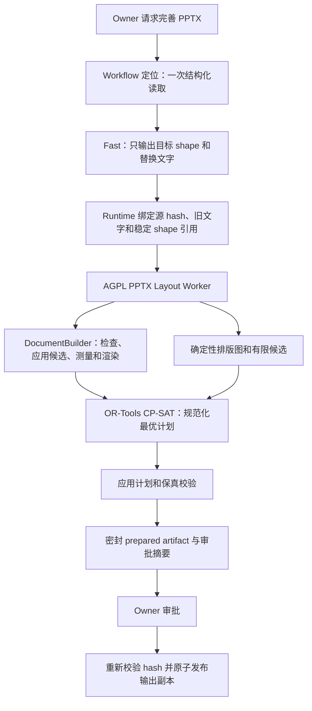

# 确定性 PPTX 排版 Runtime 设计

> 语言： [English](../../docs/pptx-deterministic-layout-runtime-design.md) | 简体中文

| 字段 | 值 |
|---|---|
| 状态 | 提案；Phase 0 资格测试通过前禁止实施 |
| 决策日期 | 2026-08-11 |
| 范围 | `pptx.update_slide` 和 `pptx.update_deck` 的协调排版 |
| 候选引擎 | ONLYOFFICE DocumentBuilder 9.4.0 免费 AGPL v3 版本 |
| 约束求解器 | Google OR-Tools CP-SAT 9.15.6755，Apache 2.0 |
| 决策责任方 | SparkClaw document runtime |

## 核心决策

SparkClaw 将评估由免费 AGPL 版 ONLYOFFICE DocumentBuilder 和 Google OR-Tools
组成的确定性 PPTX 排版 runtime。DocumentBuilder 是用于读取、测量、修改和渲染布局的
候选演示文稿引擎；OR-Tools 从每个受影响 shape 的有限且已经测量的候选中选择一个方案。
模型只负责选择与 evidence 绑定的文本 shape，并输出替换文字。

本方案采用严格的 Go/No-Go 决策。Phase 0 必须在目标 Linux ARM64 环境和 SparkClaw
兼容性样本集上证明 DocumentBuilder 的每一项必需能力。任何必测项失败，整个方案即被否决：
SparkClaw 保持现有 PPTX 实现，不增加该 worker 或 OR-Tools 生产路径，也不会在本设计下改接
LibreOffice、Aspose、其他渲染器或字符估算补丁。资格测试失败只产出评估报告。

迁移不得增加排版提示词、排版修复提示或第二次 Fast 调用。排版失败是确定性的 runtime
失败，绝不让模型缩短、改写或重试内容。

## 问题

当前 `services/gateway/internal/toolhub/scripts/pptx_slide.py` 中的协调更新器根据字符类别
估算文字宽度，并通过固定行高系数估算高度；随后识别少量几何模式，调整文本框、背景、行和
卡片。这可以充当受限安全层，但它不是演示文稿渲染器，无法可靠判断混合字体、中日韩文字、
项目符号、显式换行、继承的主题属性、AutoFit 或 PowerPoint 特有排版行为是否会溢出。

当前预检还会把排版 fit 冲突转入语义修复，让 Fast 缩短替换文字。这混合了两个不同问题：

- 内容质量是语义问题，可以使用模型；
- 排版可行性是几何问题，必须由 runtime 负责。

不断缩短文字直到估算文本框能够容纳，并不能协调整页布局。它会损失有用内容，依赖额外模型
调用、重复传输上下文，而且仍无法证明最终演示文稿整体平衡。

## 目标

- 使用通过资格测试的演示文稿引擎检测文字溢出，不使用字符容量估算。
- 把字号、文本框尺寸与位置、配套背景、同级间距和周边受保护元素作为一个排版问题协调处理。
- 完整保留 Fast 返回的替换文字。排版 runtime 可以改变格式和几何属性，绝不改变内容。
- 在源文件字节、请求字节、引擎版本、已安装字体和策略版本相同时生成相同的排版计划。
- 保持源 SHA 绑定、受限 Workflow scope、Policy、审批、输出副本、审计、超时和保真校验。
- 只执行一次排版预检，并在审批后复用密封 artifact，避免第二次模型调用和第二次排版求解。
- 本地模型升级后继续产生收益：更强模型改进文字，确定性引擎继续保证排版约束。

## 非目标

- 让 DocumentBuilder 或 OR-Tools 生成或优化演示文稿内容。
- 让模型选择字号、坐标、文本框尺寸、break mode、layout policy 或重试动作。
- 重设计任意艺术型页面、SmartArt、图表、动画、母版或 group 内部 shape。
- 在本次迁移中替换 `pptx.replace_text`、`pptx.add_slide`、
  `pptx.duplicate_slide` 或 `pptx.delete_slide`。
- 宣称 Microsoft PowerPoint、ONLYOFFICE 与 LibreOffice 之间像素一致；查看器兼容性需要单独测试。
- DocumentBuilder 资格测试失败后增加另一个文档引擎。

## 保持不变的现有契约

| 契约 | 必需行为 |
|---|---|
| Tool 表面 | 保留 `pptx.update_slide` 和 `pptx.update_deck`；不新增由模型选择的排版 tool。 |
| Evidence | 每项更新都绑定当前 `files.read` 结果、源 SHA-256、slide 和 shape。 |
| Scope | 保持单页和受限整份文稿边界，目前为 12 页、64 个更新 shape 和 32 KiB 替换文字。 |
| Policy | 继续把编辑归类为 reversible 且必须审批。 |
| 文件 | 不修改源文件；只有审批后才创建新的受治理输出副本。 |
| 原子性 | 整份文稿更新只能生成一个完全验证的输出，否则不生成任何输出。 |
| 保真 | relationship、媒体、图表、母版、备注、动画或非目标文字出现未声明变化时拒绝输出。 |
| 审计 | 记录引擎版本、策略版本、计划摘要、检查结果、耗时和稳定错误码，不记录完整文档文字。 |
| 超时 | 一个端到端 deadline 负责 worker 启动、测量、求解、渲染、验证和清理。 |

## AGPL 版本和发布决策

### 选定 artifact

初始资格测试候选为上游
[DocumentBuilder v9.4.0 Linux ARM64 release](https://github.com/ONLYOFFICE/DocumentBuilder/releases/tag/v9.4.0)：

```text
onlyoffice-documentbuilder-linux-aarch64.tar.xz
sha256:8756b0b57a4ab4b27608a6b1fbeb13f67670bde0245da166907277821afbeb8e
```

版本和摘要是资格测试的不可变输入。生产环境必须使用明确的依赖锁，绝不下载 `latest`。
升级 DocumentBuilder、OR-Tools、字体包或排版策略时，必须重新通过同一套确定性、保真和渲染
样本测试。

DocumentBuilder 9.4.0 使用 AGPL v3，并带有上游依据第 7 条增加的补充条款。这些条款包括
保留声明与归属、对修改版本提供带日期的显著修改声明、在交互界面显示适当法律声明、不授予
商标许可，以及对指定非代码内容使用 CC BY-SA 4.0。固定 tag 中的准确许可证文件是权威。
本文是工程合规方案，不是法律意见。

OR-Tools 保持 Apache 2.0 许可。其许可证不会消除或弱化 DocumentBuilder 的义务。

### 组件边界

拟议的 `SparkClaw PPTX Layout Worker` 是通过版本化 JSON stdin/stdout 协议单独启动的进程，
内部使用 DocumentBuilder Python 或 native SDK 和 OR-Tools。worker 以及所有与
DocumentBuilder 链接的代码使用 AGPL-3.0-only 发布，并保留上游补充条款。Gateway 保持
Apache-2.0，只通过文档化进程协议与 worker 通信。

该进程边界可以缩小耦合，但不会被视为自动获得许可证豁免。正式发布前必须完成许可证审核。
如果该发布被认定为一个合并作品，发布流程必须对该合并作品履行适用的 AGPL 义务。SparkClaw
已经公开源代码会降低披露成本，但不会消除声明、部署与源码一致性、构建材料、归属或网络源码
入口等义务。

生成的 PPTX 文件仍是用户内容，除非文件本身包含受 ONLYOFFICE 许可证覆盖的资产。发布包
不得复制上游图标、插图、文档或品牌，除非同时满足其独立许可证和商标政策。

### 强制合规控制

- 随发布包提供准确的 AGPL v3、上游补充条款、OR-Tools Apache 2.0 许可证和
  `THIRD_PARTY_NOTICES` 清单。
- 公开部署 worker 的 Corresponding Source、固定 tag 的上游源码、本地补丁、构建脚本、
  依赖锁、字体清单，以及复现部署 binary 所需的安装信息。
- 向所有能够通过 WebChat 或其他网络通道调用 PPTX 排版的用户提供清晰可见的
  `源码与许可证` 入口。
- 标明 ONLYOFFICE 是原始开发者，说明修改版本与修改日期，并链接适用许可证和源码包。
- 保持公开源码 commit、container digest、worker 版本、依赖摘要和实际部署构建一致。
- 不把 ONLYOFFICE 名称或 logo 用作 SparkClaw 品牌。
- 固定的上游许可证发生变化时重新进行许可证审核。

无法提供准确源码入口或所需声明的发布版本必须禁用确定性 PPTX 引擎。本设计不隐含商业许可
降级方案。

## 目标架构



### 职责

| 组件 | 负责 | 不得负责 |
|---|---|---|
| Fast | 语义 shape 选择和准确替换文字 | 几何、字号、换行、fit 估算、排版重试 |
| Workflow Runtime | Scope、evidence 绑定、策略版本、审批、artifact 生命周期、错误映射 | 演示文稿测量 |
| Layout Worker | Shape 身份、排版图、候选生成、测量编排、求解、渲染、诊断 | 内容改写或外部通信 |
| DocumentBuilder | 通过资格测试的 PPTX DOM 访问、排版测量、修改和渲染 | 选择内容或优化策略 |
| OR-Tools | 从可行候选组合中选出最优结果 | 发明候选或读取 PPTX 文件 |
| 保真验证器 | 执行 package 和语义 allowlist | 修复失败输出 |

第一阶段生产范围只包含协调排版。准确文字替换和结构化 slide 操作继续使用现有代码，直到另有
设计并通过资格测试。

## Phase 0：强制后端资格测试

DocumentBuilder 的公开 Presentation API 暴露 shape 和几何修改能力，但尚未证明它提供本方案
需要的、实际排版后的 paragraph 或 text-fragment bounds API。对高保真渲染的宣传不能代替测量
契约。资格测试必须以可执行测试为准，不能根据 API 名称推断。

下表每一项都是必测项。一项失败就意味着整个方案 No-Go。

| 能力 | 测试 | 通过条件 |
|---|---|---|
| 稳定身份 | 打开、检查、修改、保存、重新打开，并通过 slide part 和 non-visual shape ID 映射 shape | 每个受支持目标和 companion 都能唯一映射；不能只用列表 index 作为身份 |
| 真实文字边界 | 测量拉丁文字、中日韩文字、混合文字、项目符号、run、显式换行、继承字体、AutoFit 和缺失字体替换 | 实际排版后返回稳定 used bounds 或有效 overflow 结果；不使用字符数量代理，且样本中无 overflow 漏报 |
| 几何修改 | 修改字号、文本框尺寸、坐标、换行和 companion shape 尺寸 | 重新打开后的值和渲染结果在记录的取整容差内匹配请求的整数 EMU 计划 |
| 富文本保真 | 跨多个 paragraph 和 run 替换文字 | 非目标 run/paragraph 格式、field、hyperlink、bullet 和语言元数据不变 |
| Package 保真 | 处理包含图表、图片、group、备注、母版、主题、超链接、动画和 relationship 的文件 | 只有声明的目标文字与几何 allowlist 发生变化，其他 canonical package fingerprint 相等 |
| 渲染 | 修改前后渲染受影响 slide | 图像非空、尺寸正确、使用固定字体，并在固定环境得到确定性 pixel digest |
| 查看器兼容性 | 用当前 Microsoft PowerPoint 和项目参考查看器打开输出 | 受支持样本无修复提示、对象缺失、图表变化、动画丢失或新 overflow |
| Linux ARM64 | 在 DGX Spark 部署镜像上安装并运行固定 aarch64 artifact | 不使用模拟；生产字体清单下全部资格测试通过 |
| 取消 | 终止一个故意挂起或超大的 job | deadline 在两秒内终止整个进程组，删除临时文件，不留下输出和孤儿进程 |
| 可重复性 | 每个受支持 fixture 运行 100 次 | normalized measurement、计划、package fingerprint 和渲染 pixel digest 完全一致 |

样本集必须包含真实 owner 演示文稿，但需先把不可逆的私密内容替换为结构等价文字，同时加入
合成边界样本。它至少覆盖受支持的 16:9 与 4:3 页面、英文、简体中文、混合文字、自定义字体、
表格、group shape、图表、媒体、演讲者备注、母版、切换和动画。

资格测试产出带签名的报告，其中包括 artifact digest、字体清单、host image、失败项、耗时和
canonical diff。No-Go 时不产生生产依赖或 feature flag。

## 版本化 Worker 协议

Gateway 通过 stdin 向一个 worker job 发送一个 JSON 请求，并从 stdout 接收一个 JSON 结果。
可读日志写入 stderr。v1 拒绝未知字段，输入有大小限制，stdout 有固定字节上限。文档文字绝不
写入日志。

### 请求

```json
{
  "schema_version": "sparkclaw.pptx_layout.request.v1",
  "request_id": "opaque-id",
  "operation": "prepare_update",
  "source": {
    "input_path": "/job/input.pptx",
    "sha256": "hex"
  },
  "updates": [
    {
      "slide_ref": "ppt/slides/slide3.xml",
      "shape_ref": "cNvPr:17",
      "expected_text_sha256": "hex",
      "replacement_text": "Fast 的准确输出"
    }
  ],
  "policy": {
    "id": "sparkclaw.pptx_layout_policy.v1",
    "page_margin_emu": 114300,
    "max_candidates_per_shape": 12
  },
  "limits": {
    "max_slides": 12,
    "max_shapes": 64,
    "deadline_ms": 30000
  },
  "diagnostics": {
    "render_raw_candidate": true,
    "render_final": true
  }
}
```

`slide_ref` 和 `shape_ref` 由 runtime 绑定。Fast 继续使用紧凑的 1-based `shape_index`；
Gateway 根据当前 evidence 解析该 index，绝不信任模型生成的 package ID。

请求字段不允许缩短内容、模型重试、任意脚本、外部 URL 或 job 目录外的路径。

### 结果

```json
{
  "schema_version": "sparkclaw.pptx_layout.result.v1",
  "request_id": "opaque-id",
  "status": "prepared",
  "source_sha256": "hex",
  "output_sha256": "hex",
  "plan_digest": "hex",
  "policy_id": "sparkclaw.pptx_layout_policy.v1",
  "engine": {
    "document_builder": "9.4.0",
    "ortools": "9.15.6755",
    "font_manifest_sha256": "hex"
  },
  "slides": [
    {
      "slide_ref": "ppt/slides/slide3.xml",
      "updated_shapes": 2,
      "layout_changes": [],
      "checks": {
        "overflow": false,
        "new_overlap": false,
        "inside_page": true,
        "preservation": true
      }
    }
  ],
  "artifacts": {
    "output_path": "/job/prepared.pptx",
    "raw_render_path": "/job/raw-slide-3.png",
    "final_render_path": "/job/final-slide-3.png"
  },
  "timings_ms": {}
}
```

结果中的每个路径都必须验证位于 job 目录下。Gateway 自行计算文件 hash；没有独立校验时不信任
worker 报告的摘要。

## 排版图

worker 根据通过资格测试的 package 身份和已测量几何信息构建确定性图。

### 节点

- 请求指定的可编辑文本 shape；
- 参与同一行、卡片或垂直 flow 的相关可编辑文本 shape；
- 尺寸或位置必须跟随文字的配套背景与分隔线；
- 图表、图片、logo、页码、group、未知对象和所有不支持功能等受保护 shape；
- slide safe area 和由母版导出的保留区域。

### 边

- containment：文字必须保持在配套背景内；
- alignment：同级元素共享左、右、上、下或中心对齐线；
- order：视觉阅读顺序不能反转；
- spacing：相邻同级元素保持受限间距；
- flow：前一个 block 变大时后续 block 跟随移动；
- exclusion：可变 bounds 不得与受保护 bounds 相交；
- equality：源文稿已建立等宽或等高关系时，重复卡片保持该关系。

关系只能根据稳定 ID、OOXML relationship 和版本化整数几何规则推断。不确定关系一律受保护，
不能猜测。模型不标注排版 group。

## 候选生成与测量

候选集合有限，并按稳定 shape ref 和 candidate ID 排序。初始策略只生成以下组合：

- 几何与当前字号保持不变；
- 以 0.5 pt 为步长减小字号，下限为角色绝对下限和原字号配置比例中的较大值；
- 在 safe region 内沿允许轴扩展宽度或高度；
- 在保持顺序和最小间距的情况下纵向移动后续同级元素；
- 协调缩放或移动高置信度识别出的配套背景；
- 对上述变化进行受限组合。

资格测试使用的默认角色下限提议为标题 18 pt、正文 12 pt、说明文字 9 pt，同时不得小于源字号
的 75%。这些值属于策略数据，生产前必须用 owner 的真实样本验证。不支持的竖排文字、沿路径
文字、SmartArt 内部、group child 编辑或有歧义的 companion 不生成可变候选。

对于每个候选，DocumentBuilder 必须执行真实排版并返回有效文字 bounds、overflow 状态、行结果
和有效字体状态。存在 overflow、clipping、无效字体替换或越过页面边界的候选，在进入 OR-Tools
前丢弃。测量结果只在当前 job 内缓存，完整 key 包括源 hash、shape ref、准确文字字节、尺寸、
字体设置、字体清单和引擎版本。

原始诊断渲染只应用替换文字，不进行协调排版。只有 Runtime 明确请求时才生成，必须标记为
invalid，绝不能晋升为编辑后的 PPTX；它用于让测试或 owner 并排查看原始溢出状态和求解结果。

## OR-Tools 公式

该模型是一个有限的 CP-SAT 选择问题。所有坐标和尺寸都使用整数 English Metric Units（EMU），
字号使用整数 half-point。求解器中不出现浮点几何。

对每个可变 shape 或协调 group `i` 及候选 `c`，Boolean 变量 `choose[i,c]` 表示选择该候选。

### 硬约束

- 每个可变 shape 或 atomic group 必须且只能选择一个候选。
- 每个已选候选都必须通过真实文字测量。
- Bounds 必须位于 slide safe area 内。
- 可变 shape 不得与受保护 shape 重叠。
- 两个互不兼容的候选不能同时选择。
- containment、视觉顺序、最小间距、对齐容差和 companion 关系必须成立。
- 非目标受保护 shape 保持原始几何属性。
- 字号不得低于策略下限。

非重叠和关系约束使用预计算的候选兼容表。这使求解器只处理已选 Boolean 变量，不让它近似
演示文稿渲染。

### 字典序目标

worker 逐级求解并固定每一级最优值，再进入下一级：

1. 最小化移动或缩放的 shape 数量；
2. 最小化字号缩减总量；
3. 最小化几何变化总量；
4. 最小化与现有对齐和间距的偏离；
5. 最小化发生变化的 companion shape 数量。

固定以上最优值后，worker 按稳定 shape 顺序规范化解：依次选择仍允许剩余问题可行的最低排名
候选。该显式最终 tie-break 不依赖求解器发现顺序，最终只得到一个 canonical plan。

CP-SAT 使用固定 random seed、一个 worker、关闭 randomized search、固定 OR-Tools 版本、排序后的
变量与约束，并且不接受在 wall-clock 截止前找到的普通可行解。只有 `OPTIMAL` 可以通过；
`FEASIBLE`、`UNKNOWN`、超时或版本不匹配都 fail closed。

## Worker 生命周期与隔离

- 沿用现有 cancellable adapter ownership 模式，每个 job 启动一个进程组；不执行任意生成的
  JavaScript。
- 只挂载每个 job 的输入/输出目录、只读引擎和固定字体目录；禁用网络。
- 限制文件大小、内存、CPU、进程数、stdout 和 stderr。
- 一个文档只由一个 DocumentBuilder thread 处理。Gateway 单独限制并发，load test 证明安全前
  默认为一个 job。
- 在受治理 workspace 下使用随机私有临时目录。
- 取消或超时时终止进程组、等待退出、删除目录，并验证无 child 残留。
- 把 stdout 当作不可信协议消息；拒绝 malformed JSON、重复 key、未知 schema 版本、路径穿越和
  超大结果。
- 审计只记录数量、hash、版本、稳定 ID、检查结果和耗时。worker 日志不记录替换文字或文档文字。

## 预检、审批与时间成本

昂贵的排版工作只在审批前执行一次，生成密封且用户不可见的 prepared artifact。artifact 记录
绑定：

- 源 SHA-256 和当前受治理 document ID；
- normalized semantic update digest；
- 排版 plan digest 和输出 SHA-256；
- DocumentBuilder、OR-Tools、策略、worker 和字体清单版本；
- 保真结果以及 before/raw/after render digest；
- 请求的输出路径、owner、run、approval 和过期时间。

审批不会再次调用 Fast 或 layout worker。它重新计算源 hash，检查所有绑定，验证 prepared
artifact 字节，然后原子晋升到已批准的输出路径。源文件变化、artifact 过期、引擎变化或摘要
不匹配时，以 stale 失败并删除 prepared artifact；拒绝和过期也会删除它。

预期成本如下，Phase 0 后必须用实测数据替换：

| 阶段 | 目标预算 | 模型/上下文成本 |
|---|---:|---|
| 现有 Fast 语义更新 | 现有 profile 预算 | 一次现有受限调用 |
| 排版图和候选生成 | 每页 50-150 ms | 无 |
| DocumentBuilder 测量 | warm 单页 2-8 s；受限整份文稿 8-25 s | 无 |
| OR-Tools 求解与规范化 | 64 个 shape 时 P95 不超过 500 ms | 无 |
| 应用、渲染和保真 | 单页 1-3 s；受限整份文稿 2-5 s | 无 |
| 审批后晋升 | 所有绑定有效时不超过 1 s | 无 |

参考 DGX Spark 部署上的端到端验收目标是：受支持的 warm 单页操作不超过 10 秒，受支持的
12 页操作不超过 30 秒。冷启动单独报告。这些是 release gate，不是对未测性能的承诺。

## 模型契约

Fast 接收冻结目标的受限 business projection：

- `update_slide` 接收目标页上的全部相关可编辑文字、稳定的 model-facing shape index，以及
  保持语义一致所需的周边文字；
- `update_deck` 接收最多 12 个目标页对应的 projection；
- 接收 owner 请求和判断哪些文字应该变化所需的现有 Workflow evidence。

Fast 不接收无限制的原始 PPTX package、候选列表、字符容量、fit 估算、坐标、字号替代方案、
求解结果或渲染诊断。它只返回：

```json
{
  "updates": [
    {"shape_index": 17, "text": "替换文字"}
  ]
}
```

Runtime 补充 `path`、`output_path`、`source_document_sha256`、`old_text`、稳定 package ref 和
layout policy。模型可见 schema 中移除 `layout_policy`、`break_mode`、几何和 fit 控制。

迁移会从 semantic-repair 路径移除 `pptx_layout_fit_conflict`。现有针对 malformed、empty、stale
或 unchanged 语义输出的一般验证可以保留，但它不能看到排版数据，也不能因为排版失败而触发。
排版失败直接以稳定 runtime 错误结束，不生成输出。

## 保真与最终验证

审批前对 prepared output 执行验证，晋升前再次校验摘要。

1. 重新计算源 SHA-256，拒绝 stale input。
2. 使用独立 SparkClaw reader 重新打开输出。
3. 验证准确目标替换文字和已声明几何变化。
4. 根据 operation-specific allowlist 比较 canonical OOXML package fingerprint。ZIP 顺序、时间戳和
   仅序列化差异会规范化处理；语义 XML 与 relationship 差异不会被忽略。
5. 母版、layout、主题、备注、媒体字节、嵌入对象、图表、animation/transition tree、hyperlink
   和 relationship 必须保持不变，除非未来某项 operation 明确拥有它们。
6. 重新测量最终文字并再次执行全部排版约束。
7. 渲染受影响页面，要求图像非空、尺寸正确、结果确定且无新的边缘 clipping。
8. 确认源文件字节完全不变，输出在审批后只出现在请求的受治理路径。

任何未声明差异都会拒绝整个 artifact。验证器只报告，绝不修复。

## 稳定错误分类

| 错误码 | 含义 | 重试行为 |
|---|---|---|
| `pptx_layout_backend_unavailable` | 通过资格测试的 worker 或固定引擎不可用 | 不做模型重试；需要 operator 处理 |
| `pptx_layout_identity_mismatch` | 当前 slide 或 shape 已不匹配 evidence | 通过新的 owner run 重新读取 |
| `pptx_layout_measurement_unavailable` | 引擎无法返回合格 bounds 或 overflow 状态 | Phase 0 判定 No-Go；生产 fail closed |
| `pptx_layout_unsupported_feature` | 请求目标涉及受保护或不支持功能 | 不做模型重试 |
| `pptx_layout_no_feasible_solution` | 没有候选组合满足全部约束 | 不做模型重试；无输出 |
| `pptx_layout_solver_timeout` | 未在时间内证明 canonical `OPTIMAL` 解 | 不做模型重试；无输出 |
| `pptx_layout_render_mismatch` | 最终渲染为空、不稳定、clipped 或不一致 | 不做模型重试；无输出 |
| `pptx_layout_preservation_violation` | 检测到未声明 package 或语义变化 | 不做模型重试；无输出 |
| `pptx_layout_source_stale` | 准备或审批前源文件已变化 | 需要重新读取和审批 |
| `pptx_layout_worker_timeout` | worker 超过端到端 deadline | 终止进程组；无输出 |
| `pptx_layout_protocol_error` | worker 返回无效或不兼容数据 | 不做模型重试；需要 operator 处理 |

展示给 owner 的错误需要指出受影响 slide 并声明源文件未改变，不建议模型静默缩短内容。

## 迁移阶段

| 阶段 | 工作 | 退出条件 |
|---|---|---|
| 0. 资格测试 | 在 Linux ARM64 上对固定 DocumentBuilder 运行完整强制样本集 | 所有 gate 通过。任何失败都会以 No-Go 结束本方案，不进行生产集成。 |
| 1. 协议骨架 | 增加独立许可证的 worker package、JSON 协议、进程 ownership、依赖锁、源码入口和许可证清单 | 协议、取消、打包和合规测试通过；引擎保持禁用。 |
| 2. Shadow 评估 | 在现有更新器旁构图、测量、求解、渲染和验证，不改变用户输出 | 至少 100 次代表性操作满足确定性、保真和时间目标。 |
| 3. 单页 canary | 对 allowlist 页面模式和 owner 启用确定性排版 | 无 overflow、新 overlap、未声明 package diff、孤儿进程或第二次排版模型调用。 |
| 4. 受限整份文稿 | 通过同一 worker 和 prepared-artifact flow 启用 atomic `update_deck` | 受支持 12 页样本满足 30 秒目标与原子性 gate。 |
| 5. 旧实现退役 | 删除字符估算、协调式启发排版和排版专用 semantic repair | Canary 窗口完成并保留 rollback evidence；准确替换和结构操作继续使用原有路径。 |

确定性引擎不会在单个请求中自动 fallback 到旧排版引擎。灰度期间，operator 可以在新请求开始前
把部署回滚到之前版本，或把全局 rollout mode 改回 legacy。静默 fallback 会使结果不可复现并
掩盖资格测试缺陷。

## 测试策略与验收

### 测试层次

- 严格 schema、边界、路径限制和版本不匹配的协议契约测试。
- Shape 身份、分组、保护、顺序和候选枚举的排版图单元测试。
- Property test，证明每个已选候选满足 bounds、非重叠、containment、字号下限和文字不变。
- Objective level、canonical tie-break、超时和不可行性的 OR-Tools golden test。
- 包含英文、中文、混合字体、bullet、card、column、chart、image、group、note、master、animation
  和损坏输入的真实 PPTX golden corpus。
- Package diff 测试，以及现有 rich-text、源 hash、原子性、超时、审批和 reread 回归测试。
- 在每个生命周期点终止 Gateway 和 worker 并验证清理的进程测试。
- Microsoft PowerPoint 和固定 DocumentBuilder renderer 查看器测试。
- 断言只进行一次语义 Fast 调用、零次排版 repair 调用的 Workflow 测试。

### Release gate

- 每个受支持 fixture 中，文字 overflow 为零，新引入 overlap 为零。
- 换行规范化后，替换文字逐字节准确保留；求解器不改变内容。
- 100 次相同运行产生相同 measurement digest、layout plan、输出 canonical package fingerprint 和
  render digest。
- 无未声明 OOXML 或 relationship 差异。
- 受限 64-shape 输入的 solver P95 不超过 500 ms。
- Warm 单页端到端时间不超过 10 秒。
- 受支持 12 页端到端时间不超过 30 秒。
- 后端失败、取消、拒绝和过期不留下用户输出、临时文档或孤儿进程。
- 所有绑定有效时，审批晋升不调用 Fast、不重新测量、不重新求解排版。
- AGPL 源码、声明、修改历史、构建材料和部署 artifact 通过 release-source parity 检查。

不支持的 fixture 必须返回正确稳定错误码。不能因为源文件未变化就把它计为成功。

## 回滚

Rollout mode 由部署负责：`legacy`、`shadow` 或 `deterministic`。它不出现在模型 schema 中，也不能
在一个 run 内变化。每个 prepared artifact 记录 mode 和完整 engine identity。

回滚只改变未来 run 的部署 mode，并删除来自退役引擎版本的未审批 prepared artifact。只有准确
引擎和策略仍可用且所有绑定验证通过时，in-flight 已批准 artifact 才能晋升，否则以 stale 失败。
数据库与审计 schema 保持向后可读。源文档从来没有被修改，因此不是回滚目标。

如果 Phase 0 结果是 No-Go，就没有需要回滚的内容：本方案不会添加生产代码、依赖、schema 或
feature flag。

## 实施成本

假设 Phase 0 通过且不需要上游补丁，一名有经验工程师的估算为：

| 工作项 | 估算 |
|---|---:|
| Phase 0 样本、资格测试 harness 和报告 | 3-5 工程师日 |
| 独立许可证 worker、协议、打包和进程隔离 | 4-6 工程师日 |
| 排版图、候选测量、CP-SAT 模型和规范化 | 8-12 工程师日 |
| Workflow 集成、prepared artifact、审批晋升和审计 | 5-8 工程师日 |
| 保真、查看器样本、canary、文档和合规发布检查 | 6-10 工程师日 |
| 合计 | 26-41 工程师日 |

包含 review、fixture 收集和 canary 时间后，一名工程师约需 6-9 个日历周。Phase 0 特意限制在
3-5 天，以便在核心测量或保真假设不成立时及时停止。资格测试失败不授权额外集成工作或替代后端。

运维成本包括更大的 native 依赖和字体镜像、预检期间额外 CPU 与内存、源码发布维护，以及每次
引擎升级所需的兼容性样本。排版不会增加模型 token 成本；移除排版修复调用会减少最坏情况下的
模型上下文和延迟。

## 长期收益

本设计在本地模型升级后仍然有价值。更强的 Fast 可以选择更好的文字并改进表达，但 renderer
行为、字体度量、几何约束、保真和可复现性仍然不是语义问题。模型和排版引擎可以在同一契约后
独立升级。

这种分离也让失败可归因：语义失败属于 Fast 输出契约，几何不可行属于排版策略，渲染和 package
变化属于 DocumentBuilder，优化失败属于 solver。无需增加提示词补丁来掩盖底层缺陷。

## Phase 1 前待决问题

- 哪些 Microsoft PowerPoint 版本和操作系统定义外部查看器兼容矩阵？
- 不可变字体清单允许哪些生产字体、fallback 顺序和字体许可证？
- 提议的 18/12/9 pt 下限与 75% 相对下限是否适合 owner 的真实模板？
- 哪个公开 URL 和保留策略用于提供准确部署版本的 Corresponding Source？
- 项目法律顾问是否批准独立进程许可证边界及正式发布所采用的 AGPL 范围？
- 密封 prepared PPTX artifact 和诊断 render 使用什么 TTL 与存储配额？

这些问题可以在 Phase 0 通过后细化策略，不能豁免任何强制资格或合规 gate。

## 参考资料

- [ONLYOFFICE DocumentBuilder 概述](https://api.onlyoffice.com/docs/document-builder/get-started/overview/)
- [ONLYOFFICE DocumentBuilder v9.4.0 release](https://github.com/ONLYOFFICE/DocumentBuilder/releases/tag/v9.4.0)
- [ONLYOFFICE DocumentBuilder v9.4.0 许可证](https://github.com/ONLYOFFICE/DocumentBuilder/blob/v9.4.0/LICENSE)
- [ONLYOFFICE Presentation API](https://api.onlyoffice.com/docs/office-api/usage-api/presentation-api/ApiPresentation/)
- [ONLYOFFICE Shape API](https://api.onlyoffice.com/docs/office-api/usage-api/presentation-api/ApiShape/)
- [Google OR-Tools](https://github.com/google/or-tools)
- [SparkClaw 架构](architecture.md)
- [SparkClaw 文档 Workflow](document-workflows.md)
