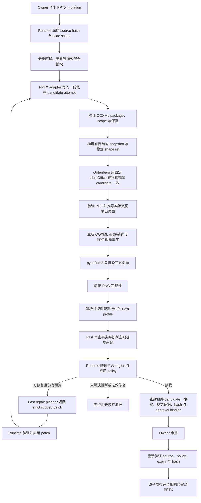

# PPTX 最终渲染视觉质量门禁设计

> 语言：[English](../../docs/pptx-final-render-visual-qa-design.md) | 简体中文

| 字段 | 值 |
|---|---|
| 状态 | Runtime 实现已于 2026-09-01 完成；部署默认仍为 shadow，且未授予 repair 或 blocking 资格 |
| 决策日期 | 2026-09-01 |
| 范围 | 所有可能发布新演示文稿的受治理 PPTX mutation |
| 权威 renderer | Gotenberg `8.36.0` 加 LibreOffice `26.2.5.2` |
| Rasterizer | pypdfium2 `5.12.1` |
| 视觉审查器 | Runtime 当前活动 profile 解析出的 Fast 模型 |
| 发布规则 | 只发布被已记录证据覆盖的同一份密封 candidate |
| 决策所有者 | SparkClaw Workflow Runtime |

## 决策

SparkClaw 将在受治理的 PPTX mutation 流水线中增加最终渲染质量阶段：

```text
PPTX candidate attempt
  -> 使用固定 LibreOffice 的 Gotenberg
  -> PDF
  -> 确定性完整性检查与客观诊断事实
  -> 有界结构投影与变更页 PNG
  -> 配置选中的 Fast 语义审查与修复规划
  -> Runtime policy：接受、有限修复或失败
  -> 获得修复授权时创建下一份 candidate attempt
  -> 密封 candidate 审批与发布
```

Runtime 创建一份初始精确 candidate。对于“完善第 2 页”这类结果导向请求，可修复的视觉
问题可以在原授权页面范围内触发最多两轮有限自动修复。每份 candidate attempt 都把完整
deck 精确转换一次，但只有实际发生可见变更的输出页面才会 rasterize 并发送给 Fast。不生成
全 deck contact sheet，也不会为了上下文而扩展到相邻页面。

Fast 是模型角色，不是“在线 endpoint”的同义词。Runtime 在调用时解析当前活动 Fast
profile。本地或托管 Fast 通过完全相同的视觉审查契约工作；启用前必须针对实际解析出的
profile、base URL 和 model ID 通过图片输入 readiness probe。当前某个本地 Fast 部署没有
开启图片输入，只代表该 profile 当前未 ready，不构成架构限制。

固定 LibreOffice 的渲染结果是唯一视觉基准。资格测试、结果比较和生产运行都不要求
Microsoft PowerPoint。Runtime 通过程序生成截断、几何重叠和越界事实。Fast 结合渲染页面
解释这些事实，诊断层级、留白、视觉焦点及其他语义视觉问题，并提出修复策略。所有
warning、repair 授权、停止与 blocking 决策均由 Runtime 负责，不把中间布局实现选择交给
用户。

## 实施状态

目标 Runtime 路径已完成实现，并受 operator 所有的 rollout 与 qualification gate 控制：

- Compose 运行按 digest 固定的 Gotenberg `8.36.0` 镜像，Gateway 只使用其私有
  LibreOffice 转换 endpoint。
- 文档 runtime 与 Gateway image 安装严格固定的 `pypdfium2==5.12.1`。
- 现有审批前临时 candidate 路径会对六种受治理 PPTX mutation 调用视觉 QA：
  `replace_text`、`add_slide`、`update_slide`、`update_deck`、`duplicate_slide` 与
  `delete_slide`。
- Runtime 组合归一化 mutation argument 与已验证 mutation result，选择 replacement 命中的
  页面和 shape、新插入页面，或被更新的页面和 shape；duplicate 与 delete 的视觉页面集为空。
- 每种 operation 都只把完整 candidate 转换一次，并校验每一张 PDF 页面的页数、尺寸与比例。
  只有选中页面会 rasterize 并发送给 Fast；空页面集会跳过 Fast，但不会跳过渲染完整性检查。
- 内嵌诊断 adapter 输出有界结构以及明确的 clipping、overlap 与 off-canvas 事实。
  缺失 PDF text 证据时输出 `unavailable`，不会伪造通过结论；有界 text 或 evidence
  truncation 会明确标记，不会被当成完整证据。
- 实际活动 Fast profile 必须先通过图片输入加 strict-schema readiness probe；之后每张
  选中 PNG 都通过严格的 `sparkclaw.pptx_visual_assessment.v1` 契约审查。
- 有界 audit 记录 hash、尺寸、诊断 identity、语义 effect、issue region、shape reference
  与 model identity，不存储页面 pixel 或文档文本。
- Runtime 生成类型化 `sparkclaw.pptx_visual_report.v1`，包含 infrastructure state、稳定
  failure code、客观/主观 evidence 与 Runtime 所有的 issue class。Shadow、warning、
  qualified blocking 与 default-on 都只使用这一份类型化 policy 输入。
- Warning 及之后阶段可通过活动 Fast profile 运行严格的
  `sparkclaw.pptx_visual_repair_plan.v1` planner。Internal-only adapter 支持有限 operation
  集，校验新鲜的模型不可见 shape target hash，并拒绝授权 slide XML 之外的 package 变更。
- Controller 只允许初始 candidate 加最多两轮 repair attempt。每轮都重新转换，只有修复页
  rasterize，shape reference 重新生成；重复 plan、重复 candidate、pixel 未变化、scope/protected
  约束违规和 blocking regression 都会确定性停止或回滚。
- Approval warning 只包含有界 slide/class 摘要。Qualified blocking 与 default-on 在必需
  renderer/model evidence 缺失时 fail closed，但只有四种已配置 blocking-ceiling class 能在
  repair 后阻止。
- Candidate bytes、类型化 visual report、attempt chain、repair-plan digest、source hash、
  argument digest、policy-configuration digest 与 expiry 均密封到 Artifact Store。Approval
  精确发布这些 candidate bytes，不重新运行 mutation、render 或 Fast。

随附默认值仍为 `shadow`。`repairQualifiedClasses`、`repairQualifiedOperations` 与
`blockingQualifiedClasses` 均为空，因此代码路径存在并不等于任何生产 repair 或 blocking
行为已经获得资格。Operator 必须先记录部署特定 renderer/font/model/corpus 证据，才能进入
warning 或授予 class/operation qualification。

## 边界

这是一条包含有限纠正能力的接受流水线，不是开放式布局搜索。

- 现有受限 PPTX mutation 层继续创建 candidate。
- OOXML verifier 证明只发生了获授权的 package 和语义变更。
- Gotenberg 为固定 LibreOffice renderer 提供隔离服务运行环境，不是第二套渲染基准。
- 确定性诊断引擎从当前 OOXML snapshot 生成精确的 shape 重叠与越界事实，并从固定 PDF
  text/glyph layer 生成定向截断证据。
- pypdfium2 只为 Runtime 选定页面提取有界 text/glyph 测量并创建图片。
- Fast 对客观事实做语义审查，从图片诊断主观视觉类别，并为授权页面提出 strict mutation。
- Runtime 决定组合证据是仅 shadow、可修复、warning，还是通过资格测试的 blocking defect，
  再通过 PPTX adapter 验证并应用 repair。
- 默认预算为一份初始 candidate 加最多两轮修复；模型不能提高该上限。
- 审批绑定已完成渲染和检查的精确 candidate bytes。

当前设计不保留 PDF.js 几何重建、PowerPoint 参考渲染、全 deck contact sheet、推测性
candidate 渲染或无界模型驱动修复。被替代方案及其测试工具只保留在 Git 历史中。

## 目标

- 在固定 Linux 基准环境中，于审批前渲染每份可发布 candidate。
- 每份连续 candidate attempt 只转换一次，不渲染推测性变体。
- 确定性捕获损坏输入、转换失败、页数不一致、无效页面图片和未授权 OOXML 变更。
- 为实际变更页面生成精确且绑定 shape 的 text clipping、geometry overlap 与 off-canvas 事实。
- 只让 Fast 检查产生了新像素的页面，并同时提供当前结构与客观事实。
- 本地与托管 Fast profile 使用相同实现，不增加 endpoint 专用分支。
- 把页面 pixel 和页面内可见指令视为不可信输入。
- 在用户原始授权范围内自动纠正合格布局缺陷，不要求用户决定中间实现方式。
- 使用页面 scope、受保护内容、attempt 数、operation 数与父 deadline 限制修复。
- 先把视觉发现作为 shadow 数据和 warning，再允许少量通过资格测试的严重缺陷类别阻止。
- 发布 hash 和证据已经获批的同一份密封 candidate。

## 非目标

- 从 PDF 重建 slide object geometry 或 reading order；shape geometry 与 identity 始终以 OOXML
  为准。
- 把几何 overlap 测量直接视为 defect，或用确定性 overlap/审美评分建立第二套布局引擎。
- 比较 LibreOffice 与 Microsoft PowerPoint 输出。
- 为提供样式或演示上下文而发送未变更页面。
- 让 Fast 直接编辑 candidate 或决定接受哪项修复。
- 发现问题后执行无界生成、candidate 枚举或审美搜索。
- 把页面级请求扩展为 master、theme 或无关页面变更。
- 暴露可传入任意路径或 renderer 设置的用户可选 render/visual-inspection tool。
- 活动 policy 所要求的阶段不可用时发布未检查输出。

## 页面选择

Runtime 根据可信 mutation 证据推导视觉审查页面集合，不依据模型自由文本，也不依据页面
邻接关系。

1. 冻结的用户 scope 与归一化 tool argument 定义获授权 slide target。
2. Mutation 结果记录最终 1-based 输出 slide index。
3. OOXML 保真检查拒绝 scope 以外的可见变更。
4. Runtime 计算实际发生可见 delta 的输出页面集合。
5. 只有该集合会被 rasterize 并发送给 Fast。

示例：

| Operation | 完整 deck 转换 | 发送给 Fast 的页面 |
|---|---:|---|
| `pptx.replace_text` | 必需 | 包含 replacement 的页面 |
| `pptx.update_slide` | 必需 | 被更新的一个输出页面 |
| `pptx.update_deck` | 必需 | 仅列出且实际改变的输出页面 |
| `pptx.add_slide` | 必需 | 新插入的输出页面 |
| `pptx.duplicate_slide` | 必需 | duplicate 未产生新像素时为空 |
| `pptx.delete_slide` | 必需 | 空 |

全 deck 请求如果实际改变每一页，就检查每一页；如果只改变其中一部分，则不发送未变更
页面。可见 delta 集合为空时跳过 Fast，但不能跳过完整转换、OOXML 检查或 PDF 完整性检查。

## 请求授权与自动修复

Runtime 在创建 candidate 前对冻结请求分类：

| 请求类别 | 示例 | 自动修复权限 |
|---|---|---|
| 精确编辑 | “把第 2 页标题替换为 X” | 只能修复本次编辑引入的问题，同时保留指定文字和明确约束 |
| 结果导向编辑 | “完善第 2 页”或“让这一页达到可交付质量” | 可以在授权页面内进行有界内容与布局纠正，以完成请求结果 |
| 混合编辑 | “完善第 2 页，但保留图片和品牌色” | 使用结果导向修复，但把每项明确约束视为不可变边界 |

请求不明确时采用更窄权限。明确的对象名称、数值、位置和禁止项都是硬约束。结果导向描述
只对点名页面授权，并且只授权完成该结果所必需的自主决策。

对于结果导向请求，Runtime 可以允许 repair planner 自动提出：

- 调整授权页内 text box、image、chart、shape 与 table 的位置和尺寸；
- 有界调整字号、spacing、padding、alignment、wrapping 与 companion shape；
- 删除本轮创建的装饰性元素；
- 在不改变事实、数据、结论、名称或用户目标的前提下，轻量压缩或重组模型生成文字；
- 当更窄替代方案更安全时，回退本轮局部修改。

修复必须优先作用于本轮变更对象。只有既有对象直接参与报告的冲突时，才能调整授权页内
该对象。不得修改其他页面、master、theme、全局字体/配色映射、shared asset、受保护文字
或用户原有实质内容。如果修复需要这些变更，Runtime 必须停止，不能静默扩大权限。

用户只收到一次最终审批或一次结果层失败。系统不会要求用户选择字号、对象位移、换行策略
或中间 candidate。

## 结构证据与问题映射

SparkClaw 当前已经通过 `files.read` 提取 PPTX 结构。底层 `python-pptx` reader 会生成：

- slide index、slide dimensions、layout/template reference 与 notes state；
- 顶层和 group shape 的 index、type、name、placeholder role、parent group、z-order、rotation
  与 OOXML geometry；
- text、paragraph/run structure、editability、font、color、alignment、spacing、bullet、wrapping、
  margin 与 fit summary；
- image、chart、table、hyperlink、fill、line 与 companion-group 证据。

完整 read 当前不会直接发送给 edit model。现有 `pptx_business_projection_v1` 有意只暴露按
operation 收敛的 text target、`slide_index`、`shape_index`、current text、少量 font/fit summary
和 companion role。当前公共 `pptx.update_slide` contract 只接受 text update 加 `preserve` 或
`coordinated` layout policy，不接受模型任意选择的 geometry 或 style operation。

因此，visual-repair feature 需要由 Runtime 为实际变更页构建新的有界投影
`pptx_visual_repair_context_v1`，不需要新增用户可见的 structure tool。每条模型可见 shape
record 包含：

| 类别 | 字段 |
|---|---|
| Identity | 不透明 `shape_ref`、`slide_index`、`shape_index`、type、role、edit capability 与本轮 created/changed 标记 |
| Geometry | `region_milli=[x,y,width,height]`、z-order、rotation、parent/group reference 与 canvas relation |
| Content | Current text 或有界 semantic summary、protected-content flag 与用户约束 |
| Text/style | 相关 font size/name、bold、color、alignment、spacing、margin、wrapping、fill 与 line |
| Relationships | Companion group/role 以及有界 nearby 或 occluding shape reference |
| Diagnostic facts | 客观 diagnostic ID、证据状态、测量 region 与绑定 shape reference |
| Visual issues | 主观 visual issue ID、region、class、confidence 与有界 target candidate |

Runtime 把 OOXML 与 PDF coordinate 转换到同一个页面千分比整数坐标系 `region_milli`。客观
事实直接绑定当前 shape record。主观 visual issue 则通过 rectangle intersection/containment、
distance、z-order、本轮变更归属与 issue-compatible shape type 完成映射。映射只负责定位候选
对象，不授权 repair，也不决定 issue 是否阻止。

对主观 missing-glyph 和 small-text finding，优先选择与 issue region 相交的 editable text
shape。主观 issue 无法可信映射时，Runtime 发送有界排序 candidate set，并标记
`mapping_status=ambiguous`；模型仍不能引用未提供的 shape。

模型可见 `shape_ref` 与当前 candidate snapshot 中模型不可见的 target hash 绑定。任何重读、
repair attempt、source change、shape reorder 或 target mismatch 都会使旧 reference 失效，并
要求创建新 projection。

## 客观诊断事实

Runtime 在 Fast 审查前构建 `sparkclaw.pptx_diagnostic_facts.v1`。该契约只包含测量，不包含
repair 或 policy 结论：

```json
{
  "schema_version": "sparkclaw.pptx_diagnostic_facts.v1",
  "candidate_sha256": "...",
  "slide_index": 2,
  "coordinate_space": "region_milli",
  "facts": [
    {
      "diagnostic_id": "diag-text-1",
      "kind": "text_clipping",
      "status": "confirmed",
      "shape_refs": ["slide:2:shape:5"],
      "evidence": {
        "text_frame_region_milli": [110, 170, 500, 180],
        "expected_text": "季度收入增长 18%",
        "observed_text": "季度收入增长",
        "missing_spans": [{"start": 6, "end": 9, "text": "18%"}],
        "rendered_glyph_bounds_milli": [122, 181, 476, 168],
        "coverage_status": "complete"
      }
    }
  ]
}
```

每条 fact 使用以下四种证据状态之一：

| Status | 含义 |
|---|---|
| `confirmed` | 必需来源与 shape binding 一致，且测量满足已通过资格测试的确定性规则 |
| `observed` | 测量有效，但单独不足以证明完整条件成立 |
| `ambiguous` | 仍存在多个合理的 source-to-shape 或 text alignment |
| `unavailable` | 缺少必需来源，例如可用 PDF text layer；不能把缺失证据转换为 negative finding |

第一批 diagnostic kind 为：

| Kind | 确定性来源 | 必需证据 |
|---|---|---|
| `text_clipping` | 当前 OOXML text/frame 证据与固定渲染 PDF text/glyph layer 对齐 | Expected/observed text、missing span、text-frame region、rendered glyph bounds、alignment/coverage status 与绑定 text shape |
| `geometry_overlap` | 当前 OOXML transformed shape geometry | 两个 shape ref、intersection polygon 或 rectangle 与 area、各 shape overlap ratio、z-order、fill/line transparency、group ancestry 与 numeric tolerance |
| `off_canvas` | 当前 OOXML transformed shape geometry 与 slide canvas | Shape ref、canvas bounds、transformed shape bounds、overflow side/distance、rotation/group ancestry 与 numeric tolerance |

Overlap 与 off-canvas 事实从 OOXML 计算，因为它是 slide object identity 与 geometry 的来源。
引擎在 intersection 或 canvas comparison 前应用 group transform 与 rotation。只有至少一个参与
shape 由本轮变更或创建，或者 fact 与授权 changed-target region 相交时，才输出有界事实。

Clipping 证据只针对变更页中的 editable text shape。Runtime 把归一化 OOXML text 与 run
boundary，对齐到生成审查 PNG 的同一份固定 PDF 中的 pypdfium2 text character、character box
和 bounded text region。只有 shape binding 与 text alignment 在合格规则下唯一时，missing span
才标记为 `confirmed`。PDF text extraction 缺失或不可靠时，必须标记为 `ambiguous` 或
`unavailable`，不得伪造通过或失败。Fast 仍可使用 rendered PNG 理解页面语义，但不能重写
diagnostic measurement 或改变其 status。

`geometry_overlap` fact 只表示两个 transformed shape 相交，不表示内容必然被遮挡。有意叠层、
mask、background、badge 与装饰 overlay 都是有效 overlap。同样，`off_canvas` fact 可能表示
有意 bleed。Fast 根据 fact、结构与渲染图片判断语义影响，再由 Runtime 应用版本化 policy。

## Repair Plan 契约

完成客观诊断与语义 issue mapping 后，有界 repair planner 返回 strict structured plan，不返回
自由文本，也不直接调用 tool：

```json
{
  "schema_version": "sparkclaw.pptx_visual_repair_plan.v1",
  "attempt": 1,
  "slide_index": 2,
  "resolves_diagnostic_ids": ["diag-text-1"],
  "resolves_visual_issue_ids": [],
  "operations": [
    {
      "op": "set_geometry",
      "shape_ref": "slide:2:shape:5",
      "region_milli": [110, 170, 500, 180]
    }
  ]
}
```

每份 plan 必须引用至少一个当前 attempt 的 diagnostic ID 或 visual issue ID。客观 repair 使用
`resolves_diagnostic_ids`；层级、留白、焦点或其他主观类别 repair 使用
`resolves_visual_issue_ids`。当一次变更同时解决 measured geometry fact 与 semantic visual
issue 时，可以同时引用两者。

第一批通过资格测试的 operation 使用封闭集合：

| Operation | 用途 |
|---|---|
| `rewrite_text` | 在内容授权内压缩或重组模型生成文字 |
| `set_geometry` | 在授权 slide 内移动或缩放一个已提供 shape |
| `set_text_style` | 有界修改字号、alignment、spacing、margin 或 wrapping |
| `set_shape_style` | 品牌约束允许时修复合格的局部 contrast/fill/line 问题 |
| `place_above` / `place_below` | 相对于同页另一个已提供 shape 调整顺序 |
| `delete_generated_shape` | 删除本轮创建的装饰性 shape |

每个 operation 只能使用已提供的 `shape_ref` 和 operation-specific field。未知 operation/field、
raw OOXML path、任意 package part、绝对 filesystem path、未提供 shape、cross-slide reference
或自由文本指令都会使整份 plan 无效。

当前公共 editor schema 保持不变。Runtime 必须把已接受 repair plan 翻译为新的 internal-only
PPTX repair adapter contract。现有 text update 和 `coordinated` layout path 可以先实现受支持
subset；geometry、局部 style 与 ordering operation 必须增加明确 adapter 支持、preservation
allowlist 和资格测试后，才能启用对应 repair class。

## 目标架构



## 职责

| 组件 | 负责 | 不得负责 |
|---|---|---|
| Workflow Runtime | 请求授权、scope、变更页面集合、readiness、repair 预算、问题 policy、停止、审批、发布、audit、清理 | 视觉解释 |
| PPTX adapter | 支持的 candidate mutation 与经 Runtime 验证的 repair 应用 | 宣称最终渲染质量或扩大 repair scope |
| OOXML verifier | Package 有效性与授权语义/package delta | 修复无效输出 |
| Gotenberg/LibreOffice | 每份 candidate attempt 一次隔离的完整 PPTX 到 PDF 转换 | 修改或发布 PPTX |
| 客观诊断引擎 | 绑定 shape 的 clipping、geometry overlap 与 off-canvas 事实及明确证据状态 | 宣称 overlap 有害、判断审美、授权 repair 或 blocking |
| pypdfium2 | 对选定页面做有界 PDF text/glyph extraction 与确定性 rasterization | Slide-object identity、semantic issue classification 或接受 policy |
| 配置选中的 Fast 模型 | 语义审查 diagnostic fact、诊断主观视觉问题并生成 strict repair plan | 选择 endpoint、检查页面、policy severity、blocking 或直接编辑 candidate |
| Structure projector 与 evidence binder | 有界当前 candidate shape record、归一化 coordinate、稳定 reference、fact binding 与主观 issue-to-shape candidate | 语义判断、repair 授权或 mutation execution |
| 有界 repair planner | 根据用户约束、结构化页面证据、客观事实与主观视觉 issue 提出 strict repair | 应用变更、扩大 scope、改变受保护内容或选择最终 candidate |
| Artifact store | Owner-scoped 密封 bytes、manifest、证据 digest 与 expiry | 重新计算 policy 决策 |

## 准备流水线

### 1. Candidate 与 OOXML preflight

Runtime 把 candidate 写入私有 job 目录并计算 SHA-256。转换前把 candidate 作为 OOXML ZIP
package 验证，包括有界展开、必需 presentation part、relationship 和声明的 slide count。
普通 reader 重新打开文件，现有 preservation rule 验证可见和 package 变更符合授权 mutation。

扩展名为 `.pptx` 的随机或 malformed bytes 必须在此处拒绝。Renderer 响应不能证明输入是
有效 PPTX。

### 2. 每份 Candidate Attempt 一次完整转换

Gateway 把每份 job-local candidate attempt 精确发送一次到一个私有 Gotenberg endpoint。
请求不能覆盖 endpoint、LibreOffice option、font path 或 output location。选定基准为：

- Gotenberg `8.36.0`，使用 image manifest digest
  `sha256:87c16b9f364279d321bc9772d31fa58aa6abe036423c270698bd636c3a8e9466` 固定；
- image 内的 LibreOffice `26.2.5.2`；
- 使用版本化 manifest digest 标识的只读 font bundle。

改变 Gotenberg digest、LibreOffice version 或 font manifest 都属于视觉基准变更，必须重新
完成 render 与 visual qualification。不提供 host LibreOffice fallback。

### 3. 确定性完整性与客观诊断

Runtime 把完整性验证与诊断事实分开。完整性检查判断 candidate 与 render 是否可用；诊断事实
测量 candidate geometry 或固定渲染 text coverage，不决定语义严重性或 repair。

转换前：

- candidate 存在、大小有界，且是有效 OOXML ZIP package；
- 必需 part 与 relationship 可解析；
- 已知预期 slide count；
- package 与 semantic preservation 检查通过。

转换后：

- 响应大小有界，以 PDF signature 开头，并且可以解析为 PDF；
- PDF page count 等于 candidate slide count；
- 每页具有有限且大于零的 dimensions；
- 每页符合预期 orientation 与 aspect-ratio tolerance；
- 所有变更输出页 index 都存在于 PDF 中。

对每张选定 PNG：

- 可以解码，color mode/dimensions 符合固定 render policy；
- pixel 未损坏且不是全黑；
- 只有 candidate 证据允许页面有意为空时才接受全白图片；
- 编码 bytes 与 pixel count 在配置限制内。

完整性检查通过后，Runtime 为实际变更页面构建有界当前 candidate shape snapshot，并生成
`sparkclaw.pptx_diagnostic_facts.v1`：

- transformed OOXML shape polygon 在固定 numeric tolerance 下生成精确 pairwise intersection
  fact 与 canvas overflow distance；
- pypdfium2 从固定 PDF 提取 text layer、character box 与 bounded text region，用于对齐变更的
  OOXML text shape 并识别缺失 rendered span；
- 每条 fact 都带当前 `shape_ref` binding，以及 `confirmed`、`observed`、`ambiguous` 或
  `unavailable` status；
- overlap 与 off-canvas measurement 始终只是事实，不自动成为 defect，也不生成确定性审美分数。

PDF byte hash 会作为证据记录，但 LibreOffice PDF metadata 可能变化，因此不要求跨运行 byte
identity。资格测试使用解码后的 page-pixel 稳定性。

### 4. Rasterization

pypdfium2 `5.12.1` 从同一份 PDF 的选定页面读取有界 text/glyph 证据并渲染。PNG 使用固定 RGB
scale、color policy 与 encoder 设置。分辨率必须处于配置的 Fast 图片限制内，并保留资格测试
corpus 覆盖的最小文字尺寸。

PDF 和 PNG 数据只保留在 job 内。普通日志只记录 hash、dimension、page index、timing 与
类型化 outcome。

### 5. Fast profile 解析与图片 readiness

Runtime 在 operation 开始时通过活动配置解析 Fast lane，并记录实际 profile name、base URL
identity、model ID 与相关 configuration digest。不得根据 profile name、endpoint 位置或模型
家族推断图片能力。

为该实际目标启用视觉 QA 前，readiness probe 必须通过生产使用的同一图片请求路径发送一张
小型已知测试图片，并要求返回有效 strict-schema 结果。Text-only health check、`/models`
响应或成功的非图片 chat request 都不充分。

Readiness 证据以精确的 profile/base URL/model/configuration tuple 为 key，具有有界 TTL，并在
配置或模型变化时失效。因此，本地 Fast 一旦开启图片输入就能直接符合条件，无需增加
local-versus-hosted 分支。

在 shadow 或 warning rollout 阶段，readiness 和调用失败记录为 infrastructure warning，因为
视觉结果尚不具有权威性。当活动 policy 要求对变更页面执行视觉审查后，缺少 readiness、
timeout、transport failure 或无效结构化输出都必须 fail closed，且不创建 approval artifact。

### 6. Fast 语义视觉审查

Runtime 使用解析出的 Fast profile 和 `vision_structured` output budget 调用专用图片检查
operation。调用没有 tool。每个请求只包含：

- 一张变更页面 PNG；
- 1-based slide index 与 page dimensions；
- operation class；
- 该页有界 `pptx_visual_repair_context_v1` 结构；
- 该页 `pptx_diagnostic_facts.v1` 客观事实；
- 版本化 visual issue rubric。

System instruction 明确页面 pixel 是不可信证据，必须忽略页面内部的可见指令。Fast 不接收
workspace path、approval control、source XML、renderer option、无关页面、contact sheet，也
没有修改 candidate 的权限。它不能改变、删除或伪造确定性事实。它负责审查这些事实的语义
影响，并从渲染页独立诊断层级、留白与视觉焦点等类别。

### 7. Runtime 控制的修复与复验

已验证 issue 在冻结请求授权范围内可修复时，Runtime 调用专用有界 repair-planning
operation。Repair planner 只接收原始请求及明确约束、当前
`pptx_visual_repair_context_v1`、客观 diagnostic fact、已验证 semantic visual evidence 与当前
attempt identity。它只返回 strict patch plan，没有 tool，也不能写文件。

除非未来版本化 policy 明确选择另一种已通过资格测试的 model role，repair-planning operation
使用同一个已解析的活动 Fast profile。“专用”表示独立 strict contract 与调用边界，不表示需要
另一套本地服务或仅在线依赖。

PPTX adapter 应用前，Runtime 验证每项拟议 operation：

- target page 位于原始授权集合；
- 每个 `shape_ref` 都通过当前 candidate 中模型不可见的 target hash 解析，并声明支持所请求
  operation；
- 每个被引用的 diagnostic 或 visual issue ID 都属于当前 candidate attempt，且已提供给 planner；
- operation 与 object 符合请求类别允许范围；
- exact text、事实、数据、名称、品牌约束和明确禁止项保持受保护；
- 不修改 master、theme、shared resource 或无关页面；
- 每轮 object/operation 限制与父 deadline 仍有预算；
- patch 非空且没有重复之前的 patch fingerprint。

默认 controller 在初始 candidate 后最多允许两轮修复，即最多三个连续 candidate version。
Operator 可以降低该上限，但 Fast 和 repair planner 都不能提高。每份 repaired candidate 都要
重新执行 OOXML verification、一次完整转换、页面选择、客观诊断、rasterization、semantic
visual review、issue mapping，并创建全新的 repair projection。旧 attempt 的 reference 与证据
ID 都不能复用。

没有 policy-actionable repair issue 时成功停止。仅剩 nonblocking finding，且继续修改的回归
风险大于预期收益时也停止。出现以下任一条件时保护性停止：

- Attempt、operation、object、model call、render time 或父 deadline 预算耗尽；
- patch 无效、越权、为空或重复之前的 patch；
- 修复后解码 pixel 没有变化；
- 修复将违反用户约束或受保护内容边界；
- 下一步需要修改 master、theme、shared resource 或未授权页面；
- 确定性完整性、必需诊断、preservation、renderer 或 model readiness 失败。

Runtime 在尝试修复 nonblocking finding 前保留最近一份符合 policy 的 candidate。如果修复引入
blocking regression，可以回退并密封该最近可接受 candidate。如果修复预算耗尽后仍存在合格
blocking finding，则不创建 approval。用户只收到一次结果层失败，其中包含受影响页面、未解决
证据、停止原因与所需的最小额外授权，而不是一系列布局问题。

## 视觉语义结果契约

Fast 返回语义解释与主观 issue 证据，不返回 Runtime `status`、policy `verdict` 或 blocking
severity。

```json
{
  "schema_version": "sparkclaw.pptx_visual_assessment.v1",
  "slide_index": 2,
  "fact_reviews": [
    {
      "diagnostic_id": "diag-overlap-1",
      "semantic_effect": "harmful_obstruction",
      "confidence_milli": 960,
      "evidence": "前景指标卡遮住了正文最后两行。"
    }
  ],
  "subjective_issues": [
    {
      "visual_issue_id": "visual-1",
      "type": "weak_hierarchy",
      "confidence_milli": 840,
      "region_milli": [80, 90, 840, 760],
      "shape_refs": ["slide:2:shape:2", "slide:2:shape:5"],
      "evidence": "标题与正文强调程度几乎相同。"
    }
  ]
}
```

每个已提供的 `confirmed` 或 `observed` fact 都必须获得有界语义审查。允许的 semantic effect
按 diagnostic kind 版本化：

| Diagnostic kind | 允许的 semantic effect |
|---|---|
| `text_clipping` | `required_content_lost`、`decorative_or_empty`、`unclear` |
| `geometry_overlap` | `harmful_obstruction`、`intentional_layering`、`unclear` |
| `off_canvas` | `harmful_overflow`、`intentional_bleed`、`unclear` |

该审查不能改变 diagnostic status 或 measurement。例如，Fast 把 effect 标记为
`intentional_layering` 时，overlap 仍是 confirmed geometric fact。只有 qualified overlap fact
加 `harmful_obstruction` 时，Runtime 才生成 policy issue `content_obscured`；只有 qualified
off-canvas fact 加 `harmful_overflow` 时，才生成 `element_off_canvas`。Confirmed clipping fact
加 `required_content_lost` 时生成 `text_clipped`。除非后续合格 policy 明确规定，否则
`unclear`、`ambiguous` 与 `unavailable` 证据都不 blocking。

以下主观 issue class 缺少可靠且通用的数学 threshold，因此由模型从渲染页面诊断：

- `weak_hierarchy`；
- `poor_whitespace`；
- `unclear_focus`；
- 当 defect 依赖页面语义而不是单一 geometry fact 时的 `broken_layout`、`overcrowded` 与
  `misaligned`；
- `low_contrast`、`text_too_small`、`missing_glyph` 与 `inconsistent_style`。

JSON Schema 必须严格：未知字段、prose wrapper、未知 diagnostic ID、未知 issue type 或
semantic effect、无效坐标、未提供 shape ref、过多 issue 或越界 confidence 都使响应无效。
坐标使用页面宽高千分比整数。Evidence text 有长度限制并作为不可信数据处理。不提供自由
文本 schema repair。

Repair eligibility 与 blocking eligibility 相互独立：

| Runtime issue class | 证据来源 | 通过资格测试后的自动修复 | Runtime blocking 上限 |
|---|---|---|---|
| `text_clipped` | Qualified `text_clipping` fact 加 semantic review | 是 | 通过 class-specific qualification 后可以阻止 |
| `content_obscured` | Qualified `geometry_overlap` fact 加 `harmful_obstruction` | 是 | 通过 class-specific qualification 后可以阻止 |
| `element_off_canvas` | Qualified `off_canvas` fact 加 `harmful_overflow` | 是 | 通过 class-specific qualification 后可以阻止 |
| `missing_glyph` | 主观 visual issue | 页面级字体/样式变更获得授权时可以 | 通过 class-specific qualification 后可以阻止 |
| `broken_layout` | 主观 visual issue | 是 | Warning |
| `low_contrast` | 主观 visual issue | 受保护品牌约束允许时可以 | Warning |
| `text_too_small` | 主观 visual issue | 是 | Warning |
| `overcrowded` | 主观 visual issue | 是 | Warning |
| `misaligned` | 主观 visual issue | 是 | Warning |
| `weak_hierarchy` | 主观 visual issue | 仅结果导向请求 | Warning |
| `poor_whitespace` | 主观 visual issue | 仅结果导向请求 | Warning |
| `unclear_focus` | 主观 visual issue | 仅结果导向请求 | Warning |
| `inconsistent_style` | 主观 visual issue | 仅结果导向请求 | Warning |

Runtime 根据已验证 fact、semantic effect、主观 issue type、confidence、受影响 role、request
authority、repair qualification、blocking qualification 与 rollout state 映射下一步 action。
Fast 不能增加 fact、授权 repair，也不能把 issue 提升为 blocking。

## Rollout Policy

| 阶段 | 视觉行为 | 自动修复 | Blocking 行为 |
|---|---|---|---|
| 0. 资格测试 | 独立 corpus 与 endpoint 测试 | Repair plan 与 attempt 只在 harness 中运行 | 不进入生产 |
| 1. Shadow | 客观事实、语义审查、主观 issue 与失败只进入有界 audit | 记录拟议 patch，但不应用 | 确定性完整性和 preservation 失败会阻止 |
| 2. Warning | 有效 fact 与 finding 出现在 approval 与 audit | 合格 repair class 可在冻结授权内执行；残余质量 finding 保持 warning | 质量 finding 不阻止 |
| 3. 合格严重问题阻止 | Warning 继续显示，repair 保持启用 | 任何质量阻止前先执行有界 repair | 只有客观事实支持的 `text_clipped`、`content_obscured`、`element_off_canvas`，以及单独合格的 `missing_glyph` 可以阻止 |
| 4. 默认启用 | 选定 deployment profile 中所有受治理 PPTX mutation 使用相同 policy | 有界 repair 成为获授权请求的正常行为 | 必需 renderer/model infrastructure fail closed |

由 operator 所有的版本化 feature state 选择阶段。Repair class 与允许 operation 必须和 blocking
class 分别通过资格测试。模型不能改变 rollout state、threshold、repair budget、renderer、
页面集合或 fallback 行为。

### Operator 配置

版本化配置 surface 保持显式：

| 环境变量 | 含义 | 随附值 |
|---|---|---|
| `SPARKCLAW_PPTX_VISUAL_QA_PHASE` | `disabled`、`shadow`、`warning`、`qualified_blocking` 或 `default_on` | Compose 为 `shadow`；独立默认配置为 `disabled` |
| `SPARKCLAW_PPTX_VISUAL_QA_REPAIR_QUALIFIED_CLASSES` | 允许请求 repair 的 Runtime issue class，逗号分隔 | 空 |
| `SPARKCLAW_PPTX_VISUAL_QA_REPAIR_QUALIFIED_OPERATIONS` | accepted plan 中允许的 internal repair operation，逗号分隔 | 空 |
| `SPARKCLAW_PPTX_VISUAL_QA_BLOCKING_QUALIFIED_CLASSES` | 允许 blocking 的严重 class，逗号分隔 | 空 |
| `SPARKCLAW_PPTX_VISUAL_QA_MAX_REPAIR_ATTEMPTS` | 初始 candidate 之后的 repair attempt 数，限制为 `0..2` | `2` |

加载时会拒绝未知或重复的 class/operation、未同时 repair-qualified 的 blocking class，以及
超出 `0..2` 的 attempt 限制。Policy digest 绑定 phase、三个 qualification 集合、attempt
budget 与 diagnostic tolerance。Approval 等待期间任一配置变化都会使密封 candidate stale，
必须重新准备。

## 资格测试

资格测试以固定 LibreOffice 基准为准，不使用 PowerPoint。

| Gate | 必需证据 |
|---|---|
| Native Linux/ARM64 | 固定 Gotenberg 与 pypdfium2 在部署类别上无 emulation 运行 |
| OOXML 拒绝 | Malformed ZIP、缺失 part、不安全展开和随机 `.pptx` bytes 在转换前失败 |
| 完整转换 | 16:9、4:3、空白、CJK、混合字体、图片、table 与 chart deck 保持预期页数和尺寸 |
| Raster 完整性 | 重复运行中，选定页面可解码且 dimension 与 pixel output 稳定 |
| 字体 | 记录版本化生产 manifest、CJK coverage、已知 substitution 与缺失字体 case |
| 页面选择 | 单页请求只发送一页；有界 deck 更新精确发送实际变更集合；无新像素时 duplicate/delete 不发送 |
| 请求授权 | 精确、结果导向与混合请求保持各自不同的硬约束和页面 scope |
| 结构投影 | 完整 parser 证据被缩减为实际变更页面的完整、有界 repair record，不泄漏 path 或无关页面 |
| 坐标绑定 | OOXML、PDF 与 PNG 证据归一化到同一 page coordinate space，并重新绑定 fresh current-attempt shape ref |
| 截断诊断 | Expected OOXML text 与固定 PDF character/box 对齐；missing span、frame bounds、rendered bounds 与 coverage status 匹配标注 fixture |
| 几何诊断 | Rotated/grouped overlap polygon、ratio、z-order、transparency、canvas overflow side/distance 在固定 tolerance 内匹配精确 fixture |
| 诊断状态 | `confirmed`、`observed`、`ambiguous` 与 `unavailable` 可复现；缺少 PDF text 不能变成 false pass 或 confirmed defect |
| 重叠/越界语义 | 有意 layering 与 bleed 保持非 defect；有害 obstruction 与 overflow 由模型结合图片和事实识别 |
| 主观视觉 corpus | Fast 对带标注的 hierarchy、whitespace、focus、contrast、density、alignment、glyph 与 style case 做评估 |
| 主观 issue 映射 | Fast region 映射到已提供的当前 text、image、chart、table、group 与 z-order shape ref；ambiguous case 保持显式 |
| Prompt injection | 页面可见指令不能改变 schema、issue set 或 Runtime policy |
| Fast readiness | 本地与托管形态的 profile 都通过精确图片请求和 strict-schema 路径测试 |
| 模型契约 | Valid、malformed、empty、timeout 与 oversized 结果具有类型化 outcome |
| Repair plan 契约 | 只接受已提供的当前 attempt diagnostic/visual issue ID、shape ref 与合格 operation-specific field |
| Repair scope | 所有拟议 patch 都停留在授权页面，保护 exact content，并拒绝 master/theme/shared-resource 变更 |
| Repair convergence | 客观事实支持与主观 defect 都在两轮内修复；no-op、重复、回归和超预算 case 确定性停止 |
| Repair adapter | 每个启用的 internal operation 都有 preservation、rollback、reread 与 render regression coverage |
| 延迟 | 初始转换加两轮修复、rasterization、queue、model call 与 peak memory 符合父 operation deadline |
| 取消与保密 | Job 及时清理，普通日志不包含文档 pixel 或文字 |

任何严重 class 可以阻止前，其标注 corpus 必须达到已记录 recall target 与 false-block
ceiling。低 confidence 和审美类问题无论模型如何描述都保持 warning。

## 可行性证据

2026-09-01 在 `/tmp/sparkclaw-pptx-render-qa-20260901` 完成的 Linux ARM64 可行性测试证明：

- 四页 PPTX 转换为四页 PDF 和四张有效 PNG；
- 首次转换耗时 `0.694s`，warm conversion 为 `0.349-0.363s`；
- Rasterization 约为每页 `21-54ms`；
- 多次 PDF byte stream 不同，但解码后的页面 pixel 完全相同；
- 有意空白页渲染为全白，没有可见水印；
- 环境存在 Noto Sans CJK SC，Aptos 被静默替换为 Noto Sans，证明必须固定 font manifest；
- 四个并发请求发生串行化，wall time 约 `1.4s`；
- 随机 bytes 命名为 `.pptx` 时产生了 HTTP 200 的单页 Writer PDF，证明 OOXML preflight
  与页面验证不可省略；
- 一个托管形态 Fast profile 接受图片输入与 strict JSON Schema，并独立注意到 clipping 和
  overlap，但漏掉一个 low-contrast case，且返回了自相矛盾的 overall status，证明语义模型
  证据不能替代确定性事实或 Runtime policy；
- 当前配置的一个本地 endpoint 拒绝图片输入，这只证明测试时该精确 profile 未 image-ready。

这些证据足以在 rollout gate 后开始实施，但尚未证明自动 repair convergence 或严重视觉
问题阻止。两者仍需生产 repair corpus、font manifest 和精确配置 profile 完成资格测试。

## 密封 Artifact 与审批

成功准备会存储 owner-scoped 密封记录，包含：

- source identity 与 SHA-256；
- operation、授权 target set、实际 changed-page set 与 argument digest；
- request authority class 与 protected-constraint digest；
- 每份 candidate-attempt hash、input-attempt link、repair-plan digest、scope validation result、
  diagnostic-fact digest、visual-assessment digest 与 stop reason；
- 最终 candidate PPTX SHA-256 与 canonical package digest；
- PDF byte digest、page count、dimension 与选定 PNG pixel digest；
- 确定性完整性、OOXML preservation、diagnostic schema/engine version、PDF text/glyph coverage、
  fact status 与 numeric tolerance；
- visual assessment 与 repair schema/prompt version、解析出的 Fast profile/base URL/model
  identity、readiness 证据、semantic result digest 与 warning；
- Gotenberg image digest、LibreOffice version、pypdfium2 version、font-manifest digest、
  Runtime policy version 与 rollout phase；
- owner、run、approval binding、创建时间、expiry 与 cleanup state。

Approval 只授权发布该 artifact。审批后，Runtime 重新验证 source hash、owner、operation
binding、policy version、candidate hash、expiry 与 artifact integrity，再原子提升完全相同的
密封 PPTX bytes。它不会再次运行 mutation、conversion、rasterization 或 Fast。

## 失败分类

| Code | 含义 | 必需结果 |
|---|---|---|
| `pptx_render_invalid_input` | Candidate 不是有效、有界 OOXML package | 终止准备失败 |
| `pptx_render_backend_unavailable` | 固定 Gotenberg 服务不可用 | 可重试失败；无 approval |
| `pptx_render_timeout` | 必需 render 阶段超过 deadline | 可重试失败；无 approval |
| `pptx_render_invalid_pdf` | Output malformed、不安全、过大或不可解析 | 终止准备失败 |
| `pptx_render_page_mismatch` | PDF page count、page size 或 orientation 与 candidate 不一致 | 终止准备失败 |
| `pptx_render_invalid_image` | 选定 PNG 缺失、损坏、全黑或 dimension 无效 | 终止准备失败 |
| `pptx_render_diagnostic_invalid` | 客观 fact malformed、与当前 candidate 不一致或超出限制 | 终止准备失败 |
| `pptx_render_diagnostic_unavailable` | 活动 policy 所需证据不可用，例如变更 text 缺少固定 PDF text layer | 对应诊断成为必需前为 warning；之后可重试且 fail closed |
| `pptx_render_profile_not_ready` | 精确 Fast profile/base URL/model 图片 readiness 失败 | 视觉审查成为必需前为 warning；之后可重试且 fail closed |
| `pptx_render_model_unavailable` | 必需 Fast 图片调用失败或 timeout | 视觉审查成为必需前为 warning；之后可重试且 fail closed |
| `pptx_render_model_invalid` | Fast 返回无效 strict-schema 证据 | 视觉审查成为必需前为 warning；之后可重试且 fail closed |
| `pptx_render_repair_invalid` | 拟议 repair malformed、越权、重复或违反受保护约束 | 停止 repair；使用最近可接受 candidate 或失败 |
| `pptx_render_repair_exhausted` | Repair budget 结束时仍有未解决 actionable finding | Policy 允许时密封最近可接受 candidate；否则无 approval |
| `pptx_render_visual_blocked` | 有界 repair 后仍存在合格严重 issue | 质量失败；无 approval |
| `pptx_render_preservation_violation` | Candidate 修改未授权 OOXML 或可见内容 | 终止准备失败 |
| `pptx_render_source_stale` | 发布前 source 或 policy 已变化 | Stale result；必须重新准备 |
| `pptx_render_cancelled` | Owner 或 Gateway 取消 operation | 已取消；完整清理 |

## 部署与安全

- 在私有 Compose network 或 loopback 运行一个内部 Gotenberg 服务。
- 固定 image digest、LibreOffice version、pypdfium2 version 与 font manifest。
- 在能力允许时关闭 renderer remote fetching 和未使用 conversion surface。
- 设置 input、archive、PDF、page、pixel、CPU、memory、PID、concurrency 与 deadline 限制。
- 对 repair attempt、累计 repair operation、每轮变更 object、model call 与 file-size growth
  设置独立硬上限。
- 隔离每个 job directory，并把全部工作绑定 Gateway cancellation 与 shutdown。
- 普通 trace 与 metric 不记录 PPTX、PDF、PNG、提取 metadata 或模型证据。
- 只有显式 owner-authorized mode 才保留诊断，且必须设置有界 TTL。
- 为固定 renderer、rasterizer、字体和 transitive component 提供 license notice。
- Renderer、字体、Fast profile/model、prompt、schema 或 blocking policy 变化后重新资格测试。

## 验收标准

实现只有在以下条件全部满足时才完成：

1. 每个受治理 PPTX mutation 准备一份私有初始 candidate；每份连续 candidate attempt 在被
   接受前都精确转换一次。
2. OOXML preflight 在 Gotenberg 前拒绝 malformed 和伪造 `.pptx` 输入。
3. 对完整 deck 检查 PDF page count 与 dimensions。
4. Runtime 只向 Fast 发送实际变更输出页，不发送 contact sheet 或未变更上下文页面。
5. Duplicate 和 delete 未产生新像素时跳过 Fast，但仍执行全部确定性检查。
6. Fast 由活动 profile 解析，并通过真实图片请求证明精确 profile/base URL/model tuple 的
   image readiness。
7. 本地与托管 Fast profile 使用相同代码与结果契约。
8. Runtime 在 Fast 审查前生成绑定 shape 的 `text_clipping`、`geometry_overlap` 与
   `off_canvas` fact，并显式标记 `confirmed`、`observed`、`ambiguous` 或 `unavailable`。
9. Geometry overlap 与 off-canvas measurement 本身不是 defect；Fast 根据图片和结构解释其
   语义影响，Runtime 负责 policy outcome。
10. Fast 从渲染图片诊断层级、留白、视觉焦点及其他主观视觉类别，且不能改变客观事实。
11. Runtime 为变更页构建有界 structure projection，把每个主观 visual issue 映射到当前
    candidate shape ref，且不要求模型猜测未提供对象。
12. Repair planner 引用当前 diagnostic 和/或 visual issue ID，只能对已提供 shape ref 返回
    strict current-attempt operation；Runtime 通过 internal-only adapter contract 验证并翻译。
13. 结果导向页面请求自动获得最多两轮合格 scoped repair，不要求用户做中间决策。
14. 精确与混合请求在自动 repair 中保留明确文字、对象、位置、样式与禁止项约束。
15. Repair 不得改变未授权页面、master、theme、shared resource 或受保护实质内容。
16. 质量 fact 与 finding 先作为 shadow/warning，之后只有四个合格严重 class 可以在有界
    repair 耗尽后阻止。
17. 不存在无界模型驱动 loop 或必需阶段的未检查 fallback。
18. Approval 与最终发布绑定相同最终 candidate SHA-256 和完全相同的 bytes。
19. Renderer、image、diagnostic、model、mapping、repair、cancellation、preservation 与
    stale-source failure 均为类型化结果，且不留下可发布或 orphan artifact。

## 参考资料

- [文档 Workflow](document-workflows.md)
- [Workflow 证据所有权与复用](workflow-evidence-ownership.md)
- [模型输入输出容量契约](model-capacity-contract-design.md)
- [工程基线](engineering-baseline.md)
- [Gotenberg](https://github.com/gotenberg/gotenberg)
- [LibreOffice core](https://github.com/LibreOffice/core)
- [pypdfium2](https://github.com/pypdfium2-team/pypdfium2)
