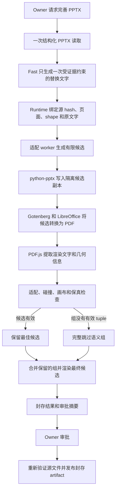

# PPTX 超长文本韧性适配设计

> 语言：[English](../../docs/pptx-overlength-resilience-design.md) | 简体中文

| 字段 | 值 |
|---|---|
| 状态 | Phase 0 **NO-GO**；资格 harness 已实施，生产路径尚未实施 |
| 决策日期 | 2026-08-13 |
| 资格测试日期 | 2026-08-14 |
| 当前范围 | 防止模型文本过长导致 PPTX 完善操作失败 |
| 涉及操作 | `pptx.update_slide` 和 `pptx.update_deck` |
| 候选渲染栈 | Gotenberg、LibreOffice 和 PDF.js 文字几何提取 |
| 内容策略 | Fast 只生成一次；不增加排版提示、不重试缩短、不让模型选择几何参数 |
| 失败策略 | 应用通过验证的语义组、返回安全未修改完成，或报告类型化的可重试基础设施失败 |
| 决策所有者 | SparkClaw document runtime |

## 执行决策

SparkClaw 将评估一个有界、确定性的 PPTX 替换文本适配与渲染检查阶段。第一版只有一个产品
目标：某段文字对源布局来说过长时，不能终止整个 PPTX 完善 Workflow。

Fast 继续负责选择受证据约束的文字 shape，并且只生成一次替换文字。Runtime 随后尝试有限的
排版候选，不再要求 Fast 缩短或重新生成内容。候选只有在结构检查、通过资格测试的
LibreOffice 渲染、渲染文字检查和 OOXML 保真检查全部通过后才能接受。替换通过明确的语义
原子组接受或跳过，避免排版降级让一个完整内容变更只应用一半。如果没有任何语义组可以安全
应用，操作返回未修改的源文档，并以成功的 `no_safe_change` 结束，而不是报告适配相关的
Workflow 失败。渲染器、worker、取消和 deadline 故障仍是类型化基础设施失败，不能伪装成
成功但未修改。

本提案不会恢复已经拒绝的 ONLYOFFICE DocumentBuilder 与 OR-Tools 方案。
[DocumentBuilder Phase 0 报告](../benchmarks/pptx-documentbuilder-phase0-qualification.md)
仍然是该 No-Go 决策的权威记录。本文中的候选栈有独立的强制资格门槛，并且只作为渲染判定器，
不成为 SparkClaw 的 PPTX 写入引擎。

[Phase 0 资格报告](../benchmarks/pptx-overlength-phase0-qualification.md)记录了当前的
No-Go 结果。合成可见性、确定性、保真和失败门禁已经通过，但即使采用实测最快的 median，
未缩减的 1,024 候选计划仍超过 90 秒准备预算；本次也没有 owner 私密文字样本或 Microsoft
PowerPoint 参考查看器证据。仓库现已包含仅用于资格测试的代码与固定 benchmark 依赖；Gateway、
ToolHub、配置、提示词、部署和运行时行为均未改变。

## 问题

当前 `services/gateway/internal/toolhub/scripts/pptx_slide.py` 中的协调更新器根据字符类别估算
文字宽度，并以固定行高系数估算高度。当替换文字无法容纳时，它抛出
`PPTXLayoutFitError`。预检把该情况映射为 `pptx_layout_fit_conflict`，Workflow 随后给
Fast 一次语义修复机会，要求它缩短或省略替换。第二次仍冲突时，Workflow 会在审批前被拒绝。

相对于当前紧迫的产品需求，这一行为有四个缺陷：

1. 文字容量依赖估算，没有通过实际渲染器检查。
2. 排版可行性被错误地传回给内容模型处理。
3. 一个不可行的替换可能让同一页或受限整份文稿中其他有用更新全部失效。
4. 无法完善文档被表示为执行失败，但未修改的源文件仍然是有效、可用的 PPTX。

提示词无法消除这一失败模式。模型仍可能生成更长的中文表达、增加换行、选择不同标点，或者在
模型与采样策略改变后扩展术语。因此 Runtime 必须负责适配和降级完成。

## 产品不变量

本设计提出的实现必须保持以下全部不变量：

- PPTX 语义生成只调用 Fast 一次。排版冲突永远不会产生第二次模型调用。
- Runtime 不截断、不总结、不改写，也不删除替换字符串的一部分。一项替换要么完整应用，要么
  完整跳过。
- 语义上相互依赖的替换作为一个原子组完整应用或跳过。Runtime 不跨越语义组边界最大化更新数。
- 仅仅因为替换文字过长，绝不能导致 `pptx.update_slide` 或 `pptx.update_deck` 失败。
- 现有请求边界继续生效。超过 12 页、64 个 shape 或 32 KiB 替换文字的输入在适配前确定性
  拒绝，不归类为适配失败。
- 源 PPTX 不可变。所有候选都在隔离的 job 目录中生成。
- 只有通过渲染和保真检查的编辑 artifact 才能发布。
- 渲染器不可用、超时、结果不确定或 shape 不受支持时，不能发布未检查候选。
- 相同的源文件字节、替换字节、策略、字体和引擎版本必须产生相同的接受子集和排版计划。
- wall-clock 进度不能决定部分结果。hard deadline 会以可重试基础设施结果终止准备；确定性搜索
  限制必须用策略所有的操作数和候选数表达。
- 审批必须描述准确的预生成 artifact、已应用更新、已跳过更新和排版变更。审批不会授权后续模型
  重试。
- 现有源身份、证据绑定、范围限制、Policy、审计、artifact lineage 和编辑后验证继续有效。

## 目标

- 当一项或多项生成文字对源文本框来说过长时，PPTX 完善仍能完成而不发生 Workflow 失败。
- 在资格测试和验收路径使用实际渲染，不把字符数启发式估算当作适配成功的证据。
- 尽可能保留彼此独立且安全的语义组。
- 内容生成成本保持为一次 Fast 调用，不向该调用增加排版上下文。
- 只执行有界、确定性的格式和几何变化。
- 返回稳定的类型化结果，区分完全成功、部分成功、安全未修改和真正的基础设施或源文件失败。
- 建立一个较小的第一版，后续可以扩展更多布局族，而不改变模型与 Runtime 的职责边界。

## 非目标

- 对任意演示文稿进行通用重设计或审美优化。
- 第一版中切换模板、生成新的视觉结构或跨页拆分内容。
- 让视觉模型或语言模型评判排版。
- 自动编辑 SmartArt、图表内部文字、动画、母版、组合 shape 子元素、竖排文字、路径文字或不受
  支持的 field。
- 与 Microsoft PowerPoint 像素级一致。
- 替换 `python-pptx` 这一受限 PPTX 修改层。
- 提供嵌入式人工检查或在线演示文稿编辑器。
- 重用 DocumentBuilder、OR-Tools 或被拒绝的 AGPL worker 设计。

## 第一版支持范围

第一版只处理 SparkClaw 生成的演示文稿，或者通过明确兼容性 fingerprint 准入的演示文稿中
普通且可编辑的文字 shape。

| 类别 | 第一版行为 |
|---|---|
| 普通标题、正文和说明文本框 | 候选适配和渲染验证 |
| 有高置信度配套元素的受支持卡片或横条模式 | 按版本化规则对配套元素进行受限缩放 |
| 英文、简体中文和中英混排 | 资格测试样本必须覆盖 |
| 表格 | 保护；跳过目标所在的完整语义组 |
| 组合内文字 | 保护；跳过目标所在的完整语义组 |
| SmartArt 和图表内部文字 | 保护；跳过目标所在的完整语义组 |
| 竖排、旋转、路径或包含 field 的文字 | 保护；跳过目标所在的完整语义组 |
| 动画、切换、备注、母版、媒体和 relationship | 保留并检查 fingerprint；永不作为隐式修改目标 |
| 未知或关系不明确的配套元素 | 保护；不移动几何位置 |

支持范围按能力判断，而不是按文件名判断。只有 Runtime 能证明所有可变目标及其允许修改的配套
元素都符合已通过资格测试的模式时，该页面才算受支持。不支持的目标会让其完整语义组失去资格，
但不会禁用其他彼此独立且受支持的组。

## 目标架构



### 组件职责

| 组件 | 负责 | 不得负责 |
|---|---|---|
| Fast | 语义目标选择、语义组成员关系和准确替换文字 | 适配重试、字号、坐标、文本框尺寸或跳过策略 |
| Workflow Runtime | 证据绑定、类型化结果、Policy、审批、源文件新鲜度、artifact 发布和审计 | 文字测量或演示文稿渲染 |
| 适配 worker | 候选生成、确定性排序、逐组回滚、渲染编排、验证和诊断 | 内容改写、外部网络访问或审批 |
| `python-pptx` 修改层 | 向隔离副本写入受限文字、样式和允许的几何变化 | 声明渲染适配或查看器兼容性 |
| Gotenberg/LibreOffice | 使用固定字体环境把隔离 PPTX 候选转换为 PDF | 保存最终 PPTX 或选择候选 |
| PDF.js 检查器 | 从 PDF 提取标准化渲染文字项及其变换几何 | 编辑 PPTX、通过 OCR 发明内容或进行语义排版判断 |
| 保真验证器 | 执行 OOXML package 和标准化语义 allowlist | 修复无效候选 |

Gotenberg 是固定 LibreOffice runtime 的内部进程/API 封装，只绑定私有地址，并且只接收 job
目录内文件。worker 不接受模型提供的渲染器 URL、任意转换选项或 job 目录外路径。

## 单次生成内容契约

模型可见的 PPTX 投影继续只包含选择当前 shape 和生成替换文字所需的证据。它不接收：

- 候选尺寸、字号步长、渲染器输出或排版评分；
- 原始 PPTX XML、PDF 字节、图片或字体度量；
- 要求达到指定字符数，或在适配失败后重试的指令；
- 选择适配策略或标记某项更新必须应用的字段。

语义输出 schema 可以给更新附加不透明 `atomic_group_id`。在 `update_slide` 中，组自然限制在
当前页面；在 `update_deck` 中，如果术语、数值或结论必须跨页一致，一个组可以跨越多页。该标识
不携带排版优先级、几何参数或降级指令。Runtime 根据冻结的完整操作范围验证组成员。缺失、无效、
超出范围或存在歧义的分组会保守降级为“本次操作全部更新属于同一组”。Runtime 不根据页面距离
或几何距离推断语义独立性。

Runtime 将 `pptx_layout_fit_conflict` 从语义修复的适用条件中移除。空替换文字或 schema 无效
等不合格语义输出仍可保留语义修复，但渲染或几何失败不能触发语义修复。

语义阶段完成后，替换字符串不可变。适配可以在策略边界内改变换行、段间距、行距、文本框尺寸、
高置信度配套元素几何和字体格式，但不能改变替换文字中的任何 code point。

## 候选适配策略

### 候选顺序

worker 对每个受支持目标按以下顺序生成有限且规范化的候选列表：

1. 保留源几何和有效字体格式；只有源语义允许时才启用换行。
2. 沿通过资格测试的轴把文本框扩展到已证明的空闲空间，并保持源对齐锚点。
3. 缩放高置信度配套背景，并且只移动保持 containment 和间距所必需的版本化 flow peer。
4. 在策略下限内减小段前、段后和行距，同时保留段落与项目符号结构。
5. 以 0.5 pt 为步长缩小字号，保持 run 之间的相对字号层级，直至角色绝对下限与源字号比例
   下限中更高的一个。
6. 按规范顺序应用步骤 2 到 5 的受限组合。

以上只是候选族，还不是可执行策略。进入 Phase 1 前，Phase 0 必须发布一个版本化策略 artifact，
明确固定：

- 每个已准入角色和轴的准确整数 EMU 增长及移动步长；
- 准确的段落/行距值、字号步长、绝对/相对下限和取整方式；
- 允许的配套模式 ID 及其完整修改 allowlist；
- 规范化笛卡尔积枚举、支配候选剪枝、候选 ID、目标 tuple 和稳定平局规则；
- 每个 shape 与冲突分量的确定性最大评估次数。

`max_candidates_per_shape` 是验证边界，不表示保留“最先跑完”的候选。需要截断时，必须在开始
渲染前完全由版本化枚举顺序决定。

第一阶段资格测试使用以下提议值，它们不是生产默认值：

| 角色 | 提议绝对下限 | 提议相对下限 |
|---|---:|---:|
| 标题 | 18 pt | 源有效字号的 80% |
| 正文 | 12 pt | 源有效字号的 75% |
| 说明 | 9 pt | 源有效字号的 75% |

owner 样本资格测试可以提高这些下限，但不能静默降低。任何变化都必须升级策略版本。

### 字体处理

只有在不破坏格式的情况下能够解析有效字号时，才允许缩放字体。一个文字 shape 含有多个显式
run 字号时，对全部字号应用同一个比例并保持相对层级。如果有效字体来自继承、以不受支持的方式
混合、被渲染器替换或已低于可读下限，则不生成字体缩放候选。

候选生成不能依赖模型估算、wall-clock 竞争、map 迭代顺序，或依赖渲染器自动修正并保存回
PPTX。

### 几何处理

所有坐标使用整数 EMU 和版本化取整。可变区域必须留在页面安全区内，不能穿过受保护 shape。
只有 containment、alignment、order 和 spacing 关系已经通过兼容性样本测试的模式，才允许移动
配套元素。未知对象是障碍物，不是可利用的排版空间。

第一版不把内容移动到其他页面，也不新增页面。这些行为会改变叙事结构和审批范围，需要后续独立
设计。

## 渲染与接受契约

渲染是准入检查，而不是修改来源。LibreOffice 永远不保存最终 PPTX。SparkClaw 写入候选
PPTX 后，将其渲染为 PDF，再由 PDF.js 读取页面文字内容和几何。

候选只有在所有适用检查通过时才有效：

1. 候选可以通过正常 PPTX reader 重新打开。
2. 标准化后的准确替换文字按渲染文字顺序完整出现，不缺失前缀、后缀或内部片段。
3. 所有匹配的渲染文字项都在候选允许的文字区域内，误差不超过通过资格测试的容差。
4. 渲染边界保持在页面画布内。
5. 已修改文字和可变配套元素按照版本化碰撞规则不会新增与受保护 shape 的相交。
6. 有效渲染字体存在于固定字体 manifest；未通过资格测试的字体替换会使候选无效。
7. PDF 页面非空、尺寸符合预期，并且重复渲染得到稳定的标准化文字和几何。
8. 输出 PPTX 包含准确的请求文字和预期几何。
9. Package 与语义保真 allowlist 没有报告无关变化。

### 渲染文字归属与可见性

仅靠 PDF 文字提取不够。对每个修改目标，通过资格测试的检查器必须证明：

1. **唯一归属：**候选文字项唯一映射到预期页面和投影 shape 区域。页面其他位置出现相同文字、
   提取顺序有歧义或多对一匹配时，候选无效。
2. **基线差异：**使用相同引擎渲染未修改源文件并与候选比较。已接受文字和几何差异只能出现在
   声明的目标和配套元素中。
3. **裁切可见：**替换文字所需的每个 glyph quad 都必须在资格容差内完整落入有效 PDF clip 区域。
4. **遮挡可见：**受保护的后绘制内容、mask、透明效果或同色隐藏不能在准入模式下遮住所需字形。
5. **标准化一致：**换行、soft break、项目符号、ligature、Unicode 标准化、中日韩 glyph run 和
   空白使用 Runtime 与资格样本共享的一个版本化比较算法。

Phase 0 可以把 PDF.js 文字内容、operator-list/graphics-state 证据和确定性 raster 证据组合成
一个通过资格测试的检查器。如果固定栈不能提供足够信息，并在准入样本中以零溢出漏报证明以上
性质，本设计即为 No-Go。PDF 内容流中存在替换字符串永远不是充分条件。

Phase 0 必须明确测试裁切、crop、字形变换、项目符号、soft break、中日韩文字、重复字符串归属、
遮挡、透明效果和字体替换。OCR 不作为验收兜底。

LibreOffice 和 Microsoft PowerPoint 对同一 PPTX 的渲染可能不同。因此 runtime 保证仅限于
通过资格测试的 LibreOffice/字体环境和兼容性样本。Phase 0 还要在当前 PowerPoint 参考查看器
中比较样本；不受支持或存在差异的模式要排除，不能宣传为安全。

## 部分应用算法

一个 deck job 内按页面组织候选生成与组合渲染检查，但资格和选择单位是覆盖完整操作范围的语义
原子组，不是单个更新：

1. 根据冻结的源证据验证每项请求更新。
2. 标准化并验证范围内语义组。任一成员不受支持或不可行，会使整个组不再具备候选资格。
3. 修改前给不具备资格的组分类，并保留逐成员诊断。
4. 对其余更新逐项隔离生成并渲染候选。
5. 为每个完整组构建变化最小的有效候选 tuple。
6. 合并页面上的候选组并渲染组合结果。
7. 如果组合失败，根据共享配套元素、变化后的几何和失败碰撞检查构建冲突分量。
8. 一个冲突分量不超过八个组时，枚举组子集，首先最大化应用更新数量，再最大化应用组数量，
   然后依次最小化字号缩减、几何移动、间距变化，最后以稳定组和 shape ref 处理平局。
9. 更大的冲突分量使用同一目标与策略限定的确定性淘汰顺序，并在诊断中记录该路径。
10. 对页面最终选定的组子集重新渲染。
11. 组装所有已接受页面，最后执行一次完整输出渲染、重读和保真检查。

该算法不需要 OR-Tools。候选和冲突操作边界较小且已版本化。耗尽确定性搜索边界会让整个受影响
组以 `search_budget_exhausted` 失去资格。wall-clock deadline、worker crash、渲染器不可用或
取消会把整次准备终止为类型化基础设施失败；SparkClaw 不发布由“恰好先完成的工作”选出的子集。

即使 exact-span 替换跨越多个 run，它仍然是原子操作。语义组跨 shape 仍保持原子。Deck 更新对
独立组之间的适配冲突不再是全有或全无，但文件发布仍然是原子的：SparkClaw 只发布一个通过
验证的 PPTX，或者不发布编辑后的 PPTX。

## 类型化结果与失败语义

操作结果必须把业务降级与执行失败分开。

| 状态 | 含义 | 用户可见 artifact |
|---|---|---|
| `completed` | 所有请求语义组都通过 | 通过验证的编辑后 PPTX |
| `completed_with_skips` | 至少一个语义组通过且至少一个被跳过 | 通过验证的编辑后 PPTX，以及组感知的跳过摘要 |
| `no_safe_change` | 在完整且健康的评估后，没有语义组能够安全应用 | 原 PPTX 引用；不创建容易误导的编辑副本 |
| `source_invalid` | 源文件不可读、已过期、损坏或违反格式策略 | 终止的源文件失败；不创建新 artifact |
| `runtime_unavailable` | 所需的合格渲染器或 worker 不可用或不健康 | 可重试基础设施失败；不创建新 artifact |
| `adaptation_timeout` | 完成最终验证前达到 wall-clock deadline | 可重试基础设施失败；不创建新 artifact |
| `cancelled` | owner 或 Gateway lifecycle 取消准备 | 已取消 Workflow；不创建新 artifact |

只有 `completed`、`completed_with_skips` 和 `no_safe_change` 是成功的 Workflow 完成状态。
`runtime_unavailable` 和 `adaptation_timeout` 是可重试基础设施失败，`source_invalid` 是源文件失败。
这些结果都不触发语义生成重试，也不能映射为 `semantic_output_invalid` 或通用模型失败。

每个被跳过更新有一个稳定 reason code：

| Reason code | 含义 |
|---|---|
| `unsupported_target` | Shape 或配套模式超出已通过资格测试的范围 |
| `no_fitting_candidate` | 所有受限候选都溢出或违反可读性要求 |
| `combined_layout_conflict` | 语义组单独可适配，但无法与排名更高的兼容组一起应用 |
| `font_unavailable` | 所需有效字体缺失或被替换 |
| `render_unverifiable` | 无法证明渲染文字或几何完整 |
| `search_budget_exhausted` | 已耗尽确定性候选或冲突操作边界 |
| `semantic_group_ineligible` | 同一原子组的其他成员无法安全应用 |

人类可读文案由这些类型化字段生成。Runtime 和测试永远不根据本地化显示文字分支。

`render_unverifiable` 表示健康渲染器下、目标级别无法确定性证明可见，例如重复文字归属有歧义。
传输失败、渲染器 crash、队列超时或重复渲染不一致必须归类为 `runtime_unavailable` 或
`adaptation_timeout`，不能作为可跳过的内容原因。

## 请求计划、有效计划与 Pipeline 契约

当前 Document Pipeline 要求至少一项实际变更，并验证提交 `EditRequest` 中的每项更新。因此，
部分适配不能把请求 edit 当成所有请求更新都已应用来复用。

Runtime 引入两个不可变计划：

- **请求计划（requested plan）**记录适配前全部受证据约束的模型更新和语义组；
- **有效计划（effective plan）**只包含完整接受的组、所选候选 ID 和声明的格式/几何变化。

对于 `completed` 和 `completed_with_skips`，审批、执行、重读、预期 after-value 验证、package
保真和 artifact lineage 都绑定有效计划。新增的补充检查要证明每个被跳过源 shape 及其未声明
配套元素保持不变。请求计划与完整跳过诊断继续附在审批和审计中，让范围收窄可见，而不是静默
改写模型意图。

对于 `no_safe_change`，Runtime 不调用现有 apply 路径、不伪造 `ApplyResult{Changed: 0}`，也不
创建编辑副本或审批，而是返回带未修改源引用的类型化 no-edit Workflow 结果。基础设施和源文件
失败同样绕过 artifact 成功投影。

实现必须新增类型化 prepared-edit 与 Workflow outcome 契约；不能复用当前固定的
`pptx_version_written` 成功状态，也不能把零变更完成映射为 `parse_failed`。

## 预生成 Artifact 与审批

候选工作可能比现有启发式预检更昂贵，因此接受结果必须在审批前只生成一次，并保存为封存的临时
artifact，其中包含：

- 源 SHA-256 和标准化源身份；
- 已应用和已跳过更新的准确引用与文字 hash；
- 策略、worker、LibreOffice、Gotenberg、PDF.js 和字体 manifest 版本；
- 请求计划 digest、有效计划 digest、候选计划 digest、最终 PPTX SHA-256 和规范化 OOXML
  package digest；
- 标准化渲染检查 digest 和保真结果；
- 过期时间、job owner 和审批绑定。

审批显示数量和排版变化，但日志中不暴露完整文档文字。审批后，Runtime 重新验证源 hash、预生成
artifact hash、策略版本、owner 和过期时间，然后原子发布封存 artifact。它不调用 Fast、不重新
执行适配，也不让 LibreOffice 保存该文件。

如果源文件变化或封存 artifact 过期，Runtime 报告预生成结果已过期，并要求 owner 发起新操作。
它不会针对变化后的内容静默重用排版决策。

最终 PPTX SHA-256 用于把审批和发布绑定到准确的预生成字节。跨运行确定性使用规范化 package
digest 判断：它对 part 排序，并排除 ZIP 时间戳和其他明确通过资格测试的容器元数据。只有未来
writer 明确提供确定性 ZIP 序列化时，才要求原始文件 SHA-256 跨运行一致。渲染 digest 同样排除
通过资格测试的易变 PDF 元数据，但保留全部文字、几何、clip、可见性和页面证据。

## Worker 协议草案

以下协议仅用于说明，实施前必须固化为类型化 Go 和 JSON 契约。

### 请求

```json
{
  "schema_version": "sparkclaw.pptx_adaptation.request.v1",
  "request_id": "opaque-id",
  "source": {
    "input_path": "/job/input.pptx",
    "sha256": "hex"
  },
  "updates": [
    {
      "slide_ref": "ppt/slides/slide3.xml",
      "shape_ref": "cNvPr:17",
      "expected_text_sha256": "hex",
      "replacement_text": "Fast 的准确输出",
      "atomic_group_id": "slide-3-group-1"
    }
  ],
  "policy_id": "sparkclaw.pptx_adaptation.v1",
  "limits": {
    "max_slides": 12,
    "max_shapes": 64,
    "max_candidates_per_shape": 16,
    "deadline_ms": 90000
  }
}
```

Gateway 提供 job 路径和 runtime 绑定。模型输出永远不提供 package ref、hash、策略标识、限制或
渲染器设置。

### 结果

```json
{
  "schema_version": "sparkclaw.pptx_adaptation.result.v1",
  "request_id": "opaque-id",
  "status": "completed_with_skips",
  "source_sha256": "hex",
  "output_sha256": "hex",
  "canonical_package_digest": "hex",
  "requested_plan_digest": "hex",
  "effective_plan_digest": "hex",
  "plan_digest": "hex",
  "applied": [
    {
      "slide_ref": "ppt/slides/slide3.xml",
      "shape_ref": "cNvPr:17",
      "atomic_group_id": "slide-3-group-1",
      "candidate_id": "font-0.5",
      "layout_changes": []
    }
  ],
  "skipped": [
    {
      "slide_ref": "ppt/slides/slide3.xml",
      "shape_ref": "cNvPr:22",
      "atomic_group_id": "slide-3-group-2",
      "reason": "no_fitting_candidate"
    }
  ],
  "checks": {
    "rendered_text_complete": true,
    "inside_canvas": true,
    "new_protected_overlap": false,
    "preservation": true
  },
  "artifacts": {
    "prepared_output_path": "/job/prepared.pptx"
  },
  "engine": {
    "policy": "sparkclaw.pptx_adaptation.v1",
    "font_manifest_sha256": "hex"
  }
}
```

v1 拒绝未知字段。stdout 有固定字节限制，人类日志写入 stderr，完整替换文字不能进入日志，返回
的每个路径都必须解析到 job 目录下。Gateway 独立计算所有 artifact hash。

只有 `completed` 和 `completed_with_skips` 必须返回 `prepared_output_path`、`output_sha256` 及
package/render 成功检查。`no_safe_change` 不返回输出路径或输出 hash。基础设施、超时、取消和
源文件失败使用独立 error envelope，不能返回可进入审批的 artifact。

## Phase 0：强制资格测试

候选渲染器和检查器在目标 Linux ARM64 部署环境通过 Phase 0 前，不得添加生产依赖或代码路径。

| 能力 | 资格测试 | 通过条件 |
|---|---|---|
| 原生部署 | 在 DGX Spark 运行固定 Gotenberg、LibreOffice 和 PDF.js artifact | 原生 ARM64 执行、依赖已声明且健康检查成功 |
| 文字完整性 | 渲染故意正常和被裁切的拉丁、中日韩与混合字符串 | 所有裁切、隐藏、crop 或缺失片段都被拒绝；样本中零漏报 |
| 归属与可见性 | 覆盖重复字符串、重叠 shape、clip path、mask、透明效果和同色隐藏 | 每个接受字形都有唯一归属且完整可见；歧义或隐藏目标被拒绝 |
| 几何 | 比较 PDF.js transform 与已知文本框、旋转、边距和换行 | 受支持模式的标准化边界在记录的容差内保持稳定 |
| 字体确定性 | 测试生产字体和缺失字体 | 记录准确字体 manifest；检测并拒绝字体替换 |
| 渲染可重复性 | 每个 fixture 渲染 100 次 | 标准化文字/几何 digest 相同，raster digest 在记录的标准化后稳定 |
| PowerPoint 兼容性 | 在当前 Microsoft PowerPoint 中比较接受结果 | 准入样本中无可见裁切、修复提示、文字缺失或不受支持的差异 |
| 写入保真 | 通过现有修改层应用候选 | 只有目标文字以及声明的格式/几何 part 变化 |
| 部分应用 | 混合正常、超长、不支持和互相冲突的更新 | 有效子集确定；单项适配冲突不会让操作失败 |
| 语义原子性 | 混合同页和跨页相互依赖的标题/正文/数值/术语更新与独立组 | 接受输出不包含不完整语义组；元数据无效时把整个操作归为一组 |
| 无安全变更 | 让所有更新都不受支持或不可行 | 返回原文件和 `no_safe_change`，不创建编辑 artifact，也不调用模型重试 |
| Pipeline 结果 | 覆盖完整、部分、无变更、源失败和基础设施失败路径 | 有效计划验证已应用组、跳过 shape 保持不变，零变更不进入当前 apply 成功路径 |
| 渲染器故障 | 在 job 中停止或挂起转换 | 返回类型化可重试基础设施失败，不留下未检查或部分输出，并清理完整进程 |
| 取消 | 取消超大 job | 两秒内停止完整进程树并删除 job 文件 |
| 转换成本 | 测量实际转换范围与最坏固定候选计划 | 文档化边界满足产品时延/内存预算；仅在保真安全的选择性渲染通过资格测试后才声明只渲染受影响页面 |
| Digest 确定性 | 在存在易变元数据时重复写入 package 和渲染 | 规范化 package 与 render digest 相同；原始 SHA 要求符合所选 ZIP 策略 |
| 机密性 | 检查日志、trace 和请求失败 | 不泄漏完整文档文字、PDF 字节或任意 host 路径 |

资格样本必须包括在不可逆替换私密文字后的 owner 文稿和合成边界 fixture，至少覆盖 16:9、4:3、
英文、简体中文、混合文字、项目符号、多段落、soft break、显式 run 格式、自定义与缺失字体、
AutoFit 设置、普通卡片/横条、邻近图片、表格、group、图表、备注、母版、动画和故意损坏的输入。

原生部署、文字完整性、确定性渲染、准入模式的 PowerPoint 兼容性、保真或安全故障行为中任一项
失败，本提案即为 No-Go。失败只生成双语资格报告，不能使用字符启发式、OCR、模型评审或提示词
重试替代失败能力。

## 推进计划

| 阶段 | 工作 | 退出条件 |
|---|---|---|
| 0. 渲染器资格测试 | 在不接入 SparkClaw 的情况下构建 fixture 并测试固定渲染/检查栈 | 所有强制资格项通过 |
| 1. 单 shape worker | 对一个受支持 shape 实现不可变文字、受限候选、渲染检查、保真和类型化跳过 | 没有超长文字导致 Workflow 失败；100 次确定性样本通过 |
| 2. 单页语义组 | 增加语义原子组、隔离候选、组合检查、冲突分量和封存的预生成 artifact | 混合有效/无效组返回最大且确定的安全组子集，不产生部分语义 |
| 3. 受限整份文稿 | 扩展到当前 deck 范围，并执行最终完整输出验证 | 部分成功和无安全变更 E2E 在审批与 file backend 通过 |
| 4. Canary | 只为 allowlist owner 和通过资格测试的文稿 fingerprint 启用 | 无未检查输出、源文件变化、模型排版重试或无法解释的渲染漂移 |
| 5. 旧链路退役 | 删除排版专用语义修复，不再把字符估算作为适配权威 | 保留 Canary 证据并验证回滚 |

每个阶段都可以独立回滚。Canary 期间旧链路通过一个 operator 所有的 mode switch 保留，但模型
不能选择模式。回滚只恢复旧实现，不合并两个引擎的输出。

## 时间与资源预算

本设计以本地计算换取取消第二次模型调用和消除适配相关 Workflow 失败。生产限制必须等待
Phase 0 测量实际数据后确定。

预期运行时控制包括：

- 候选搜索期间优先只渲染受影响页面，但只有 Phase 0 证明选择性渲染机制满足保真安全时才能宣称
  该优化；否则必须测量并限制整份文稿转换；
- 保持一个 warm 且受限的转换服务，不为每个候选重新启动 LibreOffice；
- 仅在单个 job 内使用源、候选、字体和引擎 digest 缓存渲染测量；
- 限制每个 shape 候选数、冲突分量大小、PDF 字节、页数、确定性搜索操作数、worker 并发和总
  deadline；
- 子集选择后只执行一次最终候选转换，并检查每个受影响页面；
- 不增加任何模型调用，也不增加任何排版 token。

理论请求上限是 64 个 shape 乘以 16 个候选，即组合渲染前已有 1,024 次候选评估。Phase 0 不能
假设它能放入 90 秒预算；必须形成更小的可执行策略、证明安全的确定性支配剪枝，或缩小准入请求
范围。确定性结构预检只能排除依据版本化策略证明不安全或被支配的候选。近似启发式可以调整评估
顺序，但不能接受候选，也不能把未完成工作变成成功子集。

Phase 报告必须记录单 shape、单页和受限整份文稿的中位数、p95 与最坏耗时，峰值内存、转换排队
时间、渲染次数和跳过率。延迟上限由这些证据形成产品决策，不能在实现中猜测。

## 安全、许可证与运维

- 按版本和 digest 固定每个 container、binary、Node package、Python package 和字体。运行时不能
  下载 `latest`。
- 发布前审查并随产品提供 Gotenberg、LibreOffice、PDF.js、字体和传递依赖的准确许可证与通知。
- 转换服务保持私有，在进程/网络边界认证，并禁止获取任意 URL。
- 限制输入、输出、页数、内存、CPU、并发和 wall-clock。
- Worker 和转换进程归属可取消的 Gateway 生命周期，并提供关闭清理。不能留下孤立的
  LibreOffice 进程。
- 尽可能只读挂载 job 输入，并为每个受限 worker slot 使用新的临时 renderer profile。
- 普通日志不记录文档文字和渲染页面。诊断渲染只作为 owner 范围内、可选的资格测试 artifact
  保留。
- 只有 Phase 0 返回 Go 后，才扩展 setup、doctor、deployment 和 Compose 验证。

本文不对候选组件组合或分发方式作法律结论。实施发布前，必须对固定 artifact 和实际部署拓扑
进行许可证审查。

## 可观测性

每个适配 job 的审计记录包括：

- request、source、policy、plan、output、字体 manifest 和引擎 digest；
- 请求/有效计划与规范化 package digest；
- 请求、支持、应用、跳过和渲染候选及语义组数量；
- 按原因统计的跳过数量，但不包含替换文字；
- 转换次数、缓存命中和各阶段耗时；
- 最终类型化结果，以及审批/预生成 artifact 身份；
- 超时、取消、渲染器健康和清理结果。

指标必须区分模型输出无效、源文件无效、不支持布局、无适配候选、渲染无法确认、保真失败和基础
设施故障。一个通用的 `PPT modification failed` 计数器不足以运营该功能。

## 验收标准

第一版只有满足以下条件才可投入生产：

1. 现有 32 KiB 聚合请求边界内的生成字符串不能导致适配相关 Workflow 失败或 crash；超出边界的
   输入在适配前确定性拒绝。
2. 适配冲突增加零次 Fast 调用和零个排版专用 prompt token。
3. 发布的每个编辑 PPTX 都通过准确文字、渲染、画布、碰撞、重读和保真检查。
4. 不可行语义组被原子跳过，不截断文字，也不应用同组其他成员。
5. 其他彼此独立且安全的语义组继续应用。
6. 完整且健康的评估后所有组都被跳过时，owner 保留未修改源文件，并收到类型化
   `no_safe_change` 结果。
7. 不受支持的内容不会被隐式移动或改写。
8. 准入样本中溢出零漏报，package 无未声明变化。
9. 一百次相同运行产生相同状态、接受组子集、有效计划 digest、规范化 package digest 和标准化
   render digest。只有确定性 ZIP 序列化是明确 writer 保证时，才要求原始 output SHA-256 一致。
10. 渲染器故障、wall-clock timeout 和取消返回类型化非成功结果，不留下输出、临时文件或孤立
    进程，并在记录的时间内完成。

## 暂缓演进

在该窄范围可靠性目标得到证明后，后续设计可以考虑模板切换、页面拆分、更广泛的配套图、审美
评分、新页面生成、PowerPoint 原生验证或嵌入式检查 UI。这些能力不能隐式加入本轮实现。

长期职责边界应保持不变：模型负责内容和意图；Runtime 负责确定性可行性、渲染证据、降级、
审批和 artifact 发布。

## 参考资料

- [文档 Workflow](document-workflows.md)
- [已拒绝的确定性 PPTX 排版 Runtime 设计](pptx-deterministic-layout-runtime-design.md)
- [DocumentBuilder Phase 0 资格测试](../benchmarks/pptx-documentbuilder-phase0-qualification.md)
- [PPTX 超长文本 Phase 0 资格测试](../benchmarks/pptx-overlength-phase0-qualification.md)
- [Gotenberg](https://github.com/gotenberg/gotenberg)
- [LibreOffice core](https://github.com/LibreOffice/core)
- [PDF.js](https://github.com/mozilla/pdf.js)
