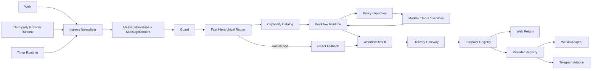

# SparkClaw Agent 总体架构

> 语言：简体中文 | [English](../../docs/router-first-agent-workflow-architecture.md)

状态：已接受的架构基线，2026-07-16 开始实施。本文档定义完整的系统抽象与所有权
边界，不规定单个 Workflow 如何安排步骤、重试、分支或工具。这些内容属于后续
Workflow 专项设计。

## 实施状态

首批实施阶段已经建立后续 Workflow 迁移所依赖的稳定契约，以及消息控制与投递
Runtime：

- 渠道无关的 `MessageEnvelope`、多媒体 `MessageContent`、
  `RouteDecision`、`WorkflowResult` 与投递契约位于 `internal/app`；
- `internal/messageplane` 在 Guard 和意图处理前，把当前 Web 及第三方渠道会话
  规范化为统一消息契约；
- `internal/capability` 持有带版本的默认能力树，逐层拒绝过期、虚构或父子边
  不合法的 Fast 路由结果；
- 当前 Agent 入口使用规范化后的路由文本投影，并审计消息契约版本与能力目录版本。
- `internal/messagecontrol` 在现有状态之上解析 Owner 绑定的 Web/第三方 Endpoint、
  版本化 literal/request Schedule 与 ReturnRoute；
- `internal/delivery` 持有 Delivery Gateway 与 Provider Registry，Adapter 发送前
  必须整体预检有序 `MessageContent`；
- 微信与 Telegram 作为 Provider Registry 下的注册 Adapter，核心投递只按
  Endpoint 类型分流；
- Timer Polling 只 Claim 并入队到期 Schedule，固定 Worker 在 Poll Loop 外发布
  request Envelope 或投递 literal Payload。

旧 Reminder 记录仍可读取，并会投影为 literal Schedule。扩展点、持久化兼容及
剩余集成工作见[消息控制与投递迁移](message-control-delivery-migration.md)。

## 架构决策

SparkClaw 是消息驱动系统，只有一条执行主链：

```text
消息来源
  -> 入站归一化
  -> MessageEnvelope
  -> Guard
  -> Fast 分层路由
  -> 能力叶子
  -> Workflow
  -> WorkflowResult
  -> Delivery Gateway
  -> 返回 Endpoint
```

Agent 只承担交通调度职责。Fast 模型根据已注册能力树识别意图并选择路径，不选择
工具，也不设计执行步骤。

成功匹配能力后启动对应 Workflow。只有没有任何能力匹配时才进入 ReAct 兜底。
已匹配 Workflow 失败时不能转入 ReAct。

Web、第三方设备与 Timer 是同级消息来源。文字、图片、音频/语音和文件是消息
内容类型，不是业务能力。显式发送与普通 Workflow 结果共用同一条投递链。

## 系统模型

```text
SparkClaw
  接口平面
    Web Runtime
    Third-party Provider Runtime
    Timer Runtime

  消息平面
    Ingress Normalizer
    MessageEnvelope
    Multimodal MessageContent

  消息控制平面
    Endpoint Registry
    Schedule Registry
    Return Route Resolver

  Agent 控制平面
    Guard
    Fast Hierarchical Router
    Capability Catalog
    Workflow Registry
    Workflow Dispatcher
    ReAct Fallback

  执行平面
    Workflow Runtime
    Model Runtime
    Tool and Service Registry
    Policy and Approval

  结果平面
    WorkflowResult
    Result Presenter
    Delivery Gateway

  基础设施平面
    State Store
    Event and Work Queue
    Artifact Store
    Credential Vault
    Audit, Trace, Metrics
```

## 端到端拓扑



## 分层职责

| 层 | 负责 | 禁止负责 |
|---|---|---|
| 接口层 | Web 输入、Provider 连接、Timer 触发 | 意图或业务执行 |
| 消息层 | 归一化来源、多模态内容、返回上下文 | Provider 原始 Payload 或工具 |
| 消息控制层 | Endpoint、Schedule、返回路径 | Provider 协议实现 |
| Agent 控制层 | Guard、分层路由、能力与 Workflow 选择 | Workflow 内部编排或工具执行 |
| 执行层 | Workflow Run、模型、工具、服务、Policy、审批 | 消息传输或 Provider 分支 |
| 结果层 | 渠道无关结果、渲染、投递路由 | 重新解释业务目标 |
| 基础设施层 | 持久状态、队列、Artifact、Secret、观测 | 产品路由决策 |

## 接口平面

接口平面包含三种同级来源：

```text
message_source
  web
  third_party_device
  timer
```

### Web Runtime

Web Runtime 接收用户消息并展示 Run、审批与结果状态。它为返回路由创建 Web
Endpoint。Web 专用流式输出和 UI 渲染不进入 Agent 控制平面。

### Third-Party Provider Runtime

第三方设备通过 Provider 无关的 Endpoint 表示。微信、Telegram 和未来系统都是
一个 Provider Registry 下的 Adapter。

Provider Runtime 负责协议连接、Binding、凭据、Polling 或 Webhook、入站确认、
内容上传下载、重试、健康状态和关闭。核心层只看到归一化消息、Endpoint 引用和
Provider Receipt，不根据 Provider 名称分支。

### Timer Runtime

Timer Runtime 是消息生产者，不是提醒引擎。到达指定时间后，它把已保存消息发布
到与 Web、第三方输入相同的工作队列，不在 Poll Loop 中执行领域逻辑。

## 消息平面

所有来源产生同一种 `MessageEnvelope` 抽象：

```text
MessageEnvelope
  身份与幂等信息
  来源上下文
  所有者与实际执行主体
  MessageContent
  ReturnRoute
  授权上下文
  可选 Schedule 引用
```

`MessageContent` 是有序的规范 Part 列表：

```text
MessageContent
  text
  image
  audio
  file
```

语音是带 `voice_note` Disposition 的 Audio Part。语音转写属于入站派生操作，产生
关联来源 Audio 的 Text Part，不属于 Agent 能力。

Ingress Adapter 负责内容校验和归一化。文字保持为有界文本，二进制内容转换为
受治理 Artifact 引用。原始字节、Provider 附件对象、凭据和不受限 Provider
Metadata 不进入路由或 Workflow 状态。

输入、显式发送、Workflow 结果和返回消息使用同一个 `MessageContent` 协议。
目标不支持的 Part 必须明确失败或执行已声明的安全转换，不能静默丢弃。

## 消息控制平面

消息控制平面管理寻址和未来消息创建，其同级资源是：

```text
message_control
  Endpoint Registry
    Web Endpoint
    Third-party Device Endpoint

  Schedule Registry
    One-time Schedule
    Recurring Schedule

  Return Route Resolver
```

Endpoint 包含稳定身份、所有者、类型、Provider/Binding 引用、支持的内容与投递
能力、状态和 Credential 引用。凭据保留在 Credential Vault。

Schedule 包含触发规则、版本化消息 Payload、返回 Endpoint、期望能力族和授权
上下文，不包含浏览器、文件或其他领域实现细节。

Return Route Resolver 决定结果返回来源 Web Endpoint、来源第三方 Endpoint、
用户明确选择的 Endpoint，或不投递。

## Agent 控制平面

### Capability Catalog

Catalog 是版本化的用户可见产品能力树：

```text
capability
  conversation
    answer

  browser
    search
    automation

  file
    discover
    read
    create
    edit
    transform
    delete

  message
    send
    schedule
```

文字、图片、音频和文件不会成为模态分支。图片可以作为 Conversation 输入；语音
请求可以通过 Transcript 路由到 Browser Search；文件根据用户请求的操作路由。

每个内部节点只定义子节点和路由描述。每个叶子只标识一个 Workflow 协议。
Catalog 不定义工具。

### Fast Hierarchical Router

Fast 只能沿已注册父子关系路由。它可以在一次调用中返回多级路径，但 Registry
必须逐边验证。

Router 输出仅包含：

```text
route status: matched | clarify | unmatched | blocked
capability path
typed slots
confidence
deterministic facts
```

Router 不能返回工具名、Workflow 步骤、审批决策或新能力 ID。歧义或缺少必要
信息时返回澄清。

### Workflow Registry 与 Dispatcher

Workflow Registry 将能力叶子映射到版本化 Workflow 协议。Dispatcher 持久化
新 Run 并调用该 Workflow，不重新解释消息。

在总架构层，Workflow 只定义以下边界：

```text
归一化 MessageEnvelope + 已验证 RouteDecision
  -> Workflow
  -> WorkflowResult 或可恢复等待状态
```

Workflow 图结构、步骤类型、内部模型调用、参数绑定、并行、重试、补偿和完成规则
全部延后到 Workflow 专项设计。只要边界稳定，它们可以独立演进而不改变总架构。

### ReAct Fallback

ReAct 只接收路由状态为 `unmatched` 的消息，并拥有独立固定的能力与 Policy 边界。
它不能恢复失败的已知 Workflow、随意创建定时动作或通过 Observation 扩权。

## 执行平面

Workflow Runtime 使用抽象执行端口：

- Model Runtime：有界模型调用；
- Tool and Service Registry：注册能力；
- Policy：精确授权；
- Approval：可见人工确认；
- Artifact Store：受治理二进制内容和大型结果；
- State Store：Run 持久化与恢复。

总架构只要求工具访问受所选 Workflow 约束，并由 Policy 再次校验，不规定
Workflow 如何排列调用。

## 结果与投递平面

每个 Workflow 生成渠道无关的 `WorkflowResult`，包含：

```text
状态
能力路径与 Workflow 身份
结构化结果数据
MessageContent
Citation 与引用
ReturnRoute
恢复或错误状态
```

Result Presenter 可以格式化内容，但不能改变执行状态或调用工具。用户可见文字、
图片、语音/音频和文件都必须作为 Message Part 返回。

显式 `message.send` 与普通 Workflow 结果都会创建 `DeliveryRequest` 并进入
Delivery Gateway。

Delivery Gateway 解析目标 Endpoint，只在两种路径间选择：

- Web：通过持久化和 Web Event/Streaming 投递；
- 第三方：通过 Endpoint 注册的 Provider Adapter 投递。

只有 Provider Runtime 区分微信与 Telegram。执行成功和投递成功是不同状态。

## 主要流程

### 直接消息

```text
Web 或第三方输入
  -> 归一化 MessageEnvelope 与 MessageContent
  -> Guard
  -> Fast 路由到能力叶子
  -> 执行注册 Workflow
  -> 生成 WorkflowResult
  -> 解析 ReturnRoute
  -> 返回 Web 或第三方 Endpoint
```

### 定时消息

```text
用户消息
  -> 路由到 message.schedule
  -> 保存 Schedule(message payload, trigger, ReturnRoute, authorization)

Timer 触发
  -> 发布 Timer 来源 MessageEnvelope
  -> 相同 Guard 与 Fast 路由链
  -> Workflow
  -> WorkflowResult
  -> Schedule ReturnRoute
  -> Web 或第三方 Endpoint
```

定时 Payload 有两种模式：

- `literal`：原样发送已保存的多模态内容；
- `request`：将已保存内容作为新的 Agent 请求重新路由。

因此定时可以复用于浏览器、文件、对话、未来能力，以及直接文字/图片/音频/文件
投递。

## 基础设施平面

基础设施平面提供实现无关的能力：

- State Store：消息、Endpoint、Schedule、Run、Approval 和 Delivery Attempt；
- Event and Work Queue：解耦入站、Timer 触发、执行和投递；
- Artifact Store：二进制内容和大型 Observation；
- Credential Vault：Provider 与外部服务凭据；
- Audit、Trace 和 Metrics：记录每个边界转换。

所有慢速 Workflow 执行都在有界 Worker 中运行，不能占用 Provider Polling 或
Scheduler Loop。幂等覆盖入站消息、Schedule Occurrence、Workflow Run 和投递。

## 依赖方向

```text
Provider Adapter  -> Interface 与 Message 协议
Web Runtime       -> Interface 与 Message 协议
Timer Runtime     -> Message Control 与 Message 协议
Router            -> Capability Catalog 与 Message 协议
Dispatcher        -> Workflow Registry 与 State 端口
Workflow          -> Execution 端口与 Result 协议
Delivery Gateway  -> Endpoint Registry 与 Provider 端口
Infrastructure    -> 实现 Storage、Queue、Artifact、Secret、Telemetry 端口
```

核心协议不依赖具体 Provider、Workflow、工具或存储后端。新增一种实现不能要求在
无关层增加 Switch。

## 横切治理

- Guard 在路由和执行前运行。
- 外部、文件、浏览器和 Provider 内容始终是不可信数据。
- Policy 与 Approval 对直接任务和定时任务保持权威。
- 每次定时执行都重新检查当前授权。
- Provider 凭据和原始 Payload 保留在 Provider Runtime 与 Credential Vault。
- 已匹配能力失败必须明确返回，不能变成 `unmatched`。
- 结果投递不能改变业务结果。
- 恢复使用持久化路由与 Workflow 身份，不重新解释原消息。

## 扩展模型

| 扩展 | 总架构要求 |
|---|---|
| 新业务能力 | 增加 Catalog 叶子和注册 Workflow 协议 |
| 新第三方平台 | 增加一个 Provider Adapter 和 Endpoint Capability 声明 |
| 新消息内容类型 | 扩展 MessageContent、入站、Web 渲染、Provider Conformance 与投递协商 |
| 新定时行为 | 扩展 Schedule 控制协议，不修改领域 Workflow |
| 新工具或服务 | 注册执行端口实现和 Policy 元数据 |
| 新状态后端 | 实现基础设施 Storage 端口 |

## 延后详细设计

本文档刻意不固定以下内容：

- Workflow DSL、DAG/状态机、节点类型、分支、重试、并行、补偿和结果评估；
- Fast Prompt、模型阈值和决策语料格式；
- MessagePart 详细 Schema、大小限制、保留策略和转换；
- 微信、Telegram、Web、语音、浏览器、文件和工具 Adapter 的具体实现；
- 数据库表、HTTP API、部署拓扑和迁移顺序。

这些内容后续可以分别设计，而不改变系统分层与依赖方向。

## 架构验收

满足以下条件时，总架构成立：

- 每种来源都创建同一种归一化消息协议；
- 能力树是 Fast 的唯一可路由词汇；
- 每个匹配叶子都解析到一个 Workflow 协议；
- Workflow 内部不能扩大声明的执行边界；
- 只有未匹配消息可以进入 ReAct；
- 显式发送与 Workflow 结果共用一条投递链；
- Web 与第三方返回由 Endpoint 类型选择；
- Timer 只生产消息，不执行领域逻辑；
- 多模态内容与业务能力正交；
- 具体 Provider 与基础设施后端可以通过端口替换。
