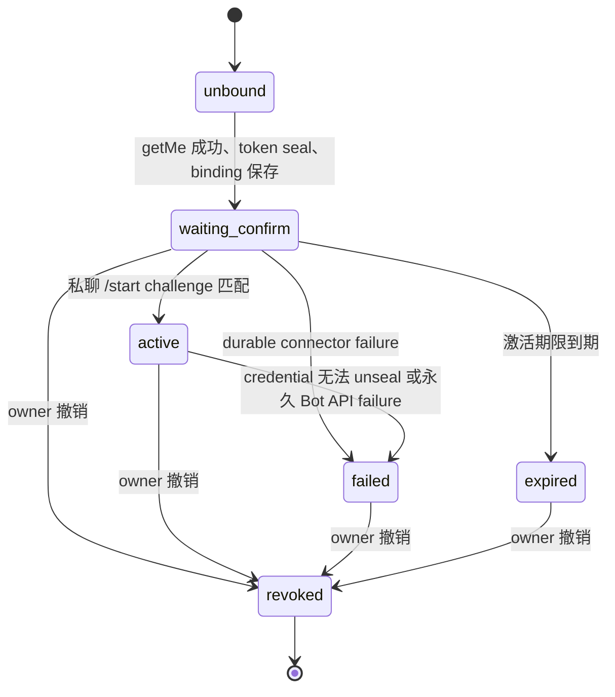

# Telegram Bot 接入设计

> 语言：简体中文 | [English](../../docs/telegram-integration-design.md)

> 状态：Telegram hardening 的规范契约。本工作开始前，仓库基线已有微信通知绑定，但没有生产可用的 Telegram connector。`codex/wip-snapshot-20260714` 中的代码只能选择性恢复，不能作为已完成证据。平台限制已于 2026-07-14 按 Telegram 官方 Bot API 和 Bot FAQ 重新核对。

## 1. 范围与产品边界

Telegram 是现有 SparkClaw Agent Runtime 的 transport adapter，不创建第二套 runtime、policy engine、approval system、workspace 或 speech service。

第一阶段支持范围：

- 每个 active binding 对应一个 SparkClaw owner 拥有的 Telegram 私聊；
- owner 在 WebChat 输入自己创建的 Bot token，Gateway 先通过 `getMe` 验证；
- 入站文字、图片、支持的文档、音频附件和语音；
- 出站文字、workspace-confined 文件和图片、typing 状态、提醒和审批提示；
- long polling、durable inbox、全局有界并发和每 chat 保序；
- 通过 connector-neutral 接口进行本地语音转写；
- 本分支不实现群聊、超级群、频道、Business、inline、支付、公共多租户、webhook、TTS 或真实 speech sidecar。

完成认证和标准化后，入站内容进入与 WebChat、微信相同的 `agent.Runtime.HandleMessageWithAttachments` 路径。微信现有行为必须保持不变。

## 2. 当前基线与选择性恢复

当前分支从以下事实开始：

- `NotificationBinding` 和 binding API 已为微信实现。
- `CredentialSecret.Value` 当前可被 memory、file snapshot 和 PostgreSQL 保存，但没有 connector-specific 加密边界。
- WebChat 会读取 notification channel 配置，但没有服务端权威的 connector capability 模型。
- WIP snapshot 把 Telegram、WebChat voice 和具体 speech package 混在一起，只能恢复 Telegram 相关代码。

实现必须按独立 topic 落地：

1. 本双语设计与验收契约；
2. connector capability 和 binding API 语义；
3. 加密 credential vault；
4. channel-neutral Store 记录和 durable inbox parity；
5. Telegram client、binding、polling、worker、媒体、审批、提醒和恢复；
6. WebChat 交互和窄屏行为；
7. Docker FFmpeg 声明与验证。

本工作线禁止引入具体 speech 实现、WebChat 麦克风采集、speech API route 或 speech sidecar。

## 3. Telegram 官方限制

实现把 Telegram 限制视为外层边界，SparkClaw 配置可以更严格。

| 领域 | Telegram 行为 | SparkClaw 契约 |
|---|---|---|
| 认证 | Bot method 使用包含 token 的 Bot API URL。 | 专用 client 在内部构造 URL；URL、错误、日志、trace 和 metrics 均不得包含 token。 |
| Update | `getUpdates` 与 webhook 互斥；update 最多保留 24 小时。 | 每个 active credential 只运行一个 long poller，本阶段不实现 webhook。 |
| Offset | 当后续 `getUpdates` 的 offset 大于 `update_id` 时，该 update 被确认。 | 每条 update 必须先持久化或确认已存在，再保存 `next_offset=max(update_id)+1`。 |
| Batch | `getUpdates` 接收 1-100 条 update；long polling 应使用正 timeout。 | 默认 100 条、30 秒 poll timeout，HTTP deadline 必须更长。 |
| 下载 | 云端 `getFile` 下载上限为 20 MB，返回的 file path 有时效。 | 声明超限时预先拒绝，并执行不高于 20 MB 的流式 byte cap。 |
| 上传 | 图片上限 10 MB；普通文件、audio 和 voice 当前上限 50 MB。 | 打开 request body 前检查；有效图片不符合 photo 约束时使用 `sendDocument`。 |
| 文字 | `sendMessage` entity parse 后最多 4096 字符。 | 发送纯文本，按稳定顺序切分到 4096 rune 以下。 |
| 限流 | API 错误可能包含 `retry_after`。 | 严格遵守 `retry_after`；其他瞬时失败只做有界指数退避。 |
| Callback query | Telegram client 会等待 `answerCallbackQuery`。 | 先认证并快速 ack，再幂等处理审批。 |

官方参考：[Bot API](https://core.telegram.org/bots/api) 和 [Bot FAQ](https://core.telegram.org/bots/faq)。

## 4. Connector Capability 语义

是否能配置 Telegram 由 Gateway 决定，不能由 WebChat 推断。Public config response 暴露不含 secret 的 connector summary：

```json
{
  "channel": "telegram",
  "provider": "telegram-bot-api",
  "available": true,
  "operator_enabled": true,
  "binding_status": "unbound",
  "startable": true,
  "disabled_reason": ""
}
```

各字段含义不同：

| 字段 | 含义 |
|---|---|
| `available` | 当前 Gateway binary 识别 provider 且 connector 依赖已构造；它不是配置开关。 |
| `operator_enabled` | 来自 `tools.notifications.channels.telegram.enabled` 的唯一 operator kill switch；为 false 时阻止新绑定、polling、入站处理和出站投递。 |
| `binding_status` | 当前 owner 的 Telegram binding 汇总状态：`unbound`、`waiting_confirm`、`active`、`failed`、`expired` 或 `revoked`；不能用它表达 connector 可用性。 |
| `startable` | 服务端计算的当前 start endpoint 调用许可；POST 会重新计算相同条件。 |
| `disabled_reason` | `startable=false` 的稳定机器码，否则为空；UI 负责本地化展示。 |

Disabled reason 优先级为 `connector_unavailable`、`operator_disabled`、`credential_key_unavailable`、`binding_in_progress`、`binding_active`。默认发行配置启用已存在的 Telegram connector；没有 binding 时不会发起任何 Telegram 请求。Operator 可用唯一 kill switch 显式关闭。

Operator-disabled connector 不会让 `/readyz` 失败。已配置 active binding 无法解密 credential 时，connector 状态显示 degraded，且不启动 poller。

## 5. Binding 状态机

虚拟 `unbound` 状态不持久化。持久化 binding 状态为 `waiting_confirm`、`active`、`failed`、`expired`、`revoked`。Token 验证只存在于请求过程中，不保存 `verifying` 状态。



Start 流程：

1. WebChat 只通过 `POST /api/notification-bindings/telegram/start` 发送 token。
2. Gateway 检查 connector `startable`，限制 request size，并校验 token 语法但不回显 token。
3. Gateway 使用有界 client 调用 `getMe`。`getMe` 失败或返回非法 Bot 时，不创建 binding，也不保存 secret。
4. Gateway 生成高熵、一次性的 activation challenge，只保存其 hash 和 expiry。
5. Gateway 在 credential vault 中 seal 已验证 token，获得不含 token 片段和 Bot identity 的随机 `credential_ref`。
6. Gateway 保存 `waiting_confirm` binding，其中仅包含 `credential_ref`、已验证 Bot ID/username、challenge hash、base URL 和 expiry。Binding 持久化失败时删除刚写入的 credential。
7. Gateway 返回 `t.me/<bot>?start=<challenge>` activation URL。Challenge 只在这次 start response 返回，后续 list 不再返回。
8. 只有私聊 `/start <challenge>` update 可以激活 binding。其他用户向公开 Bot 发消息不能抢占绑定。
9. 激活时原子记录 Telegram user ID、chat ID、可选 thread ID，并清除 challenge hash。

撤销必须幂等：停止 polling 和投递，把 binding 标记为 `revoked`，删除其 credential，取消 pending inbox，只保留脱敏 audit history。重启时只为符合条件的 `waiting_confirm` 和 `active` binding 重建 poller。

## 6. 加密 Credential 边界

`NotificationBinding` 只保存 `credential_ref`。Bot token 绝不能以明文写入默认 file snapshot、PostgreSQL、日志、错误、trace、audit payload、metrics、API response、fixture 或 dedupe key。

Connector 在 Store interface 之上使用 `CredentialVault`：

```go
type CredentialVault interface {
    Ready() error
    Seal(ctx context.Context, kind string, plaintext []byte) (ref string, err error)
    Open(ctx context.Context, ref string) ([]byte, error)
    Delete(ctx context.Context, ref string) error
}
```

Vault 使用 AES-256-GCM 和每次随机 nonce，把带版本的 ciphertext envelope 保存到现有 credential store。Store 以及 file/PostgreSQL 实现只能看到 ciphertext 和 metadata。Memory 也使用同一 envelope，使测试覆盖同一边界。

密钥规则：

- 从明确的环境值或配置 key file 加载 32-byte master key；
- 默认本地部署可以在首次接受 binding 前，用加密随机数创建配置的 key file，权限必须为 `0600`；
- master key 不得保存到 state snapshot 或 PostgreSQL；
- 不得暴露提交 token 是否与现有值部分匹配；
- 在可行范围内清零临时 token buffer，WebChat 每次响应后都清空输入；
- key 缺失或不可读为 `credential_key_unavailable`；ciphertext 损坏或 key 错误为 `credential_unseal_failed`；seal/write 失败为 `credential_seal_failed`；
- 这些错误最多包含 credential ref，不得包含 ciphertext、plaintext 或 token-bearing URL。

HTTP client 必须清洗 transport error，因为 Go error 可能包含 request URL。Canary token 测试扫描 API body、日志、audit event、snapshot 和 PostgreSQL value。

## 7. Long Polling、Inbox 与 Worker 边界

Poll loop 只负责 Bot API fetch、durable insert 和 offset persistence：

1. 加载并解密一个 eligible binding credential；
2. 用 `allowed_updates=["message","callback_query"]` 调用 `getUpdates`；
3. 把每条 update 插入 `ChannelInboxUpdate`，唯一键为 `(binding_id, update_id)`；
4. 只有所有 insert 成功或确认 duplicate 后，才在 binding 上保存 `next_offset`；
5. 通知 worker 后立即继续 polling。

Poll loop 禁止下载文件、转换音频、调用 Agent Runtime、发送回复或处理审批。

Inbox 状态为 `pending`、`processing`、`retry_wait`、`completed`、`failed`、`canceled`。Processing lease 使重启后可恢复。Completed record 保留 dedupe metadata，但在 retention window 后删除 raw payload。File 和 memory backend 通过 write-through 操作保持顺序；PostgreSQL 使用 transaction 和 row locking。

Worker 同时遵守两个限制：

- 全局 semaphore 限制所有 Telegram processing；
- keyed queue 串行化 `(binding_id, chat_id, thread_id)`，不同 chat 可并行。

Queue 必须有界。饱和时产生 `queue_full` 和 metrics；若 sender 已认证，则发送明确 busy response。不能无限创建 goroutine。

幂等键：

- transport：`(binding_id, update_id)`；
- inbound message：`(binding_id, chat_id, message_id)`；
- approval callback：opaque callback token 加 action；
- outbound chunk：`(binding_id, source_type, source_id, chunk_index)`。

已完成的 inbound message 不能创建第二个 Agent run。瞬时重试复用已保存 message 和 linked run state。

## 8. 认证与未知用户隔离

认证必须发生在下载、workspace 创建、FFmpeg、转写、Agent call 和 tool call 之前。

- `waiting_confirm` 只接受匹配的私聊 activation challenge。
- `active` 只接受已保存的 Bot credential、Telegram user ID、chat ID 和 thread ID policy。
- 其他 sender 最多得到限流后的通用 unauthorized response，不泄露 identity detail。
- 投递需要的 exact external ID 可以持久化，但 public API 必须脱敏，日志和 metrics 使用 keyed hash。
- 本阶段拒绝群聊和 forwarded-channel message。

认证后，Telegram 文字、caption、文件名、文档、图片和 transcript 仍属于不可信外部 observation。

## 9. 附件与 Voice Adapter

声明的 file size、MIME type、filename 和 extension 只能作为提示。下载必须使用 `getFile`、有界 HTTP client、streaming limit、filename cleaning、exclusive create、content sniffing、workspace confinement，并在任何失败路径清理。

第一阶段支持 `.pdf`、`.docx`、`.xlsx`、`.pptx`、`.txt`、`.md`、`.csv`、`.tsv`。Photo 选择 Telegram 提供的最大可接受尺寸。单条 Agent message 最多五个附件；不支持或超出的项目必须明确说明 partial acceptance 或 rejection。

Telegram 定义最小中立适配点和 disabled stub：

```go
type VoiceTranscriber interface {
    Available(ctx context.Context) error
    Transcribe(ctx context.Context, request VoiceTranscriptionRequest) (string, error)
}
```

该 package 禁止 import 具体 `speech` package。Telegram voice handler 可以通过可取消 FFmpeg subprocess，把 OGG/Opus 标准化为有界 16 kHz mono PCM16 WAV，再调用接口。Stub tests 覆盖 unavailable、success、timeout、malformed output、cleanup 和 cancellation。真实 speech wiring 由 integration branch 负责。

## 10. 出站、审批、提醒与恢复

- 按顺序发送低于 Telegram 上限的纯文本 chunk；
- 每 chat 串行出站，严格遵守 `retry_after`；
- 只解析 registered artifact 或 linked workspace 下 `media/`、`outputs/` 路径；
- 禁止发送任意绝对路径，禁止仅因模型文本提到就重发 upload；
- 使用 opaque approval callback token，验证 binding/user/chat，调用 `answerCallbackQuery`，再幂等处理 Confirm/Cancel；
- Telegram reminder 保存 binding ID 和 `credential_ref`，复用同一 renderer 与 retry 规则；
- revoked 或 operator-disabled binding 的投递以非重试 `binding_unavailable` 失败；
- 重启时重建 poller、回收过期 inbox lease、保留 offset、恢复 retryable delivery，且不重复 completed send。

## 11. 失败语义

API/UI 错误使用稳定 code 和已清洗 message。

| Code | 重试 | 结果 |
|---|---|---|
| `connector_unavailable` | 否 | Provider 未编译或未注册。 |
| `operator_disabled` | 否 | Kill switch 阻止 start、polling 和 delivery。 |
| `credential_key_unavailable` | operator 修复后 | 不开始绑定；现有 binding 可见但停止。 |
| `invalid_bot_token` | 否 | `getMe` 拒绝 token；不持久化任何内容。 |
| `telegram_unreachable` | 有界重试 | Start request 不持久化 token；polling 可重试。 |
| `credential_seal_failed` | 修复后 | 不持久化 binding。 |
| `credential_unseal_failed` | 修复后 | Poller/delivery 停止，binding degraded/failed，且不暴露 token。 |
| `activation_invalid` | 否 | 隔离未知 sender；binding 保持 pending。 |
| `attachment_too_large` / `attachment_unsupported` | 否 | 在允许边界之外不下载、不创建 Agent run。 |
| `voice_unavailable` | adapter 修复前否 | 提示 owner 发文字，不回退云端。 |
| `queue_full` | 是 | 已认证 sender 得到 busy response；update 保持 retryable。 |
| `retry_exhausted` | 需 operator | Inbox/delivery 以 failed 保持可检查。 |
| `binding_unavailable` | 否 | Binding 已 revoked、expired、failed 或 disabled。 |

`429` 且带 `retry_after`、timeout、connection reset 和部分 `5xx` 为瞬时失败。认证失败、malformed success payload、不支持媒体、authorization failure 和 path violation 为永久失败。

## 12. WebChat 交互契约

WebChat 渲染服务端 connector summary，不能因 config object 存在与否自行推断 capability。

- 仅当 `startable=true` 且没有 in-flight request 时启用 token input 和 Bind button；
- 默认 unbound 本地配置必须 startable，修复此前 token/button 永久 disabled 的状态；
- disabled 时在控件旁展示本地化 `disabled_reason`；
- password input 不能预填、持久化、记录日志或在 navigation 后恢复；
- 成功和失败响应后都清空 token；
- `waiting_confirm` 展示已验证 Bot handle、activation link、expiry、refresh/revoke action；
- `active`、`failed`、`expired`、`revoked` 使用 Gateway binding status，禁止本地推断；
- 窄屏下 input 和 action 纵向排列，错误可读换行，icon button 尺寸稳定。

## 13. Store 与 Backend Parity

任何共享 Store interface 变更必须原子落到：

- `memory.go`；
- `file.go` 和 `Snapshot` compatibility decode；
- `postgres.go` schema、query、scan 和 transaction behavior。

默认 file snapshot 只能包含加密 credential envelope。PostgreSQL 只能包含加密 credential envelope。旧的明文 Telegram credential 不做导入；startup 报告 migration/security error 并要求重新绑定。现有微信 snapshot field 保持兼容，微信回归测试必须全绿。

## 14. 验收矩阵

| 领域 | 必需证据 |
|---|---|
| Capability/UI | API tests 覆盖 `available`、kill switch、binding state、`startable` 和每个 `disabled_reason`；desktop 和 narrow WebChat 在默认 unbound 状态可交互。 |
| Token 验证 | `getMe` 先于任何 secret/binding write；invalid/unreachable response 不持久化。 |
| Secret 安全 | Canary token 不出现在 file snapshot、PostgreSQL plaintext query、public API、error、log、trace、audit 和 fixture；binding 只含 `credential_ref`。 |
| Binding auth | 只有私聊 one-time challenge 可激活；replay、wrong user、wrong chat、group chat、expired challenge、revoked binding 均在副作用前拒绝。 |
| Polling | Durable insert 先于 offset；duplicate 被抑制；restart 恢复且不重复 Agent run。 |
| Worker | 同 chat 保序，不同 chat 并行；饱和时仍满足 global/pending limit。 |
| Media | size/MIME/path/partial download/timeout/cleanup 全覆盖；unknown user 不能触发下载。 |
| Voice | 中立 stub 的 success/unavailable/timeout/cancel/cleanup tests 通过；不引入具体 speech package 或 WebChat voice file。 |
| Approval/reminder | Callback auth、duplicate callback、Confirm/Cancel、reminder delivery、retry、revoke 和 restart recovery 通过。 |
| Store | Memory、默认 file、encrypted reload、legacy snapshot compatibility 和 PostgreSQL integration 通过。 |
| Regression | 微信 chat/media/reminder/binding、Gateway full build/vet/tests、WebChat build、doctor、Compose config 和双语 docs check 全绿。 |

完成条件还包括：worktree clean、按 topic 本地 commit、禁止 push，并在最终报告说明根因、设计依据、提交列表、验证矩阵、凭据安全证明和遗留风险。
