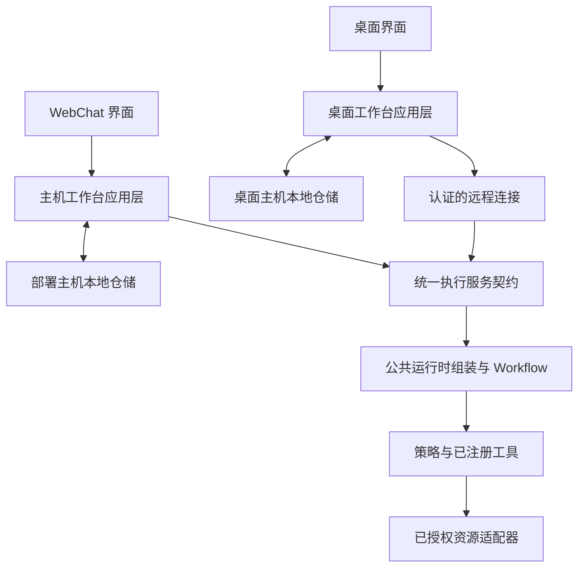

# 工作台与执行服务统一重构方案

> 语言：简体中文 | [English](../../docs/workbench-runtime-convergence-design.md)

> 实施状态（2026-10-06）：第 2 节保留起始源码盘点，第 7 节记录旧名称到当前名称的映射。当前实现、命令与路径以[实施记录](workbench-convergence-implementation.md)和[发布指南](workbench-release.md)为准；文中的原始阶段门禁不构成部署或完整实机验收声明。

日期：2026-10-06。状态：2026-10-08 已从 `codex/workbench-runtime-convergence` 合入本地 `main`；源码验证与发布边界见[实施记录](workbench-convergence-implementation.md)。未执行生产切换。源码基线：本地 `main` 的 `9b92968d`。源码版本不代表运行中服务或已安装应用的版本。

SparkClaw 保留 WebChat 和桌面工作台，两者都拥有本地持久化，并使用相同的业务处理模型。WebChat 的本地数据位于其部署主机，与执行服务同机；桌面端的数据位于桌面主机。物理位置和连接方式不构成两套业务架构。

本方案把已经合并的 R3 实现纳入正常主分支架构：明确归属、统一运行时组装和工作台行为，并把代码、API 和存储命名一起切换到目标设计。它取代早期设计中“WebChat 与 R3 两套模式”的表述，不表示当前两条路径的能力已经完全一致。

用户已确认项目仍在研发阶段，旧设备和现有数据不构成兼容或迁移要求。采用同批交付、全新初始化的一次性切换，不建设旧客户端支持、路由别名、双读双写、历史导入或保留旧数据的升级机制。

## 1. 已确认的产品模型

1. WebChat 和桌面端都是正常支持的工作台部署形态，不把任何一方定义为旧版或特殊产品路径。
2. 工作台本地持久保存会话、消息、草稿、任务历史和用户文件。WebChat 的“本地”指其部署主机，不是打开浏览器标签页的设备；本方案不要求使用浏览器 IndexedDB。
3. 上下文规则、路由、Workflow 执行、有效凭据、工具注册、策略、审批验证和结果语义各有统一事实来源。
4. 邮件仍以邮件服务为权威。工作台缓存与显式保存的附件副本保持各自的数据归属。
5. 交付配套的工作台／服务版本并初始化新存储。研发设备可重新登记，旧安装身份、凭据、历史和交付记录无须延续。
6. 工作台自行调度任务。某次任务到达执行时间时工作台离线，则永久跳过该次执行：不执行，重连／重启后也不补跑或自动恢复。执行服务不托管工作台的未来定时任务。

| 部署形态 | 工作台持久化 | 与执行服务的连接 | 业务模型 |
|---|---|---|---|
| WebChat | 部署主机数据库和文件，与服务同机 | 浏览器通过 HTTP/SSE 访问主机；主机组件可在进程内调用公共服务 | 统一 |
| 桌面端 | 桌面主机数据库和文件 | Renderer 经 IPC 访问 main，再通过认证的 HTTPS/WSS 连接 | 统一 |

多个浏览器标签页访问同一个已授权 WebChat 工作区，仍然看到该工作区的数据。本方案不把每个标签页或访问设备拆成独立数据库。不同桌面安装继续拥有各自的工作台数据。使用相同 Owner 或执行服务，不会新增桌面之间、WebChat 与桌面之间的自动会话复制。

同机部署不授权执行核心任意读取工作台历史或文件。无论同机调用还是远程传输，工作台都通过明确边界提供获准的上下文和资源。统一语义不要求数据库引擎、传输协议、进程或操作系统设施相同。

## 2. 起始实现与差距

下表保留重构前 `9b92968d` 的源码盘点；旧路径与限额属于基线证据，不是当前使用命令。当前路径和初始化见[发布指南](workbench-release.md)。

| 范围 | 当前源码 | 重构差距 |
|---|---|---|
| Web 会话入口 | `gateway/sessions_endpoints.go`、`apps/webchat/src/App.tsx` 及 session hooks | 主机仓储访问与执行编排在入口链路中耦合 |
| 桌面工作台 | `apps/desktop/src/main/client-store.mjs`、`execution-client.mjs`、`apps/webchat/src/desktop/LocalWorkbench.tsx` | SQLite schema 4、本地文件和交付回执已实现，工作台编排仍独立 |
| 执行组装 | `gateway/r3_workflow.go`、`agent/transient.go`、`internal/r3execution` | 两端都调用 Agent Runtime；已安装客户端路径另行构建临时仓储、ToolHub、policy 和 artifacts，并施加独立限制 |
| 凭据 | `agent/transient.go` 及当前集成运行时 | 最近的 Info 修复说明，入口专用组装不能只根据启动配置重新创建提供方 |
| 浏览器宿主 | `internal/r3browser`、桌面 `browser/host-agent.mjs`、Gateway bootstrap | 宿主角色、传输和资源权限需要按长期职责命名 |
| 邮件与定时任务 | `internal/r3mail`、`gateway/r3_schedules.go`、`gateway/schedules.go` | 邮件同步与邮件权威处理职责不同；在线租约任务与常驻定时任务目前存在能力差异 |
| 已发布接口 | `/api/r3/*`、`X-R3-Digest`、桌面请求白名单 | 所有调用方与接收方在同一次切换中替换分支术语 |
| 文档 | `architecture.md`、`store.md`、`webchat.md`、`index.md`、`macos-connection-guide.md` | 部分当前手册仍把已实现桌面能力写成待实现，或要求切换旧分支 |

现有桌面执行有真实约束：有界提交上下文、临时仓储、内存文件系统工作区、受限工具、结果保存后 ACK，以及在线单次定时任务。WebChat 使用主机仓储和既有消息／调度服务。这些都是明确的收敛工作项，改名本身不能消除差异。

历史源码交付、主分支合并、部署与实机验收是不同事实。[实施记录](client-r3-implementation.md)与 [Mac/Linux 验收记录](macos-r3-dual-host-acceptance.md)中的日期、证据及未完成项目继续保留。

## 3. 目标职责

以下职责已通过现有包和适配器实现；具体源码入口与能力边界见实施记录。优先复用已有包和窄接口，避免另建通用框架。

| 职责 | 负责内容 | 边界 |
|---|---|---|
| 工作台应用层 | 会话／任务操作、本地调度、上下文选择请求、呈现状态和结果持久化协调 | 使用仓储和执行连接，不选择工具或授予审批权限 |
| 工作台仓储 | 按范围隔离的会话、消息、文件、任务历史和回执 | WebChat 使用主机 Store 适配器；桌面使用现有 SQLite／文件适配器 |
| 执行服务 | 准入、请求绑定、执行状态、取消、审批续跑和结果交付 | 一个语义契约，不依赖 HTTP、IPC 或进程内入口 |
| 运行时组装 | 公共路由图、模型／提供方运行时、策略构建与工具注册 | 注入执行范围内的仓储、产物和资源，不另建一套业务规则 |
| 连接与资源适配器 | 认证传输、序列化、事件投影、文件传递、浏览器宿主命令 | 保持身份、期限和资源归属，不能提升权限 |
| 权威服务 | 邮件、服务配置、身份／吊销及必要控制记录 | 保持已有类型化领域和跨项目义务 |

主机工作台与执行服务可以继续位于同一个 Gateway 二进制和数据库实例中。通过归属、范围化仓储和调用边界区分职责，不要求新增守护进程、数据库或回环 HTTP 跳转。桌面 main 继续负责秘密和可信本地操作；浏览器 renderer 不获得数据库、文件系统、凭据或宿主授权的直接访问权。

纯契约类型仍放在 `internal/app`，下层包不能导入 Gateway 或前端职责。修改仓储接口时保持 Memory/File/PostgreSQL 实现完整。前端公共行为使用小型仓储／连接接口，由主机与桌面适配；保留可复用组件，不再生成第三套工作台。

## 4. 统一请求与结果语义

1. 发起工作台记录用户的提交意图和稳定请求身份。保存草稿、升级应用不等于提交执行。
2. 范围化仓储适配器取得选定会话上下文和资源清单，由公共选择与预算规则确定准入快照；执行核心不能顺便读取同机的其他数据库或目录。
3. 认证把请求映射到已验证主体和数据范围。准入冻结请求身份、上下文／资源摘要、适用限额及已授权执行设施；传输字段不能自行提供信任。
4. 公共运行时组装针对等价输入与能力选择相同 Workflow 和策略。两种入口都使用 Settings 当前有效凭据、提供方代次和取消行为。
5. 审批始终针对原始不可变操作，由用户显式作出决定。缓存的审批展示或客户端提交的 assistant 消息不能授权执行。
6. 结果经过验证并在发起工作台持久提交后，才能确认交付。主机本地仓储事务可以提供与远程客户端保存／ACK 相同的语义回执，无须人为下载后再上传。
7. 恢复查询原请求。响应丢失、重连、应用升级或传输切换不能自动重放结果不明的外部副作用。

领域执行状态与传输／持久化状态分开：执行完成不等于结果已保存，界面断连不等于执行失败。本地原子写与远程文件清单实现相同的完整性要求；数据跨资源边界时核验文件大小和摘要。

现有桌面预算和未交付结果 24 小时到期规则，在独立且经过验证的行为变更前仍作为基线。确定公共限额前盘点两条路径；桌面 envelope 的 16 KiB 输入、96 KiB 上下文限制不自动成为公共产品策略。最终限额需要明确记录并验证。流式和轮询可以采用不同呈现方式，但对完成、审批、取消和持久交付的含义必须一致。

## 5. 持久化归属与生命周期

| 数据 | 逻辑权威 | 位置与生命周期 |
|---|---|---|
| 会话、消息、草稿、任务历史、已保存文件和显示结果 | 发起工作台 | WebChat 位于部署主机本地，桌面端位于桌面本地；按范围访问，明确保留规则 |
| 定时定义与执行轮次记录 | 发起工作台 | 本地调度器仅提交在线时到期的轮次，错过轮次保持跳过、不补跑 |
| 临时输入、工具工作区与执行中间内容 | 执行范围 | 有界生命周期，完成／取消／到期清理；不另建无界正文归档 |
| 未交付结果包 | 交付服务 | 保持当前绝对到期规则，持久回执到达后提前清理；重试不延长保留期 |
| 邮件原文、附件、采集状态和服务摘要 | 邮件服务 | 后端权威；本地缓存可重建，显式附件副本归工作台 |
| 设备凭据、部署身份、吊销与最小执行防重记录 | 服务控制域 | 持久运行状态；独立于工作台历史和临时内容清理 |
| 浏览器 Profile 与命令日志 | 获得授权的宿主／资源域 | 保留宿主身份、页面代次、不确定写入防重记录及既有保留义务 |

WebChat 在部署主机保存的会话正文属于工作台本地持久化。与服务处于同一台机器，不会把它变成执行服务归档，也不会使其受到临时结果清理规则影响。桌面会话的归属也不会因共用运行时而回到中心共享历史库。

按目标归属分类仓储、表和目录，然后初始化全新的研发存储。不建设历史导入、旧 ID 映射、从旧研发数据升级 schema、双读双写或兼容路径查找。数据库引擎和有用的仓储实现可以复用，无须延续其中的旧内容。

物理路径随代码一起改名：`userData/client-r3` 改为 `userData/workbench` 等中性工作台位置，`.r3` 执行根目录改为归属明确的执行目录。最终路径写入部署配置和文档。不保留 `.r3` 别名，也不在初始化失败时静默打开旧根目录。按需要为新研发部署创建新的设备／安装身份、凭据、交付状态和浏览器日志。

实际切换时，停止旧准入，并停止或排空自有 worker，再启用配套的新服务和工作台。不导入或重放旧排队任务、交付 ACK 和浏览器命令。明确部署身份和凭据范围，避免旧进程向全新执行状态提交。初始化范围限定于 SparkClaw 研发资源；外部服务及受契约约束的台账遵循第 11 节。

全新初始化属于发布切换，不是日常启动行为。切换后创建的数据仍须跨正常重启保存，运行时防重、持久回执、到期和不确定写入处理仍是必要能力。本次文档修改不执行数据删除或设备重置。

## 6. 实际行为收敛

| 范围 | 统一规则 | 需要明确处理的现有差异 |
|---|---|---|
| 上下文 | 统一选择／预算策略和不可变准入输入 | WebChat 读取历史，桌面提交有界消息；抽取公共规则时保留语义 |
| 运行时与凭据 | 有效提供方、策略和工具共用组装路径 | 消除重复提供方构建，保留执行范围状态和资源清理 |
| 工具可用性 | 根据已验证权限与实际资源确定 | 不能取两端工具并集来取消桌面限制；未支持能力在验收前继续明确报告 |
| 定时任务 | 工作台本地定义和触发，到期离线的轮次永久跳过 | 工作台任务的后端未来租约改为本地调度提交；WebChat 调度器位于主机工作台服务，桌面调度器位于 main，统一遵循下述规则 |
| 浏览器控制 | 相同工具语义和显式宿主／资源授权 | 桌面对话专属内嵌页面与后端采集仍是不同角色，不能静默替换宿主 |
| 邮件 | 共用权威服务与版本语义 | 主机访问与桌面缓存同步使用不同交付适配器，不重复启动采集器 |
| 界面与事件 | 共用领域状态和工作台行为 | 收敛 hooks 与投影时保留 WebChat 流式响应、桌面状态对账 |

资源可用性和权限是可信组装输入，不是用户可切换的“Web／桌面业务模式”。不在路由、策略和 Workflow 中散布 `isR3`／`isDesktop` 分支；原生界面和平台代码仍可识别平台。不能用任意可配置执行 profile 掩盖尚未解决的产品规则。

目标是输入、权限和资源等价时业务行为等价。操作系统设施或在线资源不同时，应报告实际能力并明确生命周期。不能为了共用较小的一套实现而直接删去现有功能。

### 6.1 工作台调度与错过执行

本节调度规则已经用户确认。定义、下次执行时间和执行轮次记录属于发起工作台仓储。工作台调度器决定何时提交普通执行请求，公共 runtime 仍负责业务解释和执行。定时任务的创建／修改／取消通过工作台仓储边界完成，不把未来上下文或任务交给执行服务的计时器托管后自主提交。

“在线”指任务所属的工作台调度器正在运行，并能通过已认证执行连接提交请求。WebChat 对应部署主机上的工作台服务，不以浏览器标签页是否打开为准。桌面端对应 main 进程及其可用连接；隐藏窗口可以保持在线，进程退出、休眠或断连则可能离线。

| 该轮次到达执行时间时的条件 | 必须行为 |
|---|---|
| 工作台在线且可以提交执行 | 原子认领该轮次，记录唯一请求 ID，通过普通执行链路提交 |
| 工作台离线、休眠、停止或无法提交 | 不执行；本地仓储下次可访问时记为 `missed`，不放回可执行队列 |
| 重连／重启发现已过期且从未提交的轮次 | 标记错过，不改成当前时间执行、不重放、不要求后端补跑 |
| 到期提交的响应丢失 | 对账已记录请求 ID，不因结果不明创建另一次执行或重试已错过轮次 |
| 未来轮次尚未到期 | 保留定义，到它自己的未来执行时间再判断工作台是否在线 |

循环任务按轮次应用规则：错过轮次永久跳过，只允许未来轮次继续到期执行。不积压待补跑队列，也不因一次错过取消所有未来轮次。用户以后显式发起执行属于新请求，不是跳过轮次的自动恢复。

调度器持续在线期间的正常计时派发抖动，不属于离线恢复宽限期。实现必须区分在线到期派发、启动／重连扫描、休眠唤醒和不可用间隙，不能执行所有 `due_at <= now` 的记录。使用持久轮次身份和互斥认领，避免多个 WebChat 标签页、worker tick 或进程重启重复提交。已获准执行的请求按正常取消／结果对账规则处理；本决定不增加离线继续执行保证，也不允许自动重新提交。

移除工作台调度使用的 `/api/r3/schedules/*` 租约登记／续租／取消接口、桌面对应续租循环，以及替工作台提交未来任务的后端计时器。主机侧定时 CRUD 可以继续作为 WebChat 工作台仓储适配器，到期任务使用公共执行 API。邮件采集和受契约约束的外部调度属于独立服务职责，不因这条工作台规则移动或删除。

## 7. 代码命名与 API 统一

新命名使用业务职责。下表记录从起始源码到当前实现的已完成映射。

| 基线名称 | 已实现方向 |
|---|---|
| `internal/r3execution` | `internal/execution`，负责已准入工作和结果交付 |
| `internal/r3browser` | `internal/browserhost`，负责宿主 broker、传输与授权 |
| `internal/r3mail` | `internal/mailsync`，与 `emailmanagement` 分工 |
| `gateway/r3_*.go`、`WithR3*`、`registerR3*` | 按职责命名的 handler 文件、option 和注册函数 |
| `authorizedR3Fetch`、R3 错误文案 | 执行／邮件传输 helper 与领域错误信息 |
| `qualify:desktop-r3` | 体现实际原生宿主覆盖范围的验收名称；不能直接并入覆盖范围不同的既有桌面验收套件 |
| R3 工作台注释与产品文案 | 工作台、执行服务、宿主和连接术语 |

保留真实版本标识：Workflow/profile 的 `r3` 修订号、schema 版本、`sparkclaw-connect-v1`、历史验收编号和冻结的外部协议不属于分支名称清理对象。来自分支代号的持久路径在本次切换中改名。维护经过审查的真实修订号／历史／外部引用清单，不追求搜索结果中零 `r3`。

当前正式路由采用 `/api/v1` 加职责资源，不绑定 R3 或 desktop 命名空间：

| 已移除路由族 | 当前正式路由族 |
|---|---|
| `/api/r3/installations` | `/api/v1/installations` |
| `/api/r3/inputs/...` | `/api/v1/inputs/...` |
| `/api/r3/executions/...` | `/api/v1/executions/...` |
| `/api/r3/mail/...` | `/api/v1/mail/...` |
| `/api/r3/hosts/...` | `/api/v1/browser/hosts/...` |
| `/api/r3/schedules/...` | 删除未来租约接口；工作台本地调度通过 `/api/v1/executions` 提交到期任务 |
| `X-R3-Digest` | `X-SparkClaw-Digest` |

正式产品路由与调用方已同批实现，旧路由不可用；这不改变任何已接受外部契约。工作台定时 CRUD 属于其主机 API 或桌面 IPC 适配器，不需要新增后端未来租约 API。既有 `/api/sessions/*` 工作台 CRUD 和消息投影不会自动成为执行提交接口的别名。盘点全部调用方后确定其长期资源布局；无关 `/api/*` 表面不要求同时迁移版本。

研发阶段采用一次性配套切换：

1. 一起替换路由注册、digest header、客户端、可信 main 白名单、renderer 限制、WSS／代理配置、fixture 和文档。只实现目标协议，删除旧 `/api/r3/*` handler 和 `X-R3-Digest` 支持，不保留别名、重定向或回退传输。
2. 服务、WebChat 和桌面端使用配套的目标源码版本构建和部署，随后初始化目标存储并登记研发设备。不要求旧新版本兼容矩阵或已安装客户端分批升级。
3. 端到端验证新 HTTP/WSS 契约。已退出路由和 header 不能执行工作；不支持的版本明确失败，不启用兼容逻辑或换路由重试写操作。
4. 删除只服务于旧传输的 serializer、parser、脚本和测试；保留并改写面向新契约的业务语义测试，包括摘要验证和不重放结果不明的写操作。

认证通过已验证主体／范围映射统一。目标仍包含已登记桌面设备的 installation 绑定、WebChat 工作区认证访问、吊销、TLS／证书固定和浏览器授权；无须保留旧设备身份和凭据。同机不产生免凭据特例；不能恢复已撤回的 WebChat 免凭据设计，也不能为每个浏览器标签伪造安装身份。

## 8. 文档职责

| 文档 | 最终职责 |
|---|---|
| README 与 `docs/index.md` | 当前能力与正常部署入口；无需了解 R3 历史即可理解统一模型 |
| `docs/architecture.md` | 工作台／执行／权威服务边界、两种持久化落点和实际收敛状态 |
| `docs/store.md` | 逻辑归属、仓储实现、清理与备份边界；区分工作台数据和临时执行状态 |
| `docs/webchat.md` 与桌面指南 | 相同业务模型及具体存储／连接适配方式 |
| `docs/development.md` | 稳定代码入口、扩展规则和验证矩阵 |
| `docs/deployment.md` 与 Mac 连接指南 | 主分支命令、受支持产物、连接条件和准确部署证据 |
| R3 设计与验收记录 | 带日期的理由与证据，链接当前指南；保留未完成验收及历史哈希 |

中英文镜像同批修改。根据当前源码纠正过时的“未实现”，不能直接改成“全部验收通过”。区分已实现、在记录版本上已部署、已通过硬件验证。现行操作步骤不应要求切到 `codex/sparkclaw-r3`。

## 9. 实施阶段与退出条件

机械移动、行为改变和协议／存储切换分开提交，同批作为配套研发版本交付。实施前建立受影响范围的基线，记录原有失败，避免当成重构回归。

| 阶段 | 工作 | 退出条件 |
|---|---|---|
| 0 盘点 | 梳理两条请求链、调用方、身份、仓储、保留期、限额、调度和资源权限；核对中枢契约 | 每个差异归类为传输／存储实现、需保留能力或明确行为变更；确定目标命名和全新初始化范围 |
| 1 当前文档 | 整理主分支架构、存储归属、入口指南和部署步骤 | 不阅读 R3 历史也能理解当前产品；待实施／待验收状态明确 |
| 2 公共组装 | 抽取公共运行时／凭据／策略／工具组装及窄的工作台持久化／上下文／结果接口 | 等价请求使用公共业务规则，既有资源、保留期和取消边界通过回归 |
| 3 工作台收敛 | 会话／任务／审批／结果公共行为通过主机与桌面适配器接入；实现本地调度及到期离线永久跳过，其余阶段 0 差异分别以行为提交解决 | 两个存储落点通过公共行为套件；离线调度遵循第 6.1 节，保留其他 WebChat 能力和桌面数据归属 |
| 4 中性命名与直接切换 | 重命名符号、套件和存储路径，替换 API／header 并更新全部调用方 | 配套工作台／服务版本通过；无旧路由、别名、迁移代码或不确定写入重放 |
| 5 发布与收尾 | 验证桌面安装包、主机部署及全新初始化，发布当前指南，删除退出的实现 | 记录精确版本／产物哈希、验证结果和版本恢复过程；仅保留审查过的修订号／历史／外部 R3 引用 |

本次重构直接采用中性存储路径和全新初始化，数据迁移与旧设备支持不在范围内。各阶段结束时更新实施／验证记录，不能仅凭本设计宣称完成。

## 10. 验收与版本恢复

同一组行为场景分别通过两个持久化适配器执行。比较领域效果和状态转换，不要求模型生成文案或传输 envelope 字节完全相同。

| 场景 | 必要证据 |
|---|---|
| 新存储与访问 | 两种工作台在目标路径初始化，新建历史／文件跨正常重启保存；WebChat 标签页共享已授权工作区，不跨工作台复制历史 |
| 等价对话 | 等价范围内的历史／输入／资源选择相同 Workflow 和策略，上下文遵守公共预算规则 |
| 有效凭据 | Settings 变更在两种入口生效；执行中代次变化一致取消；不只依赖启动凭据 |
| 审批 | 保留原工具／参数／摘要与范围；拒绝／取消阻止执行，恢复的展示快照不能授权 |
| 交付 | 文件损坏、磁盘满、事务失败、ACK 丢失不产生虚假持久成功；重试查询／复用原请求与回执 |
| 恢复 | 断连／重启／吊销不重放不确定写入；切换后请求防重记录跨服务正常重启保存；旧任务不导入全新状态 |
| 资源生命周期 | 桌面内嵌页面归属与后端采集角色保持独立；旧代次、资源丢失和结果不明的浏览器写操作继续受控 |
| 调度 | 在线轮次只提交一次；关闭 WebChat 标签不停止主机调度器；到期离线、休眠唤醒及重启／重连均不补跑错过轮次；循环任务未来轮次仍可执行；不保留后端工作台租约计时器 |
| 直接切换 | 配套新工作台／服务的 HTTP/WSS 入口可用；旧路由／header 不能执行；不发生旧路径回退或历史迁移 |
| 保留期 | 临时清理不能删除任一工作台本地历史；结果绝对到期；邮件和必要外部台账遵守原契约 |
| 文档 | 双语镜像与本地链接通过；当前指南符合源码、部署证据和剩余验收范围 |

代码实施各阶段运行受影响的 Go／desktop／WebChat 测试。完成时需要工程基线要求的 Go build／vet／全量测试、适用 race 检查、桌面／WebChat 测试和构建、相关原生验收、新 API／全新初始化检查及双语文档检查。判断 ToolHub 失败前安装已声明文档工具依赖。覆盖默认 file 后端及受影响的 Memory／PostgreSQL 路径。源码验证结果见实施记录；本次变更不包含生产部署。

研发版本失败时，停止该版本，恢复一组配套工作台／服务构建并使用适合该版本的全新研发数据，或继续修复。不建设跨版本 schema 恢复或旧设备兼容。替换环境前停止或取消自有工作；结果不明的外部副作用仍保持不明，重置后不能重放旧任务。选定版本内部的日常运行恢复仍使用其持久请求／回执记录。

## 11. 跨项目边界与协调

本方案提出 SparkClaw 内部收敛，不改变已接受的 JingSi Runtime、App-CLI BrowserHost／Registry、IMMS evidence 或外部 MCP 契约，包括必要正文保留、身份和防重义务。这些调用方不会自动迁移到工作台交付模型。邮件、Connector 和外部任务的生命周期应与工作台本地历史分别盘点。

影响其他项目或外部契约前，按根目录 AGENTS 协议检查 InfiniCenter 契约和待评审事项，立案并达到 accepted，再同时更新契约与验收。对外可见进度记录到 `clusters/ProjectGroup-2/status/sparkclaw.md`。

阶段 0 协调复核（2026-10-06）：已通过已知 Linux 主机访问 `/home/infinimesh/InfiniCenter`，读取簇注册表、中枢 C0001、JingSi／App-CLI／IMMS 已接受契约；SparkClaw inbox 为空。已向 0031 追加 SparkClaw 评审，0031 仍为 proposed。本次实施只改变内部工作台行为，不修改外部 schema、结果／事件留存、journal 或 evidence 义务；该范围不要求对端代码跟进。
